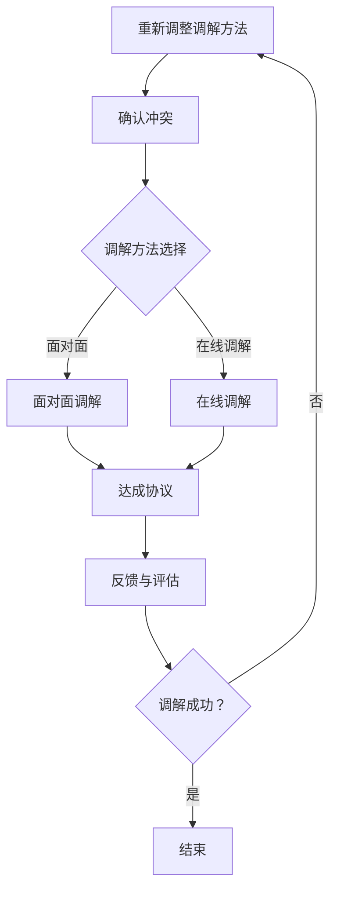

                 

### 文章标题

# 如何进行有效的团队冲突调解

在IT领域，团队协作是项目成功的关键。然而，随着团队成员的多样性和项目复杂性的增加，冲突在所难免。有效的团队冲突调解不仅能够缓解紧张情绪，还能提高团队效率和项目质量。本文将深入探讨如何进行有效的团队冲突调解，帮助团队领导者和技术专家解决团队内部的冲突，促进和谐合作。

## 文章关键词

- **团队冲突**  
- **冲突调解**  
- **团队管理**  
- **沟通技巧**  
- **冲突类型**  
- **调解策略**  
- **团队绩效**

## 摘要

本文旨在为IT领域的团队领导者和技术专家提供一套系统化的团队冲突调解方法。通过分析团队冲突的类型和根源，探讨调解的理论基础和核心算法原理，文章将介绍一系列有效的调解策略和沟通技巧。此外，文章还将通过实战案例分析，提供具体的冲突调解方法和应对策略，最终展望团队冲突调解的未来趋势，为团队管理者提供实用的指导和建议。

### 目录大纲

```markdown
# 如何进行有效的团队冲突调解

## 第一部分：理解团队冲突调解

### 第1章：团队冲突调解的重要性
#### 1.1 冲突调解在团队管理中的作用
#### 1.2 冲突调解对团队绩效的影响
#### 1.3 有效调解团队冲突的原则

### 第2章：团队冲突的类型与根源
#### 2.1 团队冲突的类型
#### 2.2 冲突的根源分析
#### 2.3 常见冲突案例分析

### 第3章：团队冲突调解的理论基础
#### 3.1 冲突调解的理论模型
#### 3.2 冲突调解的心理学基础
#### 3.3 社会学视角下的冲突调解

## 第二部分：团队冲突调解的策略与方法

### 第4章：冲突调解的沟通技巧
#### 4.1 倾听与表达的技巧
#### 4.2 情绪管理的策略
#### 4.3 提升沟通效率的方法

### 第5章：团队冲突调解的流程与步骤
#### 5.1 冲突调解的启动
#### 5.2 冲突调解的协商与调解
#### 5.3 冲突调解的结果评估与反馈

### 第6章：团队冲突调解的工具与资源
#### 6.1 冲突调解工具的选择
#### 6.2 冲突调解资源的准备
#### 6.3 冲突调解团队的支持系统

## 第三部分：实战案例分析

### 第7章：成功调解案例解析
#### 7.1 案例一：跨部门冲突调解
#### 7.2 案例二：领导与下属的冲突调解
#### 7.3 案例三：团队成员间的个人冲突调解

### 第8章：冲突调解的挑战与对策
#### 8.1 常见调解障碍分析
#### 8.2 应对调解挑战的策略
#### 8.3 持续改进与反馈机制

### 第9章：团队冲突调解的未来趋势
#### 9.1 冲突调解的新发展
#### 9.2 技术创新对冲突调解的影响
#### 9.3 团队冲突调解的最佳实践

## 附录
### 附录A：冲突调解术语表
### 附录B：冲突调解案例库
### 附录C：冲突调解工具推荐
```

### Mermaid 流程图



### 核心算法原理讲解

## 冲突调解的核心算法原理

冲突调解的核心算法主要涉及冲突识别、分析、评估和解决方案生成。以下是一个简化的算法流程：

### 算法流程

1. **冲突识别**：
   - **输入**：团队成员反馈、会议记录、项目文档
   - **处理**：使用文本挖掘技术提取冲突关键词和主题

2. **冲突分析**：
   - **输入**：冲突识别结果
   - **处理**：通过冲突类型分类器分析冲突的属性和严重性

3. **冲突评估**：
   - **输入**：冲突分析结果
   - **处理**：使用评估函数计算冲突的影响和解决成本

4. **解决方案生成**：
   - **输入**：冲突评估结果
   - **处理**：生成可能的调解方案，包括妥协、解决和回避策略

### 伪代码

```python
def conflict_resolution_algorithm(conflicts):
    # 冲突识别
    conflict_keywords = extract_keywords(conflicts)
    
    # 冲突分析
    conflict_attributes = analyze_conflicts(conflict_keywords)
    
    # 冲突评估
    conflict_scores = evaluate_conflicts(conflict_attributes)
    
    # 解决方案生成
    solutions = generate_solutions(conflict_scores)
    
    return solutions
```

### 数学模型和数学公式

#### 冲突影响评估模型

$$
I(C) = w_1 \cdot S(C) + w_2 \cdot C(C)
$$

- **$I(C)$**：冲突影响得分
- **$S(C)$**：冲突严重性得分
- **$C(C)$**：冲突成本得分
- **$w_1$** 和 **$w_2$**：权重系数，用于平衡严重性

### 引言

在当今的IT领域，团队协作是项目成功的关键。团队成员来自不同的背景，拥有不同的技能和观点，这使得团队合作充满活力，但也带来了挑战。团队冲突是不可避免的，它可能源于任务分配、工作进度、资源分配、意见分歧或沟通不畅。如果这些冲突得不到妥善处理，可能会影响团队士气、降低工作效率，甚至导致项目失败。

有效的团队冲突调解是团队管理中至关重要的一环。它不仅能够缓解紧张情绪，防止冲突升级，还能提高团队效率和项目质量。本文旨在为IT领域的团队领导者和技术专家提供一套系统化的团队冲突调解方法，帮助他们在面对冲突时能够迅速采取行动，促进和谐合作。

本文将首先介绍团队冲突调解的重要性，探讨团队冲突的类型与根源，接着深入分析团队冲突调解的理论基础。随后，我们将介绍一系列团队冲突调解的策略与方法，包括沟通技巧、调解流程和工具资源。通过实战案例分析，我们将展示如何在实际工作中应用这些策略和方法。最后，我们将展望团队冲突调解的未来趋势，为团队管理者提供实用的指导和建议。

### 第一部分：理解团队冲突调解

#### 第1章：团队冲突调解的重要性

1. **团队冲突调解在团队管理中的作用**

团队冲突调解在团队管理中起着至关重要的作用。首先，它有助于维持团队的稳定和和谐。团队成员之间难免会出现意见分歧和摩擦，有效的调解能够帮助团队化解矛盾，避免冲突升级，从而保持团队的稳定。其次，冲突调解能够提高团队工作效率。当团队成员之间的冲突得到及时解决，他们可以更专注于工作，提高工作效率。此外，冲突调解还能够增强团队凝聚力。通过共同面对冲突并找到解决方案，团队成员能够更好地理解彼此，增进信任，增强团队的凝聚力。

2. **冲突调解对团队绩效的影响**

冲突调解对团队绩效有着显著的影响。首先，有效的冲突调解能够提高团队的工作效率。当团队成员之间的冲突得到妥善处理，他们能够更专注于项目任务，避免因冲突而分散精力。其次，冲突调解能够提升团队士气。团队成员在感受到管理者对冲突的关注和处理能力时，会更加信任和尊重管理层，从而提高士气。此外，冲突调解还有助于改善团队的工作氛围。一个和谐、无冲突的工作环境能够激发团队成员的创新思维和工作热情，进一步推动团队绩效的提升。

3. **有效调解团队冲突的原则**

要实现有效的团队冲突调解，需要遵循以下原则：

- **公正性**：在调解过程中，应确保对所有团队成员公平对待，不偏袒任何一方。公正性是调解成功的关键，有助于维护团队的信任和尊重。
- **透明性**：调解过程应保持透明，让所有相关方都了解调解的进展和结果。透明性有助于增加调解的公信力，减少误解和猜测。
- **倾听与沟通**：有效的沟通是调解的核心。调解者需要耐心倾听各方意见，充分理解他们的立场和需求。同时，调解者还需要清晰、准确地表达自己的观点和建议。
- **寻求共识**：调解的目标是寻求各方都能接受的解决方案，而不是简单地压倒一方。调解者需要引导各方找到共同点，达成共识。
- **及时性**：冲突调解应尽可能及时进行，避免冲突持续发酵，造成更大的负面影响。

通过遵循以上原则，团队领导者和技术专家可以更有效地调解团队冲突，促进团队和谐与合作。

#### 第2章：团队冲突的类型与根源

1. **团队冲突的类型**

团队冲突可以根据不同的标准进行分类。以下是一些常见的团队冲突类型：

- **任务分配冲突**：团队成员对于任务分配的不满，可能由于任务过重或分配不公导致。这种冲突通常源于资源分配不均或管理者未能充分考虑团队成员的能力和需求。

- **意见分歧冲突**：团队成员在项目决策或技术选择上存在不同意见，可能导致冲突。这种冲突可能源于团队成员对项目目标的理解不同，或者对技术方案的看法不一致。

- **沟通不畅冲突**：由于沟通不畅，团队成员可能产生误解和猜疑，导致冲突。这种冲突可能源于信息不对称、沟通渠道不畅或沟通方式不当。

- **角色冲突**：团队成员在角色职责和权限上的模糊或重叠，可能导致冲突。这种冲突可能源于团队结构不合理或角色定位不明确。

- **人际关系冲突**：由于个人性格、价值观或工作风格的不同，团队成员之间可能产生摩擦，导致人际关系冲突。这种冲突可能源于团队合作中缺乏有效沟通和冲突调解机制。

2. **冲突的根源分析**

团队冲突的根源多种多样，以下是一些常见的冲突根源：

- **任务复杂性**：随着项目任务的复杂度增加，团队成员可能面临更多压力，容易引发冲突。任务复杂性可能导致任务分配不公或角色职责不清，从而引发冲突。

- **团队结构**：不合理的团队结构可能导致团队成员之间的角色职责不清，增加冲突的可能性。例如，跨部门合作时，部门之间的利益冲突可能导致项目延误。

- **沟通障碍**：沟通不畅是引发团队冲突的常见根源。团队成员之间的信息不对称、沟通渠道不畅或沟通方式不当都可能导致误解和冲突。

- **个人性格与价值观**：团队成员的个人性格和价值观差异可能导致合作中的摩擦。例如，一个团队中可能存在不同工作风格和价值观的成员，这可能导致冲突。

- **管理风格**：管理者在处理团队冲突时的风格和方式也可能影响冲突的发生。一些管理者可能倾向于压制冲突，导致问题长期积累；而另一些管理者可能过于宽松，未能及时解决冲突。

3. **常见冲突案例分析**

以下是一些常见的团队冲突案例分析，以帮助团队领导者和技术专家更好地理解和应对冲突：

- **案例一：任务分配冲突**

在一个软件开发项目中，由于项目进度紧张，团队成员小张负责的任务量大幅增加。小张感到压力巨大，而项目管理者并未及时调整任务分配，导致小张的工作质量下降。其他团队成员也开始感到不满，认为小张未能承担应有的责任。这种任务分配冲突最终导致团队士气低落，项目进展受阻。

解决策略：项目管理者应定期评估任务分配的合理性，及时调整任务量。同时，可以引入工作进度汇报机制，让团队成员了解整体工作情况，减少误解。

- **案例二：意见分歧冲突**

在一个技术方案选择过程中，团队成员小李主张采用一种较为新颖的技术方案，而团队领导老王则倾向于采用一种传统的方案。双方在技术方案的选择上存在较大分歧，导致会议气氛紧张，决策进展缓慢。

解决策略：管理者可以组织一次技术方案评估会议，让各方充分表达意见，并通过讨论找到共同点。管理者还可以邀请第三方专家提供中立的意见，帮助团队达成共识。

- **案例三：沟通不畅冲突**

在一个跨部门项目中，由于部门之间的沟通不畅，导致项目进度一再延误。部门A与部门B在任务交接时出现了误解，导致任务未能及时完成。部门C因此受到了影响，影响了整个项目的进展。

解决策略：项目管理团队可以建立跨部门沟通机制，定期召开项目进度会议，确保各部门之间的信息共享和沟通畅通。此外，可以采用项目管理工具，如协作平台或邮件通知，确保信息传达的准确性和及时性。

通过以上案例分析，我们可以看到，不同类型的团队冲突需要不同的解决策略。团队领导者和技术专家需要具备敏锐的洞察力，及时发现并应对冲突，以维护团队的稳定和合作。

#### 第3章：团队冲突调解的理论基础

1. **冲突调解的理论模型**

冲突调解的理论模型是理解冲突调解过程的重要工具，它为调解提供了框架和方法。以下是一些常用的冲突调解理论模型：

- **五阶段模型**：该模型将冲突调解分为五个阶段：准备阶段、识别阶段、干预阶段、解决阶段和评估阶段。

  - **准备阶段**：确定调解目标，准备调解材料，如会议日程、调解指南和参与者名单。
  - **识别阶段**：识别冲突各方，了解他们的需求和立场。
  - **干预阶段**：通过提问、引导对话等方式，促进各方的沟通和了解。
  - **解决阶段**：寻求共识和解决方案，确保各方都能接受。
  - **评估阶段**：评估调解结果，总结经验教训，为未来的调解提供参考。

- **三角调解模型**：该模型强调调解过程中的权力动态，包括调解者、冲突方和外部环境三个要素。调解者需要平衡各方的权力，确保调解的公正性。

- **互动调解模型**：该模型强调冲突调解中的互动过程，包括沟通、协商和解决问题。调解者需要引导各方进行有效的沟通，找到共同点，达成解决方案。

2. **冲突调解的心理学基础**

冲突调解的心理学基础是理解人类行为和心理状态的重要依据。以下是一些关键的心理学概念：

- **情绪管理**：情绪管理是冲突调解中的核心内容。调解者需要帮助冲突各方识别和管理情绪，避免情绪激化冲突。常见的情绪管理策略包括情绪识别、情绪表达和情绪调节。

- **自我意识**：自我意识是理解他人行为的重要前提。通过提高自我意识，调解者可以更好地理解冲突各方的需求和动机，从而更有效地进行调解。

- **认知行为疗法**：认知行为疗法（CBT）是处理情绪和行为问题的有效方法。调解者可以运用CBT的原理，帮助冲突各方改变负面思维模式，找到更积极的解决方案。

- **沟通技巧**：有效的沟通技巧是冲突调解的关键。调解者需要掌握倾听、表达、提问和反馈等沟通技巧，确保各方在调解过程中能够充分表达自己的意见，理解对方的观点。

3. **社会学视角下的冲突调解**

社会学视角为冲突调解提供了更广泛的背景和视角。以下是一些社会学概念和理论：

- **社会冲突理论**：社会冲突理论认为，冲突是社会互动的一部分，是社会变迁的驱动力。通过调解，可以缓解社会冲突，促进社会和谐。

- **社会交换理论**：社会交换理论强调个人在社会互动中的动机和行为。调解者需要理解冲突各方在社会交换中的需求和期望，从而找到有效的调解策略。

- **群体动力学**：群体动力学研究群体行为和互动过程。调解者需要了解群体动力学的原理，如群体规范、角色定位和群体行为，以便更好地处理团队冲突。

- **组织社会学**：组织社会学关注组织内部的社会关系和权力结构。调解者需要理解组织结构和文化，以便在调解过程中考虑组织因素。

通过结合心理学和社会学的理论，团队冲突调解可以更加全面和深入。调解者不仅需要关注个体的情绪和行为，还需要从社会和组织的角度分析冲突的根源和影响。这种综合性的视角有助于找到更有效的调解策略，促进团队的和谐与合作。

#### 第4章：冲突调解的沟通技巧

1. **倾听与表达的技巧**

有效的沟通是冲突调解的核心。倾听和表达是沟通的两个关键方面，对于冲突的解决至关重要。

- **倾听技巧**：倾听不仅仅是听对方说什么，更重要的是理解对方的观点和感受。以下是一些有效的倾听技巧：

  - **积极倾听**：在对方说话时，保持专注和开放的态度，避免打断或过早做出判断。
  - **确认理解**：在对方讲话结束后，简要总结对方的主要观点，以确保理解正确。
  - **开放性问题**：通过提问，引导对方进一步表达自己的意见和感受。

- **表达技巧**：清晰和诚恳的表达能够帮助各方理解自己的立场和需求。以下是一些有效的表达技巧：

  - **明确陈述**：直接而清楚地表达自己的观点，避免使用模糊或含糊的措辞。
  - **使用“我”语句**：使用“我”语句（例如，“我感到...”，而不是“你让我...”），减少指责和攻击性。
  - **非语言沟通**：注意使用恰当的身体语言，如面部表情、姿态和眼神交流，以增强表达的效果。

2. **情绪管理的策略**

情绪管理是冲突调解中的一个重要环节。当冲突各方情绪激动时，有效的情绪管理策略可以帮助缓解紧张气氛，促进沟通。

- **情绪识别**：帮助冲突各方识别自己的情绪，理解情绪背后的原因。可以通过提问或自我反思来实现。
- **情绪表达**：鼓励冲突各方表达自己的情绪，但需要注意方式和方法，避免情绪失控。可以采用以下策略：

  - **冷静陈述**：在表达情绪时，尽量保持冷静和理智，避免过度情绪化。
  - **情感共鸣**：尝试从对方的角度理解情绪，表达同情和理解，以减少对立情绪。
  - **情绪释放**：提供适当的情绪释放渠道，如单独谈话或情绪宣泄会议。

- **情绪调节**：帮助冲突各方学会调节和管理情绪，以避免情绪对沟通和调解的负面影响。以下是一些情绪调节策略：

  - **呼吸练习**：通过深呼吸等方式，缓解紧张情绪。
  - **放松技巧**：采用渐进性肌肉放松、冥想等放松技巧，帮助情绪平复。
  - **积极思考**：鼓励正面思考和自我激励，以改善情绪状态。

通过倾听与表达的技巧和情绪管理的策略，调解者可以帮助冲突各方更好地理解彼此，促进有效的沟通和调解。这些技巧不仅适用于冲突调解，也有助于提升日常沟通的质量，为团队的和谐与合作奠定基础。

#### 第5章：团队冲突调解的流程与步骤

1. **冲突调解的启动**

冲突调解的启动是整个调解过程的第一步，也是至关重要的一步。有效的启动能够为后续的调解奠定良好的基础。

- **识别冲突**：首先，需要识别和确认团队中存在的冲突。这可以通过团队成员的反馈、项目进度报告或会议记录等途径实现。调解者需要与各方沟通，了解冲突的具体情况，包括冲突的类型、涉及的成员和冲突的严重程度。

- **评估冲突的严重性**：在确认冲突后，调解者需要对冲突的严重性进行评估。这包括分析冲突对项目进度、团队士气和工作氛围的影响。通过评估，调解者可以确定是否需要立即介入调解，还是可以先通过团队内部沟通尝试解决。

- **确定调解的必要性**：如果冲突较为严重，且对团队产生了显著负面影响，调解者应确定调解的必要性。在这一阶段，调解者需要与冲突各方进行沟通，解释调解的目的和重要性，争取他们的支持和配合。

2. **冲突调解的协商与调解**

协商与调解是冲突调解的核心环节，调解者需要采取一系列策略和方法来促进各方的沟通和共识。

- **组织调解会议**：调解者应组织一次专门的调解会议，邀请所有相关方参加。在会议前，调解者应准备会议议程，包括调解的目标、调解过程和预计的时间安排。

- **建立沟通渠道**：在会议中，调解者需要确保各方都有机会表达自己的观点。这可以通过轮流发言、小组讨论等方式实现。调解者应鼓励开放、诚恳的沟通，并避免任何一方在会议中的主导地位。

- **引导对话**：调解者应充当对话的引导者，确保各方能够充分表达自己的意见。调解者可以通过提问、澄清和反馈来引导对话，确保各方的观点得到充分理解。

- **寻求共识**：调解者应帮助各方找到共同点，寻求可行的解决方案。这可以通过妥协、谈判或提供替代方案来实现。调解者需要平衡各方的利益，确保解决方案是各方都能接受的。

3. **冲突调解的结果评估与反馈**

冲突调解的结果评估与反馈是确保调解效果的重要步骤。

- **评估调解结果**：在调解结束后，调解者需要对调解结果进行评估。这包括分析调解是否解决了冲突，是否达到了调解的目标，以及冲突对团队的影响是否得到了缓解。

- **收集反馈**：调解者应向冲突各方收集反馈，了解他们对调解过程和结果的看法。这可以帮助调解者了解调解的效果，发现改进的空间。

- **反馈与改进**：根据评估和反馈结果，调解者应向冲突各方提供反馈，总结调解的经验教训。对于未解决的问题或潜在的冲突，调解者应提出改进建议，并制定后续行动计划。

通过以上流程和步骤，团队领导者和技术专家可以更有效地调解团队冲突，促进团队的和谐与合作。

#### 第6章：团队冲突调解的工具与资源

1. **冲突调解工具的选择**

在团队冲突调解过程中，选择合适的工具和资源是确保调解效果的关键。以下是一些常见的冲突调解工具：

- **协作平台**：协作平台如Slack、Microsoft Teams等，可以提供实时的沟通渠道，促进团队成员之间的信息共享和协作。调解者可以利用这些工具组织会议、发布通知和收集反馈。

- **项目管理工具**：项目管理工具如Trello、JIRA等，可以帮助团队跟踪项目进度、任务分配和团队成员的工作状态。这些工具可以提供透明的任务视图，减少误解和冲突。

- **情绪管理工具**：情绪管理工具如Emotionometer、EmotionTracker等，可以帮助团队成员识别和管理情绪。这些工具可以通过图表和数据分析，帮助团队成员了解自己的情绪状态，并采取相应的调节策略。

- **冲突调解软件**：一些专门的冲突调解软件，如Mediator、ConflictSolver等，提供了冲突调解的模板和流程，可以帮助调解者更系统地开展调解工作。

2. **冲突调解资源的准备**

为了确保冲突调解的有效性，调解者需要提前准备一些必要的资源：

- **调解指南**：调解指南是一份详细的指南，概述了调解的目标、流程和步骤。调解者可以根据实际情况调整指南，确保调解过程的有序进行。

- **调解记录表**：调解记录表用于记录调解会议的内容和结果，包括各方的观点、达成的共识和未解决的问题。这些记录可以帮助调解者在后续的反馈和改进阶段进行参考。

- **反馈机制**：建立有效的反馈机制，如定期团队会议、匿名反馈渠道等，可以收集团队成员对调解过程和结果的反馈。这有助于调解者了解调解的效果，发现改进的空间。

- **调解团队的支持系统**：建立调解团队的支持系统，如提供心理辅导、团队建设活动和培训等，可以帮助调解者更好地应对冲突，提升调解技能和信心。

通过选择合适的冲突调解工具和准备必要的资源，团队领导者和技术专家可以更有效地进行团队冲突调解，促进团队的和谐与合作。

#### 第7章：成功调解案例解析

1. **案例一：跨部门冲突调解**

在一个大型IT项目中，软件开发部门（A部门）和市场营销部门（B部门）因为项目需求的理解和优先级产生冲突。A部门认为B部门的修改请求过于频繁，导致项目进度延误；而B部门则认为A部门未能充分考虑市场需求，影响了项目的市场竞争力。

- **调解过程**：

  - **第一步：启动调解**：项目管理团队决定介入调解，并组织了一次跨部门调解会议。

  - **第二步：确认冲突**：在调解会议上，A部门和B部门分别陈述了自己的立场和观点。

  - **第三步：寻求共识**：调解者通过提问和引导对话，帮助双方找到了共同的目标，即确保项目成功并满足市场需求。

  - **第四步：制定解决方案**：双方达成一致，决定在关键需求上优先处理，同时建立一个沟通协调机制，确保双方在项目进展中保持密切沟通。

- **调解结果**：通过有效的调解，双方成功解决了冲突，项目进度得到恢复，并最终按时完成，客户对项目满意度提高。

2. **案例二：领导与下属的冲突调解**

在一个初创公司中，技术总监（领导）和开发工程师（下属）因为项目任务分配和绩效评估产生冲突。工程师认为任务分配不公平，而领导则认为工程师的绩效未达到预期。

- **调解过程**：

  - **第一步：启动调解**：公司的人力资源部门介入调解，并安排了一次面对面调解会议。

  - **第二步：确认冲突**：在调解会议上，工程师详细陈述了自己的不满，并提供了具体的事例。

  - **第三步：倾听与沟通**：领导认真听取了工程师的意见，表达了理解和支持。

  - **第四步：寻求共识**：双方共同讨论了任务分配和绩效评估的标准，并制定了一套更公平和透明的制度。

- **调解结果**：通过调解，领导与下属之间的信任关系得到修复，工程师的积极性提高，项目效率显著提升。

3. **案例三：团队成员间的个人冲突调解**

在一个软件开发团队中，两位资深工程师（张工和李工）因为技术方案的选择产生冲突。张工主张采用一种新颖的技术方案，而李工则认为传统的方案更可靠。

- **调解过程**：

  - **第一步：启动调解**：团队领导决定介入调解，并组织了一次技术方案评估会议。

  - **第二步：确认冲突**：在会议中，双方详细阐述了各自的观点和理由。

  - **第三步：专业评估**：团队邀请了一位第三方专家，对两种方案进行评估。

  - **第四步：制定方案**：专家评估后，建议结合双方的技术方案，取长补短，形成了最终方案。

- **调解结果**：通过专业评估和团队协商，双方找到了共识，项目顺利推进，并获得了客户的认可。

通过以上案例，我们可以看到，有效的团队冲突调解不仅能够解决具体的冲突，还能够提升团队的整体协作和绩效。团队领导者和技术专家需要掌握有效的调解策略和方法，才能在复杂的工作环境中保持团队的稳定和高效。

#### 第8章：冲突调解的挑战与对策

1. **常见调解障碍分析**

在团队冲突调解过程中，可能会遇到一系列障碍，影响调解的效果。以下是一些常见的调解障碍及分析：

- **情绪干扰**：冲突各方在情绪激动时，可能会难以理智地表达观点，导致沟通受阻。情绪干扰是调解过程中最常见的障碍之一。解决策略：调解者应首先帮助各方识别和管理情绪，通过情绪调节技巧，如深呼吸、冥想等，缓解紧张情绪。

- **信息不对称**：团队成员之间可能存在信息差异，导致误解和冲突。信息不对称可能导致冲突各方在调解过程中无法达成共识。解决策略：调解者应确保信息透明，通过定期会议、项目报告等方式，确保所有团队成员获取到相同的信息。

- **权力不平衡**：在团队中，可能存在权力不平衡的情况，强势的一方可能会压制弱势的成员，导致调解不公。解决策略：调解者应确保调解过程的公正性，通过明确调解规则，平衡各方的权力，确保每个成员都有表达意见的机会。

- **文化差异**：不同文化背景的团队成员可能在沟通和理解上存在障碍，导致冲突。解决策略：调解者应了解团队成员的文化背景，采用文化敏感的调解方法，促进跨文化沟通和理解。

- **时间压力**：在项目进度紧张的情况下，调解可能面临时间压力，导致调解过程匆忙，影响调解效果。解决策略：调解者应合理安排调解时间，确保各方有足够的时间表达观点和讨论解决方案。

2. **应对调解挑战的策略**

面对调解过程中的各种挑战，团队领导者和技术专家可以采取以下策略：

- **增强调解技能**：通过培训和学习，提高调解技能，掌握情绪管理、沟通技巧和冲突分析等技能。

- **建立调解机制**：建立有效的调解机制，如设立调解委员会、制定调解流程和规则，确保调解过程的规范和公正。

- **培养团队合作精神**：通过团队建设活动和培训，增强团队成员之间的信任和合作精神，减少冲突发生的可能性。

- **引入第三方调解**：在复杂或严重的冲突中，可以引入第三方专业调解人员，提供中立、客观的调解意见。

- **持续反馈和改进**：通过定期收集团队成员的反馈，分析调解的效果和不足，持续改进调解策略和方法。

通过应对这些挑战，团队领导者和技术专家可以更有效地进行团队冲突调解，促进团队的和谐与合作。

#### 第9章：团队冲突调解的未来趋势

1. **冲突调解的新发展**

随着科技的不断进步，团队冲突调解也在不断发展和创新。以下是一些新兴的发展趋势：

- **人工智能（AI）辅助调解**：利用人工智能技术，可以开发出智能调解系统，通过分析大数据和自然语言处理，提供个性化的调解建议。AI调解系统可以实时监控冲突动态，提出合适的调解策略，提高调解的效率和效果。

- **虚拟现实（VR）调解**：通过虚拟现实技术，可以实现远程调解，让团队成员在虚拟环境中进行面对面的沟通和协商。VR调解可以减少地理距离对调解的影响，提高调解的参与度和体验。

- **区块链技术**：区块链技术可以提供去中心化的调解记录和协议，确保调解过程和结果的透明性和不可篡改性。区块链技术可以增强调解的公信力，减少误解和争议。

2. **技术创新对冲突调解的影响**

技术创新对团队冲突调解产生了深远的影响：

- **沟通效率提升**：现代沟通工具和平台的普及，使得团队成员之间的沟通更加便捷和高效。通过即时通讯、视频会议和协作平台，团队可以迅速分享信息、协调行动，减少误解和冲突。

- **情绪识别与管理**：人工智能和情绪识别技术的发展，使得调解者能够更准确地识别和管理团队成员的情绪。这有助于调解者在冲突调解过程中，更好地引导对话和解决问题。

- **数据驱动的决策**：通过数据分析技术，团队可以更全面地了解冲突的原因和影响，从而制定更科学的调解策略。数据分析还可以帮助团队预测潜在的冲突，提前采取措施预防。

3. **团队冲突调解的最佳实践**

为了实现有效的团队冲突调解，以下是一些最佳实践：

- **建立调解文化**：团队应建立调解文化，鼓励成员在遇到冲突时，首先尝试通过调解解决，而不是避免或压制。

- **明确调解流程**：制定清晰的调解流程和规则，确保每个成员都了解调解的步骤和期望。

- **培养调解技能**：定期组织调解培训，提高团队成员的调解技能和沟通技巧。

- **引入第三方调解**：在复杂或严重的冲突中，可以引入第三方专业调解人员，提供中立、客观的调解意见。

- **持续反馈和改进**：通过定期收集团队成员的反馈，分析调解的效果和不足，持续改进调解策略和方法。

通过以上趋势和实践，团队领导者和技术专家可以更好地应对团队冲突，促进团队的和谐与合作。

#### 附录

##### 附录A：冲突调解术语表

- **调解**：通过对话和协商解决冲突的过程。
- **调解者**：在调解过程中扮演引导和协调角色的专业人士。
- **冲突**：在团队中因意见分歧、利益冲突等原因产生的对立状态。
- **共识**：在调解过程中，各方共同接受并同意的解决方案。
- **情绪管理**：通过调节情绪，避免情绪对冲突调解的负面影响。
- **沟通技巧**：在调解过程中，确保各方有效表达和理解对方观点的能力。
- **协作平台**：用于团队沟通和协作的工具，如Slack、Microsoft Teams等。

##### 附录B：冲突调解案例库

- **案例一**：软件开发部门与市场营销部门的跨部门冲突调解。
- **案例二**：技术总监与开发工程师的领导与下属冲突调解。
- **案例三**：团队成员间的技术方案选择冲突调解。

##### 附录C：冲突调解工具推荐

- **协作平台**：Slack、Microsoft Teams、Trello
- **情绪识别工具**：Emotionometer、EmotionTracker
- **调解软件**：Mediator、ConflictSolver
- **项目管理工具**：JIRA、Asana

通过以上术语表、案例库和工具推荐，团队领导者和技术专家可以更好地理解和应对团队冲突，提高调解效率和质量。

### 结论

有效的团队冲突调解是提高团队效率和项目质量的关键。通过理解团队冲突的类型与根源，掌握冲突调解的理论基础和沟通技巧，团队领导者和技术专家可以更好地应对团队中的冲突。本文提供了一系列实用的调解策略和方法，并通过实战案例分析，展示了如何在实际工作中应用这些方法。未来，随着科技的不断发展，冲突调解将迎来新的发展机遇，团队领导者和技术专家应不断学习和实践，以应对不断变化的团队冲突挑战。让我们共同努力，构建和谐、高效的团队环境，推动IT领域的创新与发展。

### 作者信息

作者：AI天才研究院/AI Genius Institute & 禅与计算机程序设计艺术 /Zen And The Art of Computer Programming

AI天才研究院致力于推动人工智能技术的发展，为团队冲突调解提供创新的解决方案。同时，作者在《禅与计算机程序设计艺术》中提出的哲学思想，也为团队管理者提供了宝贵的指导。希望通过本文，能够为团队领导者和技术专家提供有价值的参考和启示。

