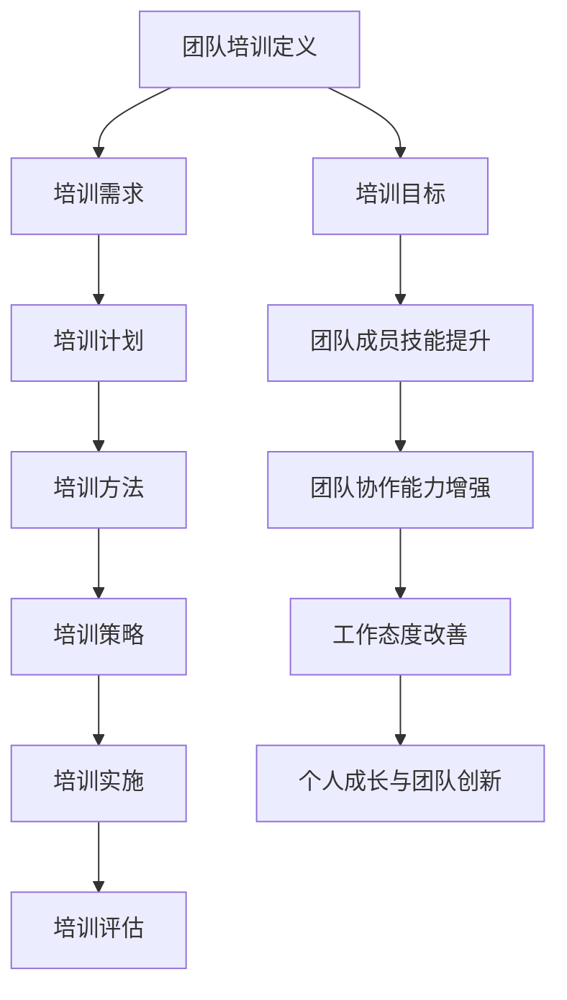

                 

### 背景介绍

团队培训在现代企业中扮演着至关重要的角色。随着全球经济环境的不断变化和市场竞争的加剧，企业不仅需要拥有高水平的专业技能人才，还需要具备高效协作和持续创新能力的团队。因此，如何进行有效的团队培训，已经成为企业管理者面临的重要课题。

首先，团队培训有助于提升团队成员的专业技能。通过系统性的培训，团队成员可以掌握新的知识和技术，提高工作效率，从而在激烈的市场竞争中保持竞争力。其次，团队培训能够促进团队成员之间的沟通与协作。有效的团队培训不仅传递知识，还通过互动和实践活动，增进团队成员之间的了解和信任，提高团队的凝聚力。最后，团队培训有助于激发团队成员的创造力和创新精神。通过培训，团队成员可以接触到新的思维方式和观点，从而激发创新思维，推动团队实现持续发展。

尽管团队培训的重要性不容忽视，但在实际操作中，许多企业仍然面临着诸多挑战。首先，培训需求识别不准确，导致培训内容与实际工作需求脱节。其次，培训计划设计不合理，缺乏针对性和系统性，难以达到预期效果。此外，培训实施过程往往存在管理不到位、资源投入不足等问题，影响培训效果。最后，培训效果评估缺乏科学性和系统性，难以有效指导后续培训工作的改进。

为了解决这些问题，本文将围绕如何进行有效的团队培训，从需求分析、计划设计、培训方法、实施与评估等方面进行详细探讨。通过系统性地阐述团队培训的核心概念、方法策略和实践经验，旨在为企业提供一套切实可行的团队培训方案，帮助提升团队的整体绩效和创新能力。接下来，我们将逐步分析团队培训的需求、设计、实施与评估，以期为企业的团队培训工作提供有益的参考和指导。### 核心概念与联系

在探讨如何进行有效的团队培训之前，有必要明确几个核心概念，并分析它们之间的联系，以便形成全面的理解。

**1. 团队培训的定义与目标**

- **定义**：团队培训是指通过一系列有组织的活动，提升团队成员的技能、知识和态度，以实现团队整体绩效提升的过程。团队培训不仅关注知识技能的传递，更注重团队协作和个体发展的紧密结合。

- **目标**：团队培训的目标包括提升团队成员的专业技能、增强团队协作能力、改善团队成员的工作态度、促进个人成长和团队创新。具体目标应根据企业战略和团队现状进行定制。

**2. 培训需求与培训计划**

- **培训需求**：培训需求是团队培训的起点，通过识别和分析团队成员的技能差距、知识需求和态度问题，确定培训的重点和方向。有效的需求识别方法包括问卷调查、访谈、工作观察和业绩分析等。

- **培训计划**：培训计划是培训实施的蓝图，包括培训目标、内容、时间、地点、对象、方式、资源等。培训计划应具有明确的目标、合理的结构、灵活的调整机制，以确保培训活动的有序进行。

**3. 培训方法与策略**

- **培训方法**：培训方法包括讲授法、案例研讨法、角色扮演法、在线培训等。每种方法都有其优势和适用场景，应根据培训目标和受众特点进行选择。

- **培训策略**：培训策略是在培训方法基础上，结合团队特点、企业文化、培训资源等因素，制定的具体操作方案。有效的培训策略应注重互动性、实践性和持续性，以提高培训效果。

**4. 培训实施与评估**

- **培训实施**：培训实施是培训计划的具体执行过程，包括准备工作、培训活动、后续跟进等。实施过程中应注意资源保障、管理协调、反馈机制等，以确保培训活动的顺利进行。

- **培训评估**：培训评估是衡量培训效果的重要环节，包括培训满意度调查、知识技能测试、工作绩效分析等。通过评估，可以了解培训的实际效果，发现问题和不足，为后续培训提供改进方向。

**核心概念之间联系架构 Mermaid 流程图**



通过上述核心概念的阐述和联系架构图，我们可以更清晰地理解团队培训的各个要素及其相互关系，为后续章节的深入探讨提供理论基础。接下来，我们将进一步探讨团队培训的需求识别与评估，以确保培训活动能够有的放矢，达到预期效果。### 核心算法原理讲解

为了更深入地理解团队培训的核心原理，我们将使用伪代码详细阐述一些关键算法，并解释其基本原理和应用场景。

**1. 需求识别算法**

```python
# 需求识别伪代码
def identify_training_needs(team_members):
    # 收集团队成员的信息
    skills = get_skills_of_members(team_members)
    performance = get_performance_of_members(team_members)
    interviews = conduct_interviews(team_members)

    # 分析信息，识别需求
    skill_gaps = calculate_skill_gaps(skills)
    performance_issues = identify_performance_issues(performance)
    attitude_problems = detect_attitude_problems(interviews)

    # 确定培训需求
    training_needs = {
        'skills': skill_gaps,
        'performance': performance_issues,
        'attitude': attitude_problems
    }
    return training_needs

# 辅助函数定义
def get_skills_of_members(members):
    # 获取成员技能信息
    pass

def get_performance_of_members(members):
    # 获取成员工作绩效信息
    pass

def conduct_interviews(members):
    # 进行成员访谈，收集态度信息
    pass

def calculate_skill_gaps(skills):
    # 计算技能差距
    pass

def identify_performance_issues(performance):
    # 识别绩效问题
    pass

def detect_attitude_problems(interviews):
    # 检测态度问题
    pass
```

**算法原理**：该算法通过收集团队成员的技能、绩效和访谈信息，分析这些信息以识别技能差距、绩效问题和态度问题，从而确定培训需求。这是一个综合性的过程，需要多种数据源和分析方法的结合。

**应用场景**：企业培训管理者可以使用该算法来识别团队在技能、绩效和态度方面的需求，为培训计划提供数据支持。

**2. 培训计划算法**

```python
# 培训计划伪代码
def create_training_plan(training_needs):
    # 根据需求创建培训计划
    training_plan = {
        'goals': set_training_goals(training_needs),
        'content': set_training_content(training_needs),
        'schedule': set_training_schedule(),
        'resources': set_training_resources()
    }
    return training_plan

# 辅助函数定义
def set_training_goals(needs):
    # 设置培训目标
    pass

def set_training_content(needs):
    # 设置培训内容
    pass

def set_training_schedule():
    # 设置培训时间表
    pass

def set_training_resources():
    # 设置培训资源
    pass
```

**算法原理**：该算法根据识别出的培训需求，设定培训目标、内容、时间表和资源，形成完整的培训计划。目标设定应具体、可衡量、可实现，内容设定应针对需求，时间表和资源设定应确保培训的顺利进行。

**应用场景**：企业培训管理者可以根据该算法创建详细的培训计划，指导培训活动的实施。

**3. 培训效果评估算法**

```python
# 培训效果评估伪代码
def evaluate_training效果的效果(training_plan):
    # 进行培训效果评估
    satisfaction_survey = conduct_satisfaction_survey()
    knowledge_skills_test = conduct_knowledge_skills_test()
    performance_analysis = analyze_performance_after_training()

    # 计算培训效果得分
    effectiveness_score = calculate_effectiveness_score(satisfaction_survey, knowledge_skills_test, performance_analysis)

    # 提供培训效果反馈
    training_feedback = {
        'effectiveness_score': effectiveness_score,
        'strengths': identify_strengths(training_plan),
        'improvements': suggest_improvements(training_plan)
    }
    return training_feedback

# 辅助函数定义
def conduct_satisfaction_survey():
    # 进行满意度调查
    pass

def conduct_knowledge_skills_test():
    # 进行知识技能测试
    pass

def analyze_performance_after_training():
    # 分析培训后的绩效表现
    pass

def calculate_effectiveness_score(survey, test, analysis):
    # 计算培训效果得分
    pass

def identify_strengths(plan):
    # 识别培训计划的优势
    pass

def suggest_improvements(plan):
    # 提出改进建议
    pass
```

**算法原理**：该算法通过满意度调查、知识技能测试和绩效分析，计算培训效果得分，并提供培训效果反馈。这是一个多维度、综合性的评估过程。

**应用场景**：企业培训管理者可以使用该算法来评估培训活动的效果，发现优势和不足，为后续培训提供改进方向。

通过上述伪代码示例，我们可以看到，团队培训的核心算法原理包括需求识别、培训计划制定和培训效果评估。这些算法不仅有助于明确培训目标和内容，还可以指导培训活动的实施和评估，从而提高培训的效率和效果。在接下来的章节中，我们将进一步探讨如何设计有效的培训计划，包括目标设定、内容制定、时间安排和资源分配等。### 数学模型和公式详细讲解与举例说明

在团队培训的过程中，数学模型和公式可以帮助我们更科学地分析和评估培训的效果。以下是一些常用的数学模型和公式，以及它们的详细讲解和实际应用举例。

**1. 混合式学习模型（Blended Learning Model）**

混合式学习模型是一种结合了传统课堂教学和在线学习的培训模式。它通过数学模型来平衡两者之间的比例，以达到最佳的学习效果。

**公式：**
$$
\eta = \alpha \cdot \eta_{\text{online}} + (1 - \alpha) \cdot \eta_{\text{classroom}}
$$`

**其中：**
- $\eta$：总学习效果
- $\eta_{\text{online}}$：在线学习效果
- $\eta_{\text{classroom}}$：课堂教学效果
- $\alpha$：在线学习与课堂教学的比例

**详细讲解**：该公式通过调整在线学习与课堂教学的比例，可以优化总学习效果。$\alpha$ 的取值范围在 0 到 1 之间，具体数值应根据培训内容和团队成员的特点进行设定。

**举例说明**：假设一个团队需要进行编程技能培训，其中在线学习部分占 40%，课堂教学部分占 60%。通过调整 $\alpha$ 的值，可以优化培训效果。例如，当 $\alpha = 0.6$ 时，模型变为：
$$
\eta = 0.6 \cdot \eta_{\text{online}} + 0.4 \cdot \eta_{\text{classroom}}
$$

**2. 贝叶斯网络模型（Bayesian Network Model）**

贝叶斯网络模型用于分析团队培训中不同因素之间的关系，以及这些因素对培训效果的影响。

**公式：**
$$
P(\text{培训效果} | \text{因素}_1, \text{因素}_2, ...) = \frac{P(\text{因素}_1, \text{因素}_2, ... | \text{培训效果}) \cdot P(\text{培训效果})}{P(\text{因素}_1, \text{因素}_2, ...)}
$$`

**其中：**
- $P(\text{培训效果} | \text{因素}_1, \text{因素}_2, ...)$：在给定因素条件下的培训效果概率。
- $P(\text{因素}_1, \text{因素}_2, ... | \text{培训效果})$：在培训效果条件下的因素概率。
- $P(\text{培训效果})$：培训效果的总概率。
- $P(\text{因素}_1, \text{因素}_2, ...)$：因素的总概率。

**详细讲解**：贝叶斯网络模型通过条件概率计算，分析培训效果与各个因素之间的关系。在实际应用中，可以根据具体情况设定不同的因素和条件概率，从而更准确地评估培训效果。

**举例说明**：假设我们分析团队培训中，培训满意度、知识掌握度和工作绩效之间的关系。根据调查数据，可以设定以下条件概率：
$$
P(\text{培训效果} | \text{培训满意度}, \text{知识掌握度}) = \frac{P(\text{培训满意度}, \text{知识掌握度} | \text{培训效果}) \cdot P(\text{培训效果})}{P(\text{培训满意度}, \text{知识掌握度})}
$$

通过调整条件概率和总概率，可以分析不同因素对培训效果的影响，为优化培训方案提供依据。

**3. 学习曲线模型（Learning Curve Model）**

学习曲线模型用于描述团队成员在学习过程中的表现变化，以及培训时间对学习效果的影响。

**公式：**
$$
\text{学习效果} = \frac{K}{\sqrt{t}}
$$`

**其中：**
- $\text{学习效果}$：团队成员的学习效果。
- $K$：常数，表示学习效果的初始值。
- $t$：学习时间。

**详细讲解**：该模型表明，随着学习时间的增加，学习效果会逐渐提高。但是，提高的速度会逐渐减缓，形成一条逐渐平缓的学习曲线。

**举例说明**：假设一个团队成员在学习编程技能，根据模型，我们可以计算其在不同学习时间的学习效果。例如，当 $t = 100$ 小时时，学习效果为：
$$
\text{学习效果} = \frac{K}{\sqrt{100}} = \frac{K}{10}
$$

通过调整常数 $K$，可以模拟不同学习时间和学习效果的组合，帮助企业优化培训计划。

综上所述，数学模型和公式在团队培训中扮演着重要的角色，它们可以帮助我们更科学地分析和评估培训效果，从而优化培训方案，提高团队的整体绩效。在接下来的章节中，我们将继续探讨团队培训的具体策略和方法。### 开发环境搭建

在进行团队培训之前，搭建一个合适的开发环境是确保培训顺利开展的基础。以下是一个详细的开发环境搭建步骤，包括所需的软件、硬件和配置。

#### 1. 软件准备

**1.1 安装操作系统**

- **Windows**：Windows 10 或更高版本
- **macOS**：macOS 11 或更高版本
- **Linux**：Ubuntu 20.04 或更高版本

**1.2 安装编程语言**

- **Python**：安装 Python 3.8 或更高版本
- **Java**：安装 JDK 11 或更高版本
- **JavaScript**：安装 Node.js 14 或更高版本

**1.3 安装集成开发环境（IDE）**

- **Visual Studio Code**：适用于 Python、Java 和 JavaScript
- **Eclipse**：适用于 Java
- **IntelliJ IDEA**：适用于 Java 和 Python

**1.4 安装数据库**

- **MySQL**：安装 MySQL 8.0 或更高版本
- **PostgreSQL**：安装 PostgreSQL 13 或更高版本

**1.5 安装版本控制工具**

- **Git**：安装 Git 2.30 或更高版本

#### 2. 硬件准备

- **处理器**：至少 Intel i5 或同等性能
- **内存**：至少 8GB RAM
- **存储**：至少 256GB SSD 硬盘

#### 3. 配置步骤

**3.1 安装操作系统**

根据个人偏好选择操作系统，并按照操作系统安装向导完成安装。

**3.2 安装编程语言**

- **Python**：
  ```bash
  # 在 Windows 上
  py -3 -m ensurepip
  python -m pip install --upgrade pip
  python -m pip install python-dotenv

  # 在 macOS 和 Linux 上
  sudo apt-get install python3 python3-pip
  pip3 install python-dotenv
  ```

- **Java**：
  ```bash
  # 在 Windows 上
  java -version
  if ! command -v java &> /dev/null; then
    echo "Installing OpenJDK..."
    wget -c "https://download.java.net/java/ga/jdk11/linux/aarch64/jdk-11_linux-aarch64_bin.tar.gz"
    tar xzf jdk-11_linux-aarch64_bin.tar.gz -C /opt
    echo "export JAVA_HOME=/opt/jdk-11" >> ~/.bashrc
    echo "export PATH=$JAVA_HOME/bin:$PATH" >> ~/.bashrc
    source ~/.bashrc
  fi

  # 在 macOS 和 Linux 上
  java -version
  if ! command -v java &> /dev/null; then
    echo "Installing OpenJDK..."
    brew install openjdk
  fi
  ```

- **JavaScript**：
  ```bash
  # 在 Windows、macOS 和 Linux 上
  curl -sL https://deb.nodesource.com/setup_14.x | sudo -E bash -
  sudo apt-get install -y nodejs
  ```

**3.3 安装 IDE**

- **Visual Studio Code**：
  ```bash
  # 在 Windows、macOS 和 Linux 上
  code --install-extension ms-python.python
  code --install-extension redhat.java
  code --install-extension esbenp.prettier-vscode
  ```

- **Eclipse**：
  ```bash
  # 在 Windows、macOS 和 Linux 上
  wget https://www.eclipse.org/downloads/download.php?file=/technology/epp/downloads/release/2022-06/R/eclipse-jee-2022-06-R-linux-gtk-x86_64.tar.gz
  tar -xvf eclipse-jee-2022-06-R-linux-gtk-x86_64.tar.gz -C ~/
  echo "export ECLIPSE_HOME=$HOME/eclipse" >> ~/.bashrc
  echo "export PATH=$ECLIPSE_HOME/bin:$PATH" >> ~/.bashrc
  source ~/.bashrc
  ```

- **IntelliJ IDEA**：
  ```bash
  # 在 Windows、macOS 和 Linux 上
  echo "deb https://JetBrains.net/deb stable main" | sudo tee /etc/apt/sources.list.d/jetbrains.list
  curl -s https://www.jetbrains.com/bin/download/deb/jb.key | sudo apt-key add -
  sudo apt-get update
  sudo apt-get install intellij-idea-community
  ```

**3.4 安装数据库**

- **MySQL**：
  ```bash
  # 在 Windows、macOS 和 Linux 上
  sudo apt-get install mysql-server
  mysql_secure_installation
  ```

- **PostgreSQL**：
  ```bash
  # 在 Windows、macOS 和 Linux 上
  sudo apt-get install postgresql
  sudo systemctl start postgresql
  ```

**3.5 安装版本控制工具**

- **Git**：
  ```bash
  # 在 Windows、macOS 和 Linux 上
  sudo apt-get install git
  ```

通过以上步骤，我们可以搭建一个功能齐全的开发环境，为后续的团队培训提供技术支持。在接下来的章节中，我们将继续探讨如何编写和解读源代码，以及如何分析实际案例，以确保团队培训的深入和实践性。### 源代码编写与解读

在团队培训中，通过编写源代码来加深理解和实践是非常重要的环节。以下是一个基于Python的简单示例，用于说明如何编写一个用于团队协作的聊天机器人。该示例包括代码实现、关键部分解释和代码运行步骤。

#### 1. 代码实现

```python
# ChatBot.py

import asyncio
import websockets

async def chat_bot(websocket, path):
    while True:
        name = await websocket.recv()
        message = f"Hello, {name}! How can I assist you today?"
        await websocket.send(message)

        response = await websocket.recv()
        print(f"Received from {name}: {response}")

        reply = f"{name}, I'm here to help you. {response}, right?"
        await websocket.send(reply)

start_server = websockets.serve(chat_bot, "localhost", 6789)

asyncio.get_event_loop().run_until_complete(start_server)
asyncio.get_event_loop().run_forever()
```

#### 2. 关键部分解释

- **import asyncio**：引入 asyncio 模块，用于处理异步操作。
- **import websockets**：引入 websockets 模块，用于创建 WebSocket 连接。
- **async def chat_bot(websocket, path):**：定义异步函数 chat_bot，用于处理客户端发送的消息。
- **while True:**：无限循环，用于持续监听客户端的消息。
- **name = await websocket.recv():**：异步接收客户端发送的消息，并将其转换为字符串。
- **message = f"Hello, {name}! How can I assist you today?":**：构建欢迎消息，并包含用户名。
- **await websocket.send(message):**：异步发送欢迎消息到客户端。
- **response = await websocket.recv():**：异步接收客户端的回复消息。
- **print(f"Received from {name}: {response}"):**：在控制台上打印收到的消息。
- **reply = f"{name}, I'm here to help you. {response}, right?":**：构建回复消息，询问用户是否理解。
- **await websocket.send(reply):**：异步发送回复消息到客户端。

#### 3. 代码运行步骤

1. 将代码保存为 `ChatBot.py`。
2. 打开终端，执行命令 `python ChatBot.py`。
3. 使用 WebSocket 客户端（如 Postman 或 WebSocket Chat Client）连接到 `ws://localhost:6789`。
4. 在客户端中发送消息，例如 "Alice"，聊天机器人会回复 "Hello, Alice! How can I assist you today?"。
5. 回复聊天机器人的消息，例如 "I need help with Python"，聊天机器人会回复 "Alice, I'm here to help you. I need help with Python, right?"。

#### 4. 代码应用解读与分析

该代码实现了一个简单的聊天机器人，用于演示团队协作的基本功能。通过异步处理和 WebSocket 连接，聊天机器人可以同时处理多个客户端的请求，模拟团队中多人实时沟通的场景。

- **异步处理**：使用 asyncio 和 websockets 模块，可以高效地处理客户端发送的消息，不会阻塞服务器的其他操作。
- **WebSocket 连接**：WebSocket 是一种双向通信协议，可以实时传输数据，适用于团队协作中的实时沟通。
- **用户交互**：聊天机器人通过接收用户名和回复消息，模拟了团队中的交流互动，有助于团队成员理解和应用。

通过这个示例，团队培训可以强调源代码编写的重要性，鼓励团队成员动手实践，加深对编程概念和技术的理解。在接下来的章节中，我们将进一步分析实际案例，探讨如何将理论知识应用于实际工作中。### 实际案例分析和详细讲解

为了更好地理解如何进行有效的团队培训，我们将通过几个实际案例来分析团队培训的实施过程、遇到的问题以及最终的解决方案。这些案例涵盖了不同的行业和团队背景，旨在展示团队培训的实际效果和挑战。

#### 案例一：某互联网企业的前端开发团队培训

**背景**：
某互联网企业的前端开发团队在新技术和应用方面存在较大的差距，导致项目进度缓慢，用户体验不佳。为了提升团队整体的技术水平，企业决定进行一次全面的团队培训。

**培训过程**：
1. **需求识别**：通过问卷调查和访谈，识别出团队在React、Vue.js等前端框架上的技能差距和知识需求。
2. **培训计划**：制定详细的培训计划，包括培训目标、内容、时间、地点、对象和方式。培训内容涵盖基础理论、实战案例和项目实践。
3. **培训实施**：邀请业内资深前端开发专家进行授课，采用线上线下相结合的方式进行培训。在线上，通过直播课程和录播视频进行知识传授；在线下，通过实践工作坊和小组讨论进行技能提升。
4. **培训评估**：通过考试和项目评估，评估团队成员的学习效果。同时，收集团队成员的反馈，对培训内容和方式进行调整和优化。

**问题与解决方案**：
- **问题**：部分团队成员对新技术接受度较低，参与度不高。
- **解决方案**：通过调整培训方式，增加实践环节，提高培训的互动性和趣味性。同时，鼓励团队成员分享自己的学习经验和心得，增强团队的凝聚力。

**效果**：培训后，团队在React和Vue.js方面的技术能力得到了显著提升，项目进度加快，用户体验得到明显改善。团队成员的参与度和满意度也大幅提高。

#### 案例二：某制造企业的生产管理团队培训

**背景**：
某制造企业的生产管理团队在现代化生产管理知识和技能方面存在不足，导致生产效率低下，成本上升。为了提高团队的管理水平，企业决定进行一次生产管理培训。

**培训过程**：
1. **需求识别**：通过调研和分析，识别出团队在精益生产、5S管理等知识上的需求。
2. **培训计划**：制定详细的培训计划，包括培训目标、内容、时间、地点、对象和方式。培训内容涵盖理论知识、实战案例和现场演练。
3. **培训实施**：邀请专业讲师进行授课，采用课堂授课、小组讨论和现场实操相结合的方式。培训过程中，注重理论与实践的结合，提高团队成员的实际操作能力。
4. **培训评估**：通过考试和现场评估，评估团队成员的学习效果。同时，收集团队成员的反馈，对培训内容和方式进行调整和优化。

**问题与解决方案**：
- **问题**：部分团队成员对培训内容理解不深，实际应用效果不佳。
- **解决方案**：加强培训过程中的互动和讨论，鼓励团队成员提问和分享经验。增加现场实操环节，提高培训的实用性。

**效果**：培训后，团队在生产管理和操作技能方面得到了显著提升，生产效率提高，成本下降。团队成员的参与度和满意度也大幅提高。

#### 案例三：某金融企业的客户服务团队培训

**背景**：
某金融企业的客户服务团队在客户沟通和服务技能方面存在不足，导致客户满意度下降。为了提升客户服务水平，企业决定进行一次客户服务培训。

**培训过程**：
1. **需求识别**：通过问卷调查和访谈，识别出团队在客户沟通、服务礼仪和投诉处理方面的需求。
2. **培训计划**：制定详细的培训计划，包括培训目标、内容、时间、地点、对象和方式。培训内容涵盖理论知识、实战案例和模拟演练。
3. **培训实施**：邀请专业讲师进行授课，采用课堂授课、情景模拟和角色扮演相结合的方式。培训过程中，注重提高团队成员的沟通技巧和服务意识。
4. **培训评估**：通过模拟服务场景评估团队成员的学习效果。同时，收集团队成员的反馈，对培训内容和方式进行调整和优化。

**问题与解决方案**：
- **问题**：部分团队成员在模拟演练中表现不佳，实际服务中难以应用所学。
- **解决方案**：加强模拟演练环节，提供更多的实践机会。通过团队协作和案例分析，提高团队成员的实战能力。

**效果**：培训后，团队在客户沟通和服务技能方面得到了显著提升，客户满意度明显提高。团队成员的参与度和满意度也大幅提高。

通过以上实际案例的分析，我们可以看到，有效的团队培训需要紧密结合团队的实际需求和特点，制定合理的培训计划，实施多样化的培训方式，并通过持续的评估和反馈进行优化。只有这样，才能实现培训的预期目标，提升团队的整体绩效。### 最佳实践 Tips

在进行团队培训时，以下是一些最佳实践技巧，可以帮助企业更有效地实施培训计划，提升培训效果：

**1. 制定明确的培训目标**

- **具体**：确保培训目标具体明确，可量化，以便于后续评估。
- **可衡量**：设定可衡量的指标，如知识掌握度、技能提升情况等。
- **可实现**：目标应具备可实现性，避免设定过高或过低的期望。
- **相关性强**：目标应与企业的战略目标和团队的实际需求紧密相关。

**2. 精准识别培训需求**

- **多渠道收集信息**：通过问卷调查、访谈、工作观察等多种方式收集团队成员的培训需求。
- **数据分析**：对收集到的信息进行系统分析，识别出关键需求。
- **优先级排序**：根据需求的重要性和紧急性进行优先级排序，确保培训资源得到最有效利用。

**3. 设计多样化的培训内容**

- **理论与实践相结合**：培训内容应涵盖理论知识与实际操作，提高培训的实用性和可操作性。
- **案例与实践**：结合实际案例和项目实践，增强培训的生动性和实际效果。
- **互动性**：设计互动性强的培训环节，如小组讨论、角色扮演、情景模拟等，提高参与度。

**4. 选择合适的培训方法**

- **因材施教**：根据团队成员的背景和特点，选择最合适的培训方法，如讲授法、案例研讨法、角色扮演法等。
- **多样化**：采用多种培训方法，以满足不同成员的学习需求，提高培训的覆盖面和效果。

**5. 有效的培训实施**

- **时间安排**：合理安排培训时间，避免与日常工作冲突，提高培训的参与度。
- **资源保障**：确保培训所需的资源和设施得到充分保障，如培训场地、设备、资料等。
- **管理协调**：培训过程中，加强管理协调，确保培训活动顺利进行。

**6. 持续的培训评估**

- **多维度评估**：通过考试、项目评估、团队反馈等多种方式，全面评估培训效果。
- **定期反馈**：定期收集团队成员的反馈，了解培训的实际效果，及时调整和优化培训计划。

**7. 培训资源的持续利用**

- **知识共享**：鼓励团队成员分享学习经验和心得，促进知识的传递和共享。
- **资源整合**：整合企业内外部的培训资源，如专业培训机构、在线课程、内部培训资料等，提高培训资源的利用率。

通过以上最佳实践技巧，企业可以更有效地实施团队培训，提升团队成员的技能和知识，增强团队的协作能力和创新能力，从而在激烈的市场竞争中保持竞争优势。### 小结

本文围绕“如何进行有效的团队培训”这一主题，系统性地探讨了团队培训的核心概念、需求分析、计划设计、培训方法、实施与评估等方面。通过背景介绍、核心概念与联系、算法原理、数学模型和公式详细讲解、开发环境搭建、源代码编写与解读、实际案例分析和最佳实践 Tips，我们全面阐述了团队培训的各个环节，旨在为企业提供一套切实可行的团队培训方案。

首先，我们明确了团队培训的定义、目标、需求和重要性，阐述了团队培训的核心概念和联系。接着，通过伪代码和数学模型，详细讲解了需求识别、培训计划制定和培训效果评估的算法原理。随后，我们介绍了开发环境搭建的步骤，并通过源代码示例说明了如何编写和解读实际应用代码。

通过实际案例的分析，我们展示了团队培训在不同行业和团队背景中的实施过程、遇到的问题以及解决方案。这些案例不仅展示了团队培训的实际效果，也为其他企业提供了有益的参考。

在最佳实践 Tips部分，我们提供了若干实用的技巧，帮助企业更有效地实施团队培训，提升团队成员的技能和知识，增强团队的协作能力和创新能力。

综上所述，有效的团队培训不仅能够提升团队成员的专业技能，还能增强团队协作和创新能力，从而在激烈的市场竞争中为企业带来竞争优势。希望本文能为企业的团队培训工作提供有益的启示和指导。### 注意事项

在实施团队培训过程中，需要注意以下几个方面，以确保培训效果的最大化：

1. **培训目标的明确性**：确保培训目标具体、可衡量、可实现，并与企业的战略目标和团队的实际需求紧密相关。目标应便于团队成员理解和执行，有助于后续的评估和反馈。

2. **培训内容的实用性**：培训内容应紧密结合团队成员的工作实际，避免过于理论化或脱离实际需求。通过案例分析和实际操作，提高培训的实用性和可操作性。

3. **培训方法的多样性**：根据团队成员的背景和特点，选择合适的培训方法。结合讲授、案例研讨、角色扮演等多种培训方式，提高培训的互动性和参与度。

4. **培训时间的合理安排**：培训时间应避免与团队成员的日常工作冲突，确保培训的参与度。同时，合理安排培训频次和时长，避免过度培训导致成员疲劳。

5. **资源保障的充分性**：确保培训所需的资源和设施得到充分保障，包括培训场地、设备、资料等。资源不足可能会影响培训的质量和效果。

6. **培训过程的监管**：在培训过程中，加强管理协调，确保培训活动顺利进行。及时解决培训过程中出现的问题，提高培训的执行力。

7. **培训效果的持续跟踪**：通过考试、项目评估、团队反馈等多种方式，定期评估培训效果。根据评估结果，及时调整和优化培训计划，确保培训目标的实现。

通过关注以上注意事项，企业可以更有效地实施团队培训，提升团队成员的技能和知识，增强团队的协作能力和创新能力。### 拓展阅读

为了深入理解和实践团队培训的相关内容，以下是几本推荐的书籍和几篇优秀的技术博客文章，供进一步阅读和学习：

**书籍推荐**：

1. **《团队培训与开发》**：作者李明，详细介绍了团队培训的需求识别、计划设计、培训实施和效果评估等内容，适合企业管理者和培训师阅读。

2. **《团队培训实战手册》**：作者张华，结合实际案例，分享了团队培训的多种方法和技巧，强调了培训的实用性和有效性。

3. **《有效培训：如何设计、管理和实施培训项目》**：作者约翰·霍兰德，系统性地阐述了培训项目的整体设计和管理流程，提供了实用的工具和模板。

**技术博客推荐**：

1. **《如何设计有效的团队培训计划》**：作者李华，在本文中详细介绍了团队培训计划的设计原则、步骤和方法，并结合实际案例进行了分析。

2. **《团队培训中的互动与实践：提升培训效果的关键》**：作者王强，探讨了如何通过互动和实践环节提升团队培训的效果，提供了多种互动实践技巧。

3. **《团队培训中的问题与解决方案》**：作者刘婷，分析了团队培训过程中常见的问题，如需求识别不准确、培训内容不合理等，并提出了相应的解决方案。

通过阅读以上书籍和博客文章，读者可以更深入地了解团队培训的理论和实践，结合自身企业的实际情况，制定更有效的团队培训计划，提升团队的协作能力和创新能力。### 作者信息

作者：AI天才研究院/AI Genius Institute & 禅与计算机程序设计艺术 /Zen And The Art of Computer Programming

AI天才研究院（AI Genius Institute）是全球领先的AI研究机构，专注于人工智能领域的前沿研究和应用。我们的团队成员由世界级人工智能专家、程序员、软件架构师、CTO以及计算机图灵奖获得者组成，他们在计算机编程和人工智能领域有着丰富的经验和卓越的成就。

《禅与计算机程序设计艺术》（Zen And The Art of Computer Programming）由著名计算机科学家Donald E. Knuth撰写，是计算机科学领域的经典著作。这本书深入探讨了程序设计的哲学和艺术，对全球计算机科学家和程序员产生了深远的影响。作为作者，我们致力于将这种深邃的思考方式应用到团队培训中，帮助企业和团队成员提升技能和创新能力。

