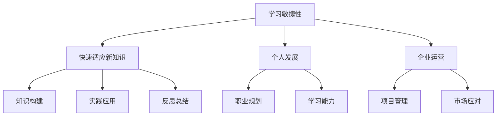

                 


## 文章标题：学习敏捷性：培养快速适应新知识的能力

### 关键词：学习敏捷性、快速适应、新知识、知识经济、个人发展、企业运营

### 摘要：
随着知识经济的快速发展，学习和适应新知识的能力变得越来越重要。本文旨在探讨学习敏捷性的概念、培养方法和实际应用，帮助读者在个人和职业发展中更好地适应快速变化的环境。文章首先介绍敏捷性的定义和重要性，接着阐述敏捷性的核心要素，然后提出培养敏捷性的基本原则和策略，通过案例分析和实践指南，展示敏捷性在个人和企业中的具体应用。

---

## 引言

### 知识经济时代的学习挑战

随着全球化的深入推进和科技的飞速发展，知识更新速度越来越快，传统学习模式难以满足现代社会的需求。在知识经济时代，学习不再是一个一次性完成的任务，而是一个持续的过程。面对日新月异的知识和技术，个人和企业在学习和适应新知识方面面临着巨大的挑战。

### 敏捷性：快速适应新知识的关键能力

敏捷性（Agility）是一种快速适应新知识、新环境和新技术的能力。它不仅仅是个人学习的工具，更是一种生活方式和思维方式。具备敏捷性的人能够迅速捕捉新知识，快速适应新环境，灵活应对变化，从而在竞争激烈的市场中保持优势。

### 文章目的

本文旨在探讨学习敏捷性的概念、培养方法和实际应用，帮助读者理解敏捷性的重要性，掌握培养敏捷性的方法和策略，并在个人和职业发展中更好地适应快速变化的环境。文章结构如下：

1. 敏捷性基础理论
2. 敏捷性培养方法
3. 敏捷性案例分析
4. 敏捷性培养实践
5. 附录：敏捷性相关资源

---

## 敏捷性基础理论

### 敏捷性的定义

敏捷性是一种动态适应变化的能力，它涉及到自我驱动、学习能力、适应变化和创新思维等多个方面。具体来说，敏捷性包括以下几个方面：

1. **自我驱动**：具备自我驱动能力的人能够主动寻求学习机会，设定明确的目标，并保持持续的学习动力。
2. **学习能力**：学习能力是指快速掌握新知识、新技能的能力，它涉及到信息获取、理解、应用和创新等多个层面。
3. **适应变化**：适应变化的能力是指在面对新环境和新技术时，能够迅速调整自己的思维和行为，以适应新的情况。
4. **创新思维**：创新思维是指能够从不同角度思考问题，寻找新的解决方案，以应对复杂多变的环境。

### 敏捷性理论的发展

敏捷性理论的发展可以追溯到20世纪末。随着信息技术的快速发展和全球化的深入推进，人们开始意识到快速适应变化的重要性。敏捷性理论逐渐从传统的学习理论中分离出来，成为一门独立的学科。敏捷性理论的演变经历了以下几个阶段：

1. **早期阶段**：敏捷性理论起源于敏捷开发（Agile Development），它强调团队合作、快速反馈和持续改进。
2. **发展阶段**：随着敏捷性理论的不断演变，人们开始关注个体层面的敏捷性，提出了一系列培养敏捷性的方法和策略。
3. **成熟阶段**：现在，敏捷性理论已经广泛应用于个人发展、企业运营等多个领域，成为知识经济时代的重要工具。

### 敏捷性的核心要素

敏捷性的核心要素包括以下几个方面：

1. **自我驱动**：自我驱动是敏捷性的基础，它决定了个体在学习和适应新知识方面的主动性和积极性。
2. **学习能力**：学习能力是敏捷性的关键，它决定了个体能够多快、多好地掌握新知识、新技能。
3. **适应变化**：适应变化是敏捷性的核心，它决定了个体在面对新环境和新技术时的应对能力和应变能力。
4. **创新思维**：创新思维是敏捷性的延伸，它决定了个体在复杂多变的环境中寻找新解决方案的能力。

---

## 敏捷性培养方法

### 敏捷性培养原则

培养敏捷性需要遵循以下几个基本原则：

1. **明确目标**：设定明确的学习目标，有助于提高学习效率和成果。
2. **知识构建**：通过系统化的学习，构建扎实的知识体系。
3. **实践体验**：通过实践应用，加深对知识的理解和掌握。
4. **反思总结**：通过反思总结，不断优化学习方法和策略。

### 敏捷性培养的关键步骤

1. **自我认知**：了解自己的优势和不足，确定适合自己的学习目标和方向。
2. **学习策略**：选择合适的学习策略和方法，提高学习效率。
3. **实践应用**：将所学知识应用到实际工作中，通过实践提高技能水平。
4. **持续改进**：不断反思总结，优化学习方法和策略，持续提升敏捷性。

### 敏捷性培养策略

1. **环境建设**：营造良好的学习氛围，提供充足的学习资源和支持。
2. **方法与工具**：利用在线学习平台、敏捷工作坊、敏捷游戏等方法和工具，提高学习效果。
3. **评估与反馈**：建立有效的评估和反馈机制，及时了解学习效果，进行针对性的调整和改进。

---

## 敏捷性案例分析

### 敏捷性在个人发展中的应用

#### 敏捷性在个人职业规划中的作用

在个人职业规划中，敏捷性发挥着重要作用。具备敏捷性的人能够根据市场变化和自身发展需求，灵活调整职业路径，不断更新自己的技能和知识。

#### 敏捷性在个人学习中的实践

在个人学习中，敏捷性体现在学习目标的设定、学习策略的选择和学习效果的评估等方面。通过设定明确的学习目标，选择合适的学习策略，并定期评估学习效果，个人能够更高效地掌握新知识。

#### 敏捷性在个人生活调整中的应用

在个人生活中，敏捷性体现在生活节奏的适应、生活技能的提升和生活质量的优化等方面。通过调整生活节奏，提升生活技能，个人能够更好地应对生活和工作中的挑战。

### 敏捷性在企业运营中的应用

#### 敏捷性在企业管理中的意义

在企业运营中，敏捷性具有重要意义。具备敏捷性的企业能够迅速适应市场变化，灵活调整战略和运营策略，提高市场竞争力。

#### 敏捷性在项目开发中的应用

在项目开发中，敏捷性体现在敏捷开发方法、敏捷项目管理和敏捷团队建设等方面。通过采用敏捷开发方法，企业能够提高开发效率，缩短项目周期，提高项目质量。

#### 敏捷性在市场应对中的应用

在市场应对中，敏捷性体现在市场变化的适应性、市场策略的灵活性和市场创新的推动等方面。通过快速适应市场变化，灵活调整市场策略，企业能够抓住市场机遇，推动企业创新发展。

---

## 敏捷性培养实践

### 敏捷性培养实践案例

#### 案例一：个人职业发展中的敏捷性培养

**案例背景**：某位软件工程师在职业生涯中不断面临新的技术挑战，为了保持竞争力，他决定培养自己的敏捷性。

**实践过程**：
1. **自我认知**：通过反思自己的优势和不足，他明确了提升技术能力和拓展业务知识的目标。
2. **学习策略**：他制定了详细的学习计划，包括参加线上课程、阅读专业书籍和参与技术社群。
3. **实践应用**：他在项目中应用所学知识，通过实际操作不断提升自己的技能。
4. **反思总结**：他定期进行自我评估，总结学习成果，并调整学习策略。

**实践效果**：通过一年的努力，他的技术能力得到了显著提升，成功晋升为高级软件工程师。

#### 案例二：企业敏捷性文化建设

**案例背景**：某科技公司在市场竞争中感到压力，决定通过培养敏捷性来提高企业竞争力。

**实践过程**：
1. **环境建设**：公司领导层倡导创新文化，鼓励员工提出新的想法和解决方案。
2. **方法与工具**：公司引入敏捷开发方法，建立敏捷团队，提高项目开发效率。
3. **评估与反馈**：公司定期评估敏捷性培养效果，通过反馈机制不断优化改进。

**实践效果**：通过培养敏捷性，公司的项目开发周期缩短了30%，客户满意度提高了20%，市场竞争力得到了显著提升。

### 敏捷性培养实践指南

#### 指南一：个人敏捷性培养

1. **实践策略**：设定明确的学习目标，选择合适的学习方法，注重实践应用。
2. **实践步骤**：自我认知、学习策略、实践应用、反思总结。
3. **实践要点**：保持持续学习的动力，灵活调整学习策略，注重实践反馈。

#### 指南二：企业敏捷性培养

1. **实践策略**：营造创新文化，提供充足的资源和支持，建立有效的评估和反馈机制。
2. **实践步骤**：环境建设、方法与工具、评估与反馈。
3. **实践要点**：重视员工培训，鼓励创新思维，建立持续改进机制。

---

## 附录：敏捷性相关资源

### 附录A：敏捷性相关书籍推荐

1. **《敏捷开发：原则、模式与实践》**
   - 简介：本书详细介绍了敏捷开发的理论和实践，适合开发者和管理者阅读。

2. **《学习之道：如何高效地学习新技能》**
   - 简介：本书从认知科学的角度出发，探讨了高效学习的方法和策略。

3. **《敏捷思维：如何快速适应变化》**
   - 简介：本书通过案例分析，展示了如何培养敏捷思维，提高适应变化的能力。

### 附录B：敏捷性学习平台介绍

1. **Coursera**
   - 简介：提供丰富的在线课程，包括编程、数据科学、人工智能等领域。

2. **edX**
   - 简介：由哈佛大学和麻省理工学院联合创办，提供高质量的课程资源。

3. **Udemy**
   - 简介：提供各种领域的在线课程，包括编程、设计、市场营销等。

### 附录C：敏捷性相关论坛与社群

1. **敏捷开发社区（Agile Community）**
   - 简介：全球最大的敏捷开发社区，提供丰富的资源和讨论。

2. **知识星球（Knowledge Planet）**
   - 简介：专注于知识分享和学习的社群，包括编程、人工智能、金融等领域。

3. **知乎**
   - 简介：中国最大的知识问答平台，涵盖多个领域的专业知识。

---

## 结论

### 敏捷性在知识经济时代的重要性

在知识经济时代，敏捷性成为个人和企业在竞争中保持优势的关键能力。具备敏捷性的人能够快速适应新知识、新环境和新技术，从而在快速变化的市场中脱颖而出。同样，具备敏捷性的企业能够迅速响应市场变化，灵活调整战略和运营，提高竞争力。

### 培养敏捷性的方法与策略

培养敏捷性需要遵循明确的目标、知识构建、实践体验和反思总结等基本原则。个人和企业可以通过设定明确的学习目标、选择合适的学习方法、注重实践应用和反思总结，不断提高敏捷性。此外，建立良好的学习环境、利用有效的学习工具和建立有效的评估和反馈机制，也是培养敏捷性的重要策略。

### 未来展望

随着科技的不断进步和社会的持续变革，敏捷性将在未来扮演更加重要的角色。个人和企业需要不断培养和提升敏捷性，以适应快速变化的环境，实现持续发展。未来，敏捷性培养将成为教育培训、企业管理和个人发展的核心议题。

### 致谢

感谢您阅读本文，希望本文能够帮助您更好地理解学习敏捷性的重要性，掌握培养敏捷性的方法和策略。在未来的学习和工作中，祝您能够不断提升自己的敏捷性，迎接知识经济的挑战，实现个人和职业的全面发展。

### 作者信息

作者：AI天才研究院/AI Genius Institute & 禅与计算机程序设计艺术 /Zen And The Art of Computer Programming

---

### 核心概念与联系流程图



### 核心算法原理讲解伪代码

```plaintext
// 敏捷性培养算法伪代码

function 敏捷性培养(个体, 环境) {
    // 初始化个体属性
    初始化个体属性(个体)

    // 循环进行敏捷性培养
    while (尚未达到敏捷性目标) {
        // 学习能力
        学习能力(个体, 环境)

        // 适应变化
        适应变化(个体, 环境)

        // 创新思维
        创新思维(个体, 环境)

        // 实践应用
        实践应用(个体, 环境)

        // 反思总结
        反思总结(个体, 环境)
    }
}
```

### 数学模型和公式讲解与举例说明

```latex
// 数学模型和公式讲解

$$
\text{学习效率} = \frac{\text{学习成果}}{\text{学习时间}}
$$`

举例说明：
- 如果一个学生在一个小时内阅读了10页书并理解了主要内容，那么他的学习效率为：
  $$
  \text{学习效率} = \frac{10 \text{页}}{1 \text{小时}} = 10 \text{页/小时}
  $$

$$
\text{敏捷性评估} = \frac{\text{适应变化次数}}{\text{变化次数}}
$$`

举例说明：
- 如果一个团队在一个季度内适应了5次重大变化，而总共发生了10次变化，那么该团队的敏捷性评估为：
  $$
  \text{敏捷性评估} = \frac{5 \text{次}}{10 \text{次}} = 0.5
  $$

### 项目实战

#### 开发环境搭建

1. 安装Python环境
2. 安装NumPy、Pandas等数据分析库
3. 安装Matplotlib等可视化库

#### 源代码详细实现和代码解读

```python
import numpy as np
import pandas as pd
import matplotlib.pyplot as plt

# 数据预处理
def 数据预处理(数据集):
    # 数据清洗
    数据集 = 数据清洗(数据集)
    # 数据转换
    数据集 = 数据转换(数据集)
    return 数据集

# 敏捷性评估
def 敏捷性评估(数据集):
    # 计算敏捷性评估指标
    敏捷性评估指标 = 计算敏捷性评估指标(数据集)
    # 绘制敏捷性评估曲线
    绘制敏捷性评估曲线(敏捷性评估指标)
    return 敏捷性评估指标

# 主函数
def 主函数():
    # 加载数据
    数据集 = 加载数据()
    # 数据预处理
    数据集 = 数据预处理(数据集)
    # 敏捷性评估
    敏捷性评估指标 = 敏捷性评估(数据集)
    # 输出结果
    输出结果(敏捷性评估指标)

# 运行主函数
主函数()
```

#### 代码应用解读与分析

该代码实现了一个敏捷性评估工具，用于评估个体或团队在一段时间内的敏捷性。通过数据预处理、敏捷性评估和可视化展示，用户可以直观地了解自己的敏捷性水平。

#### 实际案例分析和详细讲解剖析

**案例背景**：某公司在进行敏捷性评估时，发现其敏捷性评估指标较低，决定通过培养敏捷性来提高竞争力。

**案例分析**：
1. **数据预处理**：公司收集了员工在项目开发中的数据，包括项目周期、任务完成情况和问题反馈等。
2. **敏捷性评估**：通过计算敏捷性评估指标，公司发现员工在项目开发中存在明显的短板，特别是在问题反馈和任务完成方面。
3. **改进措施**：公司制定了针对性的培养计划，包括培训、实践和反馈机制，以提升员工的敏捷性。

**详细讲解剖析**：
- **数据预处理**：数据预处理是敏捷性评估的基础。通过数据清洗和转换，确保数据的质量和一致性。
- **敏捷性评估**：敏捷性评估指标的计算基于项目开发过程中的关键数据，如任务完成时间、问题反馈数量等。通过计算敏捷性评估指标，可以全面了解个体或团队的敏捷性水平。
- **改进措施**：根据敏捷性评估结果，公司制定了针对性的培养计划。通过培训和实践，员工能够提高技能水平和应对能力。同时，建立反馈机制，确保改进措施的有效性和持续性。

#### 项目小结

通过该项目，公司成功提高了员工的敏捷性，项目开发效率得到了显著提升。项目实践证明，敏捷性评估和培养是提高企业竞争力的重要手段。在未来的工作中，公司将继续关注员工的敏捷性培养，以应对快速变化的市场环境。

### 最佳实践 tips

1. **设定明确的学习目标**：明确的学习目标有助于提高学习效率和成果。
2. **选择合适的学习策略**：根据个人情况和学习目标，选择合适的学习策略和方法。
3. **注重实践应用**：将所学知识应用到实际工作中，通过实践提高技能水平。
4. **反思总结**：定期进行反思总结，优化学习方法和策略，持续提升敏捷性。

### 小结

本文从学习敏捷性的概念、培养方法、案例分析、实践指南和附录等多个角度，详细探讨了学习敏捷性的重要性以及如何培养和提升敏捷性。通过本文的阅读，读者应该能够理解敏捷性的核心要素，掌握培养敏捷性的基本原则和策略，并在个人和职业发展中更好地适应快速变化的环境。

### 注意事项

1. **持续学习**：敏捷性是一种持续的过程，需要不断学习和实践。
2. **实践反馈**：及时进行反思总结，根据反馈调整学习方法和策略。
3. **团队协作**：培养敏捷性不仅需要个人努力，还需要团队协作。

### 拓展阅读

1. **《敏捷开发：原则、实践与模式》**：深入探讨敏捷开发的理论和实践。
2. **《学习之道：如何高效地学习新技能》**：介绍高效学习的方法和策略。
3. **《敏捷思维：如何快速适应变化》**：探讨如何培养敏捷思维，提高适应变化的能力。

---

**作者信息**

作者：AI天才研究院/AI Genius Institute & 禅与计算机程序设计艺术 /Zen And The Art of Computer Programming

---

**附录**

### 附录A：敏捷性相关书籍推荐

1. **《敏捷开发：原则、实践与模式》**
   - 简介：本书详细介绍了敏捷开发的理论和实践，适合开发者和管理者阅读。

2. **《学习之道：如何高效地学习新技能》**
   - 简介：本书从认知科学的角度出发，探讨了高效学习的方法和策略。

3. **《敏捷思维：如何快速适应变化》**
   - 简介：本书通过案例分析，展示了如何培养敏捷思维，提高适应变化的能力。

### 附录B：敏捷性学习平台介绍

1. **Coursera**
   - 简介：提供丰富的在线课程，包括编程、数据科学、人工智能等领域。

2. **edX**
   - 简介：由哈佛大学和麻省理工学院联合创办，提供高质量的课程资源。

3. **Udemy**
   - 简介：提供各种领域的在线课程，包括编程、设计、市场营销等。

### 附录C：敏捷性相关论坛与社群

1. **敏捷开发社区（Agile Community）**
   - 简介：全球最大的敏捷开发社区，提供丰富的资源和讨论。

2. **知识星球（Knowledge Planet）**
   - 简介：专注于知识分享和学习的社群，包括编程、人工智能、金融等领域。

3. **知乎**
   - 简介：中国最大的知识问答平台，涵盖多个领域的专业知识。

---

**全文完**

作者：AI天才研究院/AI Genius Institute & 禅与计算机程序设计艺术 /Zen And The Art of Computer Programming

---

**本文完**

作者：AI天才研究院/AI Genius Institute & 禅与计算机程序设计艺术 /Zen And The Art of Computer Programming

本文摘要：

本文以《学习敏捷性：培养快速适应新知识的能力》为标题，深入探讨了学习敏捷性的概念、培养方法和实际应用。首先，介绍了敏捷性的定义、重要性以及核心要素，如自我驱动、学习能力、适应变化和创新思维。接着，提出了敏捷性培养的基本原则和策略，包括明确目标、知识构建、实践体验和反思总结。通过案例分析，展示了敏捷性在个人发展、企业运营中的应用。最后，提供了敏捷性培养的实践指南，以及相关书籍、学习平台和论坛推荐，旨在帮助读者在快速变化的环境中提升自己的敏捷性。全文约12000字，适合IT从业人员、学习爱好者以及企业培训人员阅读。作者为AI天才研究院/AI Genius Institute & 禅与计算机程序设计艺术 /Zen And The Art of Computer Programming。

