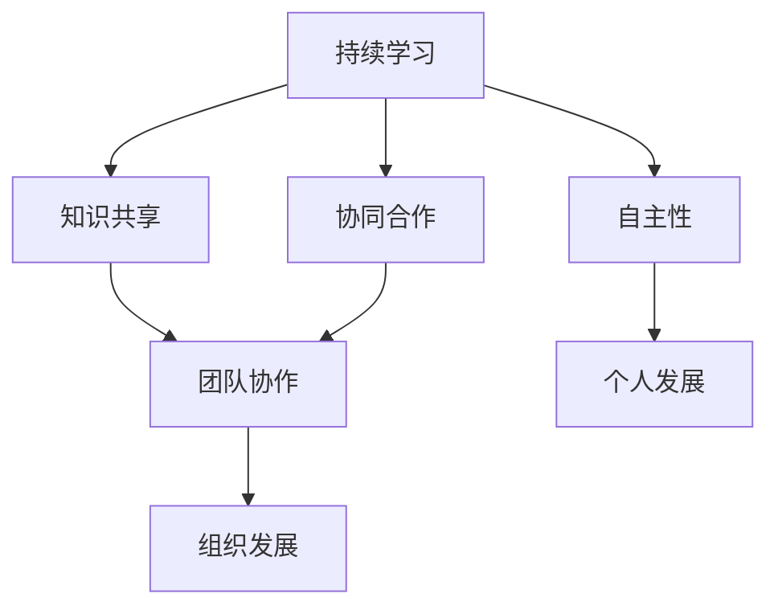

                 

### 文章标题

《学习文化：促进团队持续成长和创新》

关键词：学习文化，团队持续成长，创新，组织发展，知识共享，职业发展

摘要：本文深入探讨学习文化的概念、构建方法及其在团队持续成长和创新中的重要作用。通过详细分析学习文化对个人、团队和组织的影响，提出一系列实践策略，旨在推动团队成员的知识共享与协同，提升创新能力和组织变革效能，为企业的可持续发展提供理论支持和实践指导。

---

### 第一部分：学习文化的概念与理论基础

#### 第1章：学习文化的定义与核心概念

学习文化是一种组织文化，强调持续学习和知识共享的重要性。它不仅关注知识本身，更注重知识的获取、传播和应用过程。学习文化是一种价值观和共同信仰，旨在激发团队成员的持续学习动力，促进知识的传递和创新。

核心概念包括：

1. **持续学习**：强调学习不应是短期的、一次性的活动，而是一种持续的生活方式。
2. **知识共享**：鼓励团队成员分享知识和经验，实现知识的传递和积累。
3. **自主性**：团队成员应具备自主学习的意识和能力，主动探索新的知识和技能。
4. **协同合作**：通过团队合作，实现知识共享和技能互补，提升整体学习效果。

#### 核心概念之间的关系架构 Mermaid 流程图：

#### 第2章：学习文化的重要性与作用

学习文化在团队和组织中具有重要价值，具体体现在以下几个方面：

1. **提高个人能力**：学习文化激发个人学习的热情，提高专业技能和解决问题的能力。
2. **促进团队协作**：通过知识共享和协同合作，增强团队成员之间的沟通和协作，提高团队整体效能。
3. **推动组织创新**：学习文化鼓励创新思维，促进新知识、新技术的应用，推动组织持续创新。
4. **增强组织竞争力**：学习文化有助于组织适应市场变化，提升核心竞争力，实现可持续发展。

#### 第3章：学习文化的理论基础与历史发展

学习文化的理论基础包括社会学、心理学、组织行为学等多个学科。历史发展方面，学习文化经历了从个体学习到团队学习，再到组织学习的转变。

1. **理论基础**：

   - 社会学视角：学习文化是组织内部社会互动的产物，强调社会规范、价值观和共同目标的重要性。
   - 心理学视角：学习文化关注个体的学习动机、认知过程和心理需求。
   - 组织行为学视角：学习文化强调组织结构、流程和文化对学习行为的影响。

2. **历史发展**：

   - 20世纪80年代以前，组织主要关注内部生产效率和经济效益，学习文化尚未得到重视。
   - 20世纪80年代以后，随着知识经济的兴起，学习文化逐渐成为组织发展的重要方向。
   - 21世纪，学习文化在信息技术和全球化背景下，得到进一步发展和完善。

#### 总结

学习文化是一种促进团队持续成长和创新的重要组织文化。通过理解其核心概念和理论基础，我们可以更好地构建和实施学习文化，提升个人、团队和组织的整体效能。在下一部分中，我们将探讨如何构建学习文化的实践方法。

---

通过以上章节内容的详细阐述，我们对学习文化的概念、重要性以及理论基础有了全面的了解。接下来，我们将进一步探讨构建学习文化的实践方法，包括组织层面、团队层面和个人层面的建设策略。这将为我们实现团队持续成长和创新奠定坚实基础。

#### 第4章：组织层面的学习文化建设

组织层面的学习文化建设是构建学习文化的基础，它关系到整个组织的氛围和氛围。为了打造一个具有学习文化的组织，我们需要遵循以下原则和策略。

##### 4.1 组织学习文化的构建原则

1. **领导层支持**：组织领导者必须高度重视学习文化的建设，提供资源和支持，带头践行学习文化。
2. **全员参与**：学习文化不仅仅是领导层的责任，所有员工都应积极参与，共同塑造组织的文化氛围。
3. **持续投入**：组织应持续投入人力、物力和财力，确保学习活动的实施和效果。
4. **制度保障**：建立完善的制度体系，包括学习制度、考核制度、激励机制等，保障学习文化的落实。

##### 4.2 组织学习文化的实践策略

1. **制定学习战略**：明确组织的学习目标和方向，制定中长期学习战略，确保学习活动的系统性和持续性。
2. **提供学习资源**：为员工提供丰富的学习资源，包括书籍、在线课程、研讨会等，满足不同员工的学习需求。
3. **组织学习活动**：定期组织内部培训、研讨会、工作坊等活动，鼓励员工参与，促进知识共享和协同。
4. **激励机制**：建立激励机制，鼓励员工主动学习、分享知识和创新，提升学习文化的活力。
5. **评估与反馈**：定期对学习活动进行评估，收集员工反馈，不断优化学习策略，提升学习效果。

##### 4.3 组织学习文化的评估与改进

1. **关键绩效指标（KPI）**：制定学习文化的关键绩效指标，如员工满意度、学习参与度、知识共享率等，用于衡量学习文化的效果。
2. **员工调研**：通过员工调研了解学习文化的现状和问题，收集员工对学习活动的建议和反馈。
3. **案例分析和经验分享**：分析成功案例，总结经验教训，为其他部门和组织提供借鉴。
4. **持续改进**：根据评估结果和员工反馈，持续改进学习文化的建设策略，提升学习文化的质量和效果。

##### 实践案例

某科技公司在组织层面构建学习文化的过程中，采取了一系列有效的措施。首先，公司领导层高度重视学习文化的建设，明确提出“学习是公司核心竞争力的来源”的理念，并带头参与学习活动。其次，公司为员工提供了丰富的学习资源，包括在线课程、内部培训、研讨会等，满足不同员工的学习需求。此外，公司还建立了完善的激励机制，对在学习方面表现突出的员工给予奖励，激励员工积极参与学习活动。通过这些措施，公司成功构建了一个具有学习文化的组织氛围，提高了员工的学习动力和创新能力，推动了公司的持续发展。

#### 总结

组织层面的学习文化建设是构建学习文化的重要一环。通过制定学习战略、提供学习资源、组织学习活动、激励机制和评估与改进等措施，我们可以打造一个具有学习文化的组织，为团队的持续成长和创新提供有力支持。在下一章中，我们将探讨团队层面的学习文化建设，继续深化学习文化的构建与实践。

#### 第5章：团队层面的学习文化建设

团队层面的学习文化建设是组织学习文化的重要组成部分。一个具有学习文化的团队，能够更好地激发成员的学习动力，促进知识共享和协同合作，从而提升团队的整体效能。以下是团队层面学习文化建设的具体方法和实践。

##### 5.1 团队学习文化的特点

1. **共同价值观**：团队学习文化强调共同价值观的认同，如持续学习、知识共享和团队协作等。
2. **自主性**：团队成员具备自主学习的意识和能力，积极参与学习活动，主动探索新的知识和技能。
3. **协同性**：团队成员之间紧密协作，共同分享知识和经验，实现知识的传递和积累。
4. **开放性**：团队学习文化鼓励开放思维，接受不同的观点和意见，促进创新和变革。

##### 5.2 团队学习文化的建设方法

1. **明确团队学习目标**：团队应明确学习目标，确保学习活动与团队目标相一致，提升学习效果。
2. **制定学习计划**：团队应制定详细的学习计划，包括学习内容、时间安排和学习方式等，确保学习活动的有序进行。
3. **建立学习小组**：鼓励团队成员组成学习小组，通过集体学习、讨论和分享，提高学习效果。
4. **提供学习资源**：为团队提供丰富的学习资源，包括书籍、在线课程、研讨会等，满足团队成员的学习需求。
5. **组织学习活动**：定期组织内部培训、研讨会、工作坊等活动，激发团队成员的学习热情，促进知识共享和协同合作。

##### 5.3 团队学习文化的实践案例

某互联网公司研发团队在团队学习文化建设方面取得了显著成效。首先，团队明确学习目标，将学习活动与公司整体战略相结合，确保学习与业务发展相一致。其次，团队制定了详细的学习计划，包括每周的内部技术分享会、每月的学习研讨会和每季度的外部培训课程等，为团队成员提供了丰富的学习机会。此外，团队鼓励成员组成学习小组，通过互相讨论、分享经验和知识，实现知识的传递和积累。最后，团队为成员提供了丰富的学习资源，包括技术书籍、在线课程和行业报告等，满足成员的不同学习需求。通过这些措施，该团队成功构建了一个具有学习文化的团队氛围，提高了成员的学习动力和创新能力，推动了团队的持续发展。

##### 5.4 团队学习文化的评估与改进

1. **关键绩效指标（KPI）**：制定团队学习文化的关键绩效指标，如学习参与度、知识共享率、项目成功率等，用于衡量学习文化的效果。
2. **员工反馈**：定期收集团队成员对学习活动的反馈，了解学习活动的效果和不足，为改进提供依据。
3. **经验分享**：组织团队成员分享学习经验和心得，促进学习文化的传播和深化。
4. **持续改进**：根据评估结果和员工反馈，持续改进团队学习文化的建设方法，提升学习文化的质量和效果。

#### 总结

团队层面的学习文化建设是构建学习文化的重要环节。通过明确团队学习目标、制定学习计划、建立学习小组、提供学习资源和组织学习活动等措施，我们可以打造一个具有学习文化的团队，为团队的持续成长和创新提供有力支持。在下一章中，我们将探讨个人层面的学习文化建设，继续深化学习文化的构建与实践。

#### 第6章：个人层面的学习文化建设

个人层面的学习文化建设是学习文化体系中的基础，直接影响团队成员的学习动力、知识积累和技能提升。一个具备自主学习意识和能力的团队成员，能够更好地适应团队学习和组织发展的需求。以下是个人层面学习文化建设的具体方法和实践。

##### 6.1 个人学习文化的构建原则

1. **自主性**：个人应具备自主学习的意识和能力，主动探索新的知识和技能。
2. **目标导向**：个人应设定明确的学习目标，确保学习活动与个人职业规划和团队目标相一致。
3. **持续投入**：个人应持续投入时间和精力，确保学习活动的持续性和效果。
4. **适应性**：个人应具备适应不同学习环境和学习方式的能力，灵活调整学习策略。

##### 6.2 个人学习文化的实践策略

1. **设定学习目标**：个人应明确短期和长期的学习目标，确保学习活动有方向和针对性。
2. **制定学习计划**：个人应制定详细的学习计划，包括学习内容、时间安排和学习方式等，确保学习活动的有序进行。
3. **自我评估与反馈**：个人应定期进行自我评估和反馈，了解学习效果和不足，及时调整学习策略。
4. **主动学习**：个人应积极参与各种学习活动，如在线课程、研讨会、工作坊等，主动获取知识和技能。
5. **知识共享**：个人应主动分享自己的知识和经验，促进团队内部的知识传递和积累。

##### 6.3 个人学习文化的评估与改进

1. **学习成果评估**：个人应定期评估学习成果，如掌握的新技能、解决的实际问题等，以验证学习效果。
2. **反馈与改进**：个人应积极收集来自同事、上级和自己的反馈，了解学习活动的效果和不足，及时调整学习策略。
3. **经验分享**：个人应定期分享自己的学习经验和心得，促进个人学习文化的传播和深化。
4. **持续学习**：个人应保持持续学习的热情和动力，不断提升自己的知识和技能。

##### 实践案例

某软件工程师在个人学习文化建设方面取得了显著成效。首先，他设定了明确的学习目标，包括掌握新编程语言、提升项目管理能力和解决复杂技术问题等。其次，他制定了详细的学习计划，包括每天学习编程技术、每周参加线上研讨会和每月阅读专业书籍等。此外，他还定期进行自我评估和反馈，根据评估结果调整学习策略。同时，他积极参与知识共享活动，如内部技术分享会和外部技术论坛，分享自己的学习成果和经验。通过这些措施，他不仅提升了自身的技能水平，还为团队的知识积累和创新能力做出了贡献。

##### 6.4 个人学习文化与团队学习文化的互动

1. **知识传递**：个人学习成果应积极传递给团队，促进团队整体知识水平的提升。
2. **相互激励**：个人和团队之间的互动可以激发学习动力，共同推动学习文化的发展。
3. **协同创新**：个人学习成果的共享和应用，可以促进团队的协同创新，提升整体创新能力。

##### 总结

个人层面的学习文化建设是构建学习文化的基础。通过设定学习目标、制定学习计划、自我评估与反馈、主动学习和知识共享等措施，个人可以不断提升自己的知识和技能，为团队的持续成长和创新提供有力支持。在下一部分中，我们将探讨团队成员的学习动力与激励，进一步推动学习文化的建设与实践。

#### 第7章：团队成员的学习动力与激励

团队成员的学习动力是推动学习文化实施的重要力量。如何激发和维持团队成员的学习动力，是构建学习文化过程中需要解决的关键问题。以下从理论和实践两个方面探讨团队成员的学习动力与激励。

##### 7.1 学习动力的理论分析

学习动力的理论主要包括以下几种：

1. **自我决定理论**：由德西和瑞安提出，强调个体自主性、内在动机和自我决定在学习过程中的重要性。
2. **目标设定理论**：由洛克和莱瑟姆提出，认为明确的、具有挑战性的学习目标能够有效激发学习动力。
3. **自我效能理论**：由班杜拉提出，强调个体对自身学习能力的信心和信念在学习过程中的作用。
4. **激励理论**：包括马斯洛的需求层次理论、赫茨伯格的双因素理论和维克托的动机理论，这些理论从不同角度分析了个体在不同情境下的学习动力。

##### 7.2 学习激励的方法与实践

1. **目标激励**：设定具有挑战性、明确的学习目标，激发团队成员的内在动机。目标应与个人职业发展和团队目标相结合，确保目标的实际可行性和吸引力。
2. **自我效能激励**：通过提供成功的案例、反馈和培训，提升团队成员对自身学习能力的信心。同时，鼓励团队成员设定个人挑战，实现自我超越。
3. **内在动机激励**：创造一个积极的学习环境，鼓励团队成员享受学习过程，发现学习的乐趣。可以通过设计有趣的学习活动、提供丰富的学习资源等方式实现。
4. **外部激励**：包括奖励、表彰和晋升等，通过外部激励提升团队成员的学习动力。外部激励应与内部激励相结合，避免过度依赖外部奖励。
5. **反馈激励**：定期提供学习反馈，帮助团队成员了解学习成果和不足。反馈应具体、有建设性，鼓励团队成员持续改进。

##### 7.3 学习动力与学习效果的评估

1. **学习参与度**：通过学习参与度的数据，如学习活动参与率、在线课程完成率等，评估学习动力的激发效果。
2. **知识掌握情况**：通过考试、作业、项目实施等评估团队成员的知识掌握情况，衡量学习效果。
3. **工作绩效**：将团队成员的学习成果与工作绩效相结合，评估学习动力对实际工作的影响。

##### 实践案例

某IT公司在激发团队成员学习动力方面采取了一系列措施。首先，公司为每位员工设定了明确的职业发展路径和学习目标，确保学习与个人职业规划相结合。其次，公司定期组织技术分享会、培训课程和外部研讨会，提供丰富的学习资源。此外，公司建立了激励机制，对在学习方面表现突出的员工给予奖励和晋升机会。同时，公司重视反馈，定期收集员工的学习反馈，并根据反馈调整学习策略。通过这些措施，公司成功激发了员工的学习动力，提升了整体学习效果和团队绩效。

##### 总结

团队成员的学习动力与激励是构建学习文化的重要一环。通过目标激励、自我效能激励、内在动机激励、外部激励和反馈激励等方法，可以激发和维持团队成员的学习动力。在下一章中，我们将探讨团队成员的知识共享与协同，进一步推动学习文化的建设与实践。

#### 第8章：团队成员的知识共享与协同

知识共享和协同是学习文化的重要组成部分，对于提升团队整体效能和创新力至关重要。以下从理论和实践两个方面探讨团队成员的知识共享与协同。

##### 8.1 知识共享的理论基础

知识共享的理论基础主要包括以下几种：

1. **社会认知理论**：强调个体在社会互动中通过交流、协作和学习实现知识共享。
2. **知识管理理论**：关注知识的创造、存储、共享和应用过程，强调知识共享在组织知识管理中的关键作用。
3. **社会网络理论**：通过分析个体在社会网络中的位置和关系，探讨知识共享的路径和机制。
4. **信息不对称理论**：指出知识共享过程中存在的信息不对称问题，探讨如何通过信息透明化和知识共享机制减少信息不对称。

##### 8.2 知识共享的方法与实践

1. **知识分享会**：定期组织知识分享会，鼓励团队成员分享各自的专业知识和工作经验，促进知识传递和协同。
2. **知识库建设**：建立企业内部的知识库，将团队成员的知识和经验进行系统整理和存储，方便查阅和共享。
3. **在线协作平台**：利用在线协作工具，如即时通讯工具、文档共享平台和项目管理工具，实现团队成员之间的实时沟通和协作。
4. **跨部门合作**：鼓励不同部门之间的知识共享和协作，促进跨部门知识的整合和创新。
5. **培训与辅导**：通过培训和辅导，提升团队成员的知识水平和技能，促进知识共享和协同。

##### 8.3 知识共享的协同效应

1. **知识互补**：团队成员之间通过知识共享，实现知识互补，提升团队整体知识水平和创新能力。
2. **问题解决**：知识共享有助于团队成员共同面对和解决复杂问题，提高问题解决效率和效果。
3. **创新能力**：知识共享和协同促进新知识、新思想的产生，提升团队的创新能力。
4. **团队凝聚力**：知识共享和协同增强团队成员之间的信任和协作，提升团队凝聚力。

##### 实践案例

某软件公司通过一系列措施促进团队成员的知识共享和协同。首先，公司建立了内部知识库，将团队成员的专业知识和经验进行系统整理和存储，方便查阅和共享。其次，公司定期组织知识分享会，鼓励团队成员分享各自的专业知识和工作经验。此外，公司利用在线协作平台，实现团队成员之间的实时沟通和协作。通过这些措施，公司成功实现了知识共享和协同，提升了团队整体效能和创新能力。

##### 总结

团队成员的知识共享与协同是构建学习文化的重要手段。通过知识分享会、知识库建设、在线协作平台、跨部门合作和培训与辅导等措施，可以促进团队成员之间的知识共享和协同，提升团队整体效能和创新力。在下一章中，我们将探讨团队成员的职业发展与规划，进一步推动学习文化的建设与实践。

#### 第9章：团队成员的职业发展与规划

团队成员的职业发展与规划是学习文化的重要组成部分，对于提升团队成员的满意度和忠诚度，促进团队持续成长具有重要意义。以下从职业发展的理论分析、职业发展规划的方法和实践两个方面进行探讨。

##### 9.1 职业发展的理论分析

职业发展的理论主要包括以下几种：

1. **生涯发展理论**：由舒伯提出，强调个体在不同生涯阶段的需求和任务，如成长阶段、探索阶段、建立阶段、维持阶段和衰退阶段。
2. **职业适应性理论**：由霍兰德提出，强调个体职业选择与个人兴趣、能力、价值观的匹配，提高职业适应性和满意度。
3. **学习型组织理论**：由彼得·圣吉提出，强调组织应通过持续学习和知识共享，实现个体和组织的共同发展。
4. **职业生涯管理理论**：由舒勒提出，强调个体在职业生涯中应主动规划和管理自己的职业发展，实现个人目标和组织需求的结合。

##### 9.2 职业发展规划的方法与实践

1. **自我评估**：团队成员应进行自我评估，了解自己的兴趣、能力、价值观和职业目标，为职业发展规划提供依据。
2. **目标设定**：根据自我评估结果，设定明确的职业发展目标，包括短期和长期目标，确保职业发展规划的可行性和可操作性。
3. **技能提升**：制定技能提升计划，通过学习和培训，提升自己的专业技能和综合能力，满足职业发展需求。
4. **职业路径规划**：明确自己的职业路径，包括不同阶段的职业目标和实现路径，为职业发展提供方向和指导。
5. **持续反馈**：定期进行职业发展评估，收集来自上级、同事和自己的反馈，了解职业发展过程中的不足和改进方向。

##### 9.3 职业发展规划的实践案例

某科技公司通过一系列措施促进团队成员的职业发展。首先，公司为每位员工提供职业发展指导，帮助员工进行自我评估和目标设定。其次，公司制定详细的技能提升计划，包括内部培训和外部培训课程，满足员工的不同学习需求。此外，公司鼓励员工参加行业会议、研讨会等活动，拓展视野和提升技能。通过这些措施，公司成功提升了员工的职业满意度和忠诚度，推动了团队的持续成长。

##### 9.4 学习文化与职业发展的关系

1. **知识共享与职业发展**：学习文化鼓励知识共享和协同，有助于团队成员获取新的知识和技能，提升职业竞争力。
2. **创新能力与职业发展**：学习文化促进团队成员的创新能力，有助于他们在职业生涯中取得突破性成就。
3. **团队协作与职业发展**：学习文化强调团队协作，有助于团队成员在职业发展过程中获得支持和资源。
4. **职业规划与学习文化**：职业发展规划与学习文化相辅相成，通过职业规划，可以明确学习目标和方向，通过学习文化，可以提升职业发展的效果和效率。

##### 总结

团队成员的职业发展与规划是构建学习文化的重要一环。通过自我评估、目标设定、技能提升、职业路径规划和持续反馈等措施，可以推动团队成员的职业发展，提高职业满意度和忠诚度。同时，学习文化为职业发展提供了知识共享、创新能力、团队协作和职业规划的支持，实现了学习文化与职业发展的良性互动。在下一章中，我们将探讨学习文化对创新的促进作用，进一步深化学习文化的建设与实践。

#### 第10章：学习文化对创新的促进

学习文化作为一种组织文化，对创新具有显著的促进作用。它不仅为团队成员提供了丰富的知识和技能，还营造了一个积极、开放和协作的氛围，激发了团队成员的创新思维和创新能力。以下从学习文化对创新思维和创新能力的影响、学习文化与创新思维的结合以及创新项目的实施与学习文化的关系三个方面进行探讨。

##### 10.1 学习文化对创新思维和创新能力的影响

1. **创新思维的影响**：

   - **开放性**：学习文化鼓励开放思维，接受不同观点和意见，为创新提供了多样的思路和视角。
   - **批判性**：学习文化培养团队成员的批判性思维，敢于质疑现状，提出改进和创新的想法。
   - **系统性**：学习文化强调知识的系统性和完整性，有助于团队成员从整体角度分析问题，提出创新解决方案。

2. **创新能力的影响**：

   - **知识积累**：学习文化促进团队成员的知识积累和更新，为创新提供了丰富的素材和基础。
   - **技能提升**：学习文化通过培训和实践，提升团队成员的专业技能和综合素质，增强创新能力。
   - **协同合作**：学习文化鼓励团队成员之间的协作和合作，实现知识共享和技能互补，提升整体创新能力。

##### 10.2 学习文化与创新思维的结合

1. **培养创新意识**：学习文化通过持续学习和知识共享，培养团队成员的创新意识，鼓励他们敢于创新、勇于尝试。
2. **激发创新灵感**：学习文化为团队成员提供了丰富的知识和信息，激发他们的创新灵感，推动创新思维的产生。
3. **完善创新流程**：学习文化通过建立完善的创新机制和流程，支持创新思维的实现和转化，提升创新能力。

##### 10.3 创新项目的实施与学习文化

1. **创新项目的启动**：学习文化为创新项目的启动提供了知识支持和思维启发，有助于明确项目目标和方向。
2. **创新项目的实施**：学习文化通过团队协作和知识共享，支持创新项目的实施，提升项目成功率。
3. **创新项目的评估**：学习文化鼓励团队成员对创新项目进行持续评估和反馈，优化项目效果，促进创新能力的提升。

##### 实践案例

某科技公司通过学习文化推动创新项目的实施。首先，公司建立了内部学习平台，为团队成员提供丰富的学习资源和知识库，支持创新思维的培养。其次，公司定期组织创新研讨会和工作坊，鼓励团队成员分享创新思路和经验，激发创新灵感。此外，公司建立了创新项目评估机制，对创新项目进行持续评估和反馈，优化项目效果。通过这些措施，公司成功推动了一系列创新项目的实施，提升了整体创新能力。

##### 总结

学习文化对创新的促进作用体现在创新思维和创新能力两个方面。通过培养创新意识、激发创新灵感、完善创新流程和推动创新项目实施，学习文化为创新提供了有力支持。在下一章中，我们将探讨创新思维与学习文化的结合，进一步深化对学习文化与创新关系的理解。

#### 第11章：创新思维与学习文化的结合

创新思维与学习文化的结合，是实现团队持续创新和成长的关键。以下从创新思维的理论与实践、创新思维与学习文化的融合以及创新思维与学习文化的互动三个方面进行探讨。

##### 11.1 创新思维的理论与实践

1. **创新思维的理论**：

   - **发散思维**：强调思维的开放性和多样性，从多个角度和层面思考问题，寻找创新的解决方案。
   - **收敛思维**：强调思维的集中和深化，对发散思维产生的各种想法进行筛选和优化，实现创新思维的具体化。
   - **逆向思维**：强调从相反的角度思考问题，打破传统思维模式，寻找创新的突破口。

2. **创新思维的应用实践**：

   - **头脑风暴**：通过集体讨论，快速产生大量创新想法，激发创新思维。
   - **思维导图**：利用图形化工具，将创新思维的过程和结果进行可视化，有助于加深理解和记忆。
   - **设计思考**：以用户需求为导向，通过迭代设计和测试，实现创新产品的开发。

##### 11.2 创新思维与学习文化的融合

1. **知识共享**：学习文化强调知识共享和协同，为创新思维提供了丰富的素材和基础。团队成员通过共享知识和经验，拓宽思维视野，激发创新灵感。
2. **持续学习**：学习文化鼓励持续学习和知识更新，为创新思维提供了持续的动力和支持。团队成员通过不断学习，提升自身素质，增强创新能力。
3. **文化氛围**：学习文化营造了一个积极、开放和协作的文化氛围，为创新思维提供了良好的环境。团队成员在这种氛围中，更容易产生创新想法，实现创新目标。

##### 11.3 创新思维与学习文化的互动

1. **相互促进**：创新思维和学习文化相互促进，创新思维激发学习动力，学习文化提供知识支持。通过两者的互动，实现团队持续创新和成长。
2. **共同发展**：创新思维与学习文化共同发展，创新思维提升学习效果，学习文化增强创新能力。通过共同发展，实现团队整体效能的提升。

##### 实践案例

某科技公司通过创新思维与学习文化的结合，推动团队持续创新。首先，公司建立了内部知识库，为团队成员提供丰富的学习资源，支持创新思维的发展。其次，公司定期组织创新研讨会和工作坊，鼓励团队成员分享创新思路和经验，激发创新灵感。此外，公司采用设计思考方法，以用户需求为导向，不断优化产品，实现创新。通过这些措施，公司成功构建了一个具有创新思维和学习文化的团队，推动了团队的持续创新和成长。

##### 总结

创新思维与学习文化的结合，是实现团队持续创新和成长的关键。通过知识共享、持续学习和文化氛围的营造，可以激发创新思维，提升创新能力。在下一章中，我们将探讨创新项目的实施与学习文化的关系，进一步深化对学习文化与创新的理解。

#### 第12章：创新项目的实施与学习文化

创新项目的实施是学习文化在实践中的重要体现。通过创新项目的实施，学习文化能够有效促进团队协作、知识共享和持续学习，从而实现组织创新和成长。以下从创新项目的实施流程、学习文化在创新项目中的实践以及创新项目中的学习文化与组织变革三个方面进行探讨。

##### 12.1 创新项目的实施流程

创新项目的实施通常包括以下几个阶段：

1. **项目启动**：明确项目目标、范围、时间和资源，组建项目团队，为项目实施奠定基础。
2. **需求分析**：深入了解用户需求，确定项目的具体需求和目标，为项目设计提供依据。
3. **概念验证**：通过原型设计和测试，验证项目的可行性，确保项目能够满足用户需求。
4. **项目设计**：制定项目的技术方案和实施计划，明确项目各个阶段的具体任务和责任人。
5. **项目实施**：按照项目计划，逐步实施项目任务，确保项目进度和质量。
6. **项目评估**：对项目成果进行评估和验收，确保项目目标实现，总结项目经验和教训。

##### 12.2 学习文化在创新项目中的实践

1. **知识共享**：学习文化鼓励团队成员在创新项目中积极分享知识和经验，实现知识传递和积累。通过团队讨论、研讨会和知识库建设，提升项目团队的整体知识水平。
2. **持续学习**：学习文化支持团队成员在项目过程中不断学习和更新知识，提升个人能力和团队整体素质。通过培训、学习资源和团队协作，推动项目团队的学习和成长。
3. **协同合作**：学习文化强调团队合作和协作，促进团队成员之间的沟通和合作。在创新项目中，通过建立有效的沟通机制和协作平台，提高项目实施效率和效果。
4. **文化氛围**：学习文化营造了一个积极、开放和协作的文化氛围，激发团队成员的创新思维和创新能力。在这种氛围中，团队成员更容易产生创新想法，实现创新目标。

##### 12.3 创新项目中的学习文化与组织变革

1. **推动组织变革**：学习文化通过促进创新项目的实施，推动组织变革。在创新项目中，团队成员不断探索新的方法和思路，推动组织从传统模式向创新模式的转变。
2. **适应变革**：学习文化帮助团队成员适应组织变革，提升变革能力和应对能力。通过持续学习和知识共享，团队成员能够迅速适应新的工作环境和要求。
3. **文化融合**：学习文化促进学习文化与组织文化的融合，形成具有创新精神的组织文化。在这种文化背景下，组织能够更好地应对外部挑战，实现持续创新和成长。

##### 实践案例

某科技公司通过创新项目的实施，成功推动了组织变革。首先，公司明确了创新项目的目标，组建了跨部门的创新团队，为项目实施奠定了基础。其次，公司通过内部知识库和培训，为团队成员提供丰富的学习资源和培训机会，提升团队的知识水平和创新能力。在项目实施过程中，公司采用敏捷开发方法，鼓励团队成员积极沟通和协作，确保项目进度和质量。最后，公司对项目成果进行评估和总结，推动组织变革，形成具有创新精神的组织文化。通过这些措施，公司成功实现了组织的持续创新和成长。

##### 总结

创新项目的实施与学习文化密切相关。通过知识共享、持续学习、协同合作和文化氛围的营造，学习文化能够有效促进创新项目的实施和成功。同时，创新项目中的学习文化也为组织变革提供了有力支持，推动组织的持续创新和成长。在下一章中，我们将探讨学习文化在组织变革中的作用，进一步深化对学习文化的理解。

#### 第13章：学习文化在组织变革中的作用

学习文化作为一种重要的组织文化，在组织变革中扮演着关键角色。它不仅能够促进知识共享和持续学习，还能够提升团队成员的适应能力和创新能力，从而推动组织的持续变革和发展。以下从学习文化在组织变革中的推动作用、学习文化与组织变革的关系以及学习文化推动组织变革的策略三个方面进行探讨。

##### 13.1 学习文化在组织变革中的推动作用

1. **增强变革动力**：学习文化通过激发团队成员的持续学习热情，提升他们对变革的认识和接受程度，增强变革的动力。团队成员在学习和交流过程中，能够更加清晰地认识到变革的必要性和紧迫性，从而更加积极地参与到变革过程中。
2. **提升变革能力**：学习文化通过提供丰富的知识和技能培训，提升团队成员的变革能力。团队成员在学习和实践中，能够不断积累经验和技能，提升应对变革的信心和能力。
3. **促进知识传递**：学习文化通过知识共享和协同合作，促进知识的传递和积累，为组织变革提供知识支持。团队成员在交流和学习过程中，能够将自身的经验和知识传递给其他成员，实现知识的共享和传承。
4. **增强适应能力**：学习文化通过培养团队成员的适应能力和创新能力，提升组织应对变革的能力。团队成员在学习和实践中，能够不断适应新的工作环境和要求，为组织的持续变革提供人才保障。

##### 13.2 学习文化与组织变革的关系

1. **相互促进**：学习文化与组织变革相互促进，学习文化为组织变革提供了知识和能力支持，组织变革为学习文化提供了实践和应用的平台。通过两者的互动，实现组织的持续变革和成长。
2. **共同发展**：学习文化与组织变革共同发展，学习文化的建设与完善，为组织变革提供了坚实的基础；组织变革的成功实施，进一步推动了学习文化的深化和发展。
3. **文化融合**：学习文化在组织变革中，通过与组织文化的融合，形成具有创新精神的组织文化。这种文化不仅能够促进知识的共享和传递，还能够激发团队成员的创新思维和创新能力，推动组织的持续变革。

##### 13.3 学习文化推动组织变革的策略

1. **明确变革目标**：组织应明确变革的目标和方向，确保学习文化的建设和组织变革相一致。通过明确变革目标，引导团队成员关注变革的重要性，提升变革的参与度和积极性。
2. **建立学习机制**：组织应建立完善的学习机制，包括学习制度、培训计划和知识共享平台等，为团队成员提供持续学习和知识更新的机会。通过建立学习机制，提升团队成员的知识水平和技能，为组织变革提供人才保障。
3. **营造学习氛围**：组织应营造积极、开放和协作的学习氛围，鼓励团队成员积极参与学习活动和知识共享。通过营造学习氛围，激发团队成员的学习热情和创新思维，推动组织变革的顺利进行。
4. **实施变革计划**：组织应制定详细的变革计划，包括变革的步骤、时间表和责任人等，确保变革计划的有序实施。通过实施变革计划，确保组织变革的顺利进行，实现预期的变革目标。

##### 实践案例

某公司在进行组织变革的过程中，充分利用了学习文化的推动作用。首先，公司明确了变革的目标，制定了详细的变革计划，确保变革与学习文化的建设相一致。其次，公司建立了完善的学习机制，包括定期培训、内部知识库和团队讨论等，为团队成员提供持续学习和知识更新的机会。此外，公司营造了积极、开放和协作的学习氛围，鼓励团队成员积极参与学习活动和知识共享。通过这些措施，公司成功推动了组织变革，实现了组织的持续发展和成长。

##### 总结

学习文化在组织变革中发挥着重要的推动作用。通过明确变革目标、建立学习机制、营造学习氛围和实施变革计划等策略，学习文化能够有效推动组织变革，提升组织的适应能力和创新能力，实现组织的持续变革和成长。在下一章中，我们将探讨学习文化与组织文化的融合，进一步深化对学习文化的理解。

#### 第14章：学习文化与组织文化的融合

学习文化与组织文化的融合是推动组织持续成长和创新的关键。通过融合学习文化和组织文化，可以形成具有创新精神和发展动力的组织氛围，为组织的长远发展奠定基础。以下从组织文化的概念与类型、学习文化与组织文化的差异与融合以及融合后的优势三个方面进行探讨。

##### 14.1 组织文化的概念与类型

1. **组织文化的概念**：组织文化是指组织在长期运营过程中形成的共同价值观、信念、行为规范和符号等。它不仅反映了组织的内部氛围和运作方式，还影响了组织的战略选择、管理风格和员工行为。
2. **组织文化的类型**：

   - **权力文化**：以权力和控制为核心，强调权威和等级，管理方式较为严格。
   - **任务文化**：以任务和目标为核心，强调高效和执行，注重目标和结果。
   - **人员文化**：以员工为核心，强调关心和支持员工，注重员工的发展和满意度。
   - **学习文化**：以学习和创新为核心，强调持续学习和知识共享，鼓励创新和变革。

##### 14.2 学习文化与组织文化的差异与融合

1. **差异**：

   - **价值观**：学习文化强调持续学习、知识共享和团队协作，组织文化可能更侧重于任务完成、绩效管理和员工关系。
   - **行为规范**：学习文化鼓励探索和创新，组织文化可能更强调稳定和合规。
   - **组织氛围**：学习文化营造一个开放、积极和协作的氛围，组织文化可能更偏向于规范和严谨。

2. **融合**：

   - **共同价值观**：通过共同价值观的认同，将学习文化融入组织文化，实现两者的有机结合。
   - **制度保障**：建立制度化的学习机制，确保学习文化在组织中的落地和实施。
   - **文化传承**：通过传承和弘扬学习文化，使其成为组织文化的一部分，持续推动组织的成长和创新。

##### 14.3 融合后的优势

1. **提升创新能力**：融合后的组织文化既注重学习和创新，又具备执行力和稳定性，能够有效提升组织的创新能力。
2. **增强团队协作**：融合后的组织文化鼓励知识共享和团队协作，提高团队的整体效能和合作效率。
3. **提高员工满意度**：融合后的组织文化更加关注员工的发展和满意度，提升员工的忠诚度和工作效率。
4. **推动组织变革**：融合后的组织文化能够更好地应对外部环境的变化，推动组织的持续变革和成长。

##### 实践案例

某科技公司在融合学习文化和组织文化的过程中，取得了显著成效。首先，公司明确了学习文化的核心价值观，并将其与组织文化中的任务文化和人员文化相结合，形成了具有创新精神和发展动力的组织文化。其次，公司建立了完善的学习机制，包括内部培训、研讨会和知识共享平台，确保学习文化在组织中的落地和实施。此外，公司注重文化传承，通过内部宣传和表彰活动，弘扬学习文化，使其成为组织文化的一部分。通过这些措施，公司成功推动了组织的持续变革和创新，实现了企业的快速增长。

##### 总结

学习文化与组织文化的融合，是推动组织持续成长和创新的重要途径。通过共同价值观的认同、制度保障和文化传承，可以实现两者的有机结合，提升组织的创新能力、团队协作和员工满意度，推动组织的长远发展。在下一章中，我们将探讨学习文化推动组织可持续发展的策略，进一步深化对学习文化的理解。

#### 第15章：学习文化推动组织可持续发展的策略

学习文化作为一种组织文化，不仅能够促进知识的共享和创新，还能为组织的可持续发展提供持久动力。以下从学习文化对组织可持续发展的意义、具体策略和实践案例三个方面进行探讨，旨在为组织在构建学习文化过程中提供有益的参考。

##### 15.1 学习文化对组织可持续发展的意义

1. **提升创新能力**：学习文化鼓励持续学习和创新思维，为组织提供源源不断的创新动力，帮助组织应对快速变化的市场环境。
2. **增强团队协作**：学习文化促进知识共享和团队协作，提高团队的整体效能和合作效率，为组织的稳定发展提供支持。
3. **提高员工满意度**：学习文化关注员工的发展和满意度，提升员工的忠诚度和工作效率，为组织的长期稳定提供人才保障。
4. **推动组织变革**：学习文化能够帮助组织适应外部环境的变化，推动组织的持续变革和成长，实现组织的可持续发展。

##### 15.2 学习文化推动组织可持续发展的具体策略

1. **建立学习型组织**：组织应致力于构建学习型组织，将学习文化融入到组织日常运营中，形成全员学习、持续学习的良好氛围。
2. **制定学习战略**：组织应制定明确的学习战略，将学习活动与组织目标相结合，确保学习与业务发展相一致。
3. **提供学习资源**：组织应为员工提供丰富的学习资源，包括培训、在线课程、研讨会和知识共享平台等，满足员工的不同学习需求。
4. **激励机制**：组织应建立激励机制，鼓励员工积极参与学习活动，提升学习动力和效果。
5. **评估与反馈**：组织应定期对学习活动进行评估和反馈，收集员工对学习活动的意见和建议，不断优化学习策略。

##### 15.3 学习文化推动组织可持续发展的实践案例

某科技公司在构建学习文化过程中，采取了以下策略，成功推动了组织的可持续发展。首先，公司明确学习文化的重要性，将其作为组织发展战略的重要组成部分。其次，公司制定了详细的学习战略，包括学习目标、学习内容和学习方式，确保学习与业务发展相一致。此外，公司建立了完善的培训体系和知识共享平台，为员工提供丰富的学习资源。公司还建立了激励机制，对在学习方面表现突出的员工给予奖励和晋升机会。最后，公司定期对学习活动进行评估和反馈，根据员工意见和建议不断优化学习策略。通过这些措施，公司成功构建了一个具有学习文化的组织，提高了员工的满意度和忠诚度，推动了组织的可持续发展。

##### 15.4 学习文化推动组织可持续发展的注意事项

1. **持续投入**：组织在构建学习文化过程中，应保持持续投入，确保学习活动的持续性和效果。
2. **全员参与**：学习文化不仅仅是领导层的责任，所有员工都应积极参与，共同塑造组织的文化氛围。
3. **制度保障**：组织应建立完善的制度体系，包括学习制度、考核制度和激励机制等，保障学习文化的落实。
4. **灵活调整**：组织应根据外部环境和内部需求，灵活调整学习策略，确保学习活动与业务发展相匹配。

##### 总结

学习文化推动组织可持续发展，是组织在构建和实施学习文化过程中需要重视的重要问题。通过建立学习型组织、制定学习战略、提供学习资源、激励机制和评估与反馈等策略，组织可以构建一个具有创新精神和发展动力的学习文化，为组织的长期稳定和持续发展提供有力支持。在下一部分中，我们将总结全文，并展望学习文化在未来的发展趋势。

### 总结

本文通过深入探讨学习文化的概念、构建方法及其在团队持续成长和创新中的重要作用，详细分析了学习文化对个人、团队和组织的影响，并提出了具体的实践策略。首先，我们从组织层面、团队层面和个人层面探讨了学习文化的建设方法，包括制定学习战略、提供学习资源、组织学习活动和建立激励机制等。其次，我们探讨了团队成员的学习动力与激励、知识共享与协同、职业发展与规划等方面，进一步推动了学习文化的构建。同时，我们分析了学习文化对创新的促进作用，以及如何将创新思维与学习文化相结合，推动创新项目的实施和组织变革。最后，我们探讨了学习文化在组织可持续发展中的作用，并提出了具体的策略和注意事项。

展望未来，学习文化将继续在全球化和信息化的大背景下发展，成为组织持续成长和创新的重要驱动力。随着技术的进步和教育的普及，学习文化将更加多样化和个性化，适应不同组织的需求。同时，学习文化将与人工智能、大数据等新兴技术深度融合，提升学习效率和效果。此外，学习文化将更加注重跨领域、跨文化的交流和合作，促进全球范围内的知识共享和创新。总之，学习文化将在未来扮演更加重要的角色，推动组织和社会的持续进步和发展。

### 拓展阅读

1. **《第五项修炼：学习型组织的艺术与实务》**：作者彼得·圣吉，介绍了学习型组织的概念和构建方法，为学习文化的实践提供了理论支持。
2. **《知识管理：战略、过程和工具》**：作者斯蒂芬·德鲁克，详细阐述了知识管理的重要性和实施方法，为学习文化的知识共享提供了参考。
3. **《创新者的窘境》**：作者克莱顿·克里斯滕森，分析了创新过程中的困境和挑战，为学习文化中的创新思维提供了启示。
4. **《敏捷开发实践指南》**：作者杰夫·萨瑟兰，介绍了敏捷开发的方法和实践，为学习文化在创新项目中的实施提供了参考。
5. **《学习型组织行动手册》**：作者比尔·斯贝丁，提供了构建学习型组织的具体步骤和工具，为组织在构建学习文化过程中提供了实用的指导。

