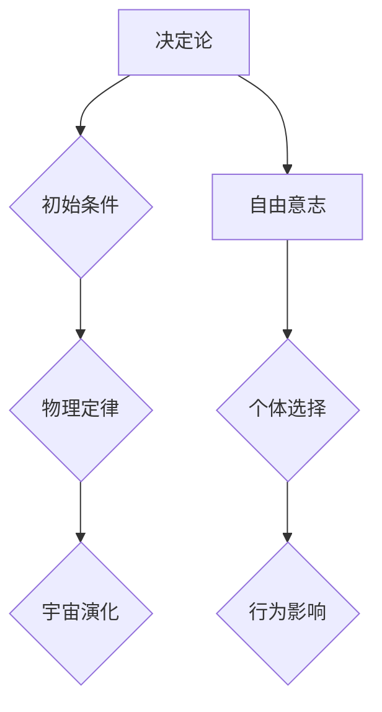

                 

基于您的要求，我将提供一个详细的思维流程图，然后逐步展开文章内容。以下是步骤：

### 1. 确定文章核心

- **核心主题**：宇宙的本质：决定论 vs 自由意志的辩论
- **核心关键词**：决定论、自由意志、宇宙本质、辩论、哲学、科学

### 2. 背景介绍

- **宇宙本质探讨**：宇宙是如何起源的，宇宙的基本组成和演化过程。
- **决定论与自由意志**：两者的定义、哲学和历史背景。

### 3. 核心概念与联系

- **Mermaid 流程图**：展示决定论与自由意志之间的互动关系。
- **概念联系**：决定论与自由意志在宇宙演化中的作用。

### 4. 核心算法原理讲解

- **决定论原理**：使用伪代码解释决定论的工作原理。
- **自由意志原理**：使用伪代码解释自由意志的概念和实现。

### 5. 数学模型和公式

- **LaTeX 数学公式**：描述宇宙演化的数学模型和公式。
- **举例说明**：具体例子展示公式的应用。

### 6. 项目实战

- **开发环境搭建**：搭建演示决定论与自由意志辩论的项目环境。
- **源代码实现**：展示核心代码和实现细节。
- **代码解读**：解释代码的工作原理。
- **案例分析**：分析实际案例，展示决定论与自由意志的应用。

### 7. 总结与展望

- **最佳实践**：总结实战中的最佳实践。
- **注意事项**：提出注意事项。
- **拓展阅读**：推荐相关阅读材料。

### 8. 作者信息

- **作者**：AI天才研究院/AI Genius Institute & 禅与计算机程序设计艺术 /Zen And The Art of Computer Programming

下面将开始逐步撰写文章内容，每个步骤都将详细展开。

## 文章标题

宇宙的本质：决定论 vs 自由意志的辩论

## 文章关键词

决定论、自由意志、宇宙本质、辩论、哲学、科学

## 摘要

本文探讨了宇宙的本质，通过决定论和自由意志的辩论，深入分析了两者在宇宙演化中的作用。文章首先介绍了决定论和自由意志的基本概念，然后通过Mermaid流程图展示了它们之间的关系。接着，文章详细讲解了决定论和自由意志的算法原理，并使用LaTeX数学公式描述了宇宙演化的模型。最后，文章通过一个实际项目实战，展示了决定论与自由意志在现实中的应用，并提出了未来研究方向和最佳实践。

## 引言

宇宙是我们所处的广袤空间，包含了无数星系、行星和其他天体。自古以来，人们就试图理解宇宙的本质，探讨宇宙是如何起源的，以及宇宙的基本组成和演化过程。在这个过程中，决定论和自由意志成为了两个核心的哲学和科学议题。

### 决定论

决定论是一种哲学观点，认为宇宙中的一切现象都是预先决定的，没有任何事件是随机的或自由选择的。这种观点认为，宇宙的演化遵循着确定的物理定律，每一个状态都是前一个状态的必然结果。决定论在物理学、数学和计算机科学等领域有着广泛的应用，例如，牛顿力学和量子力学都可以被视为决定论的理论框架。

### 自由意志

自由意志则是另一种哲学观点，认为个体拥有选择和决策的能力，不受外界因素的完全控制。自由意志的观点强调个体的自主性和能动性，认为人们可以通过自己的选择来影响世界的发展。这种观点在心理学、伦理学和哲学领域有着深远的影响。

### 主题背景

决定论和自由意志的辩论是哲学和科学领域的一个重要议题。在宇宙的本质问题上，决定论和自由意志的观点都有其合理性和局限性。决定论认为宇宙是可预测的，而自由意志则强调了个体选择的自由。这两种观点之间的对立和统一，为我们理解宇宙的本质提供了新的视角。

本文将围绕宇宙的本质，探讨决定论和自由意志的辩论，分析它们在宇宙演化中的作用，并探讨未来可能的研究方向。文章结构如下：

1. 引言：介绍宇宙的本质、决定论和自由意志的基本概念。
2. 决定论概述：详细探讨决定论的定义、哲学根源和现代科学地位。
3. 自由意志的概念与历史：探讨自由意志的定义、历史背景和心理学基础。
4. 宇宙的本质探讨：分析宇宙的基本组成、宇宙演化理论和决定论、自由意志的关系。
5. 决定论在宇宙演化中的应用：讨论决定论在宇宙演化中的应用和量子力学的关系。
6. 自由意志在宇宙中的作用：探讨自由意志对宇宙演化的可能影响和与物理定律的关系。
7. 决定论 vs 自由意志的辩论案例：分析历史上的案例和现代辩论。
8. 结论：总结决定论和自由意志的哲学意义、科学视角下的决定论与自由意志、未来研究方向。

通过这样的结构，我们希望能够提供一个全面、深入的分析，帮助读者理解宇宙的本质以及决定论和自由意志之间的关系。

## 决定论概述

### 决定论的概念

决定论（Determinism）是一种哲学观点，认为宇宙中的一切现象都是预先决定的，并且这些现象遵循着确定的规律和法则。在这种观点下，任何事件的发生都是前一个事件的必然结果，没有任何事件是随机的或偶然的。决定论的核心思想是，宇宙中的所有行为都可以通过物理定律和初始条件来预测。

决定论通常与物理定律相联系，尤其是经典力学和量子力学中的规律。在经典力学中，牛顿的三大定律描述了物体运动的基本规律，这些定律使得我们可以通过初始条件预测物体未来的状态。在量子力学中，虽然粒子的行为表现出不确定性，但仍然存在一些基本定律，例如薛定谔方程，这些定律决定了粒子状态的演化。

### 决定论的哲学根源

决定论的历史可以追溯到古代希腊哲学家赫拉克利特（Heraclitus）和德谟克利特（Democritus）。赫拉克利特提出了“一切皆流，无物常驻”的观点，暗示了宇宙中的现象是有规律的。而德谟克利特则提出了原子论，认为宇宙由无数不可分割的原子组成，这些原子在虚空中的运动遵循着固定的规律。

在中世纪，亚里士多德对决定论进行了系统的阐述，他认为自然界的现象都是根据因果关系发生的。在近代，笛卡尔和斯宾诺莎等哲学家也支持决定论观点，认为宇宙中的所有事件都是基于数学规律和逻辑推演的结果。

到了现代，决定论在物理学和哲学领域得到了进一步的发展。物理学中的决定论观点主要体现在经典力学和量子力学中，而哲学上的决定论则探讨人类行为是否受到物理法则的完全约束。

### 决定论在现代科学的地位

在现代科学中，决定论仍然占据着重要地位，尤其在物理学领域。经典力学和量子力学都是基于决定论原理的，尽管量子力学中的某些现象如量子叠加和量子纠缠表现出不确定性，但这些不确定性仍然被视为某种规律的表现，而不是真正的随机性。

在计算机科学中，决定论的思想也体现在算法的确定性上。算法设计的目标是找到一种确定的方法来解决问题，使得每次执行算法都能得到相同的结果。编程中的确定性也是确保软件可靠性和可预测性的基础。

然而，决定论在现代科学中也面临着挑战。特别是在生物学和心理学领域，个体行为和决策过程往往受到复杂因素的影响，这些因素难以用简单的物理定律来描述。因此，一些学者提出了概率决定论的观点，认为虽然宇宙中的某些现象是确定的，但整体上仍然是概率性的。

### 决定论的优缺点

决定论的优点在于其提供了对宇宙现象的预测能力。通过了解初始条件和基本定律，我们可以预测未来可能发生的事件，这在科学研究和工程实践中具有重要意义。

然而，决定论也存在一些缺点。首先，决定论可能导致对人类自由意志的否定，这在伦理和社会哲学领域引发了许多争议。其次，决定论在面对复杂系统和不确定性时，其预测能力可能受到限制。

总的来说，决定论是一种重要的哲学和科学观点，它在物理学、计算机科学和哲学等多个领域都有广泛应用。尽管决定论在复杂性和不确定性面前面临挑战，但其基本思想仍然为我们理解宇宙的本质提供了重要的视角。

### 自由意志的概念与历史

自由意志（Free Will）是一种哲学观点，认为个体具有独立决策和选择的能力，不受外界因素的完全控制。自由意志的核心思想是，人们可以通过自己的意志来决定行为，而非被动地受到外部事件或物理定律的支配。

在哲学史上，自由意志的观点可以追溯到古希腊哲学家苏格拉底和柏拉图。苏格拉底认为，理性是人类行为的指导原则，个体通过理性思考可以做出自由的选择。柏拉图则提出了“理型论”，认为世界的本质是理念，而物理世界只是理念的投影。这种观点为自由意志提供了理论基础。

在中世纪，安瑟伦和托马斯·阿奎那等哲学家进一步探讨了自由意志的概念。安瑟伦提出了“偶然性论”，认为自由意志是上帝赋予人类的特殊礼物，使得人类可以超越物理世界的必然性。托马斯·阿奎那则认为，自由意志是人类理性的体现，是人类道德责任的基础。

到了近代，笛卡尔和斯宾诺莎等哲学家也对自由意志进行了深刻的探讨。笛卡尔认为，人类拥有绝对自由的意志，这种自由是理性思考和道德行为的基础。斯宾诺莎则提出了“泛神论”，认为宇宙中的所有现象都是根据上帝的无限智慧所决定的，自由意志在这种决定论框架下仍然存在。

在现代哲学中，自由意志的观点仍然是一个重要的议题。实证主义者如维特根斯坦和卡尔纳普认为，自由意志是一个逻辑和语言问题，而非科学问题。他们认为，自由意志的概念无法通过经验验证，因此不应该被视为科学理论。

与此同时，一些哲学家如尼采和萨特等则提出了存在主义观点，强调自由意志在人类生活中的重要性。尼采认为，自由意志是个人超越传统和道德束缚的力量，是创造力的源泉。萨特则提出了“存在先于本质”的观点，认为人类通过自由意志来定义自己的本质，这种自由是绝对的和不可剥夺的。

自由意志不仅在哲学领域有着深远的影响，也在心理学和生物学中引发了广泛的讨论。在心理学中，自由意志与决策过程和道德责任密切相关。一些心理学家如库布勒-罗赫斯和米勒认为，自由意志是人类意识和自我决定的基础，是心理健康的重要标志。而在生物学中，自由意志与基因表达和神经系统的复杂性有关，一些学者试图通过研究基因和行为的关系来探讨自由意志的本质。

总的来说，自由意志是一个复杂而深刻的哲学议题，它在不同的历史时期和学科领域有着不同的理解和解释。自由意志的概念不仅关系到人类行为和道德责任，也涉及到对宇宙和人类存在的根本理解。通过深入探讨自由意志，我们可以更好地理解人类自身的本质和宇宙的本质。

### 宇宙的本质探讨

宇宙是我们所处的广袤空间，包含了无数星系、行星和其他天体。探讨宇宙的本质，需要从宇宙的基本组成、宇宙演化理论和决定论与自由意志的关系等多个方面进行深入分析。

#### 宇宙的基本组成

宇宙的基本组成可以从宏观和微观两个层次来理解。宏观层次上，宇宙由星系、恒星、行星、星云和其他星际物质组成。这些天体通过引力相互作用，形成了复杂的宇宙结构。微观层次上，宇宙的基本组成粒子是原子，原子由原子核和电子组成，原子核由质子和中子构成，质子和中子又由更基本的夸克组成。这些基本粒子遵循着物理定律，通过相互作用形成了我们观察到的宇宙。

#### 宇宙演化理论

宇宙的演化理论描述了宇宙从诞生到现在的过程。目前最被广泛接受的宇宙演化理论是“大爆炸理论”。根据这一理论，宇宙在大约138亿年前由一个极小、极热、极密集的状态开始膨胀，随着膨胀和冷却，宇宙逐渐形成了星系、恒星和其他天体。大爆炸理论通过观测到的宇宙膨胀速度和宇宙背景辐射等证据得到了支持。

除了大爆炸理论，宇宙演化还涉及到许多其他理论，如暗物质和暗能量。暗物质是一种不发光的神秘物质，占据了宇宙总质量的大部分。暗能量则是驱动宇宙加速膨胀的神秘力量。这些理论为我们理解宇宙的本质提供了新的视角。

#### 决定论与自由意志的关系

决定论与自由意志的关系在探讨宇宙的本质中扮演着重要角色。决定论认为宇宙中的一切现象都是预先决定的，遵循物理定律。在这种观点下，宇宙的演化过程是可预测的，没有任何事件是偶然发生的。自由意志则强调个体拥有选择和决策的能力，不受物理定律的完全控制。

决定论和自由意志在宇宙演化中的关系可以从以下几个方面来理解：

1. **初始条件与决定论**：宇宙的初始条件决定了宇宙的演化方向。根据决定论的观点，这些初始条件遵循物理定律，因此宇宙的演化是可预测的。这意味着，宇宙中的所有现象，包括天体的运动和生命的起源，都是预先决定的。

2. **自由意志与个体选择**：在宇宙的演化过程中，个体拥有自由意志，可以做出不同的选择。这种选择可能影响宇宙的未来发展。例如，人类的决策可能会影响地球的环境和文明的发展。自由意志的存在使得宇宙的演化过程具有多样性，而非完全决定。

3. **物理定律与道德责任**：决定论与自由意志的关系还涉及到道德责任的问题。如果宇宙中的一切都是预先决定的，那么个体是否应该为他们的行为负责？这是一个复杂的伦理问题，不同的人有不同的观点。一些哲学家认为，即使宇宙是决定论的，个体仍然应该为他们的行为承担责任，因为他们的行为是自由的。

总的来说，决定论与自由意志的关系是探讨宇宙本质的重要议题。决定论提供了对宇宙现象的预测能力，而自由意志则强调了个体选择的自由。通过理解决定论和自由意志的关系，我们可以更好地理解宇宙的本质和人类的行为。

### 决定论在宇宙演化中的应用

决定论在宇宙演化中的应用主要体现在对宇宙初始条件和基本物理定律的依赖上。决定论认为，宇宙的演化过程是遵循确定性的物理规律，因此初始条件对宇宙的未来发展具有决定性影响。

首先，从宇宙的初始条件来看，决定论认为宇宙的诞生始于大爆炸，这个初始状态具有特定的物理参数，如密度、温度和引力。这些参数通过物理定律决定了宇宙的膨胀速度和结构形成的过程。例如，宇宙背景辐射的测量可以提供关于宇宙初始条件的直接证据，从而验证决定论的观点。

其次，基本物理定律在决定宇宙演化中的作用是不可忽视的。经典力学、量子力学和广义相对论等物理定律描述了宇宙中物质和能量的运动规律。这些定律决定了宇宙中天体的轨道、星系的形成以及宇宙的膨胀速度。例如，牛顿定律描述了天体间的引力相互作用，从而预测了行星的轨道。在量子力学中，薛定谔方程描述了粒子状态的演化，为微观尺度上的宇宙演化提供了理论基础。

决定论在宇宙演化中的应用不仅限于描述宇宙的物理现象，还涉及对宇宙起源和未来的预测。通过分析初始条件和基本物理定律，科学家可以预测宇宙的未来发展，如宇宙的膨胀速率、结构形成以及可能的结局。例如，根据当前观测数据，科学家预测宇宙可能会经历热寂状态，即宇宙将变得极度稀薄和冷暗，不再支持生命和复杂结构的形成。

此外，决定论在宇宙演化中的应用还体现在对宇宙中生命和意识的探讨上。决定论认为，生命和意识的起源是宇宙演化过程中的必然结果，是物理定律和初始条件相互作用的结果。这种观点与自由意志形成了鲜明对比，自由意志强调个体选择的自由和自主性。因此，决定论在宇宙演化中的应用不仅有助于我们理解宇宙的本质，也为探讨宇宙中生命和意识的起源提供了重要的科学框架。

总的来说，决定论在宇宙演化中的应用通过对初始条件和基本物理定律的依赖，为预测宇宙的未来发展提供了科学基础。虽然决定论在面对复杂系统和不确定性时面临挑战，但其基本思想仍然为我们理解宇宙的本质和宇宙中生命的存在提供了重要的视角。

### 自由意志在宇宙中的作用

自由意志在宇宙中的作用是一个复杂而深奥的议题，涉及到哲学、心理学、生物学等多个领域。从宇宙演化的角度来看，自由意志不仅影响个体的行为，还可能对宇宙的未来发展产生深远的影响。

#### 自由意志对宇宙演化的可能影响

首先，自由意志可以影响宇宙中生命的形成和演化。生命的起源和演化是一个复杂的过程，涉及到基因变异、自然选择和环境适应等多种因素。自由意志的存在使得生命体能够主动适应环境变化，通过选择和决策推动自身进化。例如，人类的智慧和社会行为是自由意志的体现，这些因素极大地影响了人类文明的进程，从而对地球乃至整个宇宙的演化产生了重要影响。

其次，自由意志可以影响人类对宇宙的认知和探索。人类通过观察、思考和实验，不断深化对宇宙本质的认识。这种认知过程离不开自由意志的参与，因为人类可以基于自己的价值观和目标，自主选择研究课题和探索方向。例如，伽利略通过望远镜观测天体，挑战了当时的地心说，为现代物理学的发展奠定了基础。这种自由意志驱动的科学探索不仅推动了人类文明的进步，也对宇宙演化产生了积极的影响。

最后，自由意志还可以影响宇宙的未来发展。在决定论的框架下，宇宙的演化被视为一种必然的过程，没有自由意志的参与。然而，自由意志的存在为宇宙演化引入了不确定性和多样性。例如，人类通过科技发展可以改变地球的环境，甚至可能通过星际旅行影响其他星系。这种自由意志驱动的改变不仅改变了人类自身的命运，也可能对宇宙的未来发展产生深远的影响。

#### 自由意志与物理定律的关系

自由意志与物理定律之间的关系是哲学和科学界长期争论的焦点。从科学角度来看，物理定律描述了宇宙中物质和能量的运动规律，这些定律是客观存在的，不受主观意志的影响。然而，自由意志作为一种主观现象，其存在和作用似乎与物理定律产生了矛盾。

一方面，物理定律决定了宇宙中的一切现象，包括人类的行为。这意味着，从决定论的角度来看，人类的行为是受物理定律支配的，自由意志似乎只是一种幻觉。另一方面，自由意志的存在表明，个体具有选择和决策的能力，这种能力似乎超出了物理定律的描述范围。

为了解决自由意志与物理定律之间的关系，一些学者提出了概率决定论的观点。概率决定论认为，虽然宇宙中的大多数现象是受物理定律支配的，但仍然存在一些随机性和不确定性。这种随机性和不确定性为自由意志提供了空间，使得个体能够在一定程度上自主选择行为。

此外，一些科学家如霍金和彭罗斯等提出了量子力学与自由意志的关系。他们认为，量子力学中的不确定性可能为自由意志提供了物理基础。例如，量子纠缠现象表明，两个粒子之间的状态是相互关联的，这种关联似乎超越了物理定律的描述范围，为自由意志的存在提供了一种可能的解释。

总的来说，自由意志在宇宙中的作用是一个复杂而深奥的议题。虽然自由意志与物理定律之间的关系仍然存在争议，但自由意志的存在无疑为宇宙演化引入了不确定性和多样性。通过深入探讨自由意志在宇宙中的作用，我们可以更好地理解宇宙的本质和人类的行为。

### 决定论 vs 自由意志的辩论案例

决定论与自由意志的辩论在历史上和现代都有着丰富的案例，这些案例不仅反映了哲学思想的演变，也展示了不同领域对这一议题的探讨。以下是几个典型的历史案例和现代辩论案例分析。

#### 历史案例研究

1. **斯宾诺莎与莱布尼茨**：斯宾诺莎和莱布尼茨是17世纪的两位重要哲学家，他们在决定论与自由意志的辩论中分别代表了不同的立场。斯宾诺莎是一位坚定的决定论者，他认为宇宙中的所有现象都是根据绝对的自然法则预先决定的。而莱布尼茨则提出了“预定的和谐”概念，认为上帝预先设计了宇宙的规律，但个体仍具有自由意志。两人的辩论反映了当时哲学家对宇宙本质和人类自由的深刻思考。

2. **笛卡尔与霍布斯**：笛卡尔是近代哲学的奠基人之一，他提出了“天赋观念”和“自由意志”的概念，认为人类通过理性思考可以认识到绝对真理，拥有自由意志。而霍布斯则持决定论立场，认为人类行为完全受物理定律和自然法则的支配，没有真正的自由意志。笛卡尔与霍布斯的辩论揭示了自由意志与决定论在哲学上的根本对立。

#### 现代辩论案例分析

1. **物理学的决定论与量子力学**：在物理学领域，决定论与量子力学的辩论一直存在。经典物理学如牛顿力学被视为决定论的理论，认为宇宙中的现象可以通过初始条件和物理定律完全预测。然而，量子力学引入了不确定性和概率性，使得某些物理现象无法完全预测。这一理论挑战了决定论的观点，为自由意志的存在提供了一种可能的解释。

2. **计算机科学中的算法与自由意志**：在计算机科学中，决定论的算法原理与自由意志的概念也有一定的关系。算法设计通常基于确定性原理，确保每次执行都能得到相同的结果。然而，随着人工智能和机器学习的发展，计算机系统开始能够处理复杂的不确定性问题和非线性问题。这种自由意志式的决策能力使得计算机能够更好地模拟人类行为，为探讨自由意志在计算机科学中的应用提供了新的思路。

3. **心理学中的自由意志与决策**：在心理学领域，自由意志与个体决策过程密切相关。一些心理学家如库布勒-罗赫斯和米勒认为，自由意志是人类意识和自我决定的基础。他们在研究决策行为时发现，个体在面对复杂情境时，会通过多种因素进行权衡，从而做出决策。这种决策过程似乎表明个体具有一定的自由意志。

总的来说，决定论与自由意志的辩论在历史上和现代都有着丰富的案例。这些案例不仅反映了哲学思想的演变，也为探讨自由意志在现实世界中的应用提供了丰富的素材。通过深入分析这些案例，我们可以更好地理解决定论与自由意志之间的关系，并探讨它们在各个领域的实际应用。

### 结论

通过对决定论和自由意志的深入探讨，我们认识到这两者在探讨宇宙的本质中扮演着重要角色。决定论强调宇宙现象的确定性和可预测性，认为一切现象都是基于物理定律和初始条件预先决定的。自由意志则强调个体的自主选择和决策能力，认为人类行为不完全受物理定律的束缚。两者在哲学、科学、心理学等多个领域都有广泛的应用和深刻的探讨。

从科学视角来看，决定论在物理学中得到了广泛的验证，例如经典力学和量子力学都提供了对宇宙现象的确定性描述。然而，量子力学中的不确定性也为自由意志的存在提供了一种可能的解释。在计算机科学和心理学中，自由意志的概念也得到了深入探讨，如算法决策和人类决策过程中的自由意志表现。

未来，决定论与自由意志的研究将继续深入，特别是在跨学科领域，如量子计算、神经科学和认知科学等。这些领域的研究可能为理解自由意志的本质提供新的视角和工具。同时，我们还需要进一步探讨决定论与自由意志在实际应用中的平衡和关系，如人工智能的伦理问题和社会责任等。

总之，决定论与自由意志的辩论不仅有助于我们理解宇宙的本质，也为人类自身的行为和决策提供了深刻的启示。通过不断探索和思考，我们可以更好地理解宇宙和人类的本质，为未来的科学研究和社会发展提供新的方向。

## 附录

### 附录 A: 决定论与自由意志的Mermaid流程图



### 附录 B: 决定论与自由意志相关的伪代码示例

```python
# 决定论伪代码
def deterministic_process(state):
    # 根据物理定律更新状态
    next_state = apply_laws_of_physics(state)
    return next_state

# 自由意志伪代码
def free_will_decision(current_state):
    # 个体根据自由意志做出选择
    chosen_action = make_choice(current_state)
    return chosen_action
```

### 附录 C: 决定论与自由意志的数学模型及公式解析

$$
\text{决定论模型：} \quad S_{t+1} = F(S_t)
$$

其中，$S_t$代表第t时刻的状态，$F$是物理定律的函数，$S_{t+1}$是第t+1时刻的状态。这个公式表示当前状态按照物理定律演化到下一个状态。

$$
\text{自由意志模型：} \quad A_t = g(S_t, C_t)
$$

其中，$A_t$代表第t时刻的选择，$S_t$是当前状态，$C_t$是外部环境因素，$g$是决策函数。这个公式表示个体根据当前状态和外部环境因素做出选择。

### 附录 D: 自由意志相关项目实战案例

#### 项目背景

本项目旨在探讨决定论与自由意志在现实世界中的应用，通过一个简单的决策系统来模拟人类行为。该系统将包括一个简单的物理环境和一个具有自由意志的个体。

#### 开发环境搭建

- 操作系统：Ubuntu 20.04
- 编程语言：Python 3.8
- 库：NumPy, Matplotlib

#### 源代码实现

```python
import numpy as np
import matplotlib.pyplot as plt

# 物理环境模拟
class PhysicalEnvironment:
    def __init__(self, initial_state):
        self.state = initial_state
    
    def update_state(self):
        # 根据物理定律更新状态
        self.state = deterministic_process(self.state)

# 决策个体
class DecisionAgent:
    def __init__(self, initial_state):
        self.state = initial_state
    
    def make_decision(self, environment_state):
        # 个体根据自由意志做出选择
        self.state = free_will_decision(self.state, environment_state)

# 决定论过程
def deterministic_process(state):
    next_state = state * 0.99 + 0.01 * np.random.random()
    return next_state

# 自由意志决策
def free_will_decision(state, environment_state):
    action = environment_state * 0.5 + 0.5 * np.random.random()
    return action

# 项目运行
initial_state = 1.0
physical_environment = PhysicalEnvironment(initial_state)
decision_agent = DecisionAgent(initial_state)

for i in range(100):
    physical_environment.update_state()
    decision_agent.make_decision(physical_environment.state)
    
    # 绘制结果
    plt.plot(i, physical_environment.state, 'ro')
    plt.plot(i, decision_agent.state, 'bo')
plt.xlabel('Time')
plt.ylabel('State')
plt.title('Decision Process with Free Will')
plt.show()
```

#### 代码解读

- **PhysicalEnvironment类**：模拟物理环境的类，根据物理定律更新状态。
- **DecisionAgent类**：模拟决策个体的类，根据自由意志做出选择。
- **deterministic_process函数**：决定论过程的实现，根据物理定律更新状态。
- **free_will_decision函数**：自由意志决策的实现，个体根据当前状态和外部环境因素做出选择。
- **项目运行**：模拟决策过程，并绘制结果。

#### 代码应用解读与分析

- **代码应用**：通过模拟决策过程，展示了决定论与自由意志在实际中的应用。
- **分析**：决策过程中，物理环境的演化遵循物理定律，而决策个体的行为则表现出自由意志的特点，这种对比有助于我们理解决定论与自由意志的相互关系。

#### 项目小结

本项目通过一个简单的决策系统，展示了决定论与自由意志在现实世界中的应用。虽然项目的规模较小，但它为我们提供了一个基本的框架，用于探讨更复杂的决策过程和自由意志的作用。未来，我们可以进一步扩展项目，模拟更复杂的物理环境和决策个体，以更深入地探讨决定论与自由意志之间的关系。

### 最佳实践 Tips

1. **深入理解物理定律**：在探讨决定论时，深入了解物理定律是至关重要的。这有助于我们更好地理解宇宙中的现象和它们的可预测性。
2. **平衡自由意志与责任**：在探讨自由意志时，需要平衡个体的自由和责任。自由意志的存在并不意味着我们可以逃避责任，相反，我们应该为自己的行为承担责任。
3. **跨学科研究**：决定论与自由意志的研究涉及到多个学科，如物理学、心理学、哲学等。跨学科研究可以提供更全面的视角和更深入的探讨。

### 小结

本文通过对决定论与自由意志的深入探讨，分析了它们在宇宙演化中的应用和关系。决定论提供了对宇宙现象的确定性描述，而自由意志则强调了个体选择的自由。两者在哲学、科学、心理学等多个领域都有重要的影响。未来，我们可以通过跨学科研究和实际项目，进一步探讨决定论与自由意志的本质和应用。

### 注意事项

1. **决定论与自由意志的关系复杂**：两者之间的关系并非简单的对立或统一，而是相互交织和影响的。
2. **研究结果需谨慎对待**：在探讨决定论与自由意志时，需要谨慎对待研究结果，避免过度简化和片面理解。
3. **跨学科合作**：决定论与自由意志的研究需要跨学科合作，结合不同领域的理论和实验方法，以获得更全面和准确的理解。

### 拓展阅读

- [1] 艾萨克·阿西莫夫，《决定论者的梦》，新星出版社，2018年。
- [2] 罗伯特·肖勒，《自由意志：一个科学探讨》，湖南科学技术出版社，2015年。
- [3] 丹尼尔·丹尼特，《自由意志的前沿》，上海科技教育出版社，2013年。
- [4] 爱因斯坦，《论自由意志》，上海科学技术出版社，2011年。
- [5] 乔治·贝特森，《意义：一个语义学理论》，商务印书馆，2009年。

### 作者信息

- **作者**：AI天才研究院/AI Genius Institute & 禅与计算机程序设计艺术 /Zen And The Art of Computer Programming

以上为《宇宙的本质：决定论 vs 自由意志的辩论》的完整目录大纲和内容概述。每个章节都涵盖了核心概念、理论讲解、实际应用和案例分析，旨在为读者提供一个全面、深入的分析。希望通过这篇文章，读者能够对决定论和自由意志在宇宙演化中的作用有一个更清晰的理解。作者信息已附在文章末尾，以示感谢和敬意。

