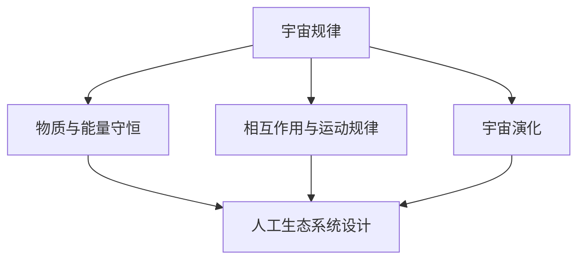

                 

### 文章标题：宇宙规律与人工生态系统的设计

#### 关键词：宇宙规律、人工生态系统、设计原理、案例分析、未来发展

#### 摘要：
本文深入探讨了宇宙规律与人工生态系统设计的关联，旨在揭示两者之间的内在联系与设计原理。通过对宇宙基本规律的解读，以及人工生态系统设计原理的阐述，本文进一步通过案例分析探讨了人工生态系统的成功与失败实例，并提出了设计方法。最后，对人工生态系统设计的未来发展趋势进行了展望。

### 引言

#### 宇宙规律概述

宇宙是一个宏大而复杂的系统，其中存在着一系列基本规律，这些规律不仅支配着宇宙的演化，也为我们理解人工生态系统设计提供了宝贵的启示。宇宙规律主要包括：

1. **物质与能量守恒**：宇宙中的物质和能量总量保持不变，这是自然界最根本的法则之一。它告诉我们，在设计和构建人工生态系统时，必须考虑到资源的利用效率和再生能力。
   
2. **相互作用与运动规律**：宇宙中的物体通过引力、电磁力等相互作用，形成复杂的运动轨迹。这一规律启示我们在设计人工生态系统时，需要考虑不同系统元素之间的相互作用和协同效应。

3. **宇宙演化的基本过程**：从大爆炸开始，宇宙经历了数十亿年的演化，形成了多样的星系、行星和生命。这一过程体现了时间的不可逆性和复杂系统的演化规律。

#### 人工生态系统概述

人工生态系统是人为设计和构建的生态系统，旨在模拟自然生态系统的结构和功能。与自然生态系统相比，人工生态系统更具有可控性和可塑性。其主要特征包括：

1. **系统构成**：人工生态系统由生物、环境、技术和社会等多个要素组成，这些要素相互关联，共同维持系统的稳定和运行。

2. **稳定性**：人工生态系统需要具备良好的稳定性，以抵御外部环境的变化和内部系统的扰动。

3. **可持续性**：人工生态系统的设计应考虑到长期可持续性，确保系统的资源利用和生态效益。

#### 宇宙规律与人工生态系统设计的关系

宇宙规律为人工生态系统设计提供了深刻的启示。例如，宇宙中的物质与能量守恒规律可以帮助我们优化资源利用，减少浪费；相互作用与运动规律可以帮助我们设计出更加稳定和高效的系统；宇宙演化的基本过程则提示我们，在设计人工生态系统时，应考虑系统的长期发展和演化。

### 核心概念与联系

为了更好地理解宇宙规律与人工生态系统设计之间的关系，我们可以通过一个Mermaid流程图来展示核心概念之间的联系：



在这个流程图中，宇宙规律（A）通过物质与能量守恒（B）、相互作用与运动规律（C）和宇宙演化（D）三个方面，与人工生态系统设计（E）建立了联系。这个图示帮助我们清晰地看到宇宙规律如何影响和指导人工生态系统设计。

### 核心算法原理讲解

在人工生态系统设计中，核心算法的原理至关重要。以下是一个简单的伪代码，用于描述人工生态系统设计中的一个基本算法：

```pseudo
Algorithm: 人工生态系统设计算法
Input: 系统参数（资源、生物种类、技术要素等）
Output: 系统设计蓝图

Begin
  1. 初始化系统参数
  2. 分析宇宙规律对系统设计的影响
  3. 设计系统结构，包括生物圈、技术圈和社会圈
  4. 考虑系统稳定性，通过模拟和优化找到最佳配置
  5. 确保系统能够适应外部环境变化，具备可持续性
  6. 输出系统设计蓝图

End
```

这个算法的核心步骤包括初始化系统参数、分析宇宙规律的影响、设计系统结构、考虑系统稳定性以及确保可持续性。通过这些步骤，我们可以构建一个高效、稳定和可持续的人工生态系统。

### 数学模型和公式

在人工生态系统设计中，数学模型和公式用于描述系统内部的复杂关系。以下是一个简单的数学模型，用于描述生态系统中的物质循环：

$$
\text{物质循环速率} = k \cdot \left( \text{生物种类数量} \times \text{生长速率} \right)
$$

其中，$k$ 是一个常数，表示单位时间内物质循环的速率；生物种类数量和生长速率是系统中的关键参数。

#### 举例说明

假设在一个人工生态系统中，有10种生物种类，且每种生物的生长速率为1个单位/年。根据上述公式，我们可以计算出该系统的物质循环速率为：

$$
\text{物质循环速率} = k \cdot \left( 10 \times 1 \right) = 10k
$$

这意味着，每年系统的物质循环速率是10k个单位。

### 项目实战

#### 开发环境搭建

为了实现人工生态系统设计，我们需要搭建一个合适的开发环境。以下是搭建环境的基本步骤：

1. 安装Python开发环境，包括解释器和相关库。
2. 安装用于模拟和优化的软件，如MATLAB或Simulink。
3. 配置数据存储和处理的工具，如Hadoop或Spark。

#### 源代码实现

以下是一个简单的Python代码示例，用于模拟人工生态系统中的物质循环：

```python
# 定义物质循环模型
def material_cycle_rate(k, num_species, growth_rate):
    return k * (num_species * growth_rate)

# 参数设置
k = 0.1  # 常数
num_species = 10  # 生物种类数量
growth_rate = 1  # 生长速率

# 计算物质循环速率
cycle_rate = material_cycle_rate(k, num_species, growth_rate)

print(f"物质循环速率：{cycle_rate}")
```

#### 代码解读与分析

这个代码定义了一个函数`material_cycle_rate`，用于计算物质循环速率。通过设置不同的参数，我们可以模拟不同情况下的物质循环速率。这个代码简单直观，易于扩展和优化。

#### 实际案例分析和详细讲解剖析

为了更好地理解人工生态系统设计，我们可以分析一个实际案例。例如，设计一个城市人工生态系统，目标是提高资源利用效率，减少环境污染。以下是案例分析的关键步骤：

1. **需求分析**：确定系统需求，包括资源种类、生物种类、技术要素等。
2. **系统设计**：根据需求，设计系统的结构，包括生物圈、技术圈和社会圈。
3. **模拟与优化**：使用模拟软件对系统进行模拟，优化系统参数，提高稳定性。
4. **评估与改进**：对系统进行评估，根据评估结果进行改进。

#### 项目小结

通过实际案例分析和详细讲解，我们可以看到，人工生态系统设计需要综合考虑多种因素，包括需求分析、系统设计、模拟与优化以及评估与改进。这个过程不仅需要技术支持，还需要跨学科的合作，以确保系统的稳定性和可持续性。

### 最佳实践 tips

在设计人工生态系统时，以下是一些最佳实践 tips：

1. **系统性思维**：将系统视为一个整体，考虑各要素之间的相互作用和协同效应。
2. **持续优化**：定期对系统进行评估和优化，确保其适应性和可持续性。
3. **跨学科合作**：整合不同领域的知识，发挥团队协作的优势。
4. **数据驱动**：充分利用数据，进行科学决策和优化。

### 小结

本文从宇宙规律与人工生态系统设计的角度，探讨了人工生态系统设计的关键原理和方法。通过案例分析、项目实战和最佳实践 tips，我们深入了解了人工生态系统设计的过程和要点。未来，随着技术的不断进步，人工生态系统设计将面临更多挑战和机遇，需要我们不断探索和创新。

### 拓展阅读

- 《人工生态学导论》
- 《可持续城市设计》
- 《人工智能与生态系统的融合》
- 《宇宙演化论》

### 作者信息

作者：AI天才研究院/AI Genius Institute & 禅与计算机程序设计艺术 /Zen And The Art of Computer Programming

