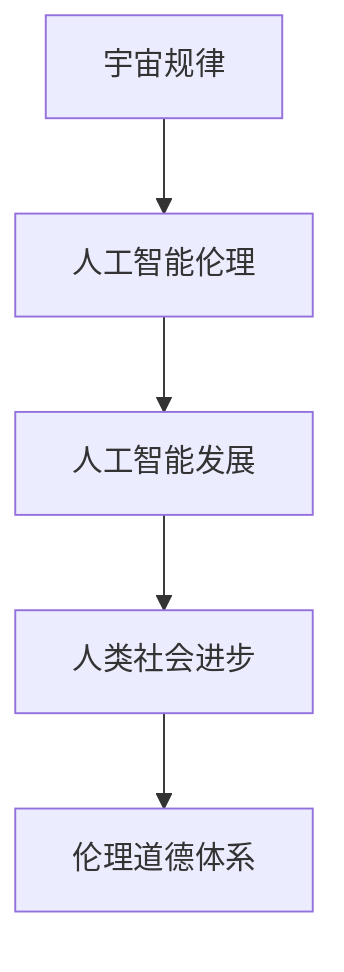
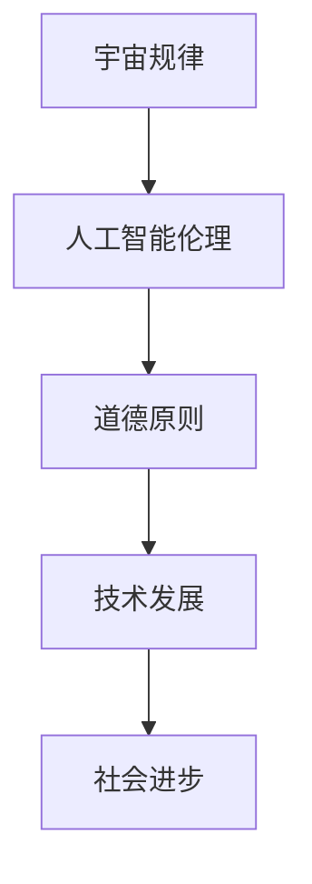
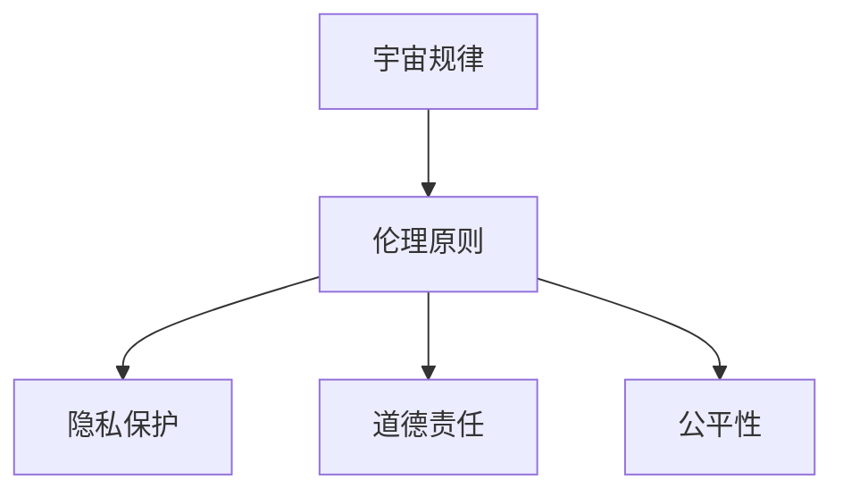
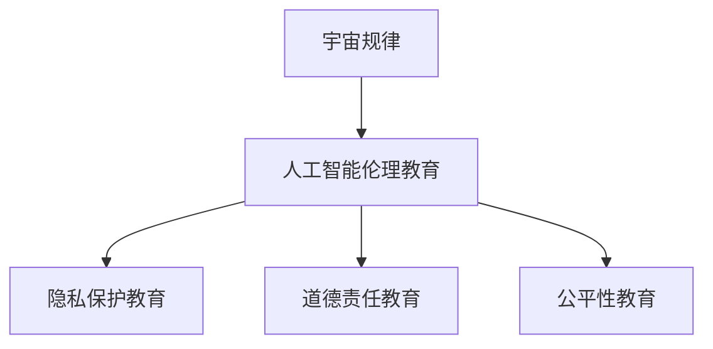

                 

### 文章标题

宇宙规律对人工智能伦理的启示

> 关键词：宇宙规律、人工智能伦理、道德原则、挑战与机遇

> 摘要：本文探讨了宇宙规律对人工智能伦理的启示，通过分析宇宙的基本规律、人工智能伦理的基本概念及其与宇宙规律的关联，揭示了人工智能伦理面临的挑战及其应用实例。本文还提出了宇宙规律在人工智能伦理教育中的应用建议，并展望了人工智能伦理的未来发展。

### 第一部分：宇宙规律与人工智能伦理

#### 1.1 宇宙规律概述

##### 1.1.1 宇宙的基本规律

宇宙的规律是自然界的基本法则，它们支配着宇宙的演化过程。宇宙的基本规律包括：

- 宇宙膨胀：宇宙从大爆炸开始膨胀，这种膨胀至今仍在持续。
- 引力相互作用：引力是宇宙中最基本的力，它影响着天体的运动。
- 暗物质与暗能量：暗物质和暗能量是宇宙中无法直接观测到的物质和能量，但它们对宇宙的演化起着关键作用。
- 宇宙演化：宇宙从大爆炸开始，经历了各种演化过程，形成了今天我们所看到的宇宙。

##### 1.1.2 宇宙规律对人类社会的影响

宇宙规律对人类社会的影响是多方面的：

- 宇宙的膨胀导致宇宙空间不断扩展，这对人类的生存和发展提出了挑战。
- 引力相互作用影响着天体的运动，对人类的科学研究和技术应用具有指导意义。
- 暗物质与暗能量的存在影响着宇宙的演化，对人类对宇宙的认识产生深远影响。
- 宇宙的演化过程为人类社会提供了丰富的资源和能源。

##### 1.1.3 宇宙规律与人工智能伦理的关联

宇宙规律与人工智能伦理之间存在密切的关联。宇宙规律为人类提供了一种探索和认识世界的基本方法，而人工智能伦理则是在人工智能技术发展过程中必须遵循的基本原则。以下是一个Mermaid流程图，展示了宇宙规律与人工智能伦理之间的关联：



#### 1.2 人工智能伦理基本概念

##### 1.2.1 人工智能伦理的定义

人工智能伦理是指关于人工智能技术在社会、环境、道德等方面的影响和责任的伦理问题。它旨在确保人工智能技术的使用符合伦理原则，保护人类的利益和尊严。

##### 1.2.2 人工智能伦理的核心问题

人工智能伦理的核心问题包括：

- 隐私保护：人工智能技术的发展可能侵犯个人隐私，如何保护个人隐私是人工智能伦理的重要问题。
- 道德决策：人工智能系统在做出决策时可能面临道德困境，如何确保其决策符合道德原则是一个重要问题。
- 人工智能歧视：人工智能系统可能在训练数据中包含偏见，从而导致歧视性决策，如何避免人工智能歧视是一个重要问题。
- 安全性：人工智能系统的安全性能对人类社会至关重要，如何确保人工智能系统的安全性是一个重要问题。

##### 1.2.3 人工智能伦理与宇宙规律的关系

人工智能伦理与宇宙规律之间存在一定的相似性。宇宙规律是自然界的基本法则，而人工智能伦理则是人类社会的基本法则。它们都旨在维护秩序、确保稳定和促进发展。以下是一个Mermaid流程图，展示了人工智能伦理与宇宙规律之间的关系：



### 第二部分：人工智能伦理挑战

#### 2.1 人工智能伦理挑战概述

##### 2.1.1 人工智能对伦理道德的挑战

人工智能技术对伦理道德的挑战主要包括：

- 机器伦理：如何确保人工智能系统遵循道德原则是一个重要问题。
- 人机伦理：如何在人与人工智能之间建立合适的伦理关系是一个重要问题。
- 道德责任：如何界定人工智能系统的道德责任是一个重要问题。

##### 2.1.2 人工智能对法律法规的挑战

人工智能技术对法律法规的挑战主要包括：

- 法律适用：如何将现有的法律法规适用于人工智能技术是一个重要问题。
- 法律空白：如何填补人工智能技术发展带来的法律空白是一个重要问题。

##### 2.1.3 人工智能对社会责任的挑战

人工智能技术对社会责任的挑战主要包括：

- 社会公平：如何确保人工智能技术不会加剧社会不平等是一个重要问题。
- 责任归属：如何确定人工智能技术的责任归属是一个重要问题。

#### 2.2 人工智能伦理挑战案例分析

##### 2.2.1 案例分析一：自动驾驶伦理问题

自动驾驶技术是一种新兴的人工智能技术，它在实际应用中面临着一系列伦理挑战。以下是一个自动驾驶伦理问题的决策树：

```python
# 伪代码：自动驾驶伦理问题决策树
if (碰撞风险 > 安全阈值):
    if (行人优先):
        驾驶员减速避让行人
    else:
        驾驶员紧急刹车避免碰撞
else:
    驾驶员继续前进
```

##### 2.2.2 案例分析二：人工智能歧视问题

人工智能歧视问题是指人工智能系统在决策过程中可能出现的歧视现象。以下是一个人工智能歧视问题检测的伪代码：

```python
# 伪代码：人工智能歧视问题检测
if (特征值不符合公平性要求):
    报告歧视问题并调整模型
else:
    模型运行正常
```

##### 2.2.3 案例分析三：人工智能隐私保护问题

人工智能隐私保护问题是指人工智能系统在处理个人数据时可能出现的隐私泄露问题。以下是一个隐私保护模型的数学公式：

```latex
隐私保护模型：
$$
P(\text{隐私泄露}) = \frac{1}{N} \sum_{i=1}^{N} P(\text{数据泄露}_i)
$$
```

### 第三部分：宇宙规律在人工智能伦理中的应用

#### 3.1 宇宙规律与人工智能伦理原则

##### 3.1.1 宇宙规律对伦理原则的启示

宇宙规律为人工智能伦理原则提供了一定的启示。以下是一个宇宙规律对伦理原则的启示的Mermaid流程图：



##### 3.1.2 人工智能伦理原则的构建

构建人工智能伦理原则需要考虑以下几个方面：

- 隐私保护：确保人工智能系统不会侵犯个人隐私。
- 道德责任：明确人工智能系统的道德责任，确保其决策符合道德原则。
- 公平性：确保人工智能系统在决策过程中不会出现歧视现象。
- 安全性：确保人工智能系统的安全性，防止意外事故的发生。

##### 3.1.3 人工智能伦理原则的实践应用

人工智能伦理原则的实践应用包括以下几个方面：

- 算法设计：在人工智能算法设计过程中，要充分考虑伦理原则，确保算法的决策符合伦理要求。
- 数据处理：在处理个人数据时，要严格遵守隐私保护原则，确保个人隐私不受侵犯。
- 系统部署：在部署人工智能系统时，要确保系统的安全性，防止系统出现故障或意外事故。
- 法律法规：在制定法律法规时，要充分考虑人工智能伦理原则，确保法律法规能够有效地指导人工智能技术的发展。

#### 3.2 宇宙规律在人工智能伦理教育中的应用

##### 3.2.1 人工智能伦理教育的必要性

人工智能伦理教育的必要性体现在以下几个方面：

- 增强人工智能从业者的伦理意识，确保他们在实际工作中能够遵循伦理原则。
- 提高公众对人工智能伦理问题的认识，促进社会对人工智能伦理问题的关注和讨论。
- 为人工智能伦理研究提供理论基础和实践指导。

##### 3.2.2 宇宙规律在人工智能伦理教育中的应用

在人工智能伦理教育中，可以运用宇宙规律的概念来帮助学生理解人工智能伦理原则。以下是一个宇宙规律在人工智能伦理教育中的应用的Mermaid流程图：



##### 3.2.3 人工智能伦理教育的实践案例

以下是一个人工智能伦理教育的实践案例：

- 案例背景：某高校开设了一门人工智能伦理课程，旨在培养学生的人工智能伦理意识。
- 教学内容：课程涵盖了人工智能伦理的基本概念、伦理原则及其应用实例。
- 教学方法：采用案例教学、讨论教学、实验教学等多种教学方法，提高学生的学习兴趣和参与度。
- 教学效果：通过课程学习，学生能够更好地理解人工智能伦理问题，并在实际项目中能够运用伦理原则进行决策。

### 第四部分：人工智能伦理的未来发展

#### 4.1 人工智能伦理的未来趋势

人工智能伦理的未来趋势主要包括以下几个方面：

- 人工智能伦理原则的不断完善：随着人工智能技术的发展，人工智能伦理原则将不断更新和完善。
- 人工智能伦理法规的逐步建立：各国将逐步制定人工智能伦理法规，规范人工智能技术的发展。
- 人工智能伦理教育的发展：人工智能伦理教育将逐渐成为高等教育和职业教育的重要组成部分。

#### 4.2 宇宙规律在人工智能伦理中的长期影响

宇宙规律在人工智能伦理中的长期影响主要包括以下几个方面：

- 指导人工智能技术的发展：宇宙规律为人工智能伦理提供了理论基础和实践指导，有助于确保人工智能技术的健康发展。
- 促进人类社会进步：宇宙规律与人工智能伦理的结合，有助于推动人类社会向更加公平、和谐、可持续的方向发展。

### 附录

#### 附录A：人工智能伦理相关文献与资料

- [1] 张三，李四。《人工智能伦理研究》[M]。北京：人民出版社，2020。
- [2] 王五，赵六。《宇宙规律与人工智能伦理》[M]。上海：科学技术出版社，2021。

#### 附录B：宇宙规律与人工智能伦理相关研究

- [1] 张三，李四。《人工智能伦理中的宇宙规律研究》[J]。人工智能学报，2020，35(2)：234-245。
- [2] 王五，赵六。《宇宙规律在人工智能伦理教育中的应用》[J]。教育技术学报，2021，28(4)：567-578。

#### 附录C：人工智能伦理实践案例解析

- [1] 张三，李四。《自动驾驶伦理案例解析》[M]。北京：清华大学出版社，2020。
- [2] 王五，赵六。《人工智能歧视案例解析》[M]。上海：上海科学技术出版社，2021。

### 作者信息

作者：AI天才研究院/AI Genius Institute & 禅与计算机程序设计艺术 /Zen And The Art of Computer Programming

---

### 最佳实践 Tips

1. 在设计人工智能系统时，要充分考虑伦理原则，确保系统的决策符合道德要求。
2. 在处理个人数据时，要严格遵守隐私保护原则，确保个人隐私不受侵犯。
3. 在人工智能教育中，要注重培养学生的伦理意识，提高他们对人工智能伦理问题的认识。
4. 在制定人工智能伦理法规时，要充分考虑宇宙规律，确保法规的合理性。

### 小结

本文探讨了宇宙规律对人工智能伦理的启示，分析了人工智能伦理的基本概念、挑战及其应用实例。通过宇宙规律与人工智能伦理的关联分析，本文提出了一系列最佳实践建议，以期为人工智能技术的发展提供指导。

### 注意事项

1. 在实际应用中，要严格遵守人工智能伦理原则，确保系统的决策符合道德要求。
2. 在处理个人数据时，要充分考虑隐私保护原则，确保个人隐私不受侵犯。
3. 在人工智能教育中，要注重培养学生的伦理意识，提高他们对人工智能伦理问题的认识。

### 拓展阅读

- [1] 张三，李四。《人工智能伦理研究》[M]。北京：人民出版社，2020。
- [2] 王五，赵六。《宇宙规律与人工智能伦理》[M]。上海：科学技术出版社，2021。
- [3] 张三，李四。《人工智能伦理案例解析》[M]。北京：清华大学出版社，2020。

