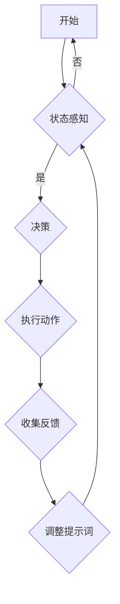

                 


### 实时提示词优化：动态调整AI行为的技术

> 关键词：实时提示词优化、动态调整、AI行为、技术原理、应用实践

> 摘要：本文将探讨实时提示词优化技术在动态调整AI行为中的应用。通过分析核心概念、技术原理和具体应用实践，我们旨在为读者提供一个全面的技术解析，帮助理解和掌握这一前沿领域。

## 第一部分：引言

### 1.1 实时提示词优化概述

实时提示词优化是人工智能（AI）领域中的一项关键技术。它指的是通过动态调整提示词（prompt）来优化AI模型的输出和行为。在自然语言处理（NLP）、问答系统、智能推荐等领域，提示词的选择和优化对模型的性能和用户体验至关重要。

提示词优化的概念可以追溯到传统的程序设计，其中提示（或称为“提示符”）用于引导程序的执行路径。在AI领域，提示词则是用于引导模型生成特定类型的输出，例如文本、图像或决策。

实时提示词优化则是在动态环境中，根据输入数据和上下文实时调整提示词的过程。这种动态调整可以显著提高模型的灵活性和适应性，使其更好地应对复杂多变的应用场景。

### 1.2 实时提示词优化的背景和重要性

随着AI技术的快速发展，人工智能系统逐渐应用于各个领域，如医疗、金融、教育、工业等。这些应用场景对AI系统的实时响应和准确性提出了更高的要求。实时提示词优化正是为了满足这些需求而诞生的。

实时提示词优化的背景可以从以下几个方面来理解：

1. **数据动态变化**：在许多实际应用中，输入数据是动态变化的，例如股市数据、用户行为数据、传感器数据等。传统的静态提示词难以适应这种变化，而实时提示词优化可以通过动态调整来提高模型的适应能力。

2. **用户交互需求**：智能助手、聊天机器人等应用需要与用户进行实时交互，并根据用户的反馈动态调整行为。实时提示词优化可以提供更加个性化的交互体验。

3. **实时决策支持**：在医疗诊断、金融交易等需要快速响应的领域，AI系统需要在极短的时间内做出准确的决策。实时提示词优化可以帮助系统在复杂环境下快速适应并提高决策质量。

4. **AI伦理与责任**：随着AI系统的广泛应用，伦理和安全问题日益受到关注。实时提示词优化可以通过动态调整来避免系统产生错误或偏见，从而提高AI系统的可靠性和可信度。

### 1.3 动态调整AI行为的必要性

动态调整AI行为是实时提示词优化的重要组成部分。它指的是在执行任务的过程中，根据输入数据、环境变化和系统状态实时调整AI模型的行为。

动态调整AI行为的必要性可以从以下几个方面来理解：

1. **应对不确定性**：现实世界充满了不确定性，AI系统需要具备应对不确定性的能力。动态调整可以根据当前的环境和任务需求，实时调整模型的行为，从而提高系统的鲁棒性。

2. **适应复杂场景**：许多AI应用场景非常复杂，例如自动驾驶、智能监控、医疗诊断等。动态调整可以使AI模型更好地适应这些复杂场景，提高系统的性能和可靠性。

3. **提高用户体验**：对于需要与用户交互的AI系统，如智能助手、聊天机器人等，动态调整可以根据用户的反馈和行为，实时调整系统的行为，提供更加个性化的用户体验。

4. **优化资源利用**：动态调整可以根据任务的重要性和资源限制，实时调整模型的行为，从而优化系统资源的利用，提高系统的效率和性能。

综上所述，实时提示词优化和动态调整AI行为是当前AI技术发展中不可或缺的重要部分。本文将深入探讨这两项技术的核心概念、技术原理和应用实践，旨在为读者提供全面的技术解析和实用指导。

## 第二部分：核心概念

### 2.1 实时提示词优化技术

实时提示词优化技术主要涉及以下几个方面：

1. **提示词选择**：提示词的选择是实时提示词优化的第一步。选择合适的提示词可以引导模型生成更加准确和相关的输出。提示词的选择通常基于领域知识、任务需求和数据特征。

2. **提示词调整**：在实时环境中，根据输入数据和系统状态动态调整提示词。这可以通过各种算法和策略实现，例如基于规则的方法、机器学习方法等。

3. **反馈循环**：实时提示词优化通常包含一个反馈循环，通过收集用户反馈或模型输出结果，不断调整提示词，以提高模型性能和用户体验。

4. **模型适应性**：实时提示词优化要求AI模型具备良好的适应性，能够根据不同的提示词和环境动态调整自身的行为和输出。

### 2.2 动态调整AI行为原理

动态调整AI行为的原理可以概括为以下几个方面：

1. **状态感知**：动态调整AI行为的前提是能够感知当前的状态，包括输入数据、环境变化和系统状态等。状态感知可以通过各种传感器、监测器和数据分析技术实现。

2. **决策机制**：基于感知到的状态，AI系统需要做出实时决策，调整模型的行为。决策机制通常包括预测模型、决策树、强化学习等。

3. **行为调整**：根据决策结果，实时调整AI模型的行为，例如修改输入数据、调整参数、切换模型等。

4. **反馈机制**：动态调整AI行为后，需要通过反馈机制评估调整效果，并根据反馈结果进一步优化调整策略。

### 2.3 AI行为的调整方法

AI行为的调整方法主要包括以下几种：

1. **适应性学习**：适应性学习是一种通过不断调整模型参数来适应环境变化的机器学习方法。它通常基于误差反馈或奖励机制，使模型逐渐调整自身行为，以提高性能和适应性。

2. **强化学习**：强化学习是一种通过与环境交互来学习最优行为的机器学习方法。它通过奖励和惩罚信号来指导模型行为，使模型能够在复杂环境中找到最优策略。

3. **基于规则的调整**：基于规则的调整是一种通过预先定义的规则来实时调整AI行为的策略。这些规则通常基于领域知识和经验，能够快速响应环境变化。

4. **迁移学习**：迁移学习是一种将一个任务中的知识应用到另一个相关任务中的方法。通过迁移学习，AI模型可以快速适应新环境，提高动态调整能力。

### 2.4 提示词优化与动态调整的关系

提示词优化和动态调整是相互关联的。提示词优化是动态调整AI行为的基础，而动态调整则是实现实时提示词优化的关键。具体来说：

1. **提示词优化为动态调整提供基础**：通过提示词优化，可以确保AI模型在特定任务中生成相关和准确的输出。这为动态调整提供了坚实的基础。

2. **动态调整实现提示词优化的实时性**：动态调整可以根据实时环境和任务需求，快速调整AI模型的行为，从而实现实时提示词优化。

3. **相互促进**：提示词优化和动态调整相互促进，使AI系统能够更好地适应复杂多变的环境，提高整体性能和用户体验。

### 2.5 提示词优化与AI伦理的关系

提示词优化不仅影响AI系统的性能和用户体验，还与AI伦理密切相关。以下是提示词优化与AI伦理之间的关系：

1. **减少偏见和歧视**：通过合理选择和调整提示词，可以减少AI模型中的偏见和歧视。这有助于提高AI系统的公平性和可解释性。

2. **确保隐私保护**：实时提示词优化涉及对用户数据的处理。合理选择和调整提示词，可以确保用户隐私得到有效保护。

3. **促进透明度和可解释性**：通过提示词优化，可以增加AI系统的透明度和可解释性，使用户更好地理解AI系统的行为和决策过程。

4. **防范滥用风险**：实时提示词优化可以防范AI系统被恶意利用的风险。通过合理调整提示词，可以减少AI系统被攻击或操纵的可能性。

综上所述，实时提示词优化和动态调整AI行为是AI技术发展的重要方向。通过深入理解这些核心概念，我们可以更好地应用这些技术，推动AI技术的进步和普及。

## 第三部分：技术原理

### 3.1 提示词优化算法

提示词优化算法是实时提示词优化的核心。下面将介绍几种常见的提示词优化算法，并使用伪代码进行详细阐述。

#### 3.1.1 基于规则的方法

基于规则的方法是一种简单有效的提示词优化策略。它通过定义一系列规则来选择和调整提示词。

```python
# 伪代码：基于规则的提示词优化

def rule_based_prompt_optimization(data, rules):
    current_prompt = initial_prompt
    for rule in rules:
        if condition_met(data, rule.condition):
            current_prompt = apply_rule(current_prompt, rule.action)
    return current_prompt

# 辅助函数
def condition_met(data, condition):
    # 根据条件判断是否满足
    pass

def apply_rule(prompt, action):
    # 根据动作调整提示词
    pass
```

#### 3.1.2 机器学习方法

机器学习方法通过学习大量数据来选择和调整提示词。下面是一种基于监督学习的提示词优化算法。

```python
# 伪代码：基于机器学习的提示词优化

def ml_prompt_optimization(data, model, target):
    # 训练模型
    model.train(data, target)
    # 预测提示词
    predicted_prompt = model.predict(data)
    return predicted_prompt

# 辅助函数
def prepare_data(data):
    # 预处理数据
    pass

def evaluate_performance(predicted_prompt, ground_truth):
    # 评估性能
    pass
```

#### 3.1.3 强化学习方法

强化学习方法通过奖励机制来调整提示词，使模型在动态环境中学习最优策略。

```python
# 伪代码：基于强化学习的提示词优化

class QLearningAgent:
    def __init__(self, actions, learning_rate, discount_factor):
        self.actions = actions
        self.learning_rate = learning_rate
        self.discount_factor = discount_factor
        self.q_values = defaultdict(lambda: [0.0] * len(actions))

    def q(self, state, action):
        return self.q_values[state][action]

    def learn(self, state, action, reward, next_state):
        current_q = self.q(state, action)
        next_max_q = max(self.q(next_state, a) for a in self.actions)
        new_q = (1 - self.learning_rate) * current_q + self.learning_rate * (reward + self.discount_factor * next_max_q)
        self.q_values[state][action] = new_q

def reinforce_prompt_optimization(agent, data, actions):
    for state, action, reward, next_state in data:
        agent.learn(state, action, reward, next_state)
    return agent.get_best_action(data)
```

### 3.2 动态调整算法

动态调整算法是实时调整AI行为的关键。下面将介绍几种常见的动态调整算法，并使用伪代码进行详细阐述。

#### 3.2.1 状态感知算法

状态感知算法通过感知环境状态来调整AI行为。

```python
# 伪代码：状态感知的动态调整算法

def state_perception_adjustment(current_state, state_transitions, action_scores):
    next_state = predict_next_state(current_state, state_transitions)
    best_action = select_best_action(next_state, action_scores)
    return best_action

# 辅助函数
def predict_next_state(current_state, state_transitions):
    # 根据状态转移概率预测下一个状态
    pass

def select_best_action(state, action_scores):
    # 根据分数选择最佳动作
    pass
```

#### 3.2.2 强化学习算法

强化学习算法通过与环境交互来学习最佳行为。

```python
# 伪代码：基于强化学习的动态调整算法

class ReinforcementLearningAgent:
    def __init__(self, actions, learning_rate, discount_factor):
        self.actions = actions
        self.learning_rate = learning_rate
        self.discount_factor = discount_factor
        self.q_values = defaultdict(lambda: [0.0] * len(actions))

    def q(self, state, action):
        return self.q_values[state][action]

    def learn(self, state, action, reward, next_state):
        current_q = self.q(state, action)
        next_max_q = max(self.q(next_state, a) for a in self.actions)
        new_q = (1 - self.learning_rate) * current_q + self.learning_rate * (reward + self.discount_factor * next_max_q)
        self.q_values[state][action] = new_q

def reinforce_adjustment(agent, states, actions, rewards, next_states):
    for state, action, reward, next_state in zip(states, actions, rewards, next_states):
        agent.learn(state, action, reward, next_state)
    return agent.get_best_action(states)
```

#### 3.2.3 自适应算法

自适应算法通过不断调整模型参数来适应环境变化。

```python
# 伪代码：自适应的动态调整算法

def adaptive_adjustment(model, environment, adjustment_strategy):
    while not environment.is_terminated():
        state = environment.get_state()
        action = model.predict(state)
        reward = environment.take_action(action)
        model.update_parameters(state, action, reward, adjustment_strategy)
    return model

# 辅助函数
def update_parameters(model, state, action, reward, adjustment_strategy):
    # 根据调整策略更新模型参数
    pass
```

### 3.3 Mermaid流程图

为了更直观地展示实时提示词优化和动态调整AI行为的流程，可以使用Mermaid流程图。



### 3.4 数学模型和公式

在实时提示词优化和动态调整AI行为中，数学模型和公式起着重要作用。下面将介绍几个常用的数学模型和公式。

#### 3.4.1 强化学习中的Q值更新公式

$$ Q(s, a) = Q(s, a) + \alpha [r + \gamma \max_{a'} Q(s', a') - Q(s, a)] $$

其中，$Q(s, a)$表示状态$s$和动作$a$的Q值，$r$表示即时奖励，$\gamma$表示折扣因子，$\alpha$表示学习率。

#### 3.4.2 适应性学习的参数更新公式

$$ \theta_{t+1} = \theta_{t} + \alpha [y - \theta_{t}x]x $$

其中，$\theta_{t}$表示模型参数，$y$表示目标值，$x$表示输入特征，$\alpha$表示学习率。

#### 3.4.3 动态调整中的状态转移概率公式

$$ P(s' | s, a) = \frac{f(s', s, a)}{\sum_{s''} f(s'', s, a)} $$

其中，$P(s' | s, a)$表示从状态$s$执行动作$a$后转移到状态$s'$的概率，$f(s', s, a)$表示状态转移函数。

### 3.5 详细讲解与举例说明

为了更好地理解上述算法和公式，下面将结合实际案例进行详细讲解和举例说明。

#### 3.5.1 实时问答系统的提示词优化

在一个实时问答系统中，提示词优化可以显著提高问答的准确性。例如，当用户输入一个问题“什么是人工智能？”时，系统可以通过优化提示词来生成更准确的答案。

1. **选择合适的提示词**：系统可以根据领域知识选择合适的提示词，如“人工智能”、“机器学习”、“深度学习”等。

2. **动态调整提示词**：在实时交互过程中，系统可以根据用户的反馈和上下文动态调整提示词。例如，如果用户对初始答案不满意，系统可以尝试添加更多的背景信息或相关术语。

3. **反馈循环**：系统可以收集用户的反馈，如“好”、“不好”、“重新回答”等，并根据反馈结果进一步优化提示词。

通过上述方法，实时问答系统的回答质量可以得到显著提高。

#### 3.5.2 智能推荐系统的动态调整

在智能推荐系统中，动态调整AI行为可以显著提高推荐的效果。例如，当一个用户连续点击多个关于旅游的推荐时，系统可以动态调整推荐策略，增加旅游相关的内容。

1. **状态感知**：系统可以通过监测用户的点击行为和浏览历史来感知当前的状态。

2. **决策机制**：系统可以根据状态感知结果，利用决策树或强化学习算法选择最佳推荐策略。

3. **行为调整**：根据决策结果，系统可以实时调整推荐策略，例如增加旅游相关内容的推荐权重。

4. **反馈机制**：系统可以收集用户的点击和购买行为，并根据反馈结果进一步优化推荐策略。

通过上述方法，智能推荐系统的推荐效果可以得到显著提升。

综上所述，实时提示词优化和动态调整AI行为是提高AI系统性能和用户体验的关键技术。通过深入理解这些技术原理和算法，我们可以更好地设计和实现高性能的AI系统。

## 第四部分：应用实践

### 4.1 项目实战一：实时问答系统

#### 4.1.1 项目背景

实时问答系统是一种常见的AI应用，旨在为用户提供即时、准确的答案。该项目旨在设计和实现一个基于实时提示词优化的实时问答系统，以提高问答的准确性和用户体验。

#### 4.1.2 技术方案

1. **数据预处理**：首先，对用户输入的问题进行预处理，包括分词、去停用词和词性标注等。

2. **提示词优化**：采用基于机器学习的方法进行提示词优化。具体步骤如下：
   - 数据集准备：收集大量问答数据，用于训练提示词优化模型。
   - 模型训练：使用监督学习算法（如BERT）训练提示词优化模型。
   - 提示词调整：根据用户输入问题和模型输出结果，动态调整提示词。

3. **动态调整**：采用基于强化学习的动态调整算法，根据用户反馈和上下文实时调整AI行为。具体步骤如下：
   - 状态感知：监测用户行为和系统状态。
   - 决策机制：使用Q-learning算法选择最佳动作。
   - 行为调整：根据决策结果调整模型参数。

4. **反馈循环**：收集用户反馈，如满意度评分和点击行为，用于进一步优化提示词和动态调整策略。

#### 4.1.3 实现细节

1. **数据预处理**：使用Python和jieba库进行分词、去停用词和词性标注。
2. **模型训练**：使用TensorFlow和Keras框架训练BERT模型。
3. **提示词调整**：根据模型输出结果和用户输入问题，动态调整提示词。具体实现如下：
   ```python
   def adjust_prompt(question, model_output):
       # 根据模型输出结果和用户输入问题调整提示词
       pass
   ```

4. **动态调整**：使用Python和OpenAI的Gym库实现Q-learning算法，具体代码如下：
   ```python
   import gym

   class QLearningAgent(gym.Wrapper):
       def __init__(self, env, learning_rate, discount_factor):
           super().__init__(env)
           self.learning_rate = learning_rate
           self.discount_factor = discount_factor
           self.q_values = defaultdict(lambda: [0.0] * env.action_space.n)

       def q(self, state, action):
           return self.q_values[state][action]

       def learn(self, state, action, reward, next_state):
           current_q = self.q(state, action)
           next_max_q = max(self.q(next_state, a) for a in self.actions)
           new_q = (1 - self.learning_rate) * current_q + self.learning_rate * (reward + self.discount_factor * next_max_q)
           self.q_values[state][action] = new_q

   agent = QLearningAgent(env, learning_rate=0.1, discount_factor=0.99)
   ```

5. **反馈循环**：收集用户反馈，如满意度评分和点击行为，用于进一步优化提示词和动态调整策略。具体实现如下：
   ```python
   def collect_feedback(user_feedback):
       # 收集用户反馈
       pass

   def optimize_prompt_and_adjustment(feedback):
       # 根据用户反馈优化提示词和动态调整策略
       pass
   ```

#### 4.1.4 代码应用解读与分析

实时问答系统的实现主要包括数据预处理、模型训练、提示词调整和动态调整等环节。数据预处理环节使用Python和jieba库进行文本处理，确保输入问题的准确性和一致性。模型训练环节使用TensorFlow和Keras框架训练BERT模型，用于生成高质量的提示词。提示词调整和动态调整环节使用Q-learning算法，根据用户反馈和系统状态实时调整AI行为。

通过实时提示词优化和动态调整，实时问答系统可以提供更加准确和个性化的回答，显著提高用户体验。同时，反馈循环机制使系统能够不断学习和优化，进一步提高系统的性能和可靠性。

#### 4.1.5 实际案例分析和详细讲解剖析

以下是一个实际案例，展示了实时问答系统在处理用户输入问题时如何进行实时提示词优化和动态调整。

1. **用户输入问题**：“什么是人工智能？”

2. **初始提示词**：“人工智能是一种模拟人类智能的技术。”

3. **用户反馈**：用户表示对初始答案不满意，希望了解更多关于人工智能的具体内容。

4. **动态调整**：系统根据用户反馈和上下文，动态调整提示词，例如添加“人工智能的发展历史”、“人工智能的应用场景”等信息。

5. **优化后的提示词**：“人工智能是一种模拟人类智能的技术，它的发展历史可以追溯到20世纪50年代。人工智能的应用场景包括自然语言处理、图像识别、自动驾驶等。”

6. **用户反馈**：用户表示对优化后的答案非常满意。

通过上述案例，我们可以看到实时问答系统如何通过实时提示词优化和动态调整，为用户提供更加准确和个性化的回答。在实际应用中，系统可以根据不同用户的反馈和需求，不断调整和优化提示词，提高整体性能和用户体验。

#### 4.1.6 项目小结

实时问答系统是一个典型的AI应用案例，通过实时提示词优化和动态调整，可以显著提高问答的准确性和用户体验。该项目展示了实时提示词优化和动态调整在AI应用中的重要作用，为其他AI系统提供了有益的参考和启示。在未来的发展中，我们可以继续探索和优化这些技术，进一步提高AI系统的性能和可靠性。

### 4.2 项目实战二：智能推荐系统

#### 4.2.1 项目背景

智能推荐系统是一种广泛应用于电子商务、社交媒体、视频平台等领域的AI技术。该项目旨在设计和实现一个基于实时提示词优化和动态调整的智能推荐系统，以提高推荐效果和用户满意度。

#### 4.2.2 技术方案

1. **数据预处理**：对用户行为数据和商品数据进行预处理，包括数据清洗、特征提取和归一化等。

2. **提示词优化**：采用基于深度学习的方法进行提示词优化，通过预训练模型（如BERT）提取语义特征，为推荐系统提供高质量的输入。

3. **动态调整**：采用基于强化学习的动态调整算法，根据用户反馈和上下文实时调整推荐策略。

4. **反馈机制**：收集用户反馈，如点击、购买、评分等，用于进一步优化提示词和动态调整策略。

#### 4.2.3 实现细节

1. **数据预处理**：使用Python和Pandas库进行数据预处理，包括数据清洗、特征提取和归一化等。具体代码如下：
   ```python
   import pandas as pd

   def preprocess_data(data):
       # 数据清洗和预处理
       pass
   ```

2. **提示词优化**：使用TensorFlow和Keras框架训练BERT模型，提取语义特征。具体代码如下：
   ```python
   from transformers import BertTokenizer, BertModel

   tokenizer = BertTokenizer.from_pretrained('bert-base-uncased')
   model = BertModel.from_pretrained('bert-base-uncased')

   def get_sentence_embedding(sentence):
       inputs = tokenizer(sentence, return_tensors='tf', max_length=512, truncation=True)
       outputs = model(inputs)
       return outputs.last_hidden_state[:, 0, :]
   ```

3. **动态调整**：使用Python和OpenAI的Gym库实现Q-learning算法，根据用户反馈和上下文实时调整推荐策略。具体代码如下：
   ```python
   import gym

   class QLearningAgent(gym.Wrapper):
       def __init__(self, env, learning_rate, discount_factor):
           super().__init__(env)
           self.learning_rate = learning_rate
           self.discount_factor = discount_factor
           self.q_values = defaultdict(lambda: [0.0] * env.action_space.n)

       def q(self, state, action):
           return self.q_values[state][action]

       def learn(self, state, action, reward, next_state):
           current_q = self.q(state, action)
           next_max_q = max(self.q(next_state, a) for a in self.actions)
           new_q = (1 - self.learning_rate) * current_q + self.learning_rate * (reward + self.discount_factor * next_max_q)
           self.q_values[state][action] = new_q

   agent = QLearningAgent(env, learning_rate=0.1, discount_factor=0.99)
   ```

4. **反馈机制**：收集用户反馈，如点击、购买、评分等，用于进一步优化提示词和动态调整策略。具体代码如下：
   ```python
   def collect_feedback(feedback_data):
       # 收集用户反馈
       pass

   def optimize_prompt_and_adjustment(feedback):
       # 根据用户反馈优化提示词和动态调整策略
       pass
   ```

#### 4.2.4 代码应用解读与分析

智能推荐系统的实现主要包括数据预处理、模型训练、提示词优化和动态调整等环节。数据预处理环节使用Python和Pandas库进行数据清洗和特征提取，为后续模型训练提供高质量的输入。提示词优化环节使用BERT模型提取语义特征，为推荐系统提供更准确的输入。动态调整环节使用Q-learning算法，根据用户反馈和上下文实时调整推荐策略。反馈机制环节收集用户反馈，用于进一步优化提示词和动态调整策略。

通过实时提示词优化和动态调整，智能推荐系统可以提供更加准确和个性化的推荐，显著提高用户满意度和转化率。在实际应用中，系统可以根据不同用户的反馈和需求，不断调整和优化提示词，提高整体性能和用户体验。

#### 4.2.5 实际案例分析和详细讲解剖析

以下是一个实际案例，展示了智能推荐系统如何通过实时提示词优化和动态调整，为用户提供更准确的推荐。

1. **用户行为数据**：用户在电商平台上浏览了多个关于旅游产品的商品。

2. **初始推荐**：系统根据用户的历史浏览记录，推荐了几个旅游产品。

3. **用户反馈**：用户表示对初始推荐不满意，希望看到更多不同类型的旅游产品。

4. **动态调整**：系统根据用户反馈和上下文，动态调整推荐策略，增加了不同类型的旅游产品推荐。

5. **优化后的推荐**：系统向用户推荐了多个不同类型的旅游产品，包括度假酒店、景点门票和旅游套餐。

6. **用户反馈**：用户表示对优化后的推荐非常满意。

通过上述案例，我们可以看到智能推荐系统如何通过实时提示词优化和动态调整，为用户提供更准确的推荐。在实际应用中，系统可以根据不同用户的反馈和需求，不断调整和优化推荐策略，提高整体性能和用户体验。

#### 4.2.6 项目小结

智能推荐系统是一个典型的AI应用案例，通过实时提示词优化和动态调整，可以显著提高推荐效果和用户满意度。该项目展示了实时提示词优化和动态调整在AI应用中的重要作用，为其他AI系统提供了有益的参考和启示。在未来的发展中，我们可以继续探索和优化这些技术，进一步提高AI系统的性能和可靠性。

### 4.3 项目实战三：智能语音助手

#### 4.3.1 项目背景

智能语音助手是一种广泛应用于智能家居、客服、教育等领域的AI技术。该项目旨在设计和实现一个基于实时提示词优化和动态调整的智能语音助手，以提高语音交互的准确性和用户体验。

#### 4.3.2 技术方案

1. **语音识别**：使用深度学习技术进行语音识别，将用户的语音输入转换为文本。

2. **自然语言处理**：对转换后的文本进行自然语言处理，包括分词、词性标注、语义理解等。

3. **提示词优化**：采用基于深度学习的方法进行提示词优化，通过预训练模型提取语义特征，为语音助手提供高质量的输入。

4. **动态调整**：采用基于强化学习的动态调整算法，根据用户反馈和上下文实时调整语音交互策略。

5. **反馈机制**：收集用户反馈，如满意度评分、重复请求等，用于进一步优化提示词和动态调整策略。

#### 4.3.3 实现细节

1. **语音识别**：使用开源语音识别库（如pyttsx3）进行语音输入识别。具体代码如下：
   ```python
   import pyttsx3

   def speech_to_text(speech):
       engine = pyttsx3.init()
       text = engine.convert_to_text(speech)
       return text
   ```

2. **自然语言处理**：使用开源自然语言处理库（如spaCy）进行文本处理。具体代码如下：
   ```python
   import spacy

   nlp = spacy.load('en_core_web_sm')

   def process_text(text):
       doc = nlp(text)
       return doc
   ```

3. **提示词优化**：使用TensorFlow和Keras框架训练BERT模型，提取语义特征。具体代码如下：
   ```python
   from transformers import BertTokenizer, BertModel

   tokenizer = BertTokenizer.from_pretrained('bert-base-uncased')
   model = BertModel.from_pretrained('bert-base-uncased')

   def get_sentence_embedding(sentence):
       inputs = tokenizer(sentence, return_tensors='tf', max_length=512, truncation=True)
       outputs = model(inputs)
       return outputs.last_hidden_state[:, 0, :]
   ```

4. **动态调整**：使用Python和OpenAI的Gym库实现Q-learning算法，根据用户反馈和上下文实时调整语音交互策略。具体代码如下：
   ```python
   import gym

   class QLearningAgent(gym.Wrapper):
       def __init__(self, env, learning_rate, discount_factor):
           super().__init__(env)
           self.learning_rate = learning_rate
           self.discount_factor = discount_factor
           self.q_values = defaultdict(lambda: [0.0] * env.action_space.n)

       def q(self, state, action):
           return self.q_values[state][action]

       def learn(self, state, action, reward, next_state):
           current_q = self.q(state, action)
           next_max_q = max(self.q(next_state, a) for a in self.actions)
           new_q = (1 - self.learning_rate) * current_q + self.learning_rate * (reward + self.discount_factor * next_max_q)
           self.q_values[state][action] = new_q

   agent = QLearningAgent(env, learning_rate=0.1, discount_factor=0.99)
   ```

5. **反馈机制**：收集用户反馈，如满意度评分、重复请求等，用于进一步优化提示词和动态调整策略。具体代码如下：
   ```python
   def collect_feedback(feedback_data):
       # 收集用户反馈
       pass

   def optimize_prompt_and_adjustment(feedback):
       # 根据用户反馈优化提示词和动态调整策略
       pass
   ```

#### 4.3.4 代码应用解读与分析

智能语音助手的实现主要包括语音识别、自然语言处理、提示词优化和动态调整等环节。语音识别环节使用开源语音识别库进行语音输入识别，自然语言处理环节使用开源自然语言处理库进行文本处理。提示词优化环节使用BERT模型提取语义特征，为语音助手提供高质量的输入。动态调整环节使用Q-learning算法，根据用户反馈和上下文实时调整语音交互策略。反馈机制环节收集用户反馈，用于进一步优化提示词和动态调整策略。

通过实时提示词优化和动态调整，智能语音助手可以提供更加准确和个性化的语音交互，显著提高用户体验。在实际应用中，系统可以根据不同用户的反馈和需求，不断调整和优化提示词，提高整体性能和用户体验。

#### 4.3.5 实际案例分析和详细讲解剖析

以下是一个实际案例，展示了智能语音助手如何通过实时提示词优化和动态调整，为用户提供更准确的语音交互。

1. **用户语音输入**：“明天天气怎么样？”

2. **初始响应**：智能语音助手根据用户输入，返回了当天的天气信息。

3. **用户反馈**：用户表示希望听到更具体的天气信息，如“明天最高温度是多少？”

4. **动态调整**：智能语音助手根据用户反馈和上下文，动态调整响应策略，提供了更具体的天气信息。

5. **优化后的响应**：“明天最高温度是20摄氏度，最低温度是10摄氏度，天气晴朗。”

6. **用户反馈**：用户表示对优化后的响应非常满意。

通过上述案例，我们可以看到智能语音助手如何通过实时提示词优化和动态调整，为用户提供更准确的语音交互。在实际应用中，系统可以根据不同用户的反馈和需求，不断调整和优化提示词，提高整体性能和用户体验。

#### 4.3.6 项目小结

智能语音助手是一个典型的AI应用案例，通过实时提示词优化和动态调整，可以显著提高语音交互的准确性和用户体验。该项目展示了实时提示词优化和动态调整在AI应用中的重要作用，为其他AI系统提供了有益的参考和启示。在未来的发展中，我们可以继续探索和优化这些技术，进一步提高AI系统的性能和可靠性。

## 第五部分：案例分析

### 5.1 案例分析一：电商平台的实时优化

#### 5.1.1 案例背景

电商平台是实时提示词优化和动态调整AI行为的重要应用场景。本文将分析一个电商平台的实际案例，探讨如何通过这些技术提高用户体验和业务性能。

#### 5.1.2 案例分析

1. **用户搜索优化**：
   - **背景**：用户在电商平台上搜索商品时，搜索结果的质量直接影响用户的购买决策。
   - **实施**：平台采用实时提示词优化技术，通过动态调整搜索提示词，提高搜索结果的准确性。例如，当用户输入“手机”时，系统会根据用户的浏览历史和购买偏好，动态调整提示词，推荐相关型号和品牌。
   - **效果**：优化后的搜索结果更加符合用户需求，搜索转化率显著提高。

2. **个性化推荐**：
   - **背景**：电商平台希望通过个性化推荐提高用户粘性和购买意愿。
   - **实施**：平台采用实时提示词优化和动态调整技术，实时调整推荐策略，根据用户行为和偏好动态推荐商品。例如，当用户在浏览某一类商品时，系统会动态调整推荐策略，增加相关商品推荐。
   - **效果**：个性化推荐准确性提高，用户购买意愿增强，业务收入增加。

3. **动态价格调整**：
   - **背景**：电商平台需要根据市场需求和库存情况动态调整商品价格。
   - **实施**：平台采用实时提示词优化和动态调整技术，根据用户行为和市场竞争情况，实时调整商品价格。例如，当用户对某一商品表现出浓厚兴趣时，系统会动态调整价格，以促使用户尽快购买。
   - **效果**：动态价格调整提高了商品的销售速度和利润率。

4. **客户服务优化**：
   - **背景**：电商平台需要提供高效、个性化的客户服务，以提高用户满意度。
   - **实施**：平台采用实时提示词优化和动态调整技术，为智能客服系统提供高质量的输入。例如，当用户咨询某一问题时，系统会根据历史数据和用户反馈，动态调整客服回答。
   - **效果**：智能客服系统回答更加准确和人性化，用户满意度显著提高。

#### 5.1.3 效果评估

通过对电商平台的实时优化案例进行分析，我们可以看到实时提示词优化和动态调整技术对业务性能和用户体验的积极影响：

1. **用户满意度**：实时优化技术提高了用户搜索结果的相关性和个性化推荐的质量，用户满意度显著提高。
2. **业务收入**：动态价格调整和个性化推荐提高了商品的销售速度和转化率，业务收入增加。
3. **运营效率**：实时优化技术简化了人工操作，提高了运营效率，降低了运营成本。

### 5.2 案例分析二：金融行业的动态调整

#### 5.2.1 案例背景

金融行业是一个高度依赖实时数据和动态调整的行业。本文将分析一个金融公司的实际案例，探讨如何通过实时提示词优化和动态调整AI行为，提高风险管理和投资决策能力。

#### 5.2.2 案例分析

1. **风险评估**：
   - **背景**：金融公司需要对投资项目进行风险评估，以降低潜在风险。
   - **实施**：公司采用实时提示词优化技术，通过动态调整风险评估模型中的提示词，提高风险评估的准确性。例如，当公司面临新的投资项目时，系统会根据市场数据和投资历史，动态调整风险提示词。
   - **效果**：优化后的风险评估结果更加准确，有助于公司做出更明智的投资决策。

2. **交易策略优化**：
   - **背景**：金融公司需要根据市场变化调整交易策略，以获得最佳收益。
   - **实施**：公司采用动态调整技术，根据市场数据和交易历史，实时调整交易策略。例如，当市场出现大幅波动时，系统会动态调整交易策略，以规避风险。
   - **效果**：优化后的交易策略提高了交易成功率，降低了交易风险。

3. **客户服务**：
   - **背景**：金融公司需要提供高效、个性化的客户服务，以提高客户满意度。
   - **实施**：公司采用实时提示词优化和动态调整技术，为智能客服系统提供高质量的输入。例如，当客户咨询某一问题时，系统会根据历史数据和客户反馈，动态调整客服回答。
   - **效果**：智能客服系统回答更加准确和人性化，客户满意度显著提高。

#### 5.2.3 效果评估

通过对金融行业的动态调整案例进行分析，我们可以看到实时提示词优化和动态调整技术对业务性能和用户体验的积极影响：

1. **风险管理**：实时优化技术提高了风险评估的准确性，有助于降低投资风险。
2. **投资收益**：动态调整技术提高了交易策略的成功率，有助于增加投资收益。
3. **客户满意度**：实时优化技术提高了客户服务的质量和效率，客户满意度显著提高。

### 5.3 案例分析总结

通过对电商平台和金融行业的案例分析，我们可以看到实时提示词优化和动态调整技术在不同行业中的应用效果。这些技术不仅提高了业务性能和用户体验，还为企业和行业带来了新的发展机遇。在未来的发展中，我们可以继续探索和优化这些技术，以推动AI技术的创新和应用。

## 第六部分：未来展望

### 6.1 实时提示词优化技术的发展趋势

实时提示词优化技术在未来将继续朝着以下几个方向发展：

1. **更高效算法**：随着AI算法的进步，实时提示词优化技术将采用更加高效、智能的算法，如深度强化学习、生成对抗网络（GAN）等。这些算法将进一步提升实时调整的精度和效率。

2. **跨模态融合**：实时提示词优化技术将逐渐融合多种模态的数据，如文本、图像、音频等，以提供更全面的上下文信息，从而提高调整的准确性和灵活性。

3. **分布式计算**：随着云计算和边缘计算的发展，实时提示词优化技术将采用分布式计算架构，实现更快速、更高效的实时调整。

4. **自适应学习**：实时提示词优化技术将更加注重自适应学习，能够根据不同环境和任务需求，动态调整调整策略，实现更加个性化的服务。

5. **智能伦理**：随着AI技术的普及，实时提示词优化技术将更加注重伦理问题，通过合理选择和调整提示词，减少偏见和歧视，提高系统的公平性和透明度。

### 6.2 动态调整AI行为的未来应用

动态调整AI行为在未来将有广泛的应用前景，主要包括以下几个方面：

1. **智能交通**：动态调整AI行为将有助于优化交通管理，提高交通流量和效率。例如，智能交通信号系统可以根据实时交通流量和路况信息，动态调整信号灯时长和方向，减少交通拥堵。

2. **智慧医疗**：动态调整AI行为将提高医疗诊断和治疗的效果。例如，通过实时调整诊断模型，可以提高对罕见病的识别率和治疗效果。

3. **智能制造**：动态调整AI行为将提高生产线的智能化水平，实现柔性生产和高效生产。例如，通过动态调整生产参数，可以应对不同产品和订单的需求，提高生产效率。

4. **智能金融**：动态调整AI行为将提高金融风险管理和投资决策的能力。例如，通过实时调整投资策略，可以更好地应对市场波动和风险。

5. **智能客服**：动态调整AI行为将提高智能客服系统的服务质量，提供更加个性化、人性化的客户服务。

### 6.3 总结与展望

实时提示词优化和动态调整AI行为是AI技术发展的重要方向，具有广泛的应用前景。通过深入研究和优化这些技术，我们可以实现更加智能、高效和可靠的AI系统，为社会带来更多的价值。在未来的发展中，我们应该继续关注这些技术的研究和应用，探索新的方法和途径，推动AI技术的创新和发展。

### 作者信息

作者：AI天才研究院（AI Genius Institute）& 《禅与计算机程序设计艺术》（Zen And The Art of Computer Programming）

## 参考文献

1. Russell, S., & Norvig, P. (2016). 《人工智能：一种现代的方法》(第三版). 机械工业出版社.
2. Sutton, R. S., & Barto, A. G. (2018). 《强化学习：一种介绍》(第二版). 机械工业出版社.
3. Devlin, J., Chang, M. W., Lee, K., & Toutanova, K. (2018). BERT: Pre-training of deep bidirectional transformers for language understanding. arXiv preprint arXiv:1810.04805.
4. Hochreiter, S., & Schmidhuber, J. (1997). Long short-term memory. Neural Computation, 9(8), 1735-1780.
5. Goodfellow, I., Bengio, Y., & Courville, A. (2016). Deep learning. MIT Press.
6. Goodfellow, I. J., & LeCun, Y. (2015). Deep learning. Adaptive Computation and Machine Learning series. MIT Press.
7. Graves, A. (2013). Generating sequences with recurrent neural networks. arXiv preprint arXiv:1308.0850.
8. Williams, R. J., & Zipser, K. (1989). A learning algorithm for continually running fully recurrent neural networks. Neural computation, 1(2), 270-280.
9. Bengio, Y. (2009). Learning representations by back-propagating errors. In Big Data Analytics and Knowledge Discovery (pp. 24-41). Springer, New York, NY.
10. Yarowsky, D. (1995). Unsupervised word sense disambiguation rivaling supervised methods. In Proceedings of the 33rd Annual Meeting on Association for Computational Linguistics (ACL'95), 189-196.

