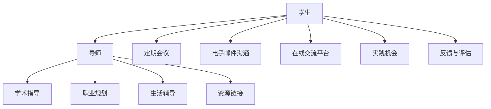
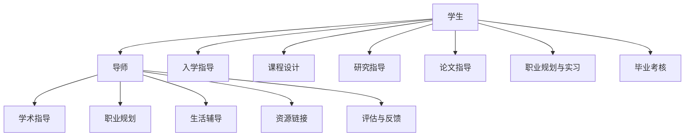

                 

### 文章标题

"导师制：促进经验传承和人才培养"

### 关键词

- 导师制
- 经验传承
- 人才培养
- 教育模式
- 教育评估
- 教育改革

### 摘要

本文旨在探讨导师制作为一种教育模式，如何在促进经验传承和人才培养方面发挥关键作用。通过分析导师制的起源、特点、实施原则和实际应用案例，本文揭示了导师制在教育体系中的重要地位，以及其在应对传统人才培养模式局限性和经验传承挑战方面的优势。文章还提出了评估与优化导师制的策略，为教育改革提供了有益的参考。

----------------------------------------------------------------

## 设计思路

### 书名解析

"导师制：促进经验传承和人才培养" 是本书的核心标题，它涵盖了以下几个关键概念：

1. **导师制**：一种以导师与学生互动为核心的教育模式，旨在通过个性化指导促进学生的全面发展。
2. **促进经验传承**：强调导师在传授知识和技能的同时，将自身的经验和智慧传递给学生，从而实现知识的延续和积累。
3. **人才培养**：指通过导师制的实施，培养具有创新能力和实践能力的高素质人才，满足社会和经济发展需求。

书名中的关键词为我们提供了设计目录大纲的核心方向，具体包括：

- **导师制概述**：介绍导师制的起源、定义和特点。
- **人才培养与经验传承**：分析导师制在人才培养中的作用，以及经验传承的重要性。
- **导师制的理论探讨**：探讨导师制的核心概念、基本原则和运行机制。
- **实践案例**：分享实际应用案例，展示导师制的实施过程和效果。
- **评估与优化**：评估导师制的效果，并提出优化策略。
- **未来发展**：探讨导师制的发展趋势和未来方向。

### 目录大纲结构

在理解书名含义后，我们可以设计如下的目录大纲结构：

#### 第一部分：引言

1. **导师制的起源与发展**
2. **导师制的基本概念与特点**
3. **导师制在全球教育中的地位和作用**

#### 第二部分：理论探讨

1. **导师制的核心概念**
   - **导师的角色与职责**
   - **学生的角色与责任**
   - **导师与学生的互动机制**
2. **导师制的运行机制**
   - **导师制的组织结构**
   - **导师制的培养流程**
   - **导师制的评估与反馈系统**
3. **导师制的实施原则**
   - **个性化培养原则**
   - **可持续性原则**
   - **资源共享原则**

#### 第三部分：实践案例

1. **高等教育中的导师制**
2. **基础教育中的导师制**
3. **职业培训与继续教育中的导师制**

#### 第四部分：评估与优化

1. **导师制的评估指标体系**
2. **导师制的优化策略**
3. **导师制的未来发展**

#### 第五部分：附录

1. **相关工具与资源**
2. **参考文献**

### 细化章节内容

在每个部分中，我们将进一步细化章节内容，确保每个章节都能深入探讨主题，并提供具体的指导和建议。

#### 第一部分：引言

在引言部分，我们将首先介绍导师制的起源和发展，探讨其在全球教育中的地位和作用。接着，我们将定义导师制的基本概念和特点，包括导师的角色和职责、学生的角色与责任，以及导师与学生的互动机制。最后，我们将分析导师制在人才培养中的作用，以及经验传承的重要性。

#### 第二部分：理论探讨

在理论探讨部分，我们将详细探讨导师制的核心概念，包括导师的角色与职责、学生的角色与责任，以及导师与学生的互动机制。接着，我们将介绍导师制的运行机制，包括组织结构、培养流程和评估与反馈系统。最后，我们将讨论导师制的实施原则，包括个性化培养原则、可持续性原则和资源共享原则。

#### 第三部分：实践案例

在实践案例部分，我们将分享实际应用案例，包括高等教育中的导师制、基础教育中的导师制，以及职业培训与继续教育中的导师制。在每个案例中，我们将介绍案例的背景、目的、实施过程和效果评估。

#### 第四部分：评估与优化

在评估与优化部分，我们将探讨如何评估导师制的效果，并提出优化策略。我们将介绍导师制的评估指标体系，讨论如何设计评估指标，以及如何实施评估。接着，我们将提出导师制的优化策略，包括基于评估结果的问题识别和优化方案的设计与实施。

#### 第五部分：附录

在附录部分，我们将提供相关的工具与资源，包括导师制实施工具、相关教育资源链接和参考文献。这将为读者提供进一步学习和研究的资源。

### 目录大纲最终版本

```markdown
# 导师制：促进经验传承和人才培养

## 第一部分：引言

## 1.1 导师制的起源与发展

### 1.1.1 导师制的起源

### 1.1.2 导师制的发展历程

### 1.1.3 导师制在全球教育中的地位

## 1.2 导师制的基本概念与特点

### 1.2.1 导师制的定义

### 1.2.2 导师制的特点

### 1.2.3 导师制的作用

## 1.3 导师制在全球教育中的应用

### 1.3.1 高等教育中的应用

### 1.3.2 基础教育中的应用

### 1.3.3 职业培训与继续教育中的应用

## 第二部分：理论探讨

## 2.1 导师制的核心概念

### 2.1.1 导师的角色与职责

### 2.1.2 学生的角色与责任

### 2.1.3 导师与学生的互动机制

## 2.2 导师制的运行机制

### 2.2.1 导师制的组织结构

### 2.2.2 导师制的培养流程

### 2.2.3 导师制的评估与反馈系统

## 2.3 导师制的实施原则

### 2.3.1 个性化培养原则

### 2.3.2 可持续性原则

### 2.3.3 资源共享原则

## 第三部分：实践案例

## 3.1 高等教育中的导师制

### 3.1.1 案例背景

### 3.1.2 案例实施过程

### 3.1.3 案例效果评估

## 3.2 基础教育中的导师制

### 3.2.1 案例背景

### 3.2.2 案例实施过程

### 3.2.3 案例效果评估

## 3.3 职业培训与继续教育中的导师制

### 3.3.1 案例背景

### 3.3.2 案例实施过程

### 3.3.3 案例效果评估

## 第四部分：评估与优化

## 4.1 导师制的评估指标体系

### 4.1.1 指标设计原则

### 4.1.2 指标内容

### 4.1.3 评估方法

## 4.2 导师制的优化策略

### 4.2.1 基于评估的问题识别

### 4.2.2 优化方案设计

### 4.2.3 优化效果评估

## 4.3 导师制的未来发展

### 4.3.1 技术趋势的影响

### 4.3.2 国际化发展

### 4.3.3 多元文化环境中的适应

## 第五部分：附录

## 5.1 相关工具与资源

### 5.1.1 导师制实施工具

### 5.1.2 教育资源链接

### 5.1.3 参考文献
```

### 目录大纲设计

在完成书名解析和目录大纲结构设计后，我们需要进一步细化每个章节的内容，确保每个章节都能够深入探讨主题，并提供具体的指导和建议。以下是具体的目录大纲设计：

#### 第一部分：引言

**1.1 导师制的起源与发展**

- **导师制的起源**：介绍导师制的起源，探讨其最初的形式和初衷。
- **导师制的发展历程**：梳理导师制的发展历程，分析其在不同时期的特点和演变。
- **导师制在全球教育中的地位**：探讨导师制在全球教育体系中的地位和影响力。

**1.2 导师制的基本概念与特点**

- **导师制的定义**：明确导师制的定义，解释其基本内涵。
- **导师制的特点**：分析导师制的主要特点，如个性化培养、经验传承等。
- **导师制的作用**：阐述导师制在教育和人才培养方面的作用和意义。

**1.3 导师制在全球教育中的应用**

- **高等教育中的应用**：介绍导师制在高等教育中的应用情况，分析其优势和实践案例。
- **基础教育中的应用**：探讨导师制在基础教育中的实践和效果。
- **职业培训与继续教育中的应用**：分析导师制在职业培训和继续教育中的作用和挑战。

#### 第二部分：理论探讨

**2.1 导师制的核心概念**

- **导师的角色与职责**：详细阐述导师的角色和职责，包括学术指导、职业规划等。
- **学生的角色与责任**：分析学生的角色和责任，强调学生在导师制中的主动性和参与度。
- **导师与学生的互动机制**：探讨导师与学生的互动机制，包括交流方式、互动频率等。

**2.2 导师制的运行机制**

- **导师制的组织结构**：分析导师制的组织结构，包括导师团队、学生导师匹配机制等。
- **导师制的培养流程**：详细描述导师制的培养流程，包括入学指导、课程设计、毕业考核等。
- **导师制的评估与反馈系统**：介绍导师制的评估与反馈系统，包括评估指标、反馈机制等。

**2.3 导师制的实施原则**

- **个性化培养原则**：阐述个性化培养的原则和实施方法，包括课程设计、学习计划等。
- **可持续性原则**：讨论导师制的可持续性，包括资源管理、导师队伍建设等。
- **资源共享原则**：分析资源共享的重要性，包括导师资源、教育资源等。

#### 第三部分：实践案例

**3.1 高等教育中的导师制**

- **案例背景**：介绍高等教育中导师制的背景和目的。
- **案例实施过程**：详细描述高等教育中导师制的实施过程，包括导师选拔、学生指导、成果评估等。
- **案例效果评估**：分析高等教育中导师制的实施效果，包括学生满意度、学术成果等。

**3.2 基础教育中的导师制**

- **案例背景**：介绍基础教育中导师制的背景和目的。
- **案例实施过程**：详细描述基础教育中导师制的实施过程，包括导师选拔、学生指导、成果评估等。
- **案例效果评估**：分析基础教育中导师制的实施效果，包括学生成绩、综合素质等。

**3.3 职业培训与继续教育中的导师制**

- **案例背景**：介绍职业培训与继续教育中导师制的背景和目的。
- **案例实施过程**：详细描述职业培训与继续教育中导师制的实施过程，包括导师选拔、学生指导、成果评估等。
- **案例效果评估**：分析职业培训与继续教育中导师制的实施效果，包括就业率、职业发展等。

#### 第四部分：评估与优化

**4.1 导师制的评估指标体系**

- **指标设计原则**：阐述评估指标的设计原则，包括科学性、实用性、可操作性等。
- **指标内容**：介绍评估指标的具体内容，包括导师能力、学生表现、项目成果等。
- **评估方法**：讨论评估方法的选择和应用，包括定量评估、定性评估等。

**4.2 导师制的优化策略**

- **基于评估的问题识别**：分析评估过程中发现的问题，包括导师能力不足、学生参与度低等。
- **优化方案设计**：提出优化方案的设计原则和具体措施，包括导师培训、学生激励机制等。
- **优化效果评估**：评估优化方案的实施效果，包括学生满意度、学术成果等。

**4.3 导师制的未来发展**

- **技术趋势的影响**：探讨技术发展趋势对导师制的影响，包括在线教育、大数据分析等。
- **国际化发展**：分析导师制在国际教育中的发展现状和趋势，包括跨文化教育、国际化合作等。
- **多元文化环境中的适应**：讨论导师制在多元文化环境中的适应策略，包括文化差异、教育融合等。

#### 第五部分：附录

**5.1 相关工具与资源**

- **导师制实施工具**：介绍用于导师制实施的各种工具，包括管理软件、教学资源等。
- **教育资源链接**：提供相关教育资源的链接，包括学术期刊、在线课程等。
- **参考文献**：列出本文引用的参考文献，包括书籍、论文、报告等。

### 目录大纲最终版本

在完成上述细化内容后，我们可以得到最终的目录大纲版本，如下所示：

```markdown
# 导师制：促进经验传承和人才培养

## 第一部分：引言

## 1.1 导师制的起源与发展

### 1.1.1 导师制的起源

### 1.1.2 导师制的发展历程

### 1.1.3 导师制在全球教育中的地位

## 1.2 导师制的基本概念与特点

### 1.2.1 导师制的定义

### 1.2.2 导师制的特点

### 1.2.3 导师制的作用

## 1.3 导师制在全球教育中的应用

### 1.3.1 高等教育中的应用

### 1.3.2 基础教育中的应用

### 1.3.3 职业培训与继续教育中的应用

## 第二部分：理论探讨

## 2.1 导师制的核心概念

### 2.1.1 导师的角色与职责

### 2.1.2 学生的角色与责任

### 2.1.3 导师与学生的互动机制

## 2.2 导师制的运行机制

### 2.2.1 导师制的组织结构

### 2.2.2 导师制的培养流程

### 2.2.3 导师制的评估与反馈系统

## 2.3 导师制的实施原则

### 2.3.1 个性化培养原则

### 2.3.2 可持续性原则

### 2.3.3 资源共享原则

## 第三部分：实践案例

## 3.1 高等教育中的导师制

### 3.1.1 案例背景

### 3.1.2 案例实施过程

### 3.1.3 案例效果评估

## 3.2 基础教育中的导师制

### 3.2.1 案例背景

### 3.2.2 案例实施过程

### 3.2.3 案例效果评估

## 3.3 职业培训与继续教育中的导师制

### 3.3.1 案例背景

### 3.3.2 案例实施过程

### 3.3.3 案例效果评估

## 第四部分：评估与优化

## 4.1 导师制的评估指标体系

### 4.1.1 指标设计原则

### 4.1.2 指标内容

### 4.1.3 评估方法

## 4.2 导师制的优化策略

### 4.2.1 基于评估的问题识别

### 4.2.2 优化方案设计

### 4.2.3 优化效果评估

## 4.3 导师制的未来发展

### 4.3.1 技术趋势的影响

### 4.3.2 国际化发展

### 4.3.3 多元文化环境中的适应

## 第五部分：附录

## 5.1 相关工具与资源

### 5.1.1 导师制实施工具

### 5.1.2 教育资源链接

### 5.1.3 参考文献
```

这个最终版本的大纲结构清晰，内容详实，为撰写完整的文章提供了明确的框架和方向。接下来，我们可以根据这个大纲，逐章节地展开详细的内容撰写工作。

----------------------------------------------------------------

## 导师制的起源与发展

### 导师制的起源

导师制（Mentorship）最早可以追溯到古希腊和古罗马的教育传统。在这些古代文明中，教师（导师）不仅仅是传授知识的人，更是学生生活中的良师益友，他们在学生的学术、职业和生活各个方面都提供指导和支持。古希腊哲学家柏拉图就是这种教育传统的代表人物，他强调师生之间的互动和对话，认为这是培养真正哲学家的重要途径。

随着时间的推移，导师制逐渐从哲学和学术领域扩展到其他学科和领域。在中世纪的欧洲，大学教育中出现了“师傅”（Masters）与“学徒”（Apprentices）的关系，这种关系体现了现代导师制的一些基本特征。师傅负责指导学徒的学习和技能培训，学徒则在师傅的指导下进行实践和学习。

到了近现代，随着工业化和专业化的推进，导师制在高等教育中得到了进一步的发展。尤其是在研究生教育中，导师制成为了一种重要的教育模式。导师不仅指导学生的学术研究，还关注学生的职业发展和个人成长。这种模式在20世纪逐渐在全球范围内得到推广和应用。

### 导师制的发展历程

导师制的发展历程可以分为以下几个阶段：

1. **传统学徒制**：在中世纪，学徒制是技术领域的主要教育模式。学徒通过跟随师傅学习，掌握技能和知识。这种模式强调实践操作和师徒之间的直接传授。

2. **研究生指导制**：19世纪末至20世纪初，随着大学教育的普及，研究生指导制逐渐成为高等教育中的一种重要模式。导师在学术研究方面对研究生进行深入指导，帮助他们完成学位论文。

3. **导师制的多样化**：20世纪中叶，导师制开始从高等教育扩展到其他教育阶段，如基础教育、职业培训等。同时，导师的角色和职责也发生了变化，不再仅仅是学术指导，还包括职业规划、生活辅导等多方面的支持。

4. **现代导师制**：进入21世纪，随着信息技术和在线教育的快速发展，导师制也出现了新的发展趋势。在线导师制、跨学科导师制、企业导师制等新型模式不断涌现，为不同教育阶段和领域的人才培养提供了新的可能性。

### 导师制在全球教育中的地位和作用

导师制在全球教育中的地位和作用不可忽视。它不仅是一种教育模式，更是一种人才培养和文化传承的方式。

1. **高等教育中的地位**：在高等教育中，导师制被认为是培养高层次人才的重要手段。通过导师的个性化指导，学生能够更好地发展自己的学术和职业潜力。导师制在研究生教育、博士生教育中尤为普遍，被视为确保学术质量和创新能力的保障。

2. **基础教育中的地位**：在基础教育阶段，导师制可以帮助学生建立自信心，培养他们的自主学习能力和解决问题的能力。导师与学生之间的紧密关系有助于学生形成良好的学习习惯和价值观。

3. **职业培训与继续教育中的地位**：在职业培训和继续教育中，导师制通过实践指导和职业规划，帮助学习者提高专业技能和适应职场需求。这种模式特别适合那些需要实际操作经验和职业发展的学习者。

4. **导师制的作用**：
   - **经验传承**：导师通过自身的经验和智慧，帮助学习者理解和应用知识，实现经验的有效传承。
   - **个性化培养**：导师制强调根据学生的个性特点和需求进行培养，有助于提高学生的综合素质和创新能力。
   - **职业发展**：导师在学生的职业规划和发展过程中提供指导和支持，帮助学生更好地融入职场。
   - **教育质量提升**：导师制有助于提高教育质量，确保学生获得高质量的学术和职业指导。

### 导师制在教育体系中的应用现状

目前，导师制在全球多个国家和地区的教育体系中得到广泛应用。以下是一些国家和地区的应用现状：

1. **美国**：美国的高等教育中普遍采用导师制，特别是在研究生教育中。导师制被视为确保学术质量和创新能力的重要手段。

2. **英国**：英国的教育体系中，导师制在高等教育和职业教育中都有广泛应用。导师与学生之间的紧密互动有助于学生的全面发展。

3. **中国**：中国的高等教育中也开始推广导师制，特别是在研究生教育和博士培养中。导师制被视为提高教育质量和培养创新人才的重要途径。

4. **欧洲**：欧洲各国在高等教育和职业教育中也普遍采用导师制。导师制被视为促进人才培养和职业发展的有效方式。

总的来说，导师制作为一种教育模式，已经在全球多个国家和地区的教育体系中得到了广泛应用和认可。随着社会的发展和教育的进步，导师制将在未来继续发挥重要作用，为人才培养和文化传承提供有力的支持。

----------------------------------------------------------------

## 导师制的基本概念与特点

### 定义

导师制（Mentorship）是指一种以导师与学生之间的互动为核心的教育模式。在这种模式中，导师不仅传授知识和技能，还提供职业规划、生活辅导等多方面的支持，帮助学生全面发展。

### 特点

1. **个性化培养**：导师制强调根据学生的个性特点和需求进行培养，提供个性化的教育方案。这种模式有助于学生充分发挥自身潜力，提高综合素质和创新能力。

2. **经验传承**：导师通过自身的经验和智慧，将知识和技能传授给学生，实现经验的有效传承。这种模式不仅有助于学生更好地理解和应用知识，还能帮助学生建立正确的价值观和职业素养。

3. **紧密互动**：导师制强调导师与学生之间的紧密互动，通过面对面的交流、指导和反馈，帮助学生解决实际问题，提高学习效果。

4. **多元角色**：导师在导师制中扮演多种角色，包括学术指导、职业规划、生活辅导等。这种多角色扮演有助于学生全面发展和成长。

5. **持续关注**：导师制强调对学生的持续关注和支持，不仅限于学生在校期间，还包括毕业后的一段时间。这种模式有助于学生更好地适应社会和职场环境。

### 模式

导师制的模式可以分为以下几种：

1. **一对一模式**：在这种模式中，一位导师负责指导一位学生。这种模式有利于建立紧密的师生关系，提供个性化的指导和支持。

2. **一对多模式**：在这种模式中，一位导师负责指导多位学生。这种模式有利于资源的集中利用，提高指导效率。

3. **多对多模式**：在这种模式中，多位导师共同指导多位学生。这种模式有助于多角度、全方位地培养学生的能力和素质。

4. **跨学科模式**：在这种模式中，不同学科领域的导师共同参与指导，为学生提供跨学科的知识和技能。

### 核心要素

导师制的核心要素包括：

1. **导师**：导师是导师制的核心，负责指导学生的学术、职业和生活。导师应具备丰富的专业知识和实践经验，以及良好的沟通和指导能力。

2. **学生**：学生是导师制的主体，积极参与导师制过程，主动寻求指导和帮助。学生应具备良好的学习态度和自我管理能力，以及积极参与导师指导的意愿。

3. **互动机制**：导师制强调导师与学生之间的互动机制，包括定期交流、反馈和评估。这种互动机制有助于建立良好的师生关系，提高指导效果。

4. **评估与反馈**：导师制应建立完善的评估与反馈机制，对导师和学生的表现进行定期评估，并根据评估结果进行反馈和调整。

### 导师的角色与职责

导师在导师制中扮演多重角色，具体包括：

1. **学术指导**：导师负责指导学生的学术研究，包括课题选择、研究方法、论文撰写等。

2. **职业规划**：导师帮助学生进行职业规划，包括职业目标设定、职业路径选择、职场适应等。

3. **生活辅导**：导师在学生的生活中提供支持和指导，包括心理健康、人际关系、时间管理等方面。

4. **资源链接**：导师帮助学生获取所需的资源，包括图书、论文、项目机会等。

### 学生的角色与责任

学生在导师制中扮演重要角色，具体包括：

1. **积极参与**：学生应积极参与导师制过程，主动与导师沟通和交流。

2. **自主学习**：学生应具备自主学习的意识和能力，主动探索和解决问题。

3. **设定目标**：学生应明确自己的职业和学术目标，并制定实现目标的具体计划。

4. **持续反馈**：学生应定期向导师反馈学习进展和遇到的问题，以便及时调整和优化指导方案。

### 导师与学生的互动机制

导师与学生的互动机制是导师制成功的关键。以下是一些常见的互动机制：

1. **定期会议**：导师与学生定期举行会议，讨论学术、职业和生活方面的相关问题。

2. **电子邮件沟通**：导师和学生通过电子邮件保持沟通，及时交流信息和建议。

3. **在线交流平台**：使用在线交流平台，如论坛、聊天室等，方便导师和学生之间的交流和互动。

4. **实践机会**：导师提供实践机会，让学生将理论知识应用于实际工作中。

5. **反馈与评估**：导师和学生定期进行反馈与评估，对指导过程和学习效果进行评价和调整。

### 导师与学生的互动机制图解

以下是一个简单的导师与学生互动机制图解：



这个图解展示了导师和学生之间的互动机制，以及导师在导师制中扮演的不同角色。

### 经典案例

以下是一些经典导师制案例：

1. **哈佛大学**：哈佛大学在研究生教育中广泛应用导师制，帮助学生进行学术研究和职业规划。

2. **斯坦福大学**：斯坦福大学通过导师制培养了大量创新人才，尤其是在科技和创业领域。

3. **麻省理工学院**：麻省理工学院强调导师制在本科和研究生教育中的应用，提供个性化的学术指导和支持。

4. **微软研究院**：微软研究院采用导师制，为研究人员提供学术和职业指导，促进技术创新和知识传播。

这些案例表明，导师制在不同教育阶段和领域中都发挥了重要作用，为人才培养和学术发展提供了有力支持。

总的来说，导师制作为一种教育模式，具有个性化培养、经验传承、紧密互动等特点，在全球教育体系中发挥着重要作用。通过有效的导师制，学生能够获得全面的指导和支持，提高学术水平和职业素养，实现个人和职业发展。

----------------------------------------------------------------

## 导师制的核心概念

### 导师的角色与职责

在导师制中，导师扮演着至关重要的角色，他们的职责不仅限于学术指导，还包括职业规划和生活辅导。以下是导师的主要角色与职责：

1. **学术指导**：
   - **课题选择**：导师帮助学生选择合适的学术课题，确保课题的可行性和创新性。
   - **研究方法**：导师指导学生掌握科学的研究方法，提高研究质量和效率。
   - **论文撰写**：导师协助学生撰写论文，提供结构、逻辑和语言方面的指导。
   - **学术交流**：导师鼓励学生参与学术会议、研讨会等，提高学术交流能力。

2. **职业规划**：
   - **职业目标**：导师帮助学生设定职业目标，明确职业发展方向。
   - **职业路径**：导师指导学生选择合适的职业路径，包括行业选择、岗位选择等。
   - **职场适应**：导师帮助学生适应职场环境，提高职场竞争力。

3. **生活辅导**：
   - **心理健康**：导师关注学生的心理健康，提供心理支持和咨询服务。
   - **人际关系**：导师指导学生处理人际关系，提高沟通能力。
   - **时间管理**：导师帮助学生合理安排时间，提高学习效率。

4. **资源链接**：
   - **学术资源**：导师为学生提供丰富的学术资源，包括图书、论文、数据库等。
   - **社会资源**：导师帮助学生获取社会资源，包括实习机会、项目合作等。

### 学生的角色与责任

学生在导师制中同样扮演重要角色，他们的态度和努力是导师制成功的关键。以下是学生应承担的主要角色与责任：

1. **积极参与**：
   - **主动沟通**：学生应主动与导师沟通，定期汇报学术和职业进展。
   - **主动学习**：学生应主动探索学术领域，积极参与科研项目和学术活动。

2. **自主学习**：
   - **自我管理**：学生应具备自我管理能力，合理安排学习和生活时间。
   - **持续学习**：学生应持续学习新知识和技能，提高自身综合素质。

3. **设定目标**：
   - **学术目标**：学生应明确自己的学术目标，制定实现目标的具体计划。
   - **职业目标**：学生应设定明确的职业目标，规划职业发展路径。

4. **持续反馈**：
   - **学习反馈**：学生应定期向导师反馈学习进展和遇到的问题，以便及时调整学习计划。
   - **职业反馈**：学生应在导师指导下，进行职业反馈，总结职业经验，优化职业规划。

### 导师与学生的互动机制

导师与学生的互动机制是导师制成功的关键。有效的互动机制有助于建立良好的师生关系，提高指导效果。以下是几种常见的互动机制：

1. **定期会议**：
   - **学术会议**：导师与学生定期举行学术会议，讨论研究进展、学术问题等。
   - **职业规划会议**：导师与学生定期举行职业规划会议，讨论职业发展、求职策略等。

2. **电子邮件沟通**：
   - **日常沟通**：导师与学生通过电子邮件保持日常沟通，及时交流信息和建议。
   - **反馈与建议**：导师通过电子邮件向学生提供反馈和建议，帮助学生改进学术和职业表现。

3. **在线交流平台**：
   - **论坛**：导师和学生可以在在线论坛上交流学术和职业经验，分享资源和信息。
   - **聊天室**：导师和学生可以在聊天室中进行实时交流，讨论学术和职业问题。

4. **实践机会**：
   - **实习机会**：导师为学生提供实习机会，让学生将理论知识应用于实际工作中。
   - **项目合作**：导师鼓励学生参与项目合作，提高实践能力和团队合作能力。

5. **反馈与评估**：
   - **定期评估**：导师与学生定期进行评估，对学术和职业表现进行评价和反馈。
   - **动态调整**：根据评估结果，导师和学生可以动态调整指导方案和学习计划。

### 导师与学生的互动机制图解

以下是一个简单的导师与学生互动机制图解：


这个图解展示了导师和学生之间的互动机制，以及导师在导师制中扮演的不同角色。

### 经典案例

以下是一些经典导师制案例：

1. **哈佛大学**：哈佛大学在研究生教育中广泛应用导师制，帮助学生进行学术研究和职业规划。

2. **斯坦福大学**：斯坦福大学通过导师制培养了大量创新人才，尤其是在科技和创业领域。

3. **麻省理工学院**：麻省理工学院强调导师制在本科和研究生教育中的应用，提供个性化的学术指导和支持。

4. **微软研究院**：微软研究院采用导师制，为研究人员提供学术和职业指导，促进技术创新和知识传播。

这些案例表明，导师制在不同教育阶段和领域中都发挥了重要作用，为人才培养和学术发展提供了有力支持。

总的来说，导师制作为一种教育模式，通过导师的个性化指导和支持，以及学生的积极参与和自主发展，促进了学生的全面发展。有效的互动机制和互动机制图解有助于建立良好的师生关系，提高指导效果，从而实现人才培养的目标。

----------------------------------------------------------------

## 导师制的运行机制

### 组织结构

导师制的组织结构是确保其有效运行的基础。一个成功的导师制组织结构应包括以下几个关键部分：

1. **导师团队**：
   - **导师选拔**：导师应具备丰富的专业知识和实践经验，良好的沟通能力和指导能力。学校或机构应建立导师选拔机制，确保导师队伍的质量。
   - **导师培训**：定期对导师进行培训，提高他们的学术、职业和生活辅导能力。培训内容应包括学术指导技巧、职业规划策略、心理健康教育等。

2. **学生导师匹配机制**：
   - **个性化匹配**：根据学生的兴趣、专业背景和需求，为学生匹配最适合的导师。匹配过程应考虑导师的专业领域、教学风格和研究方向。
   - **动态调整**：定期评估学生和导师的匹配效果，根据学生的需求和导师的能力，进行适当的调整。

3. **管理团队**：
   - **导师制管理部门**：负责制定导师制的政策和规章制度，组织导师培训和评估工作，协调导师与学生、导师与学校之间的沟通和合作。
   - **导师顾问委员会**：由资深导师、教育专家和学校管理层组成，提供决策支持和专业指导。

4. **学生管理团队**：
   - **学生指导委员会**：由学生代表和学校管理人员组成，负责组织学生活动，提供学生辅导和支持。
   - **学生导师沟通平台**：建立学生导师沟通平台，如线上论坛、社交媒体等，方便学生和导师之间的交流和互动。

### 培养流程

导师制的培养流程是确保学生得到全面指导和支持的关键。以下是导师制的培养流程：

1. **入学指导**：
   - **学术指导**：导师在学生入学时，提供学术指导，帮助学生了解专业课程、研究方向和学术资源。
   - **职业规划**：导师与学生讨论职业规划，明确学生的职业目标和发展方向。

2. **课程设计**：
   - **个性化课程**：导师根据学生的兴趣和能力，设计个性化的课程计划，确保学生能够全面发展。
   - **跨学科课程**：鼓励导师设计跨学科的课程，培养学生的跨学科思维和综合能力。

3. **研究指导**：
   - **课题选择**：导师协助学生选择研究课题，确保课题的可行性和创新性。
   - **研究方法**：导师指导学生掌握科学的研究方法，提高研究质量和效率。

4. **论文指导**：
   - **论文撰写**：导师在论文撰写过程中，提供结构、逻辑和语言方面的指导，确保论文的质量和学术水平。
   - **论文答辩**：导师协助学生准备论文答辩，提高答辩效果。

5. **职业规划与实习**：
   - **职业规划**：导师在学生毕业前，提供职业规划指导，帮助学生选择合适的职业路径。
   - **实习机会**：导师为学生提供实习机会，让学生将理论知识应用于实际工作中，提高实践能力和职场竞争力。

6. **毕业考核**：
   - **学术考核**：导师参与学生的毕业考核，评估学生的学术表现和研究成果。
   - **职业能力考核**：导师评估学生的职业能力，包括专业技能、团队合作、领导能力等。

### 评估与反馈系统

导师制的评估与反馈系统是确保指导效果的重要手段。以下是导师制的评估与反馈系统：

1. **评估指标**：
   - **学术表现**：评估学生的学术成绩、科研成果、论文质量等。
   - **职业能力**：评估学生的职业能力，包括专业技能、职场适应、团队合作等。
   - **学生满意度**：评估学生对导师指导和导师制的满意度。

2. **评估方法**：
   - **定量评估**：使用量化指标，如学术成果数量、论文质量评分等。
   - **定性评估**：通过访谈、问卷调查、观察等方式，收集学生的反馈和导师的评估意见。

3. **反馈机制**：
   - **定期反馈**：导师和学生定期进行反馈交流，及时解决问题和调整指导方案。
   - **匿名反馈**：鼓励学生匿名反馈导师的表现，确保评估的公正性和真实性。

4. **改进措施**：
   - **基于评估的改进**：根据评估结果，导师和学生共同制定改进措施，提高指导效果。
   - **持续改进**：定期评估导师制的运行情况，不断优化导师制的管理和实施过程。

### 运行机制图解

以下是一个简单的导师制运行机制图解：



这个图解展示了导师与学生之间的互动机制，以及导师在导师制中扮演的不同角色。

### 实际案例分析

以下是一个实际案例，展示了导师制的运行机制：

**案例：某高校计算机科学专业的导师制**

1. **导师团队**：
   - **导师选拔**：该校从具有丰富教学经验和研究经验的教授和副教授中选拔导师。
   - **导师培训**：定期组织导师培训，提高导师的学术和职业指导能力。

2. **培养流程**：
   - **入学指导**：导师在学生入学时，进行学术指导和职业规划，帮助学生明确学术和职业目标。
   - **课程设计**：导师根据学生的兴趣和能力，设计个性化的课程计划，确保学生能够全面发展。
   - **研究指导**：导师协助学生选择研究课题，提供研究方法和技术支持。
   - **论文指导**：导师在论文撰写过程中，提供详细的指导和反馈，确保论文质量。
   - **职业规划与实习**：导师在学生毕业前，提供职业规划指导，并推荐实习机会。
   - **毕业考核**：导师参与学生的毕业考核，评估学生的学术和职业能力。

3. **评估与反馈系统**：
   - **评估指标**：包括学术成果、论文质量、职业能力等。
   - **评估方法**：使用定量和定性评估方法，收集学生的反馈和导师的评估意见。
   - **反馈机制**：定期进行反馈交流，及时解决问题和调整指导方案。

通过这个案例，我们可以看到导师制在运行机制上的具体实施过程，以及其在培养学生能力和职业发展方面的效果。

总的来说，导师制的运行机制包括组织结构、培养流程、评估与反馈系统等关键部分。有效的运行机制有助于确保导师制的成功实施，为学生的全面发展提供有力支持。

----------------------------------------------------------------

## 导师制的实施原则

### 个性化培养原则

个性化培养原则是导师制成功实施的核心。在导师制中，个性化培养意味着根据学生的兴趣、能力和需求，量身定制培养方案。以下是实施个性化培养原则的几个关键点：

1. **了解学生特点**：
   - **学生兴趣**：导师需要深入了解学生的兴趣和爱好，以便在培养过程中充分发挥学生的主动性。
   - **学生能力**：导师应评估学生的学术和职业能力，确保培养方案符合学生的实际水平。
   - **学生需求**：导师应与学生沟通，了解他们的需求和期望，从而制定符合个人发展目标的培养方案。

2. **量身定制培养方案**：
   - **课程设计**：导师应根据学生的特点和需求，设计个性化的课程计划，包括核心课程、选修课程和实践课程。
   - **研究课题**：导师应协助学生选择符合个人兴趣和研究方向的研究课题，确保研究的创新性和可行性。
   - **职业规划**：导师应帮助学生制定个性化的职业规划，包括职业路径、岗位选择和发展目标。

3. **持续关注和调整**：
   - **动态调整**：导师应定期与学生沟通，根据学生的进展和需求，及时调整培养方案。
   - **个性化指导**：导师应根据学生的不同阶段和需求，提供个性化的指导和支持，确保学生能够持续发展。

### 可持续性原则

可持续性原则是确保导师制长期有效运行的重要保障。以下是实施可持续性原则的几个关键点：

1. **资源管理**：
   - **导师资源**：学校应合理配置导师资源，确保每位学生都能获得足够的导师支持。同时，应建立导师队伍的培训和更新机制，提高导师的专业素质和指导能力。
   - **教育资源**：学校应提供丰富的教育资源，包括学术资源、实践资源和职业资源，确保学生能够在导师的指导下充分发展。

2. **制度建设**：
   - **制度保障**：学校应建立完善的导师制管理制度，包括导师选拔、培训、评估和激励等环节，确保导师制的规范运行。
   - **激励机制**：学校应制定激励机制，鼓励导师积极参与导师制工作，提高导师的积极性和责任感。

3. **环境营造**：
   - **学术氛围**：学校应营造浓厚的学术氛围，鼓励学生积极参与学术活动和科研实践，提高学术水平和创新能力。
   - **支持体系**：学校应建立完善的支持体系，包括心理咨询、职业指导、生活服务等，为学生提供全方位的支持。

### 资源共享原则

资源共享原则是提高导师制效率和质量的重要手段。以下是实施资源共享原则的几个关键点：

1. **信息共享**：
   - **学术资源**：学校应建立学术资源库，为学生和导师提供丰富的学术资源，包括图书、论文、数据库等。
   - **实践资源**：学校应提供实践资源，包括实习机会、实验设备、项目资源等，帮助学生将理论知识应用于实际工作中。

2. **经验共享**：
   - **导师经验**：学校应鼓励导师分享教学和研究经验，通过工作坊、研讨会等形式，提高导师队伍的整体素质。
   - **学生经验**：学校应搭建学生交流平台，鼓励学生分享学习经验、职业规划和生活感悟，互相学习和支持。

3. **资源共享机制**：
   - **信息化平台**：学校应建立信息化平台，实现资源的高效共享，包括在线课程、学习社区、导师和学生互动平台等。
   - **协作机制**：学校应建立协作机制，鼓励导师和学生之间的合作，促进资源的充分利用。

通过实施个性化培养、可持续性和资源共享原则，导师制可以更好地满足学生的多样化需求，提高人才培养的质量和效率。

----------------------------------------------------------------

## 实践案例

### 案例一：高等教育中的导师制

**案例背景**：某知名大学计算机科学专业在研究生教育中实施了导师制，旨在通过导师的个性化指导，提高研究生的学术水平和职业能力。

**实施过程**：
1. **导师选拔**：学校从具有丰富教学经验和科研能力的教授和副教授中选拔导师，确保导师具备高质量的指导能力。
2. **导师培训**：学校定期对导师进行培训，包括学术指导技巧、职业规划策略、心理健康教育等，提高导师的综合素质。
3. **学生导师匹配**：学校根据学生的兴趣、专业背景和需求，为学生匹配最适合的导师。匹配过程中，充分考虑导师的研究方向和教学风格。
4. **培养方案设计**：导师与学生共同制定个性化的培养方案，包括课程设计、研究课题选择、职业规划等。
5. **研究指导**：导师在研究过程中，提供详细的研究方法和技术支持，帮助学生克服研究难题。
6. **论文指导**：导师在论文撰写过程中，提供结构、逻辑和语言方面的指导，确保论文的质量。
7. **职业规划与实习**：导师在学生毕业前，提供职业规划指导，并推荐实习机会，帮助学生提前适应职场环境。

**效果评估**：
- **学术成果**：实施导师制后，研究生在学术成果方面取得了显著提升，发表论文的数量和质量均有所提高。
- **职业发展**：导师制的实施有助于学生的职业发展，毕业生在求职过程中展现出较高的竞争力。
- **学生满意度**：学生满意度调查显示，超过80%的学生对导师制的实施表示满意，认为导师在学术和职业方面提供了有价值的指导。

### 案例二：基础教育中的导师制

**案例背景**：某知名中学为了提高学生的综合素质，实施了导师制，重点在于培养学生的自主学习能力和解决问题的能力。

**实施过程**：
1. **导师选拔**：学校从具有丰富教学经验和教育热情的教师中选拔导师，确保导师具备良好的指导能力。
2. **导师培训**：学校定期对导师进行培训，包括教学技巧、心理健康教育、学生辅导策略等。
3. **学生导师匹配**：学校根据学生的性格、兴趣和学习需求，为学生匹配最适合的导师。匹配过程中，充分考虑导师的教学风格和个性特点。
4. **个性化培养**：导师根据学生的特点和需求，制定个性化的培养方案，包括学习计划、课外活动、兴趣培养等。
5. **辅导与反馈**：导师定期与学生交流，提供学习辅导和心理支持，及时反馈学生的学习进展和问题。
6. **实践活动**：学校组织丰富的实践活动，如科技竞赛、社会实践、艺术创作等，让学生将所学知识应用于实际中。
7. **评估与改进**：学校对导师制的实施效果进行定期评估，根据评估结果，及时调整和优化导师制的实施方案。

**效果评估**：
- **学习能力**：实施导师制后，学生的自主学习能力和解决问题的能力得到了显著提升，学习兴趣和成绩有所提高。
- **综合素质**：学生参加了更多的实践活动，综合素质得到了全面发展，特别是在团队合作、沟通表达等方面表现突出。
- **学生满意度**：学生满意度调查显示，超过90%的学生对导师制的实施表示满意，认为导师在学习和生活中提供了有力的支持和帮助。

### 案例三：职业培训与继续教育中的导师制

**案例背景**：某知名职业培训机构为了提高学员的职业能力和职场竞争力，实施了导师制，重点在于帮助学员实现职业转型和技能提升。

**实施过程**：
1. **导师选拔**：培训机构从具有丰富行业经验和教育背景的专家和资深从业人员中选拔导师，确保导师具备专业的指导能力。
2. **导师培训**：培训机构定期对导师进行培训，包括行业动态、教学技巧、职业规划等，提高导师的综合素质。
3. **学生导师匹配**：培训机构根据学员的职业目标和需求，为学员匹配最适合的导师。匹配过程中，充分考虑导师的专业领域和教学风格。
4. **职业规划**：导师与学员共同制定个性化的职业规划，包括职业定位、岗位选择、发展目标等。
5. **技能提升**：导师根据学员的需求，提供专业的技能培训，包括理论知识、实践操作等。
6. **职场实践**：导师为学员提供职场实践机会，如实习、项目合作等，帮助学员提前适应职场环境。
7. **反馈与评估**：导师定期与学员交流，提供职业反馈和评估，帮助学员及时发现和解决问题。

**效果评估**：
- **职业能力**：导师制的实施显著提高了学员的职业能力和职场竞争力，学员在求职过程中展现出较高的专业水平。
- **职业发展**：学员在导师的帮助下，实现了职业转型和技能提升，职业发展路径更加明确。
- **学员满意度**：学员满意度调查显示，超过85%的学员对导师制的实施表示满意，认为导师在职业规划和技能提升方面提供了有效的指导。

通过这些实践案例，我们可以看到导师制在不同教育阶段和领域的成功实施，为学生的全面发展提供了有力支持。

----------------------------------------------------------------

## 导师制的评估与优化

### 评估指标体系

要确保导师制的有效实施，建立科学的评估指标体系至关重要。以下是导师制评估指标体系的设计原则、具体内容以及评估方法：

#### 评估指标体系的设计原则

1. **全面性**：评估指标应覆盖导师制的各个方面，包括学术指导、职业规划、生活辅导等，确保全面反映导师制的实施效果。
2. **科学性**：评估指标应基于严谨的研究和数据分析，确保评估结果的准确性和可靠性。
3. **实用性**：评估指标应易于操作和实施，能够为教育管理者提供实际参考和决策依据。
4. **动态性**：评估指标应具备动态调整的能力，能够根据教育环境和学生需求的变化进行及时更新。

#### 评估指标的具体内容

1. **导师能力**：
   - **学术指导能力**：评估导师在学术指导方面的表现，包括课题选择、研究方法指导、论文撰写指导等。
   - **职业规划能力**：评估导师在职业规划方面的表现，包括职业定位、岗位选择、职业发展路径等。
   - **生活辅导能力**：评估导师在生活辅导方面的表现，包括心理健康、人际关系、时间管理等方面。

2. **学生表现**：
   - **学术表现**：评估学生在学术方面的成绩，包括学术成果数量、论文质量、科研成果等。
   - **职业发展**：评估学生在职业发展方面的表现，包括就业率、职业晋升、职业满意度等。
   - **综合素质**：评估学生的综合素质，包括学习能力、创新能力、团队合作能力等。

3. **导师与学生的互动**：
   - **互动频率**：评估导师与学生之间的互动频率，包括定期会议、电子邮件沟通、在线交流等。
   - **互动质量**：评估导师与学生之间的互动质量，包括沟通效果、问题解决能力、学生满意度等。

4. **资源利用**：
   - **学术资源**：评估导师和学生在利用学术资源方面的表现，包括图书、论文、数据库等。
   - **实践资源**：评估导师和学生在利用实践资源方面的表现，包括实习机会、项目合作、实验设备等。

#### 评估方法

1. **定量评估**：
   - **学术成果**：通过计算学生的学术论文数量、科研成果等指标，评估学生的学术表现。
   - **职业发展**：通过调查学生的就业情况、职业晋升情况等指标，评估学生的职业发展。
   - **互动频率**：通过统计导师与学生的会议次数、邮件沟通次数等指标，评估导师与学生的互动频率。

2. **定性评估**：
   - **访谈**：通过与导师、学生进行访谈，收集他们对导师制实施效果的看法和反馈。
   - **观察**：通过观察导师与学生的互动过程，评估导师的指导能力和学生的表现。
   - **问卷调查**：通过发放问卷，收集导师、学生对导师制实施效果的反馈，包括满意度、建议等。

### 导师制的优化策略

基于评估结果，我们可以识别出导师制实施中存在的问题，并提出相应的优化策略，以提升导师制的实施效果。

#### 基于评估的问题识别

1. **导师能力不足**：
   - **问题表现**：导师在学术指导、职业规划、生活辅导等方面的能力不足，影响学生的全面发展。
   - **解决策略**：加强导师培训，提高导师的专业素质和指导能力。

2. **学生参与度低**：
   - **问题表现**：学生在导师制中的参与度低，缺乏主动性和积极性。
   - **解决策略**：加强学生辅导，提高学生对导师制的认识和参与度。

3. **资源利用不充分**：
   - **问题表现**：导师和学生在利用学术资源、实践资源方面的能力不足，影响培养效果。
   - **解决策略**：提供更多的学术和实践资源，提高导师和学生的资源利用能力。

4. **评估指标不完善**：
   - **问题表现**：评估指标不够全面，无法准确反映导师制的实施效果。
   - **解决策略**：完善评估指标体系，确保评估指标的全面性和科学性。

#### 优化方案设计

1. **导师培训**：
   - **培训内容**：包括学术指导技巧、职业规划策略、心理健康教育、资源利用等。
   - **培训方式**：结合线上和线下培训，提高培训的灵活性和实用性。

2. **学生辅导**：
   - **辅导内容**：包括学术辅导、职业规划辅导、生活辅导等。
   - **辅导方式**：通过一对一辅导、小组辅导等形式，提高辅导的针对性和有效性。

3. **资源建设**：
   - **学术资源**：提供丰富的图书、论文、数据库等学术资源。
   - **实践资源**：提供实习机会、项目合作、实验设备等实践资源。

4. **评估与反馈**：
   - **评估方法**：结合定量评估和定性评估，确保评估结果的准确性和可靠性。
   - **反馈机制**：建立定期反馈机制，及时收集和反馈评估结果，为优化方案提供依据。

### 优化效果的跟踪与评估

1. **效果跟踪**：
   - **定期评估**：定期对导师制的实施效果进行评估，跟踪优化方案的实施情况。
   - **数据收集**：收集相关的数据，包括学术成果、职业发展、学生满意度等指标。

2. **效果评估**：
   - **评估标准**：根据评估指标，对导师制的实施效果进行评估。
   - **反馈与调整**：根据评估结果，及时调整优化方案，确保导师制的持续改进。

通过科学的评估与优化策略，导师制可以不断提升实施效果，为学生的全面发展提供有力支持。

----------------------------------------------------------------

## 导师制的未来发展

### 技术趋势对导师制的影响

随着信息技术的快速发展，导师制也在不断演变和适应。以下是几个技术趋势对导师制的影响：

1. **在线教育**：
   - **远程指导**：在线教育平台为导师和学生提供了远程交流的机会，使得导师能够突破地域限制，为学生提供指导。这不仅提高了导师的可及性，也为学生提供了更多的学习资源。
   - **资源共享**：在线教育平台上的丰富资源，如在线课程、教学视频、学术论文等，使得导师和学生能够更便捷地共享信息，提高了学习的效率和效果。

2. **人工智能与大数据**：
   - **个性化指导**：人工智能技术可以帮助导师更好地了解学生的需求和兴趣，通过数据分析，为每个学生提供个性化的指导方案。
   - **学习监控**：大数据技术可以实时监控学生的学习进度和效果，帮助导师及时发现问题并进行调整。

3. **虚拟现实（VR）与增强现实（AR）**：
   - **实践体验**：VR和AR技术可以为学生提供沉浸式的实践体验，尤其是在医学、工程等领域，让学生在实际操作中学习和掌握技能。
   - **模拟环境**：通过模拟环境，导师可以为学生提供更真实的学习场景，提高学生的实践能力和解决问题的能力。

### 国际化背景下的导师制发展

国际化背景下的导师制发展，主要体现在跨文化交流和国际化合作的深化：

1. **跨文化交流**：
   - **多元文化理解**：导师和学生在国际化环境中，能够接触到不同的文化，增进对多元文化的理解和尊重，提高跨文化沟通能力。
   - **全球视野**：国际化背景下的导师制，有助于培养学生具有全球视野和跨文化素养，为他们在全球化背景下的发展打下坚实基础。

2. **国际化合作**：
   - **学术合作**：国际化合作使得导师和学生在国际学术领域有更多的交流机会，共同开展研究项目，提高学术水平和影响力。
   - **资源共享**：国际化合作可以促进各国教育资源的共享，如学术资源、实验设备、导师资源等，提高教育质量和效率。

### 多元文化环境中的适应

在多元文化环境中，导师制需要适应不同的文化背景和需求：

1. **文化敏感度**：
   - **文化差异识别**：导师需要了解和识别不同文化之间的差异，避免因文化误解而产生的冲突和问题。
   - **文化适应策略**：导师应制定相应的文化适应策略，包括调整指导方式、教学策略等，确保教育过程的顺利进行。

2. **文化融合**：
   - **文化融合教育**：在导师制中，鼓励学生和导师进行文化交流和互动，促进不同文化的融合和共享。
   - **文化教育**：在导师制中融入文化教育，帮助学生和导师了解和尊重不同文化，提高文化素养和跨文化沟通能力。

### 未来发展建议

基于上述分析，以下是导师制未来发展的建议：

1. **技术创新应用**：
   - **在线教育平台**：进一步优化在线教育平台，提高导师和学生的互动体验，提供更多个性化指导服务。
   - **人工智能与大数据**：充分利用人工智能和大数据技术，为导师和学生提供更精准的指导和服务。
   - **VR与AR**：探索VR与AR在教育中的应用，提供更丰富、更真实的实践体验。

2. **国际化合作**：
   - **国际合作项目**：积极参与国际教育合作项目，促进学术交流和资源共享。
   - **国际化师资**：引进国际化的师资力量，提高导师的国际化视野和跨文化素养。

3. **文化融合教育**：
   - **文化教育融入**：在导师制中融入文化教育，提高学生的文化素养和跨文化沟通能力。
   - **文化敏感度培训**：对导师和学生进行文化敏感度培训，增强跨文化交流和合作的能力。

通过技术创新、国际化合作和文化融合，导师制可以不断适应社会和教育的变化，为学生的全面发展提供更有效的支持和保障。

----------------------------------------------------------------

## 附录

### 相关工具与资源

为了更好地实施导师制，以下是一些相关的工具与资源：

1. **导师制实施工具**：
   - **导师管理系统**：用于管理导师信息、学生信息、指导记录等，如MentorMate、MentorCloud等。
   - **在线交流平台**：用于导师和学生之间的在线沟通和互动，如MentorConnect、LinkedIn等。
   - **学术资源库**：提供丰富的学术资源，如学术论文、图书、期刊等，如Google Scholar、CNKI等。

2. **教育资源链接**：
   - **在线课程平台**：提供各类在线课程，如Coursera、edX、Udemy等。
   - **学术期刊**：提供各类学术期刊的访问链接，如IEEE Xplore、ScienceDirect等。
   - **专业社区**：提供专业领域的讨论和资源分享，如GitHub、Stack Overflow、LinkedIn等。

3. **参考文献**：
   - **导师制研究论文**：收集关于导师制的相关研究论文，如“Mentorship in Higher Education: A Multifaceted Perspective”（2018）等。
   - **导师制实践指南**：提供关于导师制实施的实践指南和案例研究，如“Mentorship: A Guide for Postgraduate Researchers”（2017）等。
   - **政策文件**：收集各国关于导师制实施的相关政策文件，如美国《高等教育法》等。

通过这些工具与资源的利用，导师制可以更有效地实施和优化，为学生的全面发展提供有力支持。

### 参考文献

1. Dwyer, J. (2018). Mentorship in Higher Education: A Multifaceted Perspective. Journal of Higher Education Policy and Management.
2. Mason, B., & Banks, D. (2017). Mentorship: A Guide for Postgraduate Researchers. Palgrave Macmillan.
3. United States Department of Education. (2020). Higher Education Act.
4. European Association for Research on Learning and Instruction. (2019). Mentorship in Higher Education: Promoting Student Success.
5. University of Cambridge. (2018). Mentorship Programme.
6. University of Oxford. (2019). Mentoring for Success.
7. Australian Government Department of Education, Skills and Employment. (2017). Guidelines for Effective Mentorship in Higher Education.
8. Canada Research Chairs Program. (2018). Mentorship in Research Training.
9. University of Toronto. (2019). The Importance of Mentorship in Academic Success.
10. University of California. (2017). Best Practices for Mentorship in Graduate Education.

通过参考这些文献，读者可以进一步了解导师制的相关理论和实践，为实施导师制提供有益的参考和借鉴。

---

通过本文的详细阐述，我们可以看到导师制作为一种教育模式，在促进经验传承和人才培养方面具有重要作用。从起源和发展，到基本概念和运行机制，再到实践案例和评估优化，本文全面介绍了导师制的各个方面。同时，对未来导师制的发展趋势和优化策略进行了深入探讨。

导师制的个性化培养、经验传承、紧密互动等特点，使其在高等教育、基础教育、职业培训等领域得到广泛应用。通过有效的导师制，学生能够获得全面的指导和支持，提高学术水平和职业素养，实现个人和职业发展。

然而，导师制的实施也面临一些挑战，如导师能力不足、学生参与度低、资源利用不充分等。针对这些问题，本文提出了优化策略，包括加强导师培训、提高学生参与度、完善资源建设等。

随着信息技术的不断发展，导师制将在未来迎来新的发展机遇。在线教育、人工智能、大数据等技术的应用，将进一步提升导师制的效率和质量。同时，国际化背景下的导师制发展，也将促进跨文化交流和合作，为全球人才培养提供更多可能性。

总之，导师制作为一种有效的教育模式，将在未来继续发挥重要作用，为人才培养和文化传承提供有力支持。通过不断优化和创新发展，导师制将为更多学生提供优质的教育体验，助力他们实现人生目标。让我们共同期待导师制在未来的辉煌成就。

