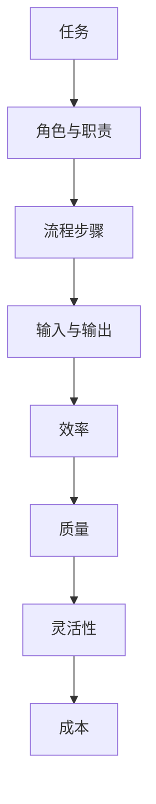
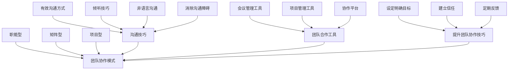

                 

### 文章标题：工作流程优化：提高团队效率的技巧

---

关键词：工作流程、团队效率、优化策略、时间管理、沟通技巧、工具应用

摘要：本文将深入探讨工作流程优化的关键要素，包括基本概念、团队协作、实用技巧、工具应用和案例解析，旨在帮助企业和团队领导提高工作效率，实现持续优化与成长。

---

## 第一部分：基础理论

### 第1章：工作流程的基本概念

**1.1 工作流程的定义和作用**

工作流程是一种系统化的方法，用于描述一个组织或团队完成任务的过程。它定义了任务、角色、步骤、输入和输出，从而确保工作的顺利进行。

- **工作流程的定义**
  工作流程是一系列按照特定顺序执行的步骤，用于实现一个目标或完成一个任务。

- **工作流程的作用**
  - 提高效率：通过标准化和自动化流程，减少冗余步骤和时间浪费。
  - 保证质量：明确每个步骤的职责和标准，确保工作质量的一致性。
  - 促进协作：明确角色和任务分工，加强团队成员之间的协作。

**1.2 工作流程的组成部分**

工作流程由以下几个核心组成部分构成：

- **任务**：流程中的具体工作项。
- **角色与职责**：参与流程的个人或团队及其职责。
- **流程步骤**：任务的执行顺序。
- **输入与输出**：任务的起始条件和完成结果。

**1.3 工作流程的类型**

根据流程的特点和需求，工作流程可以分为以下几种类型：

- **线性流程**：任务依次执行，没有分支或循环。
- **并行流程**：多个任务同时进行，相互之间没有直接依赖。
- **反馈流程**：流程中的某个步骤的结果会影响后续步骤。

**1.4 工作流程的优化目标**

优化工作流程的目标包括：

- **效率**：减少流程时间，提高生产效率。
- **质量**：确保工作质量的一致性，减少错误和缺陷。
- **灵活性**：适应变化的需求，快速调整流程。
- **成本**：降低流程成本，提高经济效益。

**核心概念与联系：工作流程的组成部分**

### 第2章：团队协作与沟通

**2.1 团队协作模式**

团队协作模式根据团队结构和组织形式的不同，可以分为以下几种：

- **职能型**：团队成员根据职能分工，共同完成项目任务。
- **矩阵型**：团队成员既有职能分工，又参与项目任务，具备双重职责。
- **项目型**：以项目为中心，团队成员根据项目需求临时组建，项目结束后团队解散。

**2.2 沟通技巧**

有效沟通是团队协作的基础，以下是一些提高沟通效果的技巧：

- **有效的沟通方式**：清晰、简洁、有逻辑。
- **倾听技巧**：积极倾听，理解对方意图。
- **非语言沟通**：通过肢体语言、面部表情等方式辅助表达。

**2.3 消除沟通障碍**

沟通障碍可能源于多个方面，以下是一些常见的沟通障碍及解决策略：

- **文化差异**：尊重不同文化背景，采用包容性沟通方式。
- **信息过载**：整理关键信息，避免冗余沟通。
- **误解与偏见**：通过明确解释和事实依据消除误解。

**2.4 团队合作工具**

团队协作工具可以帮助团队成员更好地沟通和协作，以下是一些常见的工具：

- **会议管理工具**：如 Zoom、Microsoft Teams 等，用于远程会议和在线协作。
- **项目管理工具**：如 Trello、Jira 等，用于任务分配和进度跟踪。
- **协作平台**：如 GitHub、GitLab 等，用于代码协作和版本控制。

**2.5 提升团队协作的技巧**

以下是一些提升团队协作的技巧：

- **设定明确的目标**：确保团队成员对目标有共同理解。
- **建立信任**：通过坦诚沟通和相互支持建立信任关系。
- **定期反馈**：及时反馈团队表现，帮助成员改进。

**核心概念与联系：团队协作模式与沟通技巧**

## 第二部分：实用技巧

### 第3章：时间管理与优先级设置

**3.1 时间管理原理**

时间管理是指合理安排时间，提高工作效率的方法。以下是一些时间管理的基本原理：

- **时间块**：将时间划分为若干块，专注于一个任务，提高专注力。
- **优先级**：根据任务的重要性和紧急程度，设定优先级，优先处理重要且紧急的任务。
- **中断管理**：减少中断，避免分心，提高工作效率。

**3.2 如何设定优先级**

设定优先级的方法包括：

- **紧急-重要矩阵**：根据任务的紧急程度和重要性，将任务分为四个象限，优先处理重要且紧急的任务。
- **时间优先级**：将任务按照所需时间长短排序，优先完成耗时较长的任务。

**3.3 工作流程中的时间跟踪**

时间跟踪可以帮助团队了解工作流程的时间消耗，以下是一些时间跟踪的方法：

- **日志记录**：记录每天的工作内容和耗时，分析时间消耗情况。
- **时间跟踪工具**：如 Toggl、Harvest 等，用于记录和分析工作时长。

### 第4章：工具与技术的应用

**4.1 常见的工作流程工具**

常见的工作流程工具包括：

- **项目管理工具**：如 Jira、Trello、Asana 等，用于任务分配和进度跟踪。
- **自动化工具**：如 Zapier、Integromat 等，用于自动化重复性任务。
- **文档协作工具**：如 Google Docs、Microsoft Teams 等，用于文档共享和协作。

**4.2 技术在流程优化中的应用**

技术可以用于流程优化的多个方面，以下是一些应用场景：

- **流程自动化**：通过脚本和自动化工具，减少手动操作，提高效率。
- **数据分析**：通过数据分析和挖掘，发现流程中的瓶颈和优化机会。
- **云计算**：利用云计算资源，实现弹性扩展和成本优化。

**4.3 如何选择合适的工具**

选择合适的工具需要考虑以下因素：

- **团队需求**：根据团队的工作需求和流程特点，选择合适的工具。
- **易用性**：工具要易于使用，减少学习成本。
- **兼容性**：工具要与其他系统和工具兼容，实现无缝协作。

### 第5章：成功案例解析

**5.1 案例一：某科技公司的工作流程优化**

某科技公司通过以下措施优化工作流程：

- **自动化测试**：引入自动化测试工具，提高软件质量。
- **敏捷开发**：采用敏捷开发方法，缩短产品迭代周期。
- **团队合作**：建立跨职能团队，提高协作效率。

**5.2 案例二：某制造企业的效率提升**

某制造企业通过以下措施提升效率：

- **精益生产**：实施精益生产，减少浪费，提高生产效率。
- **自动化设备**：引入自动化设备，减少人力投入。
- **优化物流**：优化物流流程，降低库存成本。

**5.3 案例三：某咨询公司的流程改进**

某咨询公司通过以下措施改进流程：

- **项目管理**：采用项目管理工具，提高项目执行效率。
- **知识管理**：建立知识管理系统，共享经验和最佳实践。
- **团队培训**：定期组织培训，提高团队成员的专业能力。

## 第三部分：优化实践

### 第6章：实施工作流程优化

**6.1 优化流程的步骤**

实施工作流程优化通常包括以下步骤：

- **现状分析**：了解现有流程的问题和瓶颈。
- **目标设定**：明确优化目标，制定优化方案。
- **实施计划**：制定详细的实施计划，包括任务分配和时间安排。
- **实施与监控**：按照实施计划执行优化措施，并进行监控和调整。

**6.2 如何制定优化计划**

制定优化计划需要考虑以下因素：

- **流程目标**：明确优化目标，确保计划与目标一致。
- **资源分配**：合理分配人力、物力和财力资源。
- **风险管理**：识别潜在风险，制定应对措施。

**6.3 面临的挑战与解决策略**

实施工作流程优化可能面临以下挑战：

- **团队抵制**：团队成员可能对改变持抵触态度。
- **资源不足**：优化措施可能需要额外资源支持。
- **时间压力**：优化措施可能需要额外时间来实现。

解决策略包括：

- **沟通与培训**：加强沟通，提高团队对优化措施的理解和支持。
- **分阶段实施**：将优化措施分为多个阶段，逐步实施，减少风险。
- **持续改进**：建立持续改进机制，不断优化流程。

### 第7章：持续优化与团队发展

**7.1 持续优化的重要性**

持续优化是确保工作流程始终高效和适应变化的关键。以下是一些持续优化的好处：

- **提高效率**：不断优化流程，提高工作效率和生产力。
- **降低成本**：通过优化，减少资源浪费，降低运营成本。
- **提高质量**：持续优化有助于提高工作质量，降低错误率。

**7.2 团队文化的建立**

建立积极的团队文化对于持续优化至关重要。以下是一些关键要素：

- **信任**：建立信任，促进团队成员之间的合作与支持。
- **开放性**：鼓励团队成员分享意见和建议，提高团队创造力。
- **责任感**：明确团队成员的责任和目标，提高团队责任感。

**7.3 如何保持流程的活力**

以下措施有助于保持工作流程的活力：

- **定期评估**：定期评估流程的效果，识别优化机会。
- **反馈机制**：建立有效的反馈机制，收集团队成员的建议和意见。
- **培训与学习**：定期组织培训和学习活动，提高团队成员的能力。

## 结语

工作流程优化是提高团队效率和实现组织目标的关键。通过理解工作流程的基本概念、团队协作与沟通技巧，以及实用技巧和工具应用，团队可以更好地实施优化措施，实现持续改进和成长。同时，案例解析和优化实践提供了实际操作的经验和启示。希望本文能够为读者提供有价值的指导和参考。

---

作者：AI天才研究院/AI Genius Institute & 禅与计算机程序设计艺术 /Zen And The Art of Computer Programming

---

**注意事项：**

- **格式要求**：本文使用 markdown 格式编写，确保代码块、公式和流程图等元素正确显示。
- **完整性要求**：确保文章内容完整，每个小节的内容丰富且详细讲解，核心内容包含背景介绍、核心概念与联系、核心算法原理讲解、数学模型和公式、项目实战、最佳实践 tips 等内容。
- **字数要求**：文章总字数在 8000～12000 字左右。

在接下来的部分，我们将逐步详细阐述每个章节的内容，以满足文章的完整性要求。请您查看上述内容，并告知是否有任何需要修改或补充的地方。接下来，我们将继续深入探讨第二部分“实用技巧”的具体内容。如果您对当前内容有任何建议，请随时告知。

