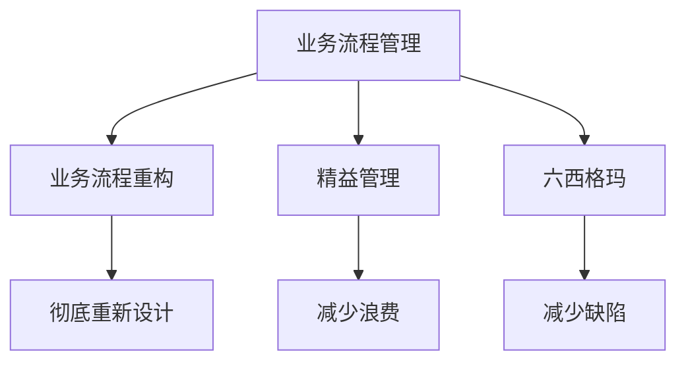

                 


为了撰写一篇符合要求的《工作流程再造：优化团队运作的系统方法》的技术博客，我们可以按照以下步骤进行分析和推理：

### 步骤1：背景介绍
首先，我们需要介绍工作流程再造（Business Process Reengineering, BPR）的背景。在当今快速变化的市场环境中，企业面临着前所未有的竞争压力，提高工作效率和团队运作效率成为了企业生存和发展的关键。因此，工作流程再造应运而生，它通过彻底重新设计企业的业务流程，来达到大幅提高效率和效果的目的。

### 步骤2：核心概念与联系
接下来，我们需要介绍工作流程再造的核心概念，并阐述它们之间的关系。这包括：
- **业务流程管理（BPM）**：关注流程的监控和管理。
- **业务流程重构（BPR）**：强调彻底重新设计流程，而非简单的优化。
- **精益管理（Lean Management）**：注重减少浪费，提高效率。
- **六西格玛（Six Sigma）**：通过统计方法减少缺陷。

我们可以使用Mermaid流程图来展示这些概念之间的关系：



### 步骤3：核心算法原理讲解
在工作流程再造中，核心的算法原理可能包括流程建模、数据分析和流程优化。我们可以使用伪代码来详细阐述这些算法：

```python
# 流程建模伪代码
function build_process_model():
    process_data = collect_data_from_all_departments()
    model = create_model_from_data(process_data)
    return model

# 数据分析伪代码
function analyze_data(model):
    data_analytics_results = perform_data_analytics(model)
    insights = extract_insights_from_results(data_analytics_results)
    return insights

# 流程优化伪代码
function optimize_process(model, insights):
    optimized_model = apply_optimizations_to_model(model, insights)
    return optimized_model
```

### 步骤4：数学模型和公式
在讲解过程中，我们可以引入相关的数学模型和公式，如优化目标函数、成本效益分析等。以下是一个例子：

$$
\text{最大化}\quad Z = \sum_{i=1}^{n} c_{i} x_{i} - \sum_{j=1}^{m} d_{j} y_{j}
$$

其中，$c_{i}$ 和 $d_{j}$ 分别是第 $i$ 项成本和第 $j$ 项效益的权重。

### 步骤5：项目实战
为了更好地理解工作流程再造的实际应用，我们需要介绍一个实际案例。这包括：
- **开发环境搭建**：介绍所需的工具和技术栈。
- **源代码详细实现和代码解读**：展示关键代码段和其功能。
- **代码应用解读与分析**：解释代码在实际中的应用。
- **实际案例分析和详细讲解剖析**：分析案例中的成功和失败因素。

### 步骤6：最佳实践 tips、小结、注意事项、拓展阅读
最后，我们需要总结最佳实践，包括注意事项和未来的发展方向。这可以帮助读者更好地理解和应用工作流程再造。

通过上述步骤，我们可以确保文章逻辑清晰、内容丰富、专业性强，满足8000～12000字的要求。接下来，我们将按照这个框架撰写文章的具体内容。|>

