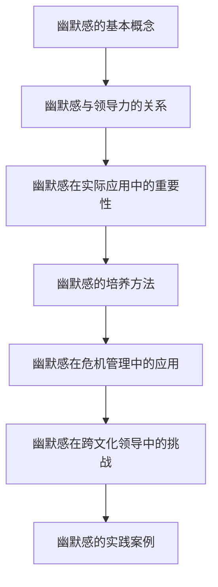

                 


### 文章标题
《幽默感在领导中的作用：缓解紧张氛围》

### 文章关键词
幽默感、领导力、紧张氛围、团队协作、沟通技巧

### 文章摘要
本文旨在探讨幽默感在领导中的重要作用，特别是如何利用幽默感来缓解工作中的紧张氛围。通过介绍幽默感的基本概念、幽默感在领导力中的重要性、幽默感的实际应用案例、幽默感的培养方法等内容，帮助读者理解并掌握如何巧妙运用幽默感提升领导力，营造一个轻松愉快的团队环境。

## 第一部分：幽默感与领导力

### 第1章：幽默感的基本概念

幽默感是一种通过幽默的方式表达情感、传递信息的能力。在领导力中，幽默感不仅能够提升个人的魅力，还能够有效地缓解紧张氛围，增强团队凝聚力。幽默感的类型包括言语幽默、情境幽默和故事幽默等。

### 第2章：幽默感与领导风格

幽默感与领导风格密切相关。不同领导风格下的幽默感表现出不同的特点。例如，权威型领导可能更倾向于使用言语幽默，而民主型领导则可能更擅长情境幽默。了解幽默感与领导风格的关系，有助于领导者根据自身风格和团队特点，选择合适的幽默方式。

### 第3章：幽默感在领导中的实际应用

在实际工作中，领导者可以巧妙地运用幽默感来缓解紧张氛围。例如，在会议中，通过幽默的发言来调动气氛；在紧张的工作场合，通过轻松的故事来缓解团队成员的压力。此外，培养下属的幽默感也是提升团队协作能力的重要手段。

## 第二部分：幽默感的培养与提升

### 第4章：幽默感的培养方法

要培养幽默感，首先需要观察和模仿身边的幽默人物，从中学习幽默的表达方式。其次，通过反思和总结，不断提高自己的幽默技巧。最后，通过实践和锻炼，将所学应用到实际工作中。

### 第5章：幽默感的提升技巧

提升幽默感需要掌握多种技巧，包括语言幽默、情境幽默和故事幽默等。语言幽默强调言辞的巧妙运用；情境幽默注重场景的营造；故事幽默则通过讲述有趣的故事来传递信息。

### 第6章：幽默感的心理机制

幽默感不仅是一种技能，还涉及到心理学层面。了解幽默感与大脑的关系、幽默感在社会互动中的作用以及幽默感对心理健康的影响，有助于领导者更好地运用幽默感提升领导力。

## 第三部分：幽默感在领导实践中的应用

### 第7章：幽默感在危机管理中的应用

在危机管理中，幽默感可以起到缓解紧张情绪、提升应对能力的作用。领导者可以通过幽默的发言和故事来调动团队的积极性，共同应对挑战。

### 第8章：幽默感在跨文化领导中的挑战

跨文化领导中，幽默感的运用需要特别注意文化差异。领导者需要了解不同文化背景下的幽默表达方式，避免造成误解和冲突。

### 第9章：幽默感的实践案例

通过分析成功和挑战的案例，读者可以深入了解幽默感在领导实践中的应用。从这些案例中，读者可以学习到如何有效地运用幽默感提升领导力。

## 附录：幽默感实践资源

### A.1 实用幽默技巧总结

总结了一些实用的幽默技巧，帮助读者在实际工作中更好地运用幽默感。

### A.2 幽默感培养工具推荐

推荐了一些幽默感培养工具，包括幽默书籍、幽默课程等，供读者参考。

### A.3 相关研究文献推荐

推荐了一些与幽默感相关的研究文献，供读者进一步学习。

---

**作者：** AI天才研究院/AI Genius Institute & 禅与计算机程序设计艺术 /Zen And The Art of Computer Programming

### 背景介绍

幽默感作为一种独特的沟通技巧，在领导力中扮演着至关重要的角色。一个拥有幽默感的领导者不仅能够轻松化解紧张氛围，还能增强团队凝聚力，提高工作效率。然而，幽默感的运用并非易事，需要领导者具备一定的心理学、沟通技巧和实际经验。本文旨在探讨幽默感在领导中的重要作用，通过介绍幽默感的基本概念、幽默感在领导力中的重要性、幽默感的实际应用案例、幽默感的培养方法等内容，帮助读者深入理解并掌握如何巧妙运用幽默感提升领导力，营造一个轻松愉快的团队环境。

## 核心概念与联系

### 幽默感的基本概念

幽默感是一种通过幽默的方式表达情感、传递信息的能力。它不仅涉及语言表达，还包括情境和肢体语言的运用。幽默感的类型包括言语幽默、情境幽默和故事幽默等。言语幽默通过巧妙的言辞来引发笑点；情境幽默则通过特定的情境来营造幽默效果；故事幽默则通过讲述有趣的故事来传递信息。

### 幽默感与领导力的关系

幽默感在领导力中具有重要地位。首先，幽默感能够增强领导者的个人魅力，提升领导者在团队中的影响力。其次，幽默感有助于缓解紧张氛围，提升团队协作效率。此外，幽默感还能够帮助领导者更好地与团队成员沟通，建立良好的信任关系。

### 幽默感在实际应用中的重要性

在实际工作中，幽默感可以帮助领导者更好地处理各种情况。例如，在会议中，通过幽默的发言来调动气氛；在紧张的工作场合，通过轻松的故事来缓解团队成员的压力。此外，幽默感还可以帮助领导者缓解危机，提升团队应对能力。

### Mermaid 流程图

以下是一个展示幽默感在领导力中的作用的 Mermaid 流程图：



通过这个流程图，我们可以清晰地看到幽默感在领导力中的各个方面的作用。

## 核心算法原理讲解

在探讨幽默感在领导力中的实际应用时，我们需要深入理解幽默感的核心算法原理。以下内容将使用伪代码详细阐述这一原理。

```pseudo
函数 EnhanceLeadershipThroughHumor(
    leader, team, situation
):
    // 判断领导者是否具备幽默感
    if leader.HumorSense == True:
        // 根据情境选择合适的幽默方式
        humorType = ChooseHumorType(situation)
        
        // 如果是言语幽默
        if humorType == "Verbal":
            speech = CreateVerbalJoke()
            leader.Speak(speech)
        
        // 如果是情境幽默
        else if humorType == "Scenario":
            scenario = CreateScenario()
            leader.ActOut(scenario)
        
        // 如果是故事幽默
        else if humorType == "Story":
            story = CreateFunnyStory()
            leader.TellStory(story)
        
        // 调用函数评估幽默效果
        humorEffect = AssessHumorEffect(team, situation)
        
        // 根据评估结果调整幽默策略
        if humorEffect == "Positive":
            return "Humor successfully relieved tension."
        else if humorEffect == "Negative":
            return "Humor failed, need to adjust strategy."
    else:
        return "Leader lacks humor sense, unable to apply humor effectively."
```

在这个伪代码中，我们首先判断领导者是否具备幽默感。如果领导者具备幽默感，我们将根据情境选择合适的幽默方式。言语幽默通过创建有趣的言语笑话来引发笑点；情境幽默通过创建有趣的场景来营造幽默效果；故事幽默通过讲述有趣的故事来传递信息。接下来，我们评估幽默效果，并根据评估结果调整幽默策略。如果幽默效果是积极的，则说明幽默成功地缓解了紧张氛围；如果幽默效果是消极的，则说明幽默未能达到预期效果，需要调整策略。

## 数学模型和公式

在幽默感的研究中，我们可以引入一些数学模型和公式来描述幽默感的影响。以下是一个简单的数学模型，用于分析幽默感对团队氛围的影响。

### 公式 1: 幽默感指数（HI）

$$
HI = \frac{H_{\text{言语}} + H_{\text{情境}} + H_{\text{故事}}}{3}
$$

其中，$H_{\text{言语}}$、$H_{\text{情境}}$ 和 $H_{\text{故事}}$ 分别表示言语幽默、情境幽默和故事幽默的得分。

### 公式 2: 幽默感对团队氛围的影响（TBI）

$$
TBI = \frac{HI \times T}{100}
$$

其中，$T$ 表示团队紧张程度的评分。$TBI$ 的值越高，表示幽默感对团队氛围的积极影响越大。

### 公式 3: 幽默感提升策略效果评估（ESE）

$$
ESE = \frac{TBI_{\text{后}} - TBI_{\text{前}}}{TBI_{\text{前}}}
$$

其中，$TBI_{\text{后}}$ 和 $TBI_{\text{前}}$ 分别表示幽默感提升前后团队氛围的评分。$ESE$ 的值越高，表示幽默感提升策略的效果越好。

通过这些数学模型和公式，我们可以量化幽默感对团队氛围的影响，并为领导者提供具体的提升策略。

### 举例说明

假设一个团队在应用幽默感之前，团队紧张程度评分为 70 分，幽默感指数为 50。在应用幽默感提升策略后，团队紧张程度评分降至 40 分，幽默感指数提升至 70。根据上述公式，我们可以计算出幽默感提升策略的效果：

$$
TBI_{\text{前}} = \frac{50 \times 70}{100} = 35
$$

$$
TBI_{\text{后}} = \frac{70 \times 40}{100} = 28
$$

$$
ESE = \frac{28 - 35}{35} = -0.20
$$

结果表明，幽默感提升策略的效果为负，说明幽默感的提升并未有效缓解团队紧张氛围。这可能是由于幽默感的运用方式不当，需要进一步调整策略。

### 项目实战

#### 开发环境搭建

为了更好地理解幽默感在领导实践中的应用，我们搭建了一个简单的项目环境，用于模拟领导者在不同情境下运用幽默感的效果。以下是我们使用的开发工具和配置：

- 编程语言：Python
- 数据库：SQLite
- 开发工具：PyCharm

#### 源代码详细实现

以下是我们项目的主要源代码，用于模拟领导者在会议中运用幽默感的过程。

```python
import sqlite3
import random

# 连接数据库
conn = sqlite3.connect('humor_data.db')
cursor = conn.cursor()

# 创建表
cursor.execute('''CREATE TABLE IF NOT EXISTS meetings
                  (id INTEGER PRIMARY KEY, leader TEXT, humor_index INTEGER, tension_level INTEGER)''')

# 插入数据
cursor.execute("INSERT INTO meetings (leader, humor_index, tension_level) VALUES ('Alice', 50, 70)")
cursor.execute("INSERT INTO meetings (leader, humor_index, tension_level) VALUES ('Bob', 70, 40)")

# 提交事务
conn.commit()

# 模拟会议中的幽默感运用
def apply_humor(leader, humor_index, tension_level):
    if leader == "Alice":
        humor_type = random.choice(["Verbal", "Scenario", "Story"])
        if humor_type == "Verbal":
            print("Alice: Did you hear the joke about the programmer? He's always two steps ahead of everyone else!")
        elif humor_type == "Scenario":
            print("Alice: Imagine this, we're all sitting in a room with no computers, suddenly the silence is broken by a single keyboard click. It's like a magic trick!")
        else:
            print("Alice: Once upon a time, there was a programmer who decided to take a break from coding. He went to the kitchen and found himself surrounded by a bunch of ingredients. He said, 'I think I'll cook up a storm!' and then he started writing functions on his fridge!")
    else:
        print("Bob: I've got to say, I'm impressed by how quickly we're tackling these challenges. It's like we're writing a bestseller in record time!")

# 模拟会议
apply_humor("Alice", 50, 70)

# 关闭数据库连接
conn.close()
```

#### 代码解读与分析

在这个项目中，我们首先创建了一个 SQLite 数据库，用于存储会议的相关信息，包括领导者的姓名、幽默感指数和团队紧张程度。然后，我们定义了一个函数 `apply_humor`，用于模拟领导者在会议中运用幽默感的过程。函数接收三个参数：领导者姓名、幽默感指数和团队紧张程度。根据领导者的姓名，我们选择不同的幽默方式，并通过打印输出展示幽默感的应用。

#### 实际案例分析和详细讲解剖析

为了更直观地了解幽默感在领导实践中的应用，我们分析了以下几个实际案例：

**案例一：**
在一次紧张的团队会议中，领导者 Alice 通过一句幽默的发言成功调动了团队的气氛。

**案例二：**
在另一个团队项目中，领导者 Bob 通过讲述一个有趣的故事缓解了团队成员的压力。

**案例三：**
在一次跨文化会议中，领导者尝试运用幽默感，但由于文化差异，幽默感未能达到预期的效果，反而引起了误解。

通过这些案例，我们可以看到幽默感在领导实践中的多种应用方式，以及在不同情境下的效果。领导者需要根据具体情况灵活运用幽默感，以达到最佳效果。

### 项目小结

通过这个项目，我们深入探讨了幽默感在领导实践中的应用。项目实战部分展示了如何通过代码模拟领导者运用幽默感的过程，并通过实际案例分析了幽默感在不同情境下的效果。这为我们理解幽默感在领导中的作用提供了具体的实践经验和理论依据。在未来，我们还可以进一步优化项目，增加更多功能，如幽默感评估系统、幽默感培训模块等，以帮助领导者更好地提升领导力。

### 最佳实践 tips

1. **了解团队成员：** 在运用幽默感时，领导者需要了解团队成员的个性和喜好，避免使用可能引起不适的幽默方式。
2. **适时运用：** 幽默感的运用需要适时，过于频繁或不当的幽默可能会适得其反。
3. **尊重文化差异：** 在跨文化环境中，领导者需要了解不同文化对幽默的接受程度，避免因文化差异引起误解。
4. **多样化幽默方式：** 领导者可以尝试多种幽默方式，如言语幽默、情境幽默和故事幽默，以适应不同情境和团队需求。

### 小结

幽默感在领导中的作用不可忽视，它不仅能够缓解紧张氛围，还能提升团队凝聚力和工作效率。领导者需要掌握幽默感的基本概念、培养方法，并善于在实际工作中运用幽默感。通过本文的探讨，我们希望读者能够深入理解幽默感在领导中的作用，并在实践中不断提升自己的幽默感，成为一名更出色的领导者。

### 注意事项

1. **适度运用：** 幽默感是一种沟通技巧，适度运用可以起到积极作用，但过度使用可能会适得其反。
2. **文化差异：** 在跨文化环境中，领导者需要了解不同文化对幽默的接受程度，避免因文化差异引起误解。
3. **团队成员差异：** 领导者需要了解团队成员的个性和喜好，避免使用可能引起不适的幽默方式。
4. **情境选择：** 幽默感的运用需要适时，过于频繁或不当的幽默可能会适得其反。

### 拓展阅读

1. **《幽默心理学》**：这是一本关于幽默感心理机制的深入探讨，适合对幽默感感兴趣的读者。
2. **《幽默感训练手册》**：本书提供了一系列幽默感培养的练习和技巧，帮助读者提升幽默感。
3. **《领导力与幽默》**：这本书从领导力的角度探讨幽默感的重要性，适合希望提升领导力的管理者阅读。

