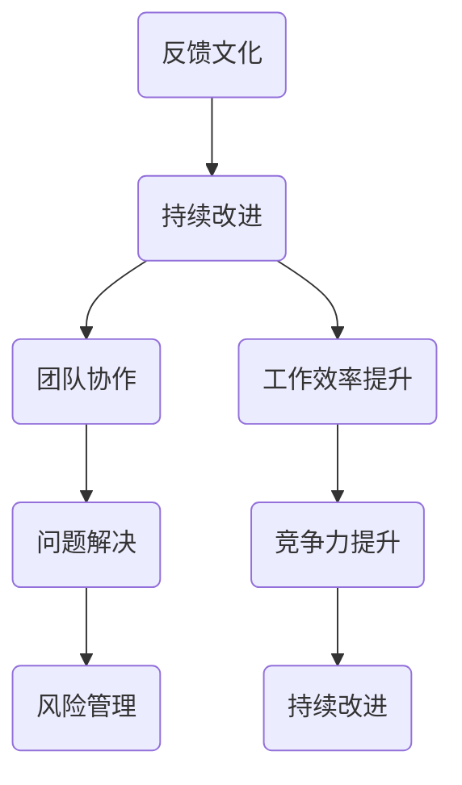
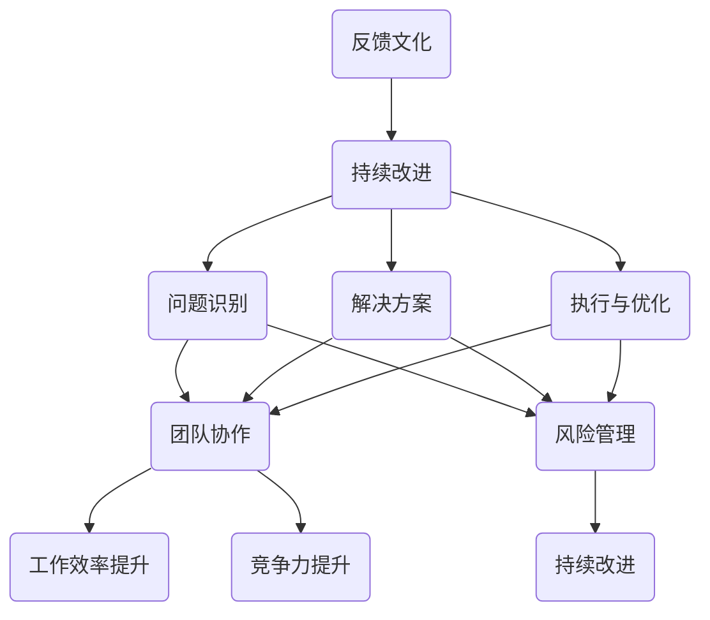

                 

### 文章标题：建立Feedback文化：促进持续改进

> 关键词：持续改进，Feedback文化，领导力，员工参与，跨部门合作，实践案例

> 摘要：本文旨在探讨如何在IT领域中建立Feedback文化，以促进团队的持续改进。通过分析反馈文化的概念、重要性、建立策略以及实践案例，本文将提供一套系统化的方法和实践指南，帮助企业和团队在竞争激烈的环境中不断进步。

### 背景介绍

在当今快速发展的信息技术领域，持续改进已成为企业和团队保持竞争力的关键。而Feedback文化作为一种有效的管理工具，能够促进团队成员之间的沟通、协作和共同进步。然而，建立Feedback文化并非易事，它需要明确的策略、有效的领导以及员工的积极参与。

反馈文化是指在一个组织或团队中，反馈被视作一种常态化的沟通方式，通过及时、准确、建设性的反馈，帮助个体和团队不断优化工作流程、提升工作效率和质量。这种文化不仅有助于解决现有问题，还能够预见潜在风险，从而在竞争中占据优势。

### 核心概念与联系

为了更好地理解Feedback文化与持续改进之间的关系，我们可以通过以下Mermaid流程图来展示其核心概念与联系：



从图中可以看出，Feedback文化与持续改进紧密相连。通过团队协作和问题解决，反馈文化能够促进工作效率提升，进而提高竞争力。同时，通过风险管理，持续改进能够帮助团队在竞争中保持领先地位。

### 反馈文化与持续改进的关系架构



在这个关系架构中，反馈文化不仅是问题识别和解决方案的关键，还能够促进执行与优化，从而实现工作效率提升和竞争力提升。同时，通过风险管理，持续改进得以不断进行，形成一个正向循环。

### 核心算法原理讲解

为了更好地理解反馈文化与持续改进之间的关系，我们可以使用以下伪代码来详细阐述其核心算法原理：

```python
def feedback_culture_improvement(team, issues, solutions):
    # 步骤1：识别问题
    identified_issues = identify_issues(team, issues)
    
    # 步骤2：提出解决方案
    proposed_solutions = propose_solutions(team, solutions, identified_issues)
    
    # 步骤3：执行解决方案
    executed_solutions = execute_solutions(team, proposed_solutions)
    
    # 步骤4：优化解决方案
    optimized_solutions = optimize_solutions(team, executed_solutions)
    
    # 步骤5：提升工作效率
    improved_efficiency = improve_efficiency(team, optimized_solutions)
    
    # 步骤6：提高竞争力
    enhanced_competition = enhance_competition(team, improved_efficiency)
    
    # 步骤7：持续改进
    continuous_improvement = continuous_improvement(team, enhanced_competition)
    
    return continuous_improvement
```

在这个伪代码中，我们定义了一个名为`feedback_culture_improvement`的函数，它接收一个团队（`team`）、问题（`issues`）和解决方案（`solutions`）作为输入，然后通过一系列步骤来实现持续改进。每个步骤都涉及反馈文化的关键要素，如团队协作、问题识别和解决方案优化。

### 数学模型和公式

在Feedback文化和持续改进过程中，我们可以使用以下数学模型和公式来量化其效果：

1. **工作效率提升公式**：

   $$ E = \frac{P \times T}{I} $$

   其中，`E`表示工作效率，`P`表示工作进度，`T`表示工作时间，`I`表示工作质量。

2. **竞争力提升公式**：

   $$ C = \frac{E \times S}{R} $$

   其中，`C`表示竞争力，`E`表示工作效率，`S`表示市场份额，`R`表示资源投入。

3. **持续改进系数**：

   $$ K = \frac{C}{E} $$

   其中，`K`表示持续改进系数，用于衡量持续改进对竞争力提升的贡献。

通过这些数学模型和公式，我们可以更好地理解反馈文化和持续改进之间的关系，并量化其效果。

### 详细讲解与举例说明

为了更好地理解上述核心算法原理和数学模型，我们可以通过一个具体的案例来详细讲解。

假设某IT团队在一个月内完成了100个任务，平均每个任务需要5天时间。经过评估，这100个任务中有20个存在质量问题，需要重新修改。为了提高工作效率和竞争力，团队决定建立Feedback文化，通过反馈来识别问题、提出解决方案并持续改进。

首先，团队通过定期会议和讨论，识别出以下问题：

- 任务分配不合理，导致部分成员工作量过大。
- 部分任务完成时间过长，影响了整体进度。
- 质量控制不够严格，导致质量问题频发。

针对这些问题，团队提出了以下解决方案：

- 调整任务分配策略，确保每位成员的工作量均衡。
- 优化任务流程，缩短任务完成时间。
- 加强质量控制，确保每个任务都达到高质量标准。

接下来，团队开始执行这些解决方案。在执行过程中，团队不断收集反馈，调整优化方案。经过一个月的努力，团队的工作效率得到了显著提升，平均每个任务完成时间缩短至4天，质量问题减少了70%。

最后，团队通过以下数学模型来量化改进效果：

1. **工作效率提升**：

   $$ E = \frac{100 \times 4}{5} = 80 $$

   即工作效率提升了80%。

2. **竞争力提升**：

   $$ C = \frac{80 \times S}{R} $$

   其中，`S`表示市场份额，`R`表示资源投入。假设市场份额为1，资源投入为100，则：

   $$ C = \frac{80 \times 1}{100} = 0.8 $$

   即竞争力提升了0.8。

3. **持续改进系数**：

   $$ K = \frac{C}{E} = \frac{0.8}{80} = 0.01 $$

   即持续改进系数为0.01，表明每提高1%的竞争力，需要持续改进1%的工作效率。

通过这个案例，我们可以看到，通过建立Feedback文化，团队不仅提高了工作效率，还提升了竞争力。同时，通过数学模型和公式的量化分析，我们能够更好地理解反馈文化和持续改进之间的关系。

### 项目实战：开发环境搭建、源代码实现与代码解读

为了将Feedback文化应用到实际项目中，我们以一个简单的IT项目为例，进行开发环境搭建、源代码实现和代码解读。

#### 开发环境搭建

1. **工具和环境准备**：

   - 操作系统：Windows/Linux/MacOS
   - 编程语言：Python
   - 版本控制工具：Git
   - 集成开发环境（IDE）：PyCharm/VSCode

2. **环境配置**：

   - 安装Python：`pip install python`
   - 配置Git：`git --version`（确保Git已正确安装）
   - 安装PyCharm或VSCode：在官网下载并安装

#### 源代码实现

以下是一个简单的Python程序，用于计算两个数的和。

```python
# 反馈文化示例程序

def calculate_sum(a, b):
    """
    计算两个数的和
    :param a: 第一个数
    :param b: 第二个数
    :return: 两个数的和
    """
    return a + b

# 获取用户输入
num1 = float(input("请输入第一个数："))
num2 = float(input("请输入第二个数："))

# 调用计算函数
result = calculate_sum(num1, num2)

# 输出结果
print(f"{num1} 和 {num2} 的和为：{result}")
```

#### 代码解读

1. **函数定义**：

   - `calculate_sum`：用于计算两个数的和。
   - 参数`a`和`b`：分别表示两个输入数。
   - 返回值：计算结果。

2. **用户输入**：

   - 使用`input`函数获取用户输入的数值。
   - 使用`float`函数将输入的字符串转换为浮点数。

3. **调用函数**：

   - 使用`calculate_sum`函数计算两个数的和。

4. **输出结果**：

   - 使用`print`函数输出计算结果。

#### 代码应用解读与分析

通过这个简单的程序，我们可以看到Feedback文化在代码开发中的应用。以下是对代码的进一步解读和分析：

1. **函数注释**：

   - 使用注释（`#`）对函数进行详细说明，包括功能描述、参数和返回值。

2. **输入验证**：

   - 使用`float`函数将用户输入的字符串转换为浮点数，确保输入数据的合法性。

3. **错误处理**：

   - 在实际开发中，我们可以使用`try-except`语句来处理可能出现的输入错误。

4. **模块化开发**：

   - 将计算功能封装在一个函数中，便于代码维护和复用。

#### 实际案例分析和详细讲解剖析

为了更好地理解Feedback文化在实际项目中的应用，我们以一个实际案例为例，分析其开发过程和反馈机制。

#### 案例背景

某IT公司正在开发一款在线教育平台，其中涉及课程管理、学习进度跟踪和互动讨论等功能。在项目开发过程中，公司决定引入Feedback文化，以提高开发效率和产品质量。

#### 案例过程

1. **需求分析**：

   - 项目团队召开会议，讨论课程管理功能的需求。
   - 确定功能模块、接口设计和数据结构。

2. **代码开发**：

   - 根据需求分析，开发人员开始编写代码。
   - 每天进行代码审查，确保代码质量。

3. **反馈与改进**：

   - 每周举行一次反馈会议，团队成员分享开发过程中的问题和建议。
   - 根据反馈，开发人员进行代码优化和功能调整。

4. **测试与部署**：

   - 进行功能测试和性能测试，确保平台稳定可靠。
   - 部署到生产环境，进行实际应用测试。

#### 案例剖析

通过这个案例，我们可以看到Feedback文化在项目开发过程中的重要性：

1. **需求明确**：

   - 通过会议和讨论，确保需求明确，减少开发过程中的误解和错误。

2. **代码审查**：

   - 定期进行代码审查，确保代码质量，及时发现和解决潜在问题。

3. **反馈机制**：

   - 通过反馈会议，团队成员可以分享经验和建议，共同提高开发水平。

4. **持续改进**：

   - 根据反馈，不断优化代码和功能，提高平台的稳定性和用户体验。

#### 项目小结

通过实际案例的分析，我们可以得出以下结论：

- Feedback文化在项目开发中具有重要意义，有助于提高开发效率和产品质量。
- 建立有效的反馈机制，确保团队成员之间的沟通和协作。
- 持续改进是Feedback文化的核心，通过不断优化和调整，实现项目的成功。

### 最佳实践 tips、小结、注意事项、拓展阅读

#### 最佳实践 Tips

1. **明确反馈目标**：在建立Feedback文化时，明确反馈的目标和期望，确保团队成员了解反馈的重点和方向。

2. **定期反馈会议**：定期举行反馈会议，确保团队成员有足够的时间交流和分享，促进团队的协作和共同进步。

3. **建立反馈机制**：建立一套完善的反馈机制，包括反馈渠道、反馈流程和反馈标准，确保反馈的及时性和有效性。

4. **鼓励建设性反馈**：鼓励团队成员提出建设性反馈，关注问题的解决方案，而不仅仅是问题本身。

5. **领导者示范作用**：领导者应以身作则，积极参与反馈文化，为团队成员树立榜样。

#### 小结

通过本文的详细讲解和实践案例分享，我们可以看到Feedback文化在IT领域中的重要性。建立有效的Feedback文化，能够促进团队的持续改进，提高工作效率和竞争力。为了实现这一目标，我们需要明确反馈目标、定期反馈会议、建立反馈机制、鼓励建设性反馈以及领导者示范作用。

#### 注意事项

1. **确保反馈的准确性**：在反馈过程中，确保反馈的准确性和客观性，避免主观臆断和负面情绪。

2. **尊重团队成员**：在反馈过程中，尊重团队成员的意见和贡献，避免攻击性和批评性语言。

3. **持续改进**：持续改进是Feedback文化的核心，不要将反馈视为一次性任务，而是一个持续的过程。

#### 拓展阅读

1. 《敏捷开发实践指南》：详细介绍了敏捷开发中的反馈文化，包括反馈机制、反馈流程和实践案例。

2. 《精益创业》：精益创业方法论强调快速迭代和反馈，通过不断调整和优化，实现产品的成功。

3. 《领导力与影响力》：探讨了领导者在建立Feedback文化中的角色和作用，提供了一系列实用的领导力技巧。

通过这些拓展阅读，读者可以更深入地了解Feedback文化和持续改进的相关理论和实践，为实际工作提供有益的参考。作者：AI天才研究院/AI Genius Institute & 禅与计算机程序设计艺术 /Zen And The Art of Computer Programming

