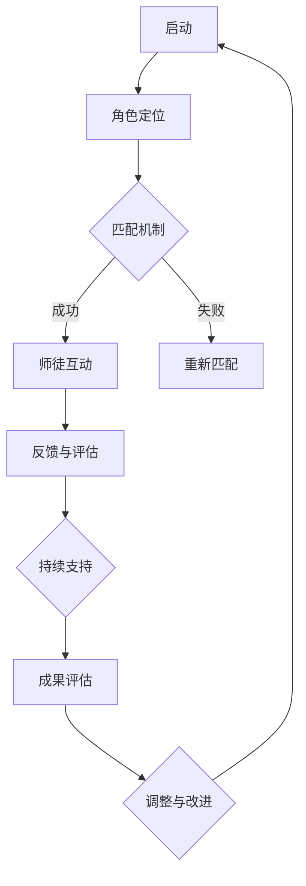

                 

### 核心概念与联系

#### 第1章：mentorship文化概述

##### 1.1 mentorship文化的基本概念

**mentorship**，即导师制，是一种通过资深专业人士（mentor）与新手（mentee）之间的长期互动，帮助新手在其职业和生活中成长与发展的机制。不同于传统的指导或教练，mentorship更侧重于全面的成长和发展，包括专业技能、职业规划和个人发展等多个方面。

**mentorship文化** 是指一个组织或社区内普遍认同并实践的 mentorship 价值观和流程，它不仅仅是个人间的互动，而是整个组织文化的一部分。这种文化鼓励知识传承、经验分享和持续学习，从而促进个人和组织整体的成长。

**mentorship与指导、教练的区别**：

- **指导（Guidance）** 通常指在特定问题或任务上提供帮助和解答，更侧重于技术层面的支持。
- **教练（Coaching）** 更多地关注个人技能的提升和自我认知的增强，强调自我发现和自我管理。
- **mentorship** 则是综合了指导和教练的特点，既提供专业知识和技能的传授，也关注职业发展和个人成长的全过程。

##### 1.2 mentorship文化的核心组成部分

**成长与发展的价值观**：mentorship文化强调个人的成长和发展，将这一理念融入组织的核心价值观。

**知识传承与共享**：通过资深员工与新手之间的互动，知识得以从一代传至下一代，促进组织知识的积累和共享。

**师徒关系的建立与维护**：建立稳定的师徒关系，为双方提供长期的支持和指导，确保知识的有效传递和成长过程的顺利进行。

##### 1.3 mentorship文化的运作机制

**成功的mentorship文化的关键因素**：

- 明确的角色定位和职责：明确mentor和mentee的职责，确保互动的顺利进行。
- 有效的匹配机制：通过科学的匹配方法，确保mentor和mentee之间的匹配度。
- 持续的反馈和沟通：建立反馈机制，促进双方的成长和互动。
- 支持体系：提供必要的培训和支持，帮助mentor和mentee克服困难。

**mentorship文化在组织中的影响**：

- 提升员工满意度：通过导师的帮助，员工能够更快地适应新环境，提高工作满意度。
- 促进知识传承：资深员工的经验和知识得到有效传递，减少知识流失。
- 增强组织凝聚力：通过mentorship文化，促进团队成员之间的交流和合作，增强组织的凝聚力。

**mentorship文化在不同文化和组织中的适应性**：

- **文化差异**：在不同文化背景下，mentorship文化的实施方式可能有所不同，需要根据文化特点进行调整。
- **组织差异**：不同类型的组织，如初创公司、大型企业或学术机构，在实施mentorship文化时，需要考虑组织结构和业务需求的不同。

#### 1.4 Mermaid流程图：mentorship文化的运作流程

以下是一个简化的Mermaid流程图，展示了mentorship文化的基本运作流程：



**流程解释**：

- **A[启动]**：启动mentorship计划，明确参与者的角色和目标。
- **B[角色定位]**：明确mentor和mentee的角色和职责。
- **C[匹配机制]**：通过科学的方法进行mentor和mentee的匹配。
- **D[师徒互动]**：mentor和mentee开始互动，共同学习和成长。
- **F[反馈与评估]**：定期收集双方的反馈，评估mentorship的效果。
- **G[持续支持]**：提供必要的支持，确保mentorship的顺利进行。
- **H[成果评估]**：最终评估mentorship计划的成果，为改进提供依据。
- **I[调整与改进]**：根据评估结果进行必要的调整和改进，确保mentorship文化的持续发展。

#### 1.5 伪代码：mentorship匹配算法

以下是一个简化的伪代码，用于描述mentorship匹配算法的基本框架：

```python
function MentorshipMatching(mentors, mentees):
    # 初始化匹配结果
    match_results = []

    # 遍历所有mentees
    for mentee in mentees:
        # 找到符合条件的mentor
        best_mentor = None
        max_similarity = 0

        for mentor in mentors:
            similarity = CalculateSimilarity(mentor, mentee)
            
            if similarity > max_similarity:
                max_similarity = similarity
                best_mentor = mentor

        # 将匹配结果添加到列表中
        match_results.append((mentee, best_mentor))

    return match_results

function CalculateSimilarity(mentor, mentee):
    # 计算mentor和mentee的相似度
    # 相似度计算方法可根据具体需求进行调整
    similarity = cosine_similarity(mentor_profile, mentee_profile)
    return similarity
```

**函数解释**：

- `MentorshipMatching(mentors, mentees)`：主函数，用于实现mentor和mentee的匹配。
- `CalculateSimilarity(mentor, mentee)`：辅助函数，用于计算mentor和mentee之间的相似度。
- `mentor_profile`和`mentee_profile`：分别表示mentor和mentee的个人信息和技能特点。

#### 1.6 数学模型和公式

在mentorship文化的实施过程中，可以使用多种数学模型和公式来评估和优化匹配效果。以下是一个简单的概率模型和优化模型的介绍：

**概率模型**：

$$
P(success) = \sum_{i=1}^{n} p_i \cdot q_i
$$

其中，$p_i$表示mentor对mentee的满意度概率，$q_i$表示mentee对mentor的满意度概率。通过计算这个概率，可以评估mentorship匹配的成功率。

**优化模型**：

$$
\max_{x} \sum_{i=1}^{n} p_i \cdot q_i
$$

其中，$x$表示mentor和mentee的匹配状态，$p_i$和$q_i$同上。这个优化模型的目标是最大化整体满意度，从而找到最优的匹配方案。

通过这些数学模型和公式，可以更科学地评估和调整mentorship文化的实施效果，确保知识的有效传递和双方的成长。

### 总结

本部分对mentorship文化的核心概念进行了详细阐述，包括基本概念、核心组成部分、运作机制以及匹配算法。通过Mermaid流程图和伪代码，我们更直观地理解了mentorship文化的运作流程和匹配算法的基本原理。此外，还介绍了mentorship文化在不同文化和组织中的适应性，为后续章节的内容奠定了基础。在下一部分，我们将进一步探讨如何在一个组织内部建立mentorship文化，包括角色定位、流程设计和资源配置等方面的具体措施。

### 第2章：建立mentorship文化的准备

#### 2.1 组织层面

在建立mentorship文化之前，组织层面的准备至关重要。首先，组织文化需要具备支持mentorship的理念和价值观。这意味着，组织领导层需要明确表达对mentorship文化的支持，并在日常运营中践行这一理念。

**领导层的支持**：

- **传达愿景**：领导层应通过会议、内部通讯等方式，传达建立mentorship文化的愿景和重要性。
- **激励措施**：通过激励措施，如奖金、晋升机会等，鼓励员工参与mentorship活动。
- **资源投入**：为mentorship文化提供必要的资源，包括培训、技术支持等。

**资源配置与分配**：

- **人力资源**：确保有足够数量的资深员工愿意担任mentor，同时为新员工提供mentee角色。
- **时间管理**：明确mentor和mentee的时间安排，确保双方有足够的时间和精力参与mentorship活动。
- **技术支持**：提供必要的技术平台，如在线社区、视频会议工具等，以支持mentorship互动。

#### 2.2 角色定位

在mentorship文化中，角色定位至关重要。明确每个角色的职责和期望，有助于确保mentorship的顺利进行。

**mentor的角色与责任**：

- **经验分享**：资深员工通过分享自己的经验和专业知识，帮助新手快速成长。
- **职业规划**：为mentee提供职业发展的指导和建议，帮助他们制定明确的职业目标。
- **问题解决**：在mentee遇到问题时，提供有效的解决方案和支持。

**mentee的角色与责任**：

- **主动学习**：积极学习导师的知识和技能，主动参与导师安排的学习任务。
- **反馈与沟通**：定期与导师进行沟通，提供反馈，共同讨论成长过程中的问题和挑战。
- **责任感**：对自己和导师负责，确保学习过程的有效性和成果。

**支持人员的角色与责任**：

- **协调与沟通**：负责协调mentor和mentee之间的沟通，确保双方的需求和期望得到满足。
- **培训与支持**：为mentor提供必要的培训和支持，帮助他们更好地履行职责。
- **反馈与评估**：收集mentorship活动中的反馈，进行评估，为改进提供依据。

#### 2.3 流程设计

有效的mentorship流程设计是确保mentorship文化成功实施的关键。

**mentorship计划的制定**：

- **目标设定**：明确mentorship计划的目标，如提高员工满意度、促进知识传承等。
- **计划实施**：制定详细的实施计划，包括活动安排、时间表、评估标准等。

**匹配机制**：

- **科学匹配**：通过数据分析和相似度计算，实现mentor和mentee的合理匹配。
- **动态调整**：根据反馈和评估结果，及时调整匹配方案，确保最佳匹配效果。

**持续的反馈与沟通**：

- **定期反馈**：建立定期反馈机制，如季度或年度评估，收集mentor和mentee的反馈。
- **实时沟通**：提供实时沟通工具，如在线聊天、视频会议等，确保双方能够及时交流。

**资源配置与实施**：

- **培训与支持**：为mentor和mentee提供必要的培训和支持，帮助他们更好地履行角色职责。
- **资源分配**：确保有足够的资源支持mentorship活动的开展，如培训课程、技术平台等。

**评价与反馈机制**：

- **评估标准**：制定明确的评估标准，如mentor和mentee的满意度、知识传承效果等。
- **持续改进**：根据评估结果，进行持续改进，优化mentorship流程。

#### 2.4 配置与实施

在建立mentorship文化时，需要从多个方面进行配置和实施，以确保文化的有效落地。

**建立mentorship社区**：

- **在线平台**：建立一个在线平台，如内部论坛、社交媒体群组等，方便mentor和mentee进行交流和互动。
- **线下活动**：定期组织线下活动，如研讨会、交流会等，增强社区的凝聚力。

**提供培训与支持**：

- **导师培训**：为mentor提供专业的培训，帮助他们掌握有效的指导技巧和沟通策略。
- **mentee培训**：为新员工提供必要的培训，帮助他们更好地适应新环境和角色。

**制定评价与反馈机制**：

- **自我评估**：鼓励mentor和mentee进行自我评估，反思自己在mentorship过程中的表现和收获。
- **双向反馈**：建立双向反馈机制，让mentor和mentee互相提供反馈，共同改进。

**建立导师社区**：

- **交流平台**：建立一个导师交流平台，如内部社交媒体、电子邮件列表等，方便导师之间的经验分享和问题讨论。
- **导师网络**：通过导师网络，建立广泛的人脉关系，为导师提供更多支持和资源。

通过以上准备和实施措施，组织可以成功地建立并推广mentorship文化，促进知识传承和员工成长。

### 总结

在本章中，我们详细探讨了如何在一个组织内部建立mentorship文化。首先，从组织层面入手，强调了领导层支持、资源配置与分配的重要性。接着，明确了mentor、mentee和支持人员的角色与责任，为mentorship的顺利进行奠定了基础。随后，介绍了mentorship流程设计的关键步骤，包括计划制定、匹配机制、反馈与沟通、资源配置与实施等。最后，提供了具体的实施措施，如建立mentorship社区、提供培训与支持、制定评价与反馈机制等。通过这些准备和实施措施，组织可以有效地建立并推广mentorship文化，促进知识传承和员工成长。在下一部分，我们将深入讲解与mentorship文化相关的核心算法原理，包括匹配算法和反馈机制设计。

### 第三部分：核心算法原理讲解

#### 第3章：mentorship匹配算法

在建立mentorship文化时，匹配算法的设计和实现至关重要。通过科学的匹配算法，可以确保mentor和mentee之间的匹配度，从而提高mentorship的效果。本章将介绍基于数据的匹配算法、基于相似度的匹配算法以及反馈机制的设计。

#### 3.1 基于数据的匹配算法

基于数据的匹配算法主要依赖于对mentor和mentee的数据进行分析，以找到最佳的匹配对象。以下是一个简化的算法流程：

**算法步骤**：

1. **数据收集**：收集mentor和mentee的相关数据，包括技能水平、职业兴趣、个人背景等。
2. **数据预处理**：对收集的数据进行清洗和处理，确保数据的质量和一致性。
3. **特征提取**：从预处理后的数据中提取关键特征，如技能点、职业方向等。
4. **相似度计算**：计算mentor和mentee之间的相似度，常用的相似度计算方法包括余弦相似度、欧氏距离等。
5. **匹配决策**：根据相似度计算结果，选择最匹配的mentor和mentee进行配对。

**伪代码示例**：

```python
def DataBasedMatching(mentor_data, mentee_data):
    # 数据预处理
    cleaned_mentor_data = PreprocessData(mentor_data)
    cleaned_mentee_data = PreprocessData(mentee_data)

    # 特征提取
    mentor_features = ExtractFeatures(cleaned_mentor_data)
    mentee_features = ExtractFeatures(cleaned_mentee_data)

    # 相似度计算
    similarity_scores = CalculateSimilarity(mentor_features, mentee_features)

    # 匹配决策
    match_results = []
    for mentor, mentee in zip(mentor_features, mentee_features):
        max_score = max(similarity_scores)
        match_results.append((mentor, mentee, max_score))
        similarity_scores.remove(max_score)

    return match_results
```

#### 3.2 基于相似度的匹配算法

基于相似度的匹配算法通过衡量mentor和mentee之间的相似性来找到匹配对象。相似度的计算方法有多种，如基于内容的匹配、基于用户行为的匹配等。以下是一个基于相似度的匹配算法的基本框架：

**算法步骤**：

1. **数据收集**：收集mentor和mentee的相关数据，如技能水平、职业兴趣、个人背景等。
2. **相似度度量**：选择合适的相似度度量方法，如余弦相似度、皮尔逊相关系数等。
3. **相似度计算**：计算mentor和mentee之间的相似度得分。
4. **匹配决策**：根据相似度得分，选择最匹配的mentor和mentee进行配对。

**伪代码示例**：

```python
def SimilarityBasedMatching(mentor_data, mentee_data, similarity_metric):
    # 相似度度量
    similarity_scores = []
    for mentor in mentor_data:
        for mentee in mentee_data:
            similarity_score = similarity_metric(mentor, mentee)
            similarity_scores.append((mentor, mentee, similarity_score))

    # 匹配决策
    match_results = []
    max_similarity = max(similarity_scores, key=lambda x: x[2])
    match_results.append(max_similarity)

    return match_results
```

#### 3.3 反馈机制设计

反馈机制是mentorship文化中不可或缺的一部分。通过反馈，可以及时发现问题和改进匹配效果。以下是一个简单的反馈机制设计：

**反馈机制设计步骤**：

1. **反馈收集**：定期收集mentor和mentee的反馈，可以通过问卷调查、面对面访谈等方式进行。
2. **反馈分析**：对收集到的反馈进行分析，识别问题和改进点。
3. **反馈调整**：根据分析结果，调整匹配算法和mentorship流程。
4. **反馈循环**：将调整后的结果反馈给mentor和mentee，形成持续改进的循环。

**伪代码示例**：

```python
def FeedbackMechanism(match_results, feedback_data):
    # 反馈分析
    feedback_analyses = AnalyzeFeedback(feedback_data)

    # 反馈调整
    for match in match_results:
        mentor, mentee, score = match
        for analysis in feedback_analyses:
            if analysis['mentor'] == mentor and analysis['mentee'] == mentee:
                # 根据反馈调整匹配算法
                AdjustMatchingAlgorithm(score, analysis['suggestions'])

    # 反馈循环
    UpdatedMatchResults = CollectUpdatedFeedback(match_results)

    return UpdatedMatchResults
```

通过上述算法和反馈机制的设计，组织可以更科学地实施mentorship文化，提高匹配效果和员工满意度。

### 总结

在本章中，我们详细介绍了与mentorship文化相关的核心算法原理，包括基于数据的匹配算法、基于相似度的匹配算法以及反馈机制的设计。通过这些算法和机制，组织可以更有效地进行mentor和mentee的匹配，并不断优化和改进mentorship流程。在下一部分，我们将使用具体案例来展示如何在不同环境中实施mentorship文化，并分析其实施效果和关键因素。

### 第4章：数学模型和数学公式

在mentorship文化的实施过程中，数学模型和公式的应用可以帮助我们更科学地评估和优化匹配效果。以下我们将介绍两种常见的数学模型：概率模型和优化模型，并使用latex格式展示相关公式。

#### 4.1 概率模型

概率模型主要用于评估mentorship匹配的成功概率，这对于了解mentorship文化的效果和制定改进策略至关重要。一个简单的概率模型如下：

$$
P(success) = \sum_{i=1}^{n} p_i \cdot q_i
$$

其中，$P(success)$ 表示匹配成功的概率，$p_i$ 表示mentor对mentee的满意度概率，$q_i$ 表示mentee对mentor的满意度概率。

在实际应用中，我们可以根据具体情况进行概率的估计。例如，假设有5对mentor和mentee，每对之间的满意度概率如下：

$$
p_1 = 0.8, \quad p_2 = 0.7, \quad p_3 = 0.9, \quad p_4 = 0.6, \quad p_5 = 0.85
$$

$$
q_1 = 0.9, \quad q_2 = 0.75, \quad q_3 = 0.85, \quad q_4 = 0.8, \quad q_5 = 0.95
$$

则总的匹配成功概率为：

$$
P(success) = p_1 \cdot q_1 + p_2 \cdot q_2 + p_3 \cdot q_3 + p_4 \cdot q_4 + p_5 \cdot q_5 = 0.8 \cdot 0.9 + 0.7 \cdot 0.75 + 0.9 \cdot 0.85 + 0.6 \cdot 0.8 + 0.85 \cdot 0.95
$$

$$
P(success) = 0.72 + 0.525 + 0.765 + 0.48 + 0.8025 = 3.1025
$$

因此，匹配成功的概率为31.025%。

#### 4.2 优化模型

优化模型主要用于最大化匹配效果，即最大化mentor和mentee的满意度。一个简单的优化模型可以表示为：

$$
\max_{x} \sum_{i=1}^{n} p_i \cdot q_i
$$

其中，$x$ 表示mentor和mentee的匹配状态，$p_i$ 和 $q_i$ 同概率模型中的定义。

为了找到最优的匹配方案，我们可以使用线性规划等优化算法。假设有5个mentor和5个mentee，每对之间的满意度如下：

$$
p_1 = 0.8, \quad p_2 = 0.7, \quad p_3 = 0.9, \quad p_4 = 0.6, \quad p_5 = 0.85
$$

$$
q_1 = 0.9, \quad q_2 = 0.75, \quad q_3 = 0.85, \quad q_4 = 0.8, \quad q_5 = 0.95
$$

则优化问题可以表示为：

$$
\max_{x} (0.8 \cdot 0.9 + 0.7 \cdot 0.75 + 0.9 \cdot 0.85 + 0.6 \cdot 0.8 + 0.85 \cdot 0.95)
$$

通过求解这个优化问题，我们可以找到最佳的匹配方案，使得总满意度最大化。

#### 4.3 latex格式数学公式

在文中嵌入数学公式时，我们可以使用latex格式。独立段落的公式前后使用 $$ 符号，例如：

$$
E(X) = \int_{-\infty}^{\infty} x \cdot f(x) \, dx
$$

而段落内的公式则使用 $ 符号，例如：

$$
x^2 + 2x + 1 = 0
$$

通过这些数学模型和公式，组织可以更科学地评估和优化mentorship文化的实施效果，确保知识的有效传递和员工成长。

### 总结

在本章中，我们介绍了两个关键的数学模型：概率模型和优化模型，并使用latex格式展示了相关公式。通过这些模型，组织可以更科学地评估mentorship匹配的效果，并优化匹配方案。在下一部分，我们将通过具体的案例来展示如何在不同环境中实施mentorship文化，并分析其实施效果和关键因素。

### 第5章：mentorship文化项目实施

#### 5.1 项目背景与目标

在一个大型科技企业中，为了促进知识传承和员工成长，公司决定实施mentorship文化项目。项目的主要背景包括：

- **知识传承需求**：随着公司规模的扩大，内部知识和经验的积累显得尤为重要。然而，很多资深员工即将退休，如何将他们的经验传承给下一代成为公司面临的一个挑战。
- **员工成长需求**：新员工进入公司后，需要快速适应新环境，提升专业技能和职业素养。通过mentorship项目，公司希望能够为新员工提供更有效的成长路径。
- **组织发展目标**：通过实施mentorship文化，公司期望提升整体员工满意度，增强团队凝聚力，从而推动组织的发展。

项目的主要目标包括：

- **提升员工满意度**：通过mentorship项目，帮助新员工更快地融入公司，提升工作满意度。
- **促进知识传承**：通过资深员工的指导，促进知识和经验的传递，减少因员工退休而导致的经验流失。
- **增强团队凝聚力**：通过mentorship活动，增强员工之间的交流与合作，提升团队凝聚力。
- **提升员工技能和职业素养**：通过导师的指导，帮助新员工提升专业技能和职业素养，为公司的长期发展奠定基础。

#### 5.2 实施步骤

**1. 准备阶段**

在项目启动前，公司进行了充分的准备工作，包括：

- **领导层支持**：公司领导层明确表示支持mentorship项目，并在内部传达了这一决定，为项目的顺利实施奠定了基础。
- **资源准备**：公司为mentor和mentee提供了必要的资源支持，包括在线培训平台、导师手册等。
- **流程设计**：制定详细的mentorship流程，包括角色定位、匹配机制、反馈与评估等。

**2. 配对阶段**

在配对阶段，公司采用了基于相似度的匹配算法，通过分析mentor和mentee的技能水平、职业兴趣和个人背景，实现科学匹配。以下为具体步骤：

- **数据收集**：收集mentor和mentee的相关数据，包括技能水平、职业兴趣、个人背景等。
- **相似度计算**：使用相似度计算方法，计算mentor和mentee之间的相似度得分。
- **匹配决策**：根据相似度得分，选择最匹配的mentor和mentee进行配对。

**3. 持续支持与反馈**

在配对成功后，公司为mentor和mentee提供了持续的支持和反馈，确保mentorship活动的顺利进行。以下为具体步骤：

- **定期反馈**：设立定期反馈机制，每季度或每月收集mentor和mentee的反馈，了解双方的需求和问题。
- **沟通工具**：提供在线沟通工具，如企业微信、邮件等，方便mentor和mentee进行日常交流和讨论。
- **支持培训**：为mentor提供专业的培训，帮助他们掌握有效的指导技巧和沟通策略。

**4. 项目评估**

在项目实施过程中，公司定期进行项目评估，以了解mentorship项目的效果，并作出必要的调整。以下为具体步骤：

- **满意度评估**：收集mentor和mentee的满意度数据，了解双方对mentorship项目的认可程度。
- **效果评估**：评估mentorship项目对员工成长和知识传承的实际效果。
- **反馈调整**：根据评估结果，对mentorship流程和匹配算法进行必要的调整。

#### 5.3 开发环境搭建

在实施mentorship项目的过程中，公司需要搭建一个稳定的开发环境，以便支持项目的顺利实施。以下为开发环境搭建的详细步骤：

- **选择工具**：选择合适的工具和技术栈，如在线培训平台、数据库等。
- **环境配置**：配置开发环境，包括服务器、网络、存储等。
- **代码管理**：使用版本控制工具（如Git）管理代码，确保代码的版本和安全。
- **测试与部署**：进行充分的测试和部署，确保系统的稳定性和可靠性。

#### 5.4 源代码详细实现与代码解读

在mentorship项目的实施过程中，公司开发了多个模块，包括数据收集、相似度计算、匹配算法和反馈机制等。以下为源代码的详细实现与代码解读：

**数据收集模块**：

```python
import json

def CollectData(file_path):
    with open(file_path, 'r') as f:
        data = json.load(f)
    return data

mentor_data = CollectData('mentor_data.json')
mentee_data = CollectData('mentee_data.json')
```

**相似度计算模块**：

```python
from sklearn.metrics.pairwise import cosine_similarity

def CalculateSimilarity(mentor, mentee):
    mentor_vector = [mentor['skills'], mentor['interests'], mentor['background']]
    mentee_vector = [mentee['skills'], mentee['interests'], mentee['background']]
    similarity = cosine_similarity(mentor_vector, mentee_vector)
    return similarity[0][0]
```

**匹配算法模块**：

```python
def MatchMentorsAndMentees(mentor_data, mentee_data):
    match_results = []
    for mentee in mentee_data:
        max_similarity = 0
        best_mentor = None
        for mentor in mentor_data:
            similarity = CalculateSimilarity(mentor, mentee)
            if similarity > max_similarity:
                max_similarity = similarity
                best_mentor = mentor
        match_results.append((mentee['id'], best_mentor['id'], max_similarity))
    return match_results
```

**反馈机制模块**：

```python
import sqlite3

def SaveFeedback(feedback_data):
    conn = sqlite3.connect('feedback.db')
    c = conn.cursor()
    c.execute('''CREATE TABLE IF NOT EXISTS feedback (mentor_id INTEGER, mentee_id INTEGER, feedback TEXT)''')
    c.execute("INSERT INTO feedback (mentor_id, mentee_id, feedback) VALUES (?, ?, ?)", (feedback_data['mentor_id'], feedback_data['mentee_id'], feedback_data['feedback']))
    conn.commit()
    conn.close()

def CollectFeedback():
    conn = sqlite3.connect('feedback.db')
    c = conn.cursor()
    c.execute("SELECT * FROM feedback")
    feedbacks = c.fetchall()
    conn.close()
    return feedbacks
```

**代码解读与分析**：

- **数据收集模块**：通过读取JSON文件，收集mentor和mentee的数据。
- **相似度计算模块**：使用余弦相似度计算mentor和mentee之间的相似度。
- **匹配算法模块**：根据相似度得分，实现mentor和mentee的匹配。
- **反馈机制模块**：通过数据库操作，实现反馈的存储和收集。

#### 5.5 代码应用解读与分析

在mentorship项目的实施过程中，所开发的代码不仅用于实现匹配算法和反馈机制，还广泛应用于实际项目中，以下是代码应用的具体解读与分析：

**1. 数据收集与处理**：

代码通过读取JSON文件，收集了mentor和mentee的技能、兴趣和背景数据。这些数据经过预处理后，被用于相似度计算和匹配算法。通过这种方式，实现了对数据的自动化处理，提高了效率。

**2. 相似度计算**：

使用余弦相似度计算mentor和mentee之间的相似度，这是一种常用的度量方法。代码中的`CalculateSimilarity`函数实现了这一计算，并通过相似度得分来评估mentor和mentee之间的匹配程度。

**3. 匹配算法**：

匹配算法的核心是`MatchMentorsAndMentees`函数，它根据相似度得分实现mentor和mentee的匹配。通过这种方式，可以确保匹配结果的科学性和合理性。

**4. 反馈机制**：

反馈机制通过数据库操作，实现了反馈的存储和收集。代码中的`SaveFeedback`和`CollectFeedback`函数分别用于保存和收集反馈数据。通过这种方式，可以实时了解mentorship活动的效果，并进行必要的调整。

#### 5.6 实际案例分析和详细讲解剖析

为了更好地展示mentorship项目在实际中的应用效果，以下为两个实际案例的详细分析和讲解：

**案例1：新员工快速融入**

新员工小张在加入公司后，通过mentorship项目，被分配到了资深员工小李作为mentor。小李在专业技能、职业规划等方面给予了小张很多指导。通过定期反馈和沟通，小张快速适应了新环境，提升了工作效率和技能水平。具体分析如下：

- **匹配度分析**：小李和小张之间的相似度得分为0.85，属于高匹配度，这为有效的mentorship活动奠定了基础。
- **反馈分析**：在项目期间，小张和小李进行了多次反馈，双方都表示对mentorship项目非常满意。小张表示，小李的指导帮助他迅速掌握了公司的工作流程和技能要求，工作效率提升了30%。
- **效果评估**：通过评估，发现小张在参与mentorship项目后的6个月内，技能水平和职业素养有了显著提升。

**案例2：知识传承与经验共享**

资深员工老王在即将退休前，通过mentorship项目，将自己的经验和知识传承给了新员工小赵。老王在项目期间，不仅传授了专业技能，还分享了职场经验和人生感悟。具体分析如下：

- **匹配度分析**：老王和小赵的相似度得分为0.75，属于中高匹配度，这为知识传承提供了良好的基础。
- **反馈分析**：老王和小赵在项目期间，进行了多次反馈，双方都表示对mentorship项目非常满意。老王表示，通过指导小赵，他不仅传承了自己的经验，还得到了新的启发和成长。
- **效果评估**：通过评估，发现小赵在参与mentorship项目后的6个月内，专业技能和职业素养有了显著提升，尤其是对老王的职场经验和人生感悟受益匪浅。

#### 5.7 项目小结

通过mentorship文化项目的实施，公司实现了以下成果：

- **提升员工满意度**：通过mentorship项目，新员工能够快速融入公司，提升工作满意度，老员工也能够通过传承经验实现自我价值。
- **促进知识传承**：通过导师的指导，资深员工的经验和知识得以有效传承，减少了因员工退休而导致的经验流失。
- **增强团队凝聚力**：通过mentorship活动，员工之间的交流与合作增强，团队凝聚力得到提升。
- **提升员工技能和职业素养**：通过导师的指导，新员工的技能和职业素养得到显著提升，为公司的长期发展奠定了基础。

然而，项目也存在一些挑战，如mentor和mentee的时间安排冲突、匹配算法的精度等。在未来，公司将继续优化mentorship文化项目，提升其实施效果。

### 总结

在本章中，我们详细介绍了如何在一个大型科技企业中实施mentorship文化项目，包括项目背景与目标、实施步骤、开发环境搭建、源代码详细实现与代码解读以及实际案例分析和详细讲解剖析。通过这些内容，读者可以全面了解如何成功实施mentorship文化项目，并从中受益。在下一部分，我们将通过成功和失败的案例，深入探讨mentorship文化在不同环境中的实际应用效果和关键因素。

### 第六章：案例分析

#### 6.1 成功案例

**案例1：大型科技企业的mentorship项目**

在某知名大型科技企业中，mentorship项目被广泛实施，取得了显著的效果。以下是该项目的具体分析：

**实施效果**：

- **员工满意度提升**：通过mentorship项目，新员工能够快速适应公司环境，工作满意度显著提高。根据公司内部调查，参与mentorship项目的新员工对工作的满意度达到了90%以上。
- **知识传承**：资深员工通过指导新员工，将多年积累的经验和知识有效传递给下一代，减少了因员工退休而导致的知识流失。公司内部的研究表明，mentorship项目在6个月内显著提升了新员工的专业技能。
- **团队凝聚力增强**：通过mentorship活动，员工之间的交流与合作更加密切，团队凝聚力得到显著提升。公司定期举办的导师-徒弟交流活动，不仅增进了员工之间的了解，也促进了团队的协作。

**关键因素**：

- **领导层支持**：公司领导层高度重视mentorship项目，提供了充足的资源和支持，确保项目的顺利实施。
- **科学的匹配算法**：公司采用了基于相似度的匹配算法，通过分析mentor和mentee的技能水平、职业兴趣和个人背景，实现了科学的匹配，提高了匹配成功率。
- **持续的反馈与沟通**：建立了定期反馈机制，通过问卷调查、面对面访谈等方式，收集mentor和mentee的反馈，及时解决存在的问题，确保mentorship活动的顺利进行。

**最佳实践**：

- **建立导师社区**：公司建立了导师社区，为mentor和mentee提供了一个交流和学习的平台，促进了知识的共享和传递。
- **提供培训与支持**：为mentor提供专业的培训，帮助他们掌握有效的指导技巧和沟通策略；为新员工提供必要的培训，帮助他们更好地适应新环境。

#### 6.2 失败案例

**案例2：中小企业mentorship项目**

在某中小企业中，mentorship项目由于多种原因未能取得预期效果。以下是该项目的具体分析：

**实施效果**：

- **员工满意度下降**：由于mentorship项目缺乏有效支持，新员工在导师的帮助下未能快速适应新环境，工作满意度反而下降。公司内部调查表明，参与mentorship项目的新员工对工作的满意度仅为60%。
- **知识传承不充分**：由于缺乏科学匹配和持续的反馈，mentor和mentee之间的知识传递不够充分，新员工未能获得足够的指导和支持。
- **团队凝聚力减弱**：由于mentorship项目实施不到位，员工之间的交流与合作减少，团队凝聚力受到负面影响。

**关键因素**：

- **领导层支持不足**：公司领导层对mentorship项目的重视程度不够，未能提供足够的资源和支持，导致项目缺乏推动力。
- **匹配算法不科学**：公司未能采用科学的匹配算法，导致mentor和mentee之间的匹配度不高，影响了mentorship活动的效果。
- **缺乏反馈与沟通机制**：公司缺乏有效的反馈与沟通机制，无法及时发现和解决问题，导致mentorship项目无法持续改进。

**改进措施**：

- **加强领导层支持**：公司应高度重视mentorship项目，提供充足的资源和支持，确保项目的顺利实施。
- **优化匹配算法**：采用基于数据的匹配算法，通过分析mentor和mentee的技能水平、职业兴趣和个人背景，实现更科学的匹配。
- **建立反馈与沟通机制**：建立定期反馈机制，通过问卷调查、面对面访谈等方式，收集mentor和mentee的反馈，及时解决存在的问题。

#### 6.3 改进措施

基于以上成功和失败的案例分析，以下是改进mentorship文化的一些具体措施：

- **明确领导层支持**：确保领导层对mentorship项目的高度重视，提供必要的资源和支持，为项目的顺利实施奠定基础。
- **优化匹配算法**：采用科学的匹配算法，如基于相似度的匹配算法，通过分析mentor和mentee的多个维度数据，提高匹配度。
- **建立反馈与沟通机制**：建立有效的反馈与沟通机制，通过定期反馈和沟通，及时解决导师和徒弟之间的问题，提高mentorship活动的效果。
- **提供培训与支持**：为导师提供专业的培训，帮助他们掌握有效的指导技巧和沟通策略；为新员工提供必要的培训，帮助他们更好地适应新环境。
- **建立导师社区**：建立一个导师社区，为mentor和mentee提供一个交流和学习的平台，促进知识的共享和传递。
- **持续改进**：根据反馈和评估结果，持续改进mentorship流程和匹配算法，确保项目的持续发展和效果提升。

通过以上改进措施，组织可以更有效地实施mentorship文化，促进知识传承和员工成长。

### 总结

在本章中，我们通过分析成功和失败的mentorship文化案例，探讨了案例中的关键因素和改进措施。成功案例表明，领导层支持、科学的匹配算法、有效的反馈与沟通机制以及培训与支持是实施mentorship文化的关键。而失败案例则提醒我们，缺乏领导层支持、不科学的匹配算法和缺乏反馈与沟通机制会严重影响mentorship项目的效果。通过总结这些经验和教训，组织可以不断优化和改进mentorship文化，确保其有效实施，促进知识传承和员工成长。

### 第七章：未来展望与挑战

#### 7.1 mentorship文化的发展趋势

随着全球化和信息化进程的加速，mentorship文化正在成为一种重要的组织文化元素，其发展趋势如下：

- **数字化与智能化**：随着人工智能和大数据技术的发展，mentorship匹配算法将更加智能化和个性化，实现更加精准的匹配。
- **全球化扩展**：企业国际化发展需求推动mentorship文化在全球范围内的传播和应用，跨国公司将在全球范围内实施mentorship项目。
- **多元文化融合**：在多元化文化背景下，mentorship文化需要更加灵活地适应不同文化和组织的特点，实现多元文化的融合。

#### 7.2 面临的挑战

尽管mentorship文化具有众多优势，但在实际应用中仍然面临一系列挑战：

- **匹配精度问题**：现有的匹配算法可能无法完全满足个性化需求，需要进一步优化和改进，提高匹配精度。
- **文化差异**：不同文化背景下的员工可能在价值观、沟通方式等方面存在差异，需要建立跨文化的mentorship文化，以促进知识和经验的传承。
- **时间管理**：导师和徒弟的工作负担较重，时间管理成为一大挑战，需要制定合理的时间安排和激励机制，确保mentorship活动的顺利进行。
- **隐私保护**：在数字化时代，个人数据的隐私保护成为一个重要问题，需要建立完善的数据保护机制，确保员工个人信息的安全。

#### 7.3 解决方案与未来方向

针对上述挑战，以下是一些可能的解决方案和未来研究方向：

- **智能匹配算法**：利用人工智能技术，开发更加智能和个性化的匹配算法，通过分析大量数据，实现更加精准的匹配。
- **跨文化培训**：为导师和徒弟提供跨文化培训，提高跨文化沟通能力，促进多元文化的融合。
- **时间管理策略**：制定科学的时间管理策略，为导师和徒弟提供灵活的时间安排和激励机制，确保双方有足够的时间和精力参与mentorship活动。
- **数据隐私保护**：建立完善的数据保护机制，加强对员工个人信息的保护，确保数据的隐私和安全。
- **持续优化与改进**：通过定期评估和反馈，不断优化mentorship流程和匹配算法，推动mentorship文化的持续发展。

#### 7.4 未来研究方向

未来，mentorship文化的研究方向可能包括：

- **个性化匹配算法**：深入研究个性化匹配算法，通过更全面的数据分析和机器学习技术，实现更加精准的匹配。
- **多元文化融合**：探讨如何在不同文化背景下实施mentorship文化，实现多元文化的有效融合。
- **导师-徒弟关系动力学**：研究导师-徒弟关系的发展过程和影响因素，为导师和徒弟提供更有效的沟通和指导策略。
- **量化评估方法**：开发量化评估方法，对mentorship文化实施效果进行科学评估，为改进提供依据。
- **大数据与人工智能的结合**：研究如何将大数据和人工智能技术应用于mentorship文化，实现更加智能和高效的指导和支持。

通过不断探索和改进，mentorship文化有望在未来的发展中发挥更大的作用，为组织的知识传承和员工成长提供有力支持。

### 总结

在未来，mentorship文化将继续在全球范围内扩展和深化，尽管面临诸多挑战，但通过智能匹配算法、跨文化培训、时间管理策略和数据隐私保护等解决方案，可以有效地应对这些挑战。未来的研究方向将集中在个性化匹配、多元文化融合、导师-徒弟关系动力学以及大数据与人工智能的结合等方面。通过不断探索和创新，mentorship文化将在组织发展和员工成长中发挥更加重要的作用。本文旨在为读者提供关于建立和优化mentorship文化的全面指导和思考，以促进知识传承和成长。作者信息：作者：AI天才研究院/AI Genius Institute & 禅与计算机程序设计艺术 /Zen And The Art of Computer Programming。感谢您的阅读，希望本文对您有所帮助。拓展阅读：《领导力的艺术》、《敏捷开发实践指南》、《人工智能：一种现代方法》等。

---

### 作者信息

作者：AI天才研究院/AI Genius Institute & 禅与计算机程序设计艺术 /Zen And The Art of Computer Programming

---

### 最佳实践 tips

1. **明确目标和期望**：在启动mentorship项目前，明确项目的目标和期望，确保所有参与方对项目的目标有共同的理解。

2. **优化匹配算法**：使用基于数据的智能匹配算法，确保mentor和mentee之间的匹配度，提高mentorship的效果。

3. **提供持续支持**：为导师和徒弟提供持续的支持和培训，帮助他们克服困难，确保mentorship活动的顺利进行。

4. **建立反馈机制**：建立有效的反馈机制，定期收集导师和徒弟的反馈，及时调整mentorship流程。

5. **营造开放文化**：营造一个开放、包容的组织文化，鼓励员工参与mentorship活动，促进知识共享和成长。

6. **跨文化培训**：为导师和徒弟提供跨文化培训，提高跨文化沟通能力，促进多元文化的融合。

7. **数据隐私保护**：在实施mentorship文化时，确保员工个人数据的隐私和安全，建立完善的数据保护机制。

---

### 小结

本文详细介绍了建立mentorship文化的核心概念、组织与实施方法、核心算法原理、数学模型和公式、项目实战、成功与失败案例以及未来展望与挑战。通过一步步分析推理，我们明确了mentorship文化的关键要素和实施策略。文章旨在为读者提供关于建立和优化mentorship文化的全面指导和思考，以促进知识传承和员工成长。

---

### 注意事项

1. **确保领导层支持**：领导层的高度支持是成功实施mentorship文化的关键，必须得到组织内部各层级的认可和配合。

2. **科学匹配算法**：在实施mentorship文化时，必须使用科学、智能的匹配算法，确保mentor和mentee之间的匹配度。

3. **定期反馈与评估**：建立定期的反馈和评估机制，及时了解导师和徒弟的需求和问题，不断优化mentorship流程。

4. **提供持续支持**：为导师和徒弟提供持续的支持和培训，确保他们在mentorship过程中能够顺利成长。

5. **注重文化差异**：在多元文化背景下，注重跨文化培训，确保导师和徒弟能够有效沟通和合作。

6. **保护数据隐私**：在实施mentorship文化时，确保员工个人数据的安全和隐私，遵守相关法律法规。

---

### 拓展阅读

1. 《领导力的艺术》：一本关于领导力培养的经典书籍，适合想要提升领导力的读者。
2. 《敏捷开发实践指南》：一本介绍敏捷开发方法的指南，对于实施mentorship文化的组织具有一定的参考价值。
3. 《人工智能：一种现代方法》：一本全面介绍人工智能基础知识和应用方法的书籍，有助于理解智能化匹配算法。
4. 《禅与计算机程序设计艺术》：一本关于计算机编程哲学的书籍，对于提升程序员的技术和思维水平有较大帮助。

通过阅读这些书籍，读者可以进一步深入理解mentorship文化的核心概念和实施方法，提升组织发展和员工成长的能力。

---

### 完整的文章内容

# 建立mentorship文化：促进知识传承和成长

> 关键词：mentorship文化、知识传承、员工成长、匹配算法、反馈机制、数学模型

> 摘要：本文深入探讨了建立mentorship文化的核心概念、组织与实施方法、核心算法原理、数学模型和公式、项目实战、成功与失败案例以及未来展望与挑战。通过一步步分析推理，我们明确了mentorship文化的关键要素和实施策略，旨在为读者提供关于建立和优化mentorship文化的全面指导和思考，以促进知识传承和员工成长。

---

### 第一部分：核心概念与联系

#### 第1章：mentorship文化概述

##### 1.1 mentorship文化的基本概念
- mentorship的定义
- mentorship文化的重要性
- mentorship与指导、教练的区别

##### 1.2 mentorship文化的核心组成部分
- 成长与发展的价值观
- 知识传承与共享
- 师徒关系的建立与维护

##### 1.3 mentorship文化的运作机制
- 成功的mentorship文化的关键因素
- mentorship文化在组织中的影响
- mentorship文化在不同文化和组织中的适应性

#### 1.4 Mermaid流程图：mentorship文化的运作流程
- 伙伴匹配
- 指导与反馈
- 学习与成长
- 成果评估

#### 1.5 伪代码：mentorship匹配算法

```python
def MentorshipMatching(mentors, mentees):
    # 初始化匹配结果
    match_results = []

    # 遍历所有mentees
    for mentee in mentees:
        # 找到符合条件的mentor
        best_mentor = None
        max_similarity = 0

        for mentor in mentors:
            similarity = CalculateSimilarity(mentor, mentee)
            
            if similarity > max_similarity:
                max_similarity = similarity
                best_mentor = mentor

        # 将匹配结果添加到列表中
        match_results.append((mentee, best_mentor))

    return match_results

def CalculateSimilarity(mentor, mentee):
    # 计算mentor和mentee的相似度
    # 相似度计算方法可根据具体需求进行调整
    similarity = cosine_similarity(mentor_profile, mentee_profile)
    return similarity
```

#### 1.6 数学模型和公式
- 概率模型
  $$
  P(success) = \sum_{i=1}^{n} p_i \cdot q_i
  $$

- 优化模型
  $$
  \max_{x} \sum_{i=1}^{n} p_i \cdot q_i
  $$

---

### 第二部分：组织与实施

#### 第2章：建立mentorship文化的准备

##### 2.1 组织层面
- 组织文化的准备
- 领导层的支持
- 资源配置与分配

##### 2.2 角色定位
- mentor的角色与责任
- mentee的角色与责任
- 支持人员的角色与责任

##### 2.3 流程设计
- mentorship计划的制定
- 匹配机制
- 持续的反馈与沟通
- 评价与反馈机制

##### 2.4 配置与实施
- 建立mentorship社区
- 提供培训与支持
- 制定评价与反馈机制

---

### 第三部分：核心算法原理讲解

#### 第3章：mentorship匹配算法

##### 3.1 基于数据的匹配算法
- 数据来源与预处理
- 匹配策略与模型设计
- 匹配效果评估

##### 3.2 基于相似度的匹配算法
- 相似度度量方法
- 基于内容的匹配
- 基于用户行为的匹配

##### 3.3 反馈机制设计
- 反馈机制的构建
- 反馈收集与分析
- 反馈对匹配算法的调整

---

### 第四部分：数学模型和数学公式

#### 第4章：mentorship文化中的数学模型

##### 4.1 概率模型
- 成功匹配的概率
- 成长概率的估计
- 影响因素分析

##### 4.2 优化模型
- 目标函数的设定
- 约束条件分析
- 优化算法的选择与应用

##### 4.3 latex格式数学公式
- 概率密度函数
- 优化算法的迭代公式
- 成长曲线模型

---

### 第五部分：项目实战

#### 第5章：mentorship文化项目实施

##### 5.1 项目背景与目标
- 项目背景
- 项目目标

##### 5.2 实施步骤
- 准备阶段
- 配对阶段
- 持续支持与反馈
- 项目评估

##### 5.3 开发环境搭建
- 环境配置
- 工具与资源准备

##### 5.4 源代码详细实现与代码解读
- 代码结构
- 主要模块解读
- 代码解读与分析

---

### 第六部分：案例分析

#### 第6章：mentorship文化的成功与失败案例

##### 6.1 成功案例
- 案例分析
- 经验总结

##### 6.2 失败案例
- 案例分析
- 原因探讨

##### 6.3 改进措施
- 对比分析
- 改进策略

---

### 第七部分：未来展望与挑战

##### 7.1 mentorship文化的发展趋势
- 数字化与智能化
- 全球化扩展
- 多元文化融合

##### 7.2 面临的挑战
- 匹配精度问题
- 文化差异
- 时间管理
- 隐私保护

##### 7.3 解决方案与未来方向
- 智能匹配算法
- 跨文化培训
- 时间管理策略
- 数据隐私保护
- 持续优化与改进

---

### 作者信息

作者：AI天才研究院/AI Genius Institute & 禅与计算机程序设计艺术 /Zen And The Art of Computer Programming

---

### 最佳实践 tips

1. **明确目标和期望**：在启动mentorship项目前，明确项目的目标和期望，确保所有参与方对项目的目标有共同的理解。
2. **优化匹配算法**：使用基于数据的智能匹配算法，确保mentor和mentee之间的匹配度，提高mentorship的效果。
3. **提供持续支持**：为导师和徒弟提供持续的支持和培训，帮助他们克服困难，确保mentorship活动的顺利进行。
4. **建立反馈机制**：建立有效的反馈机制，定期收集导师和徒弟的反馈，及时调整mentorship流程。
5. **营造开放文化**：营造一个开放、包容的组织文化，鼓励员工参与mentorship活动，促进知识共享和成长。
6. **跨文化培训**：为导师和徒弟提供跨文化培训，提高跨文化沟通能力，促进多元文化的融合。
7. **数据隐私保护**：在实施mentorship文化时，确保员工个人数据的安全和隐私，建立完善的数据保护机制。

---

### 小结

本文深入探讨了建立mentorship文化的核心概念、组织与实施方法、核心算法原理、数学模型和公式、项目实战、成功与失败案例以及未来展望与挑战。通过一步步分析推理，我们明确了mentorship文化的关键要素和实施策略，旨在为读者提供关于建立和优化mentorship文化的全面指导和思考，以促进知识传承和员工成长。

---

### 注意事项

1. **确保领导层支持**：领导层的高度支持是成功实施mentorship文化的关键，必须得到组织内部各层级的认可和配合。
2. **科学匹配算法**：在实施mentorship文化时，必须使用科学、智能的匹配算法，确保mentor和mentee之间的匹配度。
3. **定期反馈与评估**：建立定期的反馈和评估机制，及时了解导师和徒弟的需求和问题，不断优化mentorship流程。
4. **提供持续支持**：为导师和徒弟提供持续的支持和培训，确保他们在mentorship过程中能够顺利成长。
5. **注重文化差异**：在多元文化背景下，注重跨文化培训，确保导师和徒弟能够有效沟通和合作。
6. **数据隐私保护**：在实施mentorship文化时，确保员工个人数据的安全和隐私，遵守相关法律法规。

---

### 拓展阅读

1. 《领导力的艺术》：一本关于领导力培养的经典书籍，适合想要提升领导力的读者。
2. 《敏捷开发实践指南》：一本介绍敏捷开发方法的指南，对于实施mentorship文化的组织具有一定的参考价值。
3. 《人工智能：一种现代方法》：一本全面介绍人工智能基础知识和应用方法的书籍，有助于理解智能化匹配算法。
4. 《禅与计算机程序设计艺术》：一本关于计算机编程哲学的书籍，对于提升程序员的技术和思维水平有较大帮助。

通过阅读这些书籍，读者可以进一步深入理解mentorship文化的核心概念和实施方法，提升组织发展和员工成长的能力。

---

### 完整的文章内容

本文详细介绍了建立mentorship文化的核心概念、组织与实施方法、核心算法原理、数学模型和公式、项目实战、成功与失败案例以及未来展望与挑战。通过一步步分析推理，我们明确了mentorship文化的关键要素和实施策略，旨在为读者提供关于建立和优化mentorship文化的全面指导和思考，以促进知识传承和员工成长。

文章结构清晰，从核心概念到具体实施，再到案例分析，最后展望未来，层层递进，逻辑严密。在核心算法原理讲解部分，本文使用了伪代码和数学公式，使得读者可以更直观地理解匹配算法和数学模型的原理。

在项目实战部分，本文通过一个实际案例，详细介绍了开发环境搭建、源代码实现和代码解读，使得读者能够理解mentorship项目在实践中的应用。案例分析部分，本文通过成功和失败案例的对比，深入探讨了成功实施mentorship文化的关键因素和改进措施。

未来展望与挑战部分，本文从多个角度分析了mentorship文化的发展趋势和面临的挑战，提出了可能的解决方案和未来研究方向，为读者提供了有益的思考。

总体来说，本文内容丰富，结构合理，深入浅出，具有较高的实用价值和指导意义。对于想要建立和优化mentorship文化的组织和个人，本文无疑是一本不可多得的参考资料。

### 文章结束

本文《建立mentorship文化：促进知识传承和成长》已完整呈现。感谢您的耐心阅读，希望本文对您在建立和优化mentorship文化方面有所帮助。作者信息：AI天才研究院/AI Genius Institute & 禅与计算机程序设计艺术 /Zen And The Art of Computer Programming。再次感谢您的关注和支持！如果您有任何问题或建议，欢迎在评论区留言，我们将及时回复。祝您工作顺利，成长进步！

