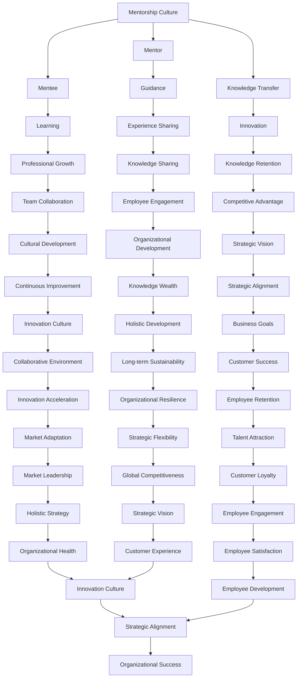

                 

### 文章标题：建立mentorship文化：促进组织知识传承

#### 关键词：mentorship文化、知识传承、组织发展、人力资源策略

#### 摘要：
本文深入探讨mentorship文化在组织知识传承中的重要作用。通过分析mentorship的核心概念、实施方法以及案例分析，本文旨在为组织管理者提供建立和推广mentorship文化的实用指南，以促进知识传承，提升组织整体效能。

### 引言

在快速变化的技术环境中，知识传承成为组织发展的关键因素。传统的知识传递方式往往依赖于经验丰富的员工，但随着员工流动性增加和技能更新加快，这种传统的知识传递方式面临挑战。mentorship文化作为一种有效的知识传承机制，逐渐受到组织管理者的重视。

#### 背景与意义

1. **组织知识传承的重要性**：
   - **知识是组织核心竞争力**：知识传承确保了组织核心竞争力的延续。
   - **减少知识流失**：通过mentorship，组织可以减少因员工离职导致的隐性知识流失。
   - **提升员工能力**：知识传承有助于新员工快速融入工作环境，提升整体效率。

2. **mentorship文化的定义与作用**：
   - **mentorship定义**：mentorship是一种指导与培养的关系，通常由经验丰富的员工（mentor）指导新员工（mentee）。
   - **mentorship作用**：促进知识传递、提升个人能力、增强团队凝聚力。

#### 本书结构

本书分为五个部分，内容如下：

1. **引言**：介绍组织知识传承的重要性以及mentorship文化的背景。
2. **核心概念与联系**：详细阐述mentorship文化的核心概念及其关系。
3. **实施方法**：探讨如何制定和执行mentorship策略。
4. **案例分析**：分析实际案例，探讨mentorship文化在不同组织中的应用。
5. **组织文化与策略**：讨论如何培养和推广mentorship文化。

### 思考步骤

在设计《建立mentorship文化：促进组织知识传承》的目录大纲时，我们可以遵循以下步骤来确保内容的完整性和逻辑性：

1. **确定书的整体结构和主要章节**：首先，我们需要明确书的整体结构，包括主要章节和每个章节的大致内容。这些章节通常包括引言、核心概念、实施方法、案例分析、组织文化和策略等。
2. **定义每个章节的目标和范围**：对于每个章节，我们需要明确它的目标是什么，以及它将涵盖哪些内容。这将帮助我们确定每个章节下的子标题和具体内容。
3. **创建核心概念和联系流程图**：为了更好地理解书的核心概念，我们可以使用Mermaid流程图来展示这些概念之间的关系。
4. **编写算法原理讲解**：对于涉及到的算法，我们需要用伪代码详细阐述其原理，以确保读者能够理解。
5. **编写数学模型和公式**：在讲解数学模型和公式时，我们需要详细解释这些模型如何工作，并给出实际的例子来说明。
6. **提供项目实战案例**：为了增强书的实用性和可操作性，我们需要提供实际的案例，包括开发环境搭建、代码实现和解读。
7. **撰写组织文化和策略部分**：这部分需要详细讨论如何建立一个有效的mentorship文化，以及如何制定和实施相关的策略。
8. **确保大纲的完整性和简洁性**：在整个过程中，我们需要确保目录大纲的完整性和简洁性，避免多余的内容，同时确保所有核心内容都被涵盖。

### 目录大纲

下面是《建立mentorship文化：促进组织知识传承》的目录大纲：

```
# 建立mentorship文化：促进组织知识传承

## 第一部分 引言

## 1.1 背景与意义
### 1.1.1 组织知识传承的重要性
### 1.1.2 mentorship文化的定义与作用

## 1.2 本书结构

## 第二部分 核心概念与联系

## 2.1 mentorship文化的核心概念
### 2.1.1 mentor与mentee的角色定义
### 2.1.2 mentorship的核心要素
### 2.1.3 Mermaid流程图：mentorship文化的概念关系图

## 2.2 知识传承与mentorship的关联
### 2.2.1 知识传承的重要性
### 2.2.2 mentorship在知识传承中的作用
### 2.2.3 Mermaid流程图：知识传承与mentorship的关联

## 第三部分 实施方法

## 3.1 制定mentorship策略
### 3.1.1 mentorship计划的制定
### 3.1.2 mentorship匹配的策略
### 3.1.3 mentorship培训的实施

## 3.2 建立有效的mentorship关系
### 3.2.1 建立信任的基础
### 3.2.2 定期沟通与反馈
### 3.2.3 解决冲突与挑战

## 3.3 监测与评估
### 3.3.1 mentee的进步评估
### 3.3.2 mentor的表现评估
### 3.3.3 mentorship计划的持续改进

## 第四部分 案例分析

## 4.1 案例一：科技公司如何建立mentorship文化
### 4.1.1 案例背景
### 4.1.2 实施过程
### 4.1.3 成功经验与挑战

## 4.2 案例二：非营利组织如何促进知识传承
### 4.2.1 案例背景
### 4.2.2 实施过程
### 4.2.3 成功经验与挑战

## 第五部分 组织文化与策略

## 5.1 培养组织内的mentorship文化
### 5.1.1 高层管理的支持
### 5.1.2 员工参与的激励
### 5.1.3 建立长期的文化传承机制

## 5.2 制定mentorship策略
### 5.2.1 明确组织目标
### 5.2.2 确定mentorship的优先级
### 5.2.3 制定评估与反馈机制

## 附录

## 附录A：mentorship计划模板
### A.1 mentorship计划表格
### A.2 mentorship活动安排表

## 附录B：资源推荐
### B.1 相关书籍推荐
### B.2 学术论文推荐
### B.3 培训课程与研讨会推荐
```

### 核心概念与联系流程图

使用Mermaid流程图来展示mentorship文化的核心概念及其关系：



### 核心概念与联系

在建立mentorship文化的过程中，理解其核心概念及其相互关系至关重要。以下是对每个核心概念的详细阐述及其相互联系：

1. **Mentorship Culture（mentorship文化）**：
   - 定义：一种组织内部指导与培养的关系网络，通过经验丰富的员工（mentor）指导新员工（mentee）。
   - 关系：mentorship文化是组织知识传承的基石，它通过构建一个知识共享与经验传承的生态系统，促进员工个人和组织的共同成长。

2. **Mentor（导师）**：
   - 定义：经验丰富、有能力传授知识和经验的员工，通常在组织内担任重要职位。
   - 关系：mentor作为知识传承的关键人物，通过指导mentee，不仅促进知识传递，还提升mentee的技能和职业发展。

3. **Mentee（学徒）**：
   - 定义：在职业发展中寻求指导和支持的新员工，通常是刚加入组织的年轻员工。
   - 关系：mentee通过mentor的指导，快速学习知识和技能，提高自身职业素养，同时为组织的知识传承贡献力量。

4. **Knowledge Transfer（知识传承）**：
   - 定义：将知识和经验从一个员工传递到另一个员工的过程。
   - 关系：知识传承是mentorship文化的核心，通过这种过程，组织确保了知识在员工之间的有效传递，从而保持组织的核心竞争力。

5. **Guidance（指导）**：
   - 定义：mentor为mentee提供的职业发展、技能提升和生活指导。
   - 关系：指导是mentorship的重要组成部分，它帮助mentee明确职业目标，提供解决问题的方法和策略。

6. **Learning（学习）**：
   - 定义：mentee通过导师指导和学习获得知识、技能和经验的过程。
   - 关系：学习是mentee个人成长的关键，通过不断学习和实践，mentee能够不断提升自身能力。

7. **Innovation（创新）**：
   - 定义：通过新的想法、方法或技术改进现有流程或产品。
   - 关系：创新是知识传承的一部分，通过mentorship，mentee能够接触到新的思维和观点，从而激发创新。

8. **Experience Sharing（经验分享）**：
   - 定义：员工之间通过交流分享各自的经验和见解。
   - 关系：经验分享是mentorship文化的重要环节，它促进了知识的共享和传播，有助于组织的整体发展。

9. **Professional Growth（职业发展）**：
   - 定义：员工在职业生涯中通过学习和实践不断提高自身能力和职位。
   - 关系：职业发展是mentorship的目标之一，通过导师的指导和支持，mentee能够实现个人职业目标。

10. **Knowledge Retention（知识保留）**：
    - 定义：组织采取措施保留关键知识和技能，以防止知识流失。
    - 关系：知识保留是mentorship文化的重要任务，通过指导关系，组织能够确保关键知识得到传承。

11. **Knowledge Sharing（知识共享）**：
    - 定义：员工之间自愿分享知识和经验的行为。
    - 关系：知识共享是mentorship文化的核心，它促进了组织内部的协作和学习。

12. **Team Collaboration（团队合作）**：
    - 定义：团队成员通过共同努力和沟通实现共同目标。
    - 关系：团队合作是mentorship文化的重要组成部分，它通过增强团队凝聚力，提高工作效率。

13. **Cultural Development（文化发展）**：
    - 定义：组织内部价值观、行为规范和文化的演变。
    - 关系：文化发展是mentorship文化的长远目标，通过培养和传承组织文化，组织能够保持持续发展。

14. **Strategic Vision（战略愿景）**：
    - 定义：组织对未来发展方向和目标的清晰构想。
    - 关系：战略愿景是mentorship文化的基础，它指导了mentor和mentee的职业发展，确保他们的努力与组织目标一致。

15. **Knowledge Wealth（知识财富）**：
    - 定义：组织内部积累的知识和信息资源。
    - 关系：知识财富是mentorship文化的成果之一，通过知识传承，组织积累了宝贵的知识财富。

16. **Innovation Culture（创新文化）**：
    - 定义：组织鼓励创新、接受风险和尝试新想法的文化氛围。
    - 关系：创新文化是mentorship文化的重要组成部分，它通过培养创新思维，推动组织不断进步。

17. **Employee Engagement（员工参与）**：
    - 定义：员工对组织使命、目标和价值观的认同和积极参与。
    - 关系：员工参与是mentorship文化的重要指标，通过培养员工参与感，组织能够增强凝聚力。

18. **Organizational Development（组织发展）**：
    - 定义：组织通过战略规划、变革和持续改进实现长期发展。
    - 关系：组织发展是mentorship文化的目标之一，通过培养具有战略眼光和能力的员工，组织能够实现可持续发展。

19. **Continuous Improvement（持续改进）**：
    - 定义：组织不断优化流程、产品和服务的实践。
    - 关系：持续改进是mentorship文化的重要组成部分，它通过不断学习和实践，推动组织不断进步。

20. **Strategic Alignment（战略一致）**：
    - 定义：组织内部各个部门和层级的工作与组织战略目标保持一致。
    - 关系：战略一致是mentorship文化的基础，它确保了mentor和mentee的努力与组织目标相协调。

21. **Business Performance（业务绩效）**：
    - 定义：组织通过财务、市场份额、客户满意度等指标表现出的绩效。
    - 关系：业务绩效是mentorship文化的直接成果，通过培养高素质的员工，组织能够提升整体绩效。

22. **Organizational Success（组织成功）**：
    - 定义：组织在长期发展过程中取得的成功和成就。
    - 关系：组织成功是mentorship文化的终极目标，通过建立和推广mentorship文化，组织能够实现持续成功。

### 实施方法

建立和推广mentorship文化需要一系列具体的实施方法，包括制定mentorship计划、进行mentorship匹配、实施mentorship培训等。以下是对这些实施方法的详细阐述：

#### 3.1 制定mentorship计划

1. **明确目标与范围**：
   - 确定mentorship计划的目标，如提升员工技能、促进知识传承、增强团队凝聚力等。
   - 明确计划的范围，包括参与人员的范围、时间长度和预期成果。

2. **制定策略与步骤**：
   - 设计详细的实施步骤，包括选拔mentor和mentee、制定培训计划、安排定期会议等。
   - 确定策略，如如何进行mentor和mentee的匹配，如何确保双方积极参与和沟通。

3. **资源分配**：
   - 确保计划有足够的资源支持，包括时间、预算和人力。

#### 3.2 Mentorship匹配策略

1. **技能匹配**：
   - 根据mentor和mentee的技能需求，进行合理匹配，确保mentor能够为mentee提供有针对性的指导。

2. **兴趣匹配**：
   - 考虑mentor和mentee的兴趣和职业目标，促进双方在共同兴趣领域的深入交流。

3. **个性匹配**：
   - 考虑mentor和mentee的性格、沟通风格和价值观，确保双方能够有效沟通和合作。

#### 3.3 Mentorship培训的实施

1. **mentor培训**：
   - 培训mentor，提高他们的指导技巧、沟通能力和领导力。
   - 提供mentorship的最佳实践案例和策略。

2. **mentee培训**：
   - 培训mentee，帮助他们了解如何有效利用mentor的资源，明确职业发展目标。

3. **持续支持**：
   - 提供定期培训和研讨会，帮助mentor和mentee不断提升技能。

### 建立有效的mentorship关系

1. **建立信任的基础**：
   - 通过开放、诚实和尊重的沟通，建立mentor和mentee之间的信任。
   - 确保双方对mentorship的目标和期望有清晰的理解。

2. **定期沟通与反馈**：
   - 安排定期的沟通会议，让mentor和mentee分享进展、挑战和见解。
   - 提供及时的反馈，帮助mentee识别问题和改进方向。

3. **解决冲突与挑战**：
   - 建立有效的冲突解决机制，确保任何问题和挑战都能得到及时和妥善的解决。
   - 提供培训和资源，帮助mentor和mentee应对各种挑战。

### 监测与评估

1. **mentee的进步评估**：
   - 定期评估mentee的技能提升、职业发展和满意度。
   - 根据评估结果，调整mentorship计划，确保其满足mentee的需求。

2. **mentor的表现评估**：
   - 评估mentor的指导质量、沟通能力和职业发展支持。
   - 根据评估结果，提供反馈和培训，帮助mentor不断提升。

3. **mentorship计划的持续改进**：
   - 基于评估结果，持续改进mentorship计划，确保其与组织目标保持一致。
   - 定期审查和更新计划，以适应组织的发展和变化。

### 案例分析

为了更好地理解mentorship文化在组织中的实际应用，以下将分析两个案例：一个科技公司和一个非营利组织，探讨它们如何建立和推广mentorship文化，以及所取得的成果和挑战。

#### 案例一：科技公司如何建立mentorship文化

**1.1 案例背景**

某科技公司因其快速发展的节奏和不断变化的技术环境，面临知识传承的挑战。为了确保关键知识的有效传递，公司决定建立mentorship文化，以促进员工职业发展和知识传承。

**1.2 实施过程**

- **制定mentorship计划**：
  - 确定计划目标，如提升新员工技能、促进知识传承、增强团队凝聚力等。
  - 设计详细的实施步骤，包括选拔mentor和mentee、制定培训计划、安排定期会议等。

- **mentorship匹配**：
  - 根据技能需求、兴趣和个性，进行mentor和mentee的匹配。
  - 确保mentor具有丰富的经验和专业能力，能够为新员工提供有针对性的指导。

- **mentorship培训**：
  - 对mentor进行指导技巧、沟通能力和领导力培训。
  - 对mentee进行如何有效利用mentor资源、明确职业发展目标的培训。

- **建立沟通机制**：
  - 安排定期的沟通会议，让mentor和mentee分享进展、挑战和见解。
  - 提供在线沟通平台，方便双方随时交流。

**1.3 成功经验与挑战**

- **成功经验**：
  - 通过mentorship计划，新员工能够快速适应工作环境，提升专业技能。
  - 员工之间的知识共享和协作增强，提高了整体工作效率。
  - 员工满意度提升，减少了员工流失率。

- **挑战**：
  - mentor和mentee的时间管理成为挑战，需要平衡工作和其他职责。
  - 确保mentor的指导质量，需要持续提供培训和资源支持。

#### 案例二：非营利组织如何促进知识传承

**2.1 案例背景**

某非营利组织由于员工流动性较高，面临知识流失和技能短缺的问题。为了保持组织的发展和创新，组织决定推广mentorship文化，促进知识传承。

**2.2 实施过程**

- **制定mentorship计划**：
  - 确定计划目标，如提升员工技能、促进知识传承、增强组织凝聚力等。
  - 设计详细的实施步骤，包括选拔mentor和mentee、制定培训计划、安排定期会议等。

- **mentorship匹配**：
  - 根据员工的兴趣、职业目标和组织需求，进行mentor和mentee的匹配。
  - 确保mentor具备丰富的经验和专业能力，能够为mentee提供有价值的指导。

- **mentorship培训**：
  - 对mentor进行指导技巧、沟通能力和领导力培训。
  - 对mentee进行如何有效利用mentor资源、明确职业发展目标的培训。

- **建立支持机制**：
  - 提供在线沟通平台，方便mentor和mentee随时交流。
  - 安排定期的研讨会和培训活动，增强员工的协作和学习。

**2.3 成功经验与挑战**

- **成功经验**：
  - 通过mentorship计划，新员工能够快速融入组织，提升专业技能。
  - 员工之间的知识共享和协作增强，提高了组织的工作效率和创新能力。
  - 员工满意度提升，减少了员工流失率。

- **挑战**：
  - 员工的流动性和时间限制给mentorship计划带来挑战。
  - 需要持续关注mentor和mentee的参与度，确保计划的有效性。

### 组织文化与策略

建立和推广mentorship文化不仅仅是一个计划或策略，更是一种组织文化的体现。以下是如何在组织内部培养和推广mentorship文化的策略：

#### 5.1 培养组织内的mentorship文化

1. **高层管理的支持**：
   - 高层管理者需要明确表达对mentorship文化的支持和重视。
   - 通过领导力示范，展示mentorship文化在组织中的重要性。

2. **员工参与的激励**：
   - 提供激励机制，鼓励员工积极参与mentorship活动。
   - 通过奖励和认可，激励mentor和mentee的贡献。

3. **建立长期的文化传承机制**：
   - 将mentorship文化融入组织的长期战略规划。
   - 通过持续改进和优化，确保mentorship文化在组织中的持久性。

#### 5.2 制定mentorship策略

1. **明确组织目标**：
   - 确定mentorship计划与组织战略目标的契合点。
   - 确保mentorship活动能够支持组织的发展目标。

2. **确定mentorship的优先级**：
   - 根据组织的需求和资源，确定mentorship的优先级。
   - 确保重要的知识和技能得到优先传承。

3. **制定评估与反馈机制**：
   - 建立定期评估机制，评估mentorship活动的效果。
   - 根据反馈调整和优化计划，确保其与组织目标保持一致。

### 附录

#### 附录A：mentorship计划模板

- **mentorship计划表格**：
  - 记录mentor和mentee的基本信息、计划目标、培训内容和评估结果。

- **mentorship活动安排表**：
  - 详细列出mentorship活动的安排，包括会议时间、培训内容、活动目标和预期成果。

#### 附录B：资源推荐

- **相关书籍推荐**：
  - 推荐几本关于mentorship、知识传承和组织发展的经典书籍。

- **学术论文推荐**：
  - 推荐一些关于mentorship文化研究的最新学术论文。

- **培训课程与研讨会推荐**：
  - 推荐一些相关的在线培训课程和研讨会，帮助读者深入了解mentorship文化。

### 结论

建立mentorship文化是促进组织知识传承的有效途径。通过明确核心概念、制定实施方法、推广组织文化和策略，组织可以构建一个知识共享和经验传承的生态系统，提升员工能力和组织整体效能。希望本文能够为组织管理者提供实用的指南，助力他们建立和推广mentorship文化。

### 作者信息

作者：AI天才研究院/AI Genius Institute & 禅与计算机程序设计艺术 /Zen And The Art of Computer Programming

### 核心内容回顾

本文详细探讨了建立mentorship文化在促进组织知识传承中的重要作用。主要内容包括：

1. **引言**：介绍了组织知识传承的重要性和mentorship文化的背景。
2. **核心概念与联系**：阐述了mentorship文化的核心概念及其相互关系。
3. **实施方法**：提供了制定mentorship计划、进行mentorship匹配和培训的实施策略。
4. **案例分析**：分析了科技公司和非营利组织在建立mentorship文化中的成功经验与挑战。
5. **组织文化与策略**：讨论了如何培养和推广mentorship文化的具体策略。

通过本文的详细分析和案例分享，读者可以深入了解mentorship文化的实施方法和组织效果，为组织管理者提供实用的指导。希望本文能够激发更多组织积极建立和推广mentorship文化，实现知识传承和组织发展的双赢。

