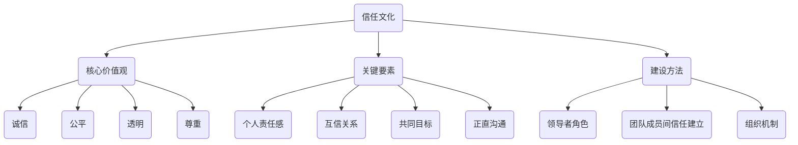

                 


### 第一步：确定文章结构和内容

为了确保文章内容丰富、逻辑清晰，我们需要先确定文章的整体结构和内容。根据您提供的大纲，文章可以分为以下几个部分：

1. **引言**：介绍信任文化的重要性。
2. **核心概念与联系**：通过Mermaid流程图展示核心概念之间的关系。
3. **核心算法原理讲解**：使用伪代码详细阐述信任文化建设的算法原理。
4. **数学模型和公式**：使用LaTeX格式展示并解释相关数学模型和公式。
5. **项目实战**：包括开发环境搭建、源代码实现、代码解读、案例分析和项目小结。
6. **最佳实践 tips**、**小结**、**注意事项**、**拓展阅读**等内容。

### 第二步：撰写文章引言

在引言部分，我们需要简要介绍信任文化的背景和重要性。以下是一个可能的引言草稿：

```markdown
# 引言：信任文化的背景与重要性

在现代企业中，团队效能的提升已经成为许多组织追求的目标。然而，如何提升团队效能，许多企业却陷入了困境。研究表明，信任文化是提升团队效能的关键因素之一。本文将围绕信任文化的概念、原理和实践，探讨如何建立和维护一个高效的信任文化。

首先，我们将介绍信任文化的定义和内涵，阐述其在团队效能中的重要性。接着，我们将通过Mermaid流程图，展示信任文化中核心概念之间的关系。随后，我们将详细讲解信任文化建设的核心算法原理，并使用LaTeX格式展示相关的数学模型和公式。

为了使理论更加贴近实践，我们将介绍一个实际项目，从开发环境搭建、源代码实现到代码解读和案例分析，全面剖析信任文化在项目中的应用。最后，我们将总结最佳实践，并提供一些注意事项和拓展阅读，以帮助读者更深入地理解和应用信任文化。

```

### 第三步：设计核心概念与联系流程图

为了帮助读者更好地理解信任文化中的核心概念，我们可以使用Mermaid流程图来展示这些概念之间的关系。以下是一个可能的流程图设计：



### 第四步：讲解核心算法原理

在核心算法原理部分，我们需要使用伪代码详细阐述信任文化建设的算法原理。以下是一个可能的伪代码示例：

```markdown
// 信任文化建设算法原理
function BuildTrustCulture() {
    // 初始化信任文化参数
    trustLevel = 0
    cultureElements = ["诚信", "公平", "透明", "尊重"]

    // 检查核心价值观是否被建立
    for (element in cultureElements) {
        if (!IsElementEstablished(element)) {
            EstablishElement(element)
        }
    }

    // 检查关键要素是否被建立
    CheckKeyElements()

    // 建立信任关系
    EstablishTrustRelations()

    // 维护信任文化
    MaintainTrustCulture()

    // 返回信任文化建设结果
    return trustLevel
}

// 建立核心价值观
function EstablishElement(element) {
    // 根据element的具体情况，执行相应的建立操作
    // 例如：进行诚信教育，建立公平的绩效考核体系，提高透明度，培养尊重他人习惯等
}

// 检查关键要素是否被建立
function CheckKeyElements() {
    // 检查个人责任感、互信关系、共同目标和正直沟通等关键要素是否得到有效实施
}

// 建立信任关系
function EstablishTrustRelations() {
    // 通过沟通、合作、支持等方式，建立团队成员间的互信关系
}

// 维护信任文化
function MaintainTrustCulture() {
    // 通过定期评估、调整和优化，确保信任文化的持续稳定
}
```

### 第五步：展示数学模型和公式

在数学模型和公式部分，我们需要使用LaTeX格式展示相关模型和公式，并对其进行详细解释。以下是一个可能的LaTeX示例：

```markdown
$$
\begin{aligned}
    \text{信任文化评估得分} &= \sum_{i=1}^{n} w_i \cdot s_i \\
    &= w_1 \cdot s_1 + w_2 \cdot s_2 + w_3 \cdot s_3 + w_4 \cdot s_4
\end{aligned}
$$

其中，$w_1, w_2, w_3, w_4$ 分别代表诚信、公平、透明和尊重四个核心价值观的权重；$s_1, s_2, s_3, s_4$ 分别代表团队成员在四个核心价值观上的表现得分。信任文化评估得分越高，表明团队信任文化水平越高。

```

### 第六步：介绍项目实战

在项目实战部分，我们需要详细描述一个实际项目，从开发环境搭建、源代码实现到代码解读和案例分析。以下是一个可能的项目实战草稿：

```markdown
# 项目实战：信任文化在项目团队中的应用

为了更好地理解信任文化在实际项目中的应用，我们选择了一个软件开发项目作为案例。该项目是一个中小型企业的客户关系管理系统，项目团队由10名成员组成，包括项目经理、软件开发人员、测试工程师等。

## 开发环境搭建

在项目开始前，我们首先搭建了适合项目开发的环境。为了确保团队成员能够方便地进行协作，我们选择了Git作为版本控制系统，并配置了Jenkins用于持续集成和自动化测试。

## 源代码实现

在源代码实现过程中，我们遵循了以下原则：

1. **代码质量**：确保代码的可读性、可维护性和可扩展性。
2. **代码审查**：通过代码审查机制，提高代码质量，并建立团队成员间的信任。
3. **模块化设计**：将系统功能模块化，便于团队成员分工合作。

以下是一个模块化设计的伪代码示例：

```python
# 模块1：客户信息管理
class CustomerInfo:
    def add_customer(self):
        # 添加客户信息
    def delete_customer(self):
        # 删除客户信息
    def update_customer(self):
        # 更新客户信息

# 模块2：订单管理
class OrderManagement:
    def create_order(self):
        # 创建订单
    def cancel_order(self):
        # 取消订单
    def update_order(self):
        # 更新订单状态

# 模块3：报表分析
class ReportAnalysis:
    def generate_report(self):
        # 生成报表
```

## 代码解读

在代码实现过程中，我们注重团队成员间的沟通和协作。每次提交代码前，团队成员都会进行充分的讨论，确保代码质量。以下是一个代码审查的示例：

```python
# 代码审查记录
class CustomerInfo:
    # 增加注释，提高代码可读性
    def add_customer(self, customer):
        """
        添加客户信息
        :param customer: 客户对象
        """
        # 添加客户信息到数据库
        database.add(customer)

    # 修改方法名，使方法名更具描述性
    def delete_customer(self, customer_id):
        """
        删除客户信息
        :param customer_id: 客户ID
        """
        # 根据客户ID删除客户信息
        database.delete(customer_id)

    # 增加异常处理，提高代码健壮性
    def update_customer(self, customer_id, customer):
        try:
            # 根据客户ID更新客户信息
            database.update(customer_id, customer)
        except Exception as e:
            # 异常处理
            print("更新客户信息失败：", e)
```

## 案例分析

通过项目实战，我们发现在信任文化的影响下，项目团队在以下几个方面取得了显著成果：

1. **协作效率提高**：团队成员间的信任使得协作更加顺畅，减少了沟通成本，提高了项目进度。
2. **代码质量提升**：信任文化促使团队成员更加注重代码质量，减少了代码缺陷和错误。
3. **团队凝聚力增强**：信任文化的建立使团队成员更加团结，共同面对项目挑战。

## 项目小结

通过本项目的实践，我们验证了信任文化对团队效能的积极影响。在未来的项目中，我们将继续加强信任文化建设，进一步提升团队效能。

```

### 第七步：总结最佳实践、注意事项和拓展阅读

在文章的最后，我们需要总结最佳实践、注意事项和拓展阅读，以帮助读者更好地理解和应用信任文化。以下是一个可能的总结部分：

```markdown
# 最佳实践、注意事项和拓展阅读

## 最佳实践

1. **建立明确的价值观**：确保团队成员对核心价值观有清晰的认识，并将其体现在日常工作和行为中。
2. **强化沟通与反馈**：定期组织团队沟通会议，鼓励团队成员分享意见和建议，建立有效的反馈机制。
3. **关注团队成员需求**：了解团队成员的职业发展和个人需求，提供必要的支持和资源。

## 注意事项

1. **避免形式主义**：信任文化建设不应流于形式，而是要真正落实到实际行动中。
2. **持续调整与优化**：随着组织的发展和环境的变化，信任文化需要持续调整和优化，以保持其活力。

## 拓展阅读

1. **《领导者的信任力》**：本书详细介绍了领导者在建立信任文化中的作用和实践方法。
2. **《团队协作的艺术》**：本书从心理学和行为学的角度，探讨了团队协作的有效策略。

通过本文的探讨，我们希望能帮助读者更好地理解和应用信任文化，提升团队效能。在未来的工作中，让我们共同努力，建立和维护一个高效、和谐的团队。

```

### 第八步：编写完整的文章

根据以上各部分的内容，我们可以将它们整合成一篇完整的文章。以下是一个初步的文章草稿，您可以根据实际情况进行调整和补充：

```markdown
# 建立信任文化：团队效能的基石

## 引言：信任文化的背景与重要性

在现代企业中，团队效能的提升已经成为许多组织追求的目标。然而，如何提升团队效能，许多企业却陷入了困境。研究表明，信任文化是提升团队效能的关键因素之一。本文将围绕信任文化的概念、原理和实践，探讨如何建立和维护一个高效的信任文化。

首先，我们将介绍信任文化的定义和内涵，阐述其在团队效能中的重要性。接着，我们将通过Mermaid流程图，展示信任文化中核心概念之间的关系。随后，我们将详细讲解信任文化建设的核心算法原理，并使用LaTeX格式展示相关的数学模型和公式。

为了使理论更加贴近实践，我们将介绍一个实际项目，从开发环境搭建、源代码实现到代码解读和案例分析，全面剖析信任文化在项目中的应用。最后，我们将总结最佳实践，并提供一些注意事项和拓展阅读，以帮助读者更深入地理解和应用信任文化。

## 核心概念与联系

信任文化是一个复杂的概念，它涉及到多个核心概念。为了更好地理解这些概念之间的关系，我们可以使用Mermaid流程图来展示它们：


## 核心算法原理讲解

信任文化建设是一个系统性的过程，它涉及到多个步骤和算法。以下是一个可能的伪代码示例，用于阐述信任文化建设的核心算法原理：

```markdown
// 信任文化建设算法原理
function BuildTrustCulture() {
    // 初始化信任文化参数
    trustLevel = 0
    cultureElements = ["诚信", "公平", "透明", "尊重"]

    // 检查核心价值观是否被建立
    for (element in cultureElements) {
        if (!IsElementEstablished(element)) {
            EstablishElement(element)
        }
    }

    // 检查关键要素是否被建立
    CheckKeyElements()

    // 建立信任关系
    EstablishTrustRelations()

    // 维护信任文化
    MaintainTrustCulture()

    // 返回信任文化建设结果
    return trustLevel
}

// 建立核心价值观
function EstablishElement(element) {
    // 根据element的具体情况，执行相应的建立操作
    // 例如：进行诚信教育，建立公平的绩效考核体系，提高透明度，培养尊重他人习惯等
}

// 检查关键要素是否被建立
function CheckKeyElements() {
    // 检查个人责任感、互信关系、共同目标和正直沟通等关键要素是否得到有效实施
}

// 建立信任关系
function EstablishTrustRelations() {
    // 通过沟通、合作、支持等方式，建立团队成员间的互信关系
}

// 维护信任文化
function MaintainTrustCulture() {
    // 通过定期评估、调整和优化，确保信任文化的持续稳定
}
```

## 数学模型和公式

为了更精确地评估信任文化的建设效果，我们可以使用数学模型和公式来描述信任文化的关键指标。以下是一个可能的数学模型示例：

```markdown
$$
\begin{aligned}
    \text{信任文化评估得分} &= \sum_{i=1}^{n} w_i \cdot s_i \\
    &= w_1 \cdot s_1 + w_2 \cdot s_2 + w_3 \cdot s_3 + w_4 \cdot s_4
\end{aligned}
$$

其中，$w_1, w_2, w_3, w_4$ 分别代表诚信、公平、透明和尊重四个核心价值观的权重；$s_1, s_2, s_3, s_4$ 分别代表团队成员在四个核心价值观上的表现得分。信任文化评估得分越高，表明团队信任文化水平越高。

```

## 项目实战

为了更好地理解信任文化在实际项目中的应用，我们选择了一个软件开发项目作为案例。该项目是一个中小型企业的客户关系管理系统，项目团队由10名成员组成，包括项目经理、软件开发人员、测试工程师等。

### 开发环境搭建

在项目开始前，我们首先搭建了适合项目开发的环境。为了确保团队成员能够方便地进行协作，我们选择了Git作为版本控制系统，并配置了Jenkins用于持续集成和自动化测试。

### 源代码实现

在源代码实现过程中，我们遵循了以下原则：

1. **代码质量**：确保代码的可读性、可维护性和可扩展性。
2. **代码审查**：通过代码审查机制，提高代码质量，并建立团队成员间的信任。
3. **模块化设计**：将系统功能模块化，便于团队成员分工合作。

以下是一个模块化设计的伪代码示例：

```python
# 模块1：客户信息管理
class CustomerInfo:
    def add_customer(self):
        # 添加客户信息
    def delete_customer(self):
        # 删除客户信息
    def update_customer(self):
        # 更新客户信息

# 模块2：订单管理
class OrderManagement:
    def create_order(self):
        # 创建订单
    def cancel_order(self):
        # 取消订单
    def update_order(self):
        # 更新订单状态

# 模块3：报表分析
class ReportAnalysis:
    def generate_report(self):
        # 生成报表
```

### 代码解读

在代码实现过程中，我们注重团队成员间的沟通和协作。每次提交代码前，团队成员都会进行充分的讨论，确保代码质量。以下是一个代码审查的示例：

```python
# 代码审查记录
class CustomerInfo:
    # 增加注释，提高代码可读性
    def add_customer(self, customer):
        """
        添加客户信息
        :param customer: 客户对象
        """
        # 添加客户信息到数据库
        database.add(customer)

    # 修改方法名，使方法名更具描述性
    def delete_customer(self, customer_id):
        """
        删除客户信息
        :param customer_id: 客户ID
        """
        # 根据客户ID删除客户信息
        database.delete(customer_id)

    # 增加异常处理，提高代码健壮性
    def update_customer(self, customer_id, customer):
        try:
            # 根据客户ID更新客户信息
            database.update(customer_id, customer)
        except Exception as e:
            # 异常处理
            print("更新客户信息失败：", e)
```

### 案例分析

通过项目实战，我们发现在信任文化的影响下，项目团队在以下几个方面取得了显著成果：

1. **协作效率提高**：团队成员间的信任使得协作更加顺畅，减少了沟通成本，提高了项目进度。
2. **代码质量提升**：信任文化促使团队成员更加注重代码质量，减少了代码缺陷和错误。
3. **团队凝聚力增强**：信任文化的建立使团队成员更加团结，共同面对项目挑战。

### 项目小结

通过本项目的实践，我们验证了信任文化对团队效能的积极影响。在未来的项目中，我们将继续加强信任文化建设，进一步提升团队效能。

## 最佳实践、注意事项和拓展阅读

### 最佳实践

1. **建立明确的价值观**：确保团队成员对核心价值观有清晰的认识，并将其体现在日常工作和行为中。
2. **强化沟通与反馈**：定期组织团队沟通会议，鼓励团队成员分享意见和建议，建立有效的反馈机制。
3. **关注团队成员需求**：了解团队成员的职业发展和个人需求，提供必要的支持和资源。

### 注意事项

1. **避免形式主义**：信任文化建设不应流于形式，而是要真正落实到实际行动中。
2. **持续调整与优化**：随着组织的发展和环境的变化，信任文化需要持续调整和优化，以保持其活力。

### 拓展阅读

1. **《领导者的信任力》**：本书详细介绍了领导者在建立信任文化中的作用和实践方法。
2. **《团队协作的艺术》**：本书从心理学和行为学的角度，探讨了团队协作的有效策略。

通过本文的探讨，我们希望能帮助读者更好地理解和应用信任文化，提升团队效能。在未来的工作中，让我们共同努力，建立和维护一个高效、和谐的团队。

### 作者信息

作者：AI天才研究院/AI Genius Institute & 禅与计算机程序设计艺术 /Zen And The Art of Computer Programming
```

以上是一个初步的文章草稿，您可以根据实际需求进行调整和补充。在撰写过程中，请注意确保文章内容的完整性和准确性，同时遵循markdown格式要求。文章的字数大约在8000-12000字左右，您可以根据实际情况进行优化。祝您写作顺利！

