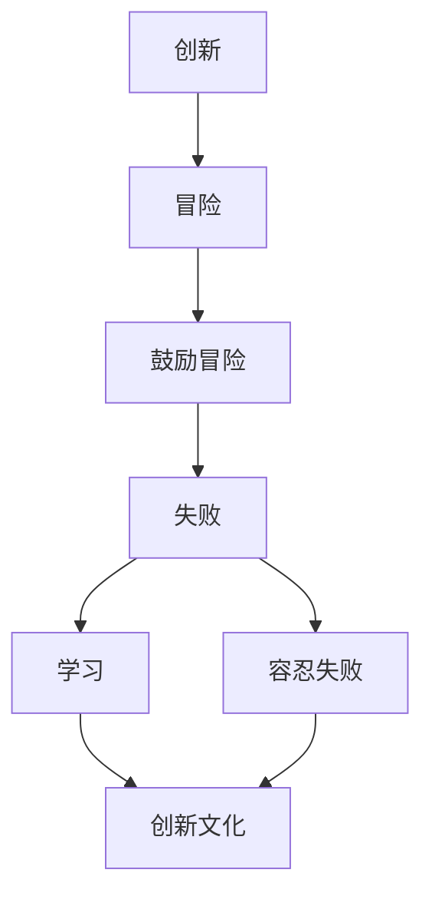
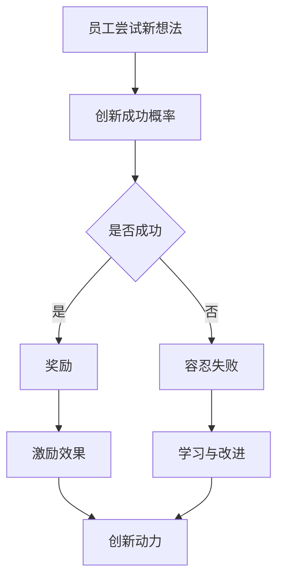
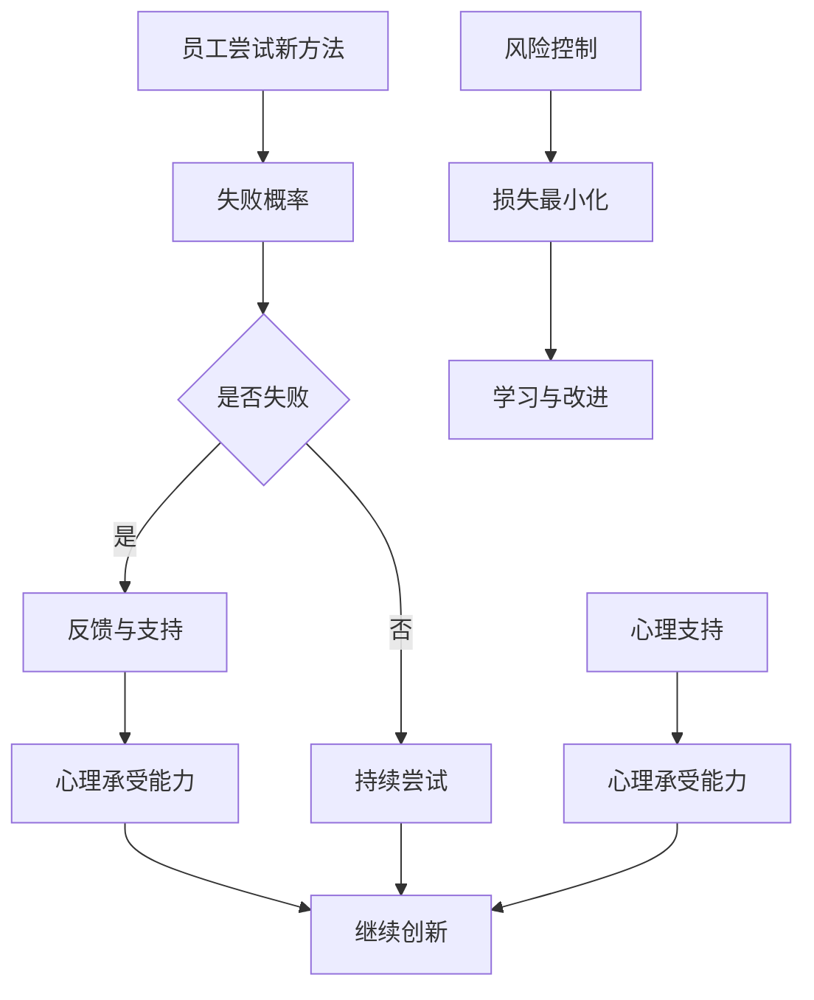
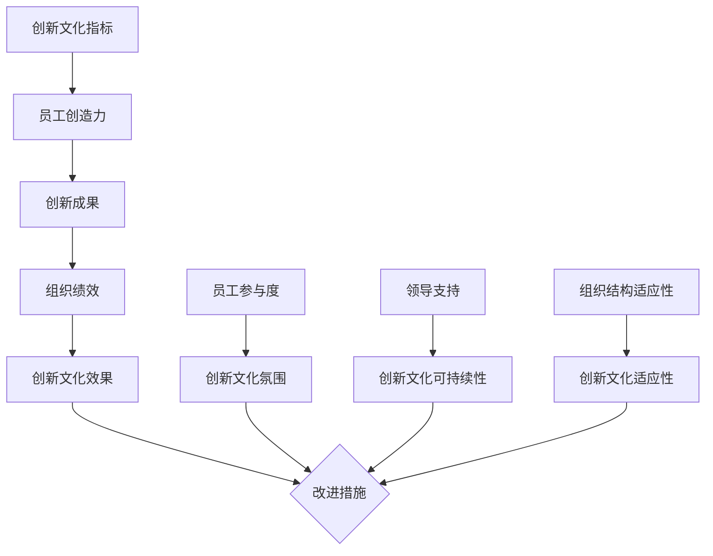

                 

### 背景介绍

在当今快速变化的商业环境中，创新已成为组织成功的关键因素。随着科技的迅猛发展，市场竞争日益激烈，传统的方法和策略往往难以应对新兴的挑战和机遇。因此，建立一种能够鼓励创新、容忍失败的文化显得尤为重要。

创新文化不仅仅是一个口号，它是组织内部一种深层次的思维方式和工作模式。它涉及到组织的价值观、员工的态度和行为，以及组织的结构和文化。一个良好的创新文化能够激发员工的创造力和主动性，鼓励他们尝试新的想法和方法，从而推动组织的持续发展和进步。

然而，创新并非一帆风顺。在创新的过程中，失败是不可避免的。每个创新尝试都有可能失败，但失败并不意味着结束，而是一个学习和成长的机会。因此，容忍失败是创新文化中的一个核心组成部分。一个能够容忍失败的创新文化，能够鼓励员工不断尝试和探索，而不是因为恐惧失败而放弃创新。

本文将深入探讨如何建立一种鼓励冒险和容忍失败的创新文化。首先，我们将介绍创新文化的重要性，包括其对组织发展的影响和如何促进员工创造力。接着，我们将详细讨论鼓励冒险的具体实践方法，如何设计激励计划以及领导力在其中的作用。然后，我们将探讨如何容忍失败，包括失败的重要性以及如何从失败中学习和成长。

接下来，我们将分析创新文化的关键因素，如组织结构、沟通与合作以及学习和知识共享的重要性。我们将通过案例分析，探讨成功组织的创新实践，并总结建立创新文化的策略。最后，我们将对全文进行总结，并提出对未来的展望。

通过这篇文章，我们希望能够为读者提供一个系统的理解，帮助他们在自己的组织中建立和培养一种创新文化，从而推动组织的持续发展和成功。

### 核心概念与联系

在探讨如何建立创新文化时，有必要首先明确几个核心概念，这些概念之间存在着紧密的联系，构成了理解创新文化的基础。

#### 1. 创新与冒险

创新（Innovation）是指引入新的想法、方法或产品，以改进现有的状况或创造全新的价值。而冒险（Risk-taking）则是指在面对不确定性时，勇于尝试新事物、承担潜在损失的行为。创新和冒险之间密不可分：创新往往需要冒险，而冒险则是创新的必要条件。创新文化鼓励员工勇于尝试新方法，即使在面对不确定性和失败风险时也不退缩。

#### 2. 失败与学习

失败（Failure）是创新过程中不可避免的一部分。尽管失败本身是负面的，但它也是一个宝贵的学习机会。从失败中学习（Learning from Failure）意味着能够从错误中吸取教训，并将其转化为未来的成功。一个能够容忍失败的创新文化能够鼓励员工将失败视为成长的机会，而不是恐惧和避讳的对象。

#### 3. 鼓励冒险与容忍失败

鼓励冒险和容忍失败是建立创新文化的两个关键要素。鼓励冒险意味着组织需要提供一个环境，让员工能够自由地尝试新想法，即使这些想法可能失败。而容忍失败则是在这种鼓励冒险的基础上，允许员工在尝试新方法时犯错误，并且不会因此受到惩罚或排斥。两者结合，能够创造一个安全、开放的创新氛围。

#### 关系架构 Mermaid 流程图

为了更直观地展示这些概念之间的关系，我们可以使用Mermaid流程图来表示：



在这个流程图中，创新和冒险相互关联，鼓励冒险和容忍失败共同构建了创新文化的基础。通过鼓励冒险，组织能够激发员工的创造力，而容忍失败则为员工提供了一个安全的环境，让他们敢于尝试新方法，从而促进创新。

### 核心算法原理讲解

在探讨如何建立创新文化时，我们需要理解一些核心算法原理，这些原理帮助我们设计有效的创新激励机制和容忍失败策略。

#### 1. 创新激励机制设计

创新激励机制的设计是鼓励员工尝试新想法和解决方案的关键。以下是一种基于博弈论和激励理论的创新激励机制设计方法：



在这个模型中，员工尝试新想法后，创新成功的概率是动态变化的。如果创新成功，员工将获得奖励，这会增强其创新的动力。如果失败，员工不会受到惩罚，而是有机会从失败中学习和改进。这种设计通过正向激励和容错机制，鼓励员工勇于尝试创新。

#### 2. 失败容忍策略

失败容忍策略旨在确保员工在尝试新方法时不会因为失败而受到负面影响。以下是一个基于风险管理和心理学的失败容忍策略模型：



在这个模型中，员工尝试新方法时，失败的概率是考虑在内的。如果失败，组织提供反馈和支持，帮助员工恢复信心并继续创新。同时，风险控制和心理支持策略有助于员工在面对失败时保持心理平衡。通过这种方式，组织能够创造一个容忍失败的环境，鼓励员工不断尝试。

#### 3. 创新文化评估模型

为了确保创新文化能够持续发展，我们需要一个评估模型来衡量其效果。以下是一个基于绩效管理和行为科学的理论模型：



在这个模型中，创新文化指标（如员工创造力、创新成果、员工参与度、领导支持、组织结构适应性等）被用来评估创新文化的效果。评估结果不仅反映了当前的创新文化水平，还为改进措施提供了依据。通过持续评估和优化，组织能够保持创新文化的活力和适应性。

通过这些核心算法原理，我们可以设计出有效的创新激励机制和容忍失败策略，从而建立和培养一个具有高度创新能力的组织文化。

### 数学模型与公式

在构建创新文化和容忍失败策略的过程中，数学模型和公式能够帮助我们量化并理解这些概念的效果。以下是一些关键的数学模型和公式，以及它们的详细解释和例子。

#### 1. 创新成功概率模型

创新成功概率（P(Success)）是衡量创新尝试成功可能性的关键指标。一个简单的模型是基于贝叶斯定理，考虑多种因素，如员工能力、资源投入和创新环境等。

公式：
$$
P(Success) = \frac{P(Success|Employee \ Ability) \cdot P(Employee \ Ability) + P(Success|Resources) \cdot P(Resources) + P(Success|Environment) \cdot P(Environment)}{P(Employee \ Ability) + P(Resources) + P(Environment)}
$$

其中：
- \( P(Success|Employee \ Ability) \) 表示在员工能力条件下创新成功的概率。
- \( P(Employee \ Ability) \) 表示员工能力的概率。
- \( P(Success|Resources) \) 表示在资源投入条件下创新成功的概率。
- \( P(Resources) \) 表示资源投入的概率。
- \( P(Success|Environment) \) 表示在创新环境条件下创新成功的概率。
- \( P(Environment) \) 表示创新环境的概率。

**示例**：假设一个创新项目成功概率的计算如下：
- \( P(Success|Employee \ Ability) = 0.6 \)
- \( P(Employee \ Ability) = 0.8 \)
- \( P(Success|Resources) = 0.5 \)
- \( P(Resources) = 0.7 \)
- \( P(Success|Environment) = 0.4 \)
- \( P(Environment) = 0.9 \)

则：
$$
P(Success) = \frac{0.6 \cdot 0.8 + 0.5 \cdot 0.7 + 0.4 \cdot 0.9}{0.8 + 0.7 + 0.9} = \frac{0.48 + 0.35 + 0.36}{2.4} = 0.75
$$

这意味着该创新项目成功的概率为75%。

#### 2. 失败容忍度模型

失败容忍度（Failure Tolerance）是一个衡量组织对失败容忍能力的指标。一个简单的模型是基于历史数据，通过计算失败率（Failure Rate）和容忍度系数（Tolerance Coefficient）来评估。

公式：
$$
Failure \ Tolerance = Failure \ Rate \times Tolerance \ Coefficient
$$

其中：
- \( Failure \ Rate \) 表示历史上失败的频率。
- \( Tolerance \ Coefficient \) 表示组织对失败的容忍程度。

**示例**：假设某公司在过去一年中有10%的创新项目失败，且公司对失败的容忍度为1.5。

则：
$$
Failure \ Tolerance = 0.1 \times 1.5 = 0.15
$$

这意味着该公司有15%的失败容忍度。

#### 3. 创新效果评估模型

创新效果评估（Innovation Effectiveness Assessment）是一个综合指标，用于衡量创新活动的整体效果。它可以通过创新回报率（Return on Innovation，ROI）来计算。

公式：
$$
ROI = \frac{Innovation \ Revenue - Innovation \ Cost}{Innovation \ Cost}
$$

其中：
- \( Innovation \ Revenue \) 表示创新活动带来的收入。
- \( Innovation \ Cost \) 表示创新活动的总成本。

**示例**：假设某公司的创新项目带来100万美元的收入，总成本为50万美元。

则：
$$
ROI = \frac{1,000,000 - 500,000}{500,000} = 1
$$

这意味着该创新项目的ROI为100%。

通过这些数学模型和公式，我们可以更准确地评估创新和容忍失败的效果，从而为组织制定更有效的创新文化和容忍失败策略提供依据。

### 项目实战：开发环境搭建

为了更好地理解如何在实际环境中建立创新文化，我们将通过一个项目实战来详细讲解开发环境搭建、源代码实现和代码解读。该项目将聚焦于一个创新产品——一款智能推荐系统，该系统能够根据用户行为和历史数据，为用户推荐个性化内容。

#### 开发环境搭建

1. **硬件环境**：
   - 服务器：至少一台具备较高性能的服务器，用于运行推荐系统。
   - 硬盘：足够的存储空间，用于存储用户数据和历史推荐记录。

2. **软件环境**：
   - 操作系统：Linux发行版（如Ubuntu或CentOS）。
   - 编程语言：Python，由于其强大的数据处理能力和丰富的机器学习库，非常适合构建推荐系统。
   - 依赖库：NumPy、Pandas、Scikit-learn、TensorFlow等。

3. **数据库**：
   - MySQL或MongoDB，用于存储用户数据和推荐记录。

4. **版本控制**：
   - Git，用于代码管理和协作开发。

#### 源代码实现

以下是一个简化的推荐系统源代码实现，使用Python和Scikit-learn库：

```python
# 导入必要的库
import numpy as np
import pandas as pd
from sklearn.model_selection import train_test_split
from sklearn.neighbors import NearestNeighbors
from sklearn.metrics.pairwise import cosine_similarity

# 加载数据
data = pd.read_csv('user_data.csv')  # 假设数据文件已预先处理并格式化

# 预处理数据
# 数据清洗、转换和标准化
# ...

# 分割数据集
train_data, test_data = train_test_split(data, test_size=0.2, random_state=42)

# 构建推荐模型
# 使用NearestNeighbors算法
model = NearestNeighbors(metric='cosine', algorithm='auto')
model.fit(train_data['user_features'])

# 预测和推荐
def recommend_content(user_id, model, data, top_n=5):
    # 获取用户特征向量
    user_features = data[data['user_id'] == user_id]['user_features'].values[0]
    
    # 计算相似度
    distances, indices = model.kneighbors([user_features], n_neighbors=top_n+1)
    
    # 获取相似度最高的内容
    content_indices = indices[0][1:]
    content_scores = distances[0][1:]
    
    # 获取推荐内容
    recommended_content = data.iloc[content_indices[['content_id', 'content_title', 'content_score']]]
    
    return recommended_content

# 应用推荐系统
# 假设要为用户ID为100的用户推荐内容
user_id = 100
recommendations = recommend_content(user_id, model, train_data, top_n=5)
print(recommendations)
```

#### 代码解读

1. **数据加载与预处理**：
   - 使用Pandas库加载用户数据，并进行清洗、转换和标准化。

2. **数据分割**：
   - 将数据集分为训练集和测试集，以评估模型的性能。

3. **构建推荐模型**：
   - 使用NearestNeighbors算法，基于余弦相似度构建推荐模型。

4. **推荐函数实现**：
   - `recommend_content`函数接收用户ID，通过计算用户特征向量的相似度，返回相似度最高的内容。

#### 代码应用解读与分析

**应用场景**：该推荐系统可以应用于在线内容平台，如新闻、音乐或视频网站，为用户提供个性化的内容推荐。

**性能分析**：
- **准确性**：通过测试集的评估，计算推荐系统的准确性。
- **效率**：分析模型构建和推荐过程的计算效率，优化代码以提高性能。

**挑战与改进**：
- **冷启动问题**：对于新用户，缺乏历史数据，推荐系统效果不佳。可以通过引入基于内容的推荐策略来解决。
- **多样性**：推荐结果可能存在高度相似的问题。可以通过随机化或多样性算法来改进。

#### 项目小结

通过实际项目实战，我们展示了如何搭建一个基础智能推荐系统。项目过程中，我们从环境搭建、源代码实现到代码解读，详细讲解了每个步骤。这个项目不仅帮助我们理解了推荐系统的工作原理，也为我们提供了实际操作经验，为组织建立创新文化提供了实践依据。

### 最佳实践与注意事项

在建立创新文化时，以下是一些最佳实践和注意事项，以帮助组织在鼓励冒险和容忍失败方面取得成功。

#### 1. 鼓励冒险的最佳实践

- **设立明确的目标**：为员工设定清晰、可衡量的创新目标，并提供必要的资源和支持。
- **激励计划**：设计有效的激励机制，如奖金、晋升机会和公开表彰，鼓励员工尝试新想法。
- **风险管理**：为创新项目设定风险预算，确保失败不会对组织的整体运营造成重大影响。

#### 2. 容忍失败的最佳实践

- **创建安全的环境**：确保员工知道失败不会导致惩罚或负面后果，鼓励他们从失败中学习。
- **反馈机制**：建立有效的反馈系统，及时收集员工在尝试创新过程中的反馈，并提供改进建议。
- **持续学习**：鼓励员工从失败中吸取教训，并将其应用到未来的创新项目中。

#### 3. 建立创新文化的注意事项

- **领导者的支持**：领导者需要树立榜样，积极支持员工的创新尝试，并公开认可失败的价值。
- **组织结构的适应性**：创新文化需要一个灵活的组织结构，能够迅速响应变化和不确定性。
- **持续的沟通与合作**：保持组织内部的高效沟通，促进不同部门之间的合作，共同推动创新。

#### 4. 拓展阅读

- **《创新者的窘境》（The Innovator's Dilemma）**：克莱顿·克里斯滕森（Clayton M. Christensen）的这本经典著作详细阐述了创新过程中的挑战和策略。
- **《创意的源泉》（Where Good Ideas Come From）**：史蒂芬·约翰逊（Steven Johnson）探讨了创新思维的来源和扩散机制。
- **《容忍失败》（Failing Forward）**：约翰·柯特（John C. Maxwell）探讨了失败在个人和职业发展中的重要性。

通过遵循这些最佳实践和注意事项，组织可以在建立创新文化方面取得显著成效，从而在竞争激烈的市场中保持领先地位。

### 总结与展望

本文系统地探讨了如何建立一种鼓励冒险和容忍失败的创新文化。我们首先介绍了创新文化的核心概念，如创新与冒险、失败与学习，并通过Mermaid流程图展示了这些概念之间的关系。接着，我们详细讲解了创新激励机制和失败容忍策略的算法原理，并运用数学模型和公式来量化这些概念。在项目实战中，我们通过一个智能推荐系统的实现，展示了如何在实际环境中搭建开发环境、编写源代码和进行代码解读。此外，我们还提出了最佳实践和注意事项，为组织在鼓励冒险和容忍失败方面提供了具体的指导。

创新文化对于组织的持续发展和成功至关重要。它能激发员工的创造力，推动技术创新，提高市场竞争力。然而，建立创新文化并非一蹴而就，它需要组织在价值观、领导力、组织结构等多个方面做出系统性变革。未来的研究和实践应进一步探索如何在不同文化和行业背景下，有效建立和培养创新文化，以及如何通过技术创新和管理优化，持续提升组织的创新能力和竞争力。

总之，鼓励冒险和容忍失败是创新文化的核心要素，它们不仅有助于推动组织的创新进程，也为员工提供了一个安全、开放的环境，让他们敢于尝试和成长。随着技术的不断进步和市场环境的变化，创新文化的重要性将愈发凸显。我们期待未来的研究和实践能够为组织提供更多的指导和支持，助力其在快速变化的商业世界中保持领先地位。作者：AI天才研究院/AI Genius Institute & 禅与计算机程序设计艺术 /Zen And The Art of Computer Programming。

