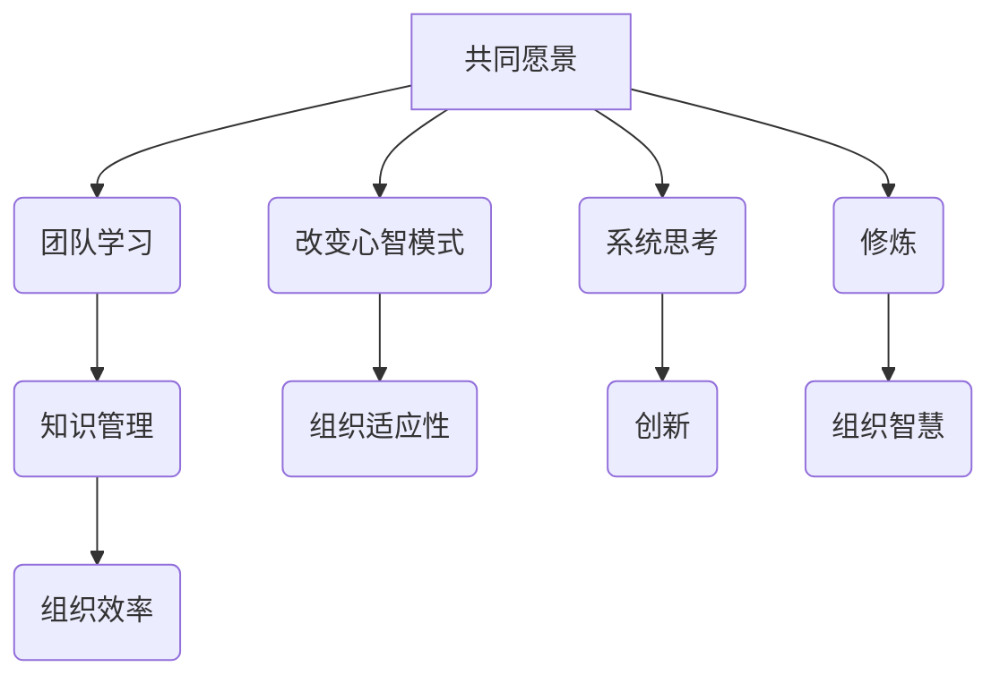
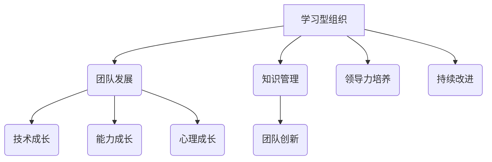

                 

### 文章标题：建立学习型组织：促进团队持续成长和创新

> 关键词：学习型组织、团队成长、持续创新、组织领导力、知识管理

> 摘要：本文旨在探讨如何建立一个学习型组织，以促进团队的持续成长和创新。通过介绍学习型组织的核心概念、建立步骤、实际案例和挑战解决方案，本文为现代企业提供了建立学习型组织的实践指南。

## 引言与背景

在当今快速变化和竞争激烈的市场环境中，企业面临着前所未有的挑战。为了保持竞争力，企业需要不断创新，并确保团队能够持续成长和适应变化。学习型组织作为一种能够实现这一目标的管理模式，正逐渐受到企业界的关注。

### 1.1 学习型组织的重要性和现代企业环境的必要性

学习型组织是一种以学习为核心，通过持续学习和知识共享来推动组织发展和创新的管理模式。在传统组织中，知识通常被视为人与人之间的传递过程，而在学习型组织中，知识被视为一种组织资源，通过系统化的管理和共享来最大化其价值。

现代企业环境中的快速变化和高度不确定性，使得学习型组织的优势愈发凸显。学习型组织能够通过持续学习、知识管理和创新，提高组织的适应性和创新能力，从而在竞争中脱颖而出。

## 学习型组织的核心概念与理论

### 2.1 学习型组织的定义与起源

学习型组织是由彼得·圣吉（Peter Senge）在1990年的著作《第五项修炼：学习型组织的艺术与实务》中首次提出。学习型组织是指一种能够不断学习、适应和创新的组织形态，其核心特征包括：

- **共同愿景**：组织成员共享的价值观和目标。
- **团队学习**：通过团队协作和共享知识来提高组织的整体能力。
- **改变心智模式**：组织成员不断反思和改变自己的思维方式，以适应新的环境和挑战。
- **系统思考**：组织成员能够从整体和长远的角度看待问题，并采取系统性的解决方案。
- **修炼**：通过不断的学习和修炼，提高个人的能力和组织整体的智慧。

### 2.2 学习型组织的五个核心原则

1. **共同愿景**：学习型组织的起点是共同愿景，它为组织成员提供了清晰的目标和方向。
2. **团队学习**：学习型组织通过团队学习来提高整体智慧，而不仅仅是个人能力。
3. **改变心智模式**：学习型组织鼓励成员反思和改变自己的思维方式，以适应新的环境和挑战。
4. **系统思考**：学习型组织从整体和长远的角度看待问题，并采取系统性的解决方案。
5. **修炼**：学习型组织通过不断的修炼，提高个人的能力和组织整体的智慧。

### 2.3 学习型组织与组织学习的关系

学习型组织的核心在于组织学习。组织学习是指组织成员通过共享知识和经验，不断改进和提升组织能力和效率的过程。学习型组织通过建立有效的组织学习机制，确保知识在组织内部的流动和利用，从而实现持续成长和创新。

### 2.4 学习型组织的 Mermaid 流程图

## 建立学习型组织的步骤与方法

### 3.1 建立学习型组织的步骤

建立一个学习型组织需要遵循以下步骤：

1. **明确愿景和目标**：确立组织的共同愿景和目标，确保所有成员都明确组织的方向。
2. **建立学习机制**：构建学习型组织的机制，包括知识管理、团队学习和领导力培养等。
3. **培养团队协作精神**：通过团队活动和项目，培养团队成员的协作精神和共享文化。
4. **提升领导力**：学习型组织的领导力不同于传统领导力，需要领导者具备引领学习、激励创新的能力。
5. **持续改进和反思**：通过持续的改进和反思，不断优化组织的学习机制和管理方法。

### 3.2 培养学习型组织的领导力

学习型组织的领导力强调领导者不仅要具备传统的管理能力，还要具备以下特质：

- **引领学习**：领导者需要以身作则，鼓励和支持团队成员不断学习和成长。
- **激励创新**：领导者要创造一个鼓励创新和尝试的环境，让团队成员敢于挑战和突破。
- **建立共同愿景**：领导者要与团队成员共同制定和实现共同愿景，为组织提供明确的方向。

### 3.3 建立共享愿景和文化

建立共享愿景和文化是学习型组织的核心。共享愿景能够为组织成员提供清晰的目标和方向，而共享文化则是实现这一愿景的基础。建立共享愿景和文化的方法包括：

- **沟通与对话**：通过定期的沟通和对话，确保组织成员对愿景和文化的理解一致。
- **共同参与**：鼓励组织成员共同参与愿景和文化的制定和实现过程。
- **树立榜样**：通过领导者和榜样的影响力，推动共享愿景和文化的建设。

### 3.4 促进知识管理

知识管理是学习型组织的核心组成部分。促进知识管理的方法包括：

- **知识共享**：建立知识共享平台和机制，鼓励团队成员分享知识和经验。
- **知识传承**：通过导师制度和培训计划，确保知识在组织内部的传承和利用。
- **知识创新**：鼓励团队成员在知识的基础上进行创新，推动组织的持续发展。

### 3.5 持续改进与创新的方法

持续改进和创新是学习型组织的核心理念。实现这一目标的方法包括：

- **定期反思**：定期对组织的学习和实践进行反思，识别存在的问题和改进空间。
- **创新工具和方法**：引入创新工具和方法，如头脑风暴、思维导图、敏捷开发等，激发团队的创造力。
- **跨部门协作**：促进跨部门协作，通过不同部门的合作，实现创新和改进。

## 促进团队持续成长与创新

### 4.1 团队成长的三个层次

团队成长可以分为三个层次：

1. **技术成长**：团队成员在专业技能和知识上的提升。
2. **能力成长**：团队成员在解决问题、沟通协作等方面的能力提升。
3. **心理成长**：团队成员在心理素质、自我认知等方面的提升。

### 4.2 团队创新的方法与工具

团队创新的方法和工具包括：

- **头脑风暴**：通过集思广益，产生创新的想法。
- **思维导图**：通过图形化工具，梳理创新思路。
- **敏捷开发**：通过快速迭代和反馈，实现持续创新。
- **跨学科合作**：通过跨学科合作，实现创新和突破。

### 4.3 学习型组织与团队发展的互动关系

学习型组织与团队发展之间存在着密切的互动关系。学习型组织通过提供学习机会、知识共享和创新环境，推动团队发展。而团队发展则通过提高团队整体能力和创新能力，进一步巩固学习型组织的建设。

### 4.4 学习型组织的 Mermaid 流程图

## 成功案例分析

### 5.1 企业A的成功案例

企业A通过建立学习型组织，实现了团队的持续成长和创新。以下是企业A的成功经验：

- **建立共同愿景**：企业A明确了“成为行业领导者”的共同愿景，并以此引导团队发展。
- **促进知识管理**：企业A建立了知识共享平台，鼓励团队成员分享知识和经验。
- **培养领导力**：企业A通过培训和导师制度，培养了具有学习型组织领导力的领导者。
- **推动持续改进**：企业A定期进行团队反思，识别改进空间，并采取行动。

### 5.2 企业B的成功案例

企业B在建立学习型组织方面也取得了显著成效。以下是企业B的成功经验：

- **创新文化**：企业B建立了创新文化，鼓励团队成员敢于尝试和挑战。
- **跨学科合作**：企业B通过跨学科合作，实现了创新和突破。
- **定期培训**：企业B定期组织培训，提高团队成员的专业技能和知识。

### 5.3 案例总结与启示

通过分析企业A和企业B的成功案例，可以得出以下启示：

- **建立共同愿景**：共同愿景是学习型组织的核心，能够为团队提供明确的方向。
- **促进知识管理**：知识管理是学习型组织的重要组成部分，能够提高团队的整体能力。
- **培养领导力**：领导力是学习型组织的关键，领导者需要具备引领学习和创新的能力。
- **推动持续改进**：持续改进是学习型组织的核心理念，能够帮助组织不断适应和成长。

## 障碍与挑战及解决方案

### 6.1 常见障碍与挑战

在建立学习型组织的过程中，企业可能会面临以下障碍和挑战：

- **文化转变**：学习型组织需要组织文化从传统模式向学习型模式转变，这可能面临阻力。
- **领导力不足**：领导者需要具备学习型组织的领导力，否则难以推动组织变革。
- **资源投入**：建立学习型组织需要投入大量的人力、物力和财力，企业可能难以承受。
- **时间成本**：建立学习型组织需要时间，企业可能担心短期内无法看到成效。

### 6.2 针对障碍的解决方案

针对以上障碍和挑战，企业可以采取以下解决方案：

- **加强文化建设**：通过培训和文化活动，加强组织文化建设，推动学习型组织的理念深入人心。
- **提升领导力**：通过培训和选拔，培养具有学习型组织领导力的领导者。
- **合理规划资源**：合理规划和利用资源，确保建立学习型组织所需的投入。
- **注重长期效果**：注重长期效果，通过持续的努力和改进，逐步实现学习型组织的建设。

### 6.3 持续改进与适应变化

建立学习型组织是一个持续改进的过程。企业需要不断反思和调整，以适应变化。以下是一些建议：

- **定期评估**：定期对学习型组织的建设进行评估，识别存在的问题和改进空间。
- **员工参与**：鼓励员工参与学习型组织的建设，提高员工的参与度和满意度。
- **创新机制**：建立创新机制，鼓励团队成员提出改进和创新建议。
- **适应变化**：根据外部环境的变化，及时调整组织的学习目标和策略。

## 实践指南与工具

### 7.1 学习型组织的评估工具

为了评估学习型组织的建设效果，企业可以使用以下评估工具：

- **学习型组织成熟度评估模型**：该模型通过评估组织的共同愿景、团队学习、领导力、知识管理和持续改进等方面，衡量学习型组织的成熟度。
- **员工满意度调查**：通过员工满意度调查，了解员工对学习型组织的认知和参与度。
- **关键绩效指标（KPI）**：通过设定关键绩效指标，衡量学习型组织在团队成长、知识管理和创新能力等方面的表现。

### 7.2 促进学习的活动和方法

为了促进学习，企业可以采取以下活动和方法的工具：

- **团队建设活动**：通过团队建设活动，提高团队成员的协作能力和沟通能力。
- **知识分享会议**：定期组织知识分享会议，鼓励团队成员分享知识和经验。
- **在线学习平台**：建立在线学习平台，提供丰富的学习资源和培训课程。
- **导师制度**：通过导师制度，帮助新员工快速融入组织，并促进知识和经验的传承。

### 7.3 实施学习型组织的案例分析

以下是一些建立学习型组织的成功案例分析：

- **谷歌**：谷歌通过建立内部创新实验室和知识共享平台，鼓励员工进行创新和分享知识，取得了显著成效。
- **华为**：华为通过持续的创新和知识管理，保持了在通信领域的领先地位。
- **丰田**：丰田通过精益生产和持续改进，实现了卓越的质量和效率。

### 7.4 总结与展望

通过以上案例分析，我们可以看到，建立学习型组织对于企业的持续成长和创新具有重要意义。企业需要根据自身情况，采取合适的策略和工具，逐步建立学习型组织。同时，企业也需要不断反思和改进，以适应外部环境的变化。

## 附录

### A.1 学习型组织相关资源

以下是一些学习型组织的相关资源：

- **书籍**：《第五项修炼：学习型组织的艺术与实务》（作者：彼得·圣吉）
- **文章**：相关学术论文和研究报告
- **网站**：学习型组织协会（Senge Institute）的官方网站

### A.2 学习型组织建设实践指南

以下是一些建立学习型组织的实践指南：

- **制定共同愿景**：明确组织的共同愿景和目标。
- **建立学习机制**：构建学习型组织的机制，包括知识管理、团队学习和领导力培养等。
- **培养团队协作精神**：通过团队活动和项目，培养团队成员的协作精神和共享文化。
- **提升领导力**：通过培训和选拔，培养具有学习型组织领导力的领导者。
- **持续改进**：通过定期的反思和改进，不断优化组织的学习机制和管理方法。

### 作者信息

作者：AI天才研究院/AI Genius Institute & 禅与计算机程序设计艺术 /Zen And The Art of Computer Programming

### 结束语

建立学习型组织是一个长期的过程，需要企业持续投入和努力。通过本文的介绍，希望能够为企业提供建立学习型组织的指导和建议。希望读者能够在实践中不断探索和改进，打造一个学习型组织，实现团队的持续成长和创新。

