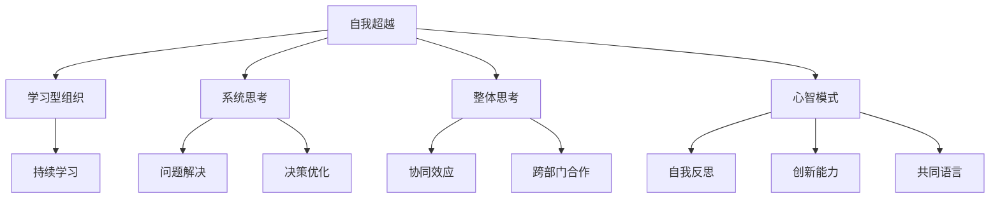

                 

### 文章标题

# 建立学习型组织：持续学习的团队文化

## 关键词

- 学习型组织
- 持续学习
- 团队文化
- 自我超越
- 系统思考
- 整体思考
- 心智模式
- 创新意识
- 知识分享

## 摘要

在现代信息技术高速发展的背景下，建立学习型组织已经成为企业和团队提高竞争力的关键策略。本文深入探讨了学习型组织的概念、特征及其与团队文化的关联，分析了建立学习型组织的重要性。通过解析核心概念、构建团队文化、实践案例分析以及实施策略，本文旨在为读者提供一套系统且实用的指导，帮助团队实现持续学习和自我超越，从而在激烈的市场竞争中立于不败之地。

## 引言

在当今这个信息爆炸和科技进步日新月异的时代，组织的学习能力已经成为其生存和发展的核心要素。一个学习型组织，不仅能够快速适应外部环境的变化，还能在内部培养出持续创新和自我超越的能力。建立学习型组织已经成为众多企业和团队追求的目标，因为它能够带来一系列显著的竞争优势。

### 什么是学习型组织

学习型组织（Learning Organization）是由彼得·圣吉（Peter Senge）在其1990年的著作《第五项修炼》中首次提出的概念。它指的是一个能够通过不断学习，实现自我超越、系统思考、整体思考和心智模式改变的组织。在学习型组织中，成员不仅仅是被动的知识接受者，而是主动的学习者、知识的创造者和传播者。

### 为什么建立学习型组织

建立学习型组织对企业和团队有着深远的意义：

1. **提升组织竞争力**：通过持续学习和创新，组织能够更好地应对市场变化，保持竞争优势。
2. **促进员工成长**：学习型组织为员工提供成长和发展的空间，激发员工的潜能，提高工作效率和满意度。
3. **增强团队协作**：学习型组织强调知识分享和协作，有助于团队成员之间建立信任和共同目标，提升团队绩效。
4. **适应动态环境**：在快速变化的市场环境中，学习型组织能够快速适应并作出响应，从而减少环境变化带来的不确定性。

### 学习型组织与团队文化的关联

团队文化是组织文化的缩影，它对组织的学习能力和创新力有着重要的影响。一个积极的学习型团队文化能够促进知识的传播和共享，激发团队成员的创造力，并有助于建立共同的目标和价值观。

接下来，我们将深入探讨学习型组织的核心概念，包括自我超越、系统思考、整体思考和心智模式等，并通过Mermaid流程图展示它们之间的关系。

## 核心概念与联系

### 自我超越

自我超越（Personal Mastery）是学习型组织的核心概念之一，它强调个人在知识和技能上的持续进步和自我完善。自我超越不仅要求个人具备不断学习和反思的能力，还要求他们在面对挑战时勇于突破自我，追求卓越。

自我超越与学习型组织的关系：

- **推动组织创新**：通过自我超越，员工能够不断带来新的想法和方法，推动组织的创新。
- **提升个人能力**：自我超越有助于员工提升自身的专业技能和解决问题的能力，从而提高整体组织的竞争力。
- **建立共同愿景**：自我超越使员工更加认同组织的愿景和使命，有助于形成共同的目标和价值观。

### 系统思考

系统思考（System Thinking）是一种能够帮助个体和组织理解复杂问题根本原因的思考方式。它强调从整体角度分析问题，识别系统中的反馈循环和因果关系，从而找到解决问题的策略。

系统思考与学习型组织的关系：

- **增强问题解决能力**：系统思考使组织能够更深入地理解问题的本质，从而更有效地解决问题。
- **优化决策过程**：通过系统思考，组织能够更好地预测和评估决策的长期影响，做出更加明智的决策。
- **促进持续改进**：系统思考鼓励组织不断地反思和改进现有的流程和方法，以实现持续发展。

### 整体思考

整体思考（Whole Thinking）是一种从整体角度理解和处理问题的方法。它强调个体和组织应该将各个部分视为一个整体，理解它们之间的相互作用和相互依赖。

整体思考与学习型组织的关系：

- **提高协同效应**：整体思考有助于团队成员更好地协作，发挥整体大于部分之和的协同效应。
- **促进跨部门合作**：整体思考使组织能够更好地整合各个部门的功能和资源，实现协同作战。
- **增强适应能力**：通过整体思考，组织能够更好地适应外部环境的变化，保持灵活性和应变能力。

### 心智模式

心智模式（Mental Models）是人们心中关于现实世界的基本认知框架和假设。它们影响个体的思考方式和决策过程，往往在不知不觉中影响着我们的行为。

心智模式与学习型组织的关系：

- **促进自我反思**：心智模式使个体和组织能够反思和质疑自己的基本认知，从而发现并改变错误的思维模式。
- **提升创新能力**：通过反思和改变心智模式，个体和组织能够更开放地接受新的思想和观点，激发创新能力。
- **建立共同语言**：心智模式有助于团队成员之间建立共同的思维框架，促进有效沟通和协作。

为了更好地展示这些核心概念之间的关系，我们可以使用Mermaid流程图来可视化这些关系：



通过上述关系图，我们可以看到，自我超越、系统思考、整体思考和心智模式共同构成了学习型组织的核心要素，它们相互关联，共同推动组织的持续学习和创新发展。

### 核心算法原理讲解

在学习型组织的构建过程中，核心算法原理的运用至关重要。这些算法不仅有助于优化组织内部的流程，还能够提高团队的整体效能。以下是一个简单的伪代码示例，用于展示如何构建一个支持持续学习的组织架构。

```python
# 学习型组织架构构建伪代码

# 定义学习型组织的基本组成部分
class LearningOrganization:
    def __init__(self):
        self.members = []
        self.knowledge_base = KnowledgeBase()
        self.culture = TeamCulture()

    # 方法：招募成员
    def recruit_members(self, new_members):
        for member in new_members:
            self.members.append(member)
            member.join_organization(self)

    # 方法：知识共享
    def share_knowledge(self):
        for member in self.members:
            member.share_learnt()

    # 方法：持续学习
    def sustain_learning(self):
        self.knowledge_base.update()
        self.culture.encourage_learning()

# 定义成员类
class Member:
    def __init__(self):
        self.knowledge = []

    # 方法：加入组织
    def join_organization(self, organization):
        organization.knowledge_base.add_member(self)
        self.organization = organization

    # 方法：分享所学知识
    def share_learnt(self):
        for knowledge in self.knowledge:
            self.organization.knowledge_base.add_knowledge(knowledge)

    # 方法：持续学习
    def learn(self, new_knowledge):
        self.knowledge.append(new_knowledge)

# 定义知识库类
class KnowledgeBase:
    def __init__(self):
        self.knowledge = []

    # 方法：添加成员知识
    def add_member(self, member):
        self.knowledge.extend(member.knowledge)

    # 方法：添加知识
    def add_knowledge(self, knowledge):
        self.knowledge.append(knowledge)

    # 方法：更新知识库
    def update(self):
        # 实现知识库的自动更新逻辑
        pass

# 定义团队文化类
class TeamCulture:
    def __init__(self):
        self.learning_motivation = 0

    # 方法：鼓励学习
    def encourage_learning(self):
        self.learning_motivation += 1

# 创建学习型组织实例
organization = LearningOrganization()

# 招募新成员
new_members = [Member() for _ in range(5)]
organization.recruit_members(new_members)

# 实施知识共享和持续学习
organization.share_knowledge()
organization.sustain_learning()
```

在这个伪代码中，我们定义了`LearningOrganization`类，代表了学习型组织的基本架构。它包括了成员管理、知识共享和持续学习等功能。`Member`类代表了组织的成员，他们有加入组织、分享知识和持续学习的能力。`KnowledgeBase`类则是知识库的实现，用于存储和管理成员的知识。`TeamCulture`类则负责维护和鼓励团队的学习氛围。

通过这一系列类的定义和方法的调用，我们可以构建一个支持持续学习的组织结构，实现知识的积累和共享，从而促进组织的持续发展。

### 数学模型和公式详解

在学习型组织的构建过程中，数学模型和公式可以帮助我们更准确地分析和评估组织的学习效率和成果。以下是一个简单的数学模型，用于描述学习型组织中的知识积累和传播过程。

#### 模型假设

假设：

1. 每个成员在一个学习周期内学习到的知识量为 \( k \)。
2. 知识共享效率与团队成员数量呈正相关，即团队成员越多，知识共享效率越高。
3. 知识传播速度与知识共享效率成正比。

#### 模型建立

1. **知识积累公式**：

   每个成员在一个学习周期内学习到的知识量为 \( k \)，那么整个组织在一个学习周期内积累的总知识量为：

   \[
   K(t) = n \times k
   \]

   其中，\( n \) 是团队成员数量，\( t \) 是学习周期数。

2. **知识传播公式**：

   知识传播速度与知识共享效率成正比，假设知识共享效率为 \( e \)，则知识传播速度为 \( v = e \times K(t) \)。在单位时间内，知识传播的距离为 \( d \)，则知识传播公式为：

   \[
   d(t) = v \times t = e \times K(t) \times t
   \]

3. **知识积累与传播的关系**：

   知识积累和传播的关系可以表示为：

   \[
   K(t) = K(0) + \int_{0}^{t} e \times K(\tau) \times d(\tau) d\tau
   \]

   其中，\( K(0) \) 是初始知识量。

#### 公式举例说明

假设一个学习型组织初始有10名成员，每个成员在一个学习周期内学习到5个新知识点，知识共享效率为0.8。在一个学习周期后，计算组织的总知识量。

1. **知识积累量**：

   \[
   K(t) = 10 \times 5 = 50
   \]

2. **知识传播距离**：

   \[
   d(t) = 0.8 \times 50 \times t
   \]

   在第10个学习周期结束时，知识传播的距离为：

   \[
   d(10) = 0.8 \times 50 \times 10 = 400
   \]

通过这个数学模型，我们可以对学习型组织的知识积累和传播进行定量分析，从而优化组织的学习过程和知识管理策略。

### 实践案例：谷歌的持续学习文化

谷歌（Google）作为全球领先的技术公司，以其创新的企业文化和卓越的技术能力著称。其成功的一个重要因素就是谷歌持续学习的企业文化。以下是谷歌在建立和维持学习型组织方面的具体实践和策略。

#### 持续学习文化的建设

1. **内部培训项目**：谷歌投入巨资开展内部培训项目，如“谷歌学院”（Google University），为员工提供丰富的学习资源和培训课程。这些课程涵盖编程、领导力、新技能等多个方面，帮助员工不断提升自身能力。

2. **开放共享平台**：谷歌建立了多个内部知识共享平台，如Google内部论坛和代码库，鼓励员工分享经验和知识。这种开放的文化氛围促进了知识的流动和共享，使得员工能够快速获取所需信息，提高了整体工作效率。

3. **灵活的工作安排**：谷歌允许员工每年有一定数量的“工作时间”用于自学和探索新的项目，这为员工提供了自由发展的空间，激发了他们的创新思维和持续学习的动力。

#### 成功的案例分析

1. **Gmail的成功**：2004年，谷歌推出了Gmail服务。这个项目最初是由几个谷歌工程师在业余时间开发的，他们通过内部共享平台和开放的工作文化，得到了其他工程师的反馈和建议，最终成功开发了这一革命性的邮件服务。Gmail的成功不仅证明了谷歌持续学习文化的有效性，也展示了团队协作和知识共享的巨大潜力。

2. **安卓操作系统**：安卓操作系统是谷歌的另一项重要创新。该项目由一个相对较小的团队负责，他们在开发过程中充分利用了谷歌的内部培训资源和知识共享平台，快速迭代和改进，最终推出了广受欢迎的安卓操作系统。安卓的成功证明了谷歌学习型组织的建设为创新提供了强大的支持。

#### 对其他组织的启示

谷歌的持续学习文化对其他组织具有宝贵的借鉴意义：

1. **投资培训和发展**：企业应重视员工的培训和发展，提供丰富的学习资源和机会，帮助员工提升技能和知识。

2. **建立开放的知识共享平台**：鼓励员工分享经验和知识，建立内部知识共享平台，促进知识的流动和传播。

3. **灵活的工作安排**：允许员工有更多自由时间进行自学和探索，激发他们的创新思维和持续学习的动力。

通过学习谷歌的实践，其他组织可以借鉴其成功经验，建立自己的持续学习文化，从而提升组织的竞争力和创新能力。

### 宝洁公司的学习型组织建设

宝洁公司（Procter & Gamble，简称P&G）是另一家成功建立学习型组织的典范。宝洁通过一系列创新和实践，成功地将其转变为一个持续学习的组织，极大地提升了企业的竞争力和创新能力。

#### 建立学习型组织的实践

1. **培训与发展计划**：宝洁投资了大量的资源来支持员工的培训和发展。公司设有全球培训中心，为员工提供多样化的学习机会，包括领导力培训、专业技能培训和跨职能培训。这些培训计划不仅帮助员工提升个人能力，也为企业提供了持续发展的动力。

2. **知识共享平台**：宝洁建立了内部知识管理系统，如宝洁大学（P&G University），该系统集成了大量的学习资源和知识库，员工可以通过这些平台获取所需的信息和最佳实践。此外，宝洁还鼓励员工参与内部研讨会和交流活动，以促进知识的共享和传播。

3. **团队协作与反馈机制**：宝洁注重团队协作和反馈机制，通过定期的团队会议和项目回顾，员工可以分享经验和教训，互相学习和借鉴。这种开放和透明的沟通文化，有助于团队形成共同的目标和价值观，提高了整体绩效。

#### 成功的案例

1. **新产品开发**：宝洁通过持续学习和创新，成功地推出了多个知名品牌和产品，如汰渍（Tide）、吉列（Gillette）和欧莱雅（L'Oreal）。这些产品的成功不仅源于宝洁在研发和技术上的领先，还得益于其学习型组织文化，使得团队能够快速适应市场变化，不断创新和优化产品。

2. **数字化转型**：面对数字化时代的挑战，宝洁积极推进数字化转型，通过引入大数据分析、人工智能和云计算等新技术，优化了生产流程和营销策略。宝洁的学习型组织文化使得团队能够快速学习和掌握新技术，从而在数字化转型的道路上取得了显著成果。

#### 对其他组织的启示

宝洁公司的成功经验为其他组织提供了宝贵的启示：

1. **投资培训和发展**：组织应重视员工的培训和发展，提供多样化的学习机会，帮助员工提升技能和知识。

2. **建立知识共享平台**：鼓励员工分享经验和知识，建立内部知识管理系统，促进知识的流动和传播。

3. **注重团队协作和反馈**：建立开放和透明的沟通文化，通过定期的团队会议和项目回顾，促进知识的共享和传播。

通过借鉴宝洁公司的实践，其他组织可以构建自己的学习型组织，从而提升企业的竞争力和创新能力。

### 小米公司的团队学习与成长

小米公司是一家以创新和快速迭代为核心竞争力的科技企业。作为学习型组织的典范，小米在团队学习和成长方面有着独特的实践和经验。

#### 团队学习与成长的策略

1. **内部培训体系**：小米建立了完善的内部培训体系，包括技术培训、产品培训和领导力培训等。公司定期组织内部培训课程，邀请行业专家和内部优秀员工分享经验，帮助团队成员不断提升技能和知识。

2. **知识共享平台**：小米建立了内部知识共享平台，如“小米学院”和“知识库”，员工可以通过这些平台获取所需的信息和最佳实践。公司鼓励员工积极参与知识共享，形成良好的知识传播氛围。

3. **跨部门协作**：小米注重跨部门协作，通过项目制和跨职能团队的形式，促进不同部门之间的知识交流和经验分享。这种协作模式有助于团队成员在多个领域获取经验，提高整体团队的竞争力。

#### 实践案例

1. **小米手机的开发**：小米在开发新款手机时，通过跨职能团队的合作，将各个部门的专业知识和经验整合到一起，快速完成了产品的开发和迭代。这种团队学习与协作的模式，使得小米能够在短时间内推出高性能、高质量的产品，赢得了市场的认可。

2. **智能家居生态链**：小米通过团队学习和快速迭代，成功构建了智能家居生态链。公司内部不同团队在智能家居产品的设计和开发过程中，不断学习和借鉴，优化产品功能，提升用户体验。这种持续学习的文化，使得小米在智能家居领域取得了显著的成绩。

#### 对其他组织的启示

小米公司的团队学习与成长实践，为其他组织提供了以下启示：

1. **建立完善的培训体系**：组织应重视内部培训，提供多样化的学习机会，帮助员工提升技能和知识。

2. **鼓励知识共享**：建立内部知识共享平台，鼓励员工积极参与知识分享，形成良好的知识传播氛围。

3. **促进跨部门协作**：通过项目制和跨职能团队的形式，促进不同部门之间的知识交流和经验分享，提升整体团队的竞争力。

通过借鉴小米公司的实践，其他组织可以构建自己的学习型团队，实现持续学习和成长。

### 实施策略

#### 制定学习计划

建立学习型组织的首要步骤是制定全面的学习计划。以下是具体步骤：

1. **设定学习目标**：明确组织的学习目标，如提高创新能力、提升员工技能、优化业务流程等。目标应具体、可衡量，并与组织的战略目标相一致。

2. **选择学习内容**：根据学习目标，确定需要学习的内容，如新技术、新方法、行业动态等。选择内容时，应考虑员工的实际需求和企业的长远发展。

3. **制定学习时间表**：为每个学习项目制定详细的时间表，包括学习周期、学习内容、考核标准等。确保学习计划的有序进行。

4. **评估学习效果**：定期评估学习效果，通过考试、项目展示、员工反馈等方式，了解学习成果，调整学习计划。

#### 建立学习支持体系

1. **学习资源的整合**：整合内部和外部学习资源，包括在线课程、培训材料、行业报告等。建立学习资源库，方便员工随时查阅。

2. **学习社区的建立**：创建学习社区，如内部论坛、微信群、学习小组等，为员工提供交流和学习的机会。通过社区，员工可以分享经验、讨论问题，共同进步。

3. **学习激励机制的设立**：设立学习激励机制，如学习积分、奖励制度等，鼓励员工积极参与学习。激励机制应公平、透明，能够激发员工的积极性。

#### 持续学习的挑战与应对

1. **面对知识过载**：

   - **筛选重要内容**：关注行业动态，筛选对组织发展具有重要意义的知识。
   - **学习时间管理**：合理规划学习时间，避免知识过载。

2. **管理学习时间**：

   - **制定学习计划**：合理安排学习时间，确保员工有充足的时间进行学习。
   - **利用碎片时间**：鼓励员工利用碎片时间进行学习，如使用学习类应用程序。

3. **提升学习效率**：

   - **选择合适的学习方法**：根据个人特点和需求，选择适合自己的学习方法，如阅读、讲座、实践等。
   - **建立学习小组**：通过小组学习，提高学习效率，促进知识共享。

通过以上策略，组织可以有效应对持续学习过程中遇到的挑战，实现持续发展和创新。

### 最佳实践 Tips

1. **领导先行**：领导层应率先垂范，积极参与学习和知识分享，树立良好的学习榜样。

2. **鼓励反馈**：建立反馈机制，鼓励员工提出意见和建议，不断优化学习计划。

3. **持续评估**：定期评估学习成果，及时调整学习策略，确保学习计划的有效执行。

4. **跨部门合作**：加强跨部门合作，通过项目制和跨职能团队，促进知识共享和经验交流。

5. **个性化学习**：根据员工的需求和特点，提供个性化的学习方案，提高学习效果。

### 小结

建立学习型组织是提升企业竞争力和创新能力的关键策略。通过持续学习、自我超越和团队协作，组织能够更好地适应外部环境的变化，实现持续发展和创新。本文从核心概念、团队文化、实践案例和实施策略等方面，深入探讨了建立学习型组织的路径和方法。希望读者能够从中获得启示，为组织的发展贡献力量。

### 注意事项

1. **制定明确的战略目标**：建立学习型组织应与组织的整体战略目标相一致，避免学习计划的盲目性。

2. **注重实践与理论相结合**：理论学习与实际操作相结合，确保学习成果能够真正应用到工作中。

3. **保持持续的热情和动力**：保持对学习和创新的热情，不断激发团队成员的积极性和创造力。

4. **建立有效的知识管理体系**：建立完善的内部知识管理体系，促进知识的积累、传播和利用。

### 拓展阅读

1. **《第五项修炼：学习型组织的艺术与实务》**（彼得·圣吉著）  
   - 详细介绍了学习型组织的概念、特征和构建方法。

2. **《创新者的窘境》**（克里斯坦森著）  
   - 分析了企业在技术变革中的挑战和应对策略，对学习型组织的建设有重要启示。

3. **《智能时代：从数据到决策》**（李开复著）  
   - 探讨了人工智能时代的企业变革和人才培养，对学习型组织的建设有实际指导意义。

### 作者信息

- **作者：AI天才研究院/AI Genius Institute & 禅与计算机程序设计艺术 /Zen And The Art of Computer Programming**  
  - AI天才研究院专注于人工智能和计算机科学领域的研究和培训，致力于推动技术进步和人才培养。  
  - 《禅与计算机程序设计艺术》是作者的经典著作，深入探讨了编程思维和艺术，对计算机科学教育有深远影响。

