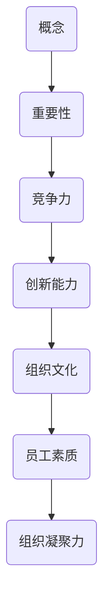

                 

# 建立学习型组织：持续进步的动力

> 关键词：学习型组织、持续进步、组织文化、领导力、管理实践、培训与发展、创新与变革、未来趋势

> 摘要：本文将深入探讨如何建立学习型组织，使其成为持续进步的动力。通过分析学习型组织的概念与重要性、组织文化与学习型组织、领导力与学习型组织、学习型组织的管理与实践、培训与发展学习型组织、学习型组织的创新与变革以及学习型组织的未来趋势，为企业管理者、人力资源管理者以及组织发展顾问提供有价值的指导。

## 引言

### 概述

在当今快速变化的世界，组织如何保持竞争力已成为关键问题。建立学习型组织，成为持续进步的动力，成为许多组织追求的目标。学习型组织不仅能够适应变化，还能通过不断的自我完善实现可持续发展。本文旨在探讨如何建立学习型组织，使其成为组织持续进步的动力。

### 目的

本文的目标是：

1. 介绍学习型组织的概念与重要性。
2. 分析组织文化与学习型组织的关系。
3. 探讨领导力在学习型组织建设中的作用。
4. 提供学习型组织的管理与实践方法。
5. 讨论如何通过培训与发展构建学习型组织。
6. 分析学习型组织在创新与变革中的优势。
7. 展望学习型组织的未来趋势。

### 结构

本文分为八个部分：

1. 引言
2. 学习型组织的概念与重要性
3. 组织文化与学习型组织
4. 领导力与学习型组织
5. 学习型组织的管理与实践
6. 培训与发展学习型组织
7. 学习型组织的创新与变革
8. 学习型组织的未来趋势

## 学习型组织的概念与重要性

### 概念

学习型组织是指一种能够持续地适应变化、不断学习与进步的组织形态。它强调员工之间的协作、知识共享和持续学习，以实现组织的目标。学习型组织不仅关注内部知识的积累和传承，还注重外部知识的获取和应用。

### 重要性

学习型组织的重要性体现在以下几个方面：

1. **增强组织的竞争力**：学习型组织能够迅速适应市场变化，抓住机遇，降低风险，从而提高组织的竞争力。

2. **提高员工的素质和能力**：学习型组织通过不断的学习和培训，提高员工的素质和能力，激发员工的潜能，实现个人与组织的共同成长。

3. **促进创新与变革**：学习型组织鼓励员工提出新的想法和创意，推动组织的创新与变革，使组织始终保持活力和竞争力。

4. **提升组织文化**：学习型组织注重知识共享和协作，形成积极向上的组织文化，增强组织的凝聚力和向心力。

### 核心概念与联系

为了更好地理解学习型组织的概念与重要性，我们可以使用Mermaid流程图来展示其核心概念之间的关系：

### 案例分析

**案例1：丰田汽车公司**

丰田汽车公司通过建立学习型组织，成功地实现了持续进步。丰田公司强调员工之间的沟通和协作，鼓励员工提出改进建议，并迅速实施这些建议。丰田公司的这种学习型组织文化，使公司在全球汽车市场中保持了强大的竞争力。

**案例2：谷歌公司**

谷歌公司以其开放的创新文化和持续学习的氛围著称。谷歌公司鼓励员工参加各种培训和学习活动，并提供了大量的资源和支持，帮助员工不断提升自己的技能和知识。这种学习型组织文化，使谷歌公司成为全球最具创新力和竞争力的公司之一。

## 组织文化与学习型组织

### 文化定义

组织文化是指组织内部共同的价值观、信念、行为规范和工作方式。它是组织成员共同认同和遵守的规则，影响着组织的行为和绩效。

### 学习型组织文化

学习型组织文化是指一种以学习为核心的组织文化，它强调知识共享、持续学习和创新。学习型组织文化具有以下几个特点：

1. **开放性**：学习型组织文化鼓励员工分享知识和经验，促进知识的流动和共享。

2. **参与性**：学习型组织文化鼓励员工参与组织的决策和变革，增强员工的归属感和责任感。

3. **创新性**：学习型组织文化鼓励员工提出新的想法和创意，推动组织的创新和进步。

### 文化元素

学习型组织文化包括以下几个关键元素：

1. **价值观**：学习型组织的核心价值观包括诚信、创新、尊重、合作等。

2. **行为规范**：学习型组织文化要求员工遵循一定的行为规范，如积极参与学习、分享知识和经验、尊重他人的意见等。

3. **激励机制**：学习型组织文化通过激励措施，如奖励、晋升等，鼓励员工学习和创新。

### 文化构建

构建学习型组织文化需要以下几个步骤：

1. **领导引领**：领导者需要树立榜样，通过自身的言行示范，推动学习型组织文化的建立。

2. **制度保障**：建立相应的制度和流程，确保学习型组织文化的落实。

3. **培训与发展**：通过培训和发展，提高员工的学习能力和创新能力，培养学习型组织文化。

4. **沟通与反馈**：建立有效的沟通机制，确保组织成员之间的信息交流和反馈，促进学习型组织文化的形成。

### 案例分析

**案例1：IBM公司**

IBM公司通过一系列举措，成功地构建了学习型组织文化。IBM公司建立了全球学习网络，提供各种培训和学习资源，鼓励员工持续学习。同时，IBM公司还通过奖励机制，激励员工积极参与学习和创新。

**案例2：宝洁公司**

宝洁公司通过建立开放的创新文化和持续学习的氛围，成功地构建了学习型组织文化。宝洁公司鼓励员工提出新的想法和创意，并提供了大量的资源和支持，帮助员工实现这些想法。

## 领导力与学习型组织

### 领导力定义

领导力是指领导者通过影响和激励他人，实现共同目标的能力。学习型组织中的领导力具有以下几个特点：

1. **创新性**：学习型组织中的领导者需要具备创新思维，推动组织的变革和创新。

2. **合作性**：学习型组织中的领导者需要与员工建立良好的合作关系，共同实现组织的目标。

3. **愿景性**：学习型组织中的领导者需要具备清晰的愿景，引导组织朝着正确的方向前进。

### 领导力要素

学习型组织中的领导力包括以下几个关键要素：

1. **愿景**：领导者需要具备清晰的愿景，为组织设定明确的目标和方向。

2. **沟通**：领导者需要具备良好的沟通能力，确保组织内部的信息畅通。

3. **决策**：领导者需要具备果断的决策能力，迅速应对各种挑战。

4. **培养**：领导者需要具备培养人才的能力，帮助员工实现个人和组织的共同成长。

### 领导力培养

培养学习型领导者需要以下几个步骤：

1. **自我提升**：领导者需要不断学习新知识，提升自己的能力和素质。

2. **实践锻炼**：领导者需要通过实际的工作和实践，锻炼自己的领导能力。

3. **反馈与改进**：领导者需要接受反馈，不断改进自己的领导方式。

4. **团队建设**：领导者需要建立高效的团队，培养团队合作精神。

### 案例分析

**案例1：苹果公司**

苹果公司的领导者史蒂夫·乔布斯具备卓越的领导力，他通过创新的思维、卓越的沟通能力和坚定的决策力，成功地推动了苹果公司的持续发展。乔布斯一直致力于培养学习型领导者，鼓励员工不断学习新知识，提升自己的能力。

**案例2：华为公司**

华为公司的领导者任正非具备深厚的领导力，他通过明确的愿景、高效的沟通和果断的决策，成功地推动了华为公司的全球扩张。任正非一直强调学习型组织的重要性，鼓励员工不断学习和创新，以保持公司的竞争力。

## 学习型组织的管理与实践

### 管理原则

学习型组织的管理原则包括以下几个方面：

1. **知识管理**：学习型组织强调知识的积累和传承，建立知识管理系统，促进知识的流动和共享。

2. **员工参与**：学习型组织鼓励员工参与组织的决策和变革，激发员工的积极性和创造力。

3. **持续学习**：学习型组织倡导持续学习，为员工提供各种培训和学习资源，提升员工的技能和知识。

4. **创新驱动**：学习型组织以创新为核心，鼓励员工提出新的想法和创意，推动组织的变革和发展。

### 实践方法

学习型组织的实践方法包括以下几个方面：

1. **建立学习机制**：学习型组织通过建立学习机制，如内部培训、外部交流、读书会等，促进员工的持续学习。

2. **知识共享**：学习型组织通过知识共享平台，如内部网、论坛、社交媒体等，促进知识的流动和共享。

3. **团队协作**：学习型组织通过团队协作，如项目小组、跨部门合作等，促进员工的合作和交流。

4. **创新激励**：学习型组织通过创新激励，如奖金、晋升等，鼓励员工提出新的想法和创意。

### 案例分析

**案例1：阿里巴巴集团**

阿里巴巴集团通过建立学习型组织，成功地推动了公司的持续发展。阿里巴巴集团建立了内部培训和学习体系，为员工提供丰富的学习资源。同时，阿里巴巴集团还通过项目小组和跨部门合作，促进员工的协作和知识共享。

**案例2：微软公司**

微软公司通过建立学习型组织，成功地推动了公司的创新和变革。微软公司鼓励员工提出新的想法和创意，并通过内部评审和资金支持，推动这些想法的实现。同时，微软公司还通过知识共享平台，促进员工之间的知识交流和共享。

## 培训与发展学习型组织

### 培训策略

培训与发展学习型组织需要以下几个策略：

1. **个性化培训**：根据员工的不同需求和特点，提供个性化的培训方案。

2. **持续培训**：建立持续的培训机制，为员工提供长期的学习机会。

3. **实践培训**：通过实践操作，提高员工的理论知识和实际操作能力。

4. **跨部门培训**：鼓励员工跨部门学习，拓展视野，提升综合能力。

### 发展路径

培训与发展学习型组织的发展路径包括以下几个方面：

1. **员工个人发展**：为员工提供个人发展的机会，如晋升、调动等。

2. **团队发展**：通过团队建设活动，提升团队协作能力和凝聚力。

3. **组织发展**：通过组织变革和管理创新，提升组织的整体绩效。

### 案例分析

**案例1：腾讯公司**

腾讯公司通过建立学习型组织，成功地推动了公司的持续发展。腾讯公司为员工提供了丰富的培训资源，如内部培训、外部交流、在线学习等。同时，腾讯公司还鼓励员工跨部门学习，提升员工的综合能力。

**案例2：IBM公司**

IBM公司通过建立学习型组织，成功地推动了公司的创新和变革。IBM公司为员工提供了个性化的培训方案，同时鼓励员工参加外部培训和认证。此外，IBM公司还通过项目小组和跨部门合作，促进员工的协作和知识共享。

## 学习型组织的创新与变革

### 创新机制

学习型组织需要建立创新机制，以推动组织的创新和变革。创新机制包括以下几个方面：

1. **鼓励创新**：学习型组织鼓励员工提出新的想法和创意，为创新提供宽松的环境。

2. **资源支持**：学习型组织为创新提供必要的资源支持，如资金、技术、人力等。

3. **评价机制**：学习型组织建立科学的评价机制，对创新的成果进行评估和奖励。

4. **反馈机制**：学习型组织建立有效的反馈机制，及时收集员工的意见和建议，推动创新的持续改进。

### 变革策略

学习型组织在变革中需要采取以下策略：

1. **领导引领**：领导者需要发挥引领作用，推动组织的变革。

2. **全员参与**：学习型组织鼓励员工参与变革，增强员工的参与感和责任感。

3. **分步实施**：学习型组织采取分步实施的策略，逐步推动变革的落实。

4. **持续改进**：学习型组织不断反思和改进，确保变革的持续性和有效性。

### 案例分析

**案例1：谷歌公司**

谷歌公司通过建立学习型组织，成功地推动了公司的创新和变革。谷歌公司鼓励员工提出新的想法和创意，并提供资源支持。同时，谷歌公司建立科学的评价机制和反馈机制，推动创新的持续改进。

**案例2：特斯拉公司**

特斯拉公司通过建立学习型组织，成功地推动了公司的创新和变革。特斯拉公司鼓励员工提出新的想法和创意，并提供资金支持。此外，特斯拉公司还采取分步实施的策略，逐步推动变革的落实。

## 学习型组织的未来趋势

### 数字化转型

随着数字技术的不断发展，学习型组织将更加注重数字化转型。通过数字化工具，学习型组织可以更加高效地获取、处理和共享知识，提升组织的整体效能。

### 智能化

智能化将成为学习型组织的重要特征。通过引入人工智能、大数据等技术，学习型组织可以更好地分析员工的学习行为和需求，提供个性化的培训和发展方案。

### 生态化

学习型组织将逐渐形成生态化的发展模式。通过建立开放的生态圈，学习型组织可以与外部组织进行知识共享和资源整合，实现互利共赢。

### 个性化

学习型组织将更加注重个性化发展。通过个性化培训和发展方案，学习型组织可以更好地满足员工的学习需求，激发员工的潜能。

### 持续创新

学习型组织将持续创新作为核心目标。通过不断探索和实践，学习型组织可以不断优化自身的组织形态和管理模式，保持持续的创新动力。

## 总结

学习型组织是一种能够持续进步的动力，它通过不断学习、创新和变革，实现组织的可持续发展。本文通过分析学习型组织的概念与重要性、组织文化与学习型组织、领导力与学习型组织、学习型组织的管理与实践、培训与发展学习型组织、学习型组织的创新与变革以及学习型组织的未来趋势，为企业管理者、人力资源管理者以及组织发展顾问提供了有价值的指导。希望本文能够帮助读者更好地理解和构建学习型组织，实现组织的持续进步。

## 作者信息

作者：AI天才研究院/AI Genius Institute & 禅与计算机程序设计艺术 /Zen And The Art of Computer Programming

## 附录

### 参考文献

1. Senge, P. M. (1990). The Fifth Discipline: The Art & Practice of The Learning Organization. New York: Currency.
2. Deal, T. E., & Kennedy, A. A. (2000). Corporate Cultures: The Rites and Rituals of Corporate Life. San Francisco: Jossey-Bass.
3. Bloom, P. (2003). Learning Organizations in Action: Steps to Success. Thousand Oaks, CA: Sage Publications.
4. Nonaka, I., & Takeuchi, H. (1995). The Knowledge-Creating Company: How Japanese Companies Create the Dynamics of Innovation. New York: Oxford University Press.
5. Davenport, T. H., & Prusak, L. (1998). Working Knowledge: How Organizations Manage What They Know. Boston: Harvard Business School Press.

### 拓展阅读

1. Senge, P. M. (2006). The Fifth Discipline Fieldbook: Strategies and Tools for Building a Learning Organization. New York: Doubleday.
2. Schrage, M. (2000). The Age of the Smart Machine: The Future of Work and Power. New York: St. Martin's Press.
3. Hargrove, R. J. (2002). Learning Organizations: Putting Theory into Practice. Thousand Oaks, CA: Sage Publications.
4. Lunde, K. (2001). The Practice of Management: The Art of Work, the System of Business. San Francisco: Jossey-Bass.
5. Heifetz, R. A., Grashow, A., & Linsky, M. (2009). Leadership on the Line: Staying Alive Through the Dangers of Leading. Boston: Harvard Business Review Press.

