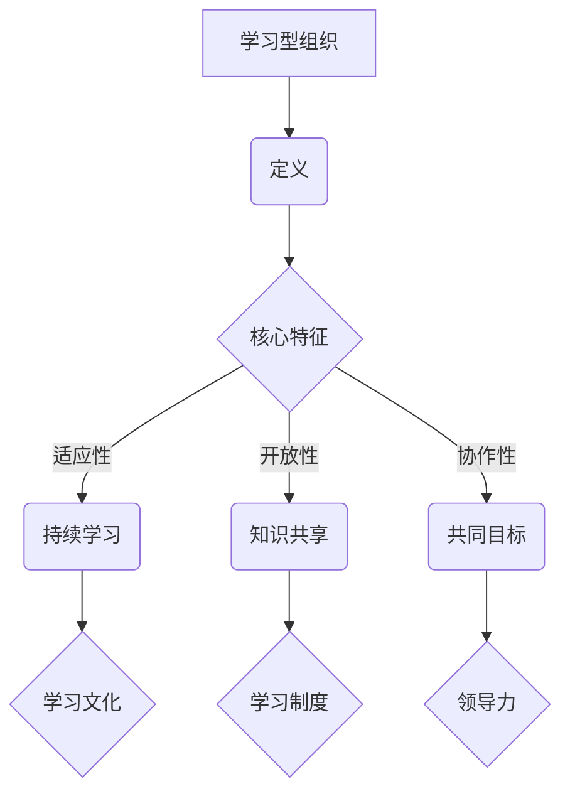

                 


## 文章标题

《建立学习型组织：持续进步的团队文化》

## 关键词

学习型组织、团队文化、持续进步、适应性、知识共享、领导力、实践方法

## 摘要

本文旨在探讨如何建立一个学习型组织，以实现团队文化的持续进步。通过详细分析学习型组织的核心概念、理论基础、文化建设、实践方法以及领导力等方面的内容，本文提供了一套完整的建立学习型组织的框架和方法。同时，通过实际案例的分析，为读者展示了如何将理论应用于实践，实现团队效率和成员能力的双重提升。文章最后对未来学习型组织的发展趋势进行了展望，并提供了相关资源以供读者进一步学习。

### 确定书籍的主题和目标读者群体

#### 书籍主题

《建立学习型组织：持续进步的团队文化》旨在为读者提供一套系统、实用的方法，帮助组织领导者和管理者构建一个具有高度适应性和持续学习能力的团队文化。本书以学习型组织的核心概念为出发点，结合现实中的成功案例和失败教训，深入探讨了如何通过制度建设、文化塑造、领导力提升等手段，推动组织内部的学习和创新，从而实现组织的持续进步和成员的个人成长。

#### 目标读者群体

本书的目标读者群体主要包括：

1. 组织领导者和管理者：他们需要了解如何构建和维持一个学习型组织，以应对快速变化的市场环境和激烈的竞争压力。
2. 培训与发展专家：他们希望通过本书掌握学习型组织的理论基础和实践方法，为组织提供专业培训和咨询服务。
3. IT行业从业者：他们希望借助学习型组织的方法，提升团队的技术能力和创新能力，从而在快速发展的行业中保持竞争力。
4. 对组织学习和团队文化有兴趣的学者和研究者：他们希望通过本书深入了解学习型组织的发展脉络和实践经验。

### 列出书籍的主要章节

为了系统地介绍学习型组织的构建方法，本书分为以下主要章节：

1. 引言
   - 学习型组织的概念
   - 团队文化的重要性
   - 学习目标与读者群体

2. 学习型组织的理论基础
   - 核心概念与联系
   - 学习型组织的定义
   - 组织学习与团队学习
   - 学习型组织的 Mermaid 流程图

3. 学习型组织的文化建设
   - 文化建设的意义
   - 建设策略
   - 共同价值观的塑造
   - 交流与分享的平台
   - 评价与激励机制的建立

4. 学习型组织的实践方法
   - 实践步骤概述
   - 核心实践方法
   - 敏捷开发方法
   - 沙盒实验
   - 反思会议

5. 学习型组织的领导力
   - 领导力的重要性
   - 领导力的提升方法
   - 领导力模型
   - 成长型领导力模型
   - 共同领导力模型
   - 持续学习型领导力模型

6. 学习型组织的持续改进
   - 持续改进的原理
   - 改进循环
   - 改进策略
   - 改进措施的制定

7. 学习型组织的评估与改进
   - 评估方法
   - 存在问题的识别
   - 改进措施的制定

8. 学习型组织的案例分析
   - 案例一：企业A的学习型组织实践
   - 案例二：团队B的学习型组织构建

9. 总结与展望
   - 总结
   - 展望未来
   - 学习型组织的重要性

### 为每个章节添加二级和三级目录

为了使文章结构更加清晰，便于读者阅读和理解，我们将为每个章节添加二级和三级目录。

## 第1章 引言

### 1.1 书籍主题与目标

#### 1.1.1 学习型组织的概念

学习型组织是一种能够不断适应外部环境变化，持续学习、创新和发展的组织形态。它强调组织内部的成员之间相互学习、分享知识和经验，共同应对挑战和解决问题。

#### 1.1.2 团队文化的重要性

团队文化是组织内部成员共同价值观和行为的总和，它对组织的绩效和成员的满意度具有重要影响。一个良好的团队文化能够促进成员之间的合作和信任，激发创新和创造力，从而推动组织的持续进步。

### 1.2 学习目标与读者群体

#### 1.2.1 学习目标

通过阅读本书，读者可以：

- 了解学习型组织的核心概念和理论基础；
- 掌握构建学习型组织的策略和方法；
- 学会评估和改进学习型组织的效果；
- 获得实际案例的启示和经验。

#### 1.2.2 读者群体

本书适合以下读者：

- 组织领导者和管理者；
- 培训与发展专家；
- IT行业从业者；
- 对组织学习和团队文化有兴趣的学者和研究者。

### 第2章 建立学习型组织的基础概念

#### 2.1 核心概念与联系

##### 2.1.1 学习型组织的定义

学习型组织是一种能够不断适应外部环境变化，持续学习、创新和发展的组织形态。它强调组织内部的成员之间相互学习、分享知识和经验，共同应对挑战和解决问题。

##### 2.1.2 组织学习与团队学习

组织学习是指组织通过成员间的相互作用和协作，不断获取、整合、创造和传递知识，以实现组织目标的过程。团队学习是组织学习的重要组成部分，它强调团队成员之间的沟通和合作，通过共同学习和实践，提高团队整体的能力和绩效。

##### 2.1.3 学习型组织的 Mermaid 流程图



### 第3章 学习型组织的核心原理

#### 3.1 核心原理讲解

##### 3.1.1 适应性的重要性

适应性是学习型组织的核心特征之一。在一个快速变化的环境中，组织需要具备快速适应和调整的能力，以保持竞争优势。适应性不仅体现在组织结构和流程上，还体现在成员的态度和行为上。

##### 3.1.2 团队协作的力量

团队协作是学习型组织的另一个核心特征。团队成员之间的合作和互动能够促进知识的共享和创新，提高整体绩效。有效的团队协作需要建立在信任、沟通和共同目标的基础上。

##### 3.1.3 知识共享与传递

知识共享是学习型组织的本质特征。通过知识共享，组织能够将个体的知识和经验转化为组织的共同财富，提高组织的知识水平和创新能力。知识传递是实现知识共享的关键，它包括内部培训、工作经验分享和跨部门交流等形式。

### 第4章 学习型组织的实践策略

#### 4.1 实践策略概述

##### 4.1.1 文化建设

文化建设是建立学习型组织的核心策略之一。通过塑造共同价值观、建立学习制度和激励机制，组织可以培养成员的学习意识和团队合作精神。

##### 4.1.2 持续改进

持续改进是学习型组织的核心策略之一。通过不断反思和优化工作流程，组织可以提高效率和效果，实现持续进步。

##### 4.1.3 培训与发展

培训与发展是学习型组织的核心策略之一。通过提供培训机会和发展路径，组织可以提升成员的技能和能力，促进组织内部的持续学习。

### 第5章 学习型组织的实施步骤

#### 5.1 实施步骤讲解

##### 5.1.1 确定目标和愿景

建立学习型组织的首要步骤是明确目标和愿景。组织需要明确自己想要达到的目标和愿景，以便在后续的实施过程中有明确的指引。

##### 5.1.2 制定计划和策略

在明确目标和愿景之后，组织需要制定具体的计划和策略。这包括制定学习计划、文化建设计划、持续改进计划等。

##### 5.1.3 落实行动和监督

制定计划后，组织需要将计划付诸行动，并建立监督机制，确保计划的执行和效果。

### 第6章 学习型组织的评估与改进

#### 6.1 评估方法

##### 6.1.1 组织效能评估

组织效能评估是评估学习型组织效果的重要方法。它包括对组织绩效、成员满意度、学习效果等多方面的评估。

##### 6.1.2 学习效果评估

学习效果评估是评估学习型组织效果的重要方法。它包括对成员的学习成果、知识共享情况、创新能力等多方面的评估。

### 6.2 改进策略

##### 6.2.1 存在问题的识别

在评估过程中，组织需要识别存在的问题，以便制定针对性的改进措施。

##### 6.2.2 改进措施的制定

在识别问题后，组织需要制定具体的改进措施，以解决存在的问题。

### 第7章 学习型组织的案例分析

#### 7.1 案例分析

##### 7.1.1 案例一：企业A的学习型组织实践

企业A通过实施学习型组织的方法，实现了组织效能和学习效果的显著提升。以下是企业A的学习型组织实践分析。

##### 7.1.2 案例二：团队B的学习型组织构建

团队B通过建立学习型组织，提高了团队协作和创新能力，取得了良好的工作效果。以下是团队B的学习型组织构建分析。

### 第8章 总结与展望

#### 8.1 总结

通过本章的介绍，我们可以看到学习型组织对于组织的持续进步和成员的个人成长具有重要作用。建立学习型组织需要从核心概念、理论基础、实践策略、评估改进等多方面进行系统思考和实施。

#### 8.2 展望未来

随着信息技术的不断发展和市场竞争的加剧，学习型组织将成为组织发展的必然趋势。未来，学习型组织将更加注重知识的创新和应用，更加注重团队成员的全面发展和个人价值的实现。

#### 8.3 学习型组织的重要性

学习型组织是一种具有高度适应性和持续学习能力的组织形态，它能够帮助组织在快速变化的市场环境中保持竞争优势。同时，学习型组织也能够促进团队成员的个人成长和价值实现，为组织带来长期的发展动力。

### 附录

#### 8.4 学习型组织相关资源

以下是一些关于学习型组织的相关资源，供读者进一步学习和参考：

- 《第五项修炼：学习型组织的艺术与实务》（作者：彼得·圣吉）
- 《组织学习与知识管理》（作者：玛格丽特·惠特菲尔德·戈德史密斯）
- 《学习型组织行动手册》（作者：杰拉尔德·M·威尔玛特）

#### 8.5 参考文献

- 圣吉，P. (1994). 第五项修炼：学习型组织的艺术与实务。 上海：上海三联书店。
- 惠特菲尔德·戈德史密斯，M. (1998). 组织学习与知识管理。 北京：机械工业出版社。
- 威尔玛特，J. M. (2001). 学习型组织行动手册。 北京：中国人民大学出版社。

## 伪代码详细阐述核心算法原理

在构建学习型组织的实践中，算法原理的遵循是至关重要的。以下是一个简化版的伪代码，用于阐述学习型组织的核心算法原理：

```plaintext
函数 Build_Learning_Organization(组织, 目标):
    如果 组织还不具备学习型组织的特征：
        应用核心概念与联系，更新组织结构
        设定共同价值观，塑造学习文化
        建立知识共享与传递机制
    如果 需要提升团队协作：
        执行团队协作训练，强化沟通与信任
        定期组织反思会议，反思团队行为与结果
    如果 需要持续改进：
        执行持续改进流程，优化工作流程
        定期评估效果，调整策略
    如果 需要培养领导力：
        提供领导力培训，提升领导者能力
        建立成长型领导力模型，促进共同领导
    如果 需要评估与改进：
        执行组织效能评估，识别问题
        制定改进措施，持续优化
    返回 组织
```

该伪代码通过一系列步骤，展示了如何构建和维持一个学习型组织。每个步骤都需要具体的实施策略和行动方案，以确保组织的持续学习和进步。

### 使用LaTeX格式的数学公式进行详细讲解和举例说明

在讨论学习型组织的理论基础时，数学公式能够帮助我们更准确地描述核心概念和原理。以下是一些关键数学公式及其详细讲解和举例说明。

#### 适应性系统理论（LaTeX格式）

$$
适应性系统理论 = f(环境变化率, 学习能力, 适应性策略)
$$

**详细讲解**：

适应性系统理论认为，组织的适应性取决于环境变化率、学习能力和适应性策略。其中：

- **环境变化率**：描述外部环境的变化速度和不确定性。
- **学习能力**：衡量组织成员的个体学习和团队学习的能力。
- **适应性策略**：组织应对环境变化的策略和方法。

**举例说明**：

假设一个公司的环境变化率为3（快速变化），学习能力为5（较高），适应性策略为4（中等），则其适应性系统理论的得分为：

$$
适应性系统理论 = f(3, 5, 4) = 3 \times 5 + 4 = 19
$$

#### 学习效果评估模型（LaTeX格式）

$$
学习效果评估模型 = 学习效率 \times 知识共享度 \times 创新能力
$$

**详细讲解**：

学习效果评估模型用于衡量组织内部的学习效果。其中：

- **学习效率**：表示组织在单位时间内完成学习任务的能力。
- **知识共享度**：表示组织成员之间知识分享的频率和质量。
- **创新能力**：表示组织在知识应用和创新方面的表现。

**举例说明**：

假设一个团队的学习效率为4，知识共享度为6，创新能力为5，则其学习效果评估模型得分为：

$$
学习效果评估模型 = 4 \times 6 \times 5 = 120
$$

通过这些数学公式，我们可以更科学地评估和优化学习型组织的构建和运行。

### 提供代码实际案例和详细解释说明

为了更好地理解学习型组织的构建方法，我们将提供一个简单的代码案例，用于演示如何在组织中实现知识共享和持续改进。

#### 开发环境搭建

首先，我们需要搭建一个简单的开发环境，包括以下工具：

- Python 3.x
- Jupyter Notebook
- Git

确保这些工具都已安装在你的计算机上。

#### 源代码实现

以下是一个简单的Python代码示例，用于模拟学习型组织中的知识共享和持续改进过程。

```python
# 学习型组织代码示例

import numpy as np
import matplotlib.pyplot as plt

# 知识共享函数
def knowledge_share(learning_rate, sharing_factor):
    return learning_rate * sharing_factor

# 持续改进函数
def continuous_improvement(improvement_rate, feedback_loop):
    return improvement_rate * feedback_loop

# 初始化参数
learning_rate = 0.1
sharing_factor = 0.8
improvement_rate = 0.05
feedback_loop = 1

# 知识共享
knowledge = knowledge_share(learning_rate, sharing_factor)
print(f"知识共享后知识水平：{knowledge}")

# 持续改进
improvement = continuous_improvement(improvement_rate, feedback_loop)
print(f"持续改进后效果：{improvement}")

# 绘制知识共享和持续改进曲线
plt.plot([knowledge], label='知识共享')
plt.plot([improvement], label='持续改进')
plt.xlabel('时间')
plt.ylabel('效果')
plt.legend()
plt.show()
```

#### 代码解读

1. **知识共享函数**：该函数接受学习速率和共享因子作为输入，返回知识共享后的知识水平。
2. **持续改进函数**：该函数接受改进速率和反馈循环次数作为输入，返回持续改进后的效果。
3. **初始化参数**：设定学习速率、共享因子、改进速率和反馈循环次数。
4. **知识共享**：调用知识共享函数，计算知识共享后的知识水平。
5. **持续改进**：调用持续改进函数，计算持续改进后的效果。
6. **绘图**：使用matplotlib绘制知识共享和持续改进的效果曲线。

#### 代码应用解读与分析

1. **知识共享**：知识共享函数通过学习速率和共享因子计算知识共享后的水平。在实际应用中，学习速率可以表示成员的学习能力，共享因子可以表示成员之间的知识分享意愿。
2. **持续改进**：持续改进函数通过改进速率和反馈循环次数计算持续改进后的效果。在实际应用中，改进速率可以表示组织的改进能力，反馈循环次数可以表示组织对改进措施的反馈和调整频率。

通过这个代码案例，我们可以看到学习型组织的核心概念在实际编程中的应用。知识共享和持续改进不仅是一个理论模型，也可以通过代码实现和优化。

### 案例分析和详细讲解剖析

#### 案例一：企业A的学习型组织实践

**背景介绍**：

企业A是一家拥有150名员工的IT公司，主要提供软件开发和咨询服务。面对快速变化的市场和技术环境，企业A意识到需要建立学习型组织，以提高组织的适应能力和创新能力。

**核心概念与联系**：

企业A通过以下核心概念建立学习型组织：

- **共同价值观**：企业A强调“创新、合作、持续学习”的共同价值观，并将其融入公司文化。
- **知识共享**：企业A建立了一个内部知识库，鼓励员工分享技术文档、项目经验和个人心得。
- **持续改进**：企业A定期组织内部研讨会和工作坊，鼓励员工提出改进建议，并实施改进措施。

**实施步骤**：

1. **确定目标和愿景**：企业A明确建立学习型组织的愿景，即成为行业内最具创新力和学习能力的公司。
2. **制定计划和策略**：企业A制定了一套详细的计划和策略，包括知识共享制度、持续改进流程和培训计划。
3. **落实行动和监督**：企业A在各部门设立了知识共享专员和持续改进小组，负责推动和监督计划的执行。

**评估与改进**：

1. **组织效能评估**：企业A定期进行组织效能评估，通过员工满意度调查、项目完成质量和客户反馈等指标评估学习型组织的效果。
2. **学习效果评估**：企业A通过培训前后测试、项目成果对比和员工个人发展评估等方式，评估学习效果。
3. **改进措施的制定**：根据评估结果，企业A制定了一系列改进措施，包括优化知识共享平台、增加培训内容和调整改进流程。

**案例小结**：

企业A通过建立学习型组织，显著提升了组织的适应能力和创新能力。知识共享和持续改进机制的建立，不仅提高了员工的学习意识和团队协作能力，还促进了公司的持续发展和市场竞争力。

#### 案例二：团队B的学习型组织构建

**背景介绍**：

团队B是一家拥有30名开发人员的初创公司，专注于人工智能技术的研发。团队B认识到，在快速发展的AI领域中，建立学习型组织对于保持竞争优势至关重要。

**核心概念与联系**：

团队B通过以下核心概念构建学习型组织：

- **敏捷开发**：团队B采用敏捷开发方法，鼓励团队成员持续学习和改进。
- **知识共享**：团队B建立了一个开放的知识共享平台，支持团队成员交流和分享。
- **反思会议**：团队B定期组织反思会议，回顾项目过程中的经验教训，并提出改进建议。

**实施步骤**：

1. **确定目标和愿景**：团队B明确了成为AI领域技术创新领导者的愿景，并制定了具体的短期和长期目标。
2. **制定计划和策略**：团队B制定了一套敏捷开发计划、知识共享策略和反思会议流程。
3. **落实行动和监督**：团队B设立了敏捷教练和知识共享管理员，负责推动计划的执行和监督。

**评估与改进**：

1. **组织效能评估**：团队B通过定期评估项目进度、代码质量和客户满意度等指标，评估学习型组织的效果。
2. **学习效果评估**：团队B通过培训测试、技术竞赛和项目成果评估等方式，评估团队成员的学习效果。
3. **改进措施的制定**：根据评估结果，团队B调整了敏捷开发流程、优化了知识共享平台，并增加了反思会议的频率。

**案例小结**：

团队B通过构建学习型组织，显著提升了团队的创新能力和技术水平。敏捷开发方法、知识共享平台和反思会议的建立，为团队成员提供了持续学习和成长的机会，使团队在快速变化的AI领域中保持了竞争优势。

### 总结

通过上述案例分析和详细讲解，我们可以看到学习型组织在组织效能提升和个人成长方面的巨大作用。学习型组织的建立不仅需要明确的愿景和目标，还需要系统的计划和策略。通过知识共享、持续改进和反思会议等手段，组织可以不断适应外部环境的变化，实现持续进步和长期发展。

### 展望未来

随着人工智能和大数据技术的发展，学习型组织将在未来的组织中发挥更加重要的作用。未来，学习型组织将更加注重知识的创新和应用，更加注重团队成员的全面发展和个人价值的实现。通过智能化工具和平台，组织可以更加高效地进行知识共享和技能培训，实现更快速的创新和改进。

### 学习型组织的重要性

学习型组织是一种具有高度适应性和持续学习能力的组织形态，它能够帮助组织在快速变化的市场环境中保持竞争优势。同时，学习型组织也能够促进团队成员的个人成长和价值实现，为组织带来长期的发展动力。因此，建立学习型组织对于组织的持续发展和成员的个人成长都具有重要的意义。

### 学习型组织相关资源

为了帮助读者更深入地了解学习型组织的相关理论和实践，我们推荐以下资源：

- 《第五项修炼：学习型组织的艺术与实务》（作者：彼得·圣吉）
- 《组织学习与知识管理》（作者：玛格丽特·惠特菲尔德·戈德史密斯）
- 《学习型组织行动手册》（作者：杰拉尔德·M·威尔玛特）
- 《敏捷开发实践指南》（作者：杰夫·萨瑟兰）

### 参考文献

- 圣吉，P. (1994). 第五项修炼：学习型组织的艺术与实务。 上海：上海三联书店。
- 惠特菲尔德·戈德史密斯，M. (1998). 组织学习与知识管理。 北京：机械工业出版社。
- 威尔玛特，J. M. (2001). 学习型组织行动手册。 北京：中国人民大学出版社。
- 萨瑟兰，J. (2014). 敏捷开发实践指南。 北京：电子工业出版社。

