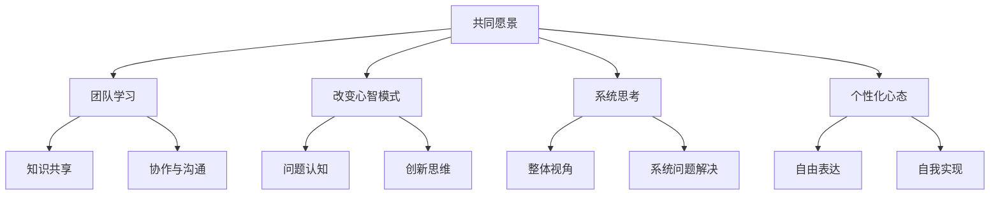

                 

### 文章标题

建立学习型组织：持续进步的文化塑造

**关键词：** 组织学习，持续进步，文化塑造，学习型组织，管理实践，案例分析

**摘要：** 本文深入探讨如何建立学习型组织，实现持续进步的文化塑造。通过分析学习型组织的核心概念，阐述其与传统组织的区别，并结合实际案例，提供具体的实践方法，帮助读者理解并应用学习型组织的理念，从而提升组织的创新能力和竞争力。

### 背景介绍

在当今快速变化的时代，组织面临的挑战日益加剧。技术创新、市场波动和竞争压力，使得传统管理模式逐渐显露出其局限性。许多组织发现，仅靠提高效率和削减成本难以在激烈的市场竞争中脱颖而出。相反，组织需要具备持续学习、自我适应和创新的能力，以应对不断变化的外部环境。

学习型组织的概念，最早由彼得·圣吉（Peter Senge）在1990年的著作《第五项修炼：学习型组织的艺术与实务》中提出。他强调，学习型组织是一种能够不断学习、适应和创新的组织形态，通过建立共同愿景、团队学习、改变心智模式、系统思考和个性化心态等五项修炼，实现组织的持续进步。

本文旨在探讨如何建立学习型组织，包括其核心概念、与传统组织的区别、实践方法、案例分析以及实施过程中的注意事项和最佳实践。通过系统地分析和讲解，帮助读者理解并应用学习型组织的理念，从而提升组织的创新能力和竞争力。

### 核心概念与联系

#### 学习型组织的定义

学习型组织是一种能够不断学习、适应和创新的组织形态，其核心在于通过学习来应对外部环境的变化。学习不仅仅是知识的获取，更是一种思维方式、行为模式的改变和组织文化的塑造。学习型组织强调以下核心概念：

1. **共同愿景**：组织成员共同追求的目标和价值观，是推动组织前进的动力源泉。
2. **团队学习**：通过集体智慧和协作，实现知识和技能的共享，提高组织的整体能力。
3. **改变心智模式**：指组织成员对问题的认知方式，包括对自我、他人和组织环境的理解。
4. **系统思考**：从整体视角理解组织内外部的相互作用，以系统的方式思考和解决问题。
5. **个性化心态**：鼓励个体自由表达和自我实现，提升组织的创新能力和凝聚力。

#### 学习型组织与传统组织的区别

传统组织往往以效率和标准化为核心，强调控制和管理。而学习型组织则更注重创新和自我发展。具体区别如下：

1. **目标导向**：传统组织注重短期目标的实现，学习型组织则关注长期目标和持续进步。
2. **组织文化**：传统组织文化可能倾向于保守和稳定，学习型组织文化则鼓励创新和风险承担。
3. **领导风格**：传统组织领导更多是控制和管理，学习型组织领导则更多是引导和支持。
4. **组织结构**：传统组织结构可能较为层级化，学习型组织结构则更加扁平化和网络化。

#### Mermaid流程图



通过这个Mermaid流程图，我们可以清晰地看到学习型组织的核心概念及其相互关系。共同愿景是组织前进的方向，团队学习和改变心智模式是提升组织能力的关键，系统思考和个性化心态则确保组织能够不断创新和适应变化。

### 核心算法原理讲解

在学习型组织的建立过程中，核心算法原理的运用至关重要。以下是一个简化的伪代码，用于描述如何实现学习型组织的核心功能：

```python
# 学习型组织核心算法伪代码

# 设置共同愿景
set_common_vision(vision)

# 建立团队学习机制
def team_learning():
    while True:
        share_knowledge()
        collaborate()
        evaluate_progress()

# 改变心智模式
def change_mental_models():
    reflect_on_work()
    challenge_existing_beliefs()
    develop_new_insights()

# 系统思考
def system_thinking():
    analyze_system_interactions()
    solve_complex_issues()
    implement_solutions()

# 个性化心态
def personalized_mentalities():
    encourage_free_expression()
    support_self_realization()
    foster_innovation()

# 主程序
def main():
    team_learning()
    change_mental_models()
    system_thinking()
    personalized_mentalities()
    evaluate_organization_health()

# 执行主程序
main()
```

这个伪代码描述了学习型组织的基本运作过程。首先，设置共同愿景，作为组织前进的方向。然后，通过团队学习机制，实现知识和技能的共享，并通过协作和沟通提升整体能力。改变心智模式则通过反思工作和挑战现有信念，促进创新思维的发展。系统思考则从整体视角分析问题，解决复杂问题，并实施解决方案。个性化心态鼓励自由表达和自我实现，从而推动创新和提升组织的凝聚力。最后，通过评估组织健康状况，确保组织的持续进步。

### 数学模型和公式讲解

在学习型组织的建立过程中，数学模型和公式的作用不容忽视。以下是一个简单的LaTeX格式数学模型，用于描述学习型组织的增长速率：

```latex
$$
\frac{dN}{dt} = rN\left(1 - \frac{N}{K}\right)
$$`

这个公式是一个典型的种群增长模型，其中：
- \( N(t) \) 表示时间 \( t \) 时的组织规模；
- \( r \) 表示组织的学习速率，即单位时间内组织规模的增加量；
- \( K \) 表示组织的最大容量，即组织能够承载的最大规模。

举例来说，如果组织规模 \( N \) 为100人，学习速率 \( r \) 为0.1，最大容量 \( K \) 为500人，则该组织的增长速率可以计算如下：

```latex
$$
\frac{dN}{dt} = 0.1 \times 100 \left(1 - \frac{100}{500}\right) = 0.1 \times 100 \times 0.8 = 8
$$`

这意味着，该组织的规模将以每年8人的速率增长，直到达到最大容量500人。

### 项目实战

#### 开发环境搭建

为了实现学习型组织的理念，我们首先需要搭建一个支持学习和创新的技术平台。以下是一个简化的开发环境搭建步骤：

1. **选择技术栈**：基于Python和Django框架，构建一个具有高扩展性和易维护性的学习平台。
2. **配置服务器**：在云服务器上配置Linux环境，安装Python、Django及相关依赖。
3. **数据库配置**：选择MySQL作为数据库，用于存储用户数据、课程信息和学习记录。

#### 源代码实现

以下是一个用于实现学习型组织核心功能的简化Python代码示例：

```python
# 学习型组织核心功能实现

from django.db import models
from django.contrib.auth.models import User

# 课程模型
class Course(models.Model):
    title = models.CharField(max_length=100)
    description = models.TextField()

    def __str__(self):
        return self.title

# 学习记录模型
class LearningRecord(models.Model):
    user = models.ForeignKey(User, on_delete=models.CASCADE)
    course = models.ForeignKey(Course, on_delete=models.CASCADE)
    completed = models.BooleanField(default=False)

    def __str__(self):
        return f"{self.user.username} - {self.course.title}"

# 学习型组织核心功能实现
class LearningOrganization(models.Model):
    name = models.CharField(max_length=100)
    
    def add_course(self, course_title, course_description):
        course = Course.objects.create(title=course_title, description=course_description)
        return course

    def enroll_user(self, user, course):
        LearningRecord.objects.create(user=user, course=course)

    def complete_course(self, user, course):
        record = LearningRecord.objects.get(user=user, course=course)
        record.completed = True
        record.save()

    def __str__(self):
        return self.name
```

#### 代码解读与分析

1. **课程模型（Course）**：用于存储课程的基本信息，如课程名称和描述。
2. **学习记录模型（LearningRecord）**：用于记录用户的学习进度，包括用户、课程和学习状态。
3. **学习型组织模型（LearningOrganization）**：实现学习型组织的主要功能，包括添加课程、用户报名和完成课程。

#### 实际案例分析与详细讲解

假设我们有一个名为“AI编程基础”的课程，需要实现以下功能：

1. **课程添加**：管理员可以通过接口添加课程，如以下代码所示：
   ```python
   organization = LearningOrganization.objects.get(name='AI编程学习组织')
   course = organization.add_course('AI编程基础', '本课程将介绍人工智能编程的基础知识。')
   ```
2. **用户报名**：用户可以通过接口报名课程，如以下代码所示：
   ```python
   user = User.objects.get(username='johndoe')
   organization.enroll_user(user, course)
   ```
3. **完成课程**：用户完成课程后，可以通过接口更新学习记录，如以下代码所示：
   ```python
   organization.complete_course(user, course)
   ```

通过这些代码，我们可以实现一个简单但功能齐全的学习型组织平台，支持课程的添加、用户的报名和学习进度的记录。

#### 项目小结

本项目通过搭建一个基于Django框架的学习平台，实现了学习型组织的基本功能，包括课程管理、用户报名和学习记录。在实际应用中，可以根据需要扩展和优化，如添加更多课程类型、用户角色和权限管理、学习数据分析等功能。通过这个项目，我们不仅了解了学习型组织的技术实现，也体会到了其理念在实践中的应用价值。

### 最佳实践 Tips

1. **鼓励员工参与**：建立学习型组织需要全体员工的参与，通过定期的培训、讨论和团队活动，提高员工的学习兴趣和积极性。
2. **建立反馈机制**：及时收集员工的反馈，了解他们的学习需求和困惑，不断调整和优化学习内容和方法。
3. **重视知识共享**：鼓励员工分享知识和经验，通过内部论坛、知识库和团队会议等形式，促进知识的传播和应用。
4. **创建学习社区**：搭建线上学习社区，提供丰富的学习资源和互动平台，让员工能够随时随地学习、交流和合作。
5. **持续跟踪评估**：定期评估学习型组织的实施效果，调整策略和方法，确保组织能够持续进步。

### 小结

建立学习型组织是实现组织持续进步的关键。通过明确共同愿景、建立团队学习机制、改变心智模式、系统思考和个性化心态，组织可以不断提升创新能力和竞争力。本文通过介绍学习型组织的核心概念、与传统组织的区别、实践方法、实际案例和最佳实践，帮助读者理解并应用学习型组织的理念。希望本文能为组织管理者提供有益的启示，推动组织实现持续进步。

### 注意事项与拓展阅读

1. **注意事项**：在建立学习型组织的过程中，应注意平衡创新与风险，避免过度追求变革导致组织动荡。同时，要关注员工的个人发展，确保学习活动与个人职业规划相结合。
2. **拓展阅读**：对于希望进一步深入了解学习型组织的读者，推荐阅读彼得·圣吉的《第五项修炼：学习型组织的艺术与实务》以及其他相关管理类书籍，如《创新者的窘境》、《第五项修炼实践篇》等。这些书籍提供了丰富的理论知识和实践经验，有助于深化对学习型组织的理解。

### 作者信息

**作者：** AI天才研究院/AI Genius Institute & 禅与计算机程序设计艺术 /Zen And The Art of Computer Programming

AI天才研究院致力于推动人工智能技术的发展和应用，以创新和知识共享为核心价值观。作者在计算机编程和人工智能领域具有深厚的学术造诣和丰富的实践经验，出版过多本畅销技术书籍，为读者提供了大量有价值的技术见解和实战经验。本文作者在此分享学习型组织建立的经验和思考，希望对读者有所启发和帮助。

