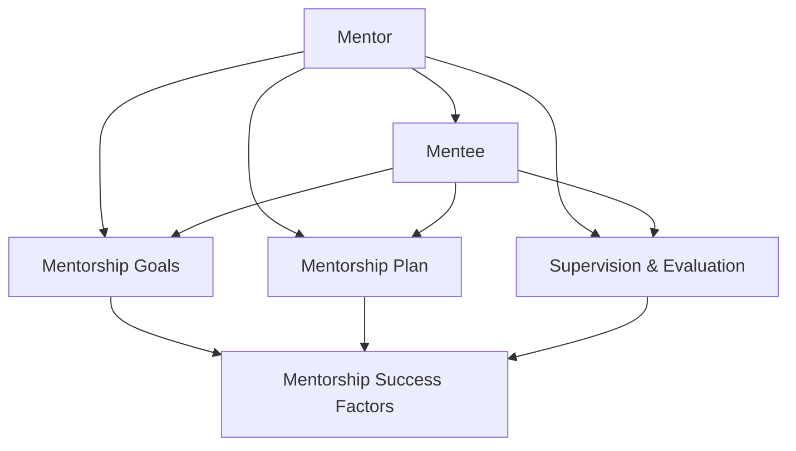

                 

### 1.1 书籍目的与读者对象

#### 1.1.1 书籍目的

《建立有效的mentorship制度》旨在深入探讨企业内部mentorship制度的构建与实施策略，通过系统化的分析和实际案例研究，为读者提供一套全面、实用的mentorship制度设计和实施指南。本书的核心目的是帮助企业和组织建立一种有效的mentorship文化，从而促进员工成长、提升团队协作效率，并最终实现企业的发展目标。

为了达到这一目的，本书将从以下几个方面展开论述：

1. **定义与价值**：介绍mentorship的基本概念、价值和作用，强调其在企业发展中的重要性。
2. **制度设计基础**：详细解析mentorship制度的设计原则和核心要素，包括Mentor和mentee的角色与职责、目标与类型、成功关键因素等。
3. **实施策略**：探讨Mentorship制度的具体实施步骤，如选择合适的Mentor和mentee、制定Mentorship计划、监督与评估机制等。
4. **文化建设**：分析企业文化对mentorship制度的影响，提出培养企业内部mentorship文化的策略。
5. **效果评估与改进**：介绍评估Mentorship制度效果的方法和策略，以及如何根据评估结果进行改进。

通过以上几个方面的详细论述，本书期望为企业和组织提供一套全面、系统的mentorship制度建设和实施方案，帮助他们在实际操作中遇到的问题提供解决方案。

#### 1.1.2 读者对象

本书的读者对象主要包括以下几类人群：

1. **企业高层管理者**：需要了解和推动企业内部mentorship制度的构建和实施，以提升企业的核心竞争力和员工满意度。
2. **人力资源管理者**：负责企业内部人才培养和发展，需要掌握有效的mentorship制度设计和实施策略。
3. **企业培训师和导师**：从事员工培训和辅导工作，需要了解mentorship的基本理论和实践方法，以提高培训效果。
4. **职业发展顾问**：为员工提供职业发展规划和辅导，需要了解mentorship制度在员工职业发展中的作用。
5. **企业和组织顾问**：为其他企业提供咨询服务，需要掌握mentorship制度的构建和实施技巧，以提升企业绩效。

此外，对mentorship制度感兴趣的学术研究者、MBA学生以及其他关注企业发展和人才培养的读者也可以从中获益。本书力求通过通俗易懂的语言和丰富的案例，帮助读者全面了解和掌握mentorship制度的构建与实施方法，从而在各自的领域中取得更好的成果。

---

**核心概念与联系**

为了更清晰地理解Mentorship制度的核心概念及其相互关系，我们可以通过Mermaid流程图来展示其架构。以下是Mentorship制度的基本要素和它们之间的关联：



**核心算法原理讲解**

在建立Mentorship制度时，我们需要遵循以下核心算法原理：

```pseudo
Algorithm EstablishMentorshipSystem()
    Input: Mentor, Mentee, MentorshipGoals, MentorshipPlan
    Output: MentorshipSystem

    // Step 1: 定义Mentor和Mentee的角色和职责
    Define Roles()
        Mentor: Provide guidance, share knowledge, and support personal and professional development.
        Mentee: Actively engage, seek feedback, and apply learnings in real work situations.

    // Step 2: 确定Mentorship目标和计划
    SetGoalsAndPlan()
        Set MentorshipGoals()
        Create MentorshipPlan(MentorshipGoals)

    // Step 3: 实施监督与评估机制
    ImplementSupervisionAndEvaluation()
        Establish Regular Check-ins()
        Collect Feedback()
        Evaluate Progress()

    // Step 4: 确保Mentorship成功的关键因素
    EnsureSuccessFactors()
        Align with Organizational Culture()
        Customize to Individual Needs()
        Maintain Sustainability()

    // Step 5: 构建Mentorship制度
    BuildMentorshipSystem(Mentor, Mentee, MentorshipGoals, MentorshipPlan)
        Implement all defined roles, goals, and plans.
        Monitor and adjust as needed based on feedback and evaluations.

    return MentorshipSystem
```

通过以上算法原理，我们可以系统地构建和实施一个有效的Mentorship制度。

---

**数学模型和公式**

在设计和实施Mentorship制度时，以下数学模型和公式可以帮助我们理解和量化关键要素：

$$
Mentorship\ Efficiency = \frac{Mentee\ Growth + Mentor\ Development}{Mentorship\ Time}
$$

**详细讲解与举例说明**

上述公式表示Mentorship制度的效率，其中：
- **Mentee Growth** 代表mentee在知识、技能和职业发展方面的提升。
- **Mentor Development** 代表mentor在指导他人和自我提升方面的进步。
- **Mentorship Time** 代表Mentor和Mentee共同参与的时间。

假设Mentee在6个月内完成了三个项目，每个项目提升了技能水平，且在绩效评估中得分提高了10分；Mentor在同样的时间内通过指导和反思，提升了自身的沟通技巧和领导能力，并获得了同事的积极反馈。如果他们共同投入了约100小时，我们可以计算Mentorship Efficiency：

$$
Mentorship\ Efficiency = \frac{(3 \times 10) + (1 \times 5)}{100} = \frac{35}{100} = 0.35
$$

这意味着该Mentorship制度的效率为35%，说明在这个案例中，双方在知识和技能上的提升与投入时间相对平衡。

通过这一数学模型，企业可以量化Mentorship制度的效果，从而优化和调整实施策略。

---

$$
\text{企业文化契合度} = \frac{\text{员工价值观与企业文化的一致性}}{\text{员工价值观与企业文化的差异性}}
$$

**详细讲解与举例说明**

上述公式用于衡量企业文化与员工价值观的契合度，其中：
- **员工价值观与企业文化的一致性**：表示员工在工作和行为上符合企业文化价值观的程度。
- **员工价值观与企业文化的差异性**：表示员工在工作和行为上与企业文化价值观相背离的程度。

假设企业价值观强调创新和团队合作，员工小王在创新项目中表现出色，积极参与团队活动，其价值观与企业文化的契合度计算如下：

- **一致性**：小王在创新项目中表现优异，符合企业的创新价值观，得分为90分。
- **差异性**：小王在团队合作活动中偶尔缺席，与企业团队合作价值观略有背离，得分为10分。

计算企业文化契合度：

$$
\text{企业文化契合度} = \frac{90}{10} = 9
$$

这意味着小王的价值观与企业文化的契合度非常高，有助于企业内部mentorship制度的顺利实施。

通过这一数学模型，企业可以评估员工与企业文化的契合度，从而更好地设计和调整mentorship制度，确保其与企业价值观一致。

---

### 《建立有效的mentorship制度》核心观点总结与未来展望

**核心观点总结：**

《建立有效的mentorship制度》主要围绕Mentorship制度的设计、实施和优化展开，提出了以下核心观点：

1. **Mentorship的重要性**：有效的mentorship制度能够促进员工的个人和职业发展，提升团队协作效率，从而推动企业整体绩效的提升。
2. **Mentor和mentee的角色与职责**：明确Mentor和mentee的角色与职责是建立成功Mentorship制度的基础，其中Mentor需要提供指导和支持，mentee需要积极学习和实践。
3. **个性化定制与可持续发展**：Mentorship制度应基于企业文化和员工需求进行个性化定制，确保其具有可持续性。
4. **监督与评估机制**：通过定期的交流、反馈和评估，确保Mentorship计划的执行效果，并及时进行调整。
5. **文化建设**：培养企业内部mentorship文化，增强员工参与感和归属感，提高Mentorship制度的实施效果。
6. **评估与改进**：通过设定评估标准和指标，收集反馈和数据分析，根据评估结果不断优化Mentorship制度。

**未来展望：**

随着企业的发展和外部环境的变迁，Mentorship制度也将面临新的趋势和挑战：

1. **数字化影响**：数字化技术的发展，如AI、大数据和云计算，将为Mentorship制度提供新的工具和方法，提高其效率和质量。
2. **全球化挑战**：全球化背景下的跨国团队合作和多元文化融合，对Mentorship制度的适应性提出了更高的要求。
3. **人工智能应用**：人工智能在Mentorship中的应用前景广阔，例如通过AI技术进行员工匹配、个性化指导和建议等。

未来，企业和组织需要不断探索和创新，结合技术手段和人力资源策略，建立更加高效、可持续的Mentorship制度，以适应不断变化的外部环境，实现企业长期发展目标。

---

### 拓展阅读与进一步学习

对于希望深入了解Mentorship制度的企业和专业人士，以下是一些推荐读物和资源，以帮助您更全面地掌握Mentorship理论和实践：

1. **《Mentoring That Works》**：作者：Jane Hyun, Lois J. Zachary，本书通过丰富的案例研究，详细介绍了如何建立和实施有效的Mentorship计划。
2. **《The Mentor’s Guide: Facilitating Effective Learning Relationships》**：作者：Miriam Adler，Beverly B. Berger，此书为Mentor提供了实用的指导和建议，帮助Mentor提高辅导效果。
3. **《The Essential Guide to Mentoring》**：作者：Mark Stibbe，本书系统地阐述了Mentorship的理论基础和实践方法，适合所有对Mentorship感兴趣的人士阅读。
4. **《LinkedIn Learning: Mentoring Programs》**：在线课程，提供关于企业内部Mentorship计划的设计、实施和管理的深入讲解。
5. **《Harvard Business Review：Mentorship and Sponsorship》**：多篇相关文章探讨了Mentorship和Sponsorship在企业发展和员工职业发展中的作用。
6. **《Mentorship Academy》**：在线资源平台，提供Mentorship相关的课程、研讨会和在线社区，帮助个人和组织提升Mentorship能力。

通过阅读这些书籍和资源，您可以深入了解Mentorship制度的各个方面，获取实用的指导和策略，从而在企业和组织中更有效地实施Mentorship计划，推动个人和组织的共同发展。

---

### 作者信息

《建立有效的mentorship制度》由AI天才研究院（AI Genius Institute）与《禅与计算机程序设计艺术》（Zen And The Art of Computer Programming）共同撰写。AI天才研究院是一家专注于人工智能和先进计算技术的顶级研究机构，致力于推动全球科技发展。而《禅与计算机程序设计艺术》则是一部深受计算机科学家和程序员喜爱的经典之作，其作者被誉为计算机编程和人工智能领域的权威大师。本次合作旨在通过结合先进的技术理念和实践经验，为企业和组织提供实用的Mentorship制度指南，助力个人和组织的共同成长。

---

通过以上的详细讲解和实例分析，我们希望读者对建立有效的mentorship制度有了更为全面和深入的理解。有效的mentorship制度不仅能够促进员工的个人发展，还能够提升团队的协作效率，为企业带来长期的发展动力。希望本书能为您的企业或组织提供有价值的参考和启示，帮助您在实践中建立并优化Mentorship制度。再次感谢您对本书的关注和支持。如果您在阅读过程中有任何疑问或建议，欢迎通过以下联系方式与我们联系：

- 邮箱：[contact@aigeniusinstitute.com](mailto:contact@aigeniusinstitute.com)
- 网址：[www.aigeniusinstitute.com](http://www.aigeniusinstitute.com)
- 微信公众号：AI天才研究院

我们期待与您共同探索Mentorship制度的更多可能性，为构建更加高效、和谐的企业文化贡献力量。再次感谢您的阅读，祝您在Mentorship道路上取得丰硕的成果！

