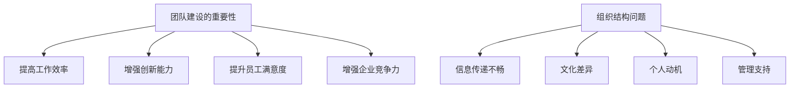
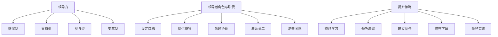

                 

# 建立高效团队：从招聘到培养的全流程

## 文章关键词
- 高效团队
- 招聘流程
- 培训与发展
- 绩效评估
- 团队管理
- 团队文化建设

## 摘要
本文旨在探讨如何建立高效团队，涵盖从招聘到培养的全流程。首先，我们将介绍团队建设的重要性及其对企业的价值。接着，我们将详细讨论招聘策略、职位描述与需求分析、招聘渠道、面试流程和招聘决策。随后，我们将探讨员工培训与发展、绩效评估与激励、职业发展路径规划和团队文化建设。在团队管理部分，我们将介绍团队领导力、团队沟通与协作、团队冲突管理和团队绩效管理。最后，通过成功团队的案例分析，我们将总结最佳实践并给出拓展阅读建议。

## 第一部分：团队建设的准备

### 第1章：团队建设的重要性

#### 1.1.1 团队建设的基本概念

团队建设是指在组织内部通过一系列措施和方法，促进团队成员之间的协作与沟通，以提高团队整体绩效的过程。团队建设不仅仅是一项行政任务，更是一种组织文化，是推动企业持续发展的关键因素。

#### 1.1.2 团队建设对企业的价值

团队建设对企业的价值主要体现在以下几个方面：

1. **提高工作效率**：高效的团队可以更好地分配任务和资源，减少沟通成本，从而提高整体工作效率。
2. **增强创新能力**：团队建设有助于激发团队成员的创造力，促进知识分享和经验交流，从而提高企业的创新能力。
3. **提升员工满意度**：良好的团队氛围可以提高员工的工作满意度，降低离职率，稳定团队。
4. **增强企业竞争力**：高效的团队可以快速响应市场变化，提供高质量的产品和服务，从而增强企业的竞争力。

#### 1.1.3 团队建设的障碍与挑战

团队建设过程中可能面临的障碍与挑战包括：

1. **组织结构问题**：过于官僚化的组织结构可能导致信息传递不畅，阻碍团队建设。
2. **文化差异**：团队成员之间的文化差异可能引发冲突，影响团队凝聚力。
3. **个人动机**：团队成员的个人动机不同，可能导致团队成员之间的合作不顺畅。
4. **管理支持**：缺乏有效的管理支持和资源投入，可能导致团队建设效果不佳。

### Mermaid 流程图

下面是一个简单的 Mermaid 流程图，展示了团队建设的重要性：



## 第二部分：招聘流程

### 第2章：招聘策略

#### 2.1.1 招聘目标的设定

招聘目标的设定是招聘流程的首要步骤。招聘目标包括明确岗位需求、预期绩效和能力要求。以下是一个简化的伪代码示例，用于设定招聘目标：

```python
def set_recruitment_objectives(job_title, department):
    # 输入：岗位名称和部门名称
    # 输出：招聘目标字典
    
    objectives = {
        "job_title": job_title,
        "department": department,
        "required_skills": [],
        "performance_targets": [],
        "experience_level": ""
    }
    
    # 根据部门设置具体的目标
    if department == "研发部":
        objectives["required_skills"].append("编程能力")
        objectives["required_skills"].append("项目管理经验")
        objectives["performance_targets"].append("完成项目进度")
        objectives["performance_targets"].append("提高代码质量")
        objectives["experience_level"] = "中级以上"
    elif department == "市场部":
        objectives["required_skills"].append("市场分析能力")
        objectives["required_skills"].append("沟通协调能力")
        objectives["performance_targets"].append("提高市场份额")
        objectives["performance_targets"].append("优化营销策略")
        objectives["experience_level"] = "3年以上"
    
    return objectives
```

#### 2.1.2 招聘渠道的选择

招聘渠道的选择直接影响招聘效果和成本。常见的招聘渠道包括：

1. **内部推荐**：通过现有员工推荐潜在候选人，成本低，候选人质量较高。
2. **在线招聘平台**：如智联招聘、前程无忧等，覆盖面广，招聘成本适中。
3. **社交媒体招聘**：如LinkedIn、微信招聘群等，利用社交网络寻找合适候选人。
4. **猎头公司**：适合寻找高端职位和稀缺人才，但成本较高。

#### 2.1.3 招聘预算的规划

招聘预算的规划是确保招聘流程顺利进行的重要环节。以下是一个简化的伪代码示例，用于规划招聘预算：

```python
def plan_recruitment_budget(total_employee_count, average_salary, recruitment_channels):
    # 输入：员工总数、平均薪资、招聘渠道列表
    # 输出：招聘预算字典
    
    budget = {
        "total_budget": 0,
        "channel_budgets": {}
    }
    
    # 计算总预算
    budget["total_budget"] = total_employee_count * average_salary * 0.1
    
    # 分配预算到各个渠道
    for channel in recruitment_channels:
        if channel == "内部推荐":
            budget["channel_budgets"][channel] = budget["total_budget"] * 0.3
        elif channel == "在线招聘平台":
            budget["channel_budgets"][channel] = budget["total_budget"] * 0.4
        elif channel == "社交媒体招聘":
            budget["channel_budgets"][channel] = budget["total_budget"] * 0.2
        elif channel == "猎头公司":
            budget["channel_budgets"][channel] = budget["total_budget"] * 0.1
    
    return budget
```

## 第三部分：团队培养

### 第7章：员工培训与发展

#### 7.1.1 培训计划的设计

培训计划的设计是员工培训与发展的重要环节。以下是一个简化的伪代码示例，用于设计培训计划：

```python
def design_training_plan(job_title, department, training_topics, training_duration, trainers):
    # 输入：岗位名称、部门名称、培训主题列表、培训时长、培训师列表
    # 输出：培训计划字典
    
    training_plan = {
        "job_title": job_title,
        "department": department,
        "training_topics": [],
        "training_duration": 0,
        "trainers": []
    }
    
    # 根据部门设置具体的培训主题
    if department == "研发部":
        training_plan["training_topics"].append("编程技能提升")
        training_plan["training_topics"].append("项目管理")
        training_plan["training_duration"] = 2
    elif department == "市场部":
        training_plan["training_topics"].append("市场分析")
        training_plan["training_topics"].append("营销策略")
        training_plan["training_duration"] = 3
    
    # 添加培训师
    training_plan["trainers"] = trainers
    
    return training_plan
```

#### 7.1.2 培训内容的确定

培训内容的确定是确保培训计划有效实施的关键。以下是一个简化的伪代码示例，用于确定培训内容：

```python
def determine_training_content(training_topics, training_duration):
    # 输入：培训主题列表、培训时长
    # 输出：培训内容字典
    
    training_content = {
        "topics": [],
        "duration": 0,
        "resources": []
    }
    
    # 根据培训主题和时长设置具体的培训内容
    for topic in training_topics:
        if topic == "编程技能提升":
            training_content["topics"].append("编程语言基础知识")
            training_content["topics"].append("编程实践技巧")
            training_content["duration"] = 4
            training_content["resources"].append("编程教材")
        elif topic == "市场分析":
            training_content["topics"].append("市场调研方法")
            training_content["topics"].append("数据分析工具")
            training_content["duration"] = 3
            training_content["resources"].append("市场分析书籍")
    
    return training_content
```

#### 7.1.3 培训方法的选用

培训方法的选用应根据培训内容和目标来决定。以下是一个简化的伪代码示例，用于选用培训方法：

```python
def select_training_methods(training_topics, training_duration):
    # 输入：培训主题列表、培训时长
    # 输出：培训方法列表
    
    training_methods = []
    
    # 根据培训主题和时长设置具体的培训方法
    if "编程技能提升" in training_topics:
        training_methods.append("线上课程")
        training_methods.append("实战演练")
    if "市场分析" in training_topics:
        training_methods.append("研讨会")
        training_methods.append("案例分析")
    
    return training_methods
```

## 第四部分：团队管理

### 第11章：团队领导力

#### 11.1.1 领导力的定义与类型

领导力是指领导者通过影响力、激励和引导来推动团队成员实现共同目标的能力。领导力可以分为以下几种类型：

1. **指挥型领导力**：通过明确指令和目标来指导团队成员。
2. **支持型领导力**：关注团队成员的需求，提供支持和帮助。
3. **参与型领导力**：鼓励团队成员参与决策过程，增强团队凝聚力。
4. **变革型领导力**：推动团队创新和变革，引领团队走向成功。

#### 11.1.2 领导者的角色与职责

领导者的角色与职责包括：

1. **设定目标**：明确团队的目标和愿景，确保团队成员了解并追求共同目标。
2. **提供指导**：为团队成员提供必要的指导和支持，帮助他们克服困难，实现目标。
3. **沟通协调**：保持团队成员之间的良好沟通，解决冲突，促进协作。
4. **激励员工**：激励团队成员，提高工作积极性和创造力。
5. **培养团队**：关注团队成员的成长，提供培训和发展机会，提升团队整体能力。

#### 11.1.3 领导力的提升策略

提升领导力的策略包括：

1. **持续学习**：不断学习新的知识和技能，提升自己的专业能力。
2. **倾听反馈**：倾听团队成员的意见和建议，接受反馈，改进自己的领导方式。
3. **建立信任**：与团队成员建立信任关系，增强团队凝聚力。
4. **培养下属**：关注下属的成长，提供指导和支持，培养他们的领导力。
5. **领导实践**：通过实践领导力，不断积累经验，提升领导能力。

### Mermaid 流程图

下面是一个简单的 Mermaid 流程图，展示了团队领导力的定义与类型：



## 第五部分：案例分析

### 第15章：成功团队案例分析

#### 15.1.1 案例背景与目标

以某知名互联网公司的产品开发团队为例，该团队致力于开发一款智能家居产品。团队目标是在规定时间内高质量地完成产品开发，并满足用户需求。

#### 15.1.2 团队建设与招聘策略

1. **团队建设**：
   - **明确目标**：团队制定了明确的产品目标和开发计划，确保团队成员了解并追求共同目标。
   - **沟通协调**：团队建立了高效的沟通机制，定期召开团队会议，确保团队成员之间的信息畅通。
   - **培训与发展**：团队为新成员提供了系统的培训计划，包括产品知识、开发技能和团队文化等。

2. **招聘策略**：
   - **内部推荐**：通过内部员工推荐，吸引了多位具有丰富经验和专业技能的候选人。
   - **在线招聘平台**：在智联招聘、前程无忧等平台发布招聘信息，吸引了大量优质简历。
   - **社交媒体招聘**：利用LinkedIn等社交媒体平台，寻找行业内的优秀人才。

#### 15.1.3 团队培养与绩效管理

1. **员工培训与发展**：
   - **编程技能提升**：团队为新成员提供了系统的编程培训，包括Java、Python等编程语言的基础知识和高级应用。
   - **项目管理**：团队为新成员提供了项目管理培训，包括敏捷开发、需求管理等内容。

2. **绩效评估与激励**：
   - **绩效评估标准**：团队制定了明确的绩效评估标准，包括项目进度、代码质量、团队协作等方面。
   - **绩效激励策略**：团队通过绩效奖金、优秀员工评选等方式，激励团队成员努力工作，提升整体绩效。

#### 15.1.4 团队建设成果与启示

1. **团队建设成果**：
   - **高质量完成项目**：团队在规定时间内高质量地完成了智能家居产品的开发，并成功推向市场。
   - **员工满意度提升**：团队成员的工作满意度显著提升，离职率降低。

2. **团队建设启示**：
   - **明确目标**：团队建设首先要明确目标，确保团队成员了解并追求共同目标。
   - **沟通协调**：高效的沟通协调是团队建设的关键，确保团队成员之间的信息畅通。
   - **培训与发展**：持续培训与发展是提升团队整体能力的重要手段。
   - **绩效管理**：科学的绩效管理可以激励团队成员努力工作，提升整体绩效。

## 结论

本文通过从招聘到培养的全流程，探讨了如何建立高效团队。首先，介绍了团队建设的重要性及其对企业的价值。接着，详细讨论了招聘策略、职位描述与需求分析、招聘渠道、面试流程和招聘决策。随后，探讨了员工培训与发展、绩效评估与激励、职业发展路径规划和团队文化建设。在团队管理部分，介绍了团队领导力、团队沟通与协作、团队冲突管理和团队绩效管理。最后，通过成功团队的案例分析，总结了最佳实践并给出了拓展阅读建议。希望本文能够为企业的团队建设提供有价值的参考。

### 附录

- **参考文献**：
  1. 克里斯·阿吉里斯. 《领导力的实践》[M]. 商务印书馆，2016.
  2. 彼得·德鲁克. 《管理的实践》[M]. 中国社会科学出版社，2012.
  3. 约翰·P·科特，詹姆斯·L·赫斯克特. 《企业文化》[M]. 中国人民大学出版社，2006.

- **拓展阅读**：
  1. 林正亮. 《团队协作的艺术》[M]. 中国青年出版社，2014.
  2. 约翰·惠特默. 《高效能人士的七个习惯》[M]. 中国青年出版社，2012.
  3. 爱德华·劳勒三世，约翰·P·劳勒. 《绩效管理》[M]. 人民邮电出版社，2007.

### 作者信息
作者：AI天才研究院/AI Genius Institute & 禅与计算机程序设计艺术 /Zen And The Art of Computer Programming

---

**注意事项**：
- 本文内容仅供参考，具体实施时请结合企业实际情况进行调整。
- 团队建设是一个持续的过程，需要不断优化和改进。

**小结**：
建立高效团队是企业持续发展的重要保障。通过明确的招聘策略、科学的培训与发展、有效的绩效管理和良好的团队管理，企业可以打造一支具备高绩效和高度凝聚力的团队。本文通过理论阐述和案例分析，为读者提供了全面、系统的团队建设指南。

### 拓展阅读
1. **团队建设理论**：了解团队建设的基础理论，如Tuckman的团队发展模型，有助于更好地实施团队建设。
2. **招聘与选拔**：研究招聘与选拔的最佳实践，如行为面试法，可以提高招聘效果。
3. **绩效评估**：学习绩效评估的方法和工具，如360度反馈，有助于提高员工的工作表现。
4. **团队文化建设**：探索团队文化建设的方法和策略，如谷歌的“20%时间”政策，可以增强团队的创新能力和凝聚力。
5. **领导力发展**：研究领导力发展的理论和实践，如约翰·马尔斯的领导力模型，有助于提升领导者的领导能力。

