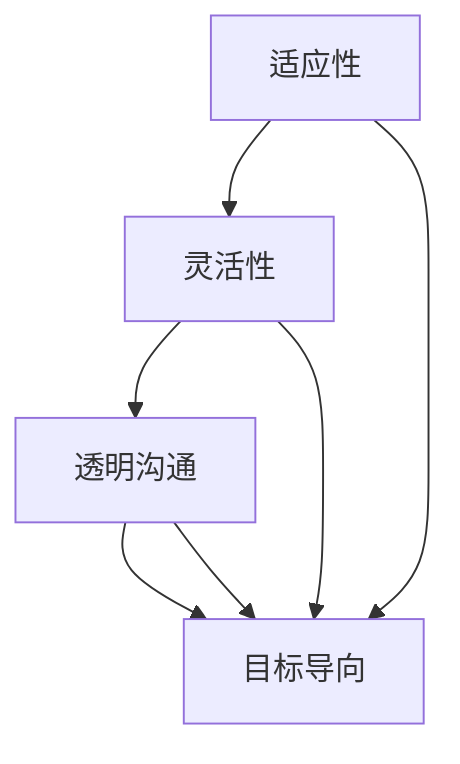

                 

### 第2章：弹性领导的核心概念

#### 2.1 弹性领导的定义

弹性领导是一种适应性和灵活性并重的领导风格，它强调在不确定性环境中保持组织或团队的目标不变，同时灵活地调整策略和行动以应对不断变化的外部环境。弹性领导的核心理念包括以下几个方面：

- **适应性：** 弹性领导者具备快速适应新环境和变化的能力，能够根据实际情况调整决策和行动。
- **灵活性：** 弹性领导鼓励创新和实验，允许团队成员在追求目标的过程中尝试不同的方法和方案。
- **透明沟通：** 弹性领导者强调沟通的透明性，确保团队成员了解组织的现状和目标，增强团队的凝聚力。

#### 2.2 弹性领导的特点

弹性领导具有以下主要特点，使其在不确定性环境中脱颖而出：

- **灵活应对：** 弹性领导者在面对不确定性时能够快速调整策略，确保组织或团队能够持续前进。
- **激励创新：** 弹性领导鼓励创新思维，鼓励团队成员提出新的想法和解决方案。
- **组织学习：** 弹性领导者重视组织学习和知识共享，促进团队成员共同成长。
- **目标导向：** 尽管环境变化无常，但弹性领导确保团队始终保持对目标的清晰认识，不断调整路径以实现目标。

#### 2.3 弹性领导与传统领导力的区别

传统领导力通常依赖于权威、经验和控制，而弹性领导则更加注重灵活性和适应性。以下是两者之间的主要区别：

- **权威与授权：** 传统领导力强调权威，而弹性领导更倾向于授权，鼓励团队成员自主决策。
- **控制与适应：** 传统领导力试图控制环境，而弹性领导则专注于适应环境变化，保持组织的灵活性。
- **稳定与变革：** 传统领导力追求稳定，而弹性领导则能够应对变革，积极引导组织或团队适应新环境。

#### 2.4 弹性领导的核心概念联系

弹性领导的核心概念之间存在着紧密的联系，这些联系构成了弹性领导框架的基础。以下是这些概念之间的联系架构 Mermaid 流程图：

在这个流程图中，适应性、灵活性和透明沟通都是弹性领导的核心概念，它们相互关联并共同作用于目标导向。适应性确保领导者能够应对外部变化，灵活性使得组织能够在变化中保持灵活，而透明沟通则增强了团队的凝聚力，共同推动组织或团队实现目标。

### 第3章：弹性领导的理论框架

#### 3.1 弹性领导框架的基本要素

弹性领导框架由以下几个基本要素构成，它们共同作用于领导者在不确定性环境中的决策和行动：

- **情境分析：** 弹性领导者需要对当前环境进行深入分析，识别关键变量和趋势，以便制定合适的策略。
- **目标设定：** 确定明确的目标是弹性领导的重要步骤，它为组织或团队提供了清晰的方向。
- **策略调整：** 弹性领导者需要根据情境变化灵活调整策略，确保组织始终朝着目标前进。
- **资源分配：** 合理的资源分配是弹性领导的关键，它确保组织能够在不同情境下有效运作。
- **绩效评估：** 定期评估绩效并调整策略，是保持弹性领导的关键步骤。

#### 3.2 弹性领导框架的构成部分

弹性领导框架由以下几个构成部分组成，每个部分都在不确定性环境中发挥关键作用：

- **领导技能：** 弹性领导者需要具备一系列领导技能，包括沟通能力、决策能力、团队建设和冲突解决等。
- **组织文化：** 弹性领导框架中的组织文化应当鼓励创新、包容失败和共享知识，以适应不确定性环境。
- **技术工具：** 技术工具的使用可以增强弹性领导的效率和效果，包括数据分析工具、协作平台和敏捷方法等。
- **管理体系：** 弹性领导框架需要建立一套有效的管理体系，包括绩效评估、反馈机制和风险管理等。

#### 3.3 弹性领导框架的核心逻辑

弹性领导框架的核心逻辑可以概括为以下几个方面：

- **情境敏感性：** 弹性领导者需要具备高度的情境敏感性，能够快速识别和响应环境变化。
- **动态调整：** 在不确定性环境中，领导者需要具备动态调整策略和行动的能力，以适应新的情境。
- **目标一致性：** 在调整策略和行动时，领导者需要确保组织或团队的目标始终一致，避免因环境变化而迷失方向。
- **持续学习：** 弹性领导框架强调持续学习和知识共享，以提升组织的适应能力和创新能力。

### 第4章：弹性领导力的培养与发展

#### 4.1 弹性领导力的关键能力

弹性领导力是一种综合能力，它要求领导者具备以下关键能力：

- **战略思维：** 弹性领导者需要具备长远的战略思维，能够从整体上把握组织的发展方向。
- **创新意识：** 创新意识是弹性领导力的核心，领导者需要鼓励团队尝试新的方法和思路。
- **沟通技巧：** 有效的沟通技巧是弹性领导力的关键，领导者需要能够清晰地表达思想，建立良好的团队沟通。
- **风险管理：** 弹性领导者需要具备良好的风险管理能力，能够预见潜在的风险并制定相应的应对措施。

#### 4.2 弹性领导力的培养途径

培养弹性领导力需要通过以下途径：

- **专业培训：** 参加专业的领导力培训课程，了解弹性领导的理论和实践。
- **实践锻炼：** 通过实际工作中的挑战和机遇，不断锻炼和提升弹性领导能力。
- **经验分享：** 通过参与行业交流、读书会等活动，分享经验，学习他人的成功案例。
- **自我反思：** 定期进行自我反思，分析自己在弹性领导方面的优点和不足，持续改进。

#### 4.3 弹性领导力的评价与提升

对弹性领导力的评价和提升是培养和发展的重要环节：

- **绩效评估：** 通过定期的绩效评估，了解领导者的弹性领导能力，并制定相应的提升计划。
- **反馈机制：** 建立有效的反馈机制，鼓励团队成员提供建设性的反馈，帮助领导者改进。
- **持续发展：** 制定长期的发展计划，确保领导者在不同阶段都能持续提升弹性领导力。
- **创新能力：** 鼓励领导者参与创新项目，通过实践提升创新能力，为组织带来新的发展机遇。

### 第5章：弹性领导在组织中的应用

#### 5.1 弹性领导在组织变革中的作用

在组织变革过程中，弹性领导发挥着至关重要的作用：

- **引领变革：** 弹性领导者能够引导团队面对变革，克服恐惧和不确定感，积极参与变革。
- **沟通协调：** 弹性领导者通过有效的沟通和协调，确保变革过程中各部门和成员之间的合作。
- **持续适应：** 在变革过程中，弹性领导者需要不断调整策略和行动，确保组织能够持续适应外部环境。

#### 5.2 弹性领导在危机管理中的实践

在危机管理中，弹性领导同样不可或缺：

- **快速响应：** 弹性领导者能够迅速响应危机，制定有效的应对措施，减轻危机的影响。
- **风险评估：** 弹性领导者需要对危机进行风险评估，确定关键风险点，并制定相应的缓解措施。
- **资源调配：** 在危机管理中，弹性领导者需要合理调配资源，确保组织能够应对危机。

#### 5.3 弹性领导在创新与可持续发展中的价值

在创新和可持续发展中，弹性领导发挥着关键作用：

- **激励创新：** 弹性领导者鼓励团队成员提出创新想法，通过实验和试错推动创新。
- **持续改进：** 弹性领导者推动组织不断进行改进和优化，确保组织能够持续发展。
- **风险控制：** 在创新过程中，弹性领导者需要控制风险，确保创新项目能够成功落地。

### 第6章：构建弹性领导的文化

#### 6.1 弹性领导文化的定义与特征

弹性领导文化是指一种以弹性领导为核心价值观的组织文化。它具有以下特征：

- **开放包容：** 弹性领导文化鼓励开放和包容，欢迎不同的观点和意见，促进创新和协作。
- **风险承担：** 弹性领导文化倡导风险承担，鼓励团队成员勇于尝试和失败，从中学习和成长。
- **持续学习：** 弹性领导文化强调持续学习，鼓励团队成员不断提升自己的能力和知识。
- **目标导向：** 弹性领导文化以明确的目标为导向，确保组织或团队能够持续朝着共同目标努力。

#### 6.2 弹性领导文化的建设策略

要构建弹性领导文化，组织可以采取以下策略：

- **领导示范：** 领导者通过自身行为树立榜样，展现弹性领导力和开放包容的态度。
- **培训与教育：** 为员工提供弹性领导力和相关技能的培训，帮助员工适应和融入弹性领导文化。
- **激励机制：** 建立激励机制，鼓励员工积极参与创新和变革，提升组织整体的弹性。
- **沟通与反馈：** 加强组织内部的沟通与反馈机制，确保信息畅通，增强团队的凝聚力和协作。

#### 6.3 弹性领导文化的评估与优化

评估弹性领导文化有助于了解其建设效果，并针对不足之处进行优化：

- **员工反馈：** 通过员工反馈了解他们对弹性领导文化的感受和看法，识别存在的问题。
- **关键绩效指标：** 制定关键绩效指标，评估弹性领导文化对组织绩效的影响，如创新能力、员工满意度和组织发展速度等。
- **定期回顾：** 定期回顾弹性领导文化的建设进展，总结经验教训，制定优化方案。

### 第7章：弹性领导力的战略规划

#### 7.1 弹性领导力战略的制定

制定弹性领导力战略是组织实现长期发展的关键。以下是制定弹性领导力战略的步骤：

- **情境分析：** 分析外部环境和内部资源，了解组织的优势和劣势。
- **目标设定：** 确定组织的长期愿景和短期目标，确保目标具有明确性和可实现性。
- **策略规划：** 根据情境分析和目标设定，制定具体的策略和行动方案。
- **资源分配：** 确保资源合理分配，支持弹性领导力战略的实施。
- **风险评估：** 对战略实施过程中可能面临的风险进行评估，并制定相应的应对措施。

#### 7.2 弹性领导力战略的实施

弹性领导力战略的实施是确保战略目标实现的关键环节。以下是实施策略：

- **领导层支持：** 获得领导层的支持和认同，确保战略得到有效执行。
- **培训与赋能：** 为员工提供培训，提升其弹性领导力和相关技能。
- **沟通与协调：** 加强组织内部的沟通与协调，确保各部门和团队之间的协作。
- **监督与评估：** 定期监督战略实施进展，评估效果，及时调整策略和行动。

#### 7.3 弹性领导力战略的评估与调整

对弹性领导力战略进行评估和调整是确保组织持续发展的必要步骤。以下是评估和调整策略：

- **绩效评估：** 评估战略实施的效果，如组织绩效、员工满意度和创新能力等。
- **反馈机制：** 建立有效的反馈机制，收集员工和利益相关者的意见和建议。
- **调整策略：** 根据评估结果和反馈，调整战略和行动方案，确保组织能够应对外部环境的变化。
- **持续改进：** 推动组织持续改进，不断提升弹性领导力和组织绩效。

### 第8章：弹性领导力的情境适应

#### 8.1 弹性领导力的情境分析

情境适应是弹性领导力的核心之一。领导者需要具备以下情境分析能力：

- **识别外部变化：** 时刻关注外部环境的变化，如市场趋势、技术发展和政策变化等。
- **评估内部资源：** 了解组织的内部资源，包括人力资源、财务资源和物质资源等。
- **分析组织优势：** 识别组织的优势和劣势，确保在不确定环境中能够充分发挥优势。
- **识别风险和机遇：** 在情境变化中，领导者需要能够快速识别潜在的风险和机遇，并制定相应的应对策略。

#### 8.2 弹性领导力的情境适应策略

为了有效适应不同情境，领导者可以采取以下策略：

- **快速反应：** 在外部环境发生变化时，领导者需要能够迅速做出反应，调整策略和行动。
- **灵活调整：** 领导者需要根据不同情境灵活调整组织结构和流程，确保组织能够高效运作。
- **创新思维：** 鼓励团队进行创新思维，尝试新的方法和解决方案，以应对不确定性。
- **知识共享：** 加强组织内部的沟通和知识共享，确保团队成员能够及时获取最新的信息和知识。

#### 8.3 弹性领导力的情境适应实践

在实际操作中，领导者可以采取以下情境适应实践：

- **情境分析会议：** 定期召开情境分析会议，讨论外部环境和内部资源的变化，制定相应的应对策略。
- **敏捷方法：** 采用敏捷方法，如敏捷开发、敏捷管理等，提高组织的灵活性和响应速度。
- **实验和试错：** 鼓励团队进行实验和试错，通过不断的实践和反馈，优化情境适应策略。
- **跨部门协作：** 加强跨部门协作，确保不同部门能够在不确定性环境中紧密合作，共同应对挑战。

### 第9章：弹性领导力的案例研究

#### 9.1 国外弹性领导力的经典案例

弹性领导力在全球范围内的成功实践不胜枚举。以下是一些国外弹性领导力的经典案例：

- **谷歌（Google）**：谷歌的创始人拉里·佩奇和谢尔盖·布林通过灵活的战略和创新的思维，成功带领谷歌成为全球最大的搜索引擎公司。他们鼓励员工提出新的想法，并通过实验和试错不断优化产品和服务。
- **特斯拉（Tesla）**：特斯拉的创始人埃隆·马斯克通过强大的领导力和创新精神，成功带领特斯拉成为电动汽车行业的领军企业。他不仅在技术创新上追求卓越，还在组织结构和管理方式上进行了大量的改革，以适应快速变化的市场环境。
- **微软（Microsoft）**：微软的前CEO萨提亚·纳德拉通过倡导团队合作、开放沟通和持续学习，成功带领微软实现转型，使其在云计算和人工智能领域取得巨大成功。他在领导过程中注重倾听员工的意见，并通过透明沟通建立了一个积极向上的组织文化。

#### 9.2 国内弹性领导力的成功实践

国内也有很多企业在弹性领导力方面取得了显著成果。以下是一些国内企业的成功实践：

- **阿里巴巴（Alibaba）**：阿里巴巴的创始人马云通过创新的商业模式和灵活的领导风格，成功带领阿里巴巴成为全球最大的电子商务公司之一。他强调员工自主性和创新思维，建立了开放、包容和高效的组织文化。
- **华为（Huawei）**：华为的创始人任正非通过坚定的信念和战略眼光，带领华为成为全球领先的通信技术企业。他鼓励员工勇于面对挑战，不断追求技术创新，同时保持对市场变化的敏感度。
- **腾讯（Tencent）**：腾讯的创始人马化腾通过灵活的战略布局和强大的执行力，成功带领腾讯成为全球最大的互联网企业之一。他在领导过程中注重团队的协作和创新，推动腾讯在多个领域实现突破。

#### 9.3 弹性领导力的案例启示

通过分析国内外弹性领导力的成功案例，我们可以得到以下启示：

- **创新能力：** 弹性领导力强调创新思维，领导者需要鼓励员工提出新的想法，并通过实验和试错不断优化。
- **适应性：** 面对不确定性环境，领导者需要具备快速适应变化的能力，灵活调整策略和行动。
- **团队协作：** 弹性领导力强调团队协作，领导者需要建立开放、包容和高效的团队文化，促进团队成员之间的沟通和合作。
- **持续学习：** 领导者需要具备持续学习的能力，不断提升自己的领导力和管理技能，以适应不断变化的环境。

### 第10章：科技变革与弹性领导

#### 10.1 科技变革对领导力的影响

科技变革对领导力带来了深远的影响，领导者需要适应这些变化以保持组织的竞争力。以下是科技变革对领导力的影响：

- **信息透明化：** 科技的进步使得信息传播更加迅速和透明，领导者需要更加注重信息的真实性和透明度。
- **数字化管理：** 数字化技术的广泛应用改变了传统的管理方式，领导者需要掌握数字管理工具，提升管理效率。
- **远程工作：** 科技的发展使得远程工作成为可能，领导者需要适应远程工作模式，管理远程团队。
- **人工智能和自动化：** 人工智能和自动化技术的应用改变了传统的工作流程和岗位需求，领导者需要培养员工的新技能，适应新的工作环境。

#### 10.2 科技变革下的弹性领导趋势

在科技变革的背景下，弹性领导趋势呈现出以下特点：

- **敏捷性：** 科技变革要求领导者具备更高的敏捷性，能够快速响应市场变化和技术进步。
- **创新驱动：** 科技变革推动创新成为企业发展的核心驱动力，领导者需要鼓励创新思维，推动组织持续创新。
- **跨界融合：** 科技变革使得各个行业之间的界限变得模糊，领导者需要具备跨界思维，推动组织融合不同领域的资源和能力。
- **数据驱动：** 数据成为决策的重要依据，领导者需要具备数据分析和决策能力，利用数据驱动组织发展。

#### 10.3 科技变革与弹性领导力的融合

科技变革与弹性领导力的融合是未来领导力发展的重要方向，以下是融合的几个关键点：

- **数字化转型：** 领导者需要推动组织的数字化转型，提升组织的信息化和智能化水平。
- **人才培养：** 领导者需要关注员工技能的提升，培养具备数字素养和创新能力的团队。
- **决策支持：** 科技变革为领导者提供了更多的决策支持工具，领导者需要善于利用这些工具提升决策效率。
- **跨领域合作：** 领导者需要推动跨领域的合作，利用不同领域的资源和能力实现组织的创新和发展。

### 第11章：全球化与弹性领导

#### 11.1 全球化背景下的领导力挑战

全球化带来了新的领导力挑战，领导者需要适应这些挑战以保持组织的竞争力。以下是全球化背景下的领导力挑战：

- **文化差异：** 全球化带来了不同文化的碰撞和融合，领导者需要具备跨文化沟通和管理的技能。
- **快速变化：** 全球化市场变化迅速，领导者需要具备快速反应和调整的能力。
- **全球协作：** 全球化要求领导者具备全球视野，推动跨地域团队的协作和合作。
- **法规遵从：** 全球化带来了不同国家和地区的法律法规，领导者需要确保组织在全球范围内的合规性。

#### 11.2 全球化与弹性领导的发展趋势

全球化背景下，弹性领导趋势呈现出以下特点：

- **多元文化领导：** 领导者需要具备多元文化领导能力，能够理解和尊重不同文化背景的员工。
- **全球化思维：** 领导者需要具备全球化思维，关注全球市场动态和趋势。
- **灵活应变：** 领导者需要具备灵活应变的能力，能够迅速适应全球市场的变化。
- **创新驱动：** 全球化推动创新成为企业发展的核心驱动力，领导者需要鼓励创新思维，推动组织持续创新。

#### 11.3 全球化背景下的弹性领导策略

在全球化背景下，领导者可以采取以下弹性领导策略：

- **文化敏感度：** 领导者需要提高文化敏感度，了解不同文化背景的员工需求和行为习惯。
- **全球化团队建设：** 领导者需要推动全球化团队建设，建立跨地域团队的协作和信任。
- **本地化策略：** 领导者需要制定本地化策略，根据不同市场的特点制定相应的业务发展计划。
- **持续学习：** 领导者需要具备持续学习的能力，不断提升自己的领导力和管理技能，以适应全球市场的变化。

### 第12章：未来弹性领导力的趋势与展望

#### 12.1 未来弹性领导力的预测

随着科技的不断进步和社会的快速发展，未来弹性领导力将呈现出以下趋势：

- **智能化：** 智能技术的应用将使领导力更加智能化，领导者需要掌握智能工具和算法，提升决策效率。
- **全球化：** 全球化将进一步深入，领导者需要具备全球视野，推动组织的国际化发展。
- **可持续性：** 可持续发展成为全球共识，领导者需要关注环境保护和社会责任，推动组织的可持续发展。
- **数字化：** 数字化技术将继续影响领导力的发展，领导者需要具备数字素养，推动组织的数字化转型。

#### 12.2 未来弹性领导力的发展趋势

未来弹性领导力的发展趋势将体现在以下几个方面：

- **敏捷性：** 领导者需要具备更高的敏捷性，能够快速适应和应对变化。
- **创新驱动：** 创新将成为组织发展的核心驱动力，领导者需要鼓励创新思维，推动组织持续创新。
- **数据驱动：** 数据将成为决策的重要依据，领导者需要具备数据分析和决策能力，利用数据驱动组织发展。
- **跨界融合：** 跨界融合将成为组织发展的新趋势，领导者需要具备跨界思维，推动组织融合不同领域的资源和能力。

#### 12.3 未来弹性领导力的策略建议

为了应对未来的挑战和趋势，领导者可以采取以下策略：

- **持续学习：** 领导者需要具备持续学习的能力，不断提升自己的领导力和管理技能，以适应不断变化的环境。
- **数字化能力：** 领导者需要提升数字化能力，掌握数字工具和算法，推动组织的数字化转型。
- **跨文化领导：** 领导者需要具备跨文化领导能力，能够理解和尊重不同文化背景的员工。
- **可持续领导：** 领导者需要关注环境保护和社会责任，推动组织的可持续发展。

## 总结

弹性领导力是一种适应性和灵活性并重的领导风格，它在不确定性环境中发挥着关键作用。通过本章的介绍，我们了解了弹性领导力的核心概念、理论框架、培养途径、实践应用以及未来发展趋势。弹性领导力不仅要求领导者具备传统的领导能力，还要能够适应和引导团队应对不确定性。在未来，弹性领导力将继续发展，成为组织持续发展和竞争优势的重要保障。作者：AI天才研究院/AI Genius Institute & 禅与计算机程序设计艺术 /Zen And The Art of Computer Programming

