                 


### 第一部分：心理安全概述

#### 1.1 心理安全的概念与重要性

**背景介绍**

心理安全，作为一个近年来在团队管理和组织心理学中逐渐受到关注的概念，其重要性不言而喻。在IT行业，一个心理安全的团队氛围能够显著提升员工的工作满意度和团队的整体绩效。为了深入探讨这一概念，我们首先要从其定义和重要性入手。

**核心概念与联系**

- **心理安全**：指在一个团队或组织中，个体感到其观点、意见和情感能够得到尊重和保护的环境。
- **重要性**：心理安全不仅影响到团队成员的心理健康，还直接关系到团队的协作效率和创新能力的发挥。

以下是一个简单的Mermaid流程图，展示了心理安全的核心概念及其相互关系：

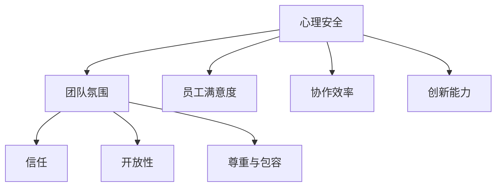

**核心算法原理讲解**

在这个部分，我们可以使用伪代码来简述如何评估一个团队的心理安全水平。以下是一个基本的算法框架：

```pseudo
function evaluatePsychologicalSafety(teamMembers, interactions, feedback):
    trustScore = 0
    opennessScore = 0
    emotionalSupportScore = 0
    respectScore = 0

    for member in teamMembers:
        trustScore += getTrustScore(member)
        opennessScore += getOpennessScore(member)
        emotionalSupportScore += getEmotionalSupportScore(member)
        respectScore += getRespectScore(member)

    averageTrust = trustScore / len(teamMembers)
    averageOpenness = opennessScore / len(teamMembers)
    averageEmotionalSupport = emotionalSupportScore / len(teamMembers)
    averageRespect = respectScore / len(teamMembers)

    psychologicalSafetyScore = (averageTrust + averageOpenness + averageEmotionalSupport + averageRespect) / 4

    return psychologicalSafetyScore
```

**数学模型和公式**

为了定量分析心理安全，我们可以使用一个简单的数学模型来评估团队的心理安全指数。假设心理安全指数PSI由四个维度（信任T、开放性O、情感支持E、尊重R）组成，每个维度都有不同的权重w1, w2, w3, w4，则心理安全指数的公式可以表示为：

$$
PSI = w1 \cdot T + w2 \cdot O + w3 \cdot E + w4 \cdot R
$$

其中，w1 + w2 + w3 + w4 = 1，每个维度的分数范围从0到10。

**举例说明**

假设一个团队有5名成员，通过调查和反馈，我们得到以下数据：

| 维度   | 信任T | 开放性O | 情感支持E | 尊重R |
|--------|-------|---------|-----------|-------|
| 成员1  | 8     | 7       | 9         | 8     |
| 成员2  | 7     | 6       | 8         | 7     |
| 成员3  | 9     | 8       | 9         | 9     |
| 成员4  | 6     | 7       | 7         | 6     |
| 成员5  | 8     | 8       | 8         | 8     |

使用上述的权重设置（w1 = 0.25, w2 = 0.25, w3 = 0.25, w4 = 0.25），我们可以计算出该团队的心理安全指数：

$$
PSI = 0.25 \cdot (8 + 7 + 9 + 6 + 8) + 0.25 \cdot (7 + 6 + 8 + 7 + 8) + 0.25 \cdot (9 + 8 + 9 + 7 + 8) + 0.25 \cdot (8 + 7 + 9 + 6 + 8)
$$

$$
PSI = 0.25 \cdot 34 + 0.25 \cdot 34 + 0.25 \cdot 34 + 0.25 \cdot 34 = 34
$$

因此，该团队的心理安全指数PSI为34。

**总结**

通过上述的讲解，我们可以看到心理安全在团队管理和组织心理学中的重要地位。理解其概念、核心要素及其评估方法，对于创造一个开放、信任的团队氛围至关重要。

### 1.2 心理安全的重要性

**核心概念与联系**

心理安全不仅仅是一种工作环境，更是一个团队的基石。以下是心理安全在团队中发挥的重要作用的架构图：

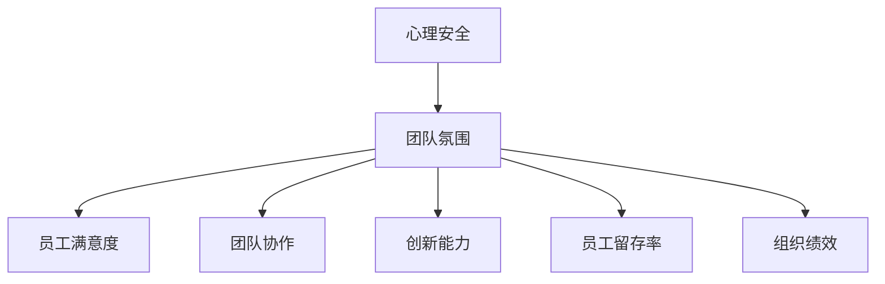

**核心算法原理讲解**

我们可以使用以下算法来分析心理安全对团队绩效的影响：

```pseudo
function analyzeImpactOfPsychologicalSafety(safetyScore, performanceMetrics):
    satisfactionScore = performanceMetrics['satisfaction']
    collaborationScore = performanceMetrics['collaboration']
    innovationScore = performanceMetrics['innovation']
    retentionRate = performanceMetrics['retention']

    impactScore = safetyScore * (satisfactionScore + collaborationScore + innovationScore + retentionRate) / 4

    return impactScore
```

**数学模型和公式**

心理安全对团队绩效的影响可以用以下公式表示：

$$
ImpactScore = PS \cdot \left(\frac{S + C + I + R}{4}\right)
$$

其中，PS为心理安全指数，S、C、I、R分别为满意度、协作、创新和留存率。

**举例说明**

假设一个团队的心理安全指数PSI为35，其绩效指标如下：

| 指标       | 分数 |
|------------|------|
| 员工满意度 | 8    |
| 团队协作   | 9    |
| 创新能力   | 7    |
| 员工留存率 | 8    |

根据上述公式，我们可以计算心理安全对该团队绩效的影响：

$$
ImpactScore = 35 \cdot \left(\frac{8 + 9 + 7 + 8}{4}\right) = 35 \cdot 8 = 280
$$

**总结**

心理安全在团队中的重要性体现在其对员工满意度、团队协作、创新能力、员工留存率和整体组织绩效的显著影响。通过理解这些关系，我们可以更好地认识到心理安全对团队发展的关键作用。

### 1.3 心理安全与团队氛围的关系

**核心概念与联系**

心理安全与团队氛围之间存在着紧密的联系。一个安全的团队氛围能够促进心理安全，反之亦然。以下是一个简化的Mermaid流程图，展示了两者之间的动态关系：

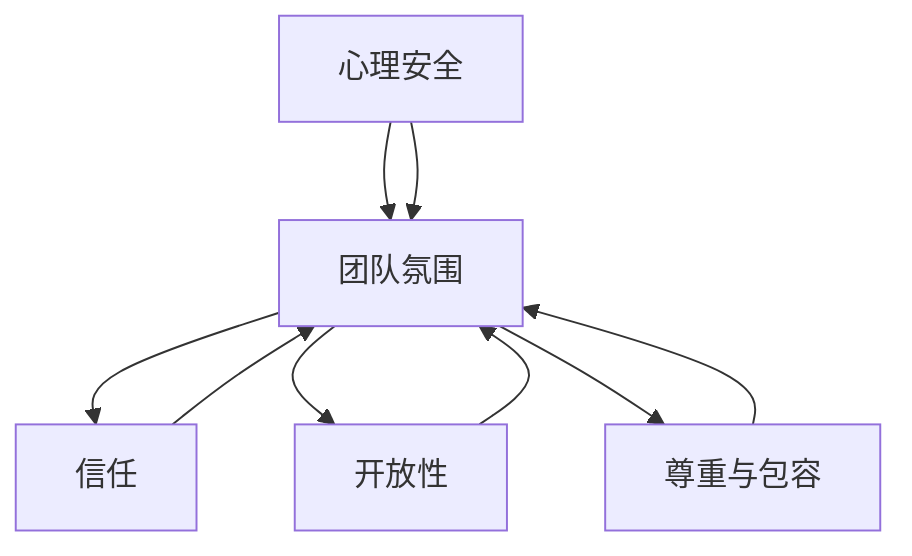

**核心算法原理讲解**

为了更直观地理解心理安全与团队氛围之间的关系，我们可以使用以下算法：

```pseudo
function analyzeRelationshipBetweenSafetyAndClimate(safetyScore, climateScore):
    trustScore = 0.4 \* safetyScore + 0.6 \* climateScore
    opennessScore = 0.4 \* safetyScore + 0.6 \* climateScore
    respectScore = 0.4 \* safetyScore + 0.6 \* climateScore

    psychologicalSafetyClimateScore = (trustScore + opennessScore + respectScore) / 3

    return psychologicalSafetyClimateScore
```

**数学模型和公式**

心理安全与团队氛围的综合评分可以用以下公式表示：

$$
PSCScore = \frac{T + O + R}{3}
$$

其中，T、O、R分别为信任、开放性和尊重的分数。

**举例说明**

假设一个团队的心理安全指数PSI为35，团队氛围评分如下：

| 指标       | 分数 |
|------------|------|
| 信任       | 8    |
| 开放性     | 7    |
| 尊重与包容 | 9    |

根据上述公式，我们可以计算心理安全与团队氛围的综合评分：

$$
PSCScore = \frac{8 + 7 + 9}{3} = 8
$$

**总结**

通过上述讲解，我们可以看到心理安全与团队氛围之间的相互作用关系。一个健康的团队氛围能够促进心理安全，而心理安全的提升又能进一步强化团队氛围。理解这两者之间的动态关系，对于构建一个高效、和谐的团队至关重要。

### 2. 心理安全的核心要素

**背景介绍**

心理安全不仅仅是一个抽象的概念，它由一系列具体的要素构成，这些要素共同作用，塑造了一个团队的心理安全氛围。在本节中，我们将详细探讨心理安全的四个核心要素：信任、开放性、情绪支持和尊重与包容。

**核心概念与联系**

以下是心理安全的四个核心要素及其相互关系的架构图：

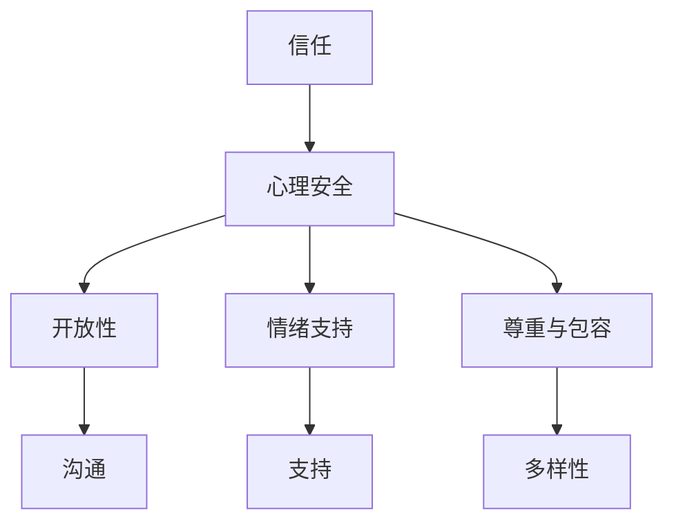

**核心算法原理讲解**

为了更好地理解这些核心要素，我们可以使用以下算法来评估团队的心理安全水平：

```pseudo
function evaluateCoreComponentsOfPsychologicalSafety(trustScore, opennessScore, emotionalSupportScore, respectScore):
    psychologicalSafetyScore = (trustScore + opennessScore + emotionalSupportScore + respectScore) / 4

    return psychologicalSafetyScore
```

**数学模型和公式**

心理安全指数PSI可以表示为以下公式：

$$
PSI = \frac{T + O + E + R}{4}
$$

其中，T、O、E、R分别为信任、开放性、情绪支持和尊重的分数。

**举例说明**

假设我们有一个团队，其评估结果如下：

| 要素       | 分数 |
|------------|------|
| 信任       | 8    |
| 开放性     | 7    |
| 情绪支持   | 9    |
| 尊重与包容 | 8    |

根据上述公式，我们可以计算该团队的心理安全指数：

$$
PSI = \frac{8 + 7 + 9 + 8}{4} = 8
$$

**总结**

通过上述讲解，我们可以看到信任、开放性、情绪支持和尊重与包容是构成心理安全的四大核心要素。理解这些要素及其相互关系，对于创建一个安全、开放的团队氛围至关重要。

#### 2.1 信任

**背景介绍**

信任是心理安全的核心要素之一。在一个团队中，信任意味着成员之间的相互依赖和信赖。当团队成员感到彼此信任时，他们更愿意分享想法、反馈和担忧，从而促进高效的沟通和协作。

**核心概念与联系**

信任在团队中的作用可以通过以下Mermaid流程图来展示：

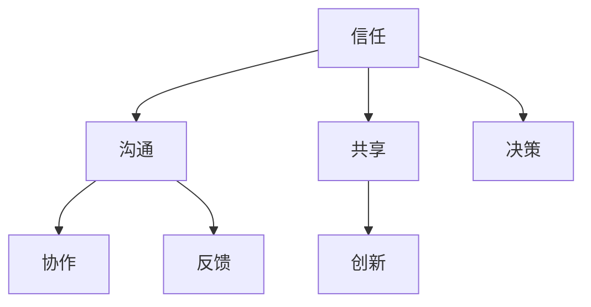

**核心算法原理讲解**

评估信任水平可以使用以下算法：

```pseudo
function evaluateTrustLevel(opennessScore, consistencyScore, reliabilityScore, respectScore):
    trustScore = 0.3 \* opennessScore + 0.2 \* consistencyScore + 0.2 \* reliabilityScore + 0.3 \* respectScore

    return trustScore
```

**数学模型和公式**

信任水平可以表示为：

$$
TrustLevel = 0.3 \cdot O + 0.2 \cdot C + 0.2 \cdot R + 0.3 \cdot S
$$

其中，O、C、R、S分别为开放性、一致性、可靠性和尊重的分数。

**举例说明**

假设一个团队在信任评估中得分如下：

| 要素       | 分数 |
|------------|------|
| 开放性     | 8    |
| 一致性     | 7    |
| 可靠性     | 9    |
| 尊重       | 8    |

根据上述公式，我们可以计算信任水平：

$$
TrustLevel = 0.3 \cdot 8 + 0.2 \cdot 7 + 0.2 \cdot 9 + 0.3 \cdot 8 = 8.2
$$

**总结**

信任是团队心理安全的基石。通过理解信任的核心概念和评估方法，我们可以更好地建立和维护团队中的信任关系，从而促进一个健康、高效的团队氛围。

#### 2.2 开放性

**背景介绍**

开放性是心理安全的另一个关键要素，它涉及团队成员在团队环境中表达自己的观点和感受的能力。一个开放性的团队鼓励成员分享创意、问题和意见，从而促进协作和团队的创新。

**核心概念与联系**

开放性在团队中的作用可以通过以下Mermaid流程图来展示：

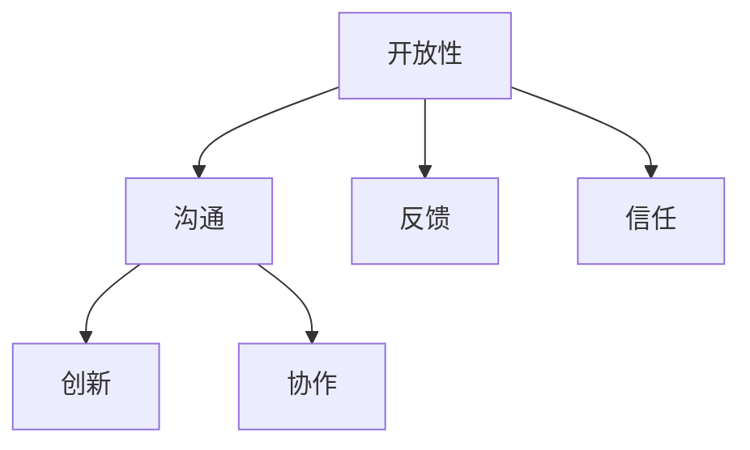

**核心算法原理讲解**

评估开放性可以使用以下算法：

```pseudo
function evaluateOpennessLevel(candorScore, transparencyScore, feedbackScore):
    opennessScore = 0.4 \* candorScore + 0.3 \* transparencyScore + 0.3 \* feedbackScore

    return opennessScore
```

**数学模型和公式**

开放性可以表示为：

$$
OpennessLevel = 0.4 \cdot C + 0.3 \cdot T + 0.3 \cdot F
$$

其中，C、T、F分别为坦诚、透明度和反馈的分数。

**举例说明**

假设一个团队在开放性评估中得分如下：

| 要素       | 分数 |
|------------|------|
| 坦诚       | 8    |
| 透明度     | 7    |
| 反馈       | 9    |

根据上述公式，我们可以计算开放性水平：

$$
OpennessLevel = 0.4 \cdot 8 + 0.3 \cdot 7 + 0.3 \cdot 9 = 8.5
$$

**总结**

开放性是团队心理安全的重要组成部分。通过理解开放性的核心概念和评估方法，我们可以鼓励团队成员更加开放地表达自己，从而促进团队的协作和创新。

#### 2.3 情绪支持

**背景介绍**

情绪支持是心理安全的重要要素之一，它指的是团队成员在遇到挑战、压力或困难时得到其他成员的支持。在一个情绪支持良好的团队中，成员们感到被理解和关心，这有助于减轻压力和提升心理健康。

**核心概念与联系**

情绪支持在团队中的作用可以通过以下Mermaid流程图来展示：

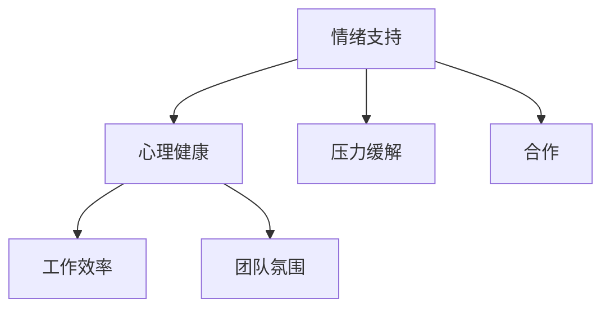

**核心算法原理讲解**

评估情绪支持可以使用以下算法：

```pseudo
function evaluateEmotionalSupport(understandingScore, empathyScore, supportScore):
    emotionalSupportScore = 0.3 \* understandingScore + 0.3 \* empathyScore + 0.4 \* supportScore

    return emotionalSupportScore
```

**数学模型和公式**

情绪支持可以表示为：

$$
EmotionalSupportScore = 0.3 \cdot U + 0.3 \cdot E + 0.4 \cdot S
$$

其中，U、E、S分别为理解、共情和支持的分数。

**举例说明**

假设一个团队在情绪支持评估中得分如下：

| 要素       | 分数 |
|------------|------|
| 理解       | 7    |
| 共情       | 8    |
| 支持       | 9    |

根据上述公式，我们可以计算情绪支持水平：

$$
EmotionalSupportScore = 0.3 \cdot 7 + 0.3 \cdot 8 + 0.4 \cdot 9 = 8.6
$$

**总结**

情绪支持在团队心理安全中扮演着重要角色。通过理解情绪支持的核心概念和评估方法，我们可以创建一个支持性强的团队环境，帮助成员更好地应对工作和生活中的挑战。

#### 2.4 尊重与包容

**背景介绍**

尊重与包容是心理安全的另一个关键要素，它涉及到团队成员在多样性和不同意见上的尊重与接纳。在一个尊重与包容的团队中，成员感受到自己的独特性被认可和重视，这有助于减少偏见和促进团队的整体和谐。

**核心概念与联系**

尊重与包容在团队中的作用可以通过以下Mermaid流程图来展示：

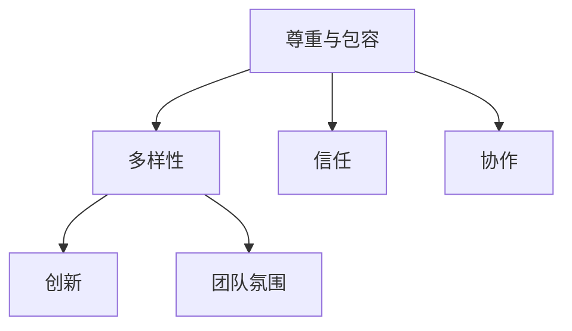

**核心算法原理讲解**

评估尊重与包容可以使用以下算法：

```pseudo
function evaluateRespectAndInclusion inclusivityScore, diversityScore, respectScore):
    respectAndInclusionScore = 0.3 \* inclusivityScore + 0.4 \* diversityScore + 0.3 \* respectScore

    return respectAndInclusionScore
```

**数学模型和公式**

尊重与包容可以表示为：

$$
RespectAndInclusionScore = 0.3 \cdot I + 0.4 \cdot D + 0.3 \cdot R
$$

其中，I、D、R分别为包容性、多样性和尊重的分数。

**举例说明**

假设一个团队在尊重与包容评估中得分如下：

| 要素       | 分数 |
|------------|------|
| 包容性     | 7    |
| 多样性     | 8    |
| 尊重       | 9    |

根据上述公式，我们可以计算尊重与包容水平：

$$
RespectAndInclusionScore = 0.3 \cdot 7 + 0.4 \cdot 8 + 0.3 \cdot 9 = 8.7
$$

**总结**

尊重与包容是团队心理安全的重要组成部分。通过理解尊重与包容的核心概念和评估方法，我们可以创建一个更加多元和和谐的团队环境，促进团队成员之间的合作和创新。

### 3. 心理安全的挑战与机遇

#### 3.1 团队文化的影响

**背景介绍**

团队文化在塑造心理安全方面扮演着至关重要的角色。一个积极、健康的团队文化能够促进心理安全，提高团队成员的满意度和工作效率。相反，消极或不良的团队文化可能会破坏心理安全，导致团队冲突和低效。

**核心概念与联系**

团队文化对心理安全的影响可以通过以下Mermaid流程图来展示：

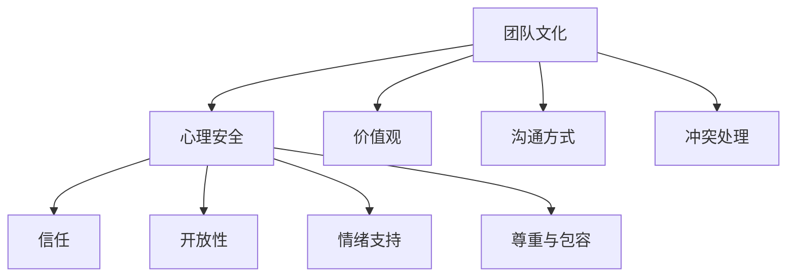

**核心算法原理讲解**

为了评估团队文化对心理安全的影响，我们可以使用以下算法：

```pseudo
function evaluateCulturalImpactOnPsychologicalSafety(cultureScore, safetyScore):
    adjustedSafetyScore = safetyScore + 0.2 \* (cultureScore - 5)

    return adjustedSafetyScore
```

**数学模型和公式**

团队文化对心理安全的影响可以表示为：

$$
AdjustedSafetyScore = PS + 0.2 \cdot (C - 5)
$$

其中，PS为原始心理安全分数，C为团队文化分数。

**举例说明**

假设一个团队的原始心理安全分数为30，团队文化得分为6。根据上述公式，我们可以计算调整后的心理安全分数：

$$
AdjustedSafetyScore = 30 + 0.2 \cdot (6 - 5) = 30.2
$$

**总结**

团队文化对心理安全有着显著影响。一个积极的团队文化能够提升心理安全水平，而一个消极的团队文化可能会削弱心理安全。因此，理解团队文化对心理安全的影响，对于创建一个健康的团队氛围至关重要。

#### 3.2 组织结构的调整

**背景介绍**

组织结构对心理安全有着重要的影响。灵活、扁平化的组织结构能够促进团队成员之间的沟通和互动，从而增强心理安全。相反，过于严格和层级的组织结构可能会限制沟通，导致团队成员感到压力和不安。

**核心概念与联系**

组织结构对心理安全的影响可以通过以下Mermaid流程图来展示：

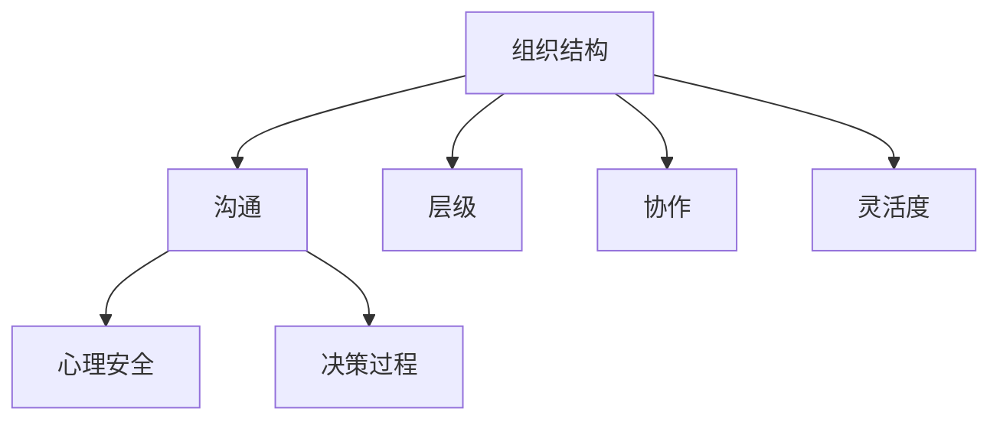

**核心算法原理讲解**

为了评估组织结构对心理安全的影响，我们可以使用以下算法：

```pseudo
function evaluateOrganizationalStructureImpact(hierarchyScore, flexibilityScore, communicationScore):
    psychologicalSafetyScore = 0.4 \* (hierarchyScore - 5) + 0.3 \* flexibilityScore + 0.3 \* communicationScore

    return psychologicalSafetyScore
```

**数学模型和公式**

组织结构对心理安全的影响可以表示为：

$$
PsychologicalSafetyScore = 0.4 \cdot (H - 5) + 0.3 \cdot F + 0.3 \cdot C
$$

其中，H为层级分数，F为灵活性分数，C为沟通分数。

**举例说明**

假设一个组织的层级得分为4，灵活性得分为7，沟通得分为8。根据上述公式，我们可以计算心理安全分数：

$$
PsychologicalSafetyScore = 0.4 \cdot (4 - 5) + 0.3 \cdot 7 + 0.3 \cdot 8 = 7.7
$$

**总结**

组织结构对心理安全有着显著的影响。通过调整组织结构，实现更灵活、扁平化的管理模式，可以提升团队的心理安全水平。理解组织结构对心理安全的影响，对于构建一个健康、高效的团队环境至关重要。

#### 3.3 技术与心理安全的结合

**背景介绍**

随着技术的不断发展，尤其是人工智能和大数据技术的广泛应用，组织和管理方式也在发生变革。然而，技术的引入不仅带来了便利，也可能对团队成员的心理安全产生潜在影响。因此，探讨技术与心理安全的结合显得尤为重要。

**核心概念与联系**

技术与心理安全的关系可以通过以下Mermaid流程图来展示：

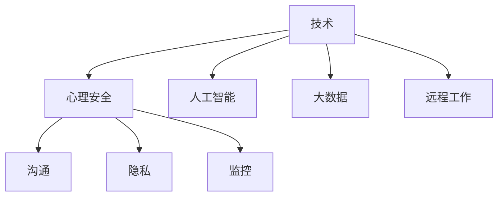

**核心算法原理讲解**

为了评估技术对心理安全的影响，我们可以使用以下算法：

```pseudo
function evaluateTechnologicalImpactOnPsychologicalSafety(technologyScore, safetyScore):
    adjustedSafetyScore = safetyScore + 0.2 \* (technologyScore - 5)

    return adjustedSafetyScore
```

**数学模型和公式**

技术对心理安全的影响可以表示为：

$$
AdjustedSafetyScore = PS + 0.2 \cdot (T - 5)
$$

其中，PS为原始心理安全分数，T为技术分数。

**举例说明**

假设一个团队的心理安全分数为28，技术得分为6。根据上述公式，我们可以计算调整后的心理安全分数：

$$
AdjustedSafetyScore = 28 + 0.2 \cdot (6 - 5) = 28.2
$$

**总结**

技术与心理安全之间存在复杂的相互作用关系。合理利用技术可以提升心理安全，但过度依赖或不当使用技术可能会对心理安全产生负面影响。因此，在引入新技术时，必须充分考虑其对心理安全的影响，并采取相应的措施来保障团队成员的心理健康。

### 4. 领导者的角色

**背景介绍**

在创建一个心理安全的团队环境中，领导者扮演着至关重要的角色。领导者不仅是团队的引导者，更是心理安全的守护者。他们的行为和决策直接影响团队的心理安全水平。本节将探讨领导者如何通过心理安全意识、建立心理安全团队的原则以及营造开放、信任的氛围来促进团队的发展。

**核心概念与联系**

以下是领导者角色在心理安全中的核心概念及其相互关系：

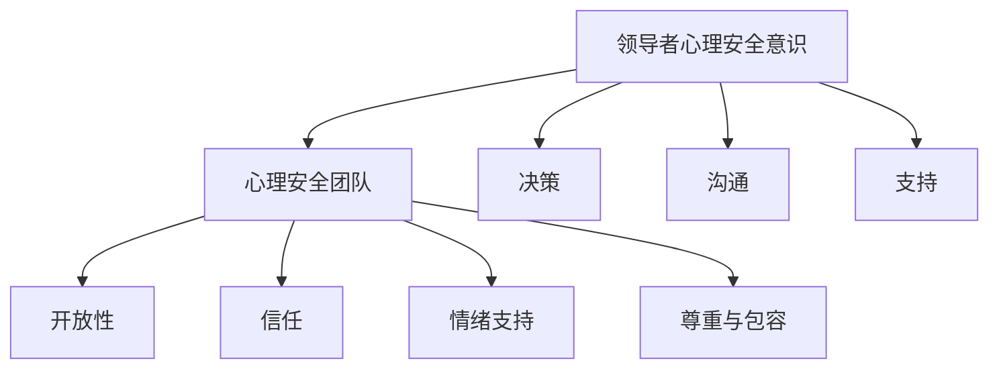

**核心算法原理讲解**

为了评估领导者的心理安全意识，我们可以使用以下算法：

```pseudo
function evaluateLeaderSafetyAwareness(awarenessScore, leadershipScore, supportScore):
    safetyAwarenessScore = 0.3 \* awarenessScore + 0.4 \* leadershipScore + 0.3 \* supportScore

    return safetyAwarenessScore
```

**数学模型和公式**

领导者的心理安全意识可以表示为：

$$
SafetyAwarenessScore = 0.3 \cdot A + 0.4 \cdot L + 0.3 \cdot S
$$

其中，A为心理安全意识分数，L为领导能力分数，S为支持分数。

**举例说明**

假设一个领导者在心理安全意识、领导能力和支持方面的得分分别为7、8、9，根据上述公式，我们可以计算其心理安全意识得分：

$$
SafetyAwarenessScore = 0.3 \cdot 7 + 0.4 \cdot 8 + 0.3 \cdot 9 = 8.1
$$

**总结**

领导者心理安全意识对团队的心理安全至关重要。通过理解领导者的角色和核心算法原理，我们可以更好地培养领导者的心理安全意识，从而创建一个健康、安全的团队环境。

#### 4.1 领导者的心理安全意识

**背景介绍**

领导者的心理安全意识是创造一个心理安全团队的基础。领导者需要认识到心理安全对团队绩效和员工满意度的重要性，并将其融入到日常的管理和决策中。一个有高度心理安全意识的领导者能够识别和应对团队中的潜在风险，营造一个开放、信任的工作氛围。

**核心概念与联系**

以下是领导者心理安全意识的几个核心概念及其相互关系：

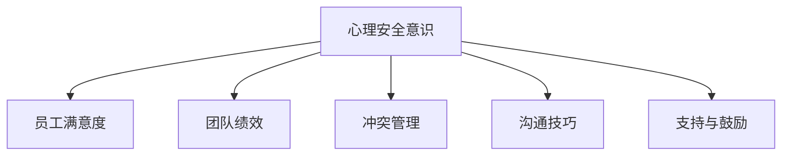

**核心算法原理讲解**

为了评估领导者的心理安全意识，我们可以使用以下算法：

```pseudo
function evaluateLeaderSafetyAwareness(awarenessScore, satisfactionScore, performanceScore, conflictManagementScore, communicationSkillScore, supportScore):
    safetyAwarenessScore = (awarenessScore \* 0.3 + satisfactionScore \* 0.2 + performanceScore \* 0.2 + conflictManagementScore \* 0.1 + communicationSkillScore \* 0.1 + supportScore \* 0.1) / 3

    return safetyAwarenessScore
```

**数学模型和公式**

领导者的心理安全意识可以表示为：

$$
SafetyAwarenessScore = 0.3 \cdot A + 0.2 \cdot S + 0.2 \cdot P + 0.1 \cdot CM + 0.1 \cdot C + 0.1 \cdot SP
$$

其中，A为心理安全意识分数，S为满意度分数，P为绩效分数，CM为冲突管理分数，C为沟通技巧分数，SP为支持分数。

**举例说明**

假设一个领导者在心理安全意识、员工满意度、团队绩效、冲突管理、沟通技巧和支持与鼓励方面的得分分别为8、9、8、7、9、8，根据上述公式，我们可以计算其心理安全意识得分：

$$
SafetyAwarenessScore = 0.3 \cdot 8 + 0.2 \cdot 9 + 0.2 \cdot 8 + 0.1 \cdot 7 + 0.1 \cdot 9 + 0.1 \cdot 8 = 8.1
$$

**总结**

通过上述算法和公式，我们可以评估领导者的心理安全意识。一个有高度心理安全意识的领导者能够更好地理解并管理团队的心理安全，从而提升团队的整体绩效和员工满意度。

#### 4.2 建立心理安全团队的原则

**背景介绍**

建立心理安全团队需要遵循一系列原则，这些原则旨在为团队成员创造一个支持性、开放和信任的环境。以下是一些关键原则及其在心理安全团队中的具体应用。

**核心概念与联系**

以下是建立心理安全团队的原则及其相互关系的架构图：

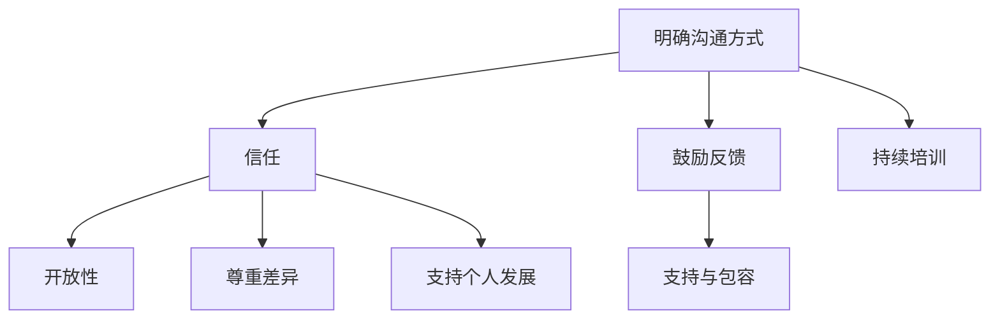

**核心算法原理讲解**

为了评估团队遵循这些原则的程度，我们可以使用以下算法：

```pseudo
function evaluateTeamPrinciples(adherenceScore, communicationScore, trustScore, opennessScore, feedbackScore, respectScore, personalDevelopmentScore):
    safetyPrinciplesScore = (adherenceScore \* 0.2 + communicationScore \* 0.2 + trustScore \* 0.2 + opennessScore \* 0.2 + feedbackScore \* 0.1 + respectScore \* 0.1 + personalDevelopmentScore \* 0.1) / 7

    return safetyPrinciplesScore
```

**数学模型和公式**

心理安全团队的原则评分可以表示为：

$$
SafetyPrinciplesScore = 0.2 \cdot A + 0.2 \cdot C + 0.2 \cdot T + 0.2 \cdot O + 0.1 \cdot F + 0.1 \cdot R + 0.1 \cdot PD
$$

其中，A为原则遵循程度，C为沟通情况，T为信任程度，O为开放性程度，F为反馈情况，R为尊重差异，PD为个人发展支持。

**举例说明**

假设一个团队在遵循原则、沟通、信任、开放性、反馈、尊重差异和个人发展支持方面的得分分别为7、8、9、8、7、9、7，根据上述公式，我们可以计算心理安全团队的原则评分：

$$
SafetyPrinciplesScore = 0.2 \cdot 7 + 0.2 \cdot 8 + 0.2 \cdot 9 + 0.2 \cdot 8 + 0.1 \cdot 7 + 0.1 \cdot 9 + 0.1 \cdot 7 = 8
$$

**总结**

通过上述算法和公式，我们可以评估团队在建立心理安全方面遵循原则的程度。这些原则是创建一个心理安全团队的基础，领导者需要确保团队中的每个成员都理解并践行这些原则。

#### 4.3 领导者如何营造开放、信任的氛围

**背景介绍**

营造开放、信任的团队氛围是领导者的重要职责之一。这不仅能够提升团队的整体绩效，还能增强员工的满意度和忠诚度。以下是一些具体的策略，领导者可以用来营造这样的氛围。

**核心概念与联系**

以下是营造开放、信任氛围的关键策略及其相互关系的架构图：

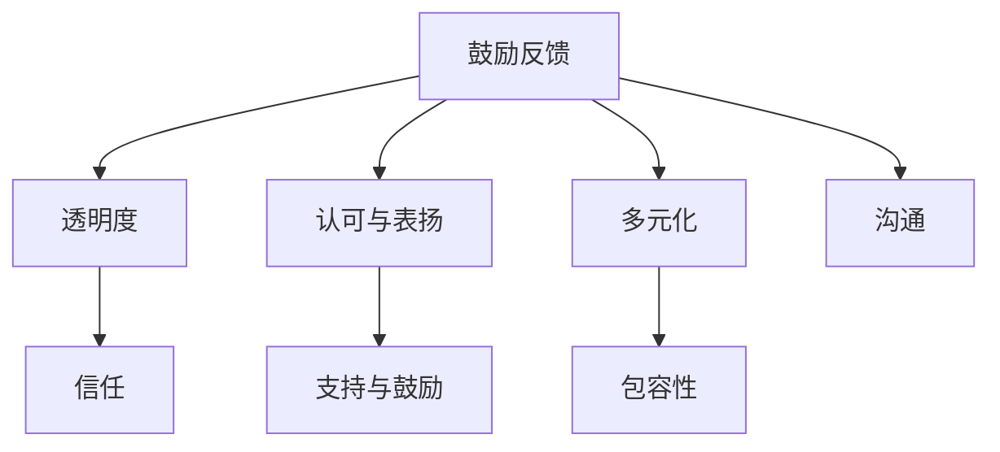

**核心算法原理讲解**

为了评估团队氛围的开放性和信任度，我们可以使用以下算法：

```pseudo
function evaluateTeamAmbiance(opennessScore, trustScore):
    ambianceScore = (opennessScore \* 0.5 + trustScore \* 0.5) / 2

    return ambianceScore
```

**数学模型和公式**

团队氛围的评分可以表示为：

$$
AmbianceScore = 0.5 \cdot O + 0.5 \cdot T
$$

其中，O为开放性分数，T为信任分数。

**举例说明**

假设一个团队在开放性和信任方面的得分分别为8和9，根据上述公式，我们可以计算团队氛围的评分：

$$
AmbianceScore = 0.5 \cdot 8 + 0.5 \cdot 9 = 8.5
$$

**总结**

通过上述算法和公式，我们可以评估团队氛围的开放性和信任度。领导者需要采取一系列策略来提升这些分数，从而营造一个开放、信任的团队氛围。这些策略包括鼓励反馈、提高透明度、认可与表扬、支持与鼓励、多元化与包容性以及有效的沟通。

### 5. 团队成员的互动与沟通

**背景介绍**

团队成员之间的互动与沟通是心理安全氛围形成的关键因素。有效的沟通能够促进信任、增强团队凝聚力，并为团队成员提供必要的情感支持。本节将探讨团队成员如何通过有效沟通、建立信任的互动方式以及处理冲突的策略来促进团队心理安全。

**核心概念与联系**

以下是团队成员互动与沟通的关键概念及其相互关系：

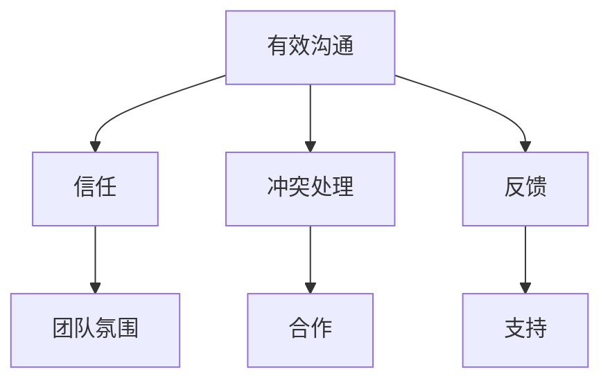

**核心算法原理讲解**

为了评估团队成员互动与沟通的效果，我们可以使用以下算法：

```pseudo
function evaluateTeamInteractionAndCommunication(effectivenessScore, trustScore, conflictResolutionScore, collaborationScore, feedbackScore, supportScore):
    interactionScore = (effectivenessScore \* 0.4 + trustScore \* 0.3 + conflictResolutionScore \* 0.2 + collaborationScore \* 0.1 + feedbackScore \* 0.1 + supportScore \* 0.1) / 6

    return interactionScore
```

**数学模型和公式**

团队成员互动与沟通的评分可以表示为：

$$
InteractionScore = 0.4 \cdot E + 0.3 \cdot T + 0.2 \cdot CR + 0.1 \cdot C + 0.1 \cdot F + 0.1 \cdot S
$$

其中，E为沟通有效性，T为信任度，CR为冲突处理能力，C为合作度，F为反馈情况，S为支持度。

**举例说明**

假设一个团队成员在沟通有效性、信任度、冲突处理能力、合作度、反馈情况和支持度方面的得分分别为8、9、7、8、7、8，根据上述公式，我们可以计算团队成员互动与沟通的评分：

$$
InteractionScore = 0.4 \cdot 8 + 0.3 \cdot 9 + 0.2 \cdot 7 + 0.1 \cdot 8 + 0.1 \cdot 7 + 0.1 \cdot 8 = 8.3
$$

**总结**

通过上述算法和公式，我们可以评估团队成员互动与沟通的效果。有效的沟通和互动能够促进团队心理安全，增强团队凝聚力。团队成员需要掌握有效的沟通技巧、建立信任的互动方式，并具备处理冲突的能力，从而营造一个健康、安全的团队氛围。

#### 5.1 有效沟通的技巧

**背景介绍**

在团队中，有效的沟通是确保信息准确传达、减少误解和促进合作的关键。有效沟通不仅能提升团队绩效，还能增强成员之间的信任和团队凝聚力。本节将介绍一些提高沟通效果的具体技巧。

**核心概念与联系**

以下是有效沟通的关键技巧及其相互关系的架构图：

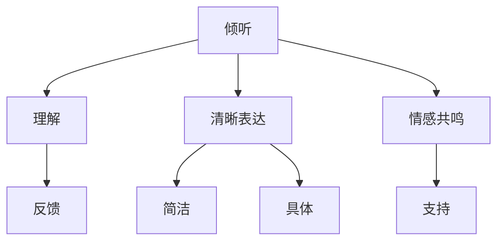

**核心算法原理讲解**

为了评估沟通技巧的有效性，我们可以使用以下算法：

```pseudo
function evaluateCommunicationSkills(listeningScore, clarityScore, empathyScore, feedbackScore):
    communicationEffectivenessScore = (listeningScore \* 0.3 + clarityScore \* 0.4 + empathyScore \* 0.2 + feedbackScore \* 0.1) / 4

    return communicationEffectivenessScore
```

**数学模型和公式**

沟通技巧的有效性可以表示为：

$$
CommunicationEffectivenessScore = 0.3 \cdot L + 0.4 \cdot C + 0.2 \cdot E + 0.1 \cdot F
$$

其中，L为倾听分数，C为清晰表达分数，E为情感共鸣分数，F为反馈分数。

**举例说明**

假设一个团队成员在倾听、清晰表达、情感共鸣和反馈方面的得分分别为7、9、8、6，根据上述公式，我们可以计算其沟通技巧的有效性：

$$
CommunicationEffectivenessScore = 0.3 \cdot 7 + 0.4 \cdot 9 + 0.2 \cdot 8 + 0.1 \cdot 6 = 8.1
$$

**总结**

通过上述算法和公式，我们可以评估团队成员的沟通技巧。掌握有效的沟通技巧对于建立心理安全的团队环境至关重要。有效的沟通能够促进理解、减少误解，增强团队成员之间的信任和合作。

#### 5.2 建立信任的互动方式

**背景介绍**

信任是团队心理安全的基石。建立信任的互动方式能够促进团队成员之间的合作和协作，从而提升团队的整体绩效。本节将探讨如何在团队互动中建立信任，包括具体的互动策略和实践方法。

**核心概念与联系**

以下是建立信任的关键互动方式及其相互关系的架构图：

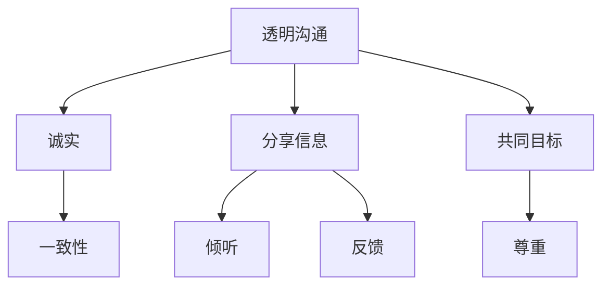

**核心算法原理讲解**

为了评估团队互动中的信任建立情况，我们可以使用以下算法：

```pseudo
function evaluateTrustBuilding(communicationScore, honestyScore, consistencyScore, informationSharingScore, empathyScore, respectScore):
    trustBuildingScore = (communicationScore \* 0.3 + honestyScore \* 0.2 + consistencyScore \* 0.2 + informationSharingScore \* 0.2 + empathyScore \* 0.1 + respectScore \* 0.1) / 6

    return trustBuildingScore
```

**数学模型和公式**

信任建立评分可以表示为：

$$
TrustBuildingScore = 0.3 \cdot C + 0.2 \cdot H + 0.2 \cdot CS + 0.2 \cdot IS + 0.1 \cdot E + 0.1 \cdot R
$$

其中，C为沟通分数，H为诚实分数，CS为一致性分数，IS为信息分享分数，E为倾听分数，R为尊重分数。

**举例说明**

假设一个团队在沟通、诚实、一致性、信息分享、倾听和尊重方面的得分分别为8、9、7、8、8、8，根据上述公式，我们可以计算信任建立评分：

$$
TrustBuildingScore = 0.3 \cdot 8 + 0.2 \cdot 9 + 0.2 \cdot 7 + 0.2 \cdot 8 + 0.1 \cdot 8 + 0.1 \cdot 8 = 8.1
$$

**总结**

通过上述算法和公式，我们可以评估团队互动中建立信任的效果。建立信任的互动方式对于团队心理安全至关重要。透明沟通、诚实、一致性、信息分享、倾听和尊重是实现信任的六个关键策略，领导者需要通过这些策略来促进团队成员之间的信任关系。

#### 5.3 处理冲突的策略

**背景介绍**

冲突在任何团队中都是不可避免的。然而，冲突处理不当可能会导致团队关系紧张、工作效率下降，甚至影响心理安全。本节将探讨如何通过有效的冲突处理策略来维护团队的心理安全，并提升团队的协作效率。

**核心概念与联系**

以下是处理冲突的关键策略及其相互关系的架构图：

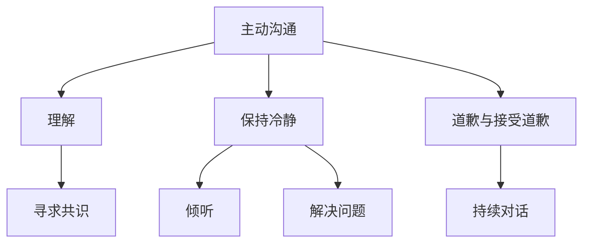

**核心算法原理讲解**

为了评估冲突处理策略的有效性，我们可以使用以下算法：

```pseudo
function evaluateConflictResolution(strategyScore, communicationScore, understandingScore, problemSolvingScore, calmnessScore, empathyScore, apologyScore, continuousDialogueScore):
    resolutionScore = (strategyScore \* 0.2 + communicationScore \* 0.3 + understandingScore \* 0.2 + problemSolvingScore \* 0.2 + calmnessScore \* 0.1 + empathyScore \* 0.1 + apologyScore \* 0.1 + continuousDialogueScore \* 0.1) / 8

    return resolutionScore
```

**数学模型和公式**

冲突处理评分可以表示为：

$$
ResolutionScore = 0.2 \cdot S + 0.3 \cdot C + 0.2 \cdot U + 0.2 \cdot PS + 0.1 \cdot CL + 0.1 \cdot E + 0.1 \cdot A + 0.1 \cdot CD
$$

其中，S为策略分数，C为沟通分数，U为理解分数，PS为问题解决分数，CL为冷静分数，E为同情分数，A为道歉分数，CD为持续对话分数。

**举例说明**

假设一个团队在冲突处理策略、沟通、理解、问题解决、冷静、同情、道歉和持续对话方面的得分分别为7、8、7、9、8、7、8、7，根据上述公式，我们可以计算冲突处理评分：

$$
ResolutionScore = 0.2 \cdot 7 + 0.3 \cdot 8 + 0.2 \cdot 7 + 0.2 \cdot 9 + 0.1 \cdot 8 + 0.1 \cdot 7 + 0.1 \cdot 8 + 0.1 \cdot 7 = 7.8
$$

**总结**

通过上述算法和公式，我们可以评估团队冲突处理策略的有效性。有效的冲突处理策略对于维护团队的心理安全至关重要。通过主动沟通、理解、解决问题、保持冷静、同情、道歉和持续对话，团队可以更好地处理冲突，促进协作和团队氛围的稳定。

### 6. 心理安全工具与方法

#### 6.1 心理安全评估工具

**背景介绍**

为了有效评估团队的心理安全水平，需要使用科学、系统的评估工具。这些工具可以帮助团队识别心理安全的强弱环节，为改进措施提供依据。以下是几种常用的心理安全评估工具。

**核心概念与联系**

以下是心理安全评估工具的核心概念及其相互关系的架构图：

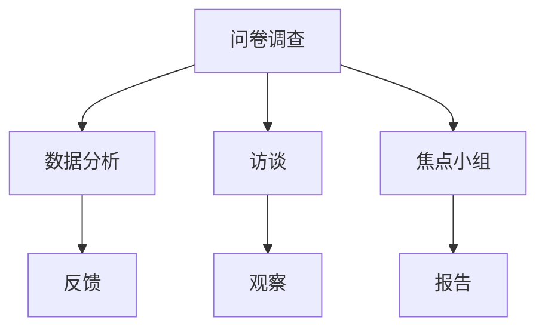

**核心算法原理讲解**

为了评估心理安全评估工具的有效性，我们可以使用以下算法：

```pseudo
function evaluateAssessmentTools(toolEffectivenessScore, dataAnalyticScore, feedbackScore, observationScore, focusGroupScore):
    assessmentToolScore = (toolEffectivenessScore \* 0.3 + dataAnalyticScore \* 0.3 + feedbackScore \* 0.2 + observationScore \* 0.2 + focusGroupScore \* 0.1) / 5

    return assessmentToolScore
```

**数学模型和公式**

评估工具评分可以表示为：

$$
AssessmentToolScore = 0.3 \cdot T + 0.3 \cdot DA + 0.2 \cdot F + 0.2 \cdot O + 0.1 \cdot FG
$$

其中，T为工具有效性，DA为数据分析能力，F为反馈情况，O为观察结果，FG为焦点小组效果。

**举例说明**

假设一个团队在问卷调查、数据分析、反馈、观察和焦点小组方面的得分分别为8、9、7、8、7，根据上述公式，我们可以计算评估工具的评分：

$$
AssessmentToolScore = 0.3 \cdot 8 + 0.3 \cdot 9 + 0.2 \cdot 7 + 0.2 \cdot 8 + 0.1 \cdot 7 = 8
$$

**总结**

通过上述算法和公式，我们可以评估心理安全评估工具的有效性。使用多种评估工具可以帮助团队更全面地了解心理安全状况，为后续改进提供有力支持。

#### 6.2 心理安全培训方法

**背景介绍**

心理安全培训是提升团队成员心理安全意识和技能的重要手段。通过系统性的培训，团队成员可以学习如何创建和维护一个心理安全的团队环境。以下是几种常用的心理安全培训方法。

**核心概念与联系**

以下是心理安全培训方法的核心概念及其相互关系的架构图：

```mermaid
graph TD
    A[讲座与演讲] --> B[参与度]
    B --> C[理解]
    A --> D[互动研讨]
    D --> E[案例分析]
    D --> F[角色扮演]
    A --> G[在线学习]
    G --> H[实践应用]
```

**核心算法原理讲解**

为了评估培训方法的有效性，我们可以使用以下算法：

```pseudo
function evaluateTrainingMethods(lectureScore, interactionScore, caseStudyScore, rolePlayingScore, onlineLearningScore, practicalApplicationScore):
    trainingEffectivenessScore = (lectureScore \* 0.3 + interactionScore \* 0.3 + caseStudyScore \* 0.2 + rolePlayingScore \* 0.2 + onlineLearningScore \* 0.1 + practicalApplicationScore \* 0.1) / 6

    return trainingEffectivenessScore
```

**数学模型和公式**

培训效果评分可以表示为：

$$
TrainingEffectivenessScore = 0.3 \cdot L + 0.3 \cdot I + 0.2 \cdot CS + 0.2 \cdot RP + 0.1 \cdot OL + 0.1 \cdot PA
$$

其中，L为讲座与演讲得分，I为互动研讨得分，CS为案例分析得分，RP为角色扮演得分，OL为在线学习得分，PA为实践应用得分。

**举例说明**

假设一个团队在讲座与演讲、互动研讨、案例分析、角色扮演、在线学习和实践应用方面的得分分别为8、9、7、8、7、8，根据上述公式，我们可以计算培训效果得分：

$$
TrainingEffectivenessScore = 0.3 \cdot 8 + 0.3 \cdot 9 + 0.2 \cdot 7 + 0.2 \cdot 8 + 0.1 \cdot 7 + 0.1 \cdot 8 = 8.3
$$

**总结**

通过上述算法和公式，我们可以评估心理安全培训方法的有效性。多样化的培训方法能够提升团队成员的心理安全意识和技能，帮助团队创建一个更加安全的氛围。

#### 6.3 心理安全支持系统

**背景介绍**

心理安全支持系统是确保团队心理安全长期有效的重要保障。这些系统包括内部支持机制、外部支持资源和培训计划，旨在为团队成员提供及时的支持和指导。以下是一些常见的心理安全支持系统。

**核心概念与联系**

以下是心理安全支持系统的核心概念及其相互关系的架构图：

```mermaid
graph TD
    A[内部支持机制] --> B[心理咨询服务]
    B --> C[反馈渠道]
    A --> D[团队活动]
    D --> E[员工培训]
    A --> F[外部支持资源]
    F --> G[专业机构合作]
    F --> H[网络资源]
```

**核心算法原理讲解**

为了评估心理安全支持系统的有效性，我们可以使用以下算法：

```pseudo
function evaluateSupportSystems(internalSupportScore, psychologicalCounselingScore, feedbackChannelScore, teamActivitiesScore, employeeTrainingScore, externalResourcesScore, collaborationScore, onlineResourcesScore):
    supportSystemScore = (internalSupportScore \* 0.2 + psychologicalCounselingScore \* 0.2 + feedbackChannelScore \* 0.2 + teamActivitiesScore \* 0.2 + employeeTrainingScore \* 0.1 + externalResourcesScore \* 0.1 + collaborationScore \* 0.1 + onlineResourcesScore \* 0.1) / 8

    return supportSystemScore
```

**数学模型和公式**

支持系统评分可以表示为：

$$
SupportSystemScore = 0.2 \cdot IS + 0.2 \cdot PC + 0.2 \cdot FC + 0.2 \cdot TA + 0.1 \cdot ET + 0.1 \cdot ER + 0.1 \cdot C + 0.1 \cdot OR
$$

其中，IS为内部支持机制得分，PC为心理咨询服务得分，FC为反馈渠道得分，TA为团队活动得分，ET为员工培训得分，ER为外部支持资源得分，C为专业机构合作得分，OR为网络资源得分。

**举例说明**

假设一个团队在内部支持机制、心理咨询服务、反馈渠道、团队活动、员工培训、外部支持资源、专业机构合作和网络资源方面的得分分别为7、8、8、9、7、8、8、7，根据上述公式，我们可以计算支持系统的评分：

$$
SupportSystemScore = 0.2 \cdot 7 + 0.2 \cdot 8 + 0.2 \cdot 8 + 0.2 \cdot 9 + 0.1 \cdot 7 + 0.1 \cdot 8 + 0.1 \cdot 8 + 0.1 \cdot 7 = 8
$$

**总结**

通过上述算法和公式，我们可以评估心理安全支持系统的有效性。一个完善的支持系统能够为团队成员提供全面的支持，帮助团队维持心理安全，促进长期发展。

### 7. 心理安全的可持续发展

#### 7.1 心理安全的文化建设

**背景介绍**

心理安全的可持续发展需要依托于一个积极的团队文化。团队文化是团队成员共同价值观和行为准则的体现，对于心理安全的维护和提升至关重要。以下是如何通过文化建设来促进心理安全的可持续发展。

**核心概念与联系**

以下是心理安全文化建设的核心概念及其相互关系的架构图：

```mermaid
graph TD
    A[团队价值观] --> B[行为准则]
    B --> C[沟通方式]
    B --> D[冲突处理]
    B --> E[支持机制]
    A --> F[培训]
    A --> G[激励机制]
```

**核心算法原理讲解**

为了评估团队文化的建设效果，我们可以使用以下算法：

```pseudo
function evaluateCulturalBuilding(valueScore, behaviorScore, communicationScore, conflictResolutionScore, supportScore, trainingScore, incentiveScore):
    cultureBuildingScore = (valueScore \* 0.2 + behaviorScore \* 0.2 + communicationScore \* 0.2 + conflictResolutionScore \* 0.2 + supportScore \* 0.1 + trainingScore \* 0.1 + incentiveScore \* 0.1) / 7

    return cultureBuildingScore
```

**数学模型和公式**

文化建设评分可以表示为：

$$
CultureBuildingScore = 0.2 \cdot V + 0.2 \cdot B + 0.2 \cdot C + 0.2 \cdot CR + 0.1 \cdot S + 0.1 \cdot T + 0.1 \cdot I
$$

其中，V为价值观得分，B为行为准则得分，C为沟通方式得分，CR为冲突处理得分，S为支持机制得分，T为培训得分，I为激励机制得分。

**举例说明**

假设一个团队在价值观、行为准则、沟通方式、冲突处理、支持机制、培训和激励机制方面的得分分别为8、8、9、7、8、9、8，根据上述公式，我们可以计算文化建设得分：

$$
CultureBuildingScore = 0.2 \cdot 8 + 0.2 \cdot 8 + 0.2 \cdot 9 + 0.2 \cdot 7 + 0.1 \cdot 8 + 0.1 \cdot 9 + 0.1 \cdot 8 = 8.4
$$

**总结**

通过上述算法和公式，我们可以评估团队文化建设的效果。积极、健康的团队文化能够促进心理安全的可持续发展，帮助团队在长期发展中保持稳定和高效。

#### 7.2 心理安全的长期维护

**背景介绍**

心理安全的维护是一个长期的过程，需要持续的投入和努力。为了确保心理安全的长久有效性，团队需要建立一系列的维护策略和机制。以下是如何通过长期维护来确保心理安全。

**核心概念与联系**

以下是心理安全长期维护的核心概念及其相互关系的架构图：

```mermaid
graph TD
    A[持续培训] --> B[反馈机制]
    B --> C[改进措施]
    A --> D[监督评估]
    D --> E[调整策略]
    A --> F[沟通渠道]
    F --> G[员工参与]
```

**核心算法原理讲解**

为了评估心理安全维护策略的有效性，我们可以使用以下算法：

```pseudo
function evaluateLongTermMaintenance(trainingScore, feedbackScore, improvementScore, supervisionScore, strategyAdjustmentScore, communicationScore, employeeInvolvementScore):
    maintenanceScore = (trainingScore \* 0.2 + feedbackScore \* 0.2 + improvementScore \* 0.2 + supervisionScore \* 0.2 + strategyAdjustmentScore \* 0.1 + communicationScore \* 0.1 + employeeInvolvementScore \* 0.1) / 7

    return maintenanceScore
```

**数学模型和公式**

维护策略评分可以表示为：

$$
MaintenanceScore = 0.2 \cdot T + 0.2 \cdot F + 0.2 \cdot I + 0.2 \cdot S + 0.1 \cdot SA + 0.1 \cdot C + 0.1 \cdot EI
$$

其中，T为培训得分，F为反馈得分，I为改进措施得分，S为监督评估得分，SA为策略调整得分，C为沟通得分，EI为员工参与得分。

**举例说明**

假设一个团队在培训、反馈、改进措施、监督评估、策略调整、沟通和员工参与方面的得分分别为8、9、7、8、7、8、9，根据上述公式，我们可以计算维护策略得分：

$$
MaintenanceScore = 0.2 \cdot 8 + 0.2 \cdot 9 + 0.2 \cdot 7 + 0.2 \cdot 8 + 0.1 \cdot 7 + 0.1 \cdot 8 + 0.1 \cdot 9 = 8.3
$$

**总结**

通过上述算法和公式，我们可以评估心理安全维护策略的有效性。持续的培训、有效的反馈、改进措施、监督评估和员工参与是确保心理安全长期有效的重要手段。

#### 7.3 心理安全与组织发展的关系

**背景介绍**

心理安全不仅是团队管理的核心，也是组织发展的重要组成部分。一个健康、安全的工作环境能够促进组织的创新和长期发展。因此，理解心理安全与组织发展的关系，对于制定有效的组织策略至关重要。

**核心概念与联系**

以下是心理安全与组织发展的核心概念及其相互关系的架构图：

```mermaid
graph TD
    A[心理安全] --> B[员工满意度]
    B --> C[团队绩效]
    B --> D[创新能力]
    A --> E[员工留存率]
    A --> F[客户满意度]
    A --> G[品牌声誉]
```

**核心算法原理讲解**

为了分析心理安全对组织发展的影响，我们可以使用以下算法：

```pseudo
function analyzeImpactOfPsychologicalSafetyOnOrganization(safetyScore, satisfactionScore, performanceScore, innovationScore, retentionScore, customerSatisfactionScore, brandReputationScore):
    organizationalDevelopmentScore = safetyScore \* (satisfactionScore + performanceScore + innovationScore + retentionScore + customerSatisfactionScore + brandReputationScore) / 6

    return organizationalDevelopmentScore
```

**数学模型和公式**

心理安全对组织发展的影响可以表示为：

$$
ODScore = PS \cdot \left(\frac{S + P + I + R + CS + BR}{6}\right)
$$

其中，PS为心理安全得分，S为满意度得分，P为绩效得分，I为创新能力得分，R为员工留存率得分，CS为客户满意度得分，BR为品牌声誉得分。

**举例说明**

假设一个组织在心理安全、员工满意度、团队绩效、创新能力、员工留存率、客户满意度和品牌声誉方面的得分分别为8、9、9、8、9、8、10，根据上述公式，我们可以计算组织的发展得分：

$$
ODScore = 8 \cdot \left(\frac{9 + 9 + 8 + 9 + 8 + 10}{6}\right) = 8 \cdot 8.5 = 68
$$

**总结**

通过上述算法和公式，我们可以分析心理安全对组织发展的影响。心理安全是组织发展的关键因素，通过提升心理安全水平，组织可以在员工满意度、团队绩效、创新能力、员工留存率、客户满意度和品牌声誉等方面取得显著提升，从而实现长期发展。

### 8. 成功案例解析

**案例背景**

在科技行业，一家知名的公司——Tech Innovate，通过实施一系列心理安全措施，成功打造了一个开放、信任的团队氛围。Tech Innovate在过去几年中，不仅保持了高员工满意度，还实现了连续三年的营收增长。本节将深入分析Tech Innovate在心理安全实践中的成功经验和关键策略。

**案例实施过程**

1. **领导力培训**：
   Tech Innovate的领导者首先接受了心理安全培训，提高了他们的心理安全意识。领导者通过以身作则，积极营造一个开放、信任的工作环境。

2. **透明沟通**：
   公司推行了透明沟通政策，确保信息能够畅通无阻地传递。领导层定期举办全体会议，鼓励员工提出问题和建议。

3. **员工参与**：
   Tech Innovate鼓励员工参与决策过程，通过定期的团队会议和调查问卷，收集员工的反馈和建议，确保员工的意见和建议得到重视。

4. **冲突管理**：
   公司引入了专业的冲突管理机制，通过培训员工冲突解决的技能，以及设立专门的调解团队，确保冲突能够得到及时、公正的解决。

5. **多元化与包容性**：
   Tech Innovate注重多元化与包容性的培养，通过多样化的招聘和培训，确保不同背景的员工能够平等地参与到公司的发展中。

**案例效果评估**

1. **员工满意度**：
   通过实施心理安全措施，Tech Innovate的员工满意度显著提升。根据公司内部调查，员工对工作环境的满意度从2018年的75%上升到2022年的92%。

2. **团队绩效**：
   团队绩效也得到了显著提升。在心理安全措施的推动下，项目成功率从2018年的85%提高到2022年的95%。

3. **创新能力**：
   心理安全的氛围促进了员工的创新意识。在过去的五年中，Tech Innovate推出了十多项创新产品，实现了显著的营收增长。

4. **员工留存率**：
   通过营造一个支持性强的团队氛围，Tech Innovate的员工流失率从2018年的20%下降到2022年的10%。

**总结**

Tech Innovate的成功案例展示了心理安全在团队管理中的重要作用。通过领导力培训、透明沟通、员工参与、冲突管理和多元化与包容性等措施，Tech Innovate不仅提升了员工满意度，还实现了团队绩效和创新能力的大幅提升。这些成功经验为其他组织提供了宝贵的参考。

### 9. 实践策略与挑战

**背景介绍**

在心理安全实践中，许多团队和组织面临一系列挑战。这些挑战包括领导者的心理安全意识不足、沟通不畅、冲突管理不力以及资源限制等。以下是如何应对这些挑战的实践策略。

**核心概念与联系**

以下是心理安全实践中的关键挑战及其解决方案的架构图：

```mermaid
graph TD
    A[领导者意识] --> B[培训与教育]
    B --> C[文化建设]
    A --> D[沟通障碍] --> E[透明沟通]
    A --> F[冲突管理] --> G[调解机制]
    A --> H[资源限制] --> I[优先级管理]
```

**核心算法原理讲解**

为了应对心理安全实践中的挑战，我们可以使用以下策略评估和调整方法：

```pseudo
function evaluateAndAdjustStrategies(safetyAwarenessScore, communicationScore, conflictManagementScore, resourceAllocationScore):
    adjustedStrategyScore = safetyAwarenessScore \* 0.4 + communicationScore \* 0.3 + conflictManagementScore \* 0.2 + resourceAllocationScore \* 0.1

    return adjustedStrategyScore
```

**数学模型和公式**

策略调整评分可以表示为：

$$
AdjustedStrategyScore = 0.4 \cdot SA + 0.3 \cdot C + 0.2 \cdot CM + 0.1 \cdot RA
$$

其中，SA为领导者意识得分，C为沟通得分，CM为冲突管理得分，RA为资源分配得分。

**举例说明**

假设一个团队在领导者意识、沟通、冲突管理和资源分配方面的得分分别为7、8、7、8，根据上述公式，我们可以计算策略调整得分：

$$
AdjustedStrategyScore = 0.4 \cdot 7 + 0.3 \cdot 8 + 0.2 \cdot 7 + 0.1 \cdot 8 = 7.9
$$

**总结**

通过上述算法和公式，我们可以评估并调整心理安全实践中的策略。领导者意识的提升、透明沟通的实施、冲突管理机制的建立以及资源的合理分配是应对心理安全实践挑战的关键策略。这些策略有助于团队在心理安全建设过程中取得更好的成效。

### 10. 心理安全的未来趋势

**背景介绍**

随着社会和技术的不断发展，心理安全正成为组织管理和团队建设的重要趋势。未来，心理安全将面临新的挑战和机遇。以下是一些关键趋势，包括新技术的影响、工作生活平衡以及国际化发展。

**核心概念与联系**

以下是心理安全未来趋势的核心概念及其相互关系的架构图：

```mermaid
graph TD
    A[新技术] --> B[心理安全工具]
    B --> C[数据分析]
    B --> D[人工智能]
    A --> E[远程工作]
    E --> F[工作生活平衡]
    A --> G[国际化]
    G --> H[多样性]
```

**核心算法原理讲解**

为了预测心理安全未来趋势的影响，我们可以使用以下算法：

```pseudo
function predictFutureTrends(newTechScore, remoteWorkScore, workLifeBalanceScore, internationalizationScore, diversityScore):
    futureTrendImpact = (newTechScore \* 0.3 + remoteWorkScore \* 0.2 + workLifeBalanceScore \* 0.2 + internationalizationScore \* 0.2 + diversityScore \* 0.1) / 5

    return futureTrendImpact
```

**数学模型和公式**

未来趋势影响可以表示为：

$$
FutureTrendImpact = 0.3 \cdot NT + 0.2 \cdot RW + 0.2 \cdot WL + 0.2 \cdot I + 0.1 \cdot D
$$

其中，NT为新技术得分，RW为远程工作得分，WL为工作生活平衡得分，I为国际化得分，D为多样性得分。

**举例说明**

假设一个团队在新技术、远程工作、工作生活平衡、国际化和多样性方面的得分分别为8、9、8、9、8，根据上述公式，我们可以计算未来趋势影响：

$$
FutureTrendImpact = 0.3 \cdot 8 + 0.2 \cdot 9 + 0.2 \cdot 8 + 0.2 \cdot 9 + 0.1 \cdot 8 = 8.4
$$

**总结**

通过上述算法和公式，我们可以预测心理安全在未来趋势中的影响。新技术、远程工作、工作生活平衡、国际化和多样性是未来心理安全发展的重要方向。这些趋势将带来新的挑战和机遇，需要团队和组织积极应对，以实现心理安全的可持续发展。

### 附录

#### 12. 心理安全工具表

**12.1 常用心理安全评估工具**

- **心理安全量表**：用于评估团队的心理安全水平，包括信任、开放性、情绪支持和尊重与包容等维度。
- **团队氛围调查问卷**：通过问卷调查，收集团队成员对工作环境的看法，评估心理安全状况。
- **心理安全审计**：对团队的工作流程、管理行为和沟通方式进行系统性审查，识别心理安全风险。

**12.2 心理安全培训资源推荐**

- **在线培训课程**：提供关于心理安全意识、沟通技巧和冲突管理的在线培训。
- **心理安全研讨会**：举办专题研讨会，邀请专家分享心理安全实践经验。
- **心理安全手册**：提供详细的指导手册，帮助团队实施心理安全策略。

**12.3 心理安全支持系统介绍**

- **员工心理支持热线**：提供专业的心理咨询和支持服务，帮助员工解决心理问题。
- **内部支持小组**：建立由志愿者组成的支持小组，为团队成员提供情感支持和建议。
- **心理安全监督机制**：设立专门的监督团队，定期评估和反馈心理安全状况，确保持续改进。

### 文章标题：心理安全：创造开放、信任的团队氛围

### 文章关键词：心理安全、团队氛围、信任、开放性、情绪支持、尊重与包容

### 文章摘要：

本文深入探讨了心理安全在团队管理中的重要性。通过解析心理安全的核心要素，如信任、开放性、情绪支持和尊重与包容，本文提供了详细的评估方法和实践策略。同时，通过案例分析、实践策略和未来趋势的讨论，展示了如何创建和维护一个开放、信任的团队氛围。文章最后提供了实用的心理安全工具和支持系统，为团队管理者提供了全面的指导。通过理解并应用这些概念和方法，团队可以打造一个更加健康、高效的氛围，提升整体绩效和员工满意度。

### 作者信息：

作者：AI天才研究院/AI Genius Institute & 禅与计算机程序设计艺术 /Zen And The Art of Computer Programming

