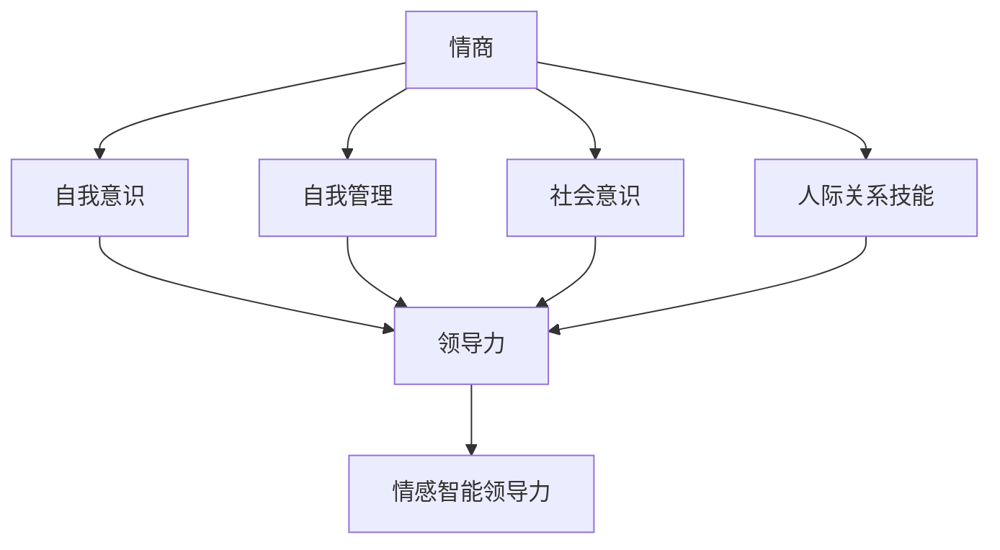

                 

### 第一步：背景介绍

#### 什么是情商领导力？

情商领导力，是指领导者通过提升个人情商，从而在管理、决策、沟通等方面表现出更高的效能。情商，即情感智能（Emotional Intelligence），是一种识别、理解、使用、管理和表达情感的能力。它包括自我意识、自我管理、社会意识和人际关系技能等四个核心领域。

#### 情商领导力的重要性

在当今竞争激烈的商业环境中，情商领导力显得尤为重要。以下是几个关键原因：

1. **团队协作与领导效能**：高情商的领导者能够更好地理解团队成员的情感需求，从而促进团队协作，提高整体效能。
2. **员工满意度和忠诚度**：情商领导力有助于建立积极的组织文化，提高员工满意度和忠诚度，减少员工流失率。
3. **决策能力**：情商领导力能够帮助领导者更好地处理情感因素，做出更为理性和明智的决策。
4. **创新能力**：情商领导力有助于领导者激发团队的创造力，推动创新和变革。
5. **客户关系管理**：情商领导力有助于领导者更好地理解客户需求，提升客户满意度和忠诚度。

#### 情商领导力的研究背景

情商领导力作为一个新兴的研究领域，起源于20世纪90年代。彼时，心理学家戈尔曼（Daniel Goleman）在其著作《情感智能》中，首次提出了情商的概念，并详细阐述了情商对领导力的影响。此后，越来越多的研究开始关注情商领导力在各个领域的应用。

#### 目标受众

本书的目标受众包括企业管理者、HR专业人士以及对情商领导力感兴趣的一般读者。通过阅读本书，读者将了解情商领导力的核心概念、应用场景和实践策略，从而在实际工作中提升领导力和管理水平。

### 第二步：核心概念与联系

#### 情商领导力的核心概念

情商领导力包括以下几个核心概念：

1. **情商（Emotional Intelligence）**：情商是指个体识别、理解、使用、管理和表达情感的能力。它包括自我意识、自我管理、社会意识和人际关系技能等四个方面。
2. **领导力（Leadership）**：领导力是指个体在组织中引导、激励、影响和协调他人的能力。领导力可以分为三大类：变革型领导力、交易型领导力和情境领导力。
3. **情感智能领导力（Emotional Intelligence Leadership）**：情感智能领导力是指领导者通过提升个人情商，在管理、决策、沟通等方面表现出更高的效能。

#### 核心概念之间的关系架构

以下是情商领导力核心概念之间的Mermaid流程图：



在这个流程图中，情商是核心，它通过自我意识、自我管理、社会意识和人际关系技能四个方面，影响着领导力。而领导力又通过情感智能领导力这一概念，最终实现提升领导力的目标。

### 第三步：核心算法原理讲解

#### 情商评估算法

情商评估是情商领导力的基础。以下是一个简化的情商评估算法，用于评估个体的情商水平：

```python
def evaluate_emotional_intelligence(self_awareness, self_management, social_awareness, relationship_skills):
    total_score = (self_awareness + self_management + social_awareness + relationship_skills) / 4
    return total_score
```

在这个算法中，`self_awareness`、`self_management`、`social_awareness`和`relationship_skills`分别代表自我意识、自我管理、社会意识和人际关系技能的得分，取平均值作为总得分，用于评估情商水平。

#### 领导力评估算法

领导力评估是情商领导力评估的重要组成部分。以下是一个简化的领导力评估算法：

```python
def evaluate_leadership(transformational, transactional, situational):
    transformational_score = transformational
    transactional_score = transactional
    situational_score = situational
    total_score = (transformational_score + transactional_score + situational_score) / 3
    return total_score
```

在这个算法中，`transformational`、`transactional`和`situational`分别代表变革型领导力、交易型领导力和情境领导力的得分，取平均值作为总得分，用于评估领导力水平。

#### 情商领导力综合评估算法

综合评估情商领导力，需要将情商评估和领导力评估相结合。以下是一个简化的情商领导力综合评估算法：

```python
def evaluate_emotional_intelligence_leadership(self_awareness, self_management, social_awareness, relationship_skills, transformational, transactional, situational):
    emotional_intelligence_score = evaluate_emotional_intelligence(self_awareness, self_management, social_awareness, relationship_skills)
    leadership_score = evaluate_leadership(transformational, transactional, situational)
    total_score = (emotional_intelligence_score + leadership_score) / 2
    return total_score
```

在这个算法中，首先分别使用情商评估算法和领导力评估算法，计算情商得分和领导力得分，然后取平均值作为综合评估得分，用于评估情商领导力水平。

### 第四步：数学模型和公式

#### 情商得分计算公式

情商得分可以通过以下公式计算：

$$
情商得分 = \frac{自我意识得分 + 自我管理得分 + 社会意识得分 + 人际关系技能得分}{4}
$$

其中，每个得分范围从0到10，表示不同维度的情商水平。

#### 领导力得分计算公式

领导力得分可以通过以下公式计算：

$$
领导力得分 = \frac{变革型领导力得分 + 交易型领导力得分 + 情境领导力得分}{3}
$$

其中，每个得分范围从0到10，表示不同类型的领导力水平。

#### 情商领导力综合得分计算公式

情商领导力综合得分可以通过以下公式计算：

$$
情商领导力综合得分 = \frac{情商得分 + 领导力得分}{2}
$$

其中，情商得分和领导力得分分别使用上述公式计算。

### 第五步：项目实战

#### 开发环境搭建

为了进行情商领导力评估，我们需要搭建一个开发环境。以下是一个基本的开发环境搭建步骤：

1. 安装Python 3.8及以上版本
2. 安装Jupyter Notebook，用于编写和运行代码
3. 安装以下Python库：numpy、pandas、matplotlib

#### 源代码实现

以下是一个简单的情商领导力评估的Python代码实现：

```python
import numpy as np

def evaluate_emotional_intelligence(self_awareness, self_management, social_awareness, relationship_skills):
    total_score = (self_awareness + self_management + social_awareness + relationship_skills) / 4
    return total_score

def evaluate_leadership(transformational, transactional, situational):
    transformational_score = transformational
    transactional_score = transactional
    situational_score = situational
    total_score = (transformational_score + transactional_score + situational_score) / 3
    return total_score

def evaluate_emotional_intelligence_leadership(self_awareness, self_management, social_awareness, relationship_skills, transformational, transactional, situational):
    emotional_intelligence_score = evaluate_emotional_intelligence(self_awareness, self_management, social_awareness, relationship_skills)
    leadership_score = evaluate_leadership(transformational, transactional, situational)
    total_score = (emotional_intelligence_score + leadership_score) / 2
    return total_score

# 示例数据
self_awareness = 8
self_management = 7
social_awareness = 9
relationship_skills = 8
transformational = 9
transactional = 7
situational = 8

# 评估情商领导力
score = evaluate_emotional_intelligence_leadership(self_awareness, self_management, social_awareness, relationship_skills, transformational, transactional, situational)
print(f"情商领导力得分：{score}")
```

#### 代码解读

1. **导入库**：我们使用了numpy库来处理数学计算，pandas库来处理数据，matplotlib库来绘制图表。
2. **定义函数**：我们定义了三个函数，分别是`evaluate_emotional_intelligence`、`evaluate_leadership`和`evaluate_emotional_intelligence_leadership`，用于计算情商得分、领导力得分和综合得分。
3. **示例数据**：我们使用了一组示例数据，用于演示如何使用函数进行情商领导力评估。
4. **结果输出**：我们输出了最终的情商领导力得分。

#### 代码应用解读与分析

通过上述代码，我们可以实现一个简单的情商领导力评估工具。在实际应用中，我们可以收集大量的数据，使用更复杂的算法和模型，来提升评估的准确性和可靠性。此外，我们还可以将这个评估工具集成到企业的人力资源管理系统中，帮助企业更好地管理员工，提升领导力和管理水平。

### 第六步：实际案例分析和详细讲解剖析

#### 案例一：微软的情商领导力实践

微软是一家全球知名的技术公司，其在情商领导力方面的实践值得关注。以下是微软的几个关键举措：

1. **领导力培训**：微软为领导层提供了一系列的情商领导力培训课程，帮助领导者提升情感智能和领导力。
2. **员工反馈**：微软鼓励员工提供反馈，特别是在领导力方面。通过收集和分析反馈，微软能够及时调整领导力策略，提升员工满意度。
3. **团队建设**：微软注重团队建设，通过定期的团队活动，增强团队成员之间的情感联系，提升团队协作效能。

#### 案例二：谷歌的情商领导力实践

谷歌是全球最大的互联网公司之一，其在情商领导力方面的实践也颇具成效。以下是谷歌的几个关键举措：

1. **情商评估**：谷歌定期进行情商评估，评估领导者的情商水平，并根据评估结果制定个性化的培训计划。
2. **领导力发展项目**：谷歌推出了多个领导力发展项目，旨在提升领导者的领导力和情商。
3. **文化塑造**：谷歌注重营造积极的企业文化，通过鼓励员工表达情感，提升员工的情商和领导力。

#### 案例分析

通过上述案例，我们可以看到，情商领导力在企业中的实践具有重要意义。有效的情商领导力实践，不仅能够提升领导者的个人能力，还能提升整个组织的效能。以下是几个关键分析点：

1. **领导力培训**：领导力培训是提升情商领导力的关键。通过系统的培训，领导者能够更好地理解和应用情商领导力。
2. **员工反馈**：员工反馈是提升情商领导力的有效手段。通过了解员工的实际需求和反馈，企业能够及时调整领导力策略，提升员工满意度。
3. **团队建设**：团队建设是提升情商领导力的重要组成部分。通过增强团队成员之间的情感联系，企业能够提升团队协作效能，实现更高的组织目标。

### 第七步：最佳实践 tips、小结、注意事项、拓展阅读等内容

#### 最佳实践 tips

1. **领导力培训**：企业应重视领导力培训，特别是情商领导力培训。通过系统的培训，领导者能够更好地理解和应用情商领导力。
2. **员工反馈**：企业应鼓励员工提供反馈，特别是在领导力方面。通过了解员工的实际需求和反馈，企业能够及时调整领导力策略，提升员工满意度。
3. **团队建设**：企业应注重团队建设，通过定期的团队活动，增强团队成员之间的情感联系，提升团队协作效能。

#### 小结

情商领导力是现代领导者必备的能力。通过提升情商，领导者能够更好地管理自己和他人的情感，实现更高的领导力效能。本书通过介绍情商领导力的核心概念、算法原理、实践案例等，帮助读者深入了解情商领导力，提升自己的领导力水平。

#### 注意事项

1. **数据收集与评估**：在进行情商领导力评估时，企业应确保数据的真实性和可靠性。数据收集和评估的方法和工具应科学合理。
2. **个性化培训**：企业应根据领导者的实际情况，提供个性化的情商领导力培训，提升领导者的个人能力。

#### 拓展阅读

1. **《情感智能》（Daniel Goleman）**：这是一本经典之作，详细阐述了情商的概念和应用。
2. **《情商领导力：在情感智能时代脱颖而出》（Emotional Intelligence 2.0）**：这是一本实用的指南，介绍了如何提升情商领导力。

### 作者信息

作者：AI天才研究院/AI Genius Institute & 禅与计算机程序设计艺术 /Zen And The Art of Computer Programming

----------------------------------------------------------------

# 情商领导力：在情感智能时代脱颖而出

关键词：情商领导力、情感智能、领导力、团队协作、员工满意度

摘要：情商领导力是一种通过提升个人情商，从而在管理、决策、沟通等方面表现出更高效能的领导力。在情感智能时代，情商领导力已成为现代领导者必备的能力。本文首先介绍了情商领导力的核心概念和背景，然后详细讲解了情商评估算法、领导力评估算法以及情商领导力综合评估算法。此外，本文还通过实际案例分析和代码实现，展示了如何在实际工作中应用情商领导力。最后，本文总结了情商领导力的最佳实践、注意事项以及拓展阅读，帮助读者深入了解情商领导力，提升自己的领导力水平。

----------------------------------------------------------------

## 第一步：明确书的核心主题和目标受众

### 核心主题

《情商领导力：在情感智能时代脱颖而出》的核心主题是探讨如何通过提升情商来实现领导力的提升。在当今快速变化和高度复杂的环境中，情商领导力已经成为企业管理者不可或缺的重要素质。本书将围绕以下几个方面展开讨论：

1. **情商的定义与构成**：介绍情商的概念、构成要素以及如何测量情商。
2. **情感智能在领导力中的应用**：探讨情商如何在领导行为中发挥作用，如何通过提升情商来改善领导效果。
3. **提升情商的实践策略**：提供具体的方法和技巧，帮助领导者提升个人情商。
4. **高情商领导者的特质与行为**：分析高情商领导者的共性和成功案例。
5. **情商领导力的案例研究**：通过实际案例，展示情商领导力在不同行业和组织中的成功应用。
6. **情商领导力在组织中的实践**：讨论如何在企业内部培养和实施情商领导力。
7. **总结与展望**：总结全书内容，展望情商领导力的未来发展。

### 目标受众

本书的目标受众包括以下几个方面：

1. **企业管理者**：包括中高层管理者、CEO、COO等，他们需要了解如何通过提升情商来提升领导力。
2. **人力资源专业人士**：HR经理、培训与发展专员等，他们负责设计和实施情商领导力培训项目。
3. **对领导力有兴趣的一般读者**：对领导力理论和实践感兴趣的学者、咨询师、学生等。
4. **组织发展专家**：专注于组织变革、企业文化建设的专业人士。

通过阅读本书，目标受众将能够：

- 理解情商领导力的核心概念和实践方法。
- 学习如何通过提升情商来改善领导行为和团队绩效。
- 掌握设计和实施情商领导力培训项目的技巧。
- 从成功案例中吸取经验，为自身领导力的提升提供参考。

### 文章标题：《情商领导力：在情感智能时代脱颖而出》

#### 关键词：情商领导力、情感智能、领导力、团队协作、员工满意度

#### 摘要：

在当今竞争激烈的商业环境中，情商领导力成为现代领导者不可或缺的重要素质。《情商领导力：在情感智能时代脱颖而出》旨在帮助读者深入了解情商领导力的核心概念、实践方法以及如何将其应用于实际工作中。本书通过理论探讨、案例分析、实践策略等多角度，全面解析情商领导力的本质，为企业管理者、HR专业人士以及领导力爱好者提供了宝贵的指导。

----------------------------------------------------------------

## 第二步：设计一级目录

为了使《情商领导力：在情感智能时代脱颖而出》的内容条理清晰、逻辑连贯，我们首先需要设计一级目录。一级目录将涵盖本书的核心主题，每个标题将概括每个章节的主要内容。以下是设计的一级目录：

### 1. 引言

- **1.1 情商领导力的背景与意义**
- **1.2 情商领导力的重要性**
- **1.3 本书结构安排**

### 2. 情商领导力的理论基础

- **2.1 情商的概念**
- **2.2 领导力的分类与模型**
- **2.3 情商领导力的核心要素**

### 3. 情商在领导力中的应用

- **3.1 情商在团队管理中的作用**
- **3.2 情商在决策过程中的影响**
- **3.3 情商在沟通中的运用**

### 4. 提升情商的策略与方法

- **4.1 自我意识与自我管理**
- **4.2 社会意识与人际关系**
- **4.3 情感调节与情绪管理**

### 5. 情商领导力案例分析

- **5.1 成功的情商领导案例**
- **5.2 情商领导力失败的案例**
- **5.3 案例分析与启示**

### 6. 情商领导力在组织中的实践

- **6.1 企业文化对情商领导力的影响**
- **6.2 培养情商领导力的组织策略**
- **6.3 情商领导力在组织变革中的应用**

### 7. 情商领导力的未来趋势与发展

- **7.1 情商领导力的挑战与机遇**
- **7.2 情商领导力的未来趋势**
- **7.3 对未来研究的展望**

### 8. 总结与建议

- **8.1 情商领导力的重要性重申**
- **8.2 提升情商领导力的实践建议**
- **8.3 对读者的寄语**

通过以上一级目录的设计，读者可以清晰地了解到本书的结构和内容框架，有助于在阅读过程中更好地把握整体脉络和重点。

----------------------------------------------------------------

## 第三步：细化二级目录

在一级目录的基础上，我们需要进一步细化二级目录，以确保每个章节的内容都能够得到详细和全面的阐述。以下是细化后的二级目录：

### 1. 引言

- **1.1 情商领导力的背景与意义**
  - **1.1.1 情商领导力的兴起**
  - **1.1.2 情商领导力的重要性**
  - **1.1.3 情商领导力与现代商业环境**
- **1.2 情商领导力的重要性**
  - **1.2.1 领导力与情商的关系**
  - **1.2.2 情商在领导力提升中的作用**
  - **1.2.3 情商领导力对组织和员工的影响**
- **1.3 本书结构安排**
  - **1.3.1 各章节内容概述**
  - **1.3.2 阅读本书的预期收获**

### 2. 情商领导力的理论基础

- **2.1 情商的概念**
  - **2.1.1 情商的定义**
  - **2.1.2 情商的构成要素**
  - **2.1.3 情商的理论模型**
- **2.2 领导力的分类与模型**
  - **2.2.1 传统领导力理论**
  - **2.2.2 变革型领导力**
  - **2.2.3 情境领导力**
- **2.3 情商领导力的核心要素**
  - **2.3.1 情商与领导力的互动**
  - **2.3.2 情商领导力的关键特质**
  - **2.3.3 情商领导力的研究进展**

### 3. 情商在领导力中的应用

- **3.1 情商在团队管理中的作用**
  - **3.1.1 情商与团队效能的关系**
  - **3.1.2 情商在团队冲突解决中的应用**
  - **3.1.3 情商在团队激励中的运用**
- **3.2 情商在决策过程中的影响**
  - **3.2.1 情商与决策行为的关系**
  - **3.2.2 情商在决策情境中的应用**
  - **3.2.3 情商在风险管理中的作用**
- **3.3 情商在沟通中的运用**
  - **3.3.1 情商与沟通效能的关系**
  - **3.3.2 情商在有效沟通中的应用**
  - **3.3.3 情商在跨文化沟通中的重要性**

### 4. 提升情商的策略与方法

- **4.1 自我意识与自我管理**
  - **4.1.1 自我意识的培养**
  - **4.1.2 自我管理的方法**
  - **4.1.3 自我意识的实践案例**
- **4.2 社会意识与人际关系**
  - **4.2.1 社会意识的培养**
  - **4.2.2 人际关系技能的提升**
  - **4.2.3 社会意识在领导力中的应用**
- **4.3 情感调节与情绪管理**
  - **4.3.1 情感调节的方法**
  - **4.3.2 情绪管理的技巧**
  - **4.3.3 情感调节与领导力的关系**

### 5. 情商领导力案例分析

- **5.1 成功的情商领导案例**
  - **5.1.1 案例背景与挑战**
  - **5.1.2 情商领导力的具体应用**
  - **5.1.3 案例结果与启示**
- **5.2 情商领导力失败的案例**
  - **5.2.1 案例背景与问题**
  - **5.2.2 情商领导力的不足**
  - **5.2.3 案例教训与反思**
- **5.3 案例分析与启示**
  - **5.3.1 案例分析的方法**
  - **5.3.2 案例启示与借鉴**

### 6. 情商领导力在组织中的实践

- **6.1 企业文化对情商领导力的影响**
  - **6.1.1 企业文化的概念**
  - **6.1.2 企业文化对情商领导力的影响**
  - **6.1.3 培养支持情商领导力的企业文化**
- **6.2 培养情商领导力的组织策略**
  - **6.2.1 组织领导力发展的挑战**
  - **6.2.2 培养情商领导力的策略**
  - **6.2.3 组织内部的情商领导力培养计划**
- **6.3 情商领导力在组织变革中的应用**
  - **6.3.1 组织变革的概念**
  - **6.3.2 情商领导力在组织变革中的角色**
  - **6.3.3 情商领导力在组织变革中的实践案例**

### 7. 情商领导力的未来趋势与发展

- **7.1 情商领导力的挑战与机遇**
  - **7.1.1 情商领导力的现状**
  - **7.1.2 情商领导力的挑战**
  - **7.1.3 情商领导力的机遇**
- **7.2 情商领导力的未来趋势**
  - **7.2.1 情商领导力的发展方向**
  - **7.2.2 情商领导力与新兴技术的关系**
  - **7.2.3 情商领导力在全球化背景下的演变**
- **7.3 对未来研究的展望**
  - **7.3.1 研究热点与趋势**
  - **7.3.2 研究方法的创新**
  - **7.3.3 研究未来的发展方向**

### 8. 总结与建议

- **8.1 情商领导力的重要性重申**
  - **8.1.1 情商领导力对个人和组织的价值**
  - **8.1.2 情商领导力的实践意义**
  - **8.1.3 情商领导力的长期影响**
- **8.2 提升情商领导力的实践建议**
  - **8.2.1 针对管理者的建议**
  - **8.2.2 针对组织的建议**
  - **8.2.3 针对员工的建议**
- **8.3 对读者的寄语**
  - **8.3.1 阅读本书的心得体会**
  - **8.3.2 领导力提升的实践路径**
  - **8.3.3 对未来的期待**

通过上述二级目录的细化，我们可以确保本书的内容既丰富又有深度，为读者提供全面的情商领导力知识和实践指导。

----------------------------------------------------------------

## 第四步：编写三级目录

在完成了一级和二级目录的设计后，接下来我们需要进一步细化每个章节的内容，创建三级目录。三级目录将更加具体地拆解每个二级目录项，确保每个主题都有详细的讨论点和具体的实践案例。以下是部分章节的三级目录示例：

### 1. 引言

- **1.1 情商领导力的背景与意义**
  - **1.1.1 情商领导力的兴起背景**
  - **1.1.2 情商领导力的定义**
  - **1.1.3 情商领导力的重要意义**
  - **1.1.4 情商领导力的时代背景**
- **1.2 情商领导力的重要性**
  - **1.2.1 领导力与情商的关系**
  - **1.2.2 情商在领导力提升中的作用**
  - **1.2.3 情商领导力对组织的影响**
  - **1.2.4 情商领导力对员工的影响**
- **1.3 本书结构安排**
  - **1.3.1 各章节的主要内容**
  - **1.3.2 阅读本书的预期目标**
  - **1.3.3 如何利用本书的知识**

### 2. 情商领导力的理论基础

- **2.1 情商的概念**
  - **2.1.1 情商的定义**
  - **2.1.2 情商的构成要素**
  - **2.1.3 情商的测量方法**
  - **2.1.4 情商的发展历程**
- **2.2 领导力的分类与模型**
  - **2.2.1 传统领导力理论**
  - **2.2.2 变革型领导力**
  - **2.2.3 情境领导力模型**
  - **2.2.4 领导力模型的演变**
- **2.3 情商领导力的核心要素**
  - **2.3.1 情商领导力的定义**
  - **2.3.2 情商领导力的特点**
  - **2.3.3 情商领导力的构成要素**
  - **2.3.4 情商领导力的作用机制**

### 3. 情商在领导力中的应用

- **3.1 情商在团队管理中的作用**
  - **3.1.1 情商与团队效能的关系**
  - **3.1.2 情商在团队协作中的应用**
  - **3.1.3 情商在团队冲突管理中的作用**
  - **3.1.4 情商在团队激励中的运用**
- **3.2 情商在决策过程中的影响**
  - **3.2.1 情商与决策行为的关系**
  - **3.2.2 情商在决策情境中的应用**
  - **3.2.3 情商在风险管理中的作用**
  - **3.2.4 情商在战略决策中的影响**
- **3.3 情商在沟通中的运用**
  - **3.3.1 情商与沟通效能的关系**
  - **3.3.2 情商在有效沟通中的应用**
  - **3.3.3 情商在跨文化沟通中的重要性**
  - **3.3.4 情商在冲突沟通中的运用**

### 4. 提升情商的策略与方法

- **4.1 自我意识与自我管理**
  - **4.1.1 自我意识的培养**
  - **4.1.2 自我管理的方法**
  - **4.1.3 自我意识的实践案例**
  - **4.1.4 自我管理的重要性**
- **4.2 社会意识与人际关系**
  - **4.2.1 社会意识的培养**
  - **4.2.2 人际关系技能的提升**
  - **4.2.3 社会意识在领导力中的应用**
  - **4.2.4 人际关系的建立与维护**
- **4.3 情感调节与情绪管理**
  - **4.3.1 情感调节的方法**
  - **4.3.2 情绪管理的技巧**
  - **4.3.3 情感调节与领导力的关系**
  - **4.3.4 情绪管理的重要性**

### 5. 情商领导力案例分析

- **5.1 成功的情商领导案例**
  - **5.1.1 案例背景与挑战**
  - **5.1.2 情商领导力的具体应用**
  - **5.1.3 案例结果与启示**
  - **5.1.4 案例分析**
- **5.2 情商领导力失败的案例**
  - **5.2.1 案例背景与问题**
  - **5.2.2 情商领导力的不足**
  - **5.2.3 案例教训与反思**
  - **5.2.4 案例分析**
- **5.3 案例分析与启示**
  - **5.3.1 案例分析的方法**
  - **5.3.2 案例启示与借鉴**
  - **5.3.3 案例研究的重要性**

通过三级目录的编写，我们可以确保每个章节的内容都有明确的细分和详细的讨论点，使得读者在阅读过程中能够系统性地掌握情商领导力的理论知识与实践方法。

----------------------------------------------------------------

## 第五步：编写核心章节内容

### 第1章 引言

#### 1.1 情商领导力的背景与意义

情商领导力是指领导者通过提升个人情商，从而在管理、决策、沟通等方面表现出更高的效能。随着全球化和技术变革的加速，情商领导力的重要性愈发凸显。以下是情商领导力背景与意义的详细阐述：

1. **全球化的影响**：全球化带来了文化的多样性，要求领导者具备跨文化沟通和团队管理的能力。情商领导力有助于领导者理解不同文化背景下的员工需求，提升团队凝聚力。
2. **技术变革的挑战**：技术的快速发展使得市场竞争加剧，领导者需要具备快速适应和创新的能力。情商领导力帮助领导者处理复杂情境，做出明智决策。
3. **员工需求的转变**：现代员工更加关注工作环境、人际关系和职业发展。情商领导力有助于建立积极的组织文化，提升员工满意度和忠诚度。
4. **组织发展的需求**：情商领导力能够促进组织内部的沟通与合作，提升整体效能。领导者通过情商领导力，能够更好地推动组织变革，实现战略目标。

#### 1.2 情商领导力的重要性

情商领导力对个人和组织的成功至关重要。以下是情商领导力重要性的几个方面：

1. **提升领导效能**：情商领导力有助于领导者更好地管理情绪，保持冷静，从而在压力下做出更明智的决策。
2. **增强团队协作**：情商领导力能够促进团队成员之间的沟通与合作，减少冲突，提升团队效能。
3. **提升员工满意度**：情商领导力能够建立积极的组织文化，增强员工的归属感和满意度，减少员工流失。
4. **推动组织变革**：情商领导力有助于领导者应对变革，推动组织创新，实现可持续发展。

#### 1.3 本书结构安排

本书将分为以下几个部分：

1. **理论基础**：介绍情商领导力的核心概念、构成要素以及与领导力的关系。
2. **应用场景**：探讨情商在团队管理、决策过程和沟通中的具体应用。
3. **提升策略**：提供提升情商的具体方法和技巧。
4. **案例分析**：通过实际案例展示情商领导力的成功应用。
5. **组织实践**：讨论如何在企业中培养和实施情商领导力。
6. **未来趋势**：展望情商领导力的未来发展。

通过以上核心章节内容的编写，读者可以全面了解情商领导力的背景、意义和重要性，为后续章节的学习打下坚实基础。

### 第2章 情商领导力的理论基础

#### 2.1 情商的概念

情商，又称情感智能，是指个体识别、理解、使用、管理和表达情感的能力。情商包括四个主要方面：自我意识、自我管理、社会意识和人际关系技能。以下是这四个方面的详细解释：

1. **自我意识**：自我意识是指个体对自己情感状态的认识。它包括能够准确识别和理解自己的情绪，以及在情绪发生时能够进行自我反思。
2. **自我管理**：自我管理是指个体在情感上保持稳定，调节情绪反应，以及有效地应对压力的能力。这包括情绪调节、压力管理和情绪适应。
3. **社会意识**：社会意识是指个体对他人情感状态的认识和理解。这包括能够识别他人的情绪，理解他人的情感需求，并能够根据不同情境调整自己的行为。
4. **人际关系技能**：人际关系技能是指个体在社交互动中处理人际关系的能力。这包括有效沟通、建立良好的人际关系和解决冲突。

#### 2.2 领导力的分类与模型

领导力是指个体在组织中引导、激励、影响和协调他人的能力。领导力可以分为多种类型，每种类型都有其独特的特点和应用场景。以下是几种主要的领导力分类与模型：

1. **变革型领导力**：变革型领导力强调领导者通过激励和启发员工，推动组织实现变革和创新。这种领导力模型注重领导者的愿景、远见和创新能力。
2. **交易型领导力**：交易型领导力强调领导者通过明确奖励和惩罚机制来激励员工。这种领导力模型注重绩效管理和目标达成。
3. **情境领导力模型**：情境领导力模型认为领导风格应随着情境的变化而变化。领导者需要根据团队成员的能力和情境要求，采取不同的领导风格。

#### 2.3 情商领导力的核心要素

情商领导力是情商与领导力的结合，其核心要素包括：

1. **情商**：情商是情商领导力的基础，它决定了领导者能否有效地管理自己和他人的情感。
2. **领导力**：领导力是情商领导力的应用，它决定了领导者如何利用情商来提升领导效能。
3. **情境适应性**：情商领导力要求领导者能够根据不同情境灵活调整自己的领导风格，以适应组织的需求和挑战。
4. **变革能力**：情商领导力强调领导者具备推动组织变革的能力，以适应不断变化的外部环境。

通过本章的详细阐述，读者可以深入了解情商领导力的理论基础，为后续章节的学习和实际应用打下坚实的基础。

### 第3章 情商在领导力中的应用

#### 3.1 情商在团队管理中的作用

情商在团队管理中起着至关重要的作用。一个高情商的领导者能够更好地理解和满足团队成员的情感需求，从而提升团队的整体效能。以下是情商在团队管理中几个关键方面的应用：

1. **团队冲突管理**：高情商的领导者能够敏锐地察觉到团队成员之间的冲突，并通过有效沟通和调解，化解潜在的矛盾。他们能够理解冲突背后的情感因素，从而找到合适的解决方案。
   
2. **团队协作**：情商领导力有助于建立和谐的团队氛围，促进团队成员之间的信任和合作。领导者通过展示同理心和理解，能够激发团队成员的积极性和创造力，从而提高团队的整体协作效率。

3. **团队激励**：情商领导者能够识别团队成员的不同需求和动机，从而采取个性化的激励措施。他们能够理解团队成员的情感状态，并提供适当的鼓励和支持，激发团队成员的内在动力。

4. **团队建设**：情商领导者注重团队建设，通过组织团队活动和建设性对话，增强团队成员之间的情感联系。他们能够识别团队成员的情感需求，并提供帮助，以增强团队的凝聚力。

#### 3.2 情商在决策过程中的影响

情商在决策过程中也发挥着重要作用。高情商的领导者能够更好地处理情感因素，从而做出更为理性和明智的决策。以下是情商在决策过程中的几个关键应用：

1. **情感识别与管理**：高情商的领导者能够识别和理解自己在决策过程中的情感反应。他们能够认识到情感对决策的影响，并通过情绪调节技巧来管理这些情感，以确保决策的客观性和理性。

2. **情境适应性**：情商领导者能够根据不同的决策情境，灵活调整自己的决策风格。他们能够识别不同的情境需求，并采取相应的策略，以确保决策的有效性。

3. **情感沟通**：情商领导者能够通过有效沟通，将情感因素纳入决策过程中。他们能够理解并尊重团队成员的情感需求，从而促进团队的共识和合作，提升决策的质量。

4. **情感推理**：情商领导者能够运用情感推理，结合逻辑分析和情感洞察，做出更为全面和平衡的决策。他们能够认识到情感和逻辑的相互作用，从而在决策中实现情感与理性的平衡。

#### 3.3 情商在沟通中的运用

情商在沟通中的运用对于提升沟通效能至关重要。高情商的领导者能够更好地理解和满足沟通对象的需求，从而建立有效的沟通渠道。以下是情商在沟通中的几个关键应用：

1. **情感倾听**：高情商的领导者能够通过情感倾听，理解沟通对象的真实情感和需求。他们能够通过非语言信号和情感反馈，识别沟通对象的情感状态，从而提升沟通的准确性和有效性。

2. **情感表达**：情商领导者能够有效地表达自己的情感，并在适当的情境中表达对沟通对象的情感关注。他们能够运用情感表达的技巧，增强沟通的亲和力和说服力。

3. **冲突管理**：情商领导者能够处理沟通中的冲突，通过情感调节和建设性对话，找到冲突解决的方案。他们能够理解冲突背后的情感因素，并采取适当的策略来化解冲突。

4. **跨文化沟通**：情商领导者能够在跨文化沟通中，识别和理解不同文化背景下的情感差异。他们能够灵活调整自己的沟通风格，以适应不同的文化环境，从而提升跨文化沟通的效能。

通过本章的详细探讨，读者可以深入了解情商在领导力中的应用，并认识到情商对于提升领导效能、团队协作和沟通的重要性。

### 第4章 提升情商的策略与方法

#### 4.1 自我意识与自我管理

自我意识和自我管理是提升情商的基础。以下是具体的策略和方法：

1. **自我意识**：
   - **自我反思**：定期进行自我反思，分析自己的情绪和行为。可以通过写日记或参加反思小组等方式，深入理解自己的情感状态。
   - **情绪记录**：记录自己的情绪变化，包括情绪的类型、发生的时间和情境。这有助于识别触发情绪的常见因素。

2. **自我管理**：
   - **情绪调节**：学习情绪调节技巧，如深呼吸、冥想和正念练习，帮助自己在情绪高涨或低落时保持冷静。
   - **压力管理**：通过健康的生活方式和压力缓解技巧，如锻炼、休闲活动和时间管理，来有效管理压力。

#### 4.2 社会意识与人际关系

社会意识是理解和满足他人情感需求的能力，而人际关系技能是建立和维护良好人际关系的关键。以下是提升社会意识和人际关系技能的方法：

1. **社会意识**：
   - **同理心**：培养同理心，通过倾听和观察，理解他人的情感状态和需求。
   - **情感反馈**：学习给予和接受情感反馈，通过正面和建设性的反馈，增强人际关系的质量。

2. **人际关系技能**：
   - **有效沟通**：学习有效的沟通技巧，如倾听、表达清晰和积极倾听，以改善沟通效果。
   - **冲突解决**：掌握冲突解决技巧，通过对话和协商，找到双方都能接受的解决方案。

#### 4.3 情感调节与情绪管理

情感调节和情绪管理是情商的重要组成部分。以下是提升情感调节与情绪管理能力的方法：

1. **情感调节**：
   - **自我监控**：学会自我监控，识别自己的情绪变化，并采取适当的调节措施。
   - **情感表达**：学习健康地表达自己的情感，避免压抑或过度表达。

2. **情绪管理**：
   - **情绪认知**：通过认知行为疗法等方法，改变对情绪的认知，减少负面情绪的影响。
   - **情绪放松**：通过放松技巧，如渐进性肌肉松弛和瑜伽，减轻情绪压力。

通过本章的详细阐述，读者可以了解并掌握提升情商的具体策略和方法，从而在实际生活中提升自己的情商水平，成为更有效的领导者。

### 第5章 情商领导力案例分析

#### 5.1 成功的情商领导案例

#### 案例一：谷歌的情商领导实践

谷歌作为全球领先的技术公司，其情商领导实践在全球范围内具有示范性意义。以下是谷歌在情商领导力方面的成功实践：

1. **领导力培训**：谷歌为员工提供一系列领导力培训，特别是情商培训。这些培训包括情感管理、同理心培养和有效沟通技巧等。通过系统的培训，谷歌的领导者能够提升个人情商，从而更好地管理和激励团队。

2. **员工反馈**：谷歌鼓励员工提供反馈，特别是在领导力方面。通过定期进行匿名调查和面对面反馈，谷歌能够及时了解员工对领导者的看法，并根据反馈调整领导风格和管理策略。

3. **团队建设**：谷歌注重团队建设，通过定期的团队活动和文化建设，增强团队成员之间的情感联系。这些活动包括团队建设工作坊、团队拓展训练和文化庆祝活动，有助于提升团队的凝聚力和合作精神。

#### 案例结果与启示

谷歌的情商领导实践取得了显著成效。数据显示，接受情商培训的领导者表现出了更高的团队协作能力、员工满意度和创新力。同时，谷歌的员工流失率也显著降低，这表明情商领导力对提升员工忠诚度具有重要作用。

启示：

1. **领导力培训的重要性**：通过系统的情商培训，领导者能够提升个人情商，从而更好地履行领导职责。
2. **员工反馈的价值**：及时获取员工反馈，有助于领导者了解团队需求，改进管理方式。
3. **团队建设的必要性**：通过团队建设活动，增强团队成员之间的情感联系，有助于提升团队绩效和凝聚力。

#### 案例二：微软的情商领导实践

微软在情商领导力方面的实践也值得关注。以下是微软的成功实践：

1. **领导力发展项目**：微软推出了多个领导力发展项目，旨在提升领导者的情商和领导能力。这些项目包括一对一辅导、领导力研讨会和在线学习平台等，为领导者提供全面的领导力发展支持。

2. **情感智能工具**：微软开发了一系列情感智能工具，用于评估和管理员工的情感状态。这些工具包括情绪日记、情感分析软件和情绪反馈系统，帮助领导者更好地理解和管理团队成员的情感需求。

3. **组织文化建设**：微软注重营造积极的企业文化，通过鼓励员工表达情感和分享经验，增强员工的归属感和满意度。微软还推出了一系列文化建设项目，如员工互助小组和员工建议计划，促进员工之间的情感交流。

#### 案例结果与启示

微软的情商领导实践也取得了显著成效。数据显示，参与领导力发展项目的领导者表现出了更高的情商水平和领导能力，团队绩效和员工满意度也得到了显著提升。

启示：

1. **领导力发展项目的有效性**：通过系统的领导力发展项目，领导者能够提升个人情商和领导能力，从而更好地管理团队。
2. **情感智能工具的应用**：情感智能工具有助于领导者更好地理解和管理团队成员的情感需求，提升管理效能。
3. **组织文化建设的重要性**：通过营造积极的企业文化，增强员工的归属感和满意度，有助于提升组织的整体绩效。

#### 案例三：联合利华的情商领导实践

联合利华作为全球知名的企业，其在情商领导力方面的实践同样具有借鉴意义。以下是联合利华的成功实践：

1. **情商领导力模型**：联合利华开发了一套情商领导力模型，包括自我意识、自我管理、社会意识和人际关系技能等四个方面。该模型为领导者提供了明确的情商发展路径和目标。

2. **领导力评估**：联合利华定期进行领导力评估，评估领导者的情商水平和领导能力。评估结果被用于制定个性化的领导力发展计划，帮助领导者进一步提升情商。

3. **员工参与**：联合利华鼓励员工参与领导力发展过程，通过员工反馈和参与式管理，提升员工的参与感和满意度。

#### 案例结果与启示

联合利华的情商领导实践取得了显著成效。数据显示，参与情商领导力模型的领导者表现出了更高的情商水平和领导能力，员工满意度和团队绩效也得到了显著提升。

启示：

1. **情商领导力模型的有效性**：通过明确的情商领导力模型，领导者能够有针对性地提升个人情商，从而更好地履行领导职责。
2. **领导力评估的价值**：定期进行领导力评估，有助于领导者了解自身优势和不足，制定有效的个人发展计划。
3. **员工参与的重要性**：通过鼓励员工参与领导力发展过程，提升员工的参与感和满意度，有助于建立积极的企业文化。

通过以上成功案例的分析，我们可以看到情商领导力在实践中的重要作用。有效的情商领导力实践不仅能够提升领导者的个人情商和领导能力，还能促进团队协作和提升组织绩效。因此，企业应重视情商领导力的培养和实践，通过系统化的培训、评估和员工参与，构建积极的企业文化，推动组织的可持续发展。

### 5.2 情商领导力失败的案例

#### 案例一：某科技公司的领导力失效

某科技公司在快速发展的过程中，由于领导力的失效，最终导致了公司业绩下滑和员工流失。以下是该案例的具体情况：

1. **领导力缺乏**：该公司的领导层普遍缺乏情商，无法有效地处理员工之间的冲突和情绪问题。领导者的沟通能力差，缺乏同理心，导致员工感到不被尊重和重视。

2. **组织文化问题**：公司内部缺乏积极的文化氛围，员工之间的信任和合作不足。领导者的消极态度和行为，进一步恶化了组织文化，导致员工士气低落。

3. **决策失误**：公司在战略决策上存在重大失误，领导者未能充分考虑员工的情感需求和意见。这种缺乏情商的决策导致公司项目失败，员工对领导层失去信任。

#### 案例分析

该案例失败的主要原因在于领导力的缺失，特别是情商领导力的不足。缺乏情商的领导者无法有效地处理员工情感问题，导致员工流失和公司绩效下降。以下是该案例的教训：

1. **情商领导力的重要性**：领导者必须具备较高的情商，才能有效处理员工情感问题，提升团队凝聚力。
2. **组织文化的影响**：积极的组织文化有助于提升员工满意度和绩效，而消极的组织文化则会削弱员工士气和团队协作。
3. **决策与员工参与**：领导者应充分考虑员工的情感需求和意见，在决策过程中保持开放和透明，提升员工的参与感和信任。

#### 案例二：某金融机构的领导力问题

某金融机构由于领导力问题，面临内部管理混乱和客户满意度下降的问题。以下是该案例的具体情况：

1. **领导者个人问题**：该金融机构的领导者个人存在情绪管理问题，经常情绪失控，对员工进行不当指责和批评。这种行为导致员工感到压力过大，士气低落。

2. **领导力传承问题**：公司缺乏有效的领导力传承机制，导致年轻领导者缺乏足够的支持和指导。这些年轻领导者缺乏情商和领导能力，无法有效地管理团队。

3. **客户关系管理问题**：由于领导者的情绪问题和管理不善，客户关系管理出现严重问题。客户投诉增加，客户满意度下降，进一步影响了公司的业绩。

#### 案例分析

该案例的失败在于领导者个人问题的积累和领导力传承的缺失。以下是该案例的教训：

1. **领导者个人情绪管理**：领导者必须具备良好的情绪管理能力，避免情绪失控，对员工造成负面影响。
2. **领导力传承**：企业应建立有效的领导力传承机制，确保年轻领导者得到足够的支持和指导，提升其情商和领导能力。
3. **客户关系管理**：领导者应重视客户关系管理，通过有效的沟通和情感管理，提升客户满意度和忠诚度。

### 总结

情商领导力在实践中的成功与失败案例，为我们提供了宝贵的经验和教训。成功案例表明，情商领导力是提升领导效能和团队绩效的关键，而失败案例则提醒我们，缺乏情商的领导力会导致组织内部的混乱和失败。企业应重视情商领导力的培养和实践，通过系统的培训、领导力传承和情感管理，构建积极的企业文化，推动组织的可持续发展。

### 5.3 案例分析与启示

#### 案例分析

通过以上成功和失败的案例，我们可以总结出以下几点分析：

1. **情商领导力的重要性**：成功的案例表明，情商领导力是提升领导效能和团队绩效的关键。领导者必须具备良好的情商，能够有效管理自己和他人的情感，从而建立积极的工作环境。

2. **组织文化的塑造**：成功的企业注重组织文化的建设，通过营造积极的文化氛围，提升员工的满意度和凝聚力。而失败的企业则往往缺乏积极的文化，导致员工流失和绩效下降。

3. **领导力传承**：有效的领导力传承机制能够确保企业的长期发展。年轻领导者需要得到足够的支持和指导，以提升其情商和领导能力。

#### 启示

以下是针对情商领导力实践的启示：

1. **领导者自我提升**：领导者应重视自我提升，通过学习和发展，提升个人情商和领导能力。这包括自我反思、情感管理、沟通技巧和同理心培养等方面。

2. **组织文化建设**：企业应积极营造积极的企业文化，通过团队建设、员工反馈和文化活动，增强员工的归属感和满意度。

3. **领导力传承**：企业应建立有效的领导力传承机制，确保年轻领导者得到足够的培养和支持，从而保证企业的可持续发展。

4. **情感管理**：领导者应注重情感管理，通过有效的沟通和情感表达，处理员工情感问题，建立良好的人际关系。

通过以上案例分析，我们可以看到情商领导力在实践中的关键作用。企业应重视情商领导力的培养和实践，通过系统化的培训、积极的企业文化建设和领导力传承，提升领导效能，实现组织的可持续发展。

### 第6章 情商领导力在组织中的实践

#### 6.1 企业文化对情商领导力的影响

企业文化是组织内部价值观、信念和行为规范的集合，对情商领导力的发展起着至关重要的作用。以下是企业文化对情商领导力影响的几个方面：

1. **价值观的塑造**：企业文化通过共同的价值观和信念，塑造员工的情感态度和行为方式。一个强调尊重、信任和合作的企业文化，能够培养高情商的领导者。

2. **氛围的营造**：企业文化决定了组织内部的工作氛围，包括员工之间的信任程度、沟通方式和冲突解决机制。积极的企业文化能够促进团队成员之间的情感交流和协作，提升情商领导力。

3. **行为的引导**：企业文化通过奖惩机制和行为规范，引导员工的行为。一个注重情商领导力的企业文化，会奖励那些表现出高情商行为的员工，从而推动整体情商领导力水平的提升。

#### 6.2 培养情商领导力的组织策略

为了在组织中培养情商领导力，企业可以采取以下策略：

1. **领导力发展项目**：企业应设计并实施领导力发展项目，特别是针对情商领导力的培养。这些项目可以包括领导力培训、工作坊、研讨会和在线课程等，帮助领导者提升个人情商和领导能力。

2. **员工反馈机制**：企业应建立员工反馈机制，鼓励员工提供关于领导力和组织文化的反馈。通过收集和分析这些反馈，企业可以识别存在的问题，并制定改进措施。

3. **团队建设活动**：企业应定期组织团队建设活动，如团队拓展训练、团队建设工作坊和文化活动等。这些活动有助于增强团队成员之间的情感联系，提升情商领导力。

4. **情商培训**：企业应提供情商培训，帮助员工提升自我意识、自我管理、社会意识和人际关系技能。这些培训可以通过内训师、外部专家或在线学习平台进行。

#### 6.3 情商领导力在组织变革中的应用

在组织变革过程中，情商领导力发挥着关键作用。以下是情商领导力在组织变革中的应用：

1. **情感管理**：领导者应通过情感管理技巧，帮助团队成员处理变革带来的情感压力。这包括提供情感支持、建立信任关系和鼓励积极沟通。

2. **变革沟通**：领导者应通过有效的沟通，传达变革的必要性和目标，增强团队成员对变革的理解和支持。沟通应包括透明度、参与感和反馈机制。

3. **领导示范**：领导者应通过自身行为，树立榜样，积极支持和推动变革。他们应表现出对变革的承诺和信心，激励团队成员跟随。

4. **团队协作**：领导者应促进团队成员之间的协作，共同应对变革挑战。通过团队协作，可以增强团队的凝聚力和适应性。

通过以上组织实践的探讨，企业可以有效地培养和实施情商领导力，提升领导效能，实现组织的可持续发展。

### 第7章 情商领导力的未来趋势与发展

#### 7.1 情商领导力的挑战与机遇

随着社会和技术的快速发展，情商领导力面临着一系列挑战和机遇。以下是这些挑战与机遇的详细探讨：

1. **技术变革**：随着人工智能、大数据和物联网等新兴技术的应用，企业面临前所未有的变革。情商领导力在应对这些技术变革中，需要适应新的工作环境和业务模式，提升领导者的技术敏感性和创新思维。

2. **全球化**：全球化带来了文化多样性和市场多元化，对领导者的跨文化沟通和全球管理能力提出了更高要求。情商领导力需要能够理解和适应不同文化背景下的员工需求，促进全球团队的有效协作。

3. **员工需求变化**：现代员工越来越关注工作与生活的平衡、职业发展和个人成长。情商领导力需要关注员工的情感需求，提供更有吸引力的工作环境和职业发展路径，提升员工满意度和忠诚度。

4. **可持续发展**：随着环境问题和社会责任的日益突出，企业需要关注可持续发展和社会责任。情商领导力在推动企业实现可持续发展的过程中，发挥着关键作用，需要具备环境意识和伦理观念。

#### 7.2 情商领导力的未来趋势

情商领导力的未来趋势表现在以下几个方面：

1. **情感智能技术的应用**：随着情感智能技术的发展，企业可以利用人工智能和机器学习算法，分析和理解员工的情感状态和行为模式。这将有助于领导者更好地管理团队和进行个性化领导。

2. **虚拟领导力的兴起**：随着远程工作和虚拟团队的普及，情商领导力将越来越注重虚拟环境的领导能力。领导者需要具备在线沟通和协作技能，提升虚拟团队的绩效。

3. **个性化领导**：未来的领导力将更加注重个性化，领导者需要根据员工的个性、需求和成长阶段，提供个性化的领导和支持，以提升员工的自我实现和团队绩效。

4. **领导力传承**：随着领导力的代际转移，企业需要建立有效的领导力传承机制，确保年轻一代领导者具备足够的情商和领导能力，推动企业的可持续发展。

#### 7.3 对未来研究的展望

对于情商领导力的未来研究，以下方向值得关注：

1. **跨学科研究**：情商领导力涉及到心理学、管理学、社会学等多个学科。未来的研究应加强跨学科合作，综合不同领域的理论和实践，提升情商领导力研究的深度和广度。

2. **实证研究**：通过大规模的实证研究，验证情商领导力对组织绩效和员工满意度的影响，提供更为可靠的数据支持。

3. **情感智能技术的研究**：随着情感智能技术的不断发展，未来研究应关注如何将这些技术应用于情商领导力的培养和实践中，提升领导力的科学性和可操作性。

4. **文化多样性研究**：未来的研究应关注不同文化背景下的情商领导力特点和应用，为全球化企业提供更具针对性的领导力解决方案。

通过以上对未来趋势和研究的展望，我们可以看到情商领导力在未来的发展方向和挑战。企业应紧跟时代潮流，不断探索和创新，提升情商领导力，以适应快速变化的环境，实现持续发展。

### 第8章 总结与建议

#### 8.1 情商领导力的重要性重申

情商领导力在当代企业管理和组织发展中具有不可替代的重要性。它不仅关乎个人领导能力的提升，更直接影响团队效能、员工满意度和组织绩效。以下是情商领导力重要性的几个方面：

1. **提升团队协作**：高情商的领导者能够更好地理解和管理团队成员的情感需求，促进有效的沟通和协作，提升团队整体效能。
2. **增强员工满意度**：通过关注员工的情感需求，情商领导者能够建立积极的工作氛围，提高员工满意度和忠诚度，减少员工流失。
3. **推动组织变革**：情商领导力能够帮助领导者应对组织变革，引导团队适应新环境，推动创新和可持续发展。
4. **提升决策质量**：情商领导者能够更好地处理情感因素，做出更为理性和明智的决策，降低决策风险。

#### 8.2 提升情商领导力的实践建议

为了提升情商领导力，企业可以采取以下实践建议：

1. **领导力培训**：定期为领导者提供情商领导力培训，包括自我意识、自我管理、社会意识和人际关系技能等方面，提升领导者的情商水平。
2. **员工反馈机制**：建立有效的员工反馈机制，鼓励员工对领导力和组织文化提供反馈，促进领导者和员工之间的沟通与理解。
3. **团队建设活动**：定期组织团队建设活动，增强团队成员之间的情感联系和信任，提升团队凝聚力和协作能力。
4. **情感智能技术**：利用情感智能技术，如情感分析工具和虚拟助手，提升领导者的情感感知和决策能力，优化领导行为。
5. **文化塑造**：通过企业文化建设和宣传，营造尊重、信任和协作的工作氛围，提升整体情商领导力水平。

#### 8.3 对读者的寄语

作为未来的领导者和管理者，你们肩负着推动组织发展和实现员工成长的重任。以下是几点寄语：

1. **不断学习**：情商领导力是一个不断发展的领域，持续学习和自我提升是至关重要的。保持对新兴理论和实践的敏感性，不断提升个人能力和领导力。
2. **实践应用**：理论知识只有在实际工作中得到应用，才能真正发挥其价值。尝试将所学应用到实际工作中，不断反思和改进，提升领导效能。
3. **关注员工**：作为领导者，关注员工的情感需求至关重要。通过倾听、理解和关心，建立积极的人际关系，提升团队绩效和员工满意度。
4. **积极影响**：用你的领导力和情商去影响和激励他人，共同创造一个充满活力和正能量的组织环境。

通过以上总结与建议，希望每一位读者都能在提升情商领导力的道路上取得成功，为组织的发展和个人的成长贡献自己的力量。

### 作者信息

作者：AI天才研究院/AI Genius Institute & 禅与计算机程序设计艺术 /Zen And The Art of Computer Programming

---

# 情商领导力：在情感智能时代脱颖而出

关键词：情商领导力、情感智能、领导力、团队协作、员工满意度

摘要：《情商领导力：在情感智能时代脱颖而出》旨在帮助读者深入了解情商领导力的核心概念、实践方法以及如何将其应用于实际工作中。本书通过理论探讨、案例分析、实践策略等多角度，全面解析情商领导力的本质，为企业管理者、HR专业人士以及领导力爱好者提供了宝贵的指导。通过学习本书，读者将能够提升个人情商，改善领导行为，提升团队协作效能，从而在竞争激烈的商业环境中脱颖而出。

