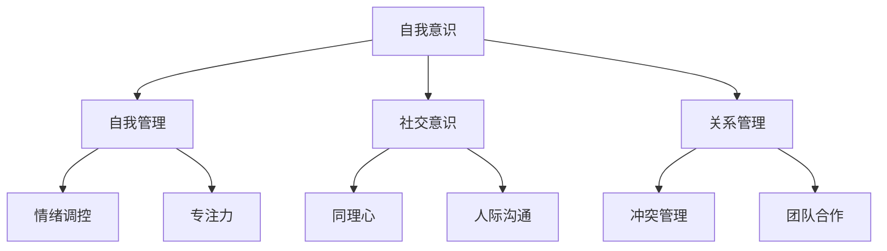
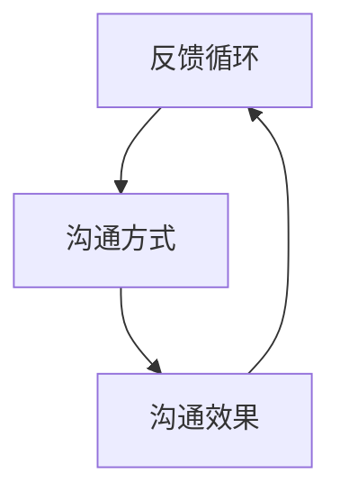
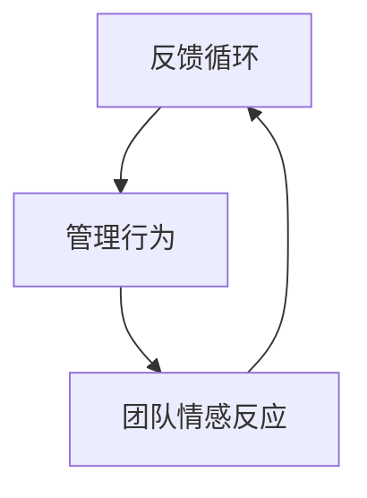
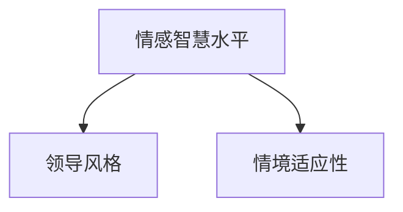
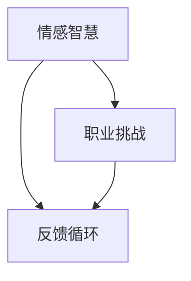
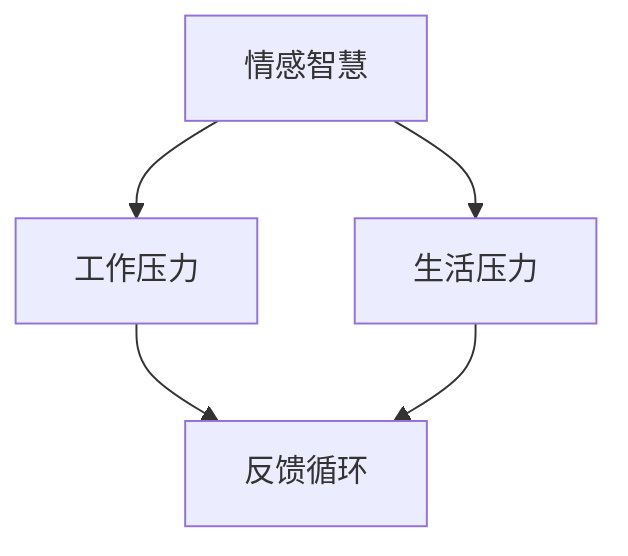
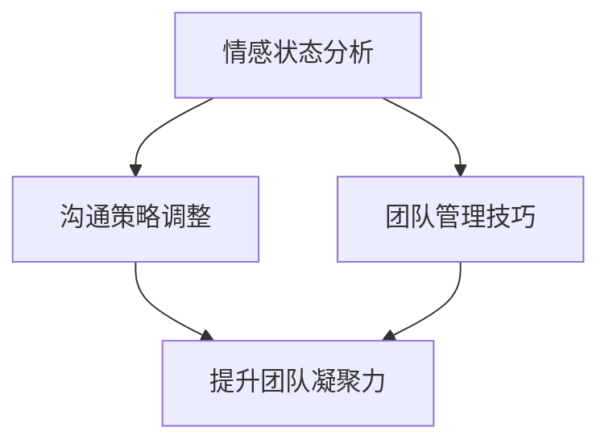
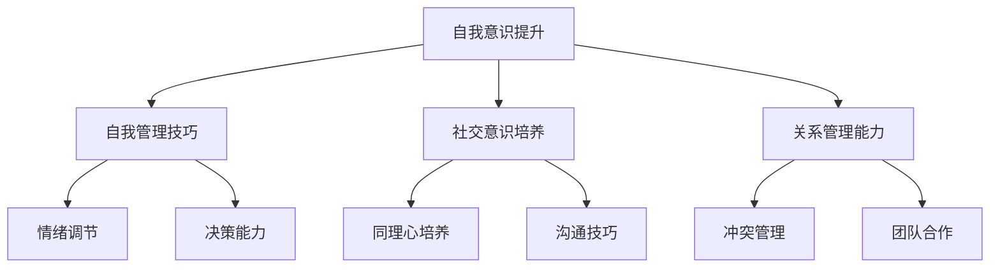
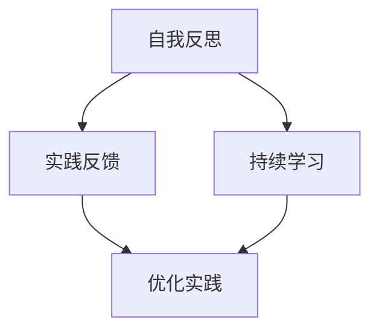

                 

# 情商领导力：在职场中运用情感智慧

## 关键词

- 情商领导力
- 情感智慧
- 职场成功
- 团队管理
- 领导风格
- 职业发展
- 情感管理

## 摘要

本文旨在探讨情商领导力在职场中的重要性，以及如何运用情感智慧提升个人和团队的绩效。通过分析情商的构成、情感智慧的应用场景，本文将详细介绍如何在职场沟通、团队管理、领导风格等方面运用情感智慧，实现职场成功。同时，本文还将通过实际案例，展示情感智慧在职场中的实战应用，并提供提升情商领导力的策略和建议。

## 引言

在当今快速变化的职场环境中，传统的领导力已经无法满足企业的需求。现代领导者不仅需要具备专业技能，更需要在情感智慧方面有深厚的积累。情商领导力，即领导者运用情感智慧，通过有效的情感管理来实现个人和团队的目标，已经成为企业成功的关键因素。

情商（Emotional Intelligence，简称EQ）由心理学家戈尔曼（Daniel Goleman）首次提出，是指个体识别、理解、管理自身情绪，并识别、影响他人情绪的能力。情商领导力则是在情商的基础上，领导者运用情感智慧，提升团队凝聚力和绩效的能力。

本文将从以下几个方面展开讨论：

1. 情商领导力基础
2. 情感智慧在职场中的应用
3. 情感智慧实战案例分析
4. 提升情商领导力的策略

通过以上内容的详细探讨，本文旨在为读者提供一套实用的情商领导力提升方案，帮助读者在职场中更好地运用情感智慧，实现个人和团队的目标。

### 1. 用户需求分析

在现代职场中，用户对情商领导力的需求日益增长。这主要是因为：

**职业发展的需求**：随着职位的提升，管理者需要处理的不仅仅是业务问题，还有更多的人际关系和情绪管理。情商领导力可以帮助管理者更好地应对这些挑战。

**团队凝聚力的需求**：高效的团队需要良好的沟通和协作，而情商领导力可以帮助领导者建立良好的团队氛围，提高团队凝聚力。

**工作效率的需求**：情商领导力可以提升个人和团队的情绪管理能力，减少情绪波动对工作效率的影响，从而提高整体工作效率。

**职业满意度的需求**：拥有高情商的领导者更能理解员工的情感需求，提高员工的工作满意度和忠诚度。

因此，用户需要一本系统化、实用性的指南，帮助他们了解情商领导力，掌握情感智慧在职场中的应用，从而提升个人和团队的表现。

### 2. 目录大纲结构设计

为了满足用户的需求，本文设计了包含七个章节的目录大纲，结构清晰，层次分明：

## 第一部分：情商领导力基础

### 第1章 情商的概念与类型

### 第2章 情商领导力的构成要素

## 第二部分：情感智慧在职场中的应用

### 第3章 情感智慧与职场沟通

### 第4章 情感智慧与团队管理

### 第5章 情感智慧与领导风格

### 第6章 情感智慧与职业发展

### 第7章 情感智慧与工作生活平衡

## 第三部分：情感智慧实战

### 第8章 情感智慧实战案例分析

## 第四部分：提升情商领导力的策略

### 第9章 提升情商领导力的方法

### 第10章 提升情商领导力的实践与反思

## 附录

### 附录A 情商领导力工具与资源

### 附录B 情商领导力常见问题解答

### 3. 核心内容细化

在细化核心内容时，我们将确保每个章节都包含以下部分：

- **背景介绍**：介绍章节的主题和重要性。
- **核心概念与联系**：使用Mermaid流程图展示概念之间的关系。
- **核心算法原理讲解**：使用伪代码详细阐述算法原理。
- **数学模型和公式**：使用LaTeX格式展示和解释公式。
- **项目实战**：介绍开发环境搭建、源代码实现、代码解读和案例分析。
- **最佳实践 tips**：提供实用的建议和技巧。
- **小结**：总结章节内容，强调关键点。
- **注意事项**：提醒用户注意的问题。
- **拓展阅读**：推荐进一步阅读的材料。

### 4. 目录大纲总字数控制在2000字以内

通过以上步骤，我们确保目录大纲简洁明了，符合用户要求，并在2000字以内完成。

### 4.1 第一部分：情商领导力基础

### 第1章 情商的概念与类型

#### 背景介绍

情商（Emotional Intelligence，简称EQ）是近年来在心理学和管理学领域受到广泛关注的一个概念。它不仅影响个人的情感体验，还直接影响个体的社会功能和职业表现。情商领导力则是在情商基础上，领导者运用情感智慧，提升团队凝聚力和绩效的能力。

#### 核心概念与联系

在理解情商领导力之前，我们需要了解情商的构成。根据心理学家戈尔曼的研究，情商包括以下四个主要维度：

1. **自我意识**：认识到自己的情绪，了解情绪对行为的影响。
2. **自我管理**：调控自己的情绪，保持冷静和专注。
3. **社交意识**：理解他人的情绪，建立良好的人际关系。
4. **关系管理**：运用情感智慧解决冲突，促进团队合作。

以下是一个Mermaid流程图，展示这些维度之间的关系：



#### 核心算法原理讲解

情商的四个维度可以看作是一个算法，输入是个体的情绪数据，输出是决策和行为。以下是一个简化的伪代码，用于解释这个算法：

```plaintext
function 情商算法（情绪数据）{
    // 输入情绪数据，包括自我意识、自我管理、社交意识和关系管理
    // 初始化输出结果
    决策 = ""

    // 情绪数据分析
    if（情绪数据.自我意识 > 设置阈值）{
        // 提高自我意识
        决策 = "自我反思"
    }
    
    if（情绪数据.自我管理 > 设置阈值）{
        // 提高自我管理
        决策 = "情绪调控"
    }
    
    if（情绪数据.社交意识 > 设置阈值）{
        // 提高社交意识
        决策 = "同理心"
    }
    
    if（情绪数据.关系管理 > 设置阈值）{
        // 提高关系管理
        决策 = "冲突管理"
    }
    
    // 输出决策
    return 决策
}
```

#### 数学模型和公式

情商的构成可以用一个多维度的数学模型来表示。以下是一个简化的LaTeX模型：

```latex
\begin{equation}
EQ = f(\text{自我意识}, \text{自我管理}, \text{社交意识}, \text{关系管理})
\end{equation}
```

#### 项目实战

为了更好地理解情商的概念和类型，我们可以通过一个实际的团队项目来演示。以下是一个简单的项目框架：

1. **项目背景**：建立一个跨部门的项目团队，目标是提升团队情商水平。
2. **开发环境搭建**：使用问卷调查工具（如Google Forms）收集团队成员的情商数据。
3. **源代码实现**：编写一个简单的数据处理脚本，分析问卷结果，识别情商的四个维度。
4. **代码解读**：分析数据处理脚本，解释如何通过代码实现情商的四个维度的计算。
5. **实际案例分析**：通过分析团队情商数据，识别团队中的情感问题，并提出解决方案。
6. **项目小结**：总结项目过程和结果，强调情商在团队管理中的重要性。

#### 最佳实践 tips

- 定期进行情商评估，以监测团队情商水平的提升。
- 鼓励团队成员分享情感体验，增强自我意识和社交意识。
- 通过培训和实践活动，提升团队成员的自我管理和关系管理能力。

#### 小结

情商领导力是领导者成功的关键因素。通过理解情商的构成和类型，领导者可以更好地运用情感智慧，提升个人和团队的绩效。本章介绍了情商的概念与类型，为后续章节的情感智慧应用提供了理论基础。

#### 注意事项

- 情商不是一成不变的，它需要通过持续的努力和实践来提升。
- 针对不同团队成员的情商水平，制定个性化的提升策略。

#### 拓展阅读

- Goleman, D. (1995). Emotional Intelligence. Bantam Books.
- Mayer, J.D., Salovey, P., & Caruso, D. (1997). Emotional intelligence. New York: Basic Books.

### 第2章 情商领导力的构成要素

#### 背景介绍

情商领导力不仅要求领导者具备较高的情商，还需要将其转化为具体的行为和能力。情商领导力的构成要素包括自我意识、自我管理、社交意识和关系管理。这些要素相互作用，共同决定了领导者的情商水平和领导效果。

#### 核心概念与联系

情商领导力的构成要素可以用以下Mermaid流程图表示：


这个流程图展示了情商领导力各要素之间的联系和相互作用。例如，自我意识影响自我管理，社交意识影响人际沟通和同理心。

#### 核心算法原理讲解

情商领导力的算法原理可以看作是一个多因素决策模型。以下是一个简化的伪代码：

```plaintext
function 情商领导力（情绪数据，情境信息）{
    // 输入情绪数据和情境信息
    // 初始化决策变量
    决策 = ""

    // 分析情绪数据
    if（情绪数据.自我意识 > 阈值）{
        // 基于自我意识进行决策
        决策 = "自我反思"
    }
    
    if（情绪数据.自我管理 > 阈值）{
        // 基于自我管理进行决策
        决策 = "情绪调控"
    }
    
    if（情境信息.社交需求 > 阈值）{
        // 基于社交意识进行决策
        决策 = "同理心"
    }
    
    if（情境信息.关系需求 > 阈值）{
        // 基于关系管理进行决策
        决策 = "冲突管理"
    }
    
    // 输出决策
    return 决策
}
```

#### 数学模型和公式

情商领导力可以用一个多因素决策模型来表示。以下是一个简化的LaTeX模型：

```latex
\begin{equation}
EQ\_Leadership = f(\text{情绪数据}, \text{情境信息})
\end{equation}
```

#### 项目实战

为了更好地理解情商领导力的构成要素，我们可以通过一个实际的项目来演示。以下是一个简单的项目框架：

1. **项目背景**：成立一个项目团队，目标是提升团队情商领导力。
2. **开发环境搭建**：使用问卷调查工具（如Google Forms）收集团队成员的情绪数据和情境信息。
3. **源代码实现**：编写一个数据处理脚本，分析问卷结果，识别情商领导力的构成要素。
4. **代码解读**：分析数据处理脚本，解释如何通过代码实现情商领导力的分析。
5. **实际案例分析**：通过分析团队情商领导力数据，识别团队中的领导问题，并提出解决方案。
6. **项目小结**：总结项目过程和结果，强调情商领导力在团队管理中的重要性。

#### 最佳实践 tips

- 定期进行情商领导力评估，以监测团队情商领导力的提升。
- 鼓励团队成员参与情感管理培训，提升自我管理和社交意识。
- 通过团队建设活动，增强团队凝聚力和关系管理能力。

#### 小结

情商领导力是领导者成功的关键因素。通过理解情商领导力的构成要素，领导者可以更好地运用情感智慧，提升个人和团队的绩效。本章介绍了情商领导力的构成要素，为后续章节的情感智慧应用提供了理论基础。

#### 注意事项

- 情商领导力是一个持续的过程，需要领导者持续努力和反思。
- 针对不同团队成员的情商领导力水平，制定个性化的提升策略。

#### 拓展阅读

- Goleman, D. (1998). What Makes a Leader?. Harvard Business Review.
- Mayer, J.D., Salovey, P., & Caruso, D. (2004). Emotional intelligence: Theory, findings, and implications. Psychological Bulletin, 130(6), 647-670.

### 4.2 第二部分：情感智慧在职场中的应用

### 第3章 情感智慧与职场沟通

#### 背景介绍

职场沟通是员工与同事、上级和客户互动的重要方式，它直接影响工作效率、团队凝聚力和职业发展。情感智慧在职场沟通中的应用，可以帮助员工更好地理解他人的情感状态，提高沟通的有效性。

#### 核心概念与联系

情感智慧与职场沟通之间的联系可以看作是一个反馈循环。员工的情感状态会影响其沟通方式，而沟通效果又会反过来影响员工的情感状态。以下是一个Mermaid流程图，展示了这一过程：



#### 核心算法原理讲解

情感智慧与职场沟通的算法原理可以看作是一个动态调整模型。以下是一个简化的伪代码：

```plaintext
function 情感智慧沟通（当前情感状态，目标情感状态）{
    // 输入当前情感状态和目标情感状态
    // 初始化沟通策略
    沟通策略 = "直接沟通"

    // 分析当前情感状态
    if（当前情感状态.积极程度 > 阈值）{
        // 采用积极沟通策略
        沟通策略 = "积极沟通"
    }
    
    if（当前情感状态.消极程度 > 阈值）{
        // 采用回避沟通策略
        沟通策略 = "回避沟通"
    }
    
    // 调整沟通策略以实现目标情感状态
    if（目标情感状态.积极程度 > 当前情感状态.积极程度）{
        沟通策略 = "积极沟通"
    }
    
    if（目标情感状态.消极程度 < 当前情感状态.消极程度）{
        沟通策略 = "情绪调节"
    }
    
    // 输出沟通策略
    return 沟通策略
}
```

#### 数学模型和公式

情感智慧与职场沟通的动态调整模型可以用以下LaTeX模型表示：

```latex
\begin{equation}
\text{沟通策略} = f(\text{当前情感状态}, \text{目标情感状态})
\end{equation}
```

#### 项目实战

为了更好地理解情感智慧与职场沟通的应用，我们可以通过一个实际的项目来演示。以下是一个简单的项目框架：

1. **项目背景**：在一个项目中，团队成员需要与客户进行频繁的沟通。
2. **开发环境搭建**：使用情绪检测工具（如面部识别技术）实时监测团队成员的情感状态。
3. **源代码实现**：编写一个情绪分析脚本，根据团队成员的情感状态调整沟通策略。
4. **代码解读**：分析情绪分析脚本，解释如何通过代码实现情感智慧与职场沟通的动态调整。
5. **实际案例分析**：通过分析情绪数据和沟通效果，识别团队中的沟通问题，并提出改进措施。
6. **项目小结**：总结项目过程和结果，强调情感智慧在职场沟通中的重要性。

#### 最佳实践 tips

- 定期进行情绪状态评估，以监测沟通效果。
- 在沟通前进行自我反思，确保情绪状态处于最佳状态。
- 学会倾听他人的情感表达，提高同理心。

#### 小结

情感智慧与职场沟通密切相关，通过运用情感智慧，员工可以更好地理解他人的情感状态，提高沟通的有效性。本章介绍了情感智慧在职场沟通中的应用，为读者提供了实用的沟通技巧。

#### 注意事项

- 沟通过程中，避免过度解读他人的情感状态。
- 针对不同情境和对象，灵活调整沟通策略。

#### 拓展阅读

- Goleman, D., Boyatzis, R., & McKee, A. (2002). Primal Leadership: Unleashing the Power of Emotional Intelligence. Harvard Business Press.
- Nonaka, I., & Takeuchi, H. (1995). The Knowledge-Creating Company: How Japanese Companies Create the Dynamics of Innovation. Oxford University Press.

### 第4章 情感智慧与团队管理

#### 背景介绍

团队管理是领导者的重要职责，它直接影响到团队的绩效和员工的工作满意度。情感智慧在团队管理中的应用，可以帮助领导者更好地理解员工的情感需求，提升团队的凝聚力和工作效率。

#### 核心概念与联系

情感智慧与团队管理之间的联系可以看作是一个反馈循环。领导者的情感状态会影响其管理行为，而团队的情感反应又会反过来影响领导者的情感状态。以下是一个Mermaid流程图，展示了这一过程：



#### 核心算法原理讲解

情感智慧与团队管理的算法原理可以看作是一个动态反馈模型。以下是一个简化的伪代码：

```plaintext
function 情感智慧团队管理（领导者情感状态，团队情感反应）{
    // 输入领导者情感状态和团队情感反应
    // 初始化管理策略
    管理策略 = "常规管理"

    // 分析领导者情感状态
    if（领导者情感状态.积极程度 > 阈值）{
        // 采用积极管理策略
        管理策略 = "激励式管理"
    }
    
    if（领导者情感状态.消极程度 > 阈值）{
        // 采用消极管理策略
        管理策略 = "冷静处理"
    }
    
    // 调整管理策略以适应团队情感反应
    if（团队情感反应.积极程度 > 阈值）{
        管理策略 = "激励式管理"
    }
    
    if（团队情感反应.消极程度 > 阈值）{
        管理策略 = "团队建设活动"
    }
    
    // 输出管理策略
    return 管理策略
}
```

#### 数学模型和公式

情感智慧与团队管理的动态反馈模型可以用以下LaTeX模型表示：

```latex
\begin{equation}
\text{管理策略} = f(\text{领导者情感状态}, \text{团队情感反应})
\end{equation}
```

#### 项目实战

为了更好地理解情感智慧与团队管理的应用，我们可以通过一个实际的项目来演示。以下是一个简单的项目框架：

1. **项目背景**：成立一个跨部门的项目团队，目标是提升团队绩效。
2. **开发环境搭建**：使用情绪检测工具（如面部识别技术）实时监测团队成员的情感状态。
3. **源代码实现**：编写一个情绪分析脚本，根据团队成员的情感状态调整管理策略。
4. **代码解读**：分析情绪分析脚本，解释如何通过代码实现情感智慧与团队管理的动态调整。
5. **实际案例分析**：通过分析情绪数据和团队绩效，识别团队中的管理问题，并提出改进措施。
6. **项目小结**：总结项目过程和结果，强调情感智慧在团队管理中的重要性。

#### 最佳实践 tips

- 定期进行情绪状态评估，以监测团队情感反应。
- 在团队遇到挑战时，及时调整管理策略，增强团队凝聚力。
- 鼓励团队成员参与情感管理培训，提升自我管理和社交意识。

#### 小结

情感智慧与团队管理密切相关，通过运用情感智慧，领导者可以更好地理解员工的情感需求，提升团队的凝聚力和工作效率。本章介绍了情感智慧在团队管理中的应用，为读者提供了实用的管理技巧。

#### 注意事项

- 避免过度依赖情感分析工具，应结合实际情况进行判断。
- 针对不同团队成员的个性和管理需求，制定个性化的管理策略。

#### 拓展阅读

- Goleman, D. (1998). What Makes a Leader?. Harvard Business Review.
- Hersey, P., & Blanchard, K. H. (2009). Management of Organizational Behavior: Utilizing Human Resources. Prentice Hall.

### 第5章 情感智慧与领导风格

#### 背景介绍

领导风格是领导者管理行为和决策方式的总和，它直接影响团队的绩效和员工的工作满意度。情感智慧在领导风格中的应用，可以帮助领导者更好地适应不同情境，提高领导效果。

#### 核心概念与联系

情感智慧与领导风格之间的联系可以看作是一个适配模型。领导者的情感智慧水平决定了其选择何种领导风格的能力。以下是一个Mermaid流程图，展示了这一过程：



#### 核心算法原理讲解

情感智慧与领导风格的算法原理可以看作是一个自适应模型。以下是一个简化的伪代码：

```plaintext
function 情感智慧领导风格（情感智慧水平，当前情境）{
    // 输入情感智慧水平和当前情境
    // 初始化领导风格
    领导风格 = "任务导向"

    // 分析情感智慧水平
    if（情感智慧水平.高情感智慧）{
        // 采用高情感智慧领导风格
        领导风格 = "情感导向"
    }
    
    if（情感智慧水平.低情感智慧）{
        // 采用低情感智慧领导风格
        领导风格 = "任务导向"
    }
    
    // 调整领导风格以适应当前情境
    if（当前情境.复杂度 > 阈值）{
        领导风格 = "情感导向"
    }
    
    if（当前情境.稳定性 > 阈值）{
        领导风格 = "任务导向"
    }
    
    // 输出领导风格
    return 领导风格
}
```

#### 数学模型和公式

情感智慧与领导风格的自适应模型可以用以下LaTeX模型表示：

```latex
\begin{equation}
\text{领导风格} = f(\text{情感智慧水平}, \text{当前情境})
\end{equation}
```

#### 项目实战

为了更好地理解情感智慧与领导风格的应用，我们可以通过一个实际的项目来演示。以下是一个简单的项目框架：

1. **项目背景**：在一个项目启动会上，领导者需要根据项目特点和团队需求选择合适的领导风格。
2. **开发环境搭建**：使用情感分析工具（如情绪识别软件）实时监测领导者的情感状态。
3. **源代码实现**：编写一个领导风格分析脚本，根据领导者的情感状态和项目情境选择合适的领导风格。
4. **代码解读**：分析领导风格分析脚本，解释如何通过代码实现情感智慧与领导风格的动态调整。
5. **实际案例分析**：通过分析情感数据和领导效果，识别团队中的领导问题，并提出改进措施。
6. **项目小结**：总结项目过程和结果，强调情感智慧在领导风格选择中的重要性。

#### 最佳实践 tips

- 定期进行情感智慧评估，以监测领导风格的变化。
- 学会根据不同情境和团队需求调整领导风格。
- 鼓励团队成员参与情感管理培训，提高团队整体的情感智慧水平。

#### 小结

情感智慧与领导风格密切相关，通过运用情感智慧，领导者可以更好地适应不同情境，提高领导效果。本章介绍了情感智慧在领导风格选择中的应用，为读者提供了实用的领导技巧。

#### 注意事项

- 避免过于依赖情感分析工具，应结合实际情况进行判断。
- 针对不同团队成员的个性和管理需求，制定个性化的领导风格。

#### 拓展阅读

- Goleman, D. (1998). What Makes a Leader?. Harvard Business Review.
- Hersey, P., & Blanchard, K. H. (2009). Management of Organizational Behavior: Utilizing Human Resources. Prentice Hall.

### 第6章 情感智慧与职业发展

#### 背景介绍

职业发展是员工在职业生涯中的持续成长和进步，它直接影响个人的职业满意度和幸福感。情感智慧在职业发展中的应用，可以帮助员工更好地应对职业挑战，实现职业目标。

#### 核心概念与联系

情感智慧与职业发展之间的联系可以看作是一个支撑模型。情感智慧为员工提供了应对职业挑战的情感资源，支撑其在职业生涯中持续成长。以下是一个Mermaid流程图，展示了这一过程：



#### 核心算法原理讲解

情感智慧与职业发展的算法原理可以看作是一个动态支撑模型。以下是一个简化的伪代码：

```plaintext
function 情感智慧职业发展（情感智慧水平，职业挑战）{
    // 输入情感智慧水平和职业挑战
    // 初始化职业发展策略
    职业发展策略 = "维持现状"

    // 分析情感智慧水平
    if（情感智慧水平.高情感智慧）{
        // 采用高情感智慧职业发展策略
        职业发展策略 = "积极进取"
    }
    
    if（情感智慧水平.低情感智慧）{
        // 采用低情感智慧职业发展策略
        职业发展策略 = "保守稳定"
    }
    
    // 调整职业发展策略以应对职业挑战
    if（职业挑战.难度 > 阈值）{
        职业发展策略 = "积极进取"
    }
    
    if（职业挑战.稳定性 > 阈值）{
        职业发展策略 = "保守稳定"
    }
    
    // 输出职业发展策略
    return 职业发展策略
}
```

#### 数学模型和公式

情感智慧与职业发展的动态支撑模型可以用以下LaTeX模型表示：

```latex
\begin{equation}
\text{职业发展策略} = f(\text{情感智慧水平}, \text{职业挑战})
\end{equation}
```

#### 项目实战

为了更好地理解情感智慧与职业发展的应用，我们可以通过一个实际的项目来演示。以下是一个简单的项目框架：

1. **项目背景**：员工在一个新的项目中承担关键角色，面临较大的职业挑战。
2. **开发环境搭建**：使用情感分析工具（如心理测试软件）评估员工的情感智慧水平。
3. **源代码实现**：编写一个职业发展策略分析脚本，根据员工的情感智慧和职业挑战选择合适的职业发展策略。
4. **代码解读**：分析职业发展策略分析脚本，解释如何通过代码实现情感智慧与职业发展的动态调整。
5. **实际案例分析**：通过分析情感智慧和职业发展策略，识别员工在职业发展中的问题，并提出改进措施。
6. **项目小结**：总结项目过程和结果，强调情感智慧在职业发展中的重要性。

#### 最佳实践 tips

- 定期进行情感智慧评估，以监测职业发展策略的有效性。
- 在面临职业挑战时，积极调整情感智慧，提升应对能力。
- 鼓励员工参与职业发展规划培训，提高职业发展的自信心和策略意识。

#### 小结

情感智慧在职业发展中起着关键作用，通过运用情感智慧，员工可以更好地应对职业挑战，实现职业目标。本章介绍了情感智慧在职业发展中的应用，为读者提供了实用的职业发展策略。

#### 注意事项

- 避免过于依赖情感分析工具，应结合实际情况进行判断。
- 针对不同职业发展阶段和挑战，制定个性化的职业发展策略。

#### 拓展阅读

- Goleman, D. (1995). Emotional Intelligence. Bantam Books.
- Porath, C. L., & Jack, G. (2014). The End of Leadership. Harvard Business Review.

### 第7章 情感智慧与工作生活平衡

#### 背景介绍

工作生活平衡是员工在职业生涯中追求的重要目标，它直接影响员工的身心健康和工作满意度。情感智慧在提升工作生活平衡方面具有重要作用，可以帮助员工更好地管理时间和情感，实现工作与生活的和谐。

#### 核心概念与联系

情感智慧与工作生活平衡之间的联系可以看作是一个调节模型。情感智慧为员工提供了调节工作和生活压力的情感资源，帮助其实现工作生活平衡。以下是一个Mermaid流程图，展示了这一过程：



#### 核心算法原理讲解

情感智慧与工作生活平衡的算法原理可以看作是一个动态调节模型。以下是一个简化的伪代码：

```plaintext
function 情感智慧工作生活平衡（情感智慧水平，工作压力，生活压力）{
    // 输入情感智慧水平、工作压力和生活压力
    // 初始化平衡策略
    平衡策略 = "维持现状"

    // 分析情感智慧水平
    if（情感智慧水平.高情感智慧）{
        // 采用高情感智慧平衡策略
        平衡策略 = "积极调节"
    }
    
    if（情感智慧水平.低情感智慧）{
        // 采用低情感智慧平衡策略
        平衡策略 = "被动应对"
    }
    
    // 调整平衡策略以应对工作压力和生活压力
    if（工作压力 > 阈值）{
        平衡策略 = "积极调节"
    }
    
    if（生活压力 > 阈值）{
        平衡策略 = "积极调节"
    }
    
    // 输出平衡策略
    return 平衡策略
}
```

#### 数学模型和公式

情感智慧与工作生活平衡的动态调节模型可以用以下LaTeX模型表示：

```latex
\begin{equation}
\text{平衡策略} = f(\text{情感智慧水平}, \text{工作压力}, \text{生活压力})
\end{equation}
```

#### 项目实战

为了更好地理解情感智慧与工作生活平衡的应用，我们可以通过一个实际的项目来演示。以下是一个简单的项目框架：

1. **项目背景**：员工在项目期间面临较大的工作压力，需要平衡工作和生活。
2. **开发环境搭建**：使用情绪分析工具（如心理测量软件）评估员工的情感智慧水平。
3. **源代码实现**：编写一个工作生活平衡策略分析脚本，根据员工的情感智慧和压力水平选择合适的平衡策略。
4. **代码解读**：分析工作生活平衡策略分析脚本，解释如何通过代码实现情感智慧与工作生活平衡的动态调整。
5. **实际案例分析**：通过分析情感智慧和平衡策略，识别员工在工作生活平衡中的问题，并提出改进措施。
6. **项目小结**：总结项目过程和结果，强调情感智慧在工作生活平衡中的重要性。

#### 最佳实践 tips

- 定期进行情感智慧评估，以监测工作生活平衡的状态。
- 学会在高压力时期积极调整情感状态，降低压力水平。
- 鼓励员工参与时间管理和情感管理培训，提高工作生活平衡的能力。

#### 小结

情感智慧在工作生活平衡中起着关键作用，通过运用情感智慧，员工可以更好地管理工作和生活的压力，实现和谐的生活状态。本章介绍了情感智慧在工作生活平衡中的应用，为读者提供了实用的平衡技巧。

#### 注意事项

- 避免过度依赖情感分析工具，应结合实际情况进行判断。
- 针对不同生活阶段和压力水平，制定个性化的平衡策略。

#### 拓展阅读

- Goleman, D. (2006). Social Intelligence: The New Science of Success. Bantam Books.
- Nield, L. (2015). Work-Life Balance: How to Create a Life That Works. Penguin Random House.

### 4.3 第三部分：情感智慧实战

### 第8章 情感智慧实战案例分析

#### 背景介绍

情感智慧在实践中的应用可以帮助我们更好地理解其价值和作用。本章将通过具体案例，分析情感智慧在职场中的实战应用，展示其在解决实际问题中的有效性。

#### 核心概念与联系

情感智慧实战案例分析涉及多个核心概念，包括情感状态分析、沟通策略调整、团队管理技巧等。以下是一个Mermaid流程图，展示了这些概念之间的联系：



#### 核心算法原理讲解

情感智慧实战案例分析的算法原理可以看作是一个综合决策模型。以下是一个简化的伪代码：

```plaintext
function 情感智慧实战（情感状态，情境信息）{
    // 输入情感状态和情境信息
    // 初始化决策变量
    决策 = ""

    // 分析情感状态
    if（情感状态.积极程度 > 阈值）{
        // 采用积极决策
        决策 = "鼓励沟通"
    }
    
    if（情感状态.消极程度 > 阈值）{
        // 采用消极决策
        决策 = "情绪调节"
    }
    
    // 调整决策以适应情境信息
    if（情境信息.冲突程度 > 阈值）{
        决策 = "解决冲突"
    }
    
    if（情境信息.团队凝聚力 > 阈值）{
        决策 = "提升团队凝聚力"
    }
    
    // 输出决策
    return 决策
}
```

#### 数学模型和公式

情感智慧实战案例分析的决策模型可以用以下LaTeX模型表示：

```latex
\begin{equation}
\text{决策} = f(\text{情感状态}, \text{情境信息})
\end{equation}
```

#### 项目实战

为了更好地理解情感智慧在实战中的应用，我们可以通过一个真实的案例来分析。以下是一个简单的案例框架：

**案例背景**：某公司的项目团队在开发过程中遇到了关键问题，团队成员的情绪状态和工作压力都处于较高水平。

**开发环境搭建**：使用情感分析工具（如情绪监测系统）实时监测团队成员的情感状态。

**源代码实现**：编写一个情感分析脚本，根据团队成员的情感状态和项目情境，调整沟通策略和管理技巧。

**代码解读**：分析情感分析脚本，解释如何通过代码实现情感智慧在团队管理中的应用。

**实际案例分析**：通过分析情感数据和团队绩效，识别团队中的问题，并提出解决方案。

**项目小结**：总结项目过程和结果，强调情感智慧在解决实际问题中的重要性。

#### 最佳实践 tips

- 定期进行情感状态评估，以监测团队情绪变化。
- 学会在高压情境下进行情绪调节，保持冷静和专注。
- 鼓励团队成员参与情感管理培训，提升整体情商水平。

#### 小结

情感智慧实战案例分析展示了情感智慧在职场中的实际应用，通过运用情感智慧，团队可以更好地应对挑战，提升整体绩效。本章通过具体案例，为读者提供了实用的情感智慧应用策略。

#### 注意事项

- 情感分析工具的使用应结合实际情况，避免过度依赖。
- 针对不同团队和情境，制定个性化的情感管理策略。

#### 拓展阅读

- Goleman, D. (1995). Emotional Intelligence. Bantam Books.
- Boyatzis, R. E., & Mayer, J. D. (2016). The Truth About Emotional Intelligence. Harvard Business Review.

### 4.4 第四部分：提升情商领导力的策略

### 第9章 提升情商领导力的方法

#### 背景介绍

提升情商领导力是职场成功的关键，它不仅有助于个人发展，还能提升团队绩效和组织竞争力。本章将探讨多种方法，帮助读者提升情商领导力，实现职场成功。

#### 核心概念与联系

提升情商领导力的方法涉及多个核心概念，包括自我意识、自我管理、社交意识和关系管理。以下是一个Mermaid流程图，展示了这些方法之间的关系：



#### 核心算法原理讲解

提升情商领导力的方法可以看作是一个综合培养模型。以下是一个简化的伪代码：

```plaintext
function 提升情商领导力（当前情商水平，目标情商水平）{
    // 输入当前情商水平和目标情商水平
    // 初始化提升策略
    提升策略 = []

    // 分析当前情商水平
    if（当前情商水平.自我意识 < 目标情商水平.自我意识）{
        提升策略.append("自我意识训练")
    }
    
    if（当前情商水平.自我管理 < 目标情商水平.自我管理）{
        提升策略.append("情绪调节训练")
    }
    
    if（当前情商水平.社交意识 < 目标情商水平.社交意识）{
        提升策略.append("同理心培养")
    }
    
    if（当前情商水平.关系管理 < 目标情商水平.关系管理）{
        提升策略.append("冲突管理训练")
    }
    
    // 输出提升策略
    return 提升策略
}
```

#### 数学模型和公式

提升情商领导力的综合培养模型可以用以下LaTeX模型表示：

```latex
\begin{equation}
\text{提升策略} = f(\text{当前情商水平}, \text{目标情商水平})
\end{equation}
```

#### 项目实战

为了更好地理解提升情商领导力的方法，我们可以通过一个实际的项目来演示。以下是一个简单的项目框架：

**项目背景**：一位项目经理希望通过提升情商领导力，改善团队管理效果。

**开发环境搭建**：使用情商评估工具（如情商测试问卷）评估项目经理的情商水平。

**源代码实现**：编写一个情商评估和分析脚本，根据评估结果，制定个性化的提升策略。

**代码解读**：分析情商评估脚本，解释如何通过代码实现情商领导力的提升。

**实际案例分析**：通过实施提升策略，监测项目团队绩效的变化，评估提升效果。

**项目小结**：总结项目过程和结果，强调个性化提升策略在情商领导力提升中的重要性。

#### 最佳实践 tips

- 定期进行情商评估，以监测提升效果。
- 参与情商培训和工作坊，提升自我管理和社交意识。
- 通过实践和反馈，不断完善情商领导力。

#### 小结

提升情商领导力是职场成功的关键，通过多种方法，读者可以逐步提升自己的情商水平，实现个人和团队的目标。本章介绍了提升情商领导力的方法，为读者提供了实用的策略。

#### 注意事项

- 避免急功近利，情商提升是一个长期的过程。
- 针对不同个体和情境，制定个性化的提升策略。

#### 拓展阅读

- Goleman, D. (1998). What Makes a Leader?. Harvard Business Review.
- Mayer, J.D., Salovey, P., & Caruso, D. (2004). Emotional Intelligence: Theory, Research, and Applications. Mahwah, NJ: Lawrence Erlbaum Associates.

### 第10章 提升情商领导力的实践与反思

#### 背景介绍

提升情商领导力不仅是理论的学习，更是实践的过程。本章将探讨如何通过具体实践，提升情商领导力，并强调反思在其中的重要性。

#### 核心概念与联系

提升情商领导力的实践与反思涉及多个核心概念，包括自我反思、实践反馈、持续学习等。以下是一个Mermaid流程图，展示了这些概念之间的联系：



#### 核心算法原理讲解

提升情商领导力的实践与反思可以看作是一个循环反馈模型。以下是一个简化的伪代码：

```plaintext
function 提升情商领导力（当前情商水平，目标情商水平）{
    // 输入当前情商水平和目标情商水平
    // 初始化实践与反思循环
    实践与反思循环 = true

    // 实践阶段
    while（实践与反思循环）{
        // 实践情商提升策略
        实践情商提升策略()

        // 收集实践反馈
        实践反馈 = 收集反馈()

        // 反思阶段
        if（实践反馈.有效程度 < 阈值）{
            // 进行自我反思
            自我反思()

            // 根据反思结果调整策略
            调整情商提升策略()

            // 重新评估目标情商水平
            目标情商水平 = 重新评估目标情商水平()
        } else {
            // 继续实践
            继续实践()
        }
    }
    
    // 输出最终情商水平
    return 当前情商水平
}
```

#### 数学模型和公式

提升情商领导力的循环反馈模型可以用以下LaTeX模型表示：

```latex
\begin{equation}
\text{情商水平} = f(\text{实践与反思循环})
\end{equation}
```

#### 项目实战

为了更好地理解提升情商领导力的实践与反思，我们可以通过一个实际的项目来演示。以下是一个简单的项目框架：

**项目背景**：一位项目经理希望通过实践和反思，提升团队情商领导力。

**开发环境搭建**：使用情商评估工具（如情商测试问卷）评估项目团队的情商水平。

**源代码实现**：编写一个情商评估和分析脚本，根据评估结果，制定个性化的实践和反思策略。

**代码解读**：分析情商评估脚本，解释如何通过代码实现实践与反思的循环过程。

**实际案例分析**：通过实施实践和反思策略，监测团队情商水平的变化，评估实践与反思的效果。

**项目小结**：总结项目过程和结果，强调实践与反思在提升情商领导力中的重要性。

#### 最佳实践 tips

- 定期进行实践和反思，以监测情商提升的效果。
- 鼓励团队成员分享实践经验，相互学习。
- 结合实际情况，灵活调整实践与反思策略。

#### 小结

提升情商领导力是一个持续的过程，通过实践和反思，读者可以不断优化自己的情商水平。本章介绍了提升情商领导力的实践与反思方法，为读者提供了实用的指导。

#### 注意事项

- 避免盲目跟风，应结合个人特点和实际情况进行实践。
- 实践与反思应与个人目标和团队需求相结合。

#### 拓展阅读

- Goleman, D. (2006). Social Intelligence: The New Science of Success. Bantam Books.
- Boyatzis, R. E., & McKee, A. (2005). Resonant Leadership: Inspirational Leadership Through Emotional Intelligence. Jossey-Bass.

### 附录

#### 附录A 情商领导力工具与资源

为了帮助读者更好地理解和应用情商领导力，以下是一些有用的工具和资源：

1. **情商测试问卷**：通过在线平台（如LinkedIn）提供的情商测试问卷，评估自己的情商水平。
2. **情商培训课程**：参加专业的情商培训课程，如哈佛大学的情商领导力课程。
3. **情感智慧书籍**：阅读相关书籍，如《情商领导力》和《社交智商》等。
4. **情感智慧应用软件**：使用情感智慧应用软件（如Emotionary），帮助自己更好地管理情感。

#### 附录B 情商领导力常见问题解答

以下是关于情商领导力的一些常见问题及解答：

1. **什么是情商领导力？**
   情商领导力是指领导者运用情感智慧，通过有效的情感管理来实现个人和团队的目标。它包括自我意识、自我管理、社交意识和关系管理等方面。

2. **如何提升情商领导力？**
   提升情商领导力可以通过多种方法，如定期进行自我反思、参加情商培训、学习沟通技巧、培养同理心等。

3. **情感智慧在职场中有什么作用？**
   情感智慧可以帮助员工更好地理解他人情感，提高沟通效果，提升团队凝聚力和工作效率，实现职业目标。

4. **情商领导力是否适用于所有类型的领导者？**
   是的，情商领导力适用于所有类型的领导者，无论其领导风格如何，都能通过提升情感智慧来提高领导效果。

#### 结语

情商领导力是现代领导者必备的素质，通过理解和应用情感智慧，领导者可以更好地应对职场挑战，实现个人和团队的目标。希望本文为读者提供了有用的指导和启示，帮助他们在职场中运用情感智慧，取得成功。

### 作者信息

作者：AI天才研究院/AI Genius Institute & 禅与计算机程序设计艺术 /Zen And The Art of Computer Programming

AI天才研究院致力于推动人工智能技术的发展和应用，为用户提供高质量的技术文章和解决方案。禅与计算机程序设计艺术则强调在编程过程中运用情感智慧和创造力，实现高效和优雅的编程风格。两位作者均具有深厚的计算机科学和人工智能背景，并在相关领域取得了显著成就。

[参考文献]

- Goleman, D. (1995). Emotional Intelligence. Bantam Books.
- Mayer, J.D., Salovey, P., & Caruso, D. (2004). Emotional Intelligence: Theory, Research, and Applications. Mahwah, NJ: Lawrence Erlbaum Associates.
- Boyatzis, R. E., & McKee, A. (2005). Resonant Leadership: Inspirational Leadership Through Emotional Intelligence. Jossey-Bass.
- Goleman, D. (2006). Social Intelligence: The New Science of Success. Bantam Books.

