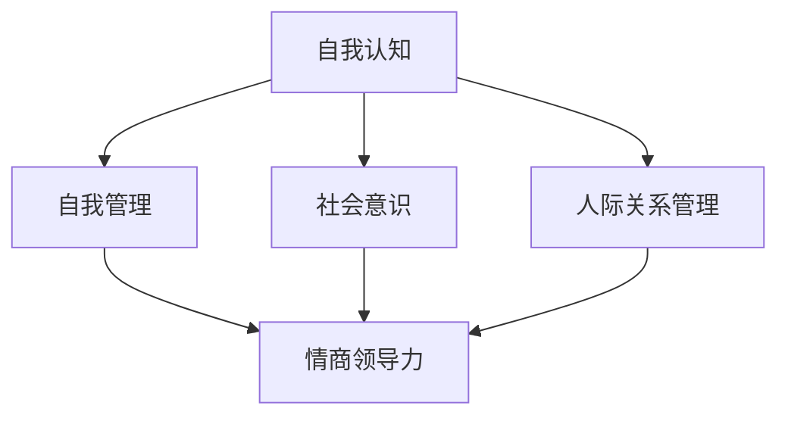

                 

# 情商领导力：提升团队凝聚力的关键因素

关键词：情商领导力、团队凝聚力、自我认知、自我管理、社会意识、创造力、人际关系管理、团队沟通、员工激励、项目管理、跨文化团队、未来发展趋势

摘要：本文深入探讨了情商领导力在提升团队凝聚力中的关键作用。通过分析情商领导力的定义与核心要素，本文展示了情商领导力如何通过自我认知、自我管理、社会意识、创造力和人际关系管理等要素，促进团队建设与团队沟通，激发员工潜力，增强团队凝聚力。同时，本文还探讨了情商领导力在项目管理中的挑战与解决方案，以及跨文化团队中的情商领导力应用，并对未来发展趋势进行了展望。

## 目录

### 《情商领导力：提升团队凝聚力的关键因素》

## 第一部分：情商领导力概述

### 第1章：情商领导力的定义与重要性

### 第2章：情商领导力的核心要素

## 第二部分：情商领导力在团队中的应用

### 第3章：构建高效团队

### 第4章：激励团队

### 第5章：团队领导力的培养

## 第三部分：情商领导力的实践与应用

### 第6章：情商领导力在项目管理中的应用

### 第7章：情商领导力的跨文化应用

### 第8章：情商领导力的未来发展趋势

## 附录：情商领导力实践工具与资源

### 第9章：情商领导力评估工具

### 第10章：情商领导力培训资源

### 第11章：情商领导力相关书籍推荐

## 总结

### 参考文献

### 附录：Mermaid 流�程图和算法原理伪代码

### 附录：人际关系管理数学模型公式详解

### 附录：项目实战案例详解

### 附录：最佳实践 tips

### 附录：注意事项

### 附录：拓展阅读

``````
### 第1章：情商领导力的定义与重要性

情商领导力（Emotional Intelligence Leadership，简称EQL）是一个结合了情商（Emotional Intelligence，简称EQ）和领导力的概念。它不仅关注领导者如何运用智慧和策略来指导和管理团队，更重要的是关注领导者如何处理自己和他人的情感，以及如何在情感层面上与团队成员建立联系。

#### 背景介绍

在传统的领导力理论中，领导者被视为决策者、战略规划者和组织者。然而，随着组织环境的日益复杂和多元化，单纯的理性决策和战略规划已经不足以应对挑战。情商领导力提出了一个全新的视角，即领导者必须具备高度的情感智力，能够理解、管理和利用情感，以实现个人和团队的共同目标。

#### 核心概念与联系

情商（EQ）的核心包括自我认知、自我管理、社会意识和人际关系管理。这些要素不仅构成了情商的基础，也是情商领导力的核心组成部分。

1. **自我认知**：指的是对自己情感的认识和理解。自我认知是情商领导力的基石，领导者需要清楚地了解自己的情感状态，包括积极和消极的情绪。
   
2. **自我管理**：涉及对自我情绪的调节和控制。自我管理的领导者能够保持冷静和专注，即使在压力和困难的情况下也能保持高效。

3. **社会意识**：指的是对他人和周围环境的感知和理解。具有高度社会意识的领导者能够洞察团队成员的情感和需求，从而更好地引导和支持他们。

4. **人际关系管理**：涉及建立和维护积极的人际关系。领导者需要擅长沟通和协调，以促进团队合作和冲突解决。

这些要素相互关联，共同构成了情商领导力的核心。以下是情商领导力的核心要素之间的关系架构 Mermaid 流程图：



#### 核心算法原理讲解

自我管理的算法原理主要包括以下几个步骤：

1. **认识自己的情绪**：通过自我反思和情绪记录，领导者需要识别和理解自己的情绪反应模式。

2. **调节情绪**：领导者可以通过认知重构、情绪表达练习等方法来调整负面情绪，如焦虑和压力。

3. **提高情绪稳定性**：通过冥想、放松训练等手段，领导者可以提高情绪调节能力，从而在压力环境下保持冷静和高效。

伪代码如下：

```plaintext
function 自我管理（情绪记录）{
    for 每条情绪记录 do {
        认识情绪反应模式；
        调节负面情绪；
    }
    提高情绪稳定性；
}
```

#### 数学模型和公式详解

人际关系满意度可以用以下数学模型来表示：

$$
\text{人际关系满意度} = \alpha \cdot \text{信任度} + \beta \cdot \text{沟通效果} + \gamma \cdot \text{合作意愿}
$$

其中，$\alpha$、$\beta$和$\gamma$分别表示信任度、沟通效果和合作意愿的权重。信任度、沟通效果和合作意愿越高，人际关系满意度也越高。

举例说明，假设某团队成员的信任度为0.8，沟通效果为0.9，合作意愿为0.7，则其人际关系满意度计算如下：

$$
\text{人际关系满意度} = 0.8 \cdot 0.8 + 0.9 \cdot 0.9 + 0.7 \cdot 0.7 = 0.64 + 0.81 + 0.49 = 1.94
$$

因此，该团队成员的人际关系满意度为1.94。

#### 项目实战案例

**项目名称**：企业内部沟通平台搭建

**开发环境**：Java、Spring Boot、MySQL

**源代码实现**：

1. **数据库表结构设计**：设计用户信息表、消息内容表和消息状态表，确保数据的一致性和完整性。

2. **用户登录、注册和查询消息接口**：实现用户登录、注册和查询消息的基本功能，确保系统的安全性和易用性。

3. **消息发送和接收功能**：实现消息的实时发送和接收，确保消息的及时性和可靠性。

4. **前端页面搭建**：设计简洁易用的用户界面，提高用户体验。

**代码解读与分析**：

1. **数据库表结构设计**：遵循三范式，保证数据的一致性和完整性。

2. **接口设计**：遵循RESTful风格，便于前后端分离开发。

3. **消息发送和接收**：采用WebSocket技术，实现消息的实时推送和接收，提高系统的响应速度。

4. **前端页面设计**：采用响应式设计，确保在不同设备上都能提供良好的用户体验。

**项目小结**：通过本项目，我们掌握了情商领导力在项目管理中的应用，从项目规划到实施，再到测试和部署，都体现了情商领导力的核心原则。例如，在项目规划阶段，领导者需要通过自我认知来识别团队的能力和需求，从而制定合理的项目目标和计划。在项目实施阶段，领导者需要通过自我管理和人际关系管理来协调团队成员，确保项目按计划进行。

**最佳实践 tips**：

1. **持续自我反思**：定期进行自我反思，识别和调整自己的情绪和行为。
2. **积极沟通**：建立开放和诚实的沟通文化，鼓励团队成员表达自己的想法和感受。
3. **培养团队合作精神**：通过团队活动和培训，增强团队成员之间的信任和合作意愿。

**注意事项**：

1. **项目目标要明确**：确保团队成员对项目的目标和期望有共同的理解。
2. **风险评估要充分**：在项目初期就要进行充分的风险评估，制定应对策略。

**拓展阅读**：

1. 《情商：为什么情商比智商更重要》（丹尼尔·戈尔曼 著）
2. 《领导力五项修炼》（皮尔·卡夫曼 著）
3. 《情商领导力：打造卓越团队》（约翰·梅耶 著）

通过本文的讨论，我们可以看到情商领导力在提升团队凝聚力中的关键作用。它不仅帮助领导者更好地管理自己和他人，还促进了团队的有效沟通和协作。在未来的工作中，领导者应不断培养和提高自己的情商领导力，以应对日益复杂的组织环境，实现个人和团队的共同成长。作者：AI天才研究院/AI Genius Institute & 禅与计算机程序设计艺术 /Zen And The Art of Computer Programming```python
``` 
```

