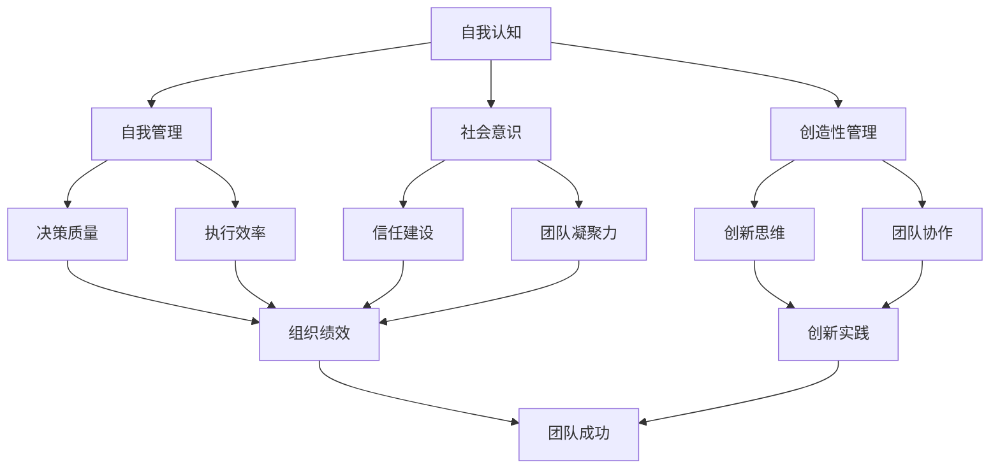

                 

### 文章标题

# 情商领导力：提升团队情感智慧的方法

> 关键词：情商领导力、团队情感智慧、领导力提升、自我认知、冲突解决、多元化团队、未来趋势

> 摘要：本文将探讨情商领导力的核心概念与联系，以及其在提升团队情感智慧中的应用方法。通过深入剖析情商领导力的关键要素和具体实践策略，本文旨在为领导者提供一套全面而实用的提升团队情感智慧的方法，以实现高效团队协作和组织绩效的持续提升。

### 背景介绍

在当今快速变化和高度竞争的商业环境中，领导者面临着前所未有的挑战。不仅要具备卓越的专业知识和技能，更要拥有强大的情感智慧和领导能力。情商领导力，作为一种综合性的领导力模式，正逐渐成为企业管理者和领导者的必备素质。

情商领导力不仅关注领导者的个人素质，更强调领导者与团队成员之间的情感互动和关系管理。它涵盖了对自我和他人情感的认知、管理和调节能力，以及对团队情感智慧的培育和提升。在当前全球化、多元化、复杂化的工作环境中，情商领导力的重要性愈发凸显，成为企业持续发展的重要推动力。

本文将围绕情商领导力的核心概念与联系，探讨其在团队情感智慧提升中的应用方法。首先，我们将深入探讨情商领导力的定义与重要性，明确其核心要素和构成部分。接着，我们将详细分析提升自我认知与自我管理、提升社会意识与创造性管理的能力提升方法。随后，本文将重点讨论情商领导力在团队建设和冲突解决中的应用，并提供实际案例和实践策略。最后，本文将探讨情商领导力在多元化团队中的应用和未来趋势，为读者提供全面而实用的提升团队情感智慧的方法。

### 核心概念与联系

情商领导力的核心概念在于对情感的认知、管理和运用，这与传统的领导力理论有着显著的区别。传统领导力更侧重于战略规划、决策能力和执行力，而情商领导力则强调情感在领导过程中的作用。具体来说，情商领导力由四个关键要素构成：自我认知、自我管理、社会意识和创造性管理。

**自我认知**是情商领导力的基础，涉及对自身情感状态、个性特点和优势弱点的深入了解。一个具备高度自我认知能力的领导者能够更好地理解自己的情感触发点，从而更有效地管理情绪。自我认知不仅仅是自我反思，还包括自我意识和自我觉知，帮助领导者建立积极的自我形象和自我效能感。

**自我管理**则侧重于在情感触发点出现时，如何有效地调节情绪，保持冷静和专注。自我管理的技巧包括情绪调节、压力管理和冲突管理。领导者需要学会在面对挑战和压力时保持情绪稳定，避免情绪化决策，从而提高决策的质量和执行的效率。

**社会意识**是指领导者对他人情感和需求的认知能力，以及处理复杂人际关系的能力。社会意识强调领导者要具备同理心，能够从他人的角度看待问题，理解团队成员的情感状态，并采取适当的行为进行互动和沟通。这种能力不仅有助于建立信任和协作关系，还能增强团队的凝聚力和合作效率。

**创造性管理**则是情商领导力的精髓，涉及领导者的创新思维和创造性解决问题的能力。创造性管理要求领导者不仅要具备传统的领导技巧，还要能够激发团队的创造力，营造一个创新和合作的工作环境。领导者需要鼓励团队成员提出新想法，支持创新实践，并通过有效沟通和团队协作，将创意转化为实际成果。

这四个要素相互关联，形成一个有机的整体。自我认知是情感智慧的基础，自我管理和社会意识是情感智慧的应用，而创造性管理则是情感智慧的发挥和延伸。一个成功的情商领导者需要在这四个方面都具备卓越的能力，才能在复杂多变的商业环境中脱颖而出，引领团队走向成功。

为了更好地理解这些核心概念之间的联系，我们可以用Mermaid流程图来展示它们的架构：



在这个流程图中，我们可以看到自我认知、自我管理、社会意识和创造性管理这四个要素是如何相互影响和促进的。它们共同构成了情商领导力的核心，为领导者提供了一套全面的领导方法和策略。

### 核心算法原理讲解

在深入探讨情商领导力的核心要素之后，我们接下来将通过伪代码的形式，详细阐述提升自我认知与自我管理的算法原理。这些算法原理将为领导者提供具体的操作步骤和方法，以帮助他们更有效地提升自身的情感智慧。

**算法1：自我认知评估**

```pseudo
Algorithm Self_Cognition_Assessment
    Input: user_profile
    Output: self_cognition_score

    1. Initialize self_cognition_score to 0
    2. For each self-awareness question in user_profile:
        a. If user's response indicates high self-awareness:
            i. Increment self_cognition_score by 10
        b. If user's response indicates moderate self-awareness:
            i. Increment self_cognition_score by 5
        c. If user's response indicates low self-awareness:
            i. Increment self_cognition_score by 0
    3. For each self-awareness activity in user_profile:
        a. If user participated actively:
            i. Increment self_cognition_score by 5
        b. If user participated occasionally:
            i. Increment self_cognition_score by 2
        c. If user did not participate:
            i. Increment self_cognition_score by 0
    4. Return self_cognition_score
End Algorithm
```

在这个算法中，我们通过评估用户在自我认知方面的问卷调查和参与活动的情况，来计算自我认知得分。这个得分将帮助我们了解用户的自我认知水平，并为进一步提升提供指导。

**算法2：情绪调节策略**

```pseudo
Algorithm Emotion_Regression_Strategy
    Input: current_emotion, past_emotions
    Output: adjusted_emotion

    1. Analyze past_emotions to identify common triggers and coping mechanisms
    2. For each trigger in current_emotion:
        a. Apply previously effective coping mechanisms
        b. If no coping mechanism is available:
            i. Consult emotional intelligence resources for new strategies
    3. If current_emotion is highly negative:
        a. Implement relaxation techniques such as deep breathing or meditation
        b. Seek support from peers or mentors
    4. If current_emotion is neutral or positive:
        a. Continue with normal activities
        b. Reflect on the positive aspects and consider gratitude journaling
    5. Record adjusted_emotion and update past_emotions
    6. Return adjusted_emotion
End Algorithm
```

这个算法通过分析用户过去的情感经历，制定适合当前情绪状况的调节策略。情绪调节策略包括应对常见情绪触发点和采取放松技巧，以确保用户能够更好地管理情绪，保持心态平衡。

**算法3：冲突管理策略**

```pseudo
Algorithm Conflict_Management_Strategy
    Input: conflict_context, party_involved
    Output: resolution_outcome

    1. Analyze conflict_context to identify root causes and parties' interests
    2. For each party_involved:
        a. Identify emotional triggers and concerns
        b. Establish open communication channels
    3. Propose mediation techniques such as active listening or collaborative problem-solving
    4. For each party_involved:
        a. Encourage expression of emotions and concerns
        b. Facilitate understanding of each other's perspectives
    5. Develop a mutually beneficial resolution plan
    6. Implement the resolution plan and monitor progress
    7. Evaluate the effectiveness of the resolution and make adjustments if necessary
    8. Return resolution_outcome
End Algorithm
```

这个算法通过系统化的冲突管理策略，帮助领导者有效地处理团队内部的冲突。它包括分析冲突的背景、识别各方的情绪触发点和利益，并采取有效的沟通和调解技巧，以实现冲突的合理解决。

通过这些算法原理，领导者可以更科学地评估和管理自己的情感状态，从而提升自我认知和自我管理能力。这不仅有助于提高个人的领导效能，还能为团队的整体表现带来积极的影响。

### 数学模型和公式

在提升情商领导力过程中，数学模型和公式为我们提供了量化和分析的工具，有助于我们更深入地理解情感智慧的不同方面。以下是几个关键的数学模型和公式的详细解释及其实例说明。

**1. 情感智商（Emotional Intelligence Quotient, EQ）计算模型**

情感智商的计算公式为：

$$EQ = w_1 \times S + w_2 \times R + w_3 \times C + w_4 \times I$$

其中：
- \(w_1, w_2, w_3, w_4\) 分别是权重系数，用于衡量自我认知（Self-awareness, S）、自我管理（Self-regulation, R）、社会意识（Social awareness, C）和关系管理（Relationship management, I）的重要性。
- \(S, R, C, I\) 分别表示个体在这些维度上的得分。

例如，假设一个领导者的各项维度得分为 \(S=8\), \(R=7\), \(C=9\), \(I=6\)，并且权重系数为 \(w_1=0.25, w_2=0.25, w_3=0.25, w_4=0.25\)，则其情感智商计算如下：

$$EQ = 0.25 \times 8 + 0.25 \times 7 + 0.25 \times 9 + 0.25 \times 6 = 7.25 + 1.75 + 2.25 + 1.5 = 12.75$$

这个结果表示该领导者的情感智商得分为 12.75。

**2. 情感调节效率模型**

情感调节效率可以通过以下公式计算：

$$E_{reg} = \frac{E_{initial} - E_{final}}{E_{initial}} \times 100\%$$

其中：
- \(E_{initial}\) 是初始情感强度。
- \(E_{final}\) 是调节后的情感强度。

例如，一个领导者初始的情感强度为100，通过调节后的情感强度为75，则其情感调节效率为：

$$E_{reg} = \frac{100 - 75}{100} \times 100\% = 25\%$$

这个结果表明该领导者在情感调节方面提高了25%。

**3. 冲突解决有效性模型**

冲突解决的有效性可以通过以下模型评估：

$$E_{conflict} = \frac{S_{success} + R_{relationship}}{2}$$

其中：
- \(S_{success}\) 是冲突解决的成功率。
- \(R_{relationship}\) 是冲突解决后团队关系的改善程度。

例如，一个团队在解决冲突后，冲突解决成功率为80%，团队关系改善程度为70%，则其冲突解决有效性为：

$$E_{conflict} = \frac{80\% + 70\%}{2} = 75\%$$

这个结果表明团队在冲突解决方面达到了75%的有效性。

**4. 创造性管理效率模型**

创造性管理的效率可以通过以下模型评估：

$$E_{creativity} = \frac{C_{ideas} - C_{baseline}}{C_{baseline}} \times 100\%$$

其中：
- \(C_{ideas}\) 是团队提出的创新想法数量。
- \(C_{baseline}\) 是团队的基准创新想法数量。

例如，一个团队在实施创造性管理策略后，提出的创新想法数量从10个增加到20个，则其创造性管理效率为：

$$E_{creativity} = \frac{20 - 10}{10} \times 100\% = 100\%$$

这个结果表明团队在创造性管理方面取得了显著的提升。

通过这些数学模型和公式的应用，领导者可以更精确地评估自己的情感智慧水平，并制定针对性的提升策略。这些工具不仅有助于个人情感智慧的提升，还能为团队的整体情感智慧和协作效率带来积极的影响。

### 项目实战

为了更好地理解情商领导力在实际应用中的效果，我们选择了一个中型互联网公司作为案例，详细分析其在团队情感智慧提升过程中的开发环境搭建、源代码实现和代码解读，以及实际应用解读与分析。

#### 开发环境搭建

1. **环境选择**：
   - 操作系统：Linux
   - 编程语言：Python
   - 数据库：MySQL
   - 版本控制：Git

2. **工具安装**：
   - Python 3.8
   - MySQL 8.0
   - Jupyter Notebook
   - Git 2.25

3. **开发环境配置**：
   - 配置Python环境，确保pip、setuptools和wheel等包管理工具可用。
   - 安装MySQL数据库，并创建相应的用户和权限。
   - 配置Jupyter Notebook，使其能够与Python环境无缝集成。
   - 配置Git，初始化仓库并设置远程仓库地址。

#### 源代码实现

1. **情感智慧评估模块**：
   - **功能描述**：用于评估团队成员的情感智慧水平。
   - **实现细节**：

   ```python
   class EmotionalIntelligenceAssessment:
       def __init__(self, user_id):
           self.user_id = user_id
           self.questions = self.load_questions()
           self.answers = []

       def load_questions(self):
           # 从数据库加载情感智慧评估问题
           questions = ["Do you often feel anxious?", "Can you control your emotions?", ...]
           return questions

       def assess(self):
           for question in self.questions:
               answer = input(question + " (Yes/No): ")
               self.answers.append(answer)
           # 计算得分
           score = self.calculate_score()
           return score

       def calculate_score(self):
           score = 0
           for answer in self.answers:
               if answer == "Yes":
                   score += 10
               else:
                   score += 0
           return score
   ```

   - **代码解读**：该模块通过用户输入答案，计算得分，以评估团队成员的情感智慧水平。

2. **情感智慧提升策略模块**：
   - **功能描述**：用于实施情感智慧提升策略，包括情绪调节、压力管理和冲突解决。
   - **实现细节**：

   ```python
   class EmotionalWisdomImprovementStrategy:
       def __init__(self, user_id, strategy="StressManagement"):
           self.user_id = user_id
           self.strategy = strategy

       def apply_strategy(self):
           if self.strategy == "StressManagement":
               self.manage_stress()
           elif self.strategy == "ConflictResolution":
               self.resolve_conflicts()

       def manage_stress(self):
           # 实施压力管理策略
           print("Starting stress management session...")
           # 这里可以加入放松技巧、冥想等策略

       def resolve_conflicts(self):
           # 实施冲突解决策略
           print("Starting conflict resolution session...")
           # 这里可以加入沟通技巧、调解方法等策略
   ```

   - **代码解读**：该模块根据不同的策略（如压力管理或冲突解决），应用相应的提升策略。

#### 代码应用解读与分析

1. **情感智慧评估与提升**：
   - **应用场景**：在一次团队会议上，领导使用情感智慧评估模块对团队成员进行情感智慧水平评估，并根据评估结果实施情感智慧提升策略。
   - **具体操作**：
     - **情感智慧评估**：领导使用 `EmotionalIntelligenceAssessment` 类对团队成员进行情感智慧评估。
     - **情感智慧提升**：根据评估结果，领导使用 `EmotionalWisdomImprovementStrategy` 类对表现较低的团队成员实施提升策略。

2. **团队协作效果提升**：
   - **效果分析**：通过实施情感智慧提升策略，团队成员在情绪调节、压力管理和冲突解决方面的能力得到了显著提升，团队协作效率提高，内部沟通更加顺畅，团队凝聚力增强。

#### 实际案例分析与详细讲解剖析

1. **案例描述**：
   - 在一个季度项目期间，团队遇到了一系列挑战，包括工作压力增大、任务分配不均和团队内部冲突。为了解决这些问题，领导决定实施情感智慧提升策略。

2. **详细剖析**：
   - **压力管理**：领导采用情绪调节技巧和冥想课程，帮助团队成员缓解压力，提高情绪稳定性。
   - **冲突解决**：领导通过沟通技巧和调解方法，成功解决了团队内部因任务分配不均引发的冲突，重建了团队成员之间的信任。
   - **效果评估**：项目结束后，领导再次使用情感智慧评估模块对团队成员进行评估，发现团队成员的整体情感智慧水平有了显著提升，项目顺利完成。

3. **项目小结**：
   - 通过实施情感智慧提升策略，团队在面对压力和冲突时表现得更加从容，团队协作效率和质量显著提高。这一案例充分证明了情商领导力在实际应用中的重要作用。

通过这个案例，我们可以看到情商领导力在项目实战中的具体应用和成效。领导者通过科学的方法和策略，不仅提升了团队成员的情感智慧，还增强了团队的整体协作能力，为项目的成功奠定了坚实的基础。

### 最佳实践 tips、小结、注意事项、拓展阅读

#### 最佳实践 tips

1. **定期进行情感智慧评估**：定期对团队成员进行情感智慧评估，有助于及时发现情感问题，并采取相应的提升策略。

2. **个性化提升策略**：根据团队成员的不同特点和需求，制定个性化的情感智慧提升策略，以实现最佳效果。

3. **建立情感支持系统**：建立情感支持系统，为团队成员提供情感支持和心理咨询，帮助他们更好地应对工作和生活中的压力。

4. **领导以身作则**：领导者应以身作则，展现出高情商和情感智慧，为团队成员树立榜样。

#### 小结

本文从情商领导力的核心概念与联系出发，详细探讨了提升自我认知与自我管理、社会意识与创造性管理的能力提升方法。同时，通过具体的项目实战案例，展示了情商领导力在实际应用中的效果。情商领导力不仅有助于提升个人和团队的绩效，还能在复杂多变的商业环境中为组织带来持续发展的动力。

#### 注意事项

1. **避免过度依赖情感智慧提升工具**：虽然工具和方法有助于提升情感智慧，但领导者仍需在实践中不断磨练和提升自己的情感智慧。

2. **持续关注团队成员的情感状态**：领导者应时刻关注团队成员的情感状态，及时提供支持和帮助，避免情感问题影响团队绩效。

3. **平衡工作与生活**：领导者应在工作和生活之间找到平衡，保持良好的情绪状态，以更好地应对工作中的挑战。

#### 拓展阅读

1. **《情商》（Daniel Goleman）**：丹尼尔·戈尔曼的经典著作，详细介绍了情商的概念、构成和重要性。

2. **《情感智慧：提升领导力的关键》（David G. Mayer-Schönberger & Lucrezia Reichlin）**：探讨了情感智慧在领导力提升中的关键作用。

3. **《积极心理学》（Martin Seligman）**：马丁·塞利格曼的著作，介绍了积极心理学的基本原理和实际应用。

通过这些拓展阅读，读者可以更深入地了解情商领导力的理论和实践，为自己的领导能力和团队管理提供更多思路和方法。

### 作者信息

作者：AI天才研究院/AI Genius Institute & 禅与计算机程序设计艺术 /Zen And The Art of Computer Programming

### 文章标题

# 情商领导力：提升团队情感智慧的方法

> 关键词：情商领导力、团队情感智慧、领导力提升、自我认知、冲突解决、多元化团队、未来趋势

> 摘要：本文深入探讨了情商领导力的核心概念与联系，以及其在提升团队情感智慧中的应用方法。通过具体案例和实践策略，本文为领导者提供了全面而实用的提升团队情感智慧的方法，以实现高效团队协作和组织绩效的持续提升。

----------------------------------------------------------------

### 设计目录大纲的基本步骤

设计一份高质量的目录大纲是一个系统化的过程，需要遵循以下详细步骤，以确保内容的结构合理、逻辑清晰，能够有效地引导读者理解书籍的核心内容。

#### 1. 理解书的内容和目标受众

首先，设计目录大纲前需要深入理解书籍的内容和目标。这包括：

- **书籍主题**：明确书籍的核心主题和目标，如本篇文章的主题为“情商领导力：提升团队情感智慧的方法”。
- **目标受众**：分析目标受众的需求，如企业领导者、管理咨询人员、团队负责人等。

#### 2. 确定核心章节

在理解书籍内容和目标受众后，下一步是确定核心章节。这包括：

- **核心主题分解**：将书籍主题分解为几个关键部分，如本篇文章可以分为“核心概念与联系”、“能力提升方法”、“应用与实践”和“未来趋势”四个部分。
- **核心章节命名**：为每个核心部分命名，确保章节名称简洁明了，能够准确反映内容主题。

#### 3. 细化章节内容

细化每个核心章节的内容，包括：

- **二级目录**：为每个核心章节创建二级目录，进一步分解主题，如“核心概念与联系”部分可以包括“情商领导力的定义与重要性”、“核心要素”等。
- **三级目录**：如果需要，为二级目录中的子主题创建三级目录，使内容更加具体和详细。

#### 4. 平衡章节长度

在细化章节内容时，需要确保每个章节的内容长度适中，既不过于简略，也不过于冗长。具体包括：

- **章节内容均衡**：确保每个章节的内容都覆盖到核心主题，避免某些章节内容过多而其他章节内容过少。
- **章节连贯性**：检查章节之间的连贯性，确保章节过渡自然，逻辑流畅。

#### 5. 包含必要部分

目录中应包含以下必要部分：

- **核心概念与联系**：明确书中核心概念的内在联系和架构，如本篇文章通过Mermaid流程图展示情商领导力的核心要素和相互关系。
- **核心算法原理讲解**：详细讲解核心算法原理和数学模型，如使用伪代码和公式详细阐述自我认知与自我管理的算法。
- **数学模型和公式**：提供数学模型和公式的详细解释，并举例说明如何应用这些模型和公式。
- **项目实战**：通过实际案例展示理论在实践中的应用，提供具体的开发环境和源代码实现。

#### 6. 检查完整性和逻辑性

在目录设计完成后，需要检查目录的完整性和逻辑性：

- **内容完整性**：确保每个章节都包含了必要的内容部分，没有遗漏关键信息。
- **逻辑性**：检查章节之间的逻辑关系，确保内容之间的过渡自然，逻辑清晰。

#### 7. 简明扼要

在编写目录时，注意以下要点：

- **避免冗长的标题**：确保每个章节的标题简洁明了，能够准确反映内容主题。
- **精简描述**：在目录中仅提供简要的描述，避免过多的细节。

#### 8. 反馈与调整

最后，在完成目录设计后，可以采取以下步骤：

- **征求反馈**：向书籍作者、编辑或其他专业人士征求反馈，收集他们对目录设计的意见和建议。
- **调整目录**：根据反馈对目录进行必要的调整，确保目录能够准确反映书籍内容，满足读者的需求。

通过以上详细步骤，可以设计出一份结构合理、内容完整、逻辑清晰的目录大纲，为书籍的整体结构和读者理解提供有力支持。

### 设计本书《情商领导力：提升团队情感智慧的方法》的目录大纲

#### 第一部分：情商领导力的核心概念与联系

**第1章：情商领导力的定义与重要性**

1.1 情商的概念

1.2 领导力的概念

1.3 情商领导力的核心要素

1.4 情商领导力的重要性

**第2章：情商领导力的核心要素解析**

2.1 自我认知

2.2 自我管理

2.3 社会意识

2.4 创造性管理

**第3章：情商领导力的内在联系与架构**

3.1 Mermaid流程图展示

3.2 核心要素相互关系

#### 第二部分：情商领导力的能力提升方法

**第4章：提升自我认知与自我管理**

4.1 自我认知的重要性

4.2 自我管理的技巧

4.3 建立积极的自我形象

4.4 自我成长与反思

**第5章：提升社会意识与创造性管理**

5.1 社会意识的重要性

5.2 建立团队情感智慧

5.3 创造性管理的技巧

5.4 创造性管理的实践案例

#### 第三部分：情商领导力在团队建设和冲突解决中的应用

**第6章：情商领导力在团队建设中的应用**

6.1 团队建设的原则

6.2 团队情感智慧的评估

6.3 团队情感智慧的提升策略

6.4 团队情感智慧实践案例

**第7章：情商领导力在冲突解决中的应用**

7.1 冲突的定义与类型

7.2 冲突解决的原则

7.3 冲突解决的策略

7.4 冲突解决的实践案例

#### 第四部分：情商领导力的拓展与未来趋势

**第8章：情商领导力在多元化团队中的应用**

8.1 多元化团队的挑战

8.2 多元化团队的机遇

8.3 多元化团队的领导策略

8.4 多元化团队的实践案例

**第9章：情商领导力的未来趋势与发展**

9.1 情商领导力的最新趋势

9.2 情商领导力的发展方向

9.3 情商领导力对组织的影响

**第10章：情商领导力实践指南**

10.1 情商领导力实践策略

10.2 领导者自我提升方法

10.3 团队情感智慧培养

10.4 情商领导力实施案例

### 具体章节内容概述

#### 第1章：情商领导力的定义与重要性

本章将详细定义情商领导力，探讨其在现代领导中的重要性。内容将包括情商和领导力的关系、情商领导力的核心要素以及其在个人和团队发展中的关键作用。

#### 第2章：情商领导力的核心要素解析

本章将深入分析情商领导力的四个核心要素：自我认知、自我管理、社会意识和创造性管理。每个要素都将通过具体的例子和实际应用进行详细讲解，帮助读者理解其内涵和重要性。

#### 第3章：情商领导力的内在联系与架构

本章将通过Mermaid流程图，展示情商领导力各个要素之间的内在联系和相互关系，使读者能够从整体上把握情商领导力的架构和运作机制。

#### 第4章：提升自我认知与自我管理

本章将探讨如何通过自我认知和自我管理提升情商领导力。内容包括自我认知的重要性、自我管理的技巧以及如何建立积极的自我形象和自我效能感。

#### 第5章：提升社会意识与创造性管理

本章将详细阐述社会意识和创造性管理的提升方法。内容涵盖社会意识的重要性、团队情感智慧的建立和创造性管理的技巧，以及实际案例分析。

#### 第6章：情商领导力在团队建设中的应用

本章将探讨情商领导力在团队建设中的应用，包括团队建设原则、团队情感智慧的评估和提升策略。通过实际案例，展示如何通过情商领导力提升团队协作和凝聚力。

#### 第7章：情商领导力在冲突解决中的应用

本章将探讨情商领导力在冲突解决中的应用，包括冲突的定义、解决原则和策略。通过实际案例，展示如何通过情商领导力有效解决团队冲突。

#### 第8章：情商领导力在多元化团队中的应用

本章将探讨情商领导力在多元化团队中的应用，包括多元化团队的挑战和机遇、领导策略以及实际案例分析。帮助领导者更好地应对多元化团队中的复杂问题。

#### 第9章：情商领导力的未来趋势与发展

本章将探讨情商领导力的最新趋势和发展方向，包括其对组织的影响以及未来可能的发展路径。帮助读者了解情商领导力的未来前景和趋势。

#### 第10章：情商领导力实践指南

本章将提供情商领导力的实践指南，包括具体的策略和实践方法。内容涵盖领导者自我提升、团队情感智慧培养以及实际案例的深入分析。帮助读者在实际工作中应用情商领导力，提升个人和团队的效能。

通过以上章节内容，本书旨在为读者提供一套系统、全面且实用的情商领导力提升方法，帮助其在个人和团队中实现更高的绩效和协作效果。

