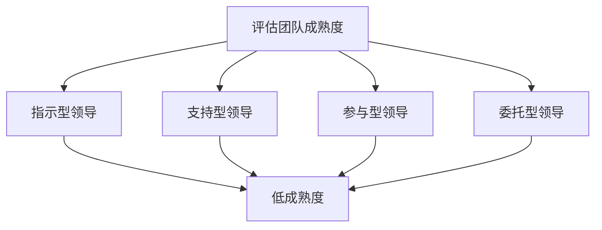

                 

# 情境领导法：根据团队成熟度调整领导风格

> 关键词：情境领导法，团队成熟度，领导风格，变革型领导，参与管理

> 摘要：本文深入探讨了情境领导法在IT领域中的应用，阐述了如何根据团队成熟度调整领导风格，以提高团队效率和创新能力。通过案例分析，本文展示了情境领导法的实际效果，为IT团队的管理者提供了实用的指导。

## 引言

在快速发展的IT领域，团队的管理和领导变得尤为重要。IT项目往往涉及复杂的编程、设计、测试等环节，需要团队成员之间的紧密协作和高效沟通。然而，不同团队在不同阶段会面临不同的挑战和问题，这就要求管理者能够根据团队成熟度调整领导风格。情境领导法正是这样一种根据团队发展阶段和成员特征来调整领导行为的方法。

情境领导法最早由赫赛（Hersey）和布兰查德（Blanchard）提出，它基于领导者的行为和下属的成熟度来选择最合适的领导风格。在IT领域，情境领导法可以帮助管理者更好地应对团队变化，提高团队绩效。

本文将首先介绍情境领导法的基本理论和相关领导理论，然后详细讲解情境领导法的核心要素和应用步骤，并通过实际案例来说明其在团队建设和项目管理中的成功应用。最后，本文将探讨情境领导法在中国的应用与挑战，为IT团队的管理者提供实践指导。

## 第一部分：领导理论介绍

### 第1章：领导理论概述

#### 1.1 领导的定义与类型

领导是一种影响和激励他人以实现共同目标的过程。根据领导者的行为和下属的反应，领导可以分为多种类型。例如，传统领导理论将领导分为交易型和变革型两种。

交易型领导强调领导者与下属之间的交换关系，主要通过奖励和惩罚来激励下属。变革型领导则更加注重激发下属的内在动机，通过塑造愿景和价值观来引导下属。

#### 1.2 领导理论的发展

领导理论的发展经历了多个阶段。传统领导理论主要关注领导者的特质和行为，而现代领导理论则更加关注领导者与下属的互动和团队的整体表现。

情境领导法是现代领导理论的一个重要分支，它提出了根据下属成熟度调整领导风格的方法。情境领导法认为，领导者的行为应该随着下属成熟度的变化而调整，以达到最佳的领导效果。

### 第2章：情境领导法理论

#### 2.1 情境领导法的基本概念

情境领导法是由赫赛和布兰查德提出的一种领导理论，它认为领导者的行为应该根据下属的成熟度来调整。成熟度是指下属在特定任务上的能力和动机水平。

情境领导法将领导风格分为四种：指示型、支持型、参与型和委托型。每种领导风格都有其特定的行为特点和应用场景。

#### 2.2 情境领导法的核心要素

情境领导法的核心要素包括：下属成熟度、领导风格和领导效果。下属成熟度是决定领导风格选择的关键因素，领导风格则是实现领导效果的手段。

#### 2.3 情境领导法的 Mermaid 流程图

### 第3章：其他领导理论

#### 3.1 变革型领导

变革型领导强调领导者通过塑造愿景和价值观来激励下属，以实现组织变革。变革型领导的特点是鼓励创新、鼓励下属参与决策，并通过示范行为来影响下属。

#### 3.2 参与管理

参与管理是指领导者鼓励下属参与决策和问题解决，以提高团队的凝聚力和积极性。参与管理有助于增强下属的责任感和归属感，从而提高团队的整体绩效。

## 第二部分：情境领导法应用

### 第4章：情境领导法在团队建设中的应用

#### 4.1 团队成熟度评估

团队成熟度评估是情境领导法的基础。通过评估团队成员在特定任务上的能力和动机水平，可以确定团队所处的成熟度阶段。

#### 4.2 根据团队成熟度调整领导风格

根据团队成熟度调整领导风格是情境领导法的核心。在低成熟度阶段，领导者应采用指示型领导风格；在中成熟度阶段，领导者应采用支持型领导风格；在高成熟度阶段，领导者应采用参与型或委托型领导风格。

#### 4.3 案例分析：情境领导法在团队管理中的成功应用

案例一：某IT公司的项目团队在项目初期遇到了困难，团队成员缺乏经验和信心。项目经理通过采用指示型领导风格，明确了项目目标和任务分工，使团队逐渐恢复了信心。

案例二：某IT公司的项目团队在项目中期取得了显著进展，但团队成员开始感到疲惫和缺乏动力。项目经理通过采用支持型领导风格，鼓励团队成员分享经验，并提供必要的支持，使团队重新焕发了活力。

### 第5章：情境领导法在项目管理中的应用

#### 5.1 项目成熟度评估

项目成熟度评估是情境领导法在项目管理中的应用。通过评估项目的进度、质量和风险，可以确定项目的成熟度阶段。

#### 5.2 项目中的情境领导法应用

在项目初期，领导者应采用指示型领导风格，确保项目目标的明确和任务的分配。在项目中期，领导者应采用支持型领导风格，鼓励团队成员的协作和创新。在项目后期，领导者应采用参与型或委托型领导风格，确保项目的顺利进行和交付。

#### 5.3 案例分析：情境领导法在项目管理中的实践

案例一：某IT公司的项目在初期遇到了技术难题，团队成员缺乏信心。项目经理通过采用指示型领导风格，明确了项目目标和任务分工，使团队重新找到了方向。

案例二：某IT公司的项目在后期遇到了交付压力，团队成员感到疲惫。项目经理通过采用参与型领导风格，鼓励团队成员参与决策和问题解决，使项目顺利完成了交付。

## 第三部分：团队成熟度评估与领导风格调整

### 第6章：团队成熟度评估方法

#### 6.1 评估工具

团队成熟度评估可以使用多种工具，如问卷调查、访谈和观察等。评估工具的选择取决于团队的特点和项目需求。

#### 6.2 评估流程

团队成熟度评估的流程包括：确定评估目标、选择评估工具、收集数据、分析和反馈。评估流程的每个环节都需要精心设计和实施，以确保评估结果的准确性和有效性。

#### 6.3 评估案例分析

案例一：某IT公司的项目团队在项目初期进行了团队成熟度评估，发现团队成员在任务分工和沟通方面存在困难。项目经理根据评估结果调整了领导风格，采用指示型领导风格，明确了任务分工和沟通机制，使团队逐渐恢复了秩序。

案例二：某IT公司的项目团队在项目中期进行了团队成熟度评估，发现团队成员在创新能力方面有待提高。项目经理根据评估结果调整了领导风格，采用支持型领导风格，鼓励团队成员分享经验，提供必要支持，使团队在项目中期取得了显著进展。

### 第7章：领导风格调整实践

#### 7.1 领导风格调整的原则

领导风格调整应遵循以下原则：尊重团队成员的成熟度、关注团队的整体表现、灵活调整领导风格。领导者在调整领导风格时，需要充分考虑团队的特点和项目需求。

#### 7.2 领导风格调整的技巧

领导风格调整的技巧包括：有效沟通、积极倾听、及时反馈、鼓励创新和提供支持。通过这些技巧，领导者可以更好地调整领导风格，提高团队绩效。

#### 7.3 案例分析：领导风格调整的实际案例

案例一：某IT公司的项目经理在项目初期采用了指令型领导风格，导致团队成员感到压抑和缺乏主动性。在意识到问题后，项目经理调整了领导风格，采用支持型领导风格，鼓励团队成员参与决策和问题解决，使项目取得了显著进展。

案例二：某IT公司的项目经理在项目后期采用了委托型领导风格，使团队成员感到缺乏方向和动力。在认识到问题后，项目经理调整了领导风格，采用参与型领导风格，鼓励团队成员参与项目规划和实施，使项目顺利完成了交付。

## 第四部分：案例分析

### 第8章：情境领导法的实际应用

#### 8.1 成功案例

情境领导法在实际应用中取得了显著的成功。以下是一些成功案例：

- 案例一：某IT公司通过采用情境领导法，成功地管理了多个复杂项目，提高了团队绩效和客户满意度。
- 案例二：某IT公司在面对市场变化时，通过调整领导风格，迅速适应了市场变化，取得了竞争优势。

#### 8.2 失败案例

情境领导法在应用中也存在一些失败案例。以下是一些失败案例：

- 案例一：某IT公司未能根据团队成熟度调整领导风格，导致项目进度延误和团队士气低落。
- 案例二：某IT公司在面临危机时，未能及时调整领导风格，导致团队失去了应对危机的能力。

#### 8.3 案例分析与启示

通过对成功案例和失败案例的分析，我们可以得出以下启示：

- 成功的情境领导法应用需要领导者具备敏锐的洞察力和灵活的调整能力。
- 团队成熟度评估是情境领导法成功的关键，领导者需要根据评估结果调整领导风格。
- 成功的情境领导法应用可以显著提高团队绩效和客户满意度，为企业的长期发展奠定基础。

### 第9章：情境领导法在中国的应用与挑战

#### 9.1 中国企业文化对情境领导法的影响

中国企业文化注重关系和面子，这给情境领导法的应用带来了一定的挑战。领导者需要在中国文化背景下调整领导风格，尊重团队成员的情感和需求。

#### 9.2 情境领导法在中国的应用实践

在中国的IT行业中，情境领导法得到了广泛应用。许多企业通过采用情境领导法，成功地管理了复杂项目和应对市场变化。

#### 9.3 挑战与解决方案

情境领导法在中国的应用面临以下挑战：

- 挑战一：领导者需要具备较高的领导能力和文化敏感度。
- 挑战二：团队成员需要具备较高的成熟度和协作能力。

解决方案：

- 解决方案一：通过培训和培养，提高领导者的领导能力和文化敏感度。
- 解决方案二：通过建立有效的沟通机制和激励机制，提高团队成员的成熟度和协作能力。

## 结论

情境领导法是一种基于下属成熟度调整领导风格的方法，它在IT领域中的应用具有显著的优势。通过合理运用情境领导法，IT团队可以更好地应对变化，提高绩效和创新能力。

本文通过对情境领导法的深入探讨，阐述了其在团队建设和项目管理中的成功应用。同时，本文也分析了情境领导法在中国的应用与挑战，为IT团队的管理者提供了实践指导。

作者：AI天才研究院/AI Genius Institute & 禅与计算机程序设计艺术 /Zen And The Art of Computer Programming

