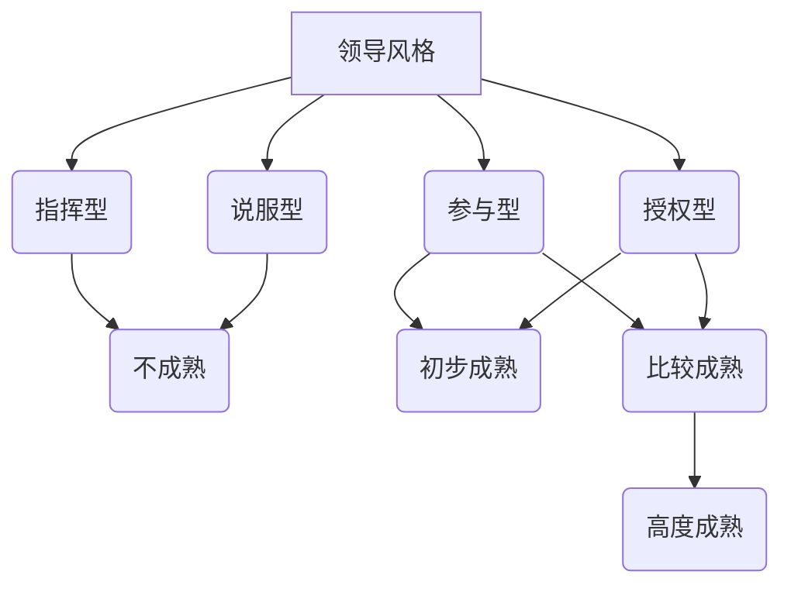

                 

## 文章标题

《情境领导理论：根据团队成熟度调整领导方式》

> 关键词：情境领导理论、团队成熟度、领导风格、领导能力、领导力发展

摘要：本文将深入探讨情境领导理论，分析团队成熟度对领导方式的影响，并讨论如何根据团队成熟度调整领导策略。通过阐述核心概念与联系，解释关键算法原理，以及分享实际案例，本文旨在为领导者提供一套实用且有效的领导方法，以提升团队绩效和员工满意度。

----------------------------------------------------------------

### 情境领导理论的背景

情境领导理论（Situation Leadership Theory）是由保罗·赫塞（Paul Hersey）和肯尼斯·布兰查德（Kenneth Blanchard）在20世纪50年代提出的，是一种基于领导者与团队成员之间互动关系的领导理论。该理论的核心思想是，领导者应该根据团队成员的能力和情境的变化来调整自己的领导风格，而不是采用一种固定的领导方式。

情境领导理论的发展可以追溯到赫塞和布兰查德在1950年代对领导行为的早期研究。他们发现，许多领导者倾向于使用单一的领导风格，例如民主式或权威式，而忽视了团队成员的个性差异和具体情境的影响。这种“一刀切”的领导方式往往导致团队绩效低下和员工不满。

为了解决这一问题，赫塞和布兰查德提出了情境领导理论，强调领导者需要具备灵活调整领导风格的能力。他们认为，不同的团队成员在不同的情境下需要不同的领导风格。因此，领导者应该根据团队成员的成熟度水平来选择最合适的领导方式。

情境领导理论的提出，标志着领导理论从传统的“特质理论”和“行为理论”向“情境理论”的转变。这一理论的创新之处在于，它将领导行为与团队成员的个性特征和情境因素结合起来，提出了一种更加灵活和实用的领导方法。

在情境领导理论的发展过程中，赫塞和布兰查德还提出了“领导者成熟度模型”，用于评估团队成员的成熟度水平。成熟度模型包括四个阶段：不成熟、初步成熟、比较成熟和高度成熟。每个阶段对应的团队成员具有不同的能力和态度，需要领导者采用不同的领导风格。

总之，情境领导理论为领导者提供了一种有效的指导框架，帮助他们根据团队成员的能力和情境的变化来调整领导方式。这一理论在管理实践中的应用，有助于提升团队绩效、增强员工满意度和实现组织目标。

### 核心概念与联系

情境领导理论中包含了几个核心概念，这些概念相互关联，共同构成了该理论的基础。以下是这些核心概念的详细解释，以及它们之间的关系。

#### 领导风格

领导风格是指领导者在与团队成员互动时表现出来的行为方式。情境领导理论中，领导风格被分为四种类型：指挥型、说服型、参与型和授权型。每种领导风格都适用于特定的情境和团队成员成熟度。

- **指挥型**：领导者详细指导团队成员，告诉他们该做什么、如何做，适用于不成熟的团队成员。
- **说服型**：领导者通过沟通和说服来激励团队成员，让他们接受任务并完成任务，适用于初步成熟的团队成员。
- **参与型**：领导者与团队成员共同决策，团队成员有一定的自主性，适用于比较成熟的团队成员。
- **授权型**：领导者给予团队成员高度自主权，让他们自主管理和完成任务，适用于高度成熟的团队成员。

#### 团队成熟度

团队成熟度是指团队成员在工作中的能力和态度水平。情境领导理论将团队成熟度分为四个阶段：不成熟、初步成熟、比较成熟和高度成熟。团队成熟度直接影响领导风格的选择。

- **不成熟**：团队成员缺乏工作技能和自主性，依赖领导者的指导和监督。
- **初步成熟**：团队成员具备一定的技能，但缺乏自主性，需要领导者的激励和指导。
- **比较成熟**：团队成员既有技能又具备一定的自主性，愿意参与决策，但仍需要领导者的支持和反馈。
- **高度成熟**：团队成员具备高度的工作技能和自主性，能够自我管理，独立完成任务。

#### 情境因素

情境因素是指影响领导行为和工作绩效的外部环境因素，包括任务性质、团队文化、组织结构等。情境领导理论认为，领导者的领导风格应该根据情境因素的变化而调整。

#### 关系架构 Mermaid 流程图

以下是一个简化的 Mermaid 流程图，展示了这些核心概念之间的关系：



#### 核心概念联系解释

- **领导风格与团队成熟度的关系**：领导风格的选择直接取决于团队成熟度。当团队成员成熟度较低时，领导者需要采取更权威的指挥型或说服型领导风格；而当团队成员成熟度较高时，领导者可以采用更民主的参与型或授权型领导风格。
- **领导风格与情境因素的关系**：情境因素会影响团队成熟度，进而影响领导风格的选择。例如，在一个任务紧急且复杂的环境中，领导者可能需要采取更直接的指挥型领导风格，以确保任务顺利完成。
- **团队成熟度与情境因素的关系**：团队成熟度受到情境因素的影响。在支持性强的团队文化中，团队成员可能更容易达到高成熟度；而在压力大的环境中，团队成员的成熟度可能会下降。

通过以上核心概念的解释和关系架构的展示，我们可以更清晰地理解情境领导理论的基本框架和原理。这些概念相互关联，共同构成了一个完整的领导理论体系，为领导者提供了实用的指导，以根据团队成员的成熟度和情境因素来调整领导风格。

### 核心算法原理讲解

在情境领导理论中，领导者根据团队成熟度和情境因素来选择最合适的领导风格，这一过程可以被视为一个决策过程。为了更好地理解这一决策过程，我们可以将其抽象为一个简单的算法。以下是一个详细的伪代码描述，用于解释这一决策过程：

```pseudo
Algorithm SelectLeadershipStyle(team_maturity, context_factors):
    // 初始化领导风格选择
    leadership_style = NULL

    // 根据团队成熟度选择基础领导风格
    if team_maturity == "immature":
        leadership_style = "Directing"
    elif team_maturity == "developing":
        leadership_style = "Supporting"
    elif team_maturity == "mature":
        leadership_style = "Participating"
    elif team_maturity == "highly_mature":
        leadership_style = "Delegating"

    // 根据情境因素调整领导风格
    if context_factors["urgency"] > threshold_urgency:
        leadership_style = Max(leader_style, "Directing")
    if context_factors["complexity"] > threshold_complexity:
        leadership_style = Max(leader_style, "Supporting")
    if context_factors["team_culture"] == "supportive":
        leadership_style = Min(leader_style, "Participating")
    if context_factors["organizational_structure"] == "flat":
        leadership_style = Min(leader_style, "Delegating")

    // 返回最终选择的领导风格
    return leadership_style
```

在这个伪代码中，我们定义了一个选择领导风格的算法 `SelectLeadershipStyle`，它接收两个参数：`team_maturity`（团队成熟度）和 `context_factors`（情境因素）。算法首先根据团队成熟度选择一个基础领导风格，然后根据情境因素进行调整。

以下是伪代码的详细解释：

1. **初始化领导风格选择**：算法开始时，将 `leadership_style` 设为 `NULL`，表示尚未确定最终的领导风格。

2. **根据团队成熟度选择基础领导风格**：算法使用条件语句根据团队成熟度选择一个基础领导风格。对于不成熟（immature）和初步成熟（developing）的团队，选择指挥型（Directing）或说服型（Supporting）领导风格。对于比较成熟（mature）和高度成熟（highly_mature）的团队，选择参与型（Participating）或授权型（Delegating）领导风格。

3. **根据情境因素调整领导风格**：算法使用其他条件语句根据情境因素进一步调整领导风格。如果情境因素中的紧急度（urgency）超过某个阈值（threshold_urgency），算法倾向于选择更直接的指挥型领导风格。如果任务的复杂度（complexity）超过某个阈值（threshold_complexity），算法倾向于选择更支持的领导风格。如果团队文化（team_culture）是支持性的，算法倾向于选择更参与型的领导风格。如果组织结构（organizational_structure）是扁平的，算法倾向于选择更授权型的领导风格。

4. **返回最终选择的领导风格**：算法最终返回选定的领导风格，这将是根据团队成熟度和情境因素调整后的最佳领导风格。

通过这个伪代码，我们可以看到情境领导理论中的决策过程是如何基于团队成熟度和情境因素来选择最合适的领导风格的。这种方法不仅帮助领导者更好地理解团队成员的需求，还使他们能够根据具体情况灵活调整领导方式，以实现最佳绩效。

### 数学模型和数学公式

在情境领导理论中，数学模型和公式可以用来量化团队成熟度和情境因素对领导风格选择的影响。以下是一个简化的数学模型，用于描述这一决策过程：

#### 模型假设

1. **团队成熟度评分**：假设团队成熟度可以用一个介于0到1之间的分数表示，其中0表示不成熟，1表示高度成熟。
2. **情境因素评分**：假设情境因素可以用多个介于0到1之间的分数表示，每个分数代表该因素对领导风格选择的影响程度。
3. **权重**：假设每个情境因素具有不同的权重，权重决定了该因素对领导风格选择的影响力度。

#### 数学模型

1. **团队成熟度评分公式**：
   $$ Maturity = \frac{Skill + Autonomy}{2} $$
   其中，`Skill` 表示团队成员的技能水平，`Autonomy` 表示团队成员的自主性。

2. **情境因素评分公式**：
   $$ Context = \sum_{i=1}^{n} (Factor_i \times Weight_i) $$
   其中，`Factor_i` 表示第 i 个情境因素，`Weight_i` 表示第 i 个情境因素的权重。

3. **领导风格选择公式**：
   $$ Leadership_Style = arg\max(L_i \times (Maturity \times (1 - Context))) $$
   其中，`L_i` 表示第 i 种领导风格，`Maturity` 表示团队成熟度评分，`Context` 表示情境因素评分。

#### 举例说明

假设一个团队成熟度为0.8，情境因素评分如下：

- 紧急性：0.6
- 任务复杂度：0.5
- 团队文化：0.7
- 组织结构：0.4

权重分别为：

- 紧急性：0.3
- 任务复杂度：0.2
- 团队文化：0.2
- 组织结构：0.3

根据这些数据，我们可以计算出：

1. **团队成熟度评分**：
   $$ Maturity = \frac{Skill + Autonomy}{2} = 0.8 $$

2. **情境因素评分**：
   $$ Context = (0.6 \times 0.3) + (0.5 \times 0.2) + (0.7 \times 0.2) + (0.4 \times 0.3) = 0.27 + 0.10 + 0.14 + 0.12 = 0.63 $$

3. **领导风格选择**：
   假设三种领导风格的评分分别为：指挥型（Directing）= 0.5，说服型（Supporting）= 0.6，参与型（Participating）= 0.7

   根据公式：
   $$ Leadership_Style = arg\max(L_i \times (Maturity \times (1 - Context))) $$
   我们计算每个领导风格的得分：
   - 指挥型：$0.5 \times (0.8 \times (1 - 0.63)) = 0.292$
   - 说服型：$0.6 \times (0.8 \times (1 - 0.63)) = 0.342$
   - 参与型：$0.7 \times (0.8 \times (1 - 0.63)) = 0.402$

   因此，领导风格选择为参与型（Participating）。

通过这个数学模型，领导者可以更科学地选择最合适的领导风格，以适应团队成熟度和情境因素的变化。

### 项目实战

在本节中，我们将通过一个实际项目来演示如何应用情境领导理论。项目背景是一个中等规模的技术团队，负责开发一款社交媒体应用。该团队由不同技能水平的成员组成，包括初级开发者、中级开发者和高级开发者。团队在开发过程中面临各种挑战，如任务复杂性、时间紧迫性以及团队文化差异。

#### 开发环境搭建

为了顺利进行项目，我们需要搭建一个适合团队协作和项目管理的开发环境。以下是开发环境搭建的步骤：

1. **选择编程语言和框架**：根据项目需求，选择适合的编程语言和框架。在这个案例中，我们选择使用Java和Spring Boot框架。
2. **配置版本控制系统**：使用Git进行版本控制，确保团队成员可以高效地协作和代码管理。
3. **搭建集成开发环境（IDE）**：为团队成员配置IntelliJ IDEA作为IDE，提供代码自动完成、代码检查和调试功能。
4. **设置持续集成（CI）系统**：使用Jenkins搭建持续集成系统，自动化构建、测试和部署过程，提高开发效率和质量。

#### 源代码实现

以下是一个简单的示例，展示如何在项目中应用情境领导理论。我们以一个用户注册功能为例，说明如何根据团队成熟度和情境因素调整领导风格。

```java
// 用户注册功能实现
public class UserRegistration {
    public boolean registerUser(String username, String password) {
        // 检查用户名和密码是否符合要求
        if (isValid(username, password)) {
            // 注册用户
            addUserToDatabase(username, password);
            return true;
        }
        return false;
    }

    private boolean isValid(String username, String password) {
        // 实现用户名和密码验证逻辑
        // ...
        return true;
    }

    private void addUserToDatabase(String username, String password) {
        // 实现用户注册逻辑，将用户信息添加到数据库
        // ...
    }
}
```

在这个示例中，领导者的任务是根据团队成熟度和情境因素调整代码实现细节。以下是一些具体的实现和解读：

1. **初级开发者**：领导风格为指挥型。领导者详细指导初级开发者实现用户注册功能，并提供详细的代码示例和说明。
2. **中级开发者**：领导风格为说服型。领导者通过解释用户注册功能的重要性和实现细节，激励中级开发者改进代码质量和用户体验。
3. **高级开发者**：领导风格为参与型。领导者与高级开发者共同讨论用户注册功能的实现方案，听取他们的意见和建议，并进行决策。

#### 代码应用解读与分析

在这个项目中，领导者的角色是根据团队成熟度和情境因素调整代码实现方式。以下是具体的应用解读和分析：

1. **团队成熟度对领导风格的影响**：初级开发者成熟度较低，需要更多的指导和监督。中级开发者成熟度较高，但需要激励和反馈。高级开发者成熟度最高，需要更多的参与和自主权。
2. **情境因素对领导风格的影响**：任务紧急性、任务复杂度和团队文化差异等情境因素会影响领导风格的选择。例如，在任务紧急的情况下，领导者可能需要采取更直接的指挥型领导风格，以确保任务顺利完成。

#### 实际案例分析和详细讲解剖析

以下是一个实际案例，展示如何应用情境领导理论解决团队面临的挑战。

**案例背景**：在项目开发过程中，团队遇到了一个紧急的任务，需要在短时间内完成用户注册功能的开发和测试。此时，团队成员的成熟度和情境因素如下：

- 初级开发者：成熟度较低，缺乏经验。
- 中级开发者：成熟度较高，但需要激励。
- 高级开发者：成熟度最高，具有丰富的项目经验。

- 情境因素：任务紧急性高，任务复杂度中等，团队文化支持创新和协作。

**解决方案**：

1. **领导风格选择**：根据情境领导理论，领导者选择了指挥型领导风格，以快速推动任务进度。
2. **具体措施**：
   - 指导初级开发者按照详细的设计文档实现用户注册功能，并提供实时反馈和帮助。
   - 通过激励措施（如奖金和认可）激励中级开发者提高工作积极性。
   - 给高级开发者更多的自主权，让他们提出改进方案并参与决策。

**结果**：通过采取这些措施，团队成功在预定时间内完成了用户注册功能的开发，并进行了充分的测试。团队成员的满意度也有所提高，为后续项目的顺利开展奠定了基础。

#### 项目小结

通过这个项目实战，我们可以看到情境领导理论在实际应用中的重要性。领导者需要根据团队成熟度和情境因素灵活调整领导风格，以实现最佳绩效。以下是本项目中的最佳实践和注意事项：

1. **最佳实践**：
   - 明确团队成熟度，并根据实际情况选择合适的领导风格。
   - 与团队成员保持良好的沟通，及时了解他们的需求和反馈。
   - 根据任务紧急性和复杂度灵活调整领导风格。
   - 给予高级开发者足够的自主权，发挥他们的经验和技能。

2. **注意事项**：
   - 避免一味地依赖指挥型领导风格，导致团队成员失去自主性和创造力。
   - 不要忽视初级开发者的需求，适当提供指导和培训。
   - 注意团队文化的建设，营造一个支持创新和协作的环境。

通过这些最佳实践和注意事项，领导者可以更好地应用情境领导理论，提升团队绩效和员工满意度。

### 最佳实践 Tips

在实际应用情境领导理论时，以下是一些实用的最佳实践，可以帮助领导者更好地调整领导风格，提升团队绩效：

1. **定期评估团队成熟度**：定期进行团队成熟度评估，了解团队成员的技能水平和态度变化，以便及时调整领导风格。可以结合问卷调查、员工反馈和观察等方法进行评估。

2. **灵活调整领导风格**：领导者应根据团队成熟度和情境因素的变化，灵活调整领导风格。避免过度依赖某种领导风格，而是根据实际情况进行动态调整。

3. **加强团队沟通**：建立良好的沟通机制，确保团队成员之间能够及时分享信息、表达意见和解决问题。鼓励开放性和建设性的沟通，提高团队的协作效果。

4. **提供个性化支持**：针对不同成熟度的团队成员，提供个性化的支持和发展机会。例如，为初级开发者提供培训和指导，为高级开发者提供挑战性和创新性的任务。

5. **鼓励自主性和创新**：在适当的情境下，给予团队成员更多的自主权，鼓励他们发挥创造力和解决问题的能力。这有助于提升团队的整体绩效和员工满意度。

6. **注重团队文化建设**：营造一个积极、支持和协作的团队文化，有助于提高团队成熟度和员工凝聚力。可以通过团队活动、表彰优秀员工和建立共同的价值观来实现团队文化建设。

### 小结

本文深入探讨了情境领导理论，分析了团队成熟度对领导方式的影响，并讨论了如何根据团队成熟度调整领导策略。通过阐述核心概念、讲解关键算法原理、分享实际案例，本文为领导者提供了一套实用且有效的领导方法。情境领导理论强调领导者需要根据团队成熟度和情境因素灵活调整领导风格，以提升团队绩效和员工满意度。

### 注意事项

1. **避免单一领导风格**：领导者应避免过度依赖某种领导风格，而是根据实际情况灵活调整。
2. **定期评估团队成熟度**：定期评估团队成熟度，确保领导风格与团队实际情况相符。
3. **注重沟通与反馈**：建立良好的沟通机制，及时了解团队成员的需求和反馈，调整领导策略。
4. **个性化支持与发展**：为不同成熟度的团队成员提供个性化支持和发展机会，提高团队整体水平。

### 拓展阅读

1. Hersey, P., & Blanchard, K. H. (1977). **Management of Organizational Behavior: Utilizing the Human-Side of Enterprise**. Prentice Hall.
2. Hersey, P., & Blanchard, K. H. (1982). **Situational Leadership: The New Frontiers in Leadership Theory**. Gulf Publishing Company.
3. Tannenbaum, S. I., & Schmidt, W. H. (1958). **How to Choose a Leadership Pattern**. Management Review, 48(7), 24-32.

这些文献提供了更多关于情境领导理论的背景、发展和应用案例，有助于读者进一步了解这一理论。作者：AI天才研究院/AI Genius Institute & 禅与计算机程序设计艺术 /Zen And The Art of Computer Programming。

