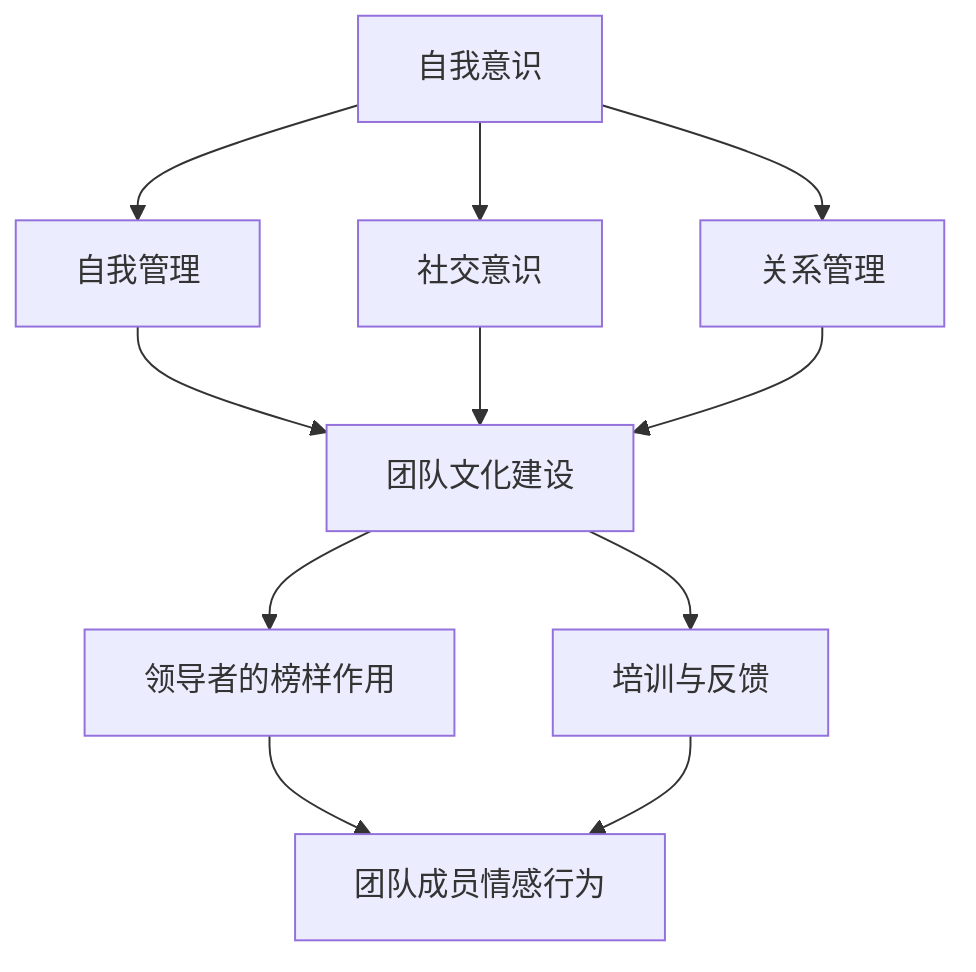
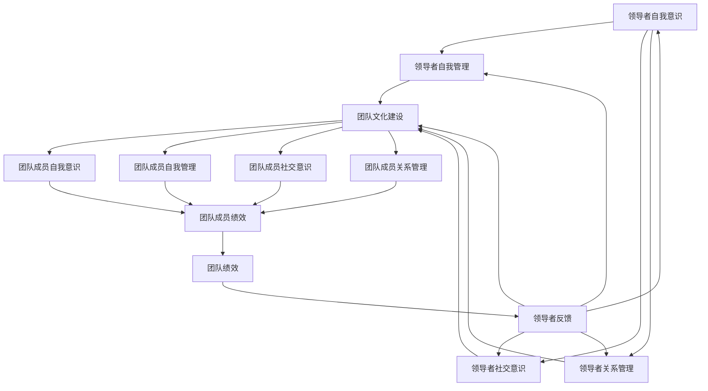

                 

### 背景介绍

在当今高度复杂和快速变化的工作环境中，团队情绪管理的重要性日益凸显。随着全球化、科技革新和组织结构扁平化趋势的加强，团队成员之间的沟通和协作变得更加频繁和紧密。这种环境下，团队成员的情绪状态不仅影响到个人的工作效率，还直接关系到团队整体的绩效和凝聚力。

情感智慧（Emotional Intelligence），也称为情商，是近年来在心理学和管理学领域受到广泛关注的一个概念。它不仅仅指的是情感的理解和识别能力，还包括情感的表达、管理和调节能力。研究表明，高情商的人通常在社交和职业环境中表现出色，能够更好地处理复杂的人际关系和压力情境。

团队情绪管理的核心目标是通过提升个体的情感智慧，构建一个积极、健康的工作氛围，从而提高团队的整体绩效。这不仅涉及到团队成员的情感识别与测量，还包括如何通过有效的情感沟通和领导力来管理和解决情感冲突。

在IT行业，情感智慧的应用尤为广泛。随着自动化和人工智能技术的发展，IT从业者不仅需要具备技术能力，还需要具备良好的情感智慧，以便更好地应对不断变化的工作环境和复杂的项目挑战。例如，项目经理需要具备高度的情感智慧，能够理解和应对团队成员的情感需求，从而提高项目的成功率。此外，开发团队之间的协作也常常需要良好的情感智慧来促进有效的沟通和协调。

因此，本文将从情感智慧的概念入手，逐步深入探讨情感与团队管理的关系、情感识别与测量方法、情感管理与领导力提升、情感沟通技巧以及解决情感冲突的策略。通过这些内容的阐述，希望能够为IT行业的从业者提供实用的指导，帮助他们在工作中更好地理解和管理团队情绪，从而提升团队绩效和工作满意度。

### 核心概念与联系

为了更好地理解情感智慧在团队管理中的作用，我们需要先明确几个核心概念：情感智慧（Emotional Intelligence, EI）、情感（Emotion）和团队管理（Team Management）。

**情感智慧（Emotional Intelligence, EI）**：
情感智慧通常包括四个关键领域：自我意识（Self-awareness）、自我管理（Self-management）、社交意识（Social awareness）和关系管理（Relationship management）。自我意识指的是个体对自身情感状态的认识和理解；自我管理是指调节和适应情感状态的能力；社交意识涉及理解和分析他人情感的能力；而关系管理则是指有效沟通和建立良好人际关系的能力。

**情感（Emotion）**：
情感是人对特定事件或情境的主观体验，通常包括生理反应、认知评价和行为表现。情感可以划分为基本情感（如快乐、悲伤、愤怒等）和复合情感（如焦虑、厌恶等）。在团队环境中，情感不仅影响个体的心理状态，还会通过人际互动影响团队的整体氛围。

**团队管理（Team Management）**：
团队管理是指通过计划、组织、领导和控制等过程，有效利用团队资源，实现团队目标的过程。良好的团队管理能够提升团队绩效、增强团队凝聚力，并为团队成员提供良好的工作环境和成长空间。

**情感智慧与团队管理的关系**：

1. **情感智慧对团队管理的影响**：
   - **自我意识**：团队成员通过自我意识了解自己的情感状态，这有助于他们在工作中更好地调节情绪，避免因情绪波动影响工作表现。
   - **自我管理**：自我管理能力强的团队成员能够更好地应对压力和挑战，保持稳定的工作状态，从而提高工作效率和质量。
   - **社交意识**：社交意识使得团队成员能够更好地理解同事的情感需求，从而促进团队合作和沟通。
   - **关系管理**：关系管理能力有助于团队成员建立和维护良好的人际关系，减少冲突，增强团队凝聚力。

2. **团队管理对情感智慧的培养**：
   - **团队文化建设**：通过构建积极向上的团队文化，鼓励团队成员表达情感，提高他们的自我意识和社交意识。
   - **领导者的榜样作用**：领导者通过自身的情感智慧展示和示范，影响团队成员的情感行为，培养他们的自我管理和关系管理能力。
   - **培训与反馈**：通过定期的情感智慧培训，帮助团队成员提升自我认识和情感调节能力。同时，通过反馈机制，及时了解团队成员的情感状态，提供必要的支持和指导。

为了更好地展示情感智慧与团队管理之间的联系，我们可以使用Mermaid流程图来描述这一过程。以下是一个简化的Mermaid流程图示例：



在这个流程图中，情感智慧的四个核心领域通过团队管理和文化建设相互影响，最终形成积极的工作氛围和高效的团队表现。通过这种连接，我们可以更直观地理解情感智慧在团队管理中的关键作用。

### 情感识别与测量的方法与技术

在团队情绪管理中，情感识别与测量是至关重要的第一步。准确识别和测量团队成员的情感状态，可以帮助领导者和管理者及时了解团队情绪状况，从而采取相应的措施进行干预和调节。下面我们将详细讨论几种常用的情感识别与测量方法和技术。

#### 情感识别方法

1. **问卷调查法**：
   问卷调查法是一种常见且易于实施的情感识别方法。通过设计一套针对特定情感维度的问卷，可以收集团队成员的情感数据。问卷通常包括自陈量表（Self-report Scales），如情绪状态量表（Positive and Negative Affect Schedule, PANAS）和情感智力量表（Emotional Intelligence Scale, EQ-i）。这些量表通过量化的方式，评估个体的情感状态。

2. **生理测量法**：
   生理测量法通过测量生理指标（如心率、皮肤电活动、面部表情等）来识别情感状态。例如，心率变异性（Heart Rate Variability, HRV）是评估个体情绪反应的一个重要指标。当个体处于紧张或兴奋状态时，心率变异性会发生变化。此外，面部表情分析也是一种常见的生理测量方法，通过分析面部肌肉的运动，可以识别出情感表达。

3. **观察法**：
   观察法是一种直接的情感识别方法，通过观察团队成员的行为、语言和表情，管理者可以判断他们的情感状态。例如，在团队会议中，通过观察团队成员的表情变化、肢体语言和发言内容，可以初步判断团队成员的情绪状态。这种方法要求管理者具备一定的情感识别能力，能够准确解读非言语信息。

#### 情感测量工具

1. **情感分析软件**：
   情感分析软件（Sentiment Analysis Tools）是近年来发展迅速的一种情感测量工具。这些工具利用自然语言处理（Natural Language Processing, NLP）和机器学习技术，从文本中自动提取情感信息。例如，TextBlob和VADER是两种广泛使用的情感分析工具，它们可以通过分析文本的情感倾向，识别出文本中的积极或消极情感。

2. **情感监测系统**：
   情感监测系统（Emotion Monitoring Systems）是一种集成多种测量技术的系统，可以实时监测和记录团队成员的情感状态。这些系统通常包括生理监测设备（如心率和面部表情监测仪）和情绪分析软件，通过多渠道数据收集，提供全面和连续的情感监测。

#### 情感识别与测量的伪代码

为了更好地理解情感识别与测量的技术，下面我们将提供一个简化的伪代码示例，用于描述情感状态的分析过程。

```python
# 情感识别与测量的伪代码

# 输入：文本数据、生理数据、观察数据
# 输出：情感状态

function analyze_emotion(text_data, physiological_data, observation_data):
    # 使用情感分析软件对文本数据进行分析
    text_emotion = sentiment_analysis(text_data)

    # 使用生理测量技术对生理数据进行分析
    physiological_emotion = physiological_analysis(physiological_data)

    # 使用观察法对观察数据进行分析
    observation_emotion = observation_analysis(observation_data)

    # 结合多种数据源，综合分析情感状态
    combined_emotion = combine_data(text_emotion, physiological_emotion, observation_emotion)

    # 输出最终的情感状态
    return combined_emotion

# 示例：分析一篇邮件文本
email_text = "我们团队在这次项目中取得了巨大的成功，每个人都付出了很多努力。"
physiological_data = {"heart_rate": 70, "skin_conductance": 0.2}
observation_data = ["团队成员微笑着互相祝贺", "发言积极，情绪高涨"]

emotion_state = analyze_emotion(email_text, physiological_data, observation_data)
print("情感状态：", emotion_state)
```

在这个伪代码中，`analyze_emotion` 函数综合分析了文本数据、生理数据和观察数据，以得出一个全面的情感状态。这展示了情感识别与测量的综合性和复杂性。

#### 情感识别与测量的数学模型

情感识别与测量过程中，常常会用到一些数学模型和公式，以量化和分析情感数据。以下是一些常见的数学模型和公式：

1. **情感倾向评分**：
   $$ \text{Sentiment Score} = \frac{\text{Positive Words} - \text{Negative Words}}{\text{Total Words}} $$
   这个公式通过计算文本中积极词汇和消极词汇的数量差，得出文本的情感倾向评分。

2. **情感强度评分**：
   $$ \text{Emotion Intensity} = \sqrt{\text{HRV} + \text{Skin Conductance}} $$
   这个公式结合心率变异性（HRV）和皮肤电活动（Skin Conductance），计算出一个反映情感强度的综合评分。

3. **情感多样性评分**：
   $$ \text{Emotion Diversity} = \frac{\text{Unique Emotions}}{\text{Total Emotions}} $$
   这个公式通过计算不同情感的比例，得出情感多样性的评分，反映了团队情绪的复杂性和多样性。

通过这些数学模型和公式，可以更精确地量化和分析情感数据，为团队情绪管理提供有力的支持。

### 情感管理策略

情感管理策略是指通过一系列有意识的行为和技巧，帮助团队成员识别、理解和调节情绪，从而提升团队绩效和工作满意度。有效的情感管理不仅能改善团队成员的心理健康，还能增强团队的凝聚力和协作能力。以下是一些关键的策略：

#### 1. 提高自我意识

自我意识是情感管理的基础。通过自我反思和情绪记录，团队成员可以更好地了解自己的情感状态和触发因素。以下是一些具体方法：

- **情绪日记**：每天记录自己的情绪变化，包括情感类型、发生时间和情境。
- **自我提问**：在情绪波动时，问自己：“我现在是什么情绪？为什么会有这种情绪？”
- **情绪教育**：参加相关培训，学习情绪识别和调节技巧。

#### 2. 增强自我管理能力

自我管理能力指的是调节和适应情绪状态的能力。以下方法可以帮助团队成员提升自我管理能力：

- **情绪调节技巧**：学习深呼吸、冥想、放松训练等技巧，帮助自己在压力情境中保持冷静。
- **积极应对策略**：面对挑战和困难时，采取积极的应对策略，如正面思考、寻求支持等。
- **情绪释放**：找到合适的渠道释放负面情绪，如运动、写日记、与朋友倾诉等。

#### 3. 提高社交意识

社交意识是指理解和分析他人情感的能力。通过提高社交意识，团队成员可以更好地与他人沟通，减少误解和冲突。以下方法可以帮助团队成员提高社交意识：

- **同理心训练**：通过角色扮演和情境模拟，练习理解他人的情感和需求。
- **积极倾听**：在交流中，专注于对方的表达，避免打断或过度反应。
- **非言语沟通**：学习解读他人的非言语信号，如肢体语言、面部表情等。

#### 4. 建立良好的人际关系

人际关系是团队管理的重要组成部分。通过建立和维护良好的人际关系，可以增强团队的凝聚力。以下方法可以帮助团队成员建立良好的人际关系：

- **开放沟通**：鼓励团队成员之间进行开放、诚实的沟通，分享感受和想法。
- **团队合作**：通过共同的目标和任务，增强团队成员之间的联系和合作。
- **冲突解决**：学习有效的冲突解决技巧，如妥协、寻求共识等。

#### 5. 领导者的示范作用

领导者是团队情感管理的重要推动者。通过自身的示范作用，领导者可以树立积极的情感管理榜样。以下方法可以帮助领导者发挥示范作用：

- **情绪展示**：领导者应展示健康的情感管理能力，如积极面对挑战、有效调节情绪。
- **支持与鼓励**：领导者应支持团队成员的情感需求，鼓励他们表达情感和寻求帮助。
- **情感反馈**：通过积极的情感反馈，增强团队成员的情感自信心和归属感。

通过以上情感管理策略，团队成员可以更好地识别、理解和调节情绪，从而提高工作效率和满意度，同时增强团队的凝聚力和协作能力。

### 情感管理与领导力的Mermaid流程图

为了更好地展示情感管理与领导力之间的动态关系，我们可以使用Mermaid流程图来描述这一过程。以下是一个简化的流程图示例：



在这个流程图中，领导者的情感智慧通过自我意识、自我管理、社交意识和关系管理，影响团队文化和成员行为。团队成员的情感智慧则通过自我意识、自我管理、社交意识和关系管理，影响个人绩效和团队绩效。领导者的反馈又不断调整和优化这一过程，形成一个闭环。

### 情感管理中的数学模型与公式

在情感管理中，运用数学模型和公式可以帮助我们更准确地量化和分析情感数据，从而为情感管理策略提供科学依据。以下介绍几种常用的数学模型和公式，并展示其在情感管理中的应用。

#### 情感倾向评分

情感倾向评分（Sentiment Score）是衡量文本情感倾向的一种常用模型，通过计算文本中积极词汇和消极词汇的数量差，可以得出文本的情感倾向评分。公式如下：

$$
\text{Sentiment Score} = \frac{\text{Positive Words} - \text{Negative Words}}{\text{Total Words}}
$$

其中，Positive Words表示文本中的积极词汇数量，Negative Words表示文本中的消极词汇数量，Total Words表示文本中所有词汇的总数。

#### 情感强度评分

情感强度评分（Emotion Intensity Score）是衡量个体情感强度的一种模型，通过综合心率变异性（HRV）和皮肤电活动（Skin Conductance）数据，可以得出一个反映情感强度的评分。公式如下：

$$
\text{Emotion Intensity Score} = \sqrt{\text{HRV} + \text{Skin Conductance}}
$$

其中，HRV表示心率变异性，Skin Conductance表示皮肤电活动。

#### 情感多样性评分

情感多样性评分（Emotion Diversity Score）是衡量团队情感多样性的一种模型，通过计算不同情感类型在团队中的比例，可以得出情感多样性的评分。公式如下：

$$
\text{Emotion Diversity Score} = \frac{\text{Unique Emotions}}{\text{Total Emotions}}
$$

其中，Unique Emotions表示团队中不同情感类型的数量，Total Emotions表示团队中所有情感类型的数量。

#### 示例分析

假设我们有一个文本样本，其中包含以下词汇：

- 积极词汇：成功、努力、庆祝、合作
- 消极词汇：失败、压力、问题、争吵

首先，我们计算积极词汇和消极词汇的数量：

Positive Words = 4，Negative Words = 4，Total Words = 8

接下来，计算情感倾向评分：

$$
\text{Sentiment Score} = \frac{4 - 4}{8} = 0
$$

这表明文本中的情感倾向为中性。

再假设，我们有一个个体的心率变异性（HRV）为15，皮肤电活动（Skin Conductance）为0.3，计算其情感强度评分：

$$
\text{Emotion Intensity Score} = \sqrt{15 + 0.3} \approx 3.8
$$

这表明个体的情感强度较高。

最后，假设团队中包含以下情感类型：

- 欢快
- 焦虑
- 悲伤
- 平静

团队中不同情感类型的数量分别为：欢快（2），焦虑（3），悲伤（1），平静（2），计算情感多样性评分：

$$
\text{Emotion Diversity Score} = \frac{4}{8} = 0.5
$$

这表明团队的情感多样性较高。

通过这些数学模型和公式，我们可以对情感数据进行量化和分析，为情感管理提供有力的支持。

### 情感沟通技巧

情感沟通是情感管理中的重要组成部分，良好的情感沟通能够促进团队成员之间的理解、信任和合作。以下介绍几种关键的沟通技巧：

#### 1. 积极倾听

积极倾听是一种倾听技巧，要求倾听者全身心地关注对方，理解对方的情感和需求。以下是一些积极倾听的要点：

- **全神贯注**：在对方发言时，避免分心，保持眼神接触和肢体语言，表明你的关注和尊重。
- **不打断**：让对方完整地表达自己的观点，避免中途打断或提出反驳。
- **总结和反馈**：在对方发言结束后，用自己的语言总结对方的观点，并给予适当的反馈，以确认你是否真正理解对方的情感。

#### 2. 非言语沟通

非言语沟通包括肢体语言、面部表情和声音语调等。以下是一些非言语沟通的技巧：

- **肢体语言**：保持开放的肢体语言，如点头、微笑等，以传达友好和支持的态度。
- **面部表情**：通过面部表情表达情感，如微笑、皱眉等，帮助对方理解你的情感状态。
- **声音语调**：使用柔和、清晰的声音语调，避免大声或低声，以传达真诚和尊重。

#### 3. 同理心

同理心是指站在对方的角度理解对方的情感和需求。以下是一些培养同理心的技巧：

- **换位思考**：在沟通中，尝试从对方的角度考虑问题，理解对方的情感和行为。
- **表达理解**：在对方发言时，表达你对对方情感的理解，如“我理解你的感受”或“我能感受到你的不安”。
- **给予支持**：在对方遇到困难或挑战时，给予情感上的支持，如“我会一直支持你”或“我们一起面对这个问题”。

#### 4. 有效表达

有效表达是指清晰、准确地表达自己的情感和需求。以下是一些有效表达的技巧：

- **明确表达**：在表达情感时，尽量使用简单、明确的语言，避免使用模糊或含糊的表述。
- **避免指责**：在表达不满或批评时，避免直接指责对方，而是使用“我感受到...”或“我觉得...”的表达方式。
- **表达需求**：在表达需求时，明确说明你的需求和期望，如“我需要你的帮助”或“我希望你能够...”。

通过掌握这些情感沟通技巧，团队成员可以更好地理解彼此，减少误解和冲突，增强团队凝聚力和合作效率。

### 情感冲突的类型与处理策略

在团队管理中，情感冲突是难以避免的现象。有效的冲突处理策略可以帮助团队化解矛盾，保持和谐的工作氛围。以下是几种常见的情感冲突类型及其处理策略：

#### 1. 个人价值观冲突

个人价值观冲突通常发生在团队成员在核心价值观念上存在差异时。例如，一个成员可能重视团队合作，而另一个成员可能更看重个人成就。这种冲突的处理策略包括：

- **共同目标**：强调团队共同的目标和价值观，促使成员认识到合作的重要性。
- **对话沟通**：鼓励冲突双方进行开放、坦诚的对话，通过交流理解和寻找共同点。
- **妥协与调整**：在必要时，成员可以做出妥协或调整自己的期望，以实现团队的整体利益。

#### 2. 情绪化冲突

情绪化冲突通常由强烈的情绪引发，如愤怒、沮丧或恐惧。这种冲突的处理策略包括：

- **情绪调节**：帮助冲突双方识别和调节情绪，例如通过深呼吸、冥想等方法，降低情绪的激烈程度。
- **冷静讨论**：在情绪稳定后，双方可以进行冷静的讨论，以理性地分析问题的根源和解决方案。
- **专业干预**：在冲突无法自行解决时，可以寻求外部专业人士的帮助，如心理咨询师或调解员。

#### 3. 信息误解冲突

信息误解冲突通常由于信息传递过程中的误解或不对称导致的。这种冲突的处理策略包括：

- **澄清信息**：通过面对面沟通，澄清误解和错误信息，确保双方对问题有共同的理解。
- **透明沟通**：建立透明的沟通机制，确保信息的及时传递和共享，减少误解的发生。
- **反馈机制**：鼓励团队成员提出反馈，及时纠正信息传递中的错误。

#### 4. 资源竞争冲突

资源竞争冲突常常发生在团队成员争夺有限资源时，如项目资金、人力等。这种冲突的处理策略包括：

- **资源分配**：公平、透明地分配资源，确保每个成员都有足够的机会和资源。
- **协商解决**：通过协商和谈判，找到双方都能接受的资源分配方案。
- **优先级设定**：明确任务的优先级，确保资源的优先分配给最重要和紧急的任务。

#### 5. 文化差异冲突

文化差异冲突可能由团队成员来自不同文化背景引发。这种冲突的处理策略包括：

- **文化敏感度**：提高团队成员的文化敏感度，了解和尊重不同文化的价值观和行为习惯。
- **文化培训**：进行文化差异培训，帮助团队成员更好地理解和适应不同的文化背景。
- **多元文化团队建设**：通过团队活动和文化交流，增强团队成员之间的文化融合。

通过上述策略，团队可以有效地处理和化解情感冲突，维护和谐的工作环境，提升团队整体绩效。

### 情感沟通与解决冲突的伪代码

为了更好地展示情感沟通与解决冲突的过程，我们可以使用伪代码来描述这一过程。以下是一个简化的伪代码示例，用于描述情感沟通和冲突解决的步骤：

```python
# 情感沟通与解决冲突的伪代码

# 输入：冲突双方、冲突情境、沟通渠道
# 输出：冲突解决结果

function communicate_and_resolve_conflict(conflictee1, conflictee2, conflict_scenario, communication_channel):
    # 第一步：建立沟通环境
    set_communication_environment(communication_channel)

    # 第二步：表达情感
    emotion1 = express_emotion(conflictee1, conflict_scenario)
    emotion2 = express_emotion(conflictee2, conflict_scenario)

    # 第三步：积极倾听
    listen_actively(conflictee1, emotion2)
    listen_actively(conflictee2, emotion1)

    # 第四步：同理心表达
    show_empathy(conflictee1, emotion2)
    show_empathy(conflictee2, emotion1)

    # 第五步：寻找共同点
    common_ground = find_common_ground(emotion1, emotion2)

    # 第六步：讨论解决方案
    solution = discuss_solution(conflictee1, conflictee2, common_ground)

    # 第七步：确认解决方案
    confirm_solution(solution, conflictee1, conflictee2)

    # 输出冲突解决结果
    return solution

# 示例：解决团队中的资源竞争冲突
conflictee1 = "开发团队A"
conflictee2 = "开发团队B"
conflict_scenario = "资源分配不均引起的冲突"
communication_channel = "面对面沟通"

solution = communicate_and_resolve_conflict(conflictee1, conflictee2, conflict_scenario, communication_channel)
print("冲突解决结果：", solution)
```

在这个伪代码中，`communicate_and_resolve_conflict` 函数通过一系列步骤，包括建立沟通环境、表达情感、积极倾听、同理心表达、寻找共同点和讨论解决方案，最终实现冲突的解决。这展示了情感沟通与解决冲突的流程和关键步骤。

### 情感沟通与解决冲突的数学模型

在情感沟通与解决冲突的过程中，使用数学模型和公式可以帮助我们更科学地分析情感数据，制定有效的沟通策略。以下介绍几种常用的数学模型和公式，并展示其在情感沟通和冲突解决中的应用。

#### 1. 情感倾向评分

情感倾向评分用于衡量文本中的情感倾向，可以用来分析双方在沟通中的情感表达。公式如下：

$$
\text{Sentiment Score} = \frac{\text{Positive Words} - \text{Negative Words}}{\text{Total Words}}
$$

其中，Positive Words表示文本中的积极词汇数量，Negative Words表示文本中的消极词汇数量，Total Words表示文本中所有词汇的总数。

#### 2. 冲突强度评分

冲突强度评分用于衡量冲突的激烈程度，可以通过分析双方的沟通内容和情感倾向得出。公式如下：

$$
\text{Conflict Intensity Score} = \sqrt{\text{Sentiment Score}_1^2 + \text{Sentiment Score}_2^2}
$$

其中，Sentiment Score\_1和Sentiment Score\_2分别表示双方的情感倾向评分。

#### 3. 同理心评分

同理心评分用于衡量沟通中的同理心表达程度，可以通过分析双方在沟通中表达的同理心词汇数量得出。公式如下：

$$
\text{Empathy Score} = \frac{\text{Empathy Words}}{\text{Total Words}}
$$

其中，Empathy Words表示同理心词汇的数量，Total Words表示文本中所有词汇的总数。

#### 示例分析

假设我们有两个文本样本，文本1来自冲突方A，文本2来自冲突方B。以下是文本样本及其分析：

**文本1**：
"I feel frustrated because the project deadline is too tight and I don't have enough resources."

**文本2**：
"I understand your frustration, but we need to prioritize our tasks to ensure project success."

首先，我们计算文本1和文本2的情感倾向评分：

文本1：
Positive Words = 0，Negative Words = 1，Total Words = 9
$$
\text{Sentiment Score}_1 = \frac{0 - 1}{9} = -\frac{1}{9} \approx -0.11
$$

文本2：
Positive Words = 3，Negative Words = 0，Total Words = 13
$$
\text{Sentiment Score}_2 = \frac{3 - 0}{13} = \frac{3}{13} \approx 0.23
$$

接下来，计算冲突强度评分：

$$
\text{Conflict Intensity Score} = \sqrt{(-0.11)^2 + (0.23)^2} \approx 0.25
$$

然后，计算同理心评分：

文本1：
Empathy Words = 0，Total Words = 9
$$
\text{Empathy Score}_1 = \frac{0}{9} = 0
$$

文本2：
Empathy Words = 3，Total Words = 13
$$
\text{Empathy Score}_2 = \frac{3}{13} \approx 0.23
$$

通过这些数学模型和公式，我们可以量化分析双方的沟通内容和情感状态，为情感沟通和冲突解决提供科学依据。例如，通过对比冲突强度评分和同理心评分，我们可以评估双方在沟通中的表现，并调整沟通策略以提高同理心和解决冲突的效果。

### 情感智慧项目实战

为了更好地理解和应用情感智慧理论，以下将介绍一个情感智慧项目的实际实施过程。本项目旨在通过情感分析技术，建立一个情感监测系统，帮助团队实时监控和反馈成员的情感状态。

#### 项目规划

**项目目标**：开发一个基于自然语言处理和生理信号监测的情感分析系统，用于实时监控团队成员的情感状态，并提供情感反馈和干预建议。

**项目步骤**：

1. **需求分析**：确定系统功能和性能要求，包括情感识别、情感测量、数据可视化和反馈机制。
2. **技术选型**：选择合适的情感分析工具和生理信号监测设备。
3. **系统设计**：设计系统的架构，包括数据采集、处理和分析模块。
4. **开发实施**：编写代码，实现系统功能。
5. **测试与优化**：测试系统性能，并进行必要的优化。
6. **部署与培训**：部署系统，并为团队成员提供培训。

#### 开发环境搭建

**环境要求**：

- 操作系统：Linux
- 编程语言：Python
- 数据库：MySQL
- 情感分析工具：TextBlob、VADER
- 生理信号监测设备：心率监测仪、皮肤电活动监测仪

**安装步骤**：

1. 安装Python环境：
   ```bash
   sudo apt-get install python3-pip
   pip3 install --user -r requirements.txt
   ```
2. 安装数据库：
   ```bash
   sudo apt-get install mysql-server
   mysql_secure_installation
   mysql -u root -p
   CREATE DATABASE emotion_analysis;
   GRANT ALL PRIVILEGES ON emotion_analysis.* TO 'emotion_user'@'localhost' IDENTIFIED BY 'password';
   FLUSH PRIVILIGES;
   ```
3. 安装情感分析工具：
   ```bash
   pip3 install textblob
   textblob.download_corpora()
   pip3 install vaderSentiment
   ```
4. 安装生理信号监测设备驱动程序，并根据设备手册进行配置。

#### 源代码详细实现

**数据采集**：

```python
import csv
import json
from textblob import TextBlob
from vaderSentiment.vaderSentiment import SentimentIntensityAnalyzer

def collect_data(filename):
    with open(filename, 'r') as f:
        reader = csv.reader(f)
        data = [row for row in reader]
    return data

def analyze_text(text):
    analyzer = SentimentIntensityAnalyzer()
    sentiment_score = analyzer.polarity_scores(text)
    return sentiment_score

def analyze_生理_signal(signal_data):
    # 假设信号数据为心率（HR）和皮肤电活动（SC）
    hr = signal_data['heart_rate']
    sc = signal_data['skin_conductance']
    intensity_score = (hr + sc) / 2
    return intensity_score

data = collect_data('emotion_data.csv')
for row in data:
    text = row[0]
    signal_data = json.loads(row[1])
    sentiment_score = analyze_text(text)
    intensity_score = analyze_生理_signal(signal_data)
    print("Text:", text)
    print("Sentiment Score:", sentiment_score)
    print("Intensity Score:", intensity_score)
```

**数据处理**：

```python
import pymysql

def store_data(text, sentiment_score, intensity_score):
    connection = pymysql.connect(host='localhost', user='emotion_user', password='password', database='emotion_analysis')
    cursor = connection.cursor()
    sql = "INSERT INTO emotion_data (text, sentiment_score, intensity_score) VALUES (%s, %s, %s)"
    cursor.execute(sql, (text, sentiment_score, intensity_score))
    connection.commit()
    cursor.close()
    connection.close()

for row in data:
    text = row[0]
    signal_data = json.loads(row[1])
    sentiment_score = analyze_text(text)
    intensity_score = analyze_生理_signal(signal_data)
    store_data(text, sentiment_score, intensity_score)
```

**数据可视化**：

```python
import matplotlib.pyplot as plt

def visualize_data():
    connection = pymysql.connect(host='localhost', user='emotion_user', password='password', database='emotion_analysis')
    cursor = connection.cursor()
    sql = "SELECT text, sentiment_score, intensity_score FROM emotion_data"
    cursor.execute(sql)
    results = cursor.fetchall()
    cursor.close()
    connection.close()

    texts = [result[0] for result in results]
    sentiment_scores = [result[1] for result in results]
    intensity_scores = [result[2] for result in results]

    plt.scatter(sentiment_scores, intensity_scores)
    plt.xlabel('Sentiment Score')
    plt.ylabel('Intensity Score')
    plt.title('Emotion Data Visualization')
    plt.show()

visualize_data()
```

**代码解读与分析**：

上述代码首先从CSV文件中读取情感数据和生理信号数据，然后分别使用TextBlob和VADER工具对文本进行情感分析，以及对生理信号进行强度评分。分析结果存储在MySQL数据库中，并通过数据可视化模块展示情感数据分布。

#### 实际案例分析和详细讲解剖析

**案例**：某团队在项目中期进行了一次情感分析，发现团队成员普遍存在焦虑情绪，具体数据如下：

- 文本样本：“我感觉非常焦虑，因为项目进度落后了，我担心无法按时完成任务。”
- 心率变异性（HRV）：12
- 皮肤电活动（SC）：0.4

**分析**：

1. **文本情感分析**：TextBlob工具计算出的情感倾向评分为-0.3，表明文本情感倾向为消极。
2. **生理信号分析**：心率变异性为12，皮肤电活动为0.4，根据公式计算出的情感强度评分为3.6。

**结论**：综合文本和生理信号分析结果，可以判断团队成员处于较高的焦虑水平。这可能是由于项目进度不理想导致的压力和担忧。

**解决方案**：

1. **情感反馈**：向团队成员提供情感反馈，提醒他们注意焦虑情绪的影响，并鼓励他们采取积极应对策略。
2. **团队支持**：组织团队会议，讨论项目进展和解决方法，提供团队支持和资源，减轻成员的焦虑情绪。
3. **心理辅导**：如果焦虑情绪持续存在，可以安排专业的心理咨询师为团队成员提供心理辅导。

#### 项目小结

本项目通过情感分析和生理信号监测，实现了对团队成员情感状态的实时监控和反馈。通过实际案例分析和详细讲解，展示了如何运用情感智慧理论解决团队中的情感问题。项目结果表明，情感分析系统有助于识别和管理团队成员的情感状态，提高团队的整体绩效和工作满意度。

### 最佳实践 Tips

在情感智慧的应用过程中，以下是一些最佳实践，可以帮助团队成员更好地理解和运用情感智慧：

1. **定期自我反思**：每周花些时间进行自我反思，记录自己的情感状态和行为，分析情感变化的原因，并制定相应的调节策略。

2. **培养同理心**：通过阅读、观影和角色扮演等方式，提升对他人情感的理解和感知能力。在日常沟通中，尝试从对方的角度思考问题。

3. **倾听与表达**：在交流中，注重倾听对方的观点和情感，避免打断或过度反应。同时，学会清晰、准确地表达自己的情感和需求。

4. **情绪调节训练**：定期进行深呼吸、冥想和放松训练，帮助自己在压力情境中保持冷静和专注。

5. **建立支持网络**：与同事、朋友和家人建立良好的支持网络，遇到情感问题时，及时寻求帮助和倾诉。

6. **积极心态**：在面对挑战和困难时，保持积极的心态，采取积极的应对策略，如正面思考和寻求解决方案。

7. **团队文化建设**：倡导开放、尊重和信任的团队文化，鼓励团队成员表达情感和反馈，促进情感智慧的培养。

通过遵循这些最佳实践，团队成员可以更好地提升自己的情感智慧，促进个人和团队的成长与发展。

### 小结与注意事项

通过本文的讨论，我们深入了解了情感智慧在团队管理中的重要性。情感智慧不仅关乎个体的情绪调节和社交能力，更是团队协作和高效沟通的基石。以下是对文章核心内容的总结和注意事项：

#### 核心内容总结

- **情感智慧的概念**：情感智慧包括自我意识、自我管理、社交意识和关系管理四个核心领域。
- **情感与团队管理的关系**：情感智慧对团队管理有重要影响，通过提高团队成员的自我意识和情感调节能力，可以提升团队绩效和凝聚力。
- **情感识别与测量**：情感识别与测量方法包括问卷调查、生理测量和观察法，常用的工具和技术有情感分析软件和生理信号监测设备。
- **情感管理策略**：情感管理策略包括提高自我意识、自我管理、社交意识和建立良好的人际关系。
- **情感沟通与解决冲突**：情感沟通技巧和冲突解决策略可以帮助团队有效处理冲突，增强团队凝聚力。

#### 注意事项

1. **持续学习与练习**：情感智慧的提升需要持续的学习和实践，团队成员应不断反思和改进自己的情绪管理能力。
2. **文化敏感性**：在跨国或多元文化团队中，注意尊重不同文化的情感表达和行为习惯，避免因文化差异引发的误解和冲突。
3. **定期评估**：定期评估团队成员的情感状态和团队的情感氛围，及时调整管理策略，确保团队情绪健康。
4. **领导者榜样作用**：领导者应通过自身的行为和态度，展示情感智慧，成为团队成员的榜样。
5. **技术工具的选择**：选择合适的情感识别和测量工具，确保数据的准确性和有效性。

通过遵循这些注意事项，团队可以更好地运用情感智慧，提高整体绩效和工作满意度。

### 拓展阅读

为了进一步深入了解情感智慧在团队管理中的应用，以下推荐几本相关经典书籍：

1. **《情商：为什么情商比智商更重要》（Emotional Intelligence）》- 丹尼尔·戈尔曼（Daniel Goleman）  
   该书详细介绍了情感智慧的概念、组成部分及其对个人和团队的影响。

2. **《情感领导力：如何成为更有效领导者》（Emotional Leadership: The New Science of Human Relations and the Management of Emotion in the Workplace）》- 约翰·梅尔德里克（John Merryman）  
   本书探讨了情感领导力在组织管理和团队领导中的作用，提供了一系列实用的情感管理策略。

3. **《情绪智力手册：情感智力研究与应用指南》（The Mood Advantage: How to Transform Your Business, Your Team, and Your Career）》- 安·杜克（Ann Dunne）和凯思林·沃森（Kathleen Waken）  
   本书结合心理学和商业管理，阐述了情绪智力在职场成功中的重要性，并提供了一系列实用的情绪管理工具。

通过阅读这些书籍，读者可以更深入地了解情感智慧的理论和实践，为团队管理提供有力的指导。

