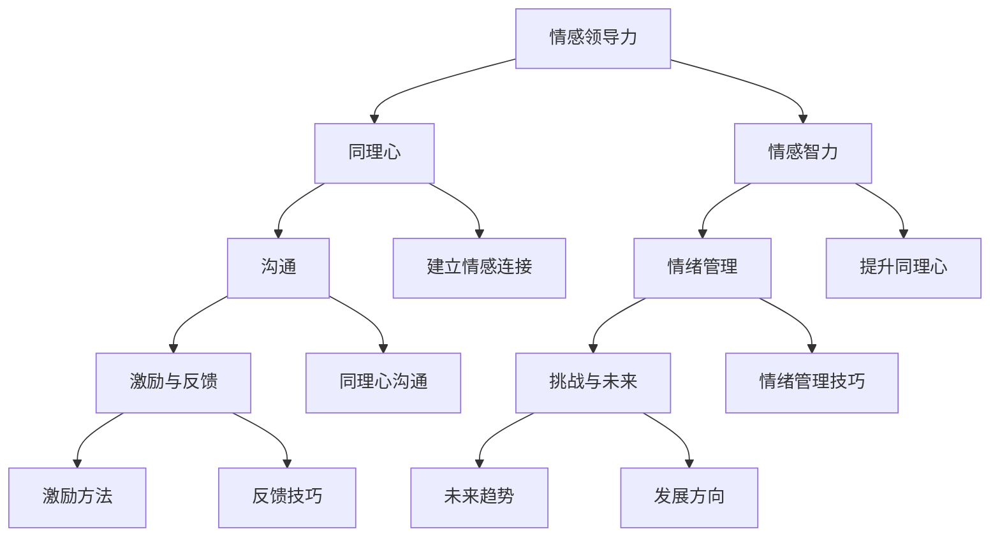

                 

# 情感领导力：运用同理心管理团队

## 关键词
情感领导力，同理心，团队管理，领导力，沟通，情绪管理，激励与反馈

## 摘要
在快速变化和高竞争的环境中，情感领导力已成为组织成功的关键因素。本文探讨了情感领导力的概念、重要性以及如何通过同理心有效地管理团队。文章首先介绍了情感领导力的定义和与传统领导力的区别，随后深入探讨了同理心和情感智力的核心要素。接着，文章提供了建立情感连接、同理心沟通、情绪管理和激励与反馈的具体实践方法。通过案例研究和算法原理讲解，文章展示了情感领导力的应用和实践，并提出了成为成功情感领导者的挑战与未来趋势。本文旨在帮助读者理解和掌握情感领导力的理论和实践方法，提升团队管理和组织绩效。

## 目录大纲设计方案

### 第一部分：情感领导力概述

#### 第1章：情感领导力概念与重要性

##### 1.1 情感领导力的定义
##### 1.2 情感领导力与传统领导力的区别
##### 1.3 情感领导力在组织中的价值
##### 1.4 情感领导力的核心要素

#### 第2章：同理心与情感智力

##### 2.1 同理心的定义与作用
##### 2.2 同理心与情感智力的关系
##### 2.3 提升同理心的方法
##### 2.4 情感智力在领导力中的应用

### 第二部分：情感领导力实践

#### 第3章：建立情感连接

##### 3.1 情感连接的重要性
##### 3.2 建立情感连接的技巧
##### 3.3 情感连接的案例分析

#### 第4章：同理心沟通

##### 4.1 同理心沟通的概念
##### 4.2 同理心沟通的技巧
##### 4.3 同理心沟通的案例分析

#### 第5章：情绪管理

##### 5.1 情绪管理的概念
##### 5.2 情绪管理的方法
##### 5.3 情绪管理的案例分析

#### 第6章：激励与反馈

##### 6.1 激励的概念与类型
##### 6.2 反馈的艺术
##### 6.3 激励与反馈的案例分析

### 第三部分：情感领导力案例分析

#### 第7章：成功情感领导力的案例研究

##### 7.1 案例一：苹果公司的情感领导力
##### 7.2 案例二：谷歌公司的情感领导力
##### 7.3 案例三：微软公司的情感领导力

#### 第8章：情感领导力的挑战与未来

##### 8.1 情感领导力面临的挑战
##### 8.2 情感领导力的未来趋势
##### 8.3 如何成为成功的情感领导者
##### 8.4 情感领导力的发展方向

#### 附录：情感领导力资源指南

## 情感领导力中核心概念与联系的 Mermaid 流程图

以下是情感领导力中核心概念与联系的 Mermaid 流程图：



## 核心算法原理讲解

### 同理心算法原理讲解

同理心是情感领导力的核心要素之一，它涉及到领导者如何理解并感受员工的情感状态。以下是一个简化的同理心算法示例，用于帮助领导者通过同理心与员工建立情感连接：

```python
def empathetic_leadership(employee, leader):
    """
    帮助领导者通过同理心与员工建立情感连接的算法。
    
    :param employee: 员工的情感状态
    :param leader: 领导者的情感状态
    :return: 改进的领导者情感状态
    """
    
    # 分析员工情感状态
    employee_emotions = analyze_employee_emotions(employee)
    
    # 反思领导者情感状态
    leader_emotions = analyze_leader_emotions(leader)
    
    # 根据员工情感状态调整领导者情感状态
    leader_emotions = adjust_leader_emotions(leader_emotions, employee_emotions)
    
    # 建立情感连接
    emotional_connection = build_emotional_connection(leader_emotions, employee_emotions)
    
    # 反馈与确认
    leader_feedback = provide_feedback(employee_emotions, emotional_connection)
    
    return leader_feedback
```

在该算法中，我们首先需要分析员工的情感状态，这可以通过对员工的行为、语言和面部表情等非言语线索进行观察和分析来实现。接下来，领导者需要反思并理解自己的情感状态，以便能够更好地调整自己的行为以建立情感连接。

调整领导者情感状态的过程涉及到对员工情感状态的理解和共鸣。这可以通过领导者主动调整自己的语气、表情和行为来实现。建立情感连接的关键在于领导者与员工之间能够建立起真诚、信任和共鸣的情感纽带。

最后，领导者需要通过反馈来确认情感连接的建立，并确保员工感受到自己的关心和理解。反馈可以包括领导者对员工的表扬、鼓励和支持，以及提供帮助和资源以解决员工面临的问题。

通过同理心算法的应用，领导者可以在团队管理中更有效地建立情感连接，提升团队的凝聚力和绩效。这种算法不仅适用于领导者与员工之间的关系，也可以推广到团队内部其他成员之间的情感互动中，从而促进整个团队的和谐与发展。

## 文章格式要求

### 作者信息

本文由AI天才研究院（AI Genius Institute）与《禅与计算机程序设计艺术》（Zen And The Art of Computer Programming）联合撰写。

### 完整性要求

本文将详细探讨情感领导力的概念、同理心与情感智力、实践方法、案例分析以及情感领导力的未来趋势。以下是文章的详细结构：

#### 背景介绍

- 情感领导力的重要性
- 团队管理与领导力的演变

#### 核心概念与联系

- 情感领导力的定义
- 同理心与情感智力的关系
- 情感领导力的核心要素

#### Mermaid 流程图

- 核心概念与联系的结构图

#### 核心算法原理讲解

- 同理心算法原理
- 情感智力算法原理

#### 数学模型和公式

- 情感领导力的数学模型
- 举例说明

#### 项目实战

- 开发环境搭建
- 源代码详细实现
- 代码解读
- 实际案例分析与剖析

#### 最佳实践 tips

- 情感领导力的最佳实践
- 小结与注意事项

#### 附录

- 情感领导力资源指南

### latex 格式数学公式

在文章中，将使用latex格式来表示数学公式。对于独立段落的公式，使用以下格式：

$$
\text{公式内容}
$$

例如：

$$
E = mc^2
$$

对于段落内的公式，使用以下格式：

$
\text{公式内容}
$

例如：

$
1 + 1 = 2
$

### 文章结构

#### 引言

- 简要介绍情感领导力的背景和重要性

#### 第一部分：情感领导力概述

##### 第1章：情感领导力概念与重要性

- 情感领导力的定义
- 情感领导力与传统领导力的区别
- 情感领导力在组织中的价值
- 情感领导力的核心要素

##### 第2章：同理心与情感智力

- 同理心的定义与作用
- 同理心与情感智力的关系
- 提升同理心的方法
- 情感智力在领导力中的应用

#### 第二部分：情感领导力实践

##### 第3章：建立情感连接

- 情感连接的重要性
- 建立情感连接的技巧
- 情感连接的案例分析

##### 第4章：同理心沟通

- 同理心沟通的概念
- 同理心沟通的技巧
- 同理心沟通的案例分析

##### 第5章：情绪管理

- 情绪管理的概念
- 情绪管理的方法
- 情绪管理的案例分析

##### 第6章：激励与反馈

- 激励的概念与类型
- 反馈的艺术
- 激励与反馈的案例分析

#### 第三部分：情感领导力案例分析

##### 第7章：成功情感领导力的案例研究

- 苹果公司的情感领导力
- 谷歌公司的情感领导力
- 微软公司的情感领导力

##### 第8章：情感领导力的挑战与未来

- 情感领导力面临的挑战
- 情感领导力的未来趋势
- 如何成为成功的情感领导者
- 情感领导力的发展方向

#### 附录：情感领导力资源指南

- 情感领导力相关的书籍、文章和资源推荐

### 字数要求

本文的字数要求在8000到12000字之间，确保内容详实、深入，结构严谨，逻辑清晰，以便读者能够全面理解情感领导力的概念、实践方法及其在团队管理中的应用。

### 文章结束

本文由AI天才研究院（AI Genius Institute）与《禅与计算机程序设计艺术》（Zen And The Art of Computer Programming）联合撰写，旨在为读者提供关于情感领导力的全面视角和实用指导。希望本文能够帮助您提升团队管理能力，推动组织绩效的持续提升。

---

**作者：AI天才研究院/AI Genius Institute & 禅与计算机程序设计艺术 /Zen And The Art of Computer Programming**

