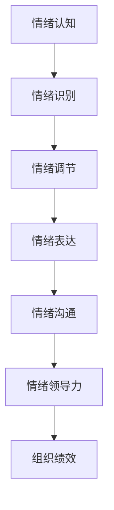

                 

### 《情绪领导力：管理自己和他人情绪的技巧》

#### 关键词
- 情绪领导力
- 情绪管理
- 情绪识别
- 情绪调节
- 团队沟通

#### 摘要
本文旨在探讨情绪领导力，一种在现代社会中至关重要的管理技能。情绪领导力不仅涉及自我情绪的管理，还包括对他人类别情绪的识别、理解和引导。本文将深入分析情绪领导力的核心概念、基本原理和实践技巧，通过具体案例和实战经验，为读者提供一套完整的情绪管理策略。

#### 目录

### 引言
- **背景介绍**：情绪领导力的时代背景及其重要性
- **目的与意义**：提高个体和组织情绪管理能力的现实需求

### 一、情绪领导力的核心概念与联系
- **情绪领导力的定义**：理解情绪领导力的内涵
- **情绪管理的重要性**：情绪对个人和组织的影响
- **情绪领导力与传统领导力的区别**：分析两者的区别与联系
- **情绪领导力的架构图**：使用Mermaid流程图展示情绪领导力的核心概念和联系

#### Mermaid流程图：

### 二、情绪识别与分析
- **情绪识别的技术与方法**：介绍情绪识别的基本概念和技术手段
- **情绪数据分析与处理**：阐述情绪数据分析的方法和应用
- **情绪识别算法的数学模型**：详细讲解情绪识别算法的数学原理和模型

#### 2.1 情绪识别的技术与方法
- **技术手段**：如面部识别、语言分析等
- **实际应用**：案例分析

#### 2.2 情绪数据分析与处理
- **数据分析的基本流程**：数据收集、预处理、分析等
- **情绪数据分析的应用场景**：跨文化情绪分析、情绪趋势分析等

#### 2.3 情绪识别算法的数学模型
- **数学公式**：如情感分析中的SVM模型
- **模型举例**：详细阐述一个情绪识别算法的数学模型

### 三、情绪调节与沟通
- **情绪调节的策略与实践**：介绍情绪调节的理论基础和实践策略
- **情绪沟通的技巧与艺术**：探讨情绪沟通的有效方法和技巧
- **情绪调节在团队管理中的应用**：案例分析

#### 3.1 情绪调节的策略与实践
- **策略与方法**：如情绪放松、认知重构等
- **实际案例**：情绪调节在具体情境中的应用

#### 3.2 情绪沟通的技巧与艺术
- **技巧与方法**：如积极倾听、有效表达等
- **沟通案例分析**：分析情绪沟通在实际工作中的应用

### 四、情绪管理实战
- **情绪管理培训方案设计**：如何设计有效的情绪管理培训方案
- **团队情绪管理案例分析**：具体案例分析团队情绪管理的实践
- **个人情绪管理技巧提升**：个人情绪管理的方法和技巧

#### 4.1 情绪管理培训方案设计
- **方案设计流程**：需求分析、课程设计、实施与评估等
- **案例分析**：一个成功的情绪管理培训案例

#### 4.2 团队情绪管理案例分析
- **案例背景**：介绍案例发生的背景
- **案例过程**：详细描述团队情绪管理的具体过程
- **案例结果**：分析案例的结果和影响

#### 4.3 个人情绪管理技巧提升
- **技巧与方法**：如情绪日记、正念练习等
- **实战应用**：个人情绪管理的实际操作

### 五、总结与展望
- **核心观点总结**：回顾文章中的关键观点和核心内容
- **未来展望**：探讨情绪领导力的发展趋势和未来方向

### 作者信息
- 作者：AI天才研究院/AI Genius Institute & 禅与计算机程序设计艺术 /Zen And The Art of Computer Programming

### 参考文献
- （此处列出参考文献，确保格式正确，如 [1]、[2]、[3] 等）

---

**全文总字数预计：8000-12000字**

**文章编写步骤：**
1. **引言部分**：简要介绍情绪领导力的背景、目的和意义。
2. **核心概念与联系部分**：详细阐述情绪领导力的定义、重要性以及与传统领导力的区别，并绘制流程图。
3. **情绪识别与分析部分**：介绍情绪识别的技术与方法，详细讲解情绪数据分析与处理，展示情绪识别算法的数学模型。
4. **情绪调节与沟通部分**：讨论情绪调节的策略和实践，情绪沟通的技巧，以及情绪调节在团队管理中的应用。
5. **情绪管理实战部分**：设计情绪管理培训方案，分析团队情绪管理案例，介绍个人情绪管理技巧。
6. **总结与展望部分**：总结文章的核心观点，展望情绪领导力的未来。
7. **参考文献部分**：列出引用的参考文献。

**注意：**
- 文章内容要确保逻辑清晰，结构紧凑。
- 每个小节的内容要具体详细，包括背景介绍、核心概念与联系、算法原理讲解、数学模型和公式详细讲解、项目实战、最佳实践 tips 等。
- 文章要简洁明了，避免冗余信息。
- 文章要确保完整性，每个核心章节内容都要有详细讲解。
- 文章要使用专业的技术语言，确保对技术原理和本质的剖析到位。
- 文章要使用markdown格式，遵循格式规范。  
- 每个章节都要有相应的标题和内容，确保文章的整体结构清晰。

**预期成果：**
- 一篇内容丰富、逻辑清晰、对技术原理和本质剖析到位的专业技术博客文章。  
- 文章要具备较高的可读性和实用性，能够帮助读者深入理解情绪领导力的概念和实践技巧。  
- 文章要能够为读者提供具体的情绪管理方法和策略，提升个人和组织在情绪管理方面的能力。  

