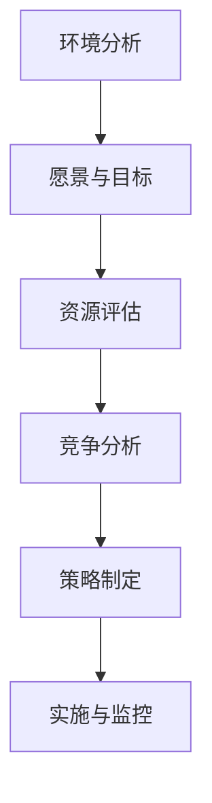

                 

# 文章标题：战略思维：培养长远眼光的领导力

关键词：战略思维、领导力、长远眼光、决策、组织管理

摘要：本文将探讨战略思维在领导力培养中的重要性，分析战略思维的类型、框架和具体方法，并结合历史和现实案例，展示战略思维在实践中的应用。通过深入理解战略思维，领导者可以更好地制定长远规划，提高组织的管理水平和竞争力。

## 引言

### 1.1 书籍主题与目的

战略思维是一种重要的领导能力，它关乎组织的发展和竞争力。本文旨在帮助读者理解战略思维的概念、框架和应用，从而培养长远眼光的领导力。

### 1.2 读者群体与阅读预期

本文适合组织管理者和有志于提升领导力的专业人士阅读。通过阅读本文，读者可以：

- 理解战略思维的核心概念和重要性。  
- 掌握战略思维的类型和方法。  
- 学习如何将战略思维应用于实际工作和生活中。

## 核心理论

### 2.1 战略思维的概述

#### 2.1.1 战略思维的含义

战略思维是一种基于长远目标和全局视角的思考方式，它涉及对组织的愿景、目标、资源和竞争环境的分析，以制定有效的策略和行动计划。

#### 2.1.2 战略思维的重要性

战略思维在领导力培养中的重要性体现在：

- 提高决策质量：战略思维帮助领导者从全局和长远的角度分析问题，做出更明智的决策。  
- 促进组织发展：战略思维有助于领导者制定长远规划，推动组织的可持续发展。  
- 提升竞争力：战略思维帮助组织识别竞争优势，应对市场变化和竞争压力。

### 2.2 战略思维的类型

战略思维可以分为以下三种类型：

- 竞争性战略思维：关注如何通过竞争获得优势。  
- 合作性战略思维：强调通过合作实现共同目标。  
- 创新性战略思维：注重探索新的解决方案和机会。

#### 2.2.1 竞争性战略思维

竞争性战略思维的核心是分析竞争环境，识别竞争对手的优势和劣势，以及自身的竞争优势。以下是一个简单的竞争性战略思维流程：

1. **环境分析**：收集市场、竞争对手和自身资源的信息。  
2. **竞争定位**：确定自身在市场中的位置和目标。  
3. **策略制定**：制定具体的竞争策略，包括产品定位、定价、营销和运营策略。  
4. **实施与监控**：执行策略，并对策略效果进行监控和调整。

#### 2.2.2 合作性战略思维

合作性战略思维强调通过合作实现共同目标。以下是一个简单的合作性战略思维流程：

1. **需求识别**：确定合作双方的需求和目标。  
2. **资源整合**：整合双方资源和能力，形成互补。  
3. **合作规划**：制定详细的合作计划和实施步骤。  
4. **执行与评估**：执行合作计划，并对合作效果进行评估和调整。

#### 2.2.3 创新性战略思维

创新性战略思维注重探索新的解决方案和机会。以下是一个简单的创新性战略思维流程：

1. **问题识别**：识别组织面临的问题和挑战。  
2. **创新探索**：探索各种可能的解决方案。  
3. **方案评估**：评估解决方案的可行性和效果。  
4. **实施与推广**：实施选定的解决方案，并推广到整个组织。

### 2.3 战略思维框架

战略思维框架是指导战略思考和决策的工具，它包括以下几个关键步骤：

1. **愿景与目标**：明确组织的愿景和目标，为战略规划提供方向。  
2. **环境分析**：分析外部环境的变化和趋势，识别机会和威胁。  
3. **资源评估**：评估组织的资源状况，包括人力、财力和技术等。  
4. **竞争分析**：分析竞争对手的策略和市场地位。  
5. **策略制定**：根据分析结果制定具体的战略计划。  
6. **实施与监控**：执行战略计划，并对执行效果进行监控和调整。

## 案例分析

### 3.1 历史上的战略思维案例

#### 3.1.1 孙子兵法中的战略思维

孙子兵法是中国古代军事典籍，其中包含丰富的战略思维思想。以下是一个孙子兵法中的战略思维案例：

- **背景**：战国时期，赵国和魏国争夺中山国，赵国将军赵奢率领军队进行战斗。  
- **战略思维**：赵奢通过分析敌我双方的实力、地形和气候等因素，制定了“围魏救赵”的战略，即先攻击魏国，迫使魏国撤退，然后再进攻赵国。

#### 3.1.2 国际政治中的战略思维

国际政治中战略思维的应用同样广泛。以下是一个国际政治中的战略思维案例：

- **背景**：冷战时期，美国和苏联之间的军备竞赛。  
- **战略思维**：美国通过分析苏联的经济、军事实力和国际地位，制定了“灵活反应”战略，即在不同地区采取灵活的反应措施，以保持对苏联的战略优势。

### 3.2 现代企业中的战略思维

现代企业中战略思维的应用越来越重要。以下是一个现代企业中的战略思维案例：

- **背景**：互联网公司美团在其发展过程中的战略思维。  
- **战略思维**：美团在初期通过分析市场、用户需求和技术发展趋势，制定了“全品类、全时段、全渠道”的战略，以覆盖更广泛的市场和用户群体。

## 实践指南

### 4.1 战略思维工具与方法

战略思维的实践需要一系列工具和方法。以下是一些常用的战略思维工具和方法：

- **SWOT分析**：对组织的优势、劣势、机会和威胁进行分析。  
- **五力模型**：对行业竞争环境进行分析。  
- **平衡计分卡**：对组织的绩效进行评估。  
- **愿景规划**：明确组织的长远目标和愿景。  
- **战略地图**：展示组织的战略规划和关键绩效指标。

### 4.2 战略思维在领导中的应用

战略思维在领导中的应用体现在以下几个方面：

- **制定战略计划**：领导者需要根据组织的愿景和目标，制定具体的战略计划。  
- **进行战略决策**：领导者需要在分析环境和资源的基础上，做出明智的战略决策。  
- **实施战略计划**：领导者需要确保战略计划的实施，并对实施效果进行监控和调整。  
- **培养下属的战略思维**：领导者需要通过培训和激励，培养下属的战略思维，以提高组织的整体战略能力。

## 总结与展望

战略思维是领导力的重要组成部分，它关乎组织的长远发展和竞争力。通过本文的讨论，我们可以看到战略思维在决策、组织管理和领导力培养中的重要性。未来，战略思维的发展将更加注重创新、合作和可持续性，为组织和社会的发展提供更有力的支持。

## 参考文献

- 孙子兵法。  
- 密歇根大学商学院。  
- 美团公司官方网站。

## 附录

### 附录 A：战略思维流程图

### 附录 B：SWOT分析表格

| 优势 | 劣势 | 机会 | 威胁 |
| --- | --- | --- | --- |
| 1 | 1 | 1 | 1 |

## 结语

作者：AI天才研究院/AI Genius Institute & 禅与计算机程序设计艺术 /Zen And The Art of Computer Programming

通过本文的讨论，我们深入理解了战略思维在领导力培养中的重要性，并学习了如何将战略思维应用于实际工作和生活中。希望本文能对您的领导力提升有所帮助。在未来，战略思维将继续发展，为组织和社会的发展提供更强大的支持。让我们共同探索战略思维的无穷魅力！

