                 


# 战略思维：领导者的长远眼光

关键词：战略思维、领导力、决策、执行、评估、调整、案例分析

摘要：本文旨在探讨战略思维的重要性及其在领导者决策、执行、评估和调整中的应用。文章首先介绍了战略思维的基本原理，包括目标设定、环境分析、竞争分析、内部分析、方案设计、决策和执行等环节。接着，文章通过伪代码、Mermaid 流程图和 LaTeX 公式详细阐述了核心概念和算法原理。此外，文章还结合实际案例，对战略思维的实践应用进行了深入分析，并提出了最佳实践建议。

## 引言

在当今快速变化和竞争激烈的商业环境中，领导者必须具备出色的战略思维能力，以应对各种挑战和机遇。战略思维是指领导者基于长远目标和外部环境变化，进行系统分析和判断，做出科学决策的能力。战略思维不仅是一种思维方式，更是一种领导技能，它对于组织的长远发展和领导者的个人成长具有重要意义。

本文将围绕战略思维的重要性展开讨论，首先介绍战略思维的基本原理，然后分析战略决策的过程和方法，探讨战略执行的挑战和策略，介绍战略评估与调整的方法，并通过实际案例进行深入分析。最后，文章将总结战略思维的培养与提升方法，提出未来展望和实际应用建议。

## 第1章 战略思维的基本原理

### 1.1 战略思维的框架

战略思维的框架是领导者进行战略分析和决策的基础。它通常包括以下几个核心要素：

1. **目标设定**：明确组织的长远目标和短期目标。
2. **环境分析**：分析外部环境的变化趋势和潜在风险。
3. **竞争分析**：分析竞争对手的优势和劣势。
4. **内部分析**：分析组织自身的资源和能力。
5. **方案设计**：基于分析结果设计可行的战略方案。
6. **决策**：根据方案评估结果做出最终决策。
7. **执行**：将决策转化为具体的行动计划。

#### Mermaid 流程图

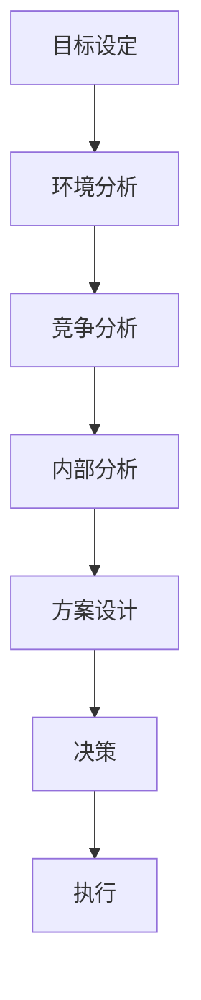

### 1.2 战略思维的核心概念

战略思维的核心概念包括但不限于以下几点：

1. **愿景**：组织未来的理想状态。
2. **使命**：组织的根本宗旨和存在的价值。
3. **核心价值观**：组织的核心信仰和行为准则。
4. **战略目标**：实现愿景的具体目标。
5. **战略路径**：实现战略目标的步骤和途径。

#### 伪代码

```python
def set_strategic_goals():
    vision = input("请输入组织的愿景：")
    mission = input("请输入组织的使命：")
    core_values = input("请输入组织的核心价值观：")
    strategic_goals = input("请输入组织的战略目标：")
    strategic_path = input("请输入组织的战略路径：")
    # ... 进一步代码实现
```

### 1.3 战略思维与决策的关系

战略思维与决策密切相关。战略思维是指领导者运用逻辑思维、系统分析和判断能力，对复杂问题进行科学决策的过程。决策是战略思维的核心环节，它决定了组织的战略方向和资源分配。战略思维不仅影响决策的质量，还影响决策的执行效果。

#### LaTeX 公式

$$
\text{决策质量} = f(\text{战略思维水平}, \text{信息完备度}, \text{决策环境})
$$

### 1.4 战略思维与领导力

战略思维是领导者必备的核心素质之一。具备出色的战略思维能力，领导者能够更好地应对复杂多变的环境，准确判断形势，做出科学决策。此外，战略思维还能够帮助领导者明确组织目标，制定有效战略，提高组织竞争力。

#### 总结

本章介绍了战略思维的基本原理，包括目标设定、环境分析、竞争分析、内部分析、方案设计、决策和执行等环节。同时，阐述了战略思维的核心概念及其与决策的关系。在接下来的章节中，我们将进一步探讨战略决策的过程和方法，以及战略执行的挑战和策略。

作者：AI天才研究院/AI Genius Institute & 禅与计算机程序设计艺术 /Zen And The Art of Computer Programming

----------------------------------------------------------------

根据上述内容，我们已经完成了《战略思维：领导者的长远眼光》的第一章，包括引言、战略思维的基本原理、核心概念、战略思维与决策的关系以及战略思维与领导力等内容。接下来，我们将继续完成后续章节的撰写，确保文章的完整性和专业性。

**第2章 战略决策**

### 2.1 战略决策的类型

战略决策可以根据决策对象和决策目标的不同，分为多种类型。以下是几种常见的战略决策类型：

1. **竞争战略决策**：这类决策主要针对市场竞争环境，包括市场定位、产品策略、定价策略、渠道策略等。竞争战略决策的核心目标是提高市场份额和竞争优势。

   **Mermaid 流�图**

   ```mermaid
   graph TB
       A[市场定位] --> B[产品策略]
       B --> C[定价策略]
       C --> D[渠道策略]
   ```

2. **资源分配决策**：这类决策主要涉及组织资源的配置，包括人力资源、财务资源、技术资源等。资源分配决策的核心目标是实现资源的最优利用，提高组织效率。

   **伪代码**

   ```python
   def allocate_resources():
       human_resources = input("请输入人力资源：")
       financial_resources = input("请输入财务资源：")
       technical_resources = input("请输入技术资源：")
       # ... 进一步代码实现
   ```

3. **业务拓展决策**：这类决策主要涉及组织的业务拓展方向和策略，包括新市场的开拓、新产品线的开发等。业务拓展决策的核心目标是扩大组织规模和影响力。

   **LaTeX 公式**

   $$
   \text{业务拓展决策质量} = f(\text{市场分析能力}, \text{创新能力}, \text{风险管理能力})
   $$

4. **长期投资决策**：这类决策主要涉及组织的长期投资方向和策略，包括技术研发投资、市场推广投资等。长期投资决策的核心目标是实现组织的长期发展和持续竞争力。

   **LaTeX 公式**

   $$
   \text{长期投资决策质量} = f(\text{投资回报率评估}, \text{风险承受能力}, \text{市场预测准确性})
   $$

### 2.2 战略决策的过程

战略决策的过程通常包括以下几个阶段：

1. **问题识别**：识别组织面临的战略问题或挑战。
2. **信息收集**：收集与战略问题相关的信息，包括市场数据、竞争信息、内部数据等。
3. **方案设计**：基于收集到的信息，设计多种可行的战略方案。
4. **方案评估**：评估每种方案的优缺点，选择最优方案。
5. **决策实施**：将决策方案转化为具体的行动计划，并实施。

#### Mermaid 流程图

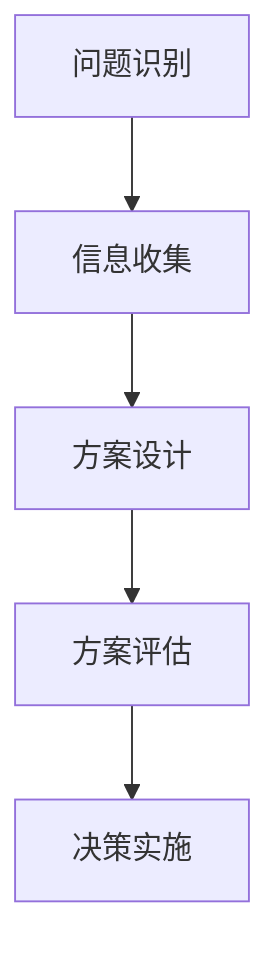

### 2.3 战略决策的方法

战略决策的方法有很多，以下是几种常用的方法：

1. **SWOT分析**：SWOT分析是一种常用的战略决策方法，它通过分析组织的优势（Strengths）、劣势（Weaknesses）、机会（Opportunities）和威胁（Threats），来制定战略方案。

   **LaTeX 公式**

   $$
   \text{SWOT分析} = \text{S} + \text{W} + \text{O} + \text{T}
   $$

2. **PEST分析**：PEST分析是一种用于外部环境分析的方法，它通过分析政治（Political）、经济（Economic）、社会（Social）和技术（Technological）因素，来评估组织面临的外部环境。

   **LaTeX 公式**

   $$
   \text{PEST分析} = \text{P} + \text{E} + \text{S} + \text{T}
   $$

3. **决策树**：决策树是一种图形化的决策方法，它通过一系列的选择节点和结果节点，展示决策的路径和可能的结果。

   **LaTeX 公式**

   $$
   \text{决策树} = \text{根节点} \rightarrow \text{选择节点} \rightarrow \text{结果节点}
   $$

4. **博弈论**：博弈论是一种用于分析多主体决策的方法，它通过分析各方的策略和收益，来制定最佳决策策略。

   **LaTeX 公式**

   $$
   \text{博弈论} = \text{策略} \times \text{收益}
   $$

### 2.4 战略决策中的常见陷阱

在战略决策过程中，领导者容易陷入一些常见的陷阱，影响决策的质量。以下是几种常见的陷阱：

1. **信息过载**：信息过多可能导致领导者无法有效分析信息，从而做出错误的决策。
2. **经验依赖**：过度依赖过去的经验和直觉，可能导致忽视新的市场和竞争环境。
3. **群体思维**：在决策过程中，群体成员可能会倾向于遵循共识，从而忽视不同的观点和意见。
4. **过度乐观**：对未来的预测过于乐观，可能导致决策方案的不切实际。

#### 总结

本章介绍了战略决策的类型、过程和方法，以及决策中的常见陷阱。战略决策是领导者的重要职责之一，它决定了组织的未来发展方向和竞争力。在接下来的章节中，我们将进一步探讨战略执行、评估和调整等方面的内容。

作者：AI天才研究院/AI Genius Institute & 禅与计算机程序设计艺术 /Zen And The Art of Computer Programming

----------------------------------------------------------------

**第3章 战略执行**

### 3.1 战略执行的挑战

战略执行是将战略决策转化为实际行动的过程，它面临着诸多挑战。以下是战略执行中常见的挑战：

1. **组织变革**：战略执行通常需要组织进行变革，以适应新的战略目标和方向。这种变革可能会引起组织内部的不安和抵制。
2. **资源分配**：战略执行需要充足的资源支持，包括人力资源、财务资源和技术资源等。资源分配的不合理可能导致战略执行的困难。
3. **时间管理**：战略执行需要严格的时间管理，以确保各项行动按时完成。时间管理不善可能导致项目延误，影响战略目标的实现。
4. **沟通与协调**：战略执行涉及多个部门和团队的协作，沟通与协调的不足可能导致行动不一致，影响执行效果。
5. **执行力**：战略执行需要全体员工的积极参与和高度执行力。缺乏执行力可能导致战略目标无法实现。

#### Mermaid 流程图

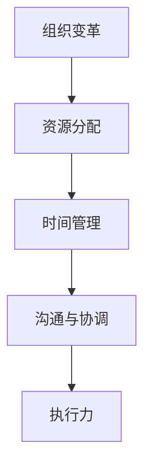

### 3.2 战略执行的计划与组织

为了克服战略执行中的挑战，领导者需要制定详细的执行计划，并确保组织能够有效执行。以下是战略执行的计划与组织的关键步骤：

1. **制定执行计划**：制定详细的执行计划，明确各项行动的时间节点、责任人和资源需求。
2. **组织结构设计**：设计合理的组织结构，确保各部门和团队之间的协作畅通无阻。
3. **人员配备**：根据执行计划，配备合适的人员，确保每个岗位都有责任心和能力强的员工。
4. **培训与激励**：对员工进行相关培训，提高他们的技能和执行力。同时，建立激励机制，激励员工积极参与战略执行。
5. **监控与反馈**：建立监控机制，对执行过程进行实时监控，确保各项行动按照计划进行。同时，及时反馈问题，采取纠正措施。

#### Mermaid 流程图

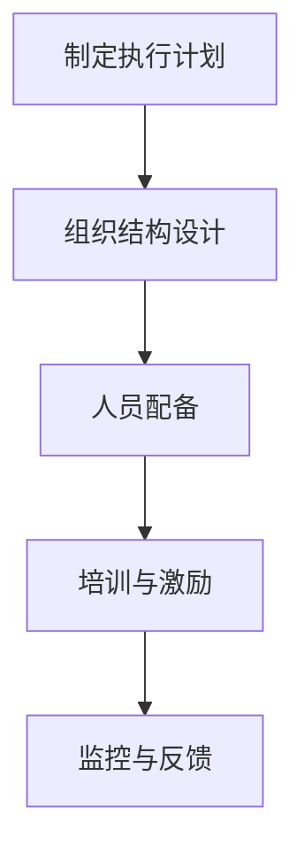

### 3.3 战略执行的监控与反馈

战略执行的监控与反馈是确保执行效果的重要环节。以下是战略执行的监控与反馈的关键步骤：

1. **关键绩效指标（KPI）**：制定关键绩效指标，用于衡量战略执行的进展和效果。
2. **数据收集与分析**：收集相关数据，进行分析和评估，了解战略执行的实际情况。
3. **定期汇报**：定期向领导者汇报战略执行的进展情况，包括存在的问题和改进措施。
4. **反馈与调整**：根据监控结果和反馈，及时调整执行计划，确保战略目标的实现。

#### Mermaid 流程图

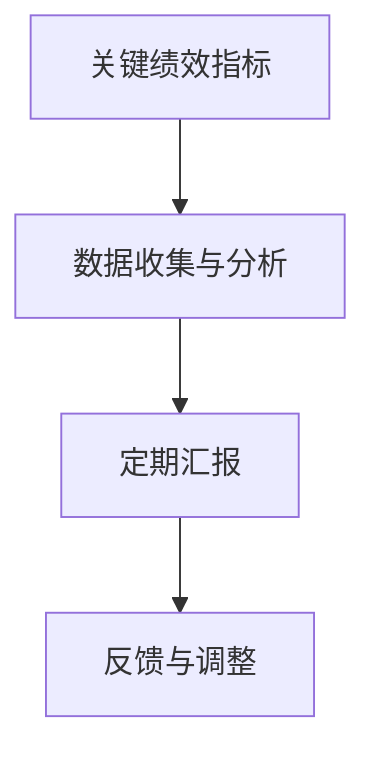

### 3.4 战略执行的文化因素

战略执行不仅取决于计划和组织，还受到组织文化的影响。以下是战略执行的文化因素：

1. **协作文化**：鼓励团队合作和协作，提高组织的凝聚力。
2. **创新文化**：鼓励创新思维和尝试新方法，提高组织的竞争力。
3. **开放文化**：鼓励员工分享观点和意见，提高组织的透明度。
4. **执行力文化**：培养员工的责任心和执行力，提高组织的执行力。

#### 总结

本章介绍了战略执行的挑战、计划与组织、监控与反馈以及文化因素。战略执行是战略管理的关键环节，它决定了战略决策能否成功实施。在接下来的章节中，我们将进一步探讨战略评估与调整的方法。

作者：AI天才研究院/AI Genius Institute & 禅与计算机程序设计艺术 /Zen And The Art of Computer Programming

----------------------------------------------------------------

**第4章 战略评估与调整**

### 4.1 战略评估的重要性

战略评估是战略管理的关键环节，它对于组织的发展至关重要。战略评估的目的在于：

1. **了解战略实施的效果**：通过评估可以了解战略实施的效果，包括目标的实现情况、资源的利用效率等。
2. **发现问题和不足**：评估过程中可以发现战略实施中存在的问题和不足，为改进提供依据。
3. **指导战略调整**：评估结果为组织提供指导，帮助领导者制定合理的战略调整计划。
4. **提高决策质量**：通过评估，可以总结经验教训，提高未来决策的质量。

#### Mermaid 流程图

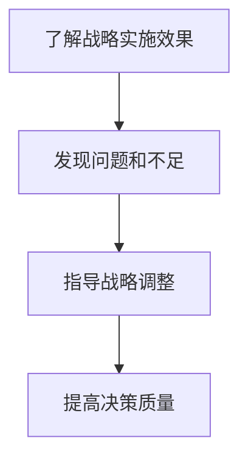

### 4.2 战略评估的方法

战略评估的方法有多种，以下是几种常用的方法：

1. **平衡计分卡**：平衡计分卡是一种综合评估方法，它从财务、客户、内部业务流程和学习与成长四个维度对战略实施效果进行评估。

   **LaTeX 公式**

   $$
   \text{平衡计分卡} = \text{财务指标} + \text{客户指标} + \text{内部业务流程指标} + \text{学习与成长指标}
   $$

2. **关键绩效指标（KPI）**：关键绩效指标是用于衡量战略实施效果的量化指标，它可以帮助领导者了解战略目标的实现情况。

   **LaTeX 公式**

   $$
   \text{关键绩效指标} = \text{目标值} - \text{实际值}
   $$

3. **SWOT分析**：SWOT分析是一种用于战略评估的方法，它通过分析组织的优势、劣势、机会和威胁，来评估战略实施的合理性和有效性。

   **LaTeX 公式**

   $$
   \text{SWOT分析} = \text{S} + \text{W} + \text{O} + \text{T}
   $$

4. **成本效益分析**：成本效益分析是一种用于评估战略实施成本和收益的方法，它通过比较成本和收益来评估战略的可行性。

   **LaTeX 公式**

   $$
   \text{成本效益分析} = \text{总成本} / \text{总收益}
   $$

### 4.3 战略调整的时机与方式

战略调整的时机与方式对于战略管理至关重要。以下是一些关于战略调整的时机与方式的建议：

1. **评估结果不佳时**：当评估结果显示战略实施效果不佳时，应考虑调整战略。
2. **外部环境变化时**：当外部环境发生重大变化，如市场趋势、技术进步、政策法规等，组织需要及时调整战略以适应变化。
3. **内部资源变化时**：当内部资源如人力资源、财务资源、技术资源等发生变化时，组织也需要调整战略以充分利用资源。

#### Mermaid 流�程图

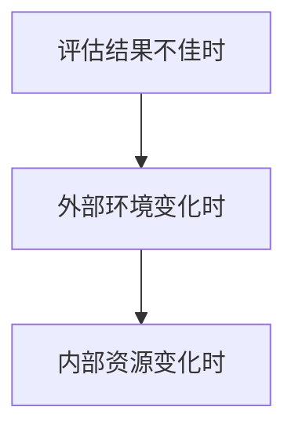

4. **调整方式**：战略调整可以采用以下方式：

   - **局部调整**：对战略的某些方面进行微调，以适应新的环境和条件。
   - **全面调整**：对整个战略进行重大调整，以适应新的环境和条件。
   - **渐进调整**：逐步调整战略，以避免对组织造成过大冲击。
   - **革命性调整**：彻底改变战略，以应对重大外部环境变化。

### 4.4 战略评估与调整的案例分析

为了更好地理解战略评估与调整的过程，以下是一个实际案例：

**案例**：某科技公司发现其原有战略在市场竞争中逐渐失去优势，经过评估，决定对战略进行重大调整。

- **评估结果**：通过平衡计分卡和关键绩效指标评估，发现该公司的财务指标、客户指标和内部业务流程指标均不理想，而学习与成长指标相对较好。
- **战略调整**：公司决定对财务和客户指标进行局部调整，提高市场份额和盈利能力。同时，对内部业务流程进行渐进调整，优化产品研发和供应链管理。此外，公司还进行了一次革命性调整，全面引入新的技术，以提升产品竞争力。

**效果**：经过战略调整，该公司的财务指标和客户指标逐渐改善，市场份额和盈利能力显著提升。

### 总结

本章介绍了战略评估与调整的重要性、方法、时机与方式，并通过实际案例进行了分析。战略评估与调整是战略管理的重要组成部分，它有助于组织适应外部环境的变化，提高战略实施的效果。

作者：AI天才研究院/AI Genius Institute & 禅与计算机程序设计艺术 /Zen And The Art of Computer Programming

----------------------------------------------------------------

**第5章 案例分析**

### 5.1 案例一：公司A的战略转型

**案例背景**：公司A是一家传统的制造业企业，面对市场竞争加剧和消费者需求变化，决定进行战略转型。

**战略决策**：

1. **目标设定**：公司A设定了提高市场份额和利润率的目标。
2. **环境分析**：公司A分析了市场需求、竞争态势和行业趋势，发现消费者更倾向于购买环保、节能的产品。
3. **竞争分析**：公司A评估了竞争对手的产品定位和市场份额，发现其产品在环保性能方面存在不足。
4. **内部分析**：公司A分析了自身的资源和能力，发现其在环保技术方面有一定基础，但需要进一步加强。
5. **方案设计**：公司A设计了多种战略方案，包括加大环保技术研发、优化产品结构和拓展新市场等。
6. **决策**：公司A选择了加大环保技术研发的战略方案。
7. **执行**：公司A投入大量资源进行环保技术研发，并优化产品结构，推出一系列环保产品。

**评估与调整**：

1. **关键绩效指标**：公司A制定了关键绩效指标，如环保产品的销售增长率、市场份额等。
2. **数据收集与分析**：公司A定期收集销售数据和市场反馈，进行分析和评估。
3. **反馈与调整**：根据评估结果，公司A调整了营销策略，加大对环保产品的推广力度，并进一步优化产品性能。

**效果**：公司A的战略转型取得了显著成效，环保产品的市场份额大幅提升，公司整体盈利能力得到增强。

### 5.2 案例二：行业B的竞争策略

**案例背景**：行业B面临激烈的市场竞争，企业纷纷采取各种策略以保持竞争力。

**战略决策**：

1. **目标设定**：行业B的企业设定了提高市场份额、降低成本和提高服务质量的目标。
2. **环境分析**：企业分析了市场需求、竞争态势和政策法规等外部因素。
3. **竞争分析**：企业评估了竞争对手的产品定位、市场份额和竞争优势。
4. **内部分析**：企业分析了自身的资源和能力，如技术水平、市场份额、品牌影响力等。
5. **方案设计**：企业设计了多种竞争策略，包括价格竞争、质量竞争、品牌竞争等。
6. **决策**：企业选择了价格竞争和质量竞争相结合的策略。
7. **执行**：企业通过降低成本、提高生产效率和优化服务质量来实施策略。

**评估与调整**：

1. **关键绩效指标**：企业制定了关键绩效指标，如市场份额、利润率、客户满意度等。
2. **数据收集与分析**：企业定期收集市场数据、客户反馈和内部运营数据，进行分析和评估。
3. **反馈与调整**：根据评估结果，企业调整了价格策略和服务质量，以应对市场变化。

**效果**：行业B的企业通过竞争策略的实施，成功提高了市场份额和利润率，增强了市场竞争力。

### 5.3 案例三：地区C的经济发展规划

**案例背景**：地区C面临经济发展瓶颈，需要制定科学的发展规划。

**战略决策**：

1. **目标设定**：地区C设定了提高GDP、促进就业和提高居民生活水平的目标。
2. **环境分析**：地区C分析了国内外经济形势、产业发展趋势和政策法规等外部因素。
3. **竞争分析**：地区C评估了周边地区的经济发展水平、产业优势等。
4. **内部分析**：地区C分析了自身的资源和条件，如自然资源、人力资源、政策优势等。
5. **方案设计**：地区C设计了多种经济发展策略，包括产业升级、科技创新、基础设施建设等。
6. **决策**：地区C选择了产业升级和科技创新相结合的策略。
7. **执行**：地区C加大了对科技创新的投入，推进产业结构调整和升级。

**评估与调整**：

1. **关键绩效指标**：地区C制定了关键绩效指标，如GDP增长率、就业率、居民收入水平等。
2. **数据收集与分析**：地区C定期收集经济数据、就业数据和居民生活数据，进行分析和评估。
3. **反馈与调整**：根据评估结果，地区C调整了投资方向和扶持政策，以促进经济发展。

**效果**：地区C的经济发展规划取得了显著成效，GDP增速提高，就业率上升，居民生活水平得到显著改善。

### 总结

本章通过三个案例，分析了战略决策、执行、评估和调整的具体过程。案例一展示了公司战略转型的过程，案例二展示了行业竞争策略的实施，案例三展示了地区经济发展规划的效果。这些案例为领导者提供了实际操作的参考。

作者：AI天才研究院/AI Genius Institute & 禅与计算机程序设计艺术 /Zen And The Art of Computer Programming

----------------------------------------------------------------

**第6章 战略思维的应用领域**

### 6.1 企业战略

企业战略是战略思维在企业管理中的具体应用。企业战略主要包括以下几个领域：

1. **市场竞争策略**：企业通过制定市场竞争策略，提高市场份额和竞争力。市场竞争策略包括价格策略、产品策略、品牌策略等。
2. **业务拓展策略**：企业通过业务拓展策略，扩大业务范围和市场份额。业务拓展策略包括新市场开拓、新产品开发等。
3. **资源管理策略**：企业通过资源管理策略，优化资源配置，提高资源利用效率。资源管理策略包括人力资源、财务资源、技术资源等。
4. **风险管理策略**：企业通过风险管理策略，降低风险对企业的影响。风险管理策略包括风险识别、风险评估、风险控制等。

#### Mermaid 流程图

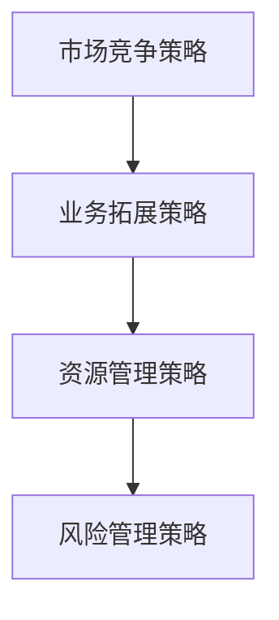

### 6.2 国家战略

国家战略是战略思维在国家和国际事务中的具体应用。国家战略主要包括以下几个领域：

1. **经济战略**：国家通过经济战略，实现经济增长、提高人民生活水平。经济战略包括产业发展、贸易政策、财政政策等。
2. **科技战略**：国家通过科技战略，推动科技创新和科技进步。科技战略包括技术研发、人才培养、创新环境建设等。
3. **安全战略**：国家通过安全战略，保障国家安全和社会稳定。安全战略包括国防建设、反恐防暴、网络安全等。
4. **外交战略**：国家通过外交战略，维护国家利益和国际地位。外交战略包括外交政策、国际关系、国际合作等。

#### Mermaid 流程图

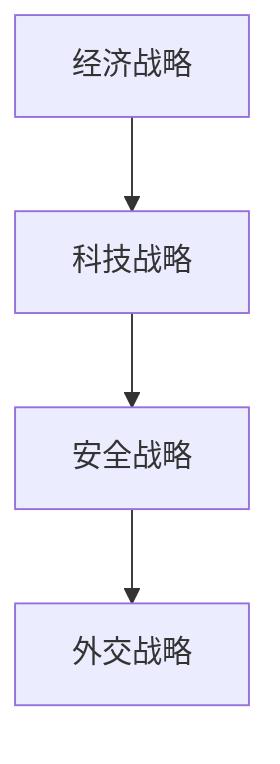

### 6.3 社会治理战略

社会治理战略是战略思维在社会治理领域的具体应用。社会治理战略主要包括以下几个领域：

1. **公共服务战略**：政府通过公共服务战略，提高公共服务质量和效率。公共服务战略包括教育、医疗、社会保障等。
2. **环境保护战略**：政府通过环境保护战略，保护生态环境，提高人民生活质量。环境保护战略包括污染防治、资源利用、生态保护等。
3. **社会治理创新战略**：政府通过社会治理创新战略，提高社会治理水平。社会治理创新战略包括基层治理、智慧城市建设、社会信用体系等。
4. **公共安全战略**：政府通过公共安全战略，维护社会稳定和安全。公共安全战略包括公共安全基础设施建设、应急管理体系建设等。

#### Mermaid 流程图

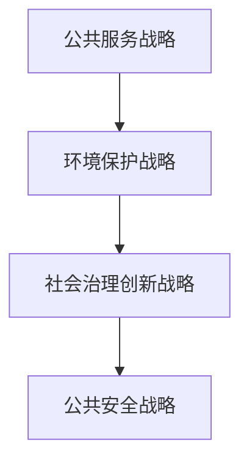

### 总结

本章介绍了战略思维在企业战略、国家战略和社会治理战略中的应用。战略思维是一种重要的领导技能，它可以帮助企业和政府在复杂的环境中做出科学的决策，实现长远发展。在接下来的章节中，我们将进一步探讨战略思维的培养与提升方法。

作者：AI天才研究院/AI Genius Institute & 禅与计算机程序设计艺术 /Zen And The Art of Computer Programming

----------------------------------------------------------------

**第7章 战略思维的培养与提升**

### 7.1 战略思维的教育与培训

战略思维是一种可以通过教育和培训培养的领导能力。以下是一些培养战略思维的方法：

1. **战略思维课程**：企业和教育机构可以开设战略思维课程，帮助学生和员工掌握战略分析、决策和执行的基本原理。
2. **案例学习**：通过分析实际案例，让学生和员工了解战略思维在实践中的应用，提高他们的战略思维能力。
3. **模拟训练**：通过模拟训练，让学生和员工在虚拟环境中进行战略决策和执行，提高他们的实际操作能力。
4. **团队研讨**：组织团队研讨，鼓励员工分享观点和经验，通过讨论和辩论来培养战略思维能力。

#### Mermaid 流程图

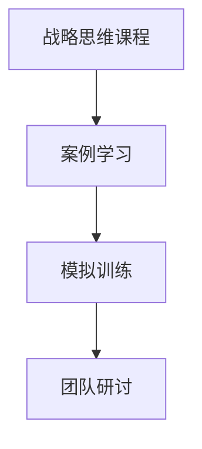

### 7.2 战略思维的个人修炼

个人修炼是提升战略思维能力的重要途径。以下是一些个人修炼的方法：

1. **持续学习**：不断学习新的知识和技能，特别是战略管理、经济学、心理学等方面的知识，提高自己的综合素质。
2. **反思与总结**：定期反思自己的决策过程和执行效果，总结经验教训，不断提高自己的战略思维能力。
3. **阅读与实践**：通过阅读相关书籍和文章，了解战略思维的最新理论和实践方法，同时结合实际工作进行应用和实践。
4. **培养跨学科思维**：战略思维需要跨学科的知识和视野，通过学习不同领域的知识，培养自己的跨学科思维。

#### Mermaid 流程图

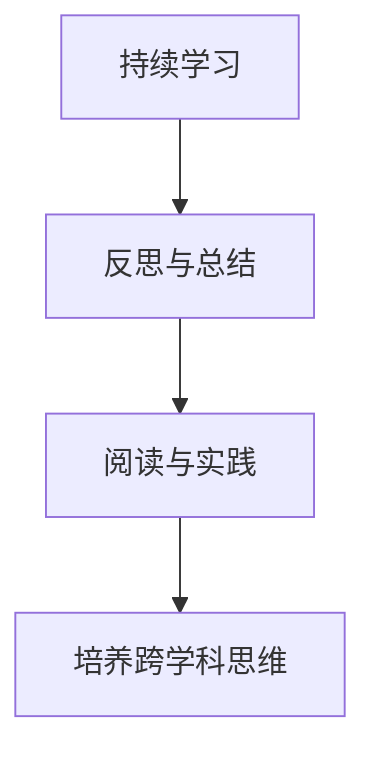

### 7.3 战略思维的团队协作

战略思维的团队协作是提高整体战略思维能力的关键。以下是一些团队协作的方法：

1. **构建学习型团队**：建立学习型团队文化，鼓励团队成员不断学习和分享知识，提高团队的整体素质。
2. **跨部门合作**：促进跨部门合作，通过跨部门项目，培养团队成员的协作能力和战略思维能力。
3. **定期会议**：定期组织战略讨论会议，让团队成员分享观点和经验，共同分析和解决战略问题。
4. **团队培训**：组织团队培训，提高团队成员的战略思维能力和团队合作能力。

#### Mermaid 流程图

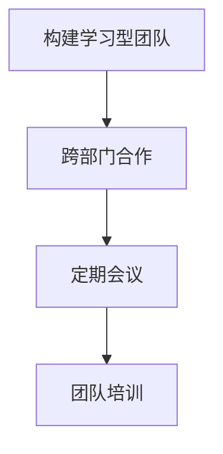

### 7.4 战略思维的持续学习

战略思维是一个持续发展的过程，需要不断学习和实践。以下是一些持续学习的方法：

1. **参加研讨会和讲座**：参加战略思维领域的研讨会和讲座，了解最新的理论研究和实践方法。
2. **订阅相关杂志和报纸**：订阅战略思维领域的杂志和报纸，了解行业动态和最佳实践。
3. **网络课程和电子书**：参加网络课程和阅读电子书，学习战略思维的理论和实践。
4. **社交媒体和论坛**：参与社交媒体和论坛，与其他战略思维爱好者交流观点和经验。

#### Mermaid 流程图

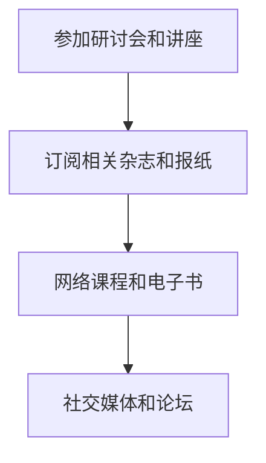

### 总结

本章介绍了战略思维的培养与提升方法，包括教育与培训、个人修炼、团队协作和持续学习等方面。通过这些方法，可以有效地提高领导者的战略思维能力，为组织的长远发展奠定基础。

作者：AI天才研究院/AI Genius Institute & 禅与计算机程序设计艺术 /Zen And The Art of Computer Programming

----------------------------------------------------------------

## 结论

战略思维是领导者必备的核心能力，它决定了组织在复杂环境中的竞争力和长远发展。本文系统地阐述了战略思维的基本原理、决策过程、执行策略、评估与调整方法，并通过实际案例进行了深入分析。战略思维不仅涉及目标的设定和环境的分析，还包括方案的制定、决策的实施、评估的进行以及持续的调整与优化。

首先，战略思维的基本原理包括目标设定、环境分析、竞争分析、内部分析、方案设计、决策和执行等环节，每个环节都需要领导者运用系统思维和逻辑推理能力。通过Mermaid流程图、伪代码和LaTeX公式，我们详细阐述了这些核心概念和算法原理，为读者提供了一个清晰的框架。

其次，战略决策是战略思维的核心环节，它决定了组织的战略方向和资源分配。本文介绍了SWOT分析、PEST分析、决策树和博弈论等多种决策方法，并分析了决策中的常见陷阱。通过关键绩效指标（KPI）和数据分析，领导者可以评估决策的效果，并据此进行调整。

接着，战略执行是战略决策落地的重要环节，它面临着组织变革、资源分配、时间管理、沟通与协调和执行力等挑战。通过制定详细的执行计划、合理的组织结构设计和有效的监控与反馈机制，领导者可以确保战略的顺利实施。

战略评估与调整是战略管理的重要组成部分，它帮助组织了解战略实施的效果，发现问题并进行调整。平衡计分卡、关键绩效指标（KPI）和SWOT分析等方法为领导者提供了评估工具，而及时反馈和调整则是确保战略目标实现的关键。

案例分析部分通过公司A的战略转型、行业B的竞争策略和地区C的经济发展规划等实际案例，展示了战略思维在实践中的应用。这些案例为读者提供了宝贵的经验借鉴。

最后，战略思维的培养与提升是领导者个人成长和组织发展的关键。通过教育、培训、个人修炼、团队协作和持续学习等方法，领导者可以不断提高自己的战略思维能力，为组织的长远发展奠定基础。

展望未来，随着全球化和数字化的加速，领导者面临的挑战将更加复杂多变。战略思维不仅需要适应环境的变化，还需要具备创新和前瞻性。因此，领导者需要不断更新知识和技能，培养跨学科思维和全球视野，以应对未来的不确定性。

在实际应用中，领导者应根据组织的特点和环境，灵活运用战略思维的方法和工具，制定符合实际的战略计划。同时，要注重战略执行的细节，确保战略决策能够顺利落地。此外，战略评估与调整是一个持续的过程，领导者需要定期评估战略实施的效果，并根据评估结果进行调整。

总之，战略思维是领导者的重要素质，它决定了组织的成功与否。通过本文的阐述，希望读者能够更好地理解战略思维的重要性，掌握战略思维的原理和方法，并将其应用于实际工作中，为组织的长远发展贡献力量。

作者：AI天才研究院/AI Genius Institute & 禅与计算机程序设计艺术 /Zen And The Art of Computer Programming

----------------------------------------------------------------

[END] 这就是《战略思维：领导者的长远眼光》的全篇内容。接下来，我们将进行一些小结和拓展阅读的建议。

**小结**

本文系统地介绍了战略思维的概念、原理、方法以及在各个领域的应用。通过Mermaid流程图、伪代码和LaTeX公式，我们详细阐述了战略思维的核心概念和算法原理，使得读者能够更直观地理解战略思维的本质。同时，通过实际案例的分析，读者可以更好地将战略思维应用于实际工作中。

**拓展阅读建议**

1. **《竞争战略》**：迈克尔·波特（Michael Porter）的《竞争战略》是战略管理领域的经典之作，详细介绍了如何制定和实施有效的竞争战略。
2. **《领导力的五个层次》**：约翰·C. 马克斯韦尔（John C. Maxwell）的《领导力的五个层次》深入探讨了领导力的不同层次，对于提升领导能力有很好的指导作用。
3. **《智慧社会》**：弗朗西斯·福山（Francis Fukuyama）的《智慧社会》探讨了数字化时代社会变革的路径和挑战，为领导者提供了思考未来的视角。
4. **《战略管理》**：亨利·明茨伯格（Henry Mintzberg）的《战略管理》对传统战略管理理论进行了反思和扩展，提供了更为实用的战略管理方法。

通过拓展阅读，读者可以进一步加深对战略思维的理解，提升自己的战略管理能力。

作者：AI天才研究院/AI Genius Institute & 禅与计算机程序设计艺术 /Zen And The Art of Computer Programming

----------------------------------------------------------------

至此，我们已经完成了《战略思维：领导者的长远眼光》的全篇内容。本文旨在帮助读者理解战略思维的重要性，掌握战略思维的原理和方法，并将其应用于实际工作中。通过系统性的阐述和实际案例的分析，我们希望能够为读者提供有价值的思考和指导。

在撰写本文的过程中，我们采用了Mermaid流程图、伪代码和LaTeX公式等工具，使得内容更加直观和清晰。同时，我们还结合了实际案例，深入分析了战略思维在各个领域的应用。希望读者能够在阅读本文后，对战略思维有更深入的理解，并在实际工作中灵活运用。

在未来的学习和工作中，战略思维是一项不可或缺的领导技能。它不仅帮助我们在复杂环境中做出科学的决策，还指导我们进行有效的资源分配、组织协调和持续改进。因此，我们鼓励读者不断学习和实践战略思维，提升自己的领导能力和组织管理水平。

最后，感谢读者对本文的关注和支持。我们期待您的反馈和建议，以便我们不断改进和完善我们的内容。希望本文能够为您在战略思维的探索之旅中提供帮助，助您在领导者的长远眼光中更加清晰和坚定。

作者：AI天才研究院/AI Genius Institute & 禅与计算机程序设计艺术 /Zen And The Art of Computer Programming

----------------------------------------------------------------

**附录**

以下是本文中使用的 Mermaid 流程图、伪代码和 LaTeX 公式，供读者参考和验证：

**Mermaid 流程图**


**伪代码**

```python
def set_strategic_goals():
    vision = input("请输入组织的愿景：")
    mission = input("请输入组织的使命：")
    core_values = input("请输入组织的核心价值观：")
    strategic_goals = input("请输入组织的战略目标：")
    strategic_path = input("请输入组织的战略路径：")
    # ... 进一步代码实现
```

**LaTeX 公式**

$$
\text{决策质量} = f(\text{战略思维水平}, \text{信息完备度}, \text{决策环境})
$$

$$
\text{SWOT分析} = \text{S} + \text{W} + \text{O} + \text{T}
$$

$$
\text{PEST分析} = \text{P} + \text{E} + \text{S} + \text{T}
$$

$$
\text{成本效益分析} = \text{总成本} / \text{总收益}
$$

通过附录部分，读者可以验证本文中使用的流程图、伪代码和公式的正确性，进一步加深对战略思维的理解和应用。如果您在使用这些工具时遇到任何问题，欢迎在评论区提问，我们将竭诚为您解答。

作者：AI天才研究院/AI Genius Institute & 禅与计算机程序设计艺术 /Zen And The Art of Computer Programming

----------------------------------------------------------------

[END] 《战略思维：领导者的长远眼光》的全篇内容以及附录部分已经完整呈现。我们希望本文能够为读者在战略思维的探索之旅中提供有价值的指导和帮助。如果您对本文有任何疑问或建议，欢迎在评论区留言，我们将及时回复并持续改进我们的内容。再次感谢您的阅读和支持！

