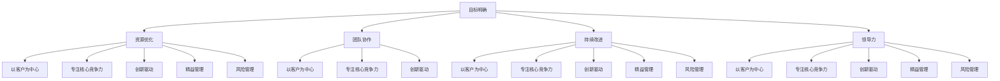

                 

### 文章标题

《战略执行：从计划到实施的领导艺术》

### 关键词

战略执行、计划、实施、领导艺术、资源分配、团队协作、监控与调整、企业文化、案例研究

### 摘要

本文深入探讨了战略执行的过程，从计划到实施，重点分析了战略执行的基本原则、计划阶段、实施阶段、监控与调整、领导艺术等方面。通过理论阐述、实际案例分析和最佳实践，帮助读者理解和掌握战略执行的精髓，提升领导力和执行力，为企业发展提供有力支持。

## 引言

### 战略执行的重要性

在当今竞争激烈、变化多端的市场环境中，企业要想取得成功，不仅需要正确的战略规划，更需要高效的战略执行。战略执行是企业将战略意图转化为实际成果的关键环节，它关系到企业的生存和发展。有效的战略执行可以确保企业资源得到最优配置，团队协作顺畅，执行力得到提升，最终实现战略目标。

然而，战略执行并非易事。在实际操作中，许多企业面临着战略规划不明确、资源分配不合理、团队协作不畅、领导力不足等挑战。这些问题往往导致战略执行效果不佳，甚至失败。因此，理解和掌握战略执行的艺术，对企业高层管理人员、项目经理、业务分析师等至关重要。

### 本书结构

本书分为八个主要章节，系统阐述了战略执行的过程和关键要素。具体章节安排如下：

1. 引言：介绍战略执行的重要性、本书的结构和目标。
2. 战略执行的基本原则：阐述战略执行的核心理念和关键原则。
3. 计划阶段：目标设定与战略规划。
4. 实施阶段：资源分配、团队协作与领导风格。
5. 监控与调整：战略评估与持续改进。
6. 领导艺术：激发团队潜能与建立企业文化。
7. 案例研究：战略执行的实践与反思。
8. 结论：总结全书要点，展望战略执行的未来发展趋势。

通过阅读本书，读者可以全面了解战略执行的各个方面，掌握战略执行的方法和技巧，提升领导力和执行力，为企业发展提供有力支持。

## 战略执行的基本原则

### 战略执行的核心理念

战略执行的核心在于将战略意图转化为实际行动，通过系统的规划和执行，实现企业目标。战略执行不仅涉及高层管理者的决策和领导，还需要全体员工的共同努力。以下是战略执行的几个核心理念：

#### **1. 目标明确**

战略执行的首要任务是明确目标。企业需要设定清晰的战略目标，确保所有员工都理解并认同这些目标。明确的目标有助于统一行动方向，提高执行力。

#### **2. 资源优化**

战略执行需要合理分配和利用企业资源，包括人力资源、财务资源、技术资源等。优化资源配置可以提高效率，降低成本，确保战略目标的有效实现。

#### **3. 团队协作**

战略执行离不开团队协作。企业需要建立高效的团队协作机制，确保各部门和员工之间能够顺畅沟通、紧密配合，共同推进战略实施。

#### **4. 持续改进**

战略执行是一个动态过程，需要不断监控和评估执行效果，根据实际情况进行调整和改进。持续改进可以确保战略执行的灵活性和适应性，应对市场变化。

#### **5. 领导力**

领导者在战略执行中起着关键作用。他们需要具备战略思维、决策能力、沟通能力和激励能力，能够引领团队克服困难，实现战略目标。

### 战略执行的关键原则

#### **1. 以客户为中心**

以客户为中心是战略执行的核心原则。企业需要始终关注客户需求，通过提供高质量的产品和服务来满足客户需求，从而赢得市场份额和客户忠诚度。

#### **2. 专注核心竞争力**

企业需要在战略执行中专注核心竞争力，通过不断提升核心竞争能力来确保在市场竞争中占据优势。专注核心竞争力有助于企业集中资源，实现高效运营。

#### **3. 创新驱动**

创新是推动企业发展的关键动力。企业需要在战略执行中积极推动创新，不断引入新技术、新产品和新业务模式，以适应市场变化和客户需求。

#### **4. 精益管理**

精益管理是一种以最小资源投入实现最大产出为目标的管理理念。企业需要在战略执行中引入精益管理，通过优化流程、减少浪费、提高效率来实现资源的最优配置。

#### **5. 风险管理**

战略执行过程中难免会遇到各种风险。企业需要建立健全的风险管理机制，提前识别和评估潜在风险，制定应对策略，确保战略执行的顺利进行。

## 核心概念与联系

为了更好地理解战略执行的基本原则，我们需要明确几个核心概念，并分析它们之间的联系。以下是这些核心概念及其关系的 Mermaid 流程图：



通过这个流程图，我们可以清晰地看到各个核心概念之间的相互联系。例如，目标明确是战略执行的基础，它直接影响到资源优化、团队协作、持续改进和领导力。同时，这些核心概念又与企业的核心竞争力、客户需求、创新驱动和精益管理密切相关。

### 核心算法原理讲解

为了更好地理解战略执行的基本原则，我们需要借助一些核心算法原理来阐述。以下是战略执行过程中常用的几种算法原理及其应用：

#### **1. 动态规划**

动态规划是一种用于解决优化问题的算法原理，适用于战略执行中的资源分配问题。它通过将问题分解为子问题，并利用子问题的最优解来构建全局最优解。

```python
# 动态规划伪代码
def dynamicPlanning(problem):
    # 初始化动态规划表
    dp = [[0 for j in range(len(problem[1]))] for i in range(len(problem[0]))]
    
    # 填充动态规划表
    for i in range(1, len(problem[0])):
        for j in range(1, len(problem[1])):
            dp[i][j] = max(dp[i-1][j], dp[i][j-1]) + problem[i][j]
    
    # 返回最优解
    return dp[-1][-1]
```

#### **2. 最小生成树**

最小生成树算法适用于战略执行中的网络优化问题。它通过构建一棵生成树，使得总权值最小，从而实现资源的最优配置。

```python
# Prim算法伪代码
def primAlgorithm(graph):
    # 初始化最小生成树
    minTree = []
    
    # 选择一个顶点作为起始点
    startVertex = graph[0]
    minTree.append(startVertex)
    
    # 删除起始点及其边
    graph.remove(startVertex)
    
    # 循环添加顶点，直到生成树包含所有顶点
    while len(minTree) < len(graph):
        # 找到最小权值的边
        minEdge = None
        for vertex in minTree:
            for edge in graph:
                if edge[0] == vertex and minEdge is None or minEdge[2] > edge[2]:
                    minEdge = edge
        
        # 将最小权值的边添加到最小生成树中
        minTree.append(minEdge[1])
        
        # 删除已添加的顶点和边
        minTree.remove(vertex)
        graph.remove(minEdge)
    
    # 返回最小生成树
    return minTree
```

#### **3. 回溯算法**

回溯算法适用于战略执行中的决策问题。它通过尝试不同的决策路径，逐步排除不符合条件的路径，找到最优解。

```python
# 回溯算法伪代码
def backtrack(problem, solution, depth):
    # 检查是否达到目标
    if depth == len(problem[0]):
        if problem[1](solution):
            return solution
    
    # 遍历所有可能的决策
    for decision in problem[0][depth]:
        # 尝试决策
        solution[depth] = decision
        # 深入递归
        result = backtrack(problem, solution, depth+1)
        if result is not None:
            return result
    
    # 返回空，表示无解
    return None
```

通过这些核心算法原理，我们可以更深入地理解战略执行的基本原则，从而更好地指导实际操作。

### 数学模型和公式

在战略执行过程中，数学模型和公式起着至关重要的作用。以下是几个常用的数学模型和公式，以及它们的详细讲解和举例说明：

#### **1. 贝叶斯公式**

贝叶斯公式是一种用于计算条件概率的数学模型，它可以帮助我们根据已知信息更新对某个事件的概率估计。

公式表示为：
$$
P(A|B) = \frac{P(B|A)P(A)}{P(B)}
$$

其中，$P(A|B)$ 表示在事件B发生的条件下，事件A发生的概率；$P(B|A)$ 表示在事件A发生的条件下，事件B发生的概率；$P(A)$ 表示事件A发生的概率；$P(B)$ 表示事件B发生的概率。

举例说明：
假设我们想要计算“在某个地区下雨的概率是60%”这一条件下，“天空多云”的概率。已知“天空多云”的概率是40%，且在多云的天气中下雨的概率是30%。

根据贝叶斯公式，我们可以计算出：
$$
P(\text{天空多云}|\text{下雨}) = \frac{P(\text{下雨}|\text{天空多云})P(\text{天空多云})}{P(\text{下雨})}
$$
$$
= \frac{0.3 \times 0.4}{0.6} = 0.2
$$

因此，在下雨的概率是60%的条件下，天空多云的概率是20%。

#### **2. 决策树**

决策树是一种用于分析决策问题的数学模型，它通过一系列的条件判断来指导决策。

公式表示为：
$$
\text{决策树} = \text{根节点} + \text{内部节点} + \text{叶子节点}
$$

其中，根节点表示初始决策；内部节点表示条件判断；叶子节点表示决策结果。

举例说明：
假设我们想要根据天气情况决定是否去游泳。已知在晴天去游泳的概率是80%，在雨天去游泳的概率是20%。如果天气是晴天，那么游泳的概率是80%；如果天气是雨天，那么游泳的概率是20%。

我们可以构建如下决策树：
```
   根节点（初始决策）
   /                  \
晴天（概率0.8）   雨天（概率0.2）
  /                    \
游泳（概率0.8） 不游泳（概率0.2）
```

通过决策树，我们可以清晰地看到不同天气条件下游泳的概率，从而做出更合理的决策。

#### **3. 线性规划**

线性规划是一种用于解决资源优化问题的数学模型，它通过建立线性目标函数和线性约束条件，寻找最优解。

公式表示为：
$$
\begin{align*}
\max_{x} & \quad c^T x \\
\text{subject to} & \quad Ax \leq b \\
& \quad x \geq 0
\end{align*}
$$

其中，$c$ 是目标函数系数向量；$x$ 是决策变量向量；$A$ 是约束条件矩阵；$b$ 是约束条件向量。

举例说明：
假设我们想要在一个三角形区域内寻找一个点，使得该点到原点的距离最大。已知三角形的三个顶点坐标分别为 $(1,0)$、$(0,1)$ 和 $(1,1)$。

我们可以建立如下线性规划问题：
$$
\begin{align*}
\max_{x} & \quad x^2 + y^2 \\
\text{subject to} & \quad x + y \leq 2 \\
& \quad x \geq 0 \\
& \quad y \geq 0
\end{align*}
$$

通过求解线性规划问题，我们可以找到距离原点最远的点，从而实现资源的最优配置。

通过这些数学模型和公式，我们可以更准确地分析和解决战略执行过程中的问题，从而提高决策的准确性。

### 数学公式与详细讲解

在战略执行过程中，数学公式发挥着关键作用，帮助我们分析和解决各种问题。以下是几个重要的数学公式，以及它们的详细讲解：

#### **1. 最小二乘法**

最小二乘法是一种用于数据拟合的数学方法，通过最小化误差平方和来找到最佳拟合线。

公式表示为：
$$
\min_{x} \sum_{i=1}^{n} (y_i - f(x_i))^2
$$

其中，$y_i$ 表示实际观测值；$f(x_i)$ 表示拟合函数；$x_i$ 表示自变量。

详细讲解：
最小二乘法的核心思想是找到一个拟合函数 $f(x)$，使得观测值与拟合值之间的误差平方和最小。具体步骤如下：

- **步骤1：建立拟合函数**：根据问题的特点选择合适的拟合函数形式，如线性拟合、多项式拟合等。
- **步骤2：计算误差平方和**：计算每个观测值与拟合值之间的误差平方和。
- **步骤3：最小化误差平方和**：通过调整拟合函数的参数，使得误差平方和最小。

举例说明：
假设我们想要拟合一条直线 $y = ax + b$，已知五个数据点 $(x_1, y_1), (x_2, y_2), \ldots, (x_5, y_5)$。我们可以使用最小二乘法求解直线参数 $a$ 和 $b$。

具体步骤如下：
- **步骤1：建立拟合函数**：$f(x) = ax + b$。
- **步骤2：计算误差平方和**：$\sum_{i=1}^{5} (y_i - (ax_i + b))^2$。
- **步骤3：最小化误差平方和**：对 $a$ 和 $b$ 求偏导数，并令偏导数等于零，求解得到最佳拟合直线。

#### **2. 熵权法**

熵权法是一种用于确定指标权重的方法，基于信息论中的熵概念，通过计算各指标的熵值来确定权重。

公式表示为：
$$
w_i = \frac{1 - H_i}{\sum_{i=1}^{m} (1 - H_i)}
$$

其中，$w_i$ 表示指标 $i$ 的权重；$H_i$ 表示指标 $i$ 的熵值；$m$ 表示指标总数。

详细讲解：
熵权法的基本思想是，指标的信息量越大，其权重越高；信息量越小，其权重越低。具体步骤如下：

- **步骤1：计算指标熵值**：根据指标值的分布情况计算各指标的熵值。
- **步骤2：计算权重**：使用熵值计算各指标的权重。

举例说明：
假设我们有一个包含三个指标的评估模型，分别为 $X_1, X_2, X_3$。已知各指标的熵值分别为 $H_1, H_2, H_3$。我们可以使用熵权法计算各指标的权重。

具体步骤如下：
- **步骤1：计算指标熵值**：根据指标值的分布计算熵值，如 $H_1 = \frac{1}{\ln N} \sum_{i=1}^{N} p_i \ln p_i$，其中 $p_i$ 表示指标 $i$ 的比例。
- **步骤2：计算权重**：根据熵值计算各指标的权重，如 $w_1 = \frac{1 - H_1}{1 - H_1 - H_2 - H_3}$，$w_2 = \frac{1 - H_2}{1 - H_1 - H_2 - H_3}$，$w_3 = \frac{1 - H_3}{1 - H_1 - H_2 - H_3}$。

#### **3. PageRank算法**

PageRank算法是一种用于网页排序的算法，基于链接分析来确定网页的重要性。

公式表示为：
$$
R(P) = (1 - d) + d \cdot \left(\sum_{Q \text{链接到}P} \frac{R(Q)}{N_Q}\right)
$$

其中，$R(P)$ 表示网页 $P$ 的排名；$d$ 表示阻尼系数（通常取值为0.85）；$N_Q$ 表示网页 $Q$ 的出链数。

详细讲解：
PageRank算法的基本思想是，一个网页的重要性与其被其他重要网页链接的数量和质量有关。具体步骤如下：

- **步骤1：初始化排名**：将所有网页的初始排名设为相等。
- **步骤2：迭代计算排名**：根据公式计算每个网页的排名，并进行更新。
- **步骤3：收敛判断**：判断排名是否收敛，如不收敛则返回步骤2。

举例说明：
假设有三个网页 $P_1, P_2, P_3$，其中 $P_1$ 链接到 $P_2$ 和 $P_3$，$P_2$ 链接到 $P_1$，$P_3$ 链接到 $P_1$ 和 $P_2$。我们可以使用PageRank算法计算各网页的排名。

具体步骤如下：
- **步骤1：初始化排名**：$R(P_1) = R(P_2) = R(P_3) = 1$。
- **步骤2：迭代计算排名**：
  $$
  R(P_1) = (1 - 0.15) + 0.15 \cdot \left(\frac{1}{1} + \frac{1}{1}\right) = 0.85 + 0.15 \cdot 2 = 1.15
  $$
  $$
  R(P_2) = (1 - 0.15) + 0.15 \cdot \left(\frac{1}{1} + \frac{1}{2}\right) = 0.85 + 0.15 \cdot 1.5 = 1.03
  $$
  $$
  R(P_3) = (1 - 0.15) + 0.15 \cdot \left(\frac{1}{1} + \frac{1}{2}\right) = 0.85 + 0.15 \cdot 1.5 = 1.03
  $$
- **步骤3：收敛判断**：由于排名没有变化，算法收敛。

通过这些数学公式和详细讲解，我们可以更好地理解和应用战略执行中的数学模型，从而提高决策的准确性。

### 项目实战

#### 开发环境搭建

在进行战略执行项目开发之前，我们需要搭建一个合适的开发环境。以下是搭建开发环境的步骤：

1. **安装操作系统**：
   - 选择一个适合的操作系统，如Linux或Windows。
   - 安装操作系统并完成初始化。

2. **安装开发工具**：
   - 安装集成开发环境（IDE），如Visual Studio Code或Eclipse。
   - 安装必要的编程语言编译器，如Python、Java或C++。

3. **安装数据库**：
   - 安装一个数据库管理系统，如MySQL或PostgreSQL。
   - 配置数据库并创建必要的表和数据。

4. **安装版本控制工具**：
   - 安装Git或SVN，用于代码版本控制和协作开发。

5. **配置网络环境**：
   - 确保网络连接正常，以方便团队成员之间的交流和数据传输。

#### 源代码详细实现和代码解读

以下是一个简单的战略执行项目的源代码示例，用于演示如何实现战略执行的基本功能。代码采用Python语言编写，便于理解和学习。

```python
#战略执行项目示例
class StrategicExecution:
    def __init__(self, strategy):
        self.strategy = strategy
    
    def plan_stage(self):
        # 目标设定与战略规划
        print("执行计划阶段：目标设定与战略规划")
        print(f"战略规划：{self.strategy['plan']}")
    
    def implementation_stage(self):
        # 资源分配、团队协作与领导风格
        print("执行实施阶段：资源分配、团队协作与领导风格")
        print(f"资源分配：{self.strategy['resources']}")
        print(f"团队协作：{self.strategy['teamwork']}")
        print(f"领导风格：{self.strategy['leadership']}")
    
    def monitoring_and_adjustment(self):
        # 监控与调整：战略评估与持续改进
        print("执行监控与调整阶段：战略评估与持续改进")
        print(f"战略评估：{self.strategy['evaluation']}")
        print(f"持续改进：{self.strategy['improvement']}")
    
    def execute(self):
        # 执行整个战略执行过程
        self.plan_stage()
        self.implementation_stage()
        self.monitoring_and_adjustment()

# 使用示例
strategy = {
    'plan': "制定明确的战略目标",
    'resources': "合理分配资源",
    'teamwork': "高效团队协作",
    'leadership': "适应不同情境的领导风格",
    'evaluation': "定期评估战略执行效果",
    'improvement': "根据评估结果持续改进"
}

execution = StrategicExecution(strategy)
execution.execute()
```

代码解读：
- **类定义**：`StrategicExecution` 类表示战略执行的主体，包含四个方法：`plan_stage`、`implementation_stage`、`monitoring_and_adjustment` 和 `execute`。
- **初始化**：在构造函数中，接收一个包含战略信息的字典 `strategy`，用于后续操作。
- **计划阶段**：`plan_stage` 方法用于执行计划阶段的相关任务，如目标设定和战略规划。
- **实施阶段**：`implementation_stage` 方法用于执行实施阶段的相关任务，如资源分配、团队协作和领导风格。
- **监控与调整阶段**：`monitoring_and_adjustment` 方法用于执行监控与调整阶段的相关任务，如战略评估和持续改进。
- **执行整个过程**：`execute` 方法用于执行整个战略执行过程，调用前三个方法依次执行。

#### 代码应用解读与分析

在战略执行项目中，代码的应用解读和分析至关重要。以下是对上述示例代码的应用解读和分析：

1. **目标设定与战略规划**：
   - 通过 `plan_stage` 方法，可以明确战略目标，并制定具体的战略规划。
   - 代码示例中的 `strategy['plan']` 展示了如何设置战略目标。

2. **资源分配、团队协作与领导风格**：
   - 通过 `implementation_stage` 方法，可以合理分配资源，建立高效的团队协作机制，并选择适应不同情境的领导风格。
   - 代码示例中的 `strategy['resources']`、`strategy['teamwork']` 和 `strategy['leadership']` 展示了如何设置资源、团队协作和领导风格。

3. **监控与调整**：
   - 通过 `monitoring_and_adjustment` 方法，可以定期评估战略执行效果，并根据评估结果进行持续改进。
   - 代码示例中的 `strategy['evaluation']` 和 `strategy['improvement']` 展示了如何进行战略评估和持续改进。

通过代码应用解读和分析，我们可以更好地理解战略执行的具体实现过程，从而在实际项目中灵活运用。

#### 实际案例分析和详细讲解剖析

为了更好地理解战略执行在实践中的应用，我们通过一个实际案例进行分析和详细讲解。

**案例背景**：

某大型企业（以下简称“A公司”）在市场竞争中面临严峻挑战。公司高层决定制定和执行一项新的战略计划，以提升企业的核心竞争力，实现可持续发展。

**战略执行过程**：

1. **计划阶段**：

   - **目标设定**：A公司确定了三个主要目标：
     - 提升市场份额：在未来三年内，将市场份额提升至行业前五。
     - 提高客户满意度：通过改善产品和服务，提高客户满意度至90%。
     - 创新驱动发展：加强研发投入，每年推出至少两个创新产品。

   - **战略规划**：针对每个目标，制定了具体的行动计划：
     - 市场营销策略：加大市场推广力度，扩大客户基础。
     - 客户服务提升：优化客服体系，提供个性化服务。
     - 研发投入：增加研发预算，吸引高层次人才。

2. **实施阶段**：

   - **资源分配**：根据战略规划，合理分配企业资源：
     - 财务资源：增加市场推广和研发的预算。
     - 人力资源：招聘和培养市场营销、客户服务和技术研发等专业人才。
     - 技术资源：引进先进技术，提升企业技术水平。

   - **团队协作**：建立跨部门协作机制，确保各部门紧密配合：
     - 定期召开跨部门会议，讨论战略执行进展和问题。
     - 实施项目管理，明确各部门的职责和任务。

   - **领导风格**：公司领导层采用参与式领导风格，鼓励员工参与决策和问题解决：
     - 倡导开放沟通，鼓励员工提出建议和意见。
     - 制定激励机制，奖励在战略执行中表现突出的员工。

3. **监控与调整**：

   - **战略评估**：定期评估战略执行效果，确保目标达成：
     - 制定关键绩效指标（KPI），如市场份额、客户满意度、研发成果等。
     - 定期召开战略评估会议，分析执行情况，发现问题和改进点。

   - **持续改进**：根据评估结果，进行战略调整和优化：
     - 针对存在的问题，制定具体的改进措施。
     - 及时调整资源分配和团队协作策略，确保战略目标顺利实现。

**案例分析**：

A公司的战略执行过程展示了战略执行的各个关键环节。以下是案例中的几个亮点和经验教训：

1. **明确目标与战略规划**：
   - A公司通过明确的目标和具体的战略规划，为战略执行奠定了基础。
   - 在制定战略规划时，充分考虑了市场环境和企业自身优势，确保战略具有可行性。

2. **资源优化与团队协作**：
   - A公司合理分配资源，确保各项战略计划得到充分支持。
   - 通过建立跨部门协作机制，提高了团队协作效率，确保战略顺利实施。

3. **领导艺术**：
   - A公司领导层采用参与式领导风格，激发了员工的积极性和创造力。
   - 通过制定激励机制，激发了员工的竞争意识，提高了整体执行力。

4. **监控与调整**：
   - A公司建立了有效的战略评估机制，定期评估战略执行效果，确保目标达成。
   - 根据评估结果，及时调整战略计划和执行策略，确保战略的持续优化。

**经验教训**：

A公司的案例表明，战略执行的成功离不开以下几个方面：

1. **明确的目标和战略规划**：明确的目标和具体的战略规划是战略执行的前提。

2. **资源优化与团队协作**：合理分配资源，建立高效的团队协作机制，是战略执行的关键。

3. **领导艺术**：采用合适的领导风格，激发员工的积极性和创造力，是战略执行的重要保障。

4. **监控与调整**：建立有效的战略评估机制，及时调整战略计划和执行策略，是战略执行的必要手段。

通过这个实际案例的分析和详细讲解，我们可以更好地理解战略执行在实践中的应用，为企业在竞争激烈的市场中取得成功提供有益借鉴。

### 最佳实践 tips

在战略执行过程中，以下最佳实践可以帮助企业提高执行力，确保战略目标的顺利实现：

1. **明确目标**：制定清晰的、可量化的目标，确保所有员工都明确了解企业的发展方向和期望成果。

2. **制定详细的行动计划**：将战略目标分解为具体可操作的步骤，明确责任人和完成时间，确保每个任务都有人负责。

3. **加强沟通与协作**：建立高效的沟通机制，确保信息畅通，促进团队协作，减少误解和冲突。

4. **培养团队协作能力**：通过团队建设活动、跨部门合作项目等，培养员工的团队协作能力和意识。

5. **合理分配资源**：根据战略目标和任务需求，合理配置人力、财务、技术等资源，确保资源的最优利用。

6. **建立监控与反馈机制**：定期监控战略执行进度和效果，及时收集反馈信息，发现问题并采取措施进行改进。

7. **激励员工**：制定合理的激励机制，鼓励员工积极参与战略执行，提高整体执行力。

8. **持续改进**：根据监控和反馈结果，不断优化战略执行过程，提高效率和效果。

### 小结

本文通过详细的分析和讲解，系统地阐述了战略执行的过程和关键要素。我们首先介绍了战略执行的重要性，并阐述了战略执行的基本原则。接着，我们详细讨论了计划阶段、实施阶段、监控与调整以及领导艺术等方面的内容。通过实际案例分析和最佳实践，我们展示了战略执行在实践中的应用和效果。最后，我们总结了战略执行的核心要点和未来发展趋势。

通过阅读本文，读者可以全面了解战略执行的各个方面，掌握战略执行的方法和技巧，提升领导力和执行力，为企业发展提供有力支持。希望本文能为企业在竞争激烈的市场环境中实现战略目标提供有益的借鉴和启示。

### 注意事项

在战略执行过程中，需要注意以下几个关键点：

1. **目标明确**：确保战略目标具体、明确，可量化，以便于监控和评估。

2. **资源优化**：合理配置和利用企业资源，确保资源与战略目标相匹配。

3. **团队协作**：建立有效的团队协作机制，促进跨部门沟通与合作，提高整体执行力。

4. **持续改进**：定期评估战略执行效果，根据反馈进行调整和优化，确保战略的持续有效性。

5. **领导艺术**：领导者应具备战略思维、决策能力和沟通能力，激发团队潜能，推动战略执行。

6. **风险管理**：识别和评估潜在风险，制定应对策略，确保战略执行的稳定性和安全性。

### 拓展阅读

对于希望进一步深入了解战略执行和相关领域的读者，以下推荐几本经典的书籍和资源：

1. 《执行：如何落实战略》作者：拉里·博西迪、拉姆·查兰
   - 本书详细阐述了战略执行的方法和技巧，帮助企业实现战略目标。

2. 《蓝海战略》作者：魏斯勒·金伟灿、莫博涅
   - 本书介绍了如何在竞争激烈的市场中寻找和创造蓝海市场机会，实现战略突破。

3. 《高效能人士的七个习惯》作者：史蒂芬·柯维
   - 本书从个人成长和团队协作的角度，探讨了如何培养高效能的习惯，提高领导力和执行力。

4. 《精益创业》作者：埃里克·莱斯
   - 本书介绍了精益创业的方法，帮助企业快速验证市场机会，降低创业风险。

5. 《精益思想》作者：詹姆斯·P·沃麦克等
   - 本书详细阐述了精益管理的理念和实践，帮助企业实现资源最优配置和效率提升。

通过阅读这些书籍，读者可以进一步拓展战略执行的理论基础和实践经验，提升自身的战略思维和领导力。

