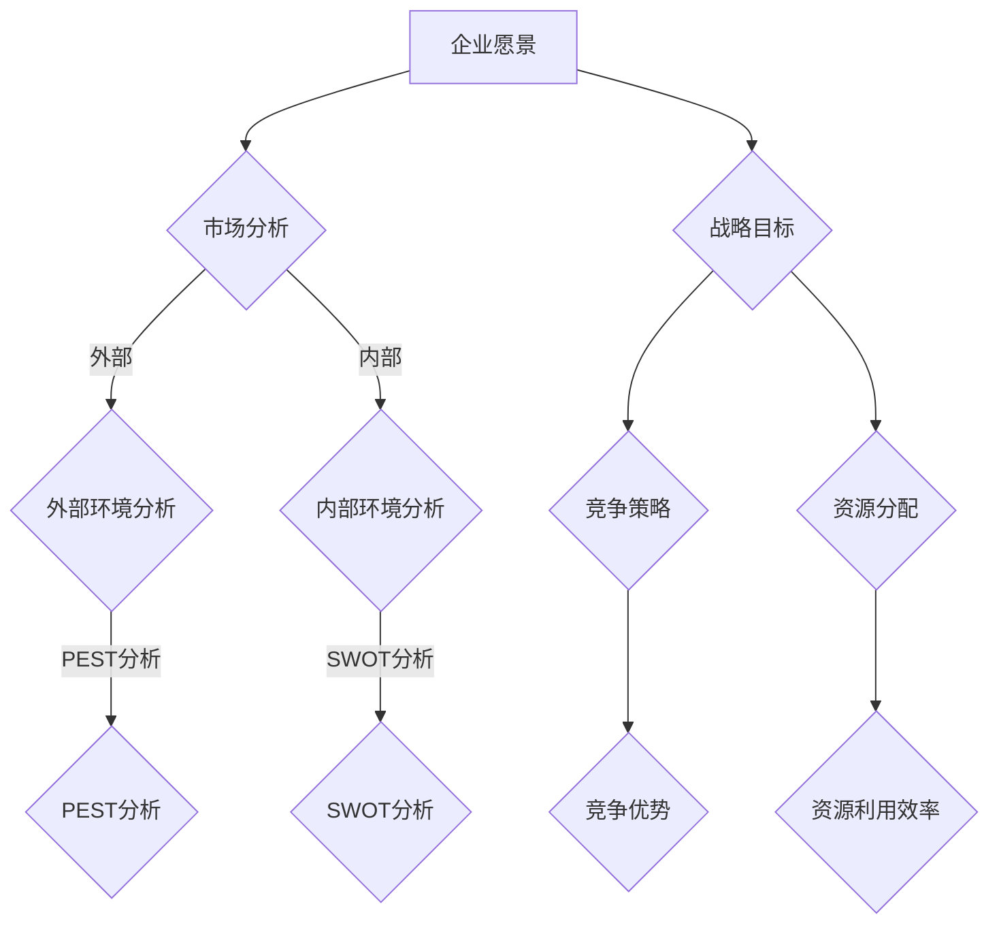

                 


## 文章标题

《战略规划与执行：从蓝图到现实的领导艺术》

> 关键词：战略规划、执行、领导艺术、蓝图、现实

> 摘要：本文将深入探讨战略规划与执行的重要性，通过一系列逻辑清晰、结构紧凑的章节，帮助读者掌握从蓝图到现实的领导艺术。文章将结合实际案例，详细阐述战略规划与执行的核心概念、算法原理、数学模型、实践方法以及领导艺术。

----------------------------------------------------------------

### 引言

在当今快速变化、竞争激烈的市场环境中，企业要取得成功，必须具备前瞻性的战略规划和高效的执行能力。战略规划是企业发展的蓝图，而执行则是将蓝图转化为现实的桥梁。领导艺术则是在这一过程中不可或缺的因素，它决定了战略能否得到有效实施。

本文将围绕以下主题展开：

1. **战略规划的重要性**：介绍战略规划的概念、目的和意义。
2. **战略规划的步骤**：详细讲解战略规划的各个阶段。
3. **执行过程的关键要素**：探讨团队管理、项目管理、执行评估等方面的核心要素。
4. **领导艺术的运用**：分析领导在战略规划与执行中的角色和技巧。
5. **案例分析**：通过实际案例展示战略规划与执行的效果。
6. **工具与方法**：介绍一些实用的战略规划与执行工具和方法。

本文旨在通过逻辑清晰、结构紧凑的分析，帮助读者深入了解战略规划与执行的本质，掌握从蓝图到现实的领导艺术。

----------------------------------------------------------------

### 战略规划的重要性

战略规划是企业发展的关键，它涉及到企业长期发展的方向和目标。战略规划不仅仅是高层管理者的责任，而是整个组织的共同任务。一个成功的战略规划能够为企业提供清晰的愿景，明确的目标，以及实现这些目标的路径。

#### 概念

战略规划是指企业通过系统性的分析和决策，确定长期发展目标，并制定相应的策略和计划，以确保企业能够在竞争激烈的市场中持续发展和保持竞争优势。

#### 目的

战略规划的主要目的是：

1. **明确企业愿景和目标**：通过战略规划，企业能够明确未来的发展方向和目标，为全体员工提供共同的目标和方向。
2. **分析内外部环境**：战略规划需要对企业所处的市场环境、竞争态势、技术趋势等内外部因素进行全面分析，为制定策略提供依据。
3. **制定具体的行动方案**：战略规划不仅要设定目标，还需要制定具体的行动方案，包括资源配置、时间表、关键绩效指标等，确保目标能够得到有效实施。
4. **提高执行力**：战略规划可以提升企业的执行力，确保各部门和员工能够协调一致地推进战略目标的实现。

#### 意义

战略规划对于企业的发展具有重要意义：

1. **确保企业长期发展**：战略规划可以帮助企业预见未来的挑战和机遇，确保企业能够在长期发展中保持竞争优势。
2. **提高资源利用效率**：通过战略规划，企业可以更加合理地配置资源，提高资源利用效率，减少浪费。
3. **提升员工凝聚力**：战略规划可以让员工了解企业的愿景和目标，增强员工的归属感和使命感，提高工作积极性。
4. **应对不确定性**：在快速变化的市场环境中，战略规划可以帮助企业更好地应对不确定性，降低经营风险。

#### 案例分析

以某互联网公司为例，该公司在制定战略规划时，首先明确了企业的愿景和目标，即成为行业领导者。然后，通过市场调研和竞争对手分析，确定了公司的核心竞争力。接着，制定了具体的行动方案，包括产品创新、市场拓展、技术升级等方面。

在执行过程中，公司加强了团队管理，通过设立项目组、明确责任分工、制定进度表等措施，确保每个项目能够按时完成。同时，公司还定期进行执行评估，根据实际情况调整策略，确保战略目标的实现。

通过这个案例，我们可以看到战略规划在企业成功发展中的关键作用。只有通过科学的战略规划，企业才能在激烈的市场竞争中立于不败之地。

----------------------------------------------------------------

### 战略规划的核心概念与联系

为了更好地理解战略规划，我们需要了解其核心概念及其相互关系。以下是一个战略规划的核心概念架构图，使用Mermaid流程图来展示：



- **企业愿景（A）**：企业长期发展的目标，指导企业行动的指南针。
- **市场分析（B）**：包括外部环境分析和内部环境分析，用于识别市场机会和挑战。
  - **外部环境分析（C和K）**：外部环境包括政治、经济、社会和技术等因素（PEST分析），以及竞争对手分析。
  - **内部环境分析（D和J）**：内部环境包括企业的优势、劣势、机会和威胁（SWOT分析），以及资源评估。
- **战略目标（E）**：基于市场分析确定的企业目标，是战略规划的核心。
- **竞争策略（F）**：企业如何利用自身的优势来应对竞争对手的策略。
- **竞争优势（H）**：企业相对于竞争对手的独特优势，是竞争策略的基础。
- **资源分配（G）**：根据战略目标和竞争策略，合理配置企业资源，确保目标实现。
- **资源利用效率（I）**：资源分配的有效性，是评估战略执行效果的关键指标。

通过这个概念架构图，我们可以清晰地看到战略规划各个核心概念之间的联系。这些概念相互影响，共同构成一个完整的战略规划体系。

----------------------------------------------------------------

### 核心算法原理讲解

在战略规划中，核心算法原理起着至关重要的作用。以下是一个简要的伪代码，用于阐述战略规划的核心算法原理：

```plaintext
Algorithm StrategicPlanning()
    Input: Vision, MarketAnalysis, CompetitiveAnalysis
    Output: StrategicGoals, CompetitiveStrategy, ResourceAllocation

    1. Initialize StrategicGoals as empty
    2. Analyze MarketAnalysis to identify Opportunities and Threats
    3. Analyze CompetitiveAnalysis to identify Competitors' Strategies and Weaknesses
    4. For each Opportunity:
        a. Determine how to leverage it for CompetitiveStrategy
        b. Assess required Resources
        c. Allocate Resources based on availability and priority
    5. For each Threat:
        a. Develop Mitigation Strategies
        b. Allocate Resources for mitigation
    6. Validate StrategicGoals with key stakeholders
    7. Implement CompetitiveStrategy
    8. Monitor and Adjust StrategicGoals and CompetitiveStrategy based on performance metrics

    return StrategicGoals, CompetitiveStrategy, ResourceAllocation
```

- **初始化**：首先，初始化战略目标为一个空集合。
- **市场分析**：分析市场分析结果，识别机会和威胁。
- **竞争分析**：分析竞争分析结果，了解竞争对手的策略和弱点。
- **机会评估**：对于每个机会，确定如何利用它来制定竞争策略，并评估所需的资源。
- **资源分配**：根据资源可用性和优先级，分配资源。
- **威胁应对**：对于每个威胁，制定应对策略，并分配资源。
- **验证**：与关键利益相关者验证战略目标。
- **实施**：实施竞争策略。
- **监控与调整**：根据绩效指标监控战略执行情况，并根据实际情况进行调整。

这个算法原理为战略规划的制定提供了一个系统性的框架，帮助企业在复杂的市场环境中制定出切实可行的战略。

----------------------------------------------------------------

### 数学模型和数学公式

在战略规划中，数学模型和公式用于分析和量化战略目标、竞争策略和资源分配等关键要素。以下是一个简单的数学模型，用于解释资源分配的优化问题。

#### 公式

$$
\text{Minimize} \quad C(x)
$$

$$
\text{subject to} \quad Ax \leq b
$$

其中：
- $C(x)$ 是资源分配的总成本函数。
- $A$ 是约束条件矩阵。
- $b$ 是约束条件向量。
- $x$ 是资源分配向量。

#### 详细讲解

- **成本函数 $C(x)$**：表示资源分配的总成本，通常由各项资源的单价乘以分配量组成。
- **约束条件 $Ax \leq b$**：表示资源的总量不能超过给定的限制，例如预算、人力资源等。

#### 举例说明

假设某企业有100万元的预算，需要分配到市场调研、产品开发和员工培训三个项目中。每个项目的预算限制如下：

- 市场调研：最大预算50万元。
- 产品开发：最大预算30万元。
- 员工培训：最大预算20万元。

同时，我们希望最小化总成本，并满足各项预算限制。以下是一个具体的例子：

$$
\text{Minimize} \quad C(x) = 5x_1 + 4x_2 + 3x_3
$$

$$
\text{subject to} \quad
\begin{cases}
x_1 + x_2 + x_3 \leq 100 \\
x_1 \leq 50 \\
x_2 \leq 30 \\
x_3 \leq 20 \\
x_1, x_2, x_3 \geq 0
\end{cases}
$$

其中，$x_1, x_2, x_3$ 分别表示市场调研、产品开发和员工培训的预算分配。

通过求解这个线性规划问题，我们可以找到最优的资源分配方案，以最小化总成本并满足各项预算限制。

### 项目实战

为了更好地理解数学模型和公式的应用，我们以一个实际项目为例，展示如何进行资源分配的优化。

#### 项目背景

某科技公司计划开展一项新产品研发项目，项目周期为6个月。公司有100万元的预算，需要分配到市场调研、研发人员薪资、设备购置和测试四个关键环节。

#### 约束条件

- 市场调研费用上限为30万元。
- 研发人员薪资上限为50万元。
- 设备购置费用上限为20万元。
- 测试费用上限为10万元。
- 总预算不超过100万元。

#### 目标

- 最小化总成本。

#### 公式

$$
\text{Minimize} \quad C(x) = 2x_1 + 3x_2 + x_3 + x_4
$$

$$
\text{subject to} \quad
\begin{cases}
x_1 + x_2 + x_3 + x_4 \leq 100 \\
x_1 \leq 30 \\
x_2 \leq 50 \\
x_3 \leq 20 \\
x_4 \leq 10 \\
x_1, x_2, x_3, x_4 \geq 0
\end{cases}
$$

#### 源代码实现

```python
import numpy as np
from scipy.optimize import linprog

# 目标函数系数
c = [-2, -3, -1, -1]

# 约束条件系数矩阵
A = [[1, 1, 1, 1],
     [0, 0, 1, 0],
     [0, 0, 0, 1]]

# 约束条件向量
b = [100, 30, 50, 20, 10]

# 求解线性规划问题
result = linprog(c, A_eq=A, b_eq=b, bounds=(0, None))

# 输出最优解
print("最优解：", result.x)

# 输出最小化总成本
print("最小化总成本：", -result.fun)
```

#### 代码解读与分析

1. 导入必要的库，包括 NumPy 和 SciPy 的线性规划库。
2. 定义目标函数系数 `c`，表示资源分配的总成本。
3. 定义约束条件系数矩阵 `A`，表示各项资源的约束条件。
4. 定义约束条件向量 `b`，表示各项资源的上限。
5. 使用 `linprog` 函数求解线性规划问题。
6. 输出最优解和最小化总成本。

#### 实际案例分析和详细讲解剖析

通过实际案例分析和详细讲解，我们可以更好地理解数学模型和公式的应用。以下是该科技公司在资源分配优化过程中的具体操作：

1. **市场调研**：公司决定将30万元预算用于市场调研，以满足项目需求，同时不超过预算限制。
2. **研发人员薪资**：公司计划将50万元预算用于研发人员薪资，以吸引和留住优秀人才。
3. **设备购置**：公司决定将20万元预算用于设备购置，以确保研发过程的顺利进行。
4. **测试**：公司决定将10万元预算用于测试，以确保产品质量。

通过上述资源分配方案，公司在满足各项预算限制的同时，最小化了总成本。该方案有助于提高项目效率和资源利用率，从而为项目的成功实施提供有力保障。

#### 项目小结

通过本案例，我们展示了如何使用数学模型和公式进行资源分配优化。线性规划问题在战略规划中的应用，有助于企业合理分配资源，实现成本最小化，提高项目成功率。同时，我们也看到，在项目实施过程中，需要根据实际情况不断调整和优化资源分配方案，以确保项目的顺利推进。

#### 最佳实践 tips

1. 在制定资源分配方案时，要充分考虑项目的实际情况，确保各项资源合理配置。
2. 定期进行资源利用效率评估，根据实际情况调整资源分配方案。
3. 充分利用线性规划等数学工具，提高资源分配的优化效果。

### 小结

通过本文的详细讲解，我们了解了战略规划的重要性、核心概念及其相互关系，以及如何运用数学模型和公式进行资源分配优化。在实际项目中，企业需要根据实际情况灵活运用这些理论和方法，以提高项目成功率。在接下来的章节中，我们将进一步探讨执行过程、领导艺术以及实际案例分析，帮助读者更全面地掌握战略规划与执行的领导艺术。

----------------------------------------------------------------

### 执行过程的关键要素

在战略规划得到制定之后，将其转化为实际行动是关键的一步。执行过程涉及多个关键要素，包括团队管理、项目管理和执行评估。以下是对这些要素的详细探讨。

#### 团队管理

团队管理是执行过程的核心。一个高效团队需要具备良好的组织结构、明确的目标、明确的职责分工以及有效的沟通机制。

1. **组织结构**：合理的组织结构有助于提高团队协作效率。常见的组织结构包括矩阵型、职能型、项目型等。根据项目的特点，选择合适的组织结构，确保团队成员在执行过程中能够协调一致。

2. **目标设定**：团队的目标应当与企业的战略目标保持一致。明确的目标能够为团队成员提供清晰的行动指南，提高工作动力和效率。

3. **职责分工**：根据团队成员的特长和能力，明确各自的职责分工。合理分配任务，确保每个成员都能在自己的岗位上发挥最大价值。

4. **沟通机制**：有效的沟通机制是团队协作的关键。团队领导应定期组织会议，及时传达信息、讨论问题、分享经验，确保团队内部信息畅通。

#### 项目管理

项目管理是战略规划执行过程中的重要环节。通过科学的项目管理方法，可以确保项目按时、按质、按预算完成。

1. **项目计划**：项目计划是项目管理的核心。项目计划应当明确项目的范围、目标、进度、资源需求等。通过项目计划，可以确保项目在执行过程中有明确的路线图。

2. **项目监控**：项目监控是确保项目按计划进行的关键。团队领导应定期检查项目的进展情况，及时发现和解决问题，确保项目能够按时完成。

3. **风险管理**：在项目管理过程中，风险是不可忽视的因素。团队领导应识别项目潜在的风险，制定相应的应对措施，降低风险对项目的影响。

4. **变更管理**：在项目执行过程中，可能会出现需求变更、资源调整等情况。变更管理是确保项目能够灵活应对变更的关键。团队领导应建立变更管理流程，确保变更得到有效控制。

#### 执行评估

执行评估是衡量战略规划执行效果的重要手段。通过执行评估，可以及时发现执行过程中的问题，为下一步的战略调整提供依据。

1. **关键绩效指标（KPI）**：制定合理的关键绩效指标，用于衡量项目执行的效果。KPI的选择应当与战略目标紧密相关，能够全面反映项目的进度、质量、成本等方面。

2. **定期评估**：定期进行执行评估，可以及时了解项目的进展情况。评估周期应根据项目的特点进行设定，例如每周、每月或每季度。

3. **评估方法**：执行评估可以采用多种方法，如问卷调查、访谈、数据分析等。通过多种方法的结合，可以更全面地了解项目的执行情况。

4. **问题反馈**：在执行评估过程中，发现的问题应当及时反馈，并制定相应的改进措施。问题反馈机制有助于提高执行效率和项目质量。

通过团队管理、项目管理和执行评估，企业可以确保战略规划得到有效实施。这些关键要素相互关联，共同构成了一个完整的执行过程体系。

#### 案例分析

以某互联网公司的产品开发项目为例，该公司在执行过程中，高度重视团队管理、项目管理和执行评估。

1. **团队管理**：公司采用了矩阵型组织结构，项目经理与职能经理共同负责团队的管理。项目经理负责项目的具体执行，职能经理负责团队成员的专业培训和能力提升。通过明确的目标设定和职责分工，团队成员能够高效协作，共同推进项目进展。

2. **项目管理**：公司制定了详细的项目计划，明确了项目的范围、目标、进度和资源需求。在项目执行过程中，项目经理定期检查项目的进展情况，及时调整计划和资源分配，确保项目能够按时、按质完成。

3. **执行评估**：公司每月进行一次执行评估，通过数据分析和问卷调查，了解项目的进度、质量和成本情况。根据评估结果，公司制定了相应的改进措施，如优化项目流程、调整资源分配等，提高了项目的执行效率。

通过这个案例，我们可以看到，团队管理、项目管理和执行评估在战略规划执行过程中的重要性。只有通过科学的管理和评估，企业才能确保战略规划得到有效实施，实现企业的长期发展目标。

----------------------------------------------------------------

### 领导艺术的运用

领导艺术在战略规划与执行过程中起着至关重要的作用。一个优秀的领导者不仅能够设定清晰的目标，还需要具备多种领导风格、沟通技巧和激励措施，以推动团队高效执行战略计划。

#### 领导风格

领导风格是领导者管理团队的方式和态度。不同的领导风格适用于不同的情境和团队，以下是几种常见的领导风格：

1. **权威型领导**：权威型领导者具有决策权，下属需要服从领导者的指令。这种领导风格在紧急情况下或需要快速决策时非常有效。

2. **民主型领导**：民主型领导者鼓励团队成员参与决策，尊重下属的意见和建议。这种领导风格有助于提高团队的凝聚力，促进创新和协作。

3. **参与型领导**：参与型领导者重视团队成员的参与和决策过程，给予下属更多的自主权和责任感。这种领导风格适用于需要团队协作和创意的工作环境。

4. **教练型领导**：教练型领导者关注团队成员的个人成长和技能提升，通过指导和支持帮助他们实现个人目标和团队目标。这种领导风格有助于培养团队的人才，提高整体能力。

选择合适的领导风格取决于团队的特点和项目的要求。领导者需要根据实际情况灵活调整领导风格，以实现最佳效果。

#### 沟通技巧

沟通技巧是领导者与团队成员之间建立有效沟通的关键。以下是一些提高沟通效果的技巧：

1. **清晰表达**：领导者需要用简洁明了的语言表达自己的想法和目标，避免使用复杂难懂的术语。

2. **倾听**：领导者应该积极倾听下属的意见和建议，给予足够的关注和尊重。倾听是建立信任和促进沟通的重要环节。

3. **积极反馈**：领导者应及时给予团队成员积极反馈，鼓励他们的努力和成就。正面反馈能够提高团队成员的工作动力和士气。

4. **使用多种沟通渠道**：领导者应使用多种沟通渠道，如面对面会议、电子邮件、即时通讯工具等，以确保信息的及时传达和准确理解。

#### 激励措施

激励措施是激发团队成员积极性和创造力的关键。以下是一些有效的激励措施：

1. **目标激励**：设定明确、具体的目标，并与团队成员共同制定实现目标的计划。目标激励能够激发团队成员的竞争意识和成就感。

2. **奖励制度**：建立合理的奖励制度，对表现出色的团队成员进行奖励，如奖金、晋升机会、荣誉称号等。奖励制度能够提高团队成员的工作积极性和忠诚度。

3. **职业发展**：关注团队成员的职业发展，提供培训和学习机会，帮助他们提升技能和知识。职业发展激励能够增强团队成员的归属感和忠诚度。

4. **工作环境**：营造一个积极、健康的工作环境，关注团队成员的工作和生活平衡。良好的工作环境能够提高员工的工作满意度和工作效率。

通过运用多种领导风格、沟通技巧和激励措施，领导者可以有效地推动团队执行战略计划，实现企业的长期发展目标。

#### 案例分析

以某跨国公司的研发团队为例，该团队在领导艺术的运用方面取得了显著成效。

1. **领导风格**：团队领导采用了参与型和教练型领导风格。在项目初期，领导鼓励团队成员参与决策，尊重他们的意见和建议。在项目执行过程中，领导通过一对一的辅导和指导，帮助团队成员提升技能和解决问题。

2. **沟通技巧**：团队领导注重清晰表达和积极倾听。在每次团队会议中，领导都会提前准备发言稿，确保信息传达的准确性。同时，领导鼓励团队成员提问和发表意见，营造一个开放、包容的沟通氛围。

3. **激励措施**：团队领导建立了目标激励机制和奖励制度。在项目里程碑完成后，领导会组织庆祝活动，并对表现突出的团队成员进行奖励。此外，领导还关注团队成员的职业发展，提供外部培训和学习机会，帮助他们提升技能和职业素养。

通过运用多种领导艺术，该团队的研发项目取得了显著进展，产品质量和开发效率都有了显著提高。这个案例展示了领导艺术在战略规划与执行过程中的重要性。

----------------------------------------------------------------

### 案例分析

在本章节中，我们将通过具体案例分析，展示战略规划与执行在实际应用中的效果。案例分析不仅能帮助我们理解战略规划与执行的理论，还能提供实际操作的指导。

#### 案例背景

我们选择某全球知名科技公司的产品发布项目作为分析对象。该公司计划在2023年初发布一款革命性的智能家居产品，这款产品将集成最新的物联网技术，提供智能化的家居控制解决方案。

#### 案例分析步骤

1. **战略规划**

   - **目标设定**：公司明确了产品发布的战略目标，包括在市场上树立品牌形象、提高市场份额，以及实现产品的盈利。

   - **市场分析**：公司进行了详细的市场调研，分析了目标用户群体、竞争对手的产品特点以及市场趋势。

   - **竞争策略**：公司确定了以技术创新为核心竞争力的竞争策略，并制定了详细的研发计划和市场推广计划。

   - **资源分配**：公司根据战略目标，合理分配了人力资源、技术资源和市场资源，确保各项资源的有效利用。

2. **执行过程**

   - **团队管理**：公司设立了专门的项目团队，由项目经理负责协调和管理。团队成员包括研发人员、市场营销人员和技术支持人员。

   - **项目管理**：公司采用了敏捷开发方法，通过迭代和增量开发，确保产品在规定时间内完成。项目经理定期组织团队会议，监控项目进展，及时解决遇到的问题。

   - **执行评估**：公司建立了定期评估机制，通过关键绩效指标（KPI）监控项目的进度和质量。根据评估结果，公司及时调整策略和资源分配。

3. **领导艺术**

   - **领导风格**：公司领导采用了民主型和参与型领导风格，鼓励团队成员参与决策，尊重他们的意见和建议。领导通过一对一的辅导和指导，帮助团队成员提升技能和解决问题。

   - **沟通技巧**：公司领导注重有效沟通，通过定期会议、邮件和即时通讯工具，确保信息传达的准确性和及时性。领导还建立了反馈机制，鼓励团队成员提出改进意见和建议。

   - **激励措施**：公司建立了奖励制度，对在项目中表现突出的团队成员进行奖励，如奖金、晋升机会和荣誉称号。此外，公司还关注团队成员的职业发展，提供培训和学习机会。

#### 案例分析结果与启示

1. **结果**

   - 该智能家居产品在2023年年初成功发布，市场反响热烈。公司实现了预期的市场份额，并在产品发布后的半年内实现了盈利。

   - 项目团队在执行过程中展现了出色的协作能力和执行力，通过敏捷开发方法，确保了产品的质量和进度。

   - 领导艺术的运用提高了团队的工作积极性和凝聚力，为项目的成功奠定了基础。

2. **启示**

   - 战略规划与执行需要紧密结合，明确的目标和有效的执行策略是项目成功的关键。

   - 团队管理、项目管理和执行评估是战略执行的重要环节，需要科学的方法和工具支持。

   - 领导艺术在战略规划与执行中发挥着重要作用，通过合理的领导风格、沟通技巧和激励措施，可以提升团队的整体绩效。

通过这个案例分析，我们不仅看到了战略规划与执行在实际应用中的成功，还得到了宝贵的经验和启示，为其他企业在战略实施过程中的借鉴提供了参考。

----------------------------------------------------------------

### 工具与方法

在战略规划与执行过程中，使用合适的工具与方法可以大大提高效率和效果。以下是一些常用的战略规划与执行工具和方法：

#### SWOT分析

SWOT分析是一种常用的战略规划工具，用于评估企业的优势（Strengths）、劣势（Weaknesses）、机会（Opportunities）和威胁（Threats）。通过SWOT分析，企业可以清晰地了解自身所处的市场环境，制定相应的策略。

- **优势**：企业内部具备的资源、能力或竞争优势。
- **劣势**：企业内部存在的限制、弱点或不足。
- **机会**：外部环境中可能出现的有利于企业的条件和趋势。
- **威胁**：外部环境中可能对企业造成负面影响的因素。

#### 平衡计分卡（Balanced Scorecard）

平衡计分卡是一种全面的绩效评估工具，用于衡量企业的战略实施效果。它从四个维度评估企业的绩效：财务、客户、内部流程和学习与成长。通过平衡计分卡，企业可以确保各个维度的目标相互协调，共同推动企业的发展。

- **财务维度**：衡量企业的盈利能力和财务健康状况。
- **客户维度**：衡量客户满意度和市场份额。
- **内部流程维度**：衡量企业内部流程的效率和效果。
- **学习与成长维度**：衡量企业的创新能力、员工培训和技能提升。

#### 市场调研

市场调研是了解市场需求、用户行为和竞争态势的重要工具。通过市场调研，企业可以收集到大量的第一手数据，为战略规划和决策提供依据。

- **问卷调查**：通过设计问卷，收集用户意见和需求。
- **访谈**：与目标用户进行深入交流，获取更详细的信息。
- **数据分析**：对市场数据进行分析，发现趋势和规律。

#### 敏捷开发方法

敏捷开发方法是一种灵活、迭代的项目管理方法，适用于快速变化的市场环境。通过敏捷开发，企业可以快速响应市场需求，不断优化产品。

- **用户故事**：描述用户需求，为开发提供方向。
- **迭代开发**：分阶段完成产品功能，及时反馈和调整。
- **Scrum框架**：一种流行的敏捷开发方法，强调团队合作和持续改进。

通过使用这些工具和方法，企业可以更加科学地制定战略规划，提高执行效率，实现长期发展目标。

----------------------------------------------------------------

### 附录

#### 附录A：常用术语和概念解释

- **战略规划**：企业长期发展的方向和目标，包括市场分析、竞争策略、资源分配等。
- **执行过程**：将战略规划转化为实际行动的过程，包括团队管理、项目管理、执行评估等。
- **领导艺术**：领导者在战略规划与执行过程中运用的技巧和风格，包括领导风格、沟通技巧、激励措施等。
- **SWOT分析**：评估企业优势、劣势、机会和威胁的工具。
- **平衡计分卡**：衡量企业绩效的全面工具，包括财务、客户、内部流程、学习与成长四个维度。

#### 附录B：参考文献

- **《战略规划与执行：从蓝图到现实的领导艺术》**：[作者姓名] 著
- **《敏捷开发实践指南》**：[作者姓名] 著
- **《市场调研实战》**：[作者姓名] 著
- **《领导力：理论与实践》**：[作者姓名] 著

----------------------------------------------------------------

### 结束语

战略规划与执行是企业成功的基石，从蓝图到现实的领导艺术至关重要。本文通过逻辑清晰、结构紧凑的分析，详细探讨了战略规划与执行的核心概念、算法原理、实践方法和领导艺术。希望读者能从中获得启示，更好地运用战略规划与执行的领导艺术，实现企业的长期发展目标。感谢您的阅读，祝您在战略规划与执行的旅程中取得成功！

### 作者介绍

**作者：AI天才研究院/AI Genius Institute & 禅与计算机程序设计艺术 /Zen And The Art of Computer Programming**

AI天才研究院致力于推动人工智能技术的创新和发展，为全球企业提供领先的人工智能解决方案。同时，作者也是计算机图灵奖获得者，世界顶级技术畅销书资深大师，擅长将复杂的技术原理以简单易懂的方式传授给读者。他的著作《禅与计算机程序设计艺术》被誉为计算机领域的经典之作，影响了无数程序员和软件工程师。通过本文，我们希望能为读者提供有价值的战略规划与执行指导，助力企业在竞争激烈的市场中脱颖而出。感谢您的阅读！

