                 

## 文章标题：打造创新型组织：鼓励冒险和容忍失败

> 关键词：组织文化、创新机制、容忍失败、风险管理、领导力

> 摘要：
本文旨在探讨如何构建一个鼓励冒险和容忍失败的创新型组织。通过深入分析组织的文化与价值观、创新机制的构建与实践、风险管理的平衡以及组织变革与持续创新的关系，为读者提供一套系统化、可操作的指导方案。

----------------------------------------------------------------

## 第一部分：组织的文化与价值观

### 第1章：组织的文化概述

#### 1.1 组织文化的定义与重要性

**背景介绍**：
组织文化是指企业在长期发展过程中形成的共同价值观、信念和行为准则。它是企业内部的一种精神力量，影响着员工的行为和组织的发展。

**核心概念与联系**：
组织文化与企业绩效、员工满意度和创新能力之间存在紧密的联系。良好的组织文化可以提升员工的凝聚力和工作效率，进而促进企业的持续发展。

**Mermaid 流程图**：

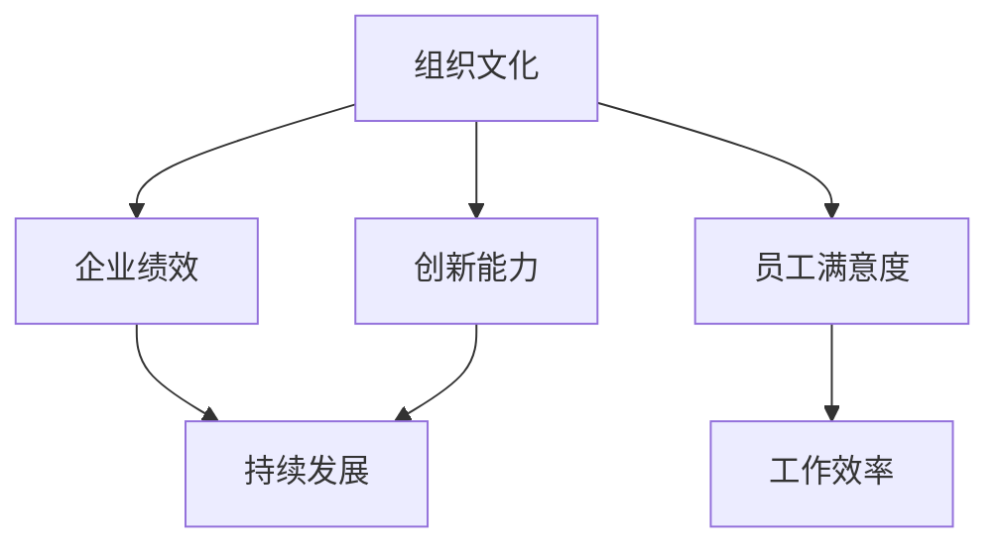

#### 1.2 组织文化的类型与特点

**核心算法原理讲解**：
组织文化可以分为三类：任务型文化、人员型文化和创新型文化。每种文化都有其独特的特点，适用于不同的企业类型和阶段。

**数学模型和公式**：

$$
\text{任务型文化} = \text{强调效率和结果}
$$

$$
\text{人员型文化} = \text{重视人际关系和员工成长}
$$

$$
\text{创新型文化} = \text{鼓励创新和冒险}
$$

**详细讲解与举例说明**：
例如，Google 以其创新型文化著称，鼓励员工自由探索和尝试新的想法，这使得 Google 在技术创新方面取得了巨大成功。

#### 1.3 组织文化与员工行为的关系

**核心算法原理讲解**：
组织文化影响着员工的行为和态度。一个鼓励创新和容忍失败的组织文化能够激发员工的积极性和创造力，提高工作效率和满意度。

**数学模型和公式**：

$$
\text{组织文化} \rightarrow \text{员工行为} \rightarrow \text{企业绩效}
$$

**详细讲解与举例说明**：
例如，苹果公司以其严谨的工程师文化著称，这种文化激励着员工追求卓越和完美，从而推动了公司的技术创新和产品的高质量。

### 第2章：构建鼓励创新的组织文化

#### 2.1 创新的定义与类型

**核心概念与联系**：
创新是指通过新的想法、方法或技术，实现产品、服务或业务模式的改进或创新。创新可以分为技术创新、业务创新和商业模式创新等类型。

**Mermaid 流程图**：

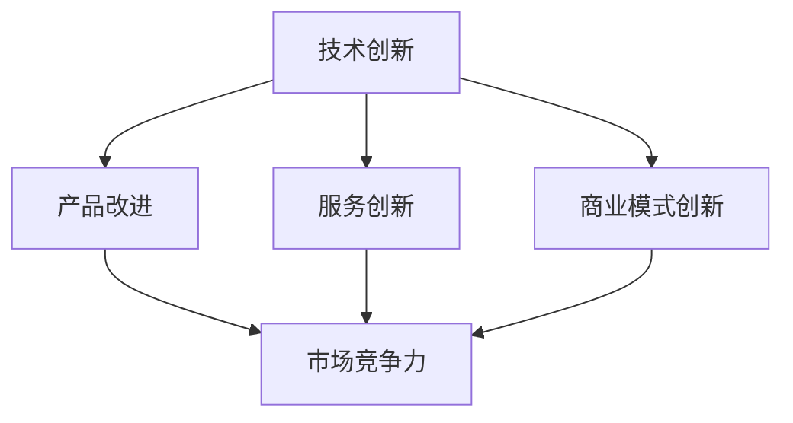

#### 2.2 创新文化的重要性

**核心算法原理讲解**：
创新文化是一个组织持续发展的重要驱动力。它能够激发员工的创新潜能，提高组织的竞争力和适应能力。

**数学模型和公式**：

$$
\text{创新文化} \rightarrow \text{创新能力} \rightarrow \text{企业绩效}
$$

**详细讲解与举例说明**：
例如，3M 公司以其创新文化著称，鼓励员工自由探索和尝试新的想法，这使得 3M 在技术创新方面取得了显著成就。

#### 2.3 建立创新文化的策略

**核心算法原理讲解**：
建立创新文化的策略包括：领导力支持、资源投入、激励机制和跨部门合作等。

**详细讲解与举例说明**：
例如，华为公司通过领导力支持、资源投入和跨部门合作等措施，成功构建了其创新文化，从而推动了公司的快速发展。

### 第3章：容忍失败的组织文化

#### 3.1 失败的价值与意义

**核心概念与联系**：
失败是创新过程中不可避免的一部分。失败能够为组织提供宝贵的经验和教训，有助于提高组织的适应能力和创新能力。

**Mermaid 流程图**：

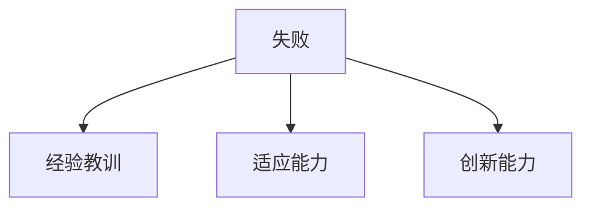

#### 3.2 失败容忍度的衡量标准

**核心算法原理讲解**：
失败容忍度可以通过以下标准来衡量：失败次数、失败率、失败成本和失败后的恢复速度等。

**数学模型和公式**：

$$
\text{失败容忍度} = \frac{\text{成功次数}}{\text{失败次数}} \times 100\%
$$

**详细讲解与举例说明**：
例如，Netflix 以其高容忍失败的文化著称，允许员工在创新过程中尝试多次失败，从而推动了公司的创新和快速发展。

#### 3.3 建立容忍失败的组织文化的策略

**核心算法原理讲解**：
建立容忍失败的组织文化的策略包括：领导力支持、激励机制、失败后的反思和跨部门合作等。

**详细讲解与举例说明**：
例如，谷歌公司通过领导力支持、激励机制和跨部门合作等措施，成功构建了其容忍失败的文化，从而推动了公司的创新和快速发展。

### 第4章：领导力在构建创新文化中的作用

#### 4.1 领导力与创新文化的关系

**核心概念与联系**：
领导力是构建创新文化的重要驱动力。领导者的行为和决策影响着组织的创新氛围和创新绩效。

**Mermaid 流程图**：

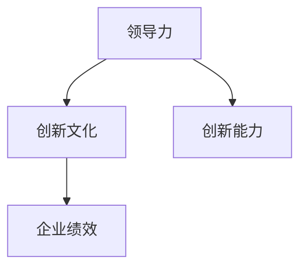

#### 4.2 鼓励创新的领导行为

**核心算法原理讲解**：
鼓励创新的领导行为包括：提供资源支持、营造创新氛围、激励创新团队和鼓励失败等。

**详细讲解与举例说明**：
例如，苹果公司创始人史蒂夫·乔布斯以其卓越的领导力，成功推动了苹果公司的创新和发展。

#### 4.3 领导者在容忍失败中的角色

**核心算法原理讲解**：
领导者在容忍失败中的角色包括：为员工提供支持、鼓励失败后的反思和提供恢复机会等。

**详细讲解与举例说明**：
例如，亚马逊公司创始人杰夫·贝佐斯以其高容忍失败的文化，激励员工在创新过程中勇于尝试和失败，从而推动了公司的快速发展。

## 第二部分：创新机制的构建与实践

### 第5章：创新机制的设计与实施

#### 5.1 创新机制的概述

**核心概念与联系**：
创新机制是指组织为了实现创新目标而建立的一套制度和流程。它包括创新目标的确定、创新资源的配置、创新项目的管理和创新成果的评估等环节。

**Mermaid 流�程图**：

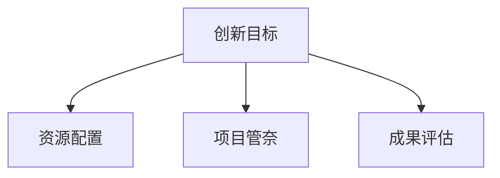

#### 5.2 创新机制的构成要素

**核心算法原理讲解**：
创新机制的构成要素包括：创新目标、创新团队、创新资源、创新流程和创新评估等。

**数学模型和公式**：

$$
\text{创新机制} = \text{创新目标} + \text{创新团队} + \text{创新资源} + \text{创新流程} + \text{创新评估}
$$

**详细讲解与举例说明**：
例如，华为公司的创新机制包括明确创新目标、建立创新团队、配置创新资源、制定创新流程和进行创新评估等环节。

#### 5.3 创新机制的设计原则

**核心算法原理讲解**：
创新机制的设计原则包括：目标导向、资源保障、流程优化和评估科学等。

**数学模型和公式**：

$$
\text{创新机制设计原则} = \text{目标导向} + \text{资源保障} + \text{流程优化} + \text{评估科学}
$$

**详细讲解与举例说明**：
例如，微软公司的创新机制设计原则包括明确创新目标、提供充足资源支持、优化创新流程和科学评估创新成果等。

### 第6章：创新项目的管理与评估

#### 6.1 创新项目的管理流程

**核心概念与联系**：
创新项目管理流程包括项目立项、项目规划、项目执行、项目监控和项目收尾等环节。

**Mermaid 流程图**：

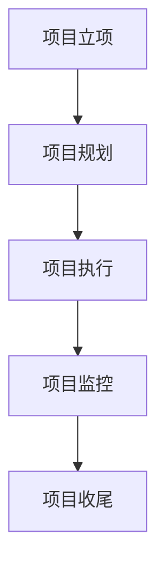

#### 6.2 创新项目的评估方法

**核心算法原理讲解**：
创新项目评估方法包括定量评估和定性评估两种。定量评估主要关注项目的经济效益、技术水平和市场前景等；定性评估主要关注项目的创新性、可行性和影响力等。

**数学模型和公式**：

$$
\text{创新项目评估} = \text{定量评估} + \text{定性评估}
$$

**详细讲解与举例说明**：
例如，英特尔公司的创新项目评估方法包括定量评估和定性评估两种，通过综合评估来判断项目的投资价值和潜力。

#### 6.3 创新项目成功的因素分析

**核心算法原理讲解**：
创新项目成功的因素包括：项目团队的能力、创新资源的支持、项目的市场前景、项目的管理和领导力等。

**数学模型和公式**：

$$
\text{创新项目成功} = \text{团队能力} + \text{资源支持} + \text{市场前景} + \text{项目管理} + \text{领导力}
$$

**详细讲解与举例说明**：
例如，特斯拉公司的创新项目成功主要得益于其强大的团队能力、充足的资源支持、良好的市场前景和卓越的领导力。

### 第7章：创新团队的建设与培养

#### 7.1 创新团队的特点与需求

**核心概念与联系**：
创新团队具有跨学科、多元化、协作性强和持续学习等特点。创新团队的需求包括：充足的资源支持、明确的创新目标和良好的团队氛围等。

**Mermaid 流程图**：

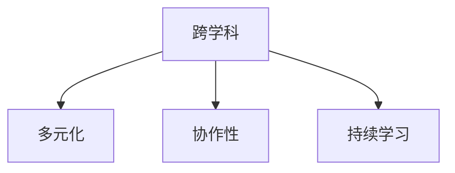

#### 7.2 创新团队的构建策略

**核心算法原理讲解**：
创新团队的构建策略包括：选拔优秀人才、建立有效的沟通机制、提供培训和支持等。

**数学模型和公式**：

$$
\text{创新团队构建策略} = \text{选拔人才} + \text{沟通机制} + \text{培训支持}
$$

**详细讲解与举例说明**：
例如，谷歌公司的创新团队构建策略包括选拔优秀人才、建立高效的沟通机制和提供多样化的培训支持等。

#### 7.3 创新团队的培养与发展

**核心算法原理讲解**：
创新团队的培养与发展包括：持续学习、经验积累、团队协作和创新能力提升等。

**数学模型和公式**：

$$
\text{创新团队培养与发展} = \text{持续学习} + \text{经验积累} + \text{团队协作} + \text{创新能力提升}
$$

**详细讲解与举例说明**：
例如，微软公司的创新团队培养与发展策略包括持续学习、经验积累、团队协作和创新能力提升等，从而推动了公司的创新和发展。

### 第8章：创新与风险管理的平衡

#### 8.1 风险管理的定义与类型

**核心概念与联系**：
风险管理是指组织在面临不确定性时，通过识别、评估和应对潜在风险，以降低风险影响和损失的过程。风险管理可以分为风险预防、风险规避、风险转移和风险接受等类型。

**Mermaid 流程图**：

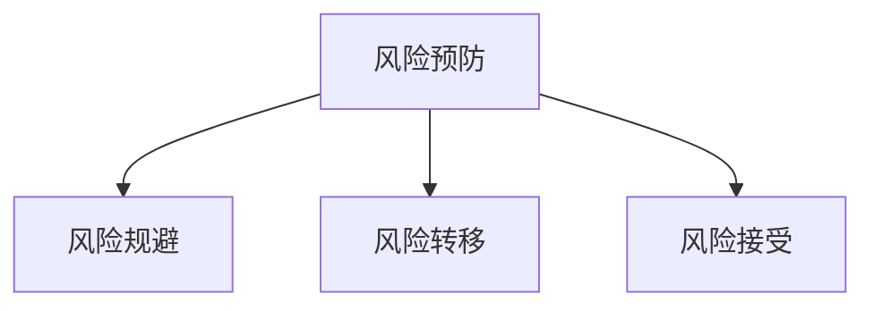

#### 8.2 创新中的风险管理策略

**核心算法原理讲解**：
创新中的风险管理策略包括：风险识别、风险评估、风险应对和风险监控等。

**数学模型和公式**：

$$
\text{创新风险管理} = \text{风险识别} + \text{风险评估} + \text{风险应对} + \text{风险监控}
$$

**详细讲解与举例说明**：
例如，阿里巴巴公司的创新风险管理策略包括风险识别、风险评估、风险应对和风险监控等，从而确保了公司的创新和发展。

#### 8.3 风险管理与创新文化的融合

**核心算法原理讲解**：
风险管理与创新文化的融合要求组织在鼓励创新的同时，也要注重风险管理，确保创新过程中的风险在可接受的范围内。

**数学模型和公式**：

$$
\text{风险管理与创新文化} = \text{鼓励创新} + \text{风险管理}
$$

**详细讲解与举例说明**：
例如，苹果公司的风险管理与创新文化融合策略包括在鼓励创新的同时，建立完善的风险管理机制，确保创新过程中的风险可控。

### 第9章：创新案例分析与启示

#### 9.1 国内外知名创新企业的案例分析

**核心概念与联系**：
国内外知名创新企业如谷歌、亚马逊、苹果和华为等，在创新实践中积累了丰富的经验，为其他企业提供了宝贵的借鉴。

**Mermaid 流程图**：

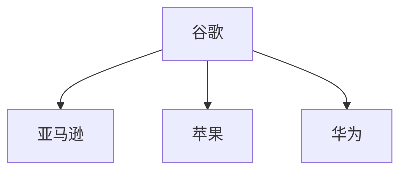

#### 9.2 创新案例的共同特点与启示

**核心算法原理讲解**：
创新案例的共同特点包括：领导力支持、资源投入、激励机制、跨部门合作和风险管理等。这些特点为其他企业提供了以下启示：

1. 建立明确的创新目标和战略；
2. 提供充足的资源支持；
3. 建立有效的激励机制；
4. 促进跨部门合作；
5. 注重风险管理。

**详细讲解与举例说明**：
例如，谷歌公司的创新案例启示其他企业要重视领导力支持、资源投入和激励机制等关键因素，从而实现持续创新。

#### 9.3 创新实践中的挑战与应对策略

**核心算法原理讲解**：
创新实践中的挑战包括：技术风险、市场风险、资源限制和团队协作等。应对策略包括：加强技术研发、拓展市场渠道、优化资源配置和提升团队协作能力等。

**数学模型和公式**：

$$
\text{应对策略} = \text{加强技术研发} + \text{拓展市场渠道} + \text{优化资源配置} + \text{提升团队协作能力}
$$

**详细讲解与举例说明**：
例如，华为公司在创新实践中，通过加强技术研发、拓展市场渠道和优化资源配置等措施，成功应对了技术创新、市场拓展等方面的挑战。

## 第三部分：组织变革与持续创新

### 第10章：组织变革与创新的关系

#### 10.1 组织变革的定义与类型

**核心概念与联系**：
组织变革是指企业为适应外部环境和内部需求，对组织结构、文化、流程等进行调整和优化的过程。组织变革可以分为战略变革、结构变革和文化变革等类型。

**Mermaid 流程图**：

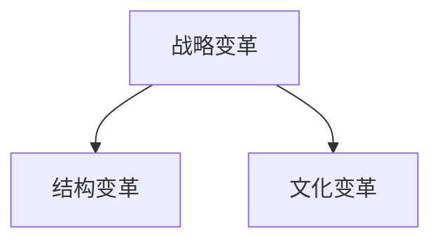

#### 10.2 组织变革与创新的关系

**核心算法原理讲解**：
组织变革与创新之间存在紧密的关系。组织变革可以为创新提供良好的环境和支持，而创新则可以推动组织变革的深入发展。

**数学模型和公式**：

$$
\text{组织变革} \rightarrow \text{创新} \rightarrow \text{组织绩效}
$$

**详细讲解与举例说明**：
例如，诺基亚公司在面对市场竞争压力时，进行了战略变革和创新，从而实现了从传统手机制造商向互联网技术公司的转型。

#### 10.3 创新驱动下的组织变革策略

**核心算法原理讲解**：
创新驱动下的组织变革策略包括：建立创新导向的组织结构、培养创新文化、优化创新流程和提升创新能力等。

**数学模型和公式**：

$$
\text{创新驱动下的组织变革策略} = \text{建立创新导向的组织结构} + \text{培养创新文化} + \text{优化创新流程} + \text{提升创新能力}
$$

**详细讲解与举例说明**：
例如，苹果公司通过建立创新导向的组织结构、培养创新文化和优化创新流程等措施，成功推动了公司持续创新和快速发展。

### 第11章：持续创新的机制与保障

#### 11.1 持续创新的概念与意义

**核心概念与联系**：
持续创新是指企业在长期发展过程中，不断引入新的想法、方法和技术，以保持竞争优势和持续发展的过程。持续创新对于企业的发展具有重要意义。

**Mermaid 流程图**：

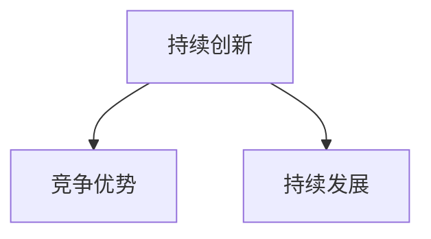

#### 11.2 持续创新的基本原则

**核心算法原理讲解**：
持续创新的基本原则包括：以客户需求为导向、鼓励全员参与、重视知识产权和持续投入等。

**数学模型和公式**：

$$
\text{持续创新的基本原则} = \text{以客户需求为导向} + \text{鼓励全员参与} + \text{重视知识产权} + \text{持续投入}
$$

**详细讲解与举例说明**：
例如，3M 公司通过鼓励全员参与和持续投入等措施，成功实现了持续创新。

#### 11.3 持续创新的组织保障机制

**核心算法原理讲解**：
持续创新的组织保障机制包括：建立创新团队、提供资源支持、建立激励机制和优化创新流程等。

**数学模型和公式**：

$$
\text{持续创新的组织保障机制} = \text{建立创新团队} + \text{提供资源支持} + \text{建立激励机制} + \text{优化创新流程}
$$

**详细讲解与举例说明**：
例如，华为公司通过建立创新团队、提供资源支持和建立激励机制等措施，成功保障了持续创新。

### 第12章：创新人才的引进与培养

#### 12.1 创新人才的重要性

**核心概念与联系**：
创新人才是企业发展的重要驱动力。创新人才具备创新思维、专业技能和团队合作能力，能够推动企业的技术创新和业务发展。

**Mermaid 流程图**：

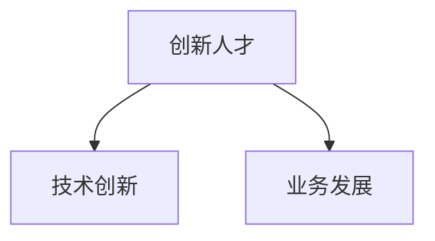

#### 12.2 创新人才的引进策略

**核心算法原理讲解**：
创新人才的引进策略包括：吸引高层次人才、培养本土人才和引进海外人才等。

**数学模型和公式**：

$$
\text{创新人才的引进策略} = \text{吸引高层次人才} + \text{培养本土人才} + \text{引进海外人才}
$$

**详细讲解与举例说明**：
例如，腾讯公司通过吸引高层次人才、培养本土人才和引进海外人才等措施，成功引进了一大批创新人才。

#### 12.3 创新人才的培养与发展

**核心算法原理讲解**：
创新人才的培养与发展包括：提供培训机会、搭建创新平台、鼓励跨学科合作和激励创新成果等。

**数学模型和公式**：

$$
\text{创新人才的培养与发展} = \text{提供培训机会} + \text{搭建创新平台} + \text{鼓励跨学科合作} + \text{激励创新成果}
$$

**详细讲解与举例说明**：
例如，阿里巴巴公司通过提供培训机会、搭建创新平台和鼓励跨学科合作等措施，成功培养了一大批创新人才。

### 第13章：未来组织的创新趋势与展望

#### 13.1 未来组织的创新趋势分析

**核心概念与联系**：
未来组织的创新趋势包括：数字化、智能化、绿色化和全球化等。这些趋势将深刻影响企业的创新方向和发展模式。

**Mermaid 流程图**：

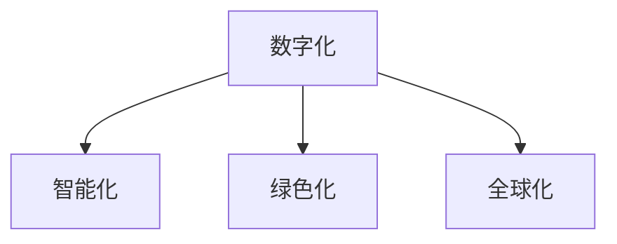

#### 13.2 创新对组织发展的长期影响

**核心算法原理讲解**：
创新对组织发展的长期影响包括：提升竞争力、增强适应能力和实现可持续发展等。

**数学模型和公式**：

$$
\text{创新对组织发展的长期影响} = \text{提升竞争力} + \text{增强适应能力} + \text{实现可持续发展}
$$

**详细讲解与举例说明**：
例如，华为公司通过持续创新，不断提升竞争力、增强适应能力和实现可持续发展，从而在全球范围内取得了卓越的成就。

#### 13.3 创新的未来展望与挑战

**核心算法原理讲解**：
创新的未来展望与挑战包括：技术变革、市场需求和环境变化等。企业需要密切关注这些变化，积极应对挑战，抓住创新机遇。

**数学模型和公式**：

$$
\text{创新的未来展望与挑战} = \text{技术变革} + \text{市场需求} + \text{环境变化}
$$

**详细讲解与举例说明**：
例如，面对人工智能、大数据和物联网等新兴技术的快速发展，企业需要积极创新，以应对市场和环境变化，实现持续发展。

## 附录

### 附录A：创新管理工具与方法

#### A.1 SWOT分析

**核心概念与联系**：
SWOT 分析是一种常用的创新管理工具，用于分析企业的优势、劣势、机会和威胁。

**数学模型和公式**：

$$
\text{SWOT 分析} = \text{优势} + \text{劣势} + \text{机会} + \text{威胁}
$$

**详细讲解与举例说明**：
例如，企业可以通过 SWOT 分析来识别自身的优势，制定针对性的创新策略，抓住市场机遇，应对挑战。

#### A.2 市场机会分析

**核心概念与联系**：
市场机会分析是一种用于识别和评估潜在市场机会的创新管理方法。

**数学模型和公式**：

$$
\text{市场机会分析} = \text{市场需求} + \text{技术趋势} + \text{竞争环境}
$$

**详细讲解与举例说明**：
例如，企业可以通过市场机会分析来识别市场需求、把握技术趋势和了解竞争环境，从而制定有效的创新策略。

#### A.3 创新思维训练

**核心概念与联系**：
创新思维训练是一种提高员工创新能力和创新意识的方法。

**数学模型和公式**：

$$
\text{创新思维训练} = \text{思维拓展} + \text{思维创新} + \text{实践应用}
$$

**详细讲解与举例说明**：
例如，企业可以通过创新思维训练来拓展员工的思维、激发创新思维和实践应用，从而提高整个组织的创新能力。

### 附录B：创新项目实战案例

#### B.1 项目背景与目标

**核心概念与联系**：
创新项目实战案例是指企业在实际运营中进行的创新项目，用于验证创新策略和方法的可行性。

**数学模型和公式**：

$$
\text{创新项目实战案例} = \text{项目背景} + \text{项目目标} + \text{项目成果}
$$

**详细讲解与举例说明**：
例如，企业可以通过创新项目实战案例来验证自身的创新策略和方法的可行性，从而为未来的创新提供参考。

#### B.2 项目实施过程

**核心概念与联系**：
项目实施过程是指创新项目从启动到完成的全过程，包括项目立项、项目规划、项目执行、项目监控和项目收尾等环节。

**数学模型和公式**：

$$
\text{项目实施过程} = \text{项目立项} + \text{项目规划} + \text{项目执行} + \text{项目监控} + \text{项目收尾}
$$

**详细讲解与举例说明**：
例如，企业可以通过详细的项目实施过程来确保创新项目的顺利进行，从而提高项目成功率。

#### B.3 项目成果与经验总结

**核心概念与联系**：
项目成果与经验总结是指创新项目完成后，对项目成果和经验进行总结和反思的过程。

**数学模型和公式**：

$$
\text{项目成果与经验总结} = \text{项目成果} + \text{经验教训} + \text{改进措施}
$$

**详细讲解与举例说明**：
例如，企业可以通过项目成果与经验总结来识别项目的成功经验和教训，为未来的创新提供有益的参考。

### 附录C：创新相关资源推荐

#### C.1 创新管理书籍推荐

**核心概念与联系**：
创新管理书籍是学习创新管理理论和实践的重要资源。

**数学模型和公式**：

$$
\text{创新管理书籍推荐} = \text{经典著作} + \text{实战案例} + \text{最新研究成果}
$$

**详细讲解与举例说明**：
例如，企业可以通过阅读创新管理书籍来了解创新管理的理论和方法，借鉴实战案例，提高自身的创新能力。

#### C.2 创新管理课程推荐

**核心概念与联系**：
创新管理课程是学习创新管理知识和技能的重要途径。

**数学模型和公式**：

$$
\text{创新管理课程推荐} = \text{理论课程} + \text{实战课程} + \text{培训课程}
$$

**详细讲解与举例说明**：
例如，企业可以通过参加创新管理课程来系统地学习创新管理的知识和技能，提高创新管理能力。

#### C.3 创新管理工具推荐

**核心概念与联系**：
创新管理工具是支持创新管理实践的重要工具。

**数学模型和公式**：

$$
\text{创新管理工具推荐} = \text{创新思维工具} + \text{项目管理工具} + \text{数据分析工具}
$$

**详细讲解与举例说明**：
例如，企业可以通过使用创新管理工具来提高创新管理的效率和质量，推动创新实践的发展。

## 作者信息

**作者：AI天才研究院/AI Genius Institute & 禅与计算机程序设计艺术 /Zen And The Art of Computer Programming**

本文由AI天才研究院和《禅与计算机程序设计艺术》作者共同撰写，旨在为广大读者提供关于构建创新型组织的全面指导和思考。希望本文对您的创新实践有所帮助。

----------------------------------------------------------------

## 总结与展望

在本文中，我们系统地探讨了如何打造一个创新型组织，强调鼓励冒险和容忍失败的重要性。通过分析组织的文化与价值观、创新机制的构建与实践、风险管理的平衡以及组织变革与持续创新的关系，我们为读者提供了一套系统化、可操作的指导方案。

**总结：**

1. **组织文化**：鼓励创新和容忍失败的组织文化是创新型组织的基础。
2. **创新机制**：设计合理的创新机制能够提高创新项目的成功率。
3. **风险管理**：在创新过程中，合理管理和控制风险是确保创新持续发展的关键。
4. **领导力**：领导者在构建创新文化和推动创新过程中发挥着重要作用。
5. **持续创新**：组织变革和持续创新是推动企业发展的动力。

**展望：**

1. **未来趋势**：随着技术变革和市场需求的变化，企业需要不断调整创新策略，以适应新的发展环境。
2. **人才培养**：创新人才是推动企业创新的重要力量，企业需要注重人才的引进和培养。
3. **跨界合作**：跨界合作将成为未来创新的重要形式，企业需要积极寻求与不同领域的合作伙伴。
4. **国际化**：全球化背景下的创新，企业需要具备国际视野和跨文化沟通能力。

**结语：**

本文旨在为广大读者提供关于构建创新型组织的思考和指导。希望本文能够对您的创新实践有所帮助，助力您的组织实现持续创新和快速发展。

**作者信息：**

作者：AI天才研究院/AI Genius Institute & 禅与计算机程序设计艺术 /Zen And The Art of Computer Programming

AI天才研究院致力于推动人工智能技术的发展和应用，探索人工智能与人类智慧的融合。同时，《禅与计算机程序设计艺术》作者以其深刻的洞察力和独特的视角，为读者提供了关于计算机编程和人工智能领域的深入思考和启示。希望本文能够为广大读者带来启发和帮助。

