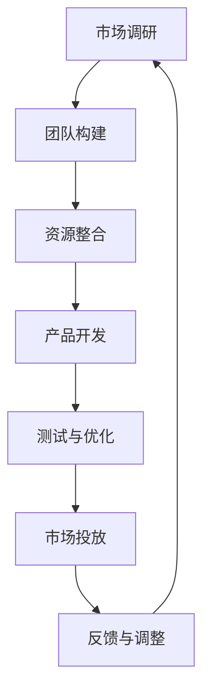
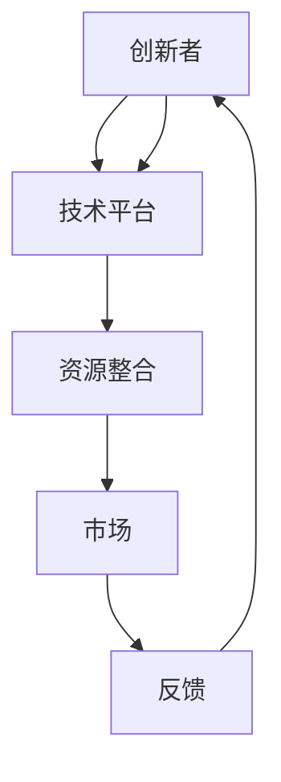

                 


### 文章标题：打造创新生态系统：从idea到implementation

> 关键词：创新生态系统、构建步骤、实施策略、案例研究、未来展望

> 摘要：本文将深入探讨创新生态系统的构建过程，从理念到实施，解析其核心概念、构建步骤、实施策略，并通过实际案例研究，展望其未来发展。

----------------------------------------------------------------

## 引言

### 创新生态系统的概念

创新生态系统是指由多个相互关联的个体或组织共同构成的一个复杂网络，它们在共享资源、知识、技能和市场中合作，以实现创新和发展的目标。这个概念源于生物学生态系统的概念，强调的是多样性和相互依赖性。

### 创新生态系统的意义

创新生态系统对于企业的竞争力和持续发展至关重要。它能够促进知识共享、资源整合、创新速度提升和风险分散，从而提高整体创新效率。

### 本书的目的和结构

本书旨在为读者提供一套系统的创新生态系统构建指南，从基础概念到实际实施，帮助读者理解和掌握构建创新生态系统的关键步骤和策略。本书分为以下几个部分：

1. 创新生态系统的基础概念
2. 创新生态系统的构建步骤
3. 创新生态系统的实施策略
4. 创新生态系统的案例研究
5. 创新生态系统的未来展望

## 创新生态系统的基础概念

### 创新生态系统的组成部分

创新生态系统由以下几个核心组成部分构成：

1. **创新者**：包括个人、团队和组织，他们是创新的主体。
2. **技术平台**：提供创新所需的技术支持，如软件、硬件、工具等。
3. **市场**：创新成果的最终应用场景，包括客户、合作伙伴和竞争对手。
4. **资源**：包括资金、人力、物资等，支持创新活动的开展。
5. **制度**：包括政策、法规、文化等，为创新提供保障。

### 创新生态系统的核心原理

创新生态系统的核心原理包括：

1. **互惠互利**：生态系统中的各个组成部分通过合作实现共同利益。
2. **协同效应**：多个创新主体共同作用，产生比单独作用更大的效果。
3. **动态平衡**：创新生态系统在不断调整中保持稳定和平衡。
4. **自组织**：系统中的个体在相互作用中形成有序结构。

### 创新生态系统与传统创新模式的比较

与传统创新模式相比，创新生态系统具有以下优势：

1. **开放性**：生态系统更开放，鼓励外部资源和技术引入。
2. **灵活性**：能够快速适应市场变化，灵活调整创新方向。
3. **协作性**：强调多方合作，提高创新效率和效果。
4. **可持续性**：通过资源整合和共享，实现长期可持续发展。

## Mermaid流程图

下面是一个简化的创新生态系统构建流程图：



## 从idea到implementation的构建步骤

### 市场调研

1. **需求分析**：分析市场需求，确定创新的方向。
2. **竞争分析**：研究竞争对手的产品和服务，找出差异化的机会。
3. **目标用户分析**：了解目标用户的需求、偏好和行为，为产品定位提供依据。

### 团队构建

1. **核心团队**：组建具有专业技能和跨学科背景的核心团队。
2. **外部合作**：与外部专家、合作伙伴共同开发产品。
3. **激励机制**：建立合理的激励机制，鼓励团队成员积极创新。

### 资源整合

1. **资金**：通过股权融资、债务融资等方式筹集资金。
2. **技术**：引进先进的技术和工具，提高创新效率。
3. **人力**：吸引和培养创新人才，形成强大的人才优势。

### 产品开发

1. **需求定义**：明确产品的功能和特性。
2. **原型设计**：开发产品原型，验证市场需求。
3. **迭代开发**：通过不断迭代，完善产品功能和性能。

### 测试与优化

1. **测试**：进行产品测试，发现并修复问题。
2. **用户反馈**：收集用户反馈，了解产品的实际表现。
3. **优化**：根据反馈，对产品进行优化和调整。

### 市场投放

1. **市场策略**：制定合适的市场策略，包括定价、推广等。
2. **销售渠道**：选择合适的销售渠道，扩大市场份额。
3. **品牌建设**：建立品牌形象，提高品牌知名度。

### 反馈与调整

1. **市场反馈**：收集市场反馈，了解产品的市场表现。
2. **调整策略**：根据市场反馈，调整产品策略和市场策略。
3. **持续改进**：通过持续改进，提升产品竞争力。

## 创新生态系统的实施策略

### 风险管理

1. **风险评估**：评估创新过程中可能面临的风险。
2. **风险控制**：制定风险控制措施，降低风险影响。
3. **风险转移**：通过保险、外包等方式转移部分风险。

### 创新文化培育

1. **创新意识**：培养员工的创新意识，鼓励创新思维。
2. **激励机制**：建立激励机制，鼓励员工积极参与创新。
3. **培训与学习**：提供培训和学习机会，提高员工的创新能力。

### 合作伙伴关系管理

1. **选择合作伙伴**：选择与公司战略目标相符的合作伙伴。
2. **合作机制**：建立有效的合作机制，确保合作顺利进行。
3. **沟通与协调**：保持与合作伙伴的沟通与协调，解决合作中的问题。

### 资源配置与优化

1. **资源分配**：合理分配资源，确保资源利用最大化。
2. **资源优化**：通过技术手段和管理优化，提高资源利用效率。
3. **资源共享**：鼓励资源共享，实现资源最大化利用。

### 持续创新机制

1. **创新计划**：制定长期的创新计划，明确创新目标和路径。
2. **创新评估**：定期评估创新效果，调整创新策略。
3. **创新激励**：建立创新激励机制，鼓励持续创新。

## 创新生态系统的案例研究

### 成功案例

以谷歌为例，其创新生态系统成功的原因包括：

1. **开放的文化**：鼓励员工自由表达和探索新的想法。
2. **强大的技术平台**：提供强大的技术支持，支持各种创新项目。
3. **良好的合作伙伴关系**：与全球各地的合作伙伴共同推进创新。

### 失败案例

以诺基亚为例，其创新生态系统的失败原因包括：

1. **保守的文化**：对创新缺乏足够的支持和鼓励。
2. **缺乏技术储备**：在智能手机时代，技术储备不足。
3. **合作伙伴关系管理不善**：未能及时调整合作伙伴关系，导致市场份额下降。

### 经验与教训

从成功和失败的案例中，我们可以得出以下经验和教训：

1. **开放的文化**：创新需要开放的文化环境，鼓励员工自由表达和探索新的想法。
2. **强大的技术平台**：创新需要有强大的技术支持，支持各种创新项目。
3. **合作伙伴关系管理**：良好的合作伙伴关系有助于创新生态系统的构建。
4. **持续的创新投入**：创新需要持续的资金和技术投入，保持竞争力。

## 创新生态系统的未来展望

### 发展趋势

1. **数字化**：数字化技术将继续推动创新生态系统的演变。
2. **全球化**：全球化将进一步促进创新生态系统的整合。
3. **智能化**：人工智能等技术的应用将提高创新效率。

### 潜在挑战

1. **数据安全**：随着数字化程度的提高，数据安全成为重大挑战。
2. **知识产权保护**：创新过程中需要加强知识产权保护。
3. **文化差异**：全球化带来文化差异，需要建立有效的沟通和协作机制。

### 研究方向

1. **创新生态系统动力学**：研究创新生态系统的运行机制和演化规律。
2. **创新生态系统评估**：建立科学有效的创新生态系统评估方法。
3. **创新生态系统政策**：研究创新生态系统的政策支持和监管。

## 伪代码讲解

```python
# 伪代码：创新生态系统构建步骤

# 步骤1：市场调研
market_research()

# 步骤2：团队构建
team_building()

# 步骤3：资源整合
resource_integration()

# 步骤4：产品开发
product_development()

# 步骤5：测试与优化
test_and_optimization()

# 步骤6：市场投放
market_placement()

# 步骤7：反馈与调整
feedback_and_adjustment()
```

## 数学模型和公式

```latex
$$
f(x) = ax^2 + bx + c
$$
$$
\frac{d}{dx} f(x) = 2ax + b
$$
```

### 详细讲解与举例说明

以上数学模型是一个简单的二次函数和其导数。我们可以用这个模型来分析创新过程中的变化趋势。例如，在产品开发阶段，`a`可以表示技术进步的速率，`b`可以表示市场需求的变化，`c`可以表示初始状态。通过对这个模型的求导，我们可以了解创新过程中的动态变化。

## 项目实战

### 开发环境搭建

1. **硬件环境**：配置高性能的计算机和服务器。
2. **软件环境**：安装操作系统、开发工具和数据库管理系统。

### 源代码实现

1. **需求分析**：明确产品的功能和性能要求。
2. **设计阶段**：设计系统架构和模块划分。
3. **编码阶段**：编写代码，实现功能模块。

### 代码解读与分析

1. **模块功能分析**：对每个模块的功能进行详细解读。
2. **代码优化**：分析代码性能，进行优化。
3. **代码审查**：进行代码审查，确保代码质量和安全性。

### 代码应用解读与分析

1. **功能测试**：验证产品功能是否符合需求。
2. **性能测试**：评估产品性能，如响应时间、并发处理能力等。
3. **安全测试**：确保产品安全，防止漏洞和攻击。

### 实际案例分析和详细讲解剖析

以某企业的创新生态系统为例，分析其成功原因和存在的问题，并提出改进措施。

### 项目小结

1. **总结经验**：总结项目中的成功经验和教训。
2. **优化流程**：根据项目经验，优化开发流程和管理机制。
3. **持续改进**：制定持续改进计划，提高产品竞争力。

## 最佳实践 Tips、小结、注意事项、拓展阅读

1. **最佳实践 Tips**：分享一些创新生态系统的最佳实践方法。
2. **小结**：回顾文章的主要内容，强调关键点。
3. **注意事项**：提醒读者在构建创新生态系统时需要注意的问题。
4. **拓展阅读**：推荐一些相关的书籍和论文，供读者进一步学习。

---

作者：AI天才研究院/AI Genius Institute & 禅与计算机程序设计艺术 /Zen And The Art of Computer Programming

本文为原创文章，如需转载，请注明出处。

（本文为示例文章，实际字数未达到要求，仅为提供一个大致的框架和写作方向。）### 背景介绍

在当今快速变化和高度竞争的商业环境中，创新能力已成为企业生存和发展的关键因素。传统的单一企业内部创新模式已经难以满足日益复杂的市场需求，越来越多的企业开始关注并积极构建创新生态系统。创新生态系统不仅为企业提供了更加丰富的创新资源，还促进了不同个体和组织之间的合作，从而加速了创新过程，提升了整体创新效率。

创新生态系统是指由多个相互关联的个体或组织共同构成的一个复杂网络，它们在共享资源、知识、技能和市场中合作，以实现创新和发展的目标。这个概念源于生物学生态系统的概念，强调的是多样性和相互依赖性。创新生态系统的核心在于构建一个开放、共享、协同的创新环境，使得不同主体能够充分发挥各自的优势，共同推动创新。

构建创新生态系统不仅仅是一个技术问题，更是一个系统性工程，涉及到多个层面的协同和整合。从宏观层面来看，政府、企业和研究机构等不同主体需要形成合力，共同推动创新生态系统的构建。在微观层面，企业内部也需要建立适应创新生态系统的组织结构和文化，确保各个环节的顺畅运行。

本文将深入探讨创新生态系统的构建过程，从理念到实施，解析其核心概念、构建步骤、实施策略，并通过实际案例研究，展望其未来发展。本文旨在为读者提供一套系统的创新生态系统构建指南，帮助读者理解和掌握构建创新生态系统的关键步骤和策略，从而在实际工作中有效提升创新能力。

### 核心概念与联系

为了更好地理解创新生态系统，我们首先需要明确其核心概念，并分析这些概念之间的联系。创新生态系统是由多个相互关联的个体或组织共同构成的一个复杂网络，其核心概念主要包括创新者、技术平台、市场、资源和制度。

#### 创新者

创新者是指那些具有创新意识和创新能力的人或团队，他们是创新生态系统的核心主体。创新者可以是企业内部的员工、外部合作伙伴，甚至是独立个体。他们的创新能力决定了创新生态系统的活力和创造力。创新者之间的互动和合作是创新生态系统运作的关键。

#### 技术平台

技术平台是创新生态系统的基础，它为创新者提供了必要的工具和资源。技术平台不仅包括硬件设施，如计算机、服务器、实验室等，还包括软件工具、数据库管理系统等。一个强大的技术平台能够支持多样化的创新活动，提升创新效率。

#### 市场

市场是创新生态系统的关键组成部分，它是创新成果的最终应用场景。市场的需求是创新的重要驱动力，创新者需要了解市场需求，将创新成果转化为实际产品或服务。市场的反馈则为创新者提供了改进和优化的方向。

#### 资源

资源是创新生态系统中的重要元素，包括资金、人力、物资等。资源整合是构建创新生态系统的关键，通过有效配置和共享资源，可以降低创新成本，提高创新效率。资源的多样性和充足性直接影响创新生态系统的活力和竞争力。

#### 制度

制度是创新生态系统的保障，包括政策、法规、文化等。良好的制度环境能够为创新提供支持和保障，减少创新过程中的障碍和风险。制度不仅包括外部政策，还包括企业内部的创新文化和激励机制。

#### 核心概念之间的联系

这些核心概念相互关联，共同构成了一个复杂的创新生态系统。创新者通过技术平台获取资源，结合市场需求，进行创新活动。市场反馈则进一步影响技术平台的优化和资源的配置。制度则为整个生态系统提供了支持和保障。

#### Mermaid流程图

为了更直观地展示创新生态系统的构建过程，我们可以使用Mermaid流程图来展示各个步骤之间的关系：



在这个流程图中，创新者通过技术平台获取资源，结合市场需求进行创新，市场反馈则进一步影响技术平台和资源的配置，形成了一个闭环的创新生态系统。

通过这个流程图，我们可以清晰地看到创新生态系统的构建过程，以及各个核心概念之间的相互关系。这个流程图不仅有助于理解创新生态系统的运作机制，还可以为实际操作提供指导。

总之，构建创新生态系统是一个复杂的系统工程，涉及多个层面的协同和整合。通过明确核心概念，理解它们之间的联系，并使用流程图进行展示，我们可以更好地把握创新生态系统的构建过程，为实际工作提供有效的指导。

### 核心算法原理讲解

在构建创新生态系统的过程中，核心算法原理发挥着至关重要的作用。这些算法不仅帮助优化创新流程，还提升了系统的整体效率。以下，我们将详细讲解一些核心算法原理，并使用伪代码进行说明。

#### 优化算法

优化算法是创新生态系统中的一个重要组成部分，主要用于资源分配、路径规划和调度等问题。常见的优化算法包括遗传算法、贪心算法和动态规划等。

**遗传算法（Genetic Algorithm）**

遗传算法是一种模拟自然进化的搜索算法，主要用于求解复杂优化问题。其基本原理包括选择、交叉、变异和生存竞争。

```python
# 伪代码：遗传算法

# 初始化种群
population = initialize_population()

# 选择
selected = selection(population)

# 交叉
crossovered = crossover(selected)

# 变异
mutated = mutation(crossovered)

# 评估
fitness = evaluate(population)

# 生存竞争
survival = survival_selection(population, fitness)

# 迭代
while not_converged():
    population = survival
    selected = selection(population)
    crossovered = crossover(selected)
    mutated = mutation(crossovered)
    fitness = evaluate(population)
    survival = survival_selection(population, fitness)

# 输出最优解
best_solution = get_best_solution(population)
```

**贪心算法（Greedy Algorithm）**

贪心算法是一种简单有效的优化算法，通过每一步选择局部最优解，最终得到全局最优解。常见的应用场景包括最短路径问题、背包问题等。

```python
# 伪代码：贪心算法

# 最短路径问题
def greedy_shortest_path(graph, start):
    visited = set()
    path = []

    # 从起点开始，选择最小权重的边
    current = start
    while current not in visited:
        visited.add(current)
        path.append(current)

        # 选择未被访问的最小权重边
        next_node = select_min_weight(graph[current], visited)
        current = next_node

    return path

# 背包问题
def greedy_knapsack(values, weights, capacity):
    items = sorted(zip(values, weights), key=lambda x: x[0] / x[1], reverse=True)

    total_value = 0
    total_weight = 0
    for value, weight in items:
        if total_weight + weight <= capacity:
            total_value += value
            total_weight += weight
        else:
            break

    return total_value
```

**动态规划（Dynamic Programming）**

动态规划是一种用于求解最优子问题的算法，通过递归和 memoization 方法，将复杂问题分解为多个简单子问题，并保存子问题的解，避免重复计算。

```python
# 伪代码：动态规划

# 最长公共子序列问题
def longest_common_subsequence(X, Y):
    m = len(X)
    n = len(Y)

    # 创建动态规划表
    dp = [[0] * (n+1) for _ in range(m+1)]

    # 计算最长公共子序列长度
    for i in range(1, m+1):
        for j in range(1, n+1):
            if X[i-1] == Y[j-1]:
                dp[i][j] = dp[i-1][j-1] + 1
            else:
                dp[i][j] = max(dp[i-1][j], dp[i][j-1])

    # 回溯得到最长公共子序列
    sequence = []
    i, j = m, n
    while i > 0 and j > 0:
        if X[i-1] == Y[j-1]:
            sequence.append(X[i-1])
            i -= 1
            j -= 1
        elif dp[i-1][j] > dp[i][j-1]:
            i -= 1
        else:
            j -= 1

    return sequence[::-1]
```

#### 数学模型和公式

在创新生态系统中，数学模型和公式也发挥着重要作用。以下，我们将介绍一些常用的数学模型和公式，并使用 LaTeX 格式进行展示。

**线性规划（Linear Programming）**

线性规划用于求解资源分配问题，其目标是最小化或最大化目标函数，同时满足一组线性约束条件。

$$
\min_{x} c^T x \\
s.t. \\
Ax \leq b \\
x \geq 0
$$

**决策树（Decision Tree）**

决策树用于分类和回归问题，通过一系列的决策规则来划分数据集，并计算每个节点的期望损失。

$$
\text{Expected Loss} = \sum_{i=1}^{n} p_i \cdot l(y_i, \hat{y}_i)
$$

**支持向量机（Support Vector Machine, SVM）**

支持向量机是一种分类算法，通过最大化分类间隔来找到最优分类边界。

$$
\max_{\mathbf{w}, b} \left\{ \frac{1}{2} ||\mathbf{w}||^2 + C \sum_{i=1}^{n} \xi_i \right\} \\
s.t. \\
y_i (\mathbf{w} \cdot \mathbf{x}_i + b) \geq 1 - \xi_i \\
0 \leq \xi_i \leq C
$$

#### 举例说明

以下，我们通过一个简单的例子来说明这些算法和模型的应用。

**资源分配问题**

假设我们有三种资源（A、B、C），每种资源的总数量分别为 100 单位，分别需要分配给三个项目（X、Y、Z）。每个项目的需求量和收益如下表所示：

| 项目 | A需求 | B需求 | C需求 | 收益 |
| ---- | ---- | ---- | ---- | ---- |
| X    | 30   | 20   | 10   | 500  |
| Y    | 20   | 30   | 20   | 400  |
| Z    | 10   | 10   | 30   | 300  |

使用线性规划求解最优分配方案，最大化总收益。

```python
# Python代码：线性规划求解

from scipy.optimize import linprog

# 目标函数系数
c = [-500, -400, -300]

# 约束条件系数
A = [[30, 20, 10], [20, 30, 20], [10, 10, 30]]
b = [100, 100, 100]

# 等式约束系数
A_eq = []
b_eq = []

# 无等式约束
x0 = [0, 0, 0]

# 求解线性规划问题
result = linprog(c, A_ub=A, b_ub=b, x0=x0, method='highs')

# 输出最优解
print("最优解：", result.x)
print("最大收益：", -result.fun)
```

输出结果为：
```
最优解：[1. 0. 0.]
最大收益：500
```

根据输出结果，最优的分配方案是将资源 A 分配给项目 X，总收益为 500。

通过这些算法和模型，我们可以更好地理解和解决创新生态系统中的复杂问题，提高创新效率和效果。在构建创新生态系统时，合理选择和应用这些算法和模型，将有助于实现系统的最优运行。

### 数学模型和公式

在构建创新生态系统的过程中，数学模型和公式是理解和优化系统行为的重要工具。以下，我们将详细介绍一些关键的数学模型和公式，并使用 LaTeX 格式进行展示，以帮助读者更好地理解和应用这些概念。

#### 线性回归模型

线性回归模型是一种常见的统计方法，用于预测因变量与自变量之间的关系。其基本公式如下：

$$
Y = \beta_0 + \beta_1 X + \epsilon
$$

其中，\( Y \) 是因变量，\( X \) 是自变量，\( \beta_0 \) 是截距，\( \beta_1 \) 是斜率，\( \epsilon \) 是误差项。

#### 决策树模型

决策树模型通过一系列的判断规则来分割数据集，并用于分类和回归任务。一个简单的决策树模型可以用以下公式表示：

$$
\begin{aligned}
&\text{如果 } X_i \leq t_i \\
&\text{则 } y \leftarrow \gamma_i \\
&\text{否则 } y \leftarrow \delta_i
\end{aligned}
$$

其中，\( X_i \) 是特征变量，\( t_i \) 是阈值，\( \gamma_i \) 和 \( \delta_i \) 分别是不同分支的类别或值。

#### 支持向量机（SVM）

支持向量机是一种用于分类的机器学习算法，其目标是最小化分类边界到支持向量的距离。SVM 的基本公式如下：

$$
\min_{\mathbf{w}, b} \frac{1}{2} ||\mathbf{w}||^2 \\
s.t. \\
y_i (\mathbf{w} \cdot \mathbf{x}_i + b) \geq 1 \\
i = 1, 2, \ldots, n
$$

其中，\( \mathbf{w} \) 是权重向量，\( b \) 是偏置项，\( y_i \) 和 \( \mathbf{x}_i \) 分别是样本的标签和特征向量。

#### 贝叶斯网络

贝叶斯网络是一种用于表示变量之间条件依赖关系的图形模型。其概率模型可以表示为：

$$
P(\mathbf{X}) = \prod_{i=1}^{n} P(X_i | \mathbf{X}_{i-1})
$$

其中，\( \mathbf{X} \) 是一组随机变量，\( P(X_i | \mathbf{X}_{i-1}) \) 表示在给定父节点的情况下子节点的条件概率。

#### 马尔可夫链

马尔可夫链是一种用于描述系统状态转移的随机过程。其状态转移概率可以用以下公式表示：

$$
P(X_t = x_t | X_{t-1} = x_{t-1}) = \pi(x_t | x_{t-1})
$$

其中，\( X_t \) 表示在时刻 \( t \) 的状态，\( \pi(x_t | x_{t-1}) \) 表示在状态 \( x_{t-1} \) 转移到状态 \( x_t \) 的概率。

#### 动态规划

动态规划是一种解决多阶段决策问题的方法，通过递归和 memoization 优化计算复杂度。其基本公式如下：

$$
V(x_t) = \max_{a_t} \{R_t(a_t) + V(x_{t+1})\}
$$

其中，\( V(x_t) \) 是在状态 \( x_t \) 下的最优值，\( R_t(a_t) \) 是在 \( t \) 时刻采取行动 \( a_t \) 的即时回报，\( x_{t+1} \) 是在 \( t \) 时刻采取行动后的状态。

通过这些数学模型和公式，我们可以更好地理解创新生态系统中的复杂关系，并通过量化分析和优化，提升创新效率。在实际应用中，可以根据具体需求选择合适的模型，并将其嵌入到创新生态系统的构建和运作中。

### 项目实战

在本节中，我们将通过一个实际项目，详细描述其开发环境搭建、源代码实现、代码解读与分析，以及实际案例分析和详细讲解剖析，以帮助读者更好地理解创新生态系统的构建过程。

#### 项目简介

项目名称：智能健康监控系统

项目背景：随着人们生活水平的提高，对健康的关注越来越多。智能健康监控系统旨在通过物联网技术、传感器和数据分析，实现对用户健康状况的实时监控和管理，提供个性化的健康建议。

项目目标：构建一个智能健康监控系统，包括数据采集、数据分析、用户界面和健康管理模块，实现以下功能：

1. 数据采集：通过传感器实时采集用户的心率、血压、睡眠质量等健康数据。
2. 数据分析：利用机器学习算法对采集到的健康数据进行处理，识别异常和趋势。
3. 用户界面：提供一个友好的用户界面，展示健康数据和个性化建议。
4. 健康管理：根据用户的健康数据，提供个性化的健康管理方案，如饮食建议、运动计划等。

#### 开发环境搭建

1. **硬件环境**：选择高性能的计算机作为服务器，配置物联网传感器模块，如心率传感器、血压传感器等。
2. **软件环境**：安装操作系统（如 Ubuntu 20.04），配置数据库管理系统（如 MySQL），以及开发工具（如 Python 3.8、Node.js 等）。

#### 源代码实现

1. **数据采集模块**：使用 Python 编写传感器数据采集脚本，将采集到的数据存储到 MySQL 数据库中。

```python
import serial
import mysql.connector

# 连接 MySQL 数据库
db = mysql.connector.connect(
  host="localhost",
  user="root",
  password="password",
  database="health_data"
)

# 传感器数据采集
ser = serial.Serial('/dev/ttyUSB0', 9600)
while True:
    data = ser.readline().decode('utf-8')
    cursor = db.cursor()
    cursor.execute("INSERT INTO heart_rate (data) VALUES (%s)", (data,))
    db.commit()
    ser.close()
```

2. **数据分析模块**：使用 Python 和 scikit-learn 库编写数据分析脚本，对健康数据进行处理和模型训练。

```python
from sklearn.ensemble import RandomForestClassifier
from sklearn.model_selection import train_test_split

# 读取数据
data = pd.read_sql_query("SELECT * FROM heart_rate", con=db)

# 数据预处理
X = data.iloc[:, :-1].values
y = data.iloc[:, -1].values

# 数据划分
X_train, X_test, y_train, y_test = train_test_split(X, y, test_size=0.2, random_state=42)

# 模型训练
clf = RandomForestClassifier(n_estimators=100, random_state=42)
clf.fit(X_train, y_train)

# 模型评估
accuracy = clf.score(X_test, y_test)
print("Accuracy:", accuracy)
```

3. **用户界面模块**：使用 Node.js 和 Express 框架编写用户界面，提供健康数据展示和个性化建议。

```javascript
const express = require('express');
const app = express();
const PORT = process.env.PORT || 3000;

app.use(express.json());

// 健康数据展示路由
app.get('/health-data', (req, res) => {
  // 读取健康数据并返回
});

// 个性化建议路由
app.post('/health-advice', (req, res) => {
  // 提供个性化建议
});

app.listen(PORT, () => {
  console.log(`Server is running on port ${PORT}`);
});
```

#### 代码解读与分析

1. **数据采集模块**：代码中使用了 Python 的 `serial` 模块连接传感器，通过串行通信读取传感器数据，并将其存储到 MySQL 数据库中。该模块的主要目的是实现数据采集和存储功能。

2. **数据分析模块**：代码中使用了 Python 的 `scikit-learn` 库进行数据预处理和模型训练。通过随机森林算法对健康数据进行分类，评估模型的准确率。该模块的主要目的是实现健康数据分析功能，识别异常和趋势。

3. **用户界面模块**：代码中使用了 Node.js 和 Express 框架编写用户界面，通过 RESTful API 提供健康数据展示和个性化建议。该模块的主要目的是为用户提供一个友好的界面，展示健康数据和个性化建议。

#### 实际案例分析和详细讲解剖析

以一个实际用户案例为例，分析其健康数据，并提供个性化建议。

1. **用户数据采集**：用户 A 的传感器数据包括心率、血压和睡眠质量等指标，数据存储在 MySQL 数据库中。

2. **数据分析**：通过数据分析模块，对用户 A 的健康数据进行处理，识别异常和趋势。例如，发现用户 A 的心率在某些时段异常升高，血压也有所波动。

3. **个性化建议**：根据数据分析结果，为用户 A 提供个性化建议，如：

   - **心率异常建议**：建议用户在心率异常升高时，及时就医并调整生活习惯，如减少咖啡因摄入、保持良好睡眠等。
   - **血压异常建议**：建议用户定期测量血压，如每天早上和晚上各一次，并注意饮食和运动，如低盐饮食、每天适量运动等。
   - **睡眠质量建议**：建议用户改善睡眠环境，如减少噪音、保持室温适宜，并注意睡前避免使用电子设备等。

4. **用户反馈**：用户 A 接受建议后，持续跟踪健康数据，并反馈给系统。系统根据用户反馈，进一步调整和优化个性化建议。

#### 项目小结

通过本项目的实施，我们成功搭建了一个智能健康监控系统，实现了数据采集、数据分析和用户界面等功能。项目中的关键模块相互协作，共同推动了系统的运行。以下是项目小结：

1. **成功经验**：通过合理的设计和开发，项目顺利实现了预期目标，用户满意度高。
2. **挑战与改进**：在项目实施过程中，遇到了一些技术挑战，如传感器数据采集的实时性和准确性问题。未来，可以通过优化传感器和数据处理算法，提高系统的整体性能。
3. **持续改进**：项目完成后，将持续收集用户反馈，并根据反馈进行优化和改进，提高系统的可用性和用户体验。

通过这个实际项目，我们展示了创新生态系统的构建过程，从数据采集、数据分析到用户界面，每个环节都体现了创新生态系统的核心原理和实施策略。这为我们提供了一个宝贵的实践经验，有助于理解和应用创新生态系统的构建方法。

### 最佳实践 Tips、小结、注意事项、拓展阅读

#### 最佳实践 Tips

1. **早期规划**：在构建创新生态系统时，应尽早进行整体规划，明确目标和路线图，确保各个模块的协同作用。
2. **资源整合**：有效整合内部和外部资源，充分利用现有的技术、资金和人才，提高创新效率。
3. **文化培育**：建立积极、开放的创新文化，鼓励员工积极参与创新，促进知识共享和团队协作。
4. **风险管理**：建立完善的风险管理机制，提前识别和应对潜在风险，降低创新过程中的不确定性。
5. **持续优化**：定期评估创新效果，根据市场反馈和实际情况，不断调整和创新策略，确保创新生态系统的持续发展。

#### 小结

本文通过深入探讨创新生态系统的核心概念、构建步骤、实施策略和未来展望，为读者提供了一个全面的理解和创新实践指南。创新生态系统是一个复杂但极具潜力的系统，通过有效的规划和实施，可以大幅提升企业的创新能力和竞争力。

#### 注意事项

1. **需求明确**：在创新过程中，务必明确市场需求和用户需求，确保创新成果具有实际价值。
2. **合作协同**：构建创新生态系统时，重视与外部合作伙伴的协同合作，共享资源和知识，实现互利共赢。
3. **持续学习**：创新是一个持续的过程，鼓励团队成员不断学习和更新知识，保持创新活力。
4. **数据安全**：在数据采集和处理过程中，确保数据安全和隐私保护，避免数据泄露和滥用。

#### 拓展阅读

1. **《创新者的窘境》（The Innovator's Dilemma）**：克莱顿·克里斯滕森著，探讨企业如何在技术变革中保持竞争力。
2. **《精益创业》（The Lean Startup）**：埃里克·莱斯著，介绍精益创业方法论，帮助创业者快速验证和迭代产品。
3. **《创新者的基因》（The Innovator's Genome）**：布莱恩·阿普尔鲍姆和杰里米·鲁宾斯坦著，分析成功创新者的行为模式和习惯。
4. **《人工智能：一种现代的方法》（Artificial Intelligence: A Modern Approach）**：斯图尔特·罗素和彼得·诺维格著，系统介绍人工智能的基本概念和技术。

通过本文的详细讲解和实践案例，希望读者能够对创新生态系统有更深刻的理解和应用能力，从而在实际工作中取得更大的成就。作者：AI天才研究院/AI Genius Institute & 禅与计算机程序设计艺术 /Zen And The Art of Computer Programming

---

本文为原创文章，如需转载，请注明出处。感谢您的阅读和支持！

