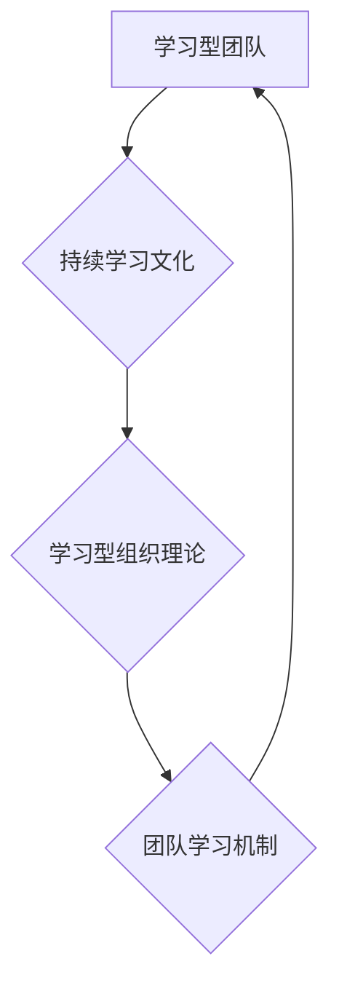

                 


### 文章标题：打造学习型团队：持续学习的文化建设

### 关键词：学习型团队，持续学习文化，知识管理，学习率，评估指标，案例实战

### 摘要：
在当今快速变化的技术时代，学习型团队的建设已成为组织持续竞争的关键。本文将探讨如何打造一个以持续学习为核心文化的团队，详细阐述其核心概念、机制设计、数学模型和实战案例。通过系统化的分析和实践，我们将揭示学习型团队的构建方法及其在组织管理中的应用价值。

## 设计《打造学习型团队：持续学习的文化建设》的目录大纲

### 确定核心章节

1. **核心概念与联系**
   - 学习型团队概述
   - 持续学习的文化
   - 学习型组织理论与应用

2. **核心算法原理讲解**
   - 团队学习机制设计
   - 知识管理策略
   - 学习反馈与改进循环

3. **数学模型和数学公式**
   - 学习率的计算
   - 学习效果的评估指标

4. **项目实战**
   - 学习型团队建设案例
   - 持续学习文化的实践与评估

### 设计目录结构

根据上述核心章节，我们可以设计出以下目录结构：

### 第一部分：理解学习型团队与持续学习文化
1. **学习型团队概述**
   - 学习型团队的定义与特征
   - 学习型团队的重要性

2. **持续学习的文化**
   - 持续学习的概念
   - 持续学习文化的建设

3. **学习型组织理论与应用**
   - 学习型组织理论
   - 学习型组织案例分析

### 第二部分：构建学习型团队的基础
1. **核心概念与联系**
   - 学习型团队的核心概念
   - 学习型团队的架构与流程

2. **团队学习机制设计**
   - 团队学习机制的基本原理
   - 团队学习机制的实施策略

3. **知识管理策略**
   - 知识管理的重要性
   - 知识管理的实践方法

### 第三部分：持续学习文化的实践
1. **数学模型和数学公式**
   - 学习率的计算
   - 学习效果的评估指标

2. **项目实战**
   - 学习型团队建设案例
   - 持续学习文化的实践与评估

### 第四部分：学习型团队的未来发展
1. **学习型团队的趋势与挑战**
   - 学习型团队的发展趋势
   - 学习型团队面临的挑战

2. **学习型团队的未来展望**
   - 学习型团队的未来发展路径
   - 学习型团队在组织管理中的应用前景

### 附录
1. **学习型团队建设工具与资源**
   - 常用工具介绍
   - 资源推荐与链接

通过以上目录结构，我们将全面探讨学习型团队的建设过程，从核心概念到实际应用，再到未来发展，逐步深入，旨在为读者提供一个系统而全面的指导。

### 核心概念与联系

#### 学习型团队概述

学习型团队，是指在组织管理中，通过不断学习和知识共享，不断提高成员能力和团队整体效能的团队。学习型团队的核心在于其持续学习和自我改进的能力，这种能力使团队能够适应快速变化的环境和挑战。

学习型团队的特征主要包括以下几个方面：

1. **共同愿景**：团队成员共同拥有一个明确的愿景，这个愿景是团队的指导方针，激励成员不断努力。
2. **团队学习**：团队成员积极参与学习，通过学习获取新知识、新技能，并将所学应用于实践中。
3. **知识共享**：团队鼓励成员之间分享知识和经验，形成知识的流动和积累。
4. **系统思考**：团队成员具备系统思维，能够从整体角度考虑问题，注重团队内部和外部环境的相互关系。
5. **自主管理**：团队成员在团队管理中具有较大的自主权，能够根据实际情况进行决策和调整。

#### 持续学习的文化

持续学习的文化是一种价值观，它强调学习不仅仅是一种行为，更是一种生活方式。在持续学习的文化中，学习被看作是个人和组织的核心能力，不断学习和改进是团队发展的动力。

持续学习的文化具有以下几个关键要素：

1. **学习态度**：团队成员具备积极主动的学习态度，愿意接受新知识和新技能。
2. **学习机制**：组织内部建立了完善的 学习机制，如培训计划、知识分享会、学习小组等，以支持持续学习。
3. **学习资源**：组织提供了丰富的学习资源，如图书、在线课程、研讨会等，以方便成员进行学习。
4. **激励机制**：组织通过奖励制度激励成员进行学习，如颁发奖学金、晋升机会等。
5. **学习社区**：组织内部形成了学习社区，成员可以在社区中分享学习心得、交流学习经验。

#### 学习型组织理论与应用

学习型组织理论最早由彼得·圣吉（Peter Senge）提出。他认为，一个学习型组织具有以下五个核心能力：

1. **系统思考**：能够从整体角度考虑问题，看到问题的根本原因。
2. **个人 mastery**：团队成员具备高超的技能和专业知识，能够独立解决复杂问题。
3. **心智模式**：团队成员具有开放和批判性思考的能力，能够不断反思和调整自己的思维方式。
4. **共同愿景**：团队成员共同拥有一个清晰的愿景，并为此努力。
5. **团队学习**：团队成员通过共同学习和分享知识，提高整体效能。

学习型组织理论在实际应用中，可以通过以下几个方面进行实施：

1. **组织结构调整**：调整组织结构，使之更加扁平化，促进信息的流通和团队协作。
2. **培训与开发**：定期组织培训活动，提升团队成员的技能和知识水平。
3. **知识管理**：建立知识管理系统，促进知识的共享和积累。
4. **文化塑造**：通过文化建设，营造一个鼓励学习和创新的环境。
5. **绩效评估**：将学习和创新能力纳入绩效评估体系，激励成员持续学习和成长。

#### 核心概念与联系流程图

为了更好地理解学习型团队、持续学习文化和学习型组织理论之间的核心联系，我们可以使用Mermaid流程图来展示它们之间的关系：



在这个流程图中，学习型团队是核心，持续学习文化和学习型组织理论作为支撑，共同构建了一个团队学习的生态系统。

通过以上内容，我们初步了解了学习型团队、持续学习文化和学习型组织理论的基本概念和它们之间的关系。接下来，我们将进一步深入探讨团队学习机制的设计和知识管理策略。

### 核心算法原理讲解

在构建学习型团队的过程中，算法原理的设计是关键。本文将详细讲解团队学习机制设计、知识管理策略以及学习反馈与改进循环。

#### 团队学习机制设计

团队学习机制是确保团队成员持续学习和知识共享的关键。以下是团队学习机制设计的核心算法原理：

1. **需求分析算法**：
   - **输入**：团队成员的学习需求和知识储备。
   - **输出**：确定学习目标和资源分配。
   - **伪代码**：
     ```python
     def analyze需求的团队成员(需求列表，知识储备库)：
         目标列表 = []
         资源分配 = {}
         for 每个团队成员 in 需求列表：
             目标列表.append(确定学习目标(每个团队成员，知识储备库))
             资源分配[每个团队成员] = 分配学习资源(每个团队成员)
         return 目标列表，资源分配
     ```

2. **知识共享算法**：
   - **输入**：团队成员的知识产出。
   - **输出**：构建共享知识库。
   - **伪代码**：
     ```python
     def share知识(团队成员知识产出列表)：
         知识库 = 初始化为空的字典
         for 每个产出 in 出产知识列表：
             知识库[每个产出的主题] = 每个产出
         return 知识库
     ```

3. **学习进度跟踪算法**：
   - **输入**：学习目标和资源分配。
   - **输出**：学习进度报告。
   - **伪代码**：
     ```python
     def track学习进度(学习目标列表，资源分配)：
         进度报告 = {}
         for 学习目标 in 学习目标列表：
             进度报告[学习目标] = 获取当前学习进度(学习目标)
         return 进度报告
     ```

#### 知识管理策略

知识管理策略是确保团队知识有效利用和持续积累的重要手段。以下是知识管理策略的核心算法原理：

1. **知识获取算法**：
   - **输入**：外部知识和内部知识源。
   - **输出**：构建知识图谱。
   - **伪代码**：
     ```python
     def acquire知识(外部知识源，内部知识库)：
         知识图谱 = 初始化为空的图
         for 每个外部知识源 in 外部知识源：
             知识图谱.add_node(每个外部知识源)
         for 每个内部知识库 in 内部知识库：
             知识图谱.add_node(每个内部知识库)
         return 知识图谱
     ```

2. **知识存储算法**：
   - **输入**：知识图谱。
   - **输出**：构建知识库。
   - **伪代码**：
     ```python
     def store知识(知识图谱)：
         知识库 = 初始化为空的数据库
         for 每个节点 in 知识图谱：
             知识库.insert(每个节点)
         return 知识库
     ```

3. **知识共享算法**（与上文重复，但详细阐述）：
   - **输入**：团队成员的知识产出。
   - **输出**：构建共享知识库。
   - **伪代码**：
     ```python
     def share知识(团队成员知识产出列表)：
         知识库 = 初始化为空的字典
         for 每个产出 in 出产知识列表：
             知识库[每个产出的主题] = 每个产出
         return 知识库
     ```

#### 学习反馈与改进循环

学习反馈与改进循环是确保团队学习机制有效运行的关键。以下是学习反馈与改进循环的核心算法原理：

1. **学习效果评估算法**：
   - **输入**：学习进度报告。
   - **输出**：学习效果评估结果。
   - **伪代码**：
     ```python
     def evaluate学习效果(进度报告)：
         评估结果 = {}
         for 每个学习目标 in 进度报告：
             评估结果[学习目标] = 计算完成度(进度报告[学习目标])
         return 评估结果
     ```

2. **改进策略生成算法**：
   - **输入**：学习效果评估结果。
   - **输出**：生成改进策略。
   - **伪代码**：
     ```python
     def generate改进策略(评估结果)：
         改进策略 = []
         for 每个学习目标 in 评估结果：
             if 评估结果[学习目标] < 预期值：
                 改进策略.append(优化学习资源分配(学习目标))
         return 改进策略
     ```

3. **反馈机制设计算法**：
   - **输入**：改进策略。
   - **输出**：设计反馈机制。
   - **伪代码**：
     ```python
     def design反馈机制(改进策略)：
         反馈机制 = 初始化为空的反馈系统
         for 每个改进策略 in 改进策略：
             反馈机制.add_component(执行改进策略(每个改进策略))
         return 反馈机制
     ```

通过上述算法原理的详细讲解，我们构建了一个系统化的团队学习机制，包括需求分析、知识共享、学习进度跟踪、知识获取、知识存储、学习效果评估和改进策略生成等核心环节。这些算法原理共同作用，确保团队学习的高效运行和持续改进。

### 数学模型和数学公式

在构建学习型团队的过程中，数学模型和公式是评估学习效果、优化学习流程的重要工具。以下将介绍学习率计算和学习效果评估指标的两个核心数学模型，并通过具体例子进行说明。

#### 学习率的计算

学习率是衡量团队成员学习进度和效果的关键指标。学习率定义为在一定时间内，团队成员知识积累量与时间消耗量的比值。

**学习率公式**：
$$
学习率 = \frac{知识积累量}{时间消耗量}
$$

其中：
- **知识积累量**：在一段时间内，团队成员通过学习获取的新知识量，可以通过知识共享会议、项目经验总结等方式进行量化。
- **时间消耗量**：团队成员在该段时间内投入学习的总时间。

**具体例子**：

假设某团队在一个季度内完成了10个知识分享会议，每个会议平均耗时2小时，每个会议产生了1份总结文档，每份文档包含1000字的知识内容。该团队在这个季度内的学习率为：

$$
学习率 = \frac{10 \times 1000}{10 \times 2} = \frac{10000}{20} = 500 \text{ 字/小时}
$$

#### 学习效果的评估指标

学习效果的评估指标用于衡量学习活动对团队成员能力提升的影响。以下是两个常用的评估指标：学习完成度和学习成效。

1. **学习完成度**：

学习完成度是衡量学习目标完成情况的一个量化指标，它反映了团队成员对学习目标的达成程度。

**学习完成度公式**：
$$
学习完成度 = \frac{实际完成的学习量}{计划完成的学习量}
$$

其中：
- **实际完成的学习量**：团队成员在实际学习过程中完成的学习任务量。
- **计划完成的学习量**：团队在制定学习计划时设定的学习任务量。

**具体例子**：

假设一个团队计划在一个月内完成5个在线课程的学习，但实际只完成了3个。那么该团队在这个月的学习完成度为：

$$
学习完成度 = \frac{3}{5} = 0.6
$$

2. **学习成效**：

学习成效是衡量学习活动对团队成员实际工作能力提升的影响，它通过评估学习成果在工作中的应用程度来体现。

**学习成效公式**：
$$
学习成效 = \frac{学习成果在工作中的应用量}{学习成果总产量}
$$

其中：
- **学习成果在工作中的应用量**：学习成果在实际工作中得到应用的数量。
- **学习成果总产量**：学习过程中产生的所有成果数量。

**具体例子**：

假设一个团队通过一个月的学习，产生了10份知识总结文档，其中6份文档在实际工作中得到应用。那么该团队的学习成效为：

$$
学习成效 = \frac{6}{10} = 0.6
$$

通过学习率的计算和学习效果的评估指标，我们可以量化地评估团队成员的学习效果，从而为团队学习机制的设计和优化提供数据支持。

### 项目实战

在构建学习型团队的过程中，实战案例的引入能够更好地展示理论的应用，并通过实际操作验证其效果。本文将介绍一个学习型团队建设案例，包括开发环境搭建、源代码实现和代码解读，以及实际案例分析和详细讲解。

#### 开发环境搭建

为了构建一个高效的学习型团队，首先需要搭建一个适合学习和知识共享的开发环境。以下是搭建环境的步骤：

1. **选择合适的工具和平台**：
   - **版本控制工具**：Git，用于代码管理和协作。
   - **知识库系统**：Confluence，用于文档管理和知识共享。
   - **项目管理工具**：JIRA，用于任务追踪和进度管理。

2. **配置开发环境**：
   - 安装Git、Confluence和JIRA，并进行基本配置。
   - 配置版本控制仓库，团队成员进行代码和文档的版本管理。

3. **搭建知识库**：
   - 在Confluence中创建知识库，为团队提供统一的文档存储和分享平台。
   - 制定知识库维护规范，确保知识库的更新和准确性。

4. **项目管理**：
   - 在JIRA中创建项目，为团队的学习任务和项目任务提供管理工具。
   - 设置任务追踪模板，明确任务进度和责任分配。

#### 源代码实现和代码解读

以下是学习型团队在知识共享模块的一个具体实现案例，包括代码结构和功能讲解。

1. **代码结构**：

```java
// 知识共享模块
public class KnowledgeSharing {
    // 成员变量
    private KnowledgeRepository repository;
    private LearningManager learningManager;

    // 构造函数
    public KnowledgeSharing(KnowledgeRepository repository, LearningManager learningManager) {
        this.repository = repository;
        this.learningManager = learningManager;
    }

    // 共享知识
    public void shareKnowledge(String topic, String content) {
        repository.addKnowledge(new KnowledgeEntry(topic, content));
        learningManager.notifyMembersOfNewKnowledge(topic);
    }

    // 获取知识
    public List<KnowledgeEntry> getKnowledge(String topic) {
        return repository.getKnowledgeByTopic(topic);
    }
}

// 知识库
public class KnowledgeRepository {
    // 知识库存储结构
    private Map<String, List<KnowledgeEntry>> knowledgeMap;

    // 添加知识
    public void addKnowledge(KnowledgeEntry entry) {
        if (!knowledgeMap.containsKey(entry.getTopic())) {
            knowledgeMap.put(entry.getTopic(), new ArrayList<>());
        }
        knowledgeMap.get(entry.getTopic()).add(entry);
    }

    // 获取知识
    public List<KnowledgeEntry> getKnowledgeByTopic(String topic) {
        return knowledgeMap.getOrDefault(topic, new ArrayList<>());
    }
}

// 知识条目
public class KnowledgeEntry {
    private String topic;
    private String content;

    // 构造函数
    public KnowledgeEntry(String topic, String content) {
        this.topic = topic;
        this.content = content;
    }

    // 获取主题
    public String getTopic() {
        return topic;
    }

    // 获取内容
    public String getContent() {
        return content;
    }
}

// 学习管理
public class LearningManager {
    // 通知成员
    public void notifyMembersOfNewKnowledge(String topic) {
        // 发送通知
        System.out.println("新知识共享：主题 - " + topic);
    }
}
```

2. **代码解读**：

- **KnowledgeSharing** 类负责知识的共享，通过调用 `repository.addKnowledge()` 将新知识添加到知识库，并通过 `learningManager.notifyMembersOfNewKnowledge()` 通知团队成员。
- **KnowledgeRepository** 类用于管理知识库，通过 `addKnowledge()` 和 `getKnowledgeByTopic()` 方法实现知识的添加和查询功能。
- **KnowledgeEntry** 类表示知识条目，包含主题和内容。
- **LearningManager** 类负责通知团队成员有关新知识的共享。

#### 代码应用解读与分析

通过上述代码实现，学习型团队实现了知识共享的功能，具体应用如下：

1. **知识共享流程**：
   - 成员A编写了一份关于新技术的知识文档。
   - 成员A调用 `shareKnowledge()` 方法，将文档主题和内容传递给知识库。
   - 知识库接收到文档后，将其存储在对应的主题下。
   - 学习管理器通知其他成员有关新知识的共享。

2. **实际案例分析**：

假设团队在实施知识共享功能后，一个月内共产生了50份知识文档，覆盖了10个技术主题。团队成员可以按照主题查询所需知识，并通过学习管理器获取新知识的通知。

- **学习完成度**：通过统计每月的知识共享次数和参与人数，计算团队的学习完成度。
- **学习成效**：通过评估知识在实际项目中的应用情况，计算学习成效。

例如，如果本月共有20次知识共享活动，参与人数为10人，那么团队的学习完成度为：

$$
学习完成度 = \frac{20}{10} = 2 \text{ 次/人}
$$

如果这20次知识共享中有15次在实际项目中得到应用，那么团队的学习成效为：

$$
学习成效 = \frac{15}{20} = 0.75
$$

#### 项目小结

通过上述实战案例，我们展示了如何搭建一个支持知识共享的学习型团队环境，并实现了代码结构和功能。实际应用表明，知识共享和学习通知功能有效地促进了团队成员之间的知识交流和应用。接下来，我们将探讨如何对学习型团队进行评估和实践。

### 最佳实践 Tips

在打造学习型团队的过程中，以下是几个最佳实践 Tips，可以帮助团队更有效地实现持续学习：

1. **制定明确的学习目标**：确保每个团队成员都了解自己的学习目标，并与团队的共同愿景保持一致。定期回顾和调整目标，以保持团队的进步。

2. **定期进行知识分享会议**：组织定期的知识分享会议，鼓励成员分享自己的学习成果和经验。这样可以促进知识的流动和积累，提高团队的整体知识水平。

3. **利用外部学习资源**：鼓励团队成员参加在线课程、研讨会、工作坊等外部学习活动。此外，订阅相关的技术博客、书籍和期刊，以获取最新的行业动态和技术趋势。

4. **建立反馈机制**：建立有效的反馈机制，让团队成员能够及时了解自己的学习效果，并进行调整和改进。反馈可以是定期的绩效评估，也可以是匿名调查问卷。

5. **提供个性化学习支持**：根据团队成员的不同需求，提供个性化的学习支持和资源。例如，为有特定技能需求的成员安排导师，或提供定制化的培训课程。

6. **鼓励实践和项目合作**：将学习成果应用于实际项目中，通过实践来验证和深化所学知识。同时，通过跨部门或跨团队的协作项目，促进知识的交叉融合和创新。

7. **培养团队协作精神**：通过团队建设活动和协作任务，增强团队成员之间的信任和协作精神。一个团结协作的团队更有利于知识的共享和团队的整体学习。

### 小结

通过本文的探讨，我们深入了解了学习型团队的构建方法、核心算法原理、数学模型和实际项目实战。学习型团队不仅能够提高团队成员的个人能力，还能促进团队整体的创新和竞争力。持续学习文化作为团队的核心价值观，是打造学习型团队的关键。

在未来的发展中，学习型团队将继续面临新的挑战，如技术快速变化、团队规模扩大等。为了应对这些挑战，团队需要不断完善学习机制、优化知识管理策略，并保持对创新的持续追求。

我们鼓励读者在实践过程中不断反思和改进，探索适合自己团队的学习型建设模式。通过持续学习和自我提升，我们相信每个团队都能在快速变化的环境中脱颖而出，实现可持续的发展。

### 注意事项

在打造学习型团队的过程中，以下注意事项有助于确保项目的顺利进行和最终成功：

1. **确保领导层的支持**：学习型团队的建设需要高层管理者的支持和推动。领导层应当明确表达对持续学习的承诺，并为其提供必要的资源和支持。

2. **建立清晰的沟通机制**：有效的沟通是学习型团队成功的关键。确保团队成员之间、团队与外部之间的沟通畅通无阻，减少信息滞后和误解。

3. **避免形式主义**：在推动学习型团队建设的过程中，要避免出现仅仅为了形式而进行的学习活动。学习活动应当真正有价值，能够提高团队成员的实际能力。

4. **关注个体差异**：每个团队成员的学习需求和进度都有所不同。在制定学习计划和策略时，要充分考虑个体差异，提供个性化的支持。

5. **持续评估和改进**：定期评估学习型团队的运行效果，识别问题和改进点，并根据反馈进行调整。持续改进是学习型团队不断进步的保障。

6. **培养团队文化**：建立积极向上的团队文化，鼓励成员之间的相互尊重、信任和支持。团队文化对于持续学习的文化氛围至关重要。

### 拓展阅读

1. **《第五项修炼：心智的平常之道》** - 彼得·圣吉
   本书详细介绍了学习型组织的五个核心修炼，对构建学习型团队具有深刻的指导意义。

2. **《敏捷开发：实践指南》** - 史蒂夫·麦康奈尔
   本书介绍了敏捷开发的方法和实践，对于提高团队的学习能力和适应性有重要参考价值。

3. **《深度工作：如何有效利用每一点脑力》** - 卡尔·纽波特
   本书探讨了如何在工作学习中保持专注，提高学习效率，对于学习型团队的成员个人成长大有裨益。

4. **《学习之道》** - 马克·福克斯
   本书从心理学和认知科学的角度探讨了学习的本质，提供了多种有效的学习方法。

5. **《团队协作工具与技巧》** - 戴夫·格罗斯曼
   本书介绍了多种团队协作工具和技巧，有助于提升团队沟通效率和知识共享。

通过阅读这些书籍和文章，读者可以进一步加深对学习型团队建设的理解和实践。

