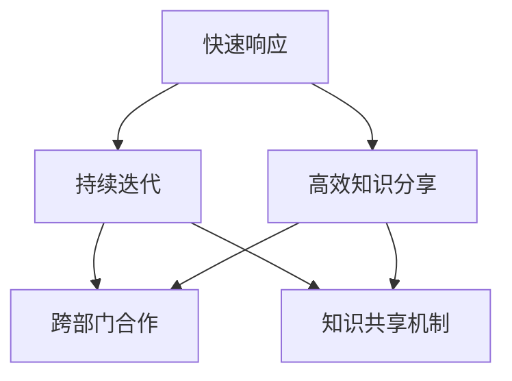

                 

## 文章标题

### 打造学习敏捷型组织：快速学习和适应的能力

> 关键词：学习敏捷型组织、快速学习、适应能力、组织学习、敏捷性

> 摘要：本文深入探讨了如何打造学习敏捷型组织，强调了快速学习和适应能力在组织发展中的重要性。通过分析核心概念、介绍方法论、结合实际案例，本文提供了系统性的指导，帮助组织在快速变化的环境中保持竞争优势。

---

### 引言

在现代商业环境中，技术的飞速发展和市场的不断变化要求组织具备快速学习和适应的能力。传统的学习方式已经无法满足组织应对复杂挑战的需求，因此，打造学习敏捷型组织成为提升组织竞争力的关键。

**学习敏捷型组织**是指那些能够快速吸收知识、灵活应对变化的组织。它们不仅具备快速学习的能力，还能迅速适应环境变化，保持持续的竞争优势。本文将从以下几个方面进行探讨：

1. **学习敏捷型组织的定义与特点**：介绍学习敏捷型组织的核心概念和主要特征。
2. **快速学习的方法与技巧**：探讨如何通过有效的方法和技巧提升快速学习的能力。
3. **适应能力的重要性与培养**：分析适应能力在组织中的重要性，并提供培养适应能力的策略。
4. **案例分析**：通过实际案例展示如何打造学习敏捷型组织。
5. **持续改进与优化**：讨论如何通过持续改进来提升学习敏捷性和适应能力。
6. **结论与展望**：总结学习敏捷型组织的重要性，并展望未来的发展趋势。

### 1. 学习敏捷型组织的定义与特点

**学习敏捷型组织**不同于传统组织，它强调快速学习、知识共享和灵活适应。具体来说，学习敏捷型组织具备以下特点：

- **快速响应变化**：学习敏捷型组织能够快速感知外部环境的变化，并迅速调整内部策略和运营模式。
- **持续迭代与优化**：组织持续对自身的学习方法和流程进行迭代和优化，以保持高效的学习效率。
- **高效知识分享**：组织内部建立知识共享机制，促进知识和经验的传播，提高整体学习效果。
- **跨部门合作**：鼓励跨部门合作，通过不同领域的知识融合，提升创新能力。

为了更好地理解这些特点，我们可以用Mermaid流程图来展示学习敏捷型组织的核心架构：



### 2. 快速学习的方法与技巧

快速学习是学习敏捷型组织的核心能力之一。以下是一些快速学习的方法与技巧：

- **项目驱动学习**：通过实际项目来学习和应用知识，提高学习的实际效果。
- **互动式学习**：通过讨论、实验和模拟等方式，增强学习的互动性和实践性。
- **跨部门合作**：通过跨部门合作，促进不同领域的知识交流，拓宽学习视野。

以下是一个快速学习方法的伪代码示例：

```python
# 快速学习方法
def rapid_learning(subject, resources, feedback):
    # 学习主题初始化
    current_knowledge = initialize_knowledge(subject)
    
    # 学习资源准备
    resources_prepared = prepare_resources(resources)
    
    # 学习过程
    for resource in resources_prepared:
        learn_from_resource(current_knowledge, resource)
        
    # 学习反馈
    feedback_received = receive_feedback(current_knowledge)
    
    # 学习结果评估
    learning_outcome = evaluate_learning(current_knowledge, feedback_received)
    
    return learning_outcome
```

### 3. 适应能力的重要性与培养

适应能力是学习敏捷型组织的另一个关键特点。在快速变化的环境中，组织必须具备灵活适应的能力，才能保持持续的竞争优势。以下是一些培养适应能力的策略：

- **个性化培训**：根据员工的兴趣和需求，提供个性化的培训，提高适应能力。
- **反思与反馈**：通过定期反思和反馈，帮助员工识别自身不足，并制定改进计划。
- **实践与模拟**：通过实践和模拟，让员工在真实环境中锻炼适应能力。

以下是一个适应能力培养的策略伪代码示例：

```python
# 适应能力培养策略
def adaptability_training(employee, environment, feedback):
    # 员工初始适应能力评估
    initial_adaptability = assess_adaptability(employee)
    
    # 环境模拟
    simulated_environment = create_simulated_environment(environment)
    
    # 培训过程
    for simulation in simulated_environment:
        practice_in_simulation(employee, simulation)
        
    # 反馈收集
    training_feedback = collect_feedback(employee, simulation)
    
    # 培训结果评估
    final_adaptability = assess_adaptability(employee, training_feedback)
    
    return final_adaptability
```

### 4. 案例分析

通过以下两个实际案例，我们可以看到如何在不同组织中打造学习敏捷型组织。

#### 案例一：公司A的学习敏捷型组织建设

**背景**：公司A是一家技术公司，面对市场竞争和技术变革，决定打造学习敏捷型组织。

**实施过程**：
1. **组织文化重塑**：公司高层领导倡导学习文化，建立知识共享平台。
2. **项目驱动学习**：通过实际项目，促进员工学习和实践。
3. **跨部门合作**：鼓励不同部门之间的知识交流和合作。

**成效评估**：公司A在短短两年内，通过学习敏捷型组织建设，显著提高了员工技能和团队协作能力，产品开发周期缩短，市场份额提高。

#### 案例二：企业B的适应能力培养

**背景**：企业B是一家制造业公司，面临市场需求的变化和竞争压力。

**实施过程**：
1. **个性化培训**：根据员工岗位需求，提供个性化的培训计划。
2. **反思与反馈**：定期组织员工进行反思和反馈，识别改进点。
3. **实践与模拟**：通过实际操作和模拟，提高员工的适应能力。

**成效分析**：企业B在实施适应能力培养策略后，员工对新技术的接受度提高，生产效率提升，产品交付周期缩短，客户满意度提高。

### 5. 持续改进与优化

持续改进是学习敏捷型组织的核心原则之一。以下是一些持续改进的方法：

- **SWOT分析**：定期进行SWOT分析，识别组织的优势、劣势、机会和威胁，制定相应的改进计划。
- **KPI设定**：设定关键绩效指标，监测组织的学习敏捷性和适应能力。
- **市场调研**：通过市场调研，了解行业趋势和客户需求，及时调整组织策略。

以下是一个持续改进的伪代码示例：

```python
# 持续改进
def continuous_improvement(organization, market_research, kpi):
    # SWOT分析
    swot_analysis = perform_swot_analysis(organization)
    
    # 市场调研
    market_survey = perform_market_research(market_research)
    
    # KPI设定
    kpi_set = set_kpi(kpi, market_survey)
    
    # 改进策略制定
    improvement_strategy = create_improvement_strategy(swot_analysis, kpi_set)
    
    # 改进实施
    improvement Implemented = implement_improvement_strategy(improvement_strategy)
    
    # 改进效果评估
    improvement_evaluation = evaluate_improvement(improvement_strategy)
    
    return improvement_evaluation
```

### 6. 结论与展望

学习敏捷型组织是现代组织应对复杂环境和竞争压力的有效策略。快速学习和适应能力是学习敏捷型组织的核心要素，通过持续改进和优化，组织可以不断提升自身的竞争力。

**最佳实践 tips**：

1. **建立学习文化**：高层领导应倡导学习文化，鼓励员工不断学习。
2. **重视知识共享**：建立知识共享平台，促进知识和经验的传播。
3. **个性化培训**：根据员工需求提供个性化的培训计划，提高适应能力。

**小结**：

本文通过分析学习敏捷型组织的核心概念和特点，介绍了快速学习和适应能力的重要性，并通过实际案例展示了如何打造学习敏捷型组织。通过持续改进和优化，组织可以在快速变化的环境中保持竞争优势。

**注意事项**：

1. **组织文化**：建立学习文化是打造学习敏捷型组织的基石。
2. **领导力**：领导者在推动学习敏捷性和适应能力方面起着关键作用。
3. **持续改进**：持续改进是组织保持敏捷性的关键。

**拓展阅读**：

- 《敏捷学习：让组织更具竞争力》
- 《组织学习：理论与实践》
- 《如何打造学习型组织》

作者：AI天才研究院/AI Genius Institute & 禅与计算机程序设计艺术 /Zen And The Art of Computer Programming

