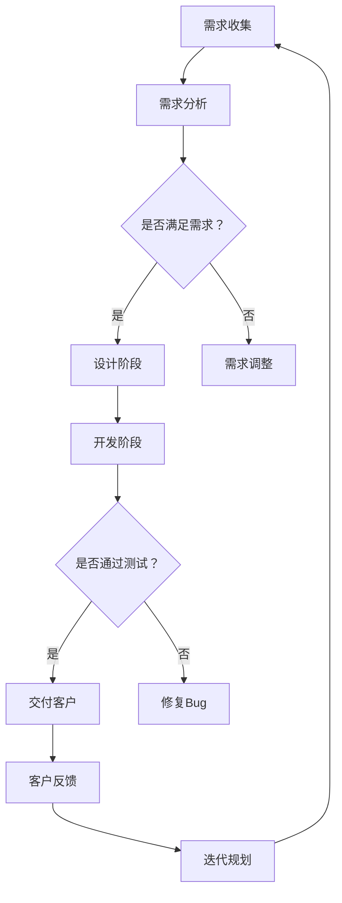
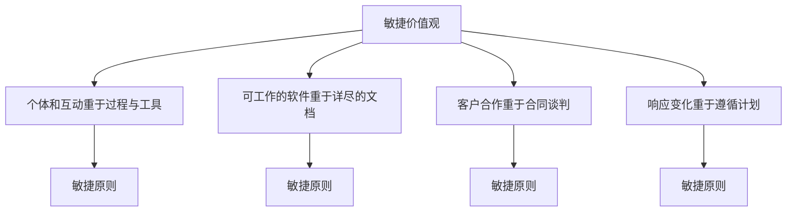
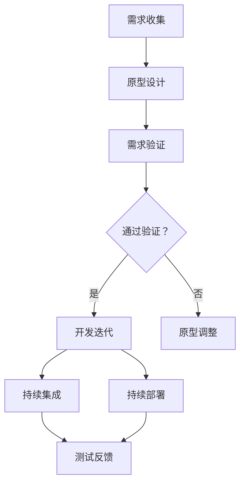

                 

### 文章标题：打造敏捷团队：快速响应市场变化

#### 关键词：敏捷团队、市场变化、快速响应、团队构建、协作工具

#### 摘要：
在快速变化的市场环境中，企业需要具备快速响应市场变化的能力。敏捷团队作为一种高效的工作方式，正逐渐成为企业提升竞争力的关键。本文将深入探讨敏捷团队的理论基础、构建与运营、实践案例以及面临的挑战与解决策略，以帮助读者了解如何打造一个能够快速响应市场变化的敏捷团队。

## 第一部分：敏捷团队理论基础

### 第1章：敏捷方法简介

#### 1.1 敏捷的起源与发展

敏捷方法起源于20世纪90年代，其背景是传统开发方法在应对复杂项目时表现出的不足。敏捷方法强调团队协作、快速迭代和持续改进，旨在应对项目变化和不确定性。自诞生以来，敏捷方法得到了广泛的认可和推广，并在软件工程领域取得了显著成果。

#### 1.2 敏捷与传统方法的对比

传统开发方法往往采用瀑布模型，强调计划和控制，但在面对复杂和变化时表现较差。而敏捷开发则更注重灵活性和适应性，通过快速迭代和持续交付来适应市场变化。敏捷开发的优势包括缩短开发周期、提高产品质量、降低风险等。

### 第2章：敏捷团队的核心原则

#### 2.1 敏捷价值观

敏捷价值观包括个体和互动、可工作的软件、客户合作和响应变化。这些价值观是敏捷团队成功的基础，能够引导团队成员的行为和决策。

#### 2.2 敏捷原则与实践

敏捷原则包括客户满意度、欢迎变化、交付可工作的软件等。这些原则为敏捷团队的实践提供了具体指导，有助于团队在实际工作中实现敏捷目标。

### 第3章：敏捷工具与技术

#### 3.1 敏捷项目管理工具

敏捷项目管理工具如Jira、Trello等，可以帮助团队更好地管理任务、跟踪进度和协作。这些工具的选择与应用对于提升团队效率至关重要。

#### 3.2 敏捷开发技术

敏捷开发技术包括原型设计、快速迭代和持续集成等。这些技术方法有助于团队更快地交付高质量的产品。

## 第二部分：敏捷团队建设与运营

### 第4章：敏捷团队构建

#### 4.1 敏捷团队的组成

敏捷团队的组成包括产品负责人、开发人员、测试人员和项目经理等角色。这些角色的职责和协作对于团队的效率至关重要。

#### 4.2 敏捷团队的招聘与培养

敏捷团队的招聘需要注重团队成员的技能和协作能力。同时，通过培训和激励，可以帮助团队成员不断提升能力和适应敏捷工作方式。

### 第5章：敏捷团队协作

#### 5.1 敏捷团队沟通

有效的沟通是敏捷团队成功的关键。团队成员需要通过多种沟通方式保持信息同步，解决协作中的问题。

#### 5.2 敏捷团队协作工具

敏捷团队协作工具如Slack、Microsoft Teams等，可以提高团队协作的效率。这些工具的使用方法和优缺点分析对于团队协作具有重要意义。

### 第6章：敏捷团队绩效评估

#### 6.1 敏捷绩效指标

敏捷绩效指标包括团队交付速度、客户满意度、产品质量等。这些指标的设计和应用对于团队绩效评估至关重要。

#### 6.2 敏捷团队绩效评估方法

敏捷团队绩效评估方法包括定期回顾、反馈和改进。这些方法有助于团队持续提升绩效和适应市场变化。

## 第三部分：敏捷团队实践案例

### 第7章：敏捷团队实战案例

#### 7.1 案例一：科技公司的敏捷转型

本案例将分析某科技公司如何实施敏捷转型，并评估其效果。

#### 7.2 案例二：电子商务平台的敏捷实践

本案例将探讨某电子商务平台如何运用敏捷实践，提高产品质量和市场竞争力。

### 第8章：敏捷团队面临的挑战与解决策略

#### 8.1 敏捷团队常见问题

敏捷团队在实践过程中可能会遇到团队协作困难、项目进度控制难、成员流动性强等问题。

#### 8.2 挑战应对策略

针对敏捷团队面临的挑战，本文将提出具体的应对策略，帮助团队提升协作效率和应对市场变化。

## 总结

敏捷团队在快速响应市场变化方面具有显著优势。通过深入理解敏捷团队的理论基础、构建与运营方法，企业可以打造一个高效、灵活的敏捷团队，从而在激烈的市场竞争中脱颖而出。

### 作者：AI天才研究院/AI Genius Institute & 禅与计算机程序设计艺术 /Zen And The Art of Computer Programming

在接下来的章节中，我们将逐一探讨敏捷团队的理论基础、构建与运营方法，以及实践案例，以帮助读者全面了解敏捷团队的建设和实践。通过这些内容，读者可以掌握敏捷团队的核心原理和关键技能，为自己的企业打造一个能够快速响应市场变化的敏捷团队。### 第1章：敏捷方法简介

#### 1.1 敏捷的起源与发展

敏捷方法起源于20世纪90年代，其背景是传统开发方法在应对复杂项目时表现出的不足。在20世纪80年代和90年代初，软件开发领域主要采用瀑布模型（Waterfall Model）进行项目开发。瀑布模型是一种线性顺序的开发方法，将软件生命周期划分为若干阶段，如需求分析、设计、编码、测试和维护等。每个阶段完成后才能进入下一阶段，这种方法的优点是结构清晰、便于管理，但缺点是缺乏灵活性，难以应对项目变化和不确定性。

随着互联网的兴起和市场竞争的加剧，客户需求变得日益复杂和多变，传统开发方法开始暴露出其局限性。为了应对这些挑战，软件开发领域开始探索新的方法，敏捷方法应运而生。1991年，软件开发专家肯特·贝克（Kent Beck）提出了极限编程（eXtreme Programming，简称XP），这被视为敏捷方法的早期代表。1998年，17位软件开发专家在美国犹他州聚会，共同签署了《敏捷宣言》（Manifesto for Agile Software Development），这标志着敏捷方法的正式诞生。

敏捷方法的核心思想是强调团队协作、客户满意、快速迭代和持续改进。它摒弃了传统开发方法的严格计划和严格控制，转而采用灵活、适应性强的开发方式。敏捷方法在软件工程领域得到了广泛的认可和推广，逐渐成为许多企业提升竞争力的关键。

#### 1.2 敏捷与传统方法的对比

传统开发方法（如瀑布模型）与敏捷方法在多个方面存在显著差异：

1. **计划与控制**

   传统开发方法强调详细规划和严格控制，项目开始前需要进行详细的需求分析和计划，每个阶段完成后才能进入下一阶段。这种方式在项目初期可以提供清晰的蓝图，但难以应对项目变化和不确定性。

   敏捷方法则更注重灵活性和适应性。它采用迭代和增量的方式，将整个项目划分为若干短期的迭代周期（通常为2-4周），每个迭代周期结束后进行评审和调整。这种方式允许团队在开发过程中及时响应客户需求和市场变化，提高项目成功的可能性。

2. **团队协作**

   传统开发方法往往将项目分为多个阶段，由不同的团队负责不同的阶段，导致团队间的协作困难。团队成员之间的沟通和合作较少，容易导致信息孤岛和沟通障碍。

   敏捷方法则强调团队协作和跨职能合作。敏捷团队通常由多个专业角色组成，如开发人员、测试人员、产品负责人等，团队成员共同参与项目规划和执行。这种方式有助于团队成员之间的信息共享和协作，提高团队整体效率。

3. **客户参与**

   传统开发方法中，客户参与通常限于项目初期，需求分析阶段结束后，客户对项目的影响力逐渐减弱。

   敏捷方法则强调持续的客户参与。在敏捷开发过程中，客户或产品负责人与开发团队保持密切沟通，参与项目规划和评审会议。这种方式确保了客户需求得到及时反馈和调整，提高了客户满意度。

4. **风险管理**

   传统开发方法通过详细的规划和控制来降低风险，但在实际项目中，风险仍然难以预测和控制。

   敏捷方法则通过快速迭代和持续交付来降低风险。在每个迭代周期中，团队对项目的状态进行评估和调整，及时发现并解决问题。这种方式有助于提前识别和应对风险，提高项目成功率。

总之，敏捷方法相对于传统开发方法在灵活性、适应性、团队协作和客户参与等方面具有显著优势。它能够更好地应对复杂项目的变化和不确定性，提高项目成功率。

### Mermaid流程图示例

下面是一个简单的Mermaid流程图，展示了敏捷团队在不同迭代周期中的关键活动：



在这个流程图中，敏捷团队在每个迭代周期中依次进行需求收集、需求分析、设计阶段、开发阶段、测试阶段和客户交付。如果测试阶段发现Bug，团队将进行修复；如果客户提出反馈，团队将进行需求调整和迭代规划。这种循环迭代的方式有助于团队快速响应市场变化和客户需求。

### 伪代码示例

下面是一个简单的伪代码示例，用于描述敏捷团队在迭代周期中的关键步骤：

```python
# 伪代码：敏捷迭代周期
def agile_iterative_cycle():
    while True:
        # 需求收集
        collect_requirements()

        # 需求分析
        analyze_requirements()

        # 设计阶段
        design_phase()

        # 开发阶段
        development_phase()

        # 测试阶段
        test_phase()

        # 交付客户
        deliver_to_customer()

        # 客户反馈
        customer_feedback()

        # 迭代规划
        plan_next_iterative_cycle()

        # 检查是否继续迭代
        if not continue_iterating():
            break
```

在这个伪代码中，`collect_requirements()`、`analyze_requirements()`、`design_phase()`、`development_phase()`、`test_phase()`、`deliver_to_customer()`、`customer_feedback()`和`plan_next_iterative_cycle()`分别表示需求收集、需求分析、设计阶段、开发阶段、测试阶段、客户交付、客户反馈和迭代规划。`continue_iterating()`函数用于检查是否继续进行下一个迭代周期。

### 数学模型和公式示例

在敏捷团队中，绩效评估是一个重要环节。下面是一个简单的数学模型，用于评估团队在迭代周期中的绩效：

$$
绩效 = (交付成果 / 预期目标) \times (客户满意度 / 100)
$$

其中，`交付成果`表示团队在迭代周期中实际交付的功能点或质量指标；`预期目标`表示团队在迭代周期前设定的目标值；`客户满意度`表示客户对交付成果的满意度评分（通常为100分制）。

例如，如果一个团队在一个迭代周期中交付了50个功能点，预期目标是60个功能点，客户满意度为90分，那么该团队在该迭代周期中的绩效为：

$$
绩效 = (50 / 60) \times (90 / 100) = 0.75 \times 0.9 = 0.675
$$

这意味着团队在该迭代周期中的绩效为67.5%。

通过这个数学模型，团队可以量化评估自己的绩效，并与其他迭代周期进行对比，以了解团队的整体表现和改进方向。

### 总结

本章介绍了敏捷方法的起源和发展、敏捷方法与传统方法的对比，以及敏捷团队在不同迭代周期中的关键活动。通过Mermaid流程图、伪代码和数学模型，我们进一步了解了敏捷团队的工作原理和绩效评估方法。在接下来的章节中，我们将继续探讨敏捷团队的核心原则、构建与运营方法，以及实践案例，以帮助读者全面了解敏捷团队的建设和实践。

### 第2章：敏捷团队的核心原则

#### 2.1 敏捷价值观

敏捷团队的成功离不开其核心理念，这些核心理念被统称为敏捷价值观。敏捷价值观包括以下四个核心原则：

1. **个体和互动重于过程与工具**
   这一点强调团队合作和个体之间的互动比依赖具体的开发流程和工具更为重要。敏捷团队鼓励团队成员之间的直接沟通，共同解决问题，而不是仅仅依赖文档和工具。

2. **可工作的软件重于详尽的文档**
   敏捷方法认为，能够实际运行和交付的软件比冗长的文档更为重要。虽然文档是必需的，但敏捷团队更注重可工作的软件，确保项目能够快速交付并满足客户需求。

3. **客户合作重于合同谈判**
   敏捷团队重视与客户的紧密合作，而不是仅仅依靠合同条款。通过持续的沟通和反馈，团队能够更好地理解客户需求，快速调整项目方向，确保最终交付的产品能够满足客户期望。

4. **响应变化重于遵循计划**
   在敏捷方法中，变化被视为项目成功的关键因素。敏捷团队鼓励团队成员对变化保持开放态度，并能够快速适应，确保项目能够灵活应对市场和环境的变化。

#### 2.2 敏捷原则与实践

敏捷原则是敏捷价值观的具体体现，共有十二条原则，它们为敏捷团队提供了实践指南。以下是这十二条原则的简要介绍：

1. **最优先做的是满足客户通过本软件工作的需求变化**
   这意味着在项目开发过程中，团队应首先关注客户需求的变化，确保项目能够灵活适应。

2. **即使遵照需求文档，逐步开发并尽早交付有价值的软件版本也是重要的**
   团队应优先交付能够立即使用和测试的功能，而不是等待完整的需求文档。

3. **在计划过程中，重视短迭代和可预测的发布时间表**
   短迭代周期有助于团队快速反馈和调整，同时为项目提供可预测的交付时间表。

4. **保持开发速度，不断提高项目的开发节奏**
   团队应持续优化开发流程，提高项目交付速度，同时确保质量。

5. **保持可持续的开发速度，令团队保持稳定的工作效率**
   团队应确保每个人的工作负荷合理，避免过度的加班，保持长期的可持续性。

6. **持续关注技术卓越和对卓越设计的追求**
   技术卓越和良好的设计有助于团队在长期项目中保持高效率和高质量。

7. **简洁，使未完成的工作更加突出**
   团队应专注于实现最核心的功能，避免不必要的复杂性。

8. **定期反思如何做得更好，然后相应地调整计划**
   定期回顾和反思团队的工作流程和方法，持续改进以提升效率。

9. **确保团队内部和与客户的日常沟通是开放、诚实和及时的**
   沟通是敏捷团队成功的关键，团队应保持透明，确保信息流通。

10. **积极寻求变化的勇气，即使是在项目进行中也要欢迎变化**
    团队应积极应对变化，而不是抵触。

11. **简单性——让团队更有能力应对变化**
    团队应追求简单性，以便更好地适应变化。

12. **最好的架构、需求和设计来自自我组织的团队**
    敏捷团队鼓励自我组织和自我管理，以实现最佳的结果。

### 联系与架构

敏捷价值观和敏捷原则之间的关系可以用Mermaid流程图来表示：



在这个流程图中，敏捷价值观（A）通过四个核心原则（B、C、D、E）与敏捷原则（F、G、H、I）相连接，表明价值观是如何指导原则的实施。

### 伪代码示例

下面是一个简单的伪代码示例，用于描述敏捷团队根据敏捷原则进行工作的流程：

```python
# 伪代码：敏捷团队工作流程
def agile_team_workflow():
    # 确保个体和互动重于过程与工具
    prioritize_individuals_and_interactions()

    # 确保可工作的软件重于详尽的文档
    prioritize_working_software_over_comprehensive_documents()

    # 确保客户合作重于合同谈判
    prioritize_customer_collaboration_over_contract_negotiation()

    # 确保响应变化重于遵循计划
    prioritize_response_to_change_over_following_a_plan()

    while True:
        # 进行短迭代开发
        perform_short_iterations()

        # 收集客户反馈
        collect_customer_feedback()

        # 根据反馈调整计划
        adjust_plan_based_on_feedback()

        # 检查团队是否继续迭代
        if not continue_iterating():
            break
```

在这个伪代码中，`prioritize_individuals_and_interactions()`、`prioritize_working_software_over_comprehensive_documents()`、`prioritize_customer_collaboration_over_contract_negotiation()`和`prioritize_response_to_change_over_following_a_plan()`分别表示确保个体和互动重于过程与工具、可工作的软件重于详尽的文档、客户合作重于合同谈判和响应变化重于遵循计划。`perform_short_iterations()`、`collect_customer_feedback()`和`adjust_plan_based_on_feedback()`分别表示进行短迭代开发、收集客户反馈和根据反馈调整计划。`continue_iterating()`函数用于检查团队是否继续迭代。

### 数学模型和公式示例

在敏捷团队中，绩效评估是一个关键环节。下面是一个简单的数学模型，用于评估团队在每个迭代周期中的绩效：

$$
绩效 = \frac{交付成果}{迭代周期} \times 客户满意度
$$

其中，`交付成果`表示团队在一个迭代周期内交付的功能点或质量指标，`迭代周期`表示迭代周期的长度（例如2周或4周），`客户满意度`表示客户对交付成果的满意度评分（通常为100分制）。

例如，如果一个团队在一个2周的迭代周期中交付了20个功能点，客户满意度为90分，那么该团队在该迭代周期中的绩效为：

$$
绩效 = \frac{20}{2} \times 90 = 10 \times 90 = 900
$$

这意味着团队在该迭代周期中的绩效为900分。

通过这个数学模型，团队可以量化评估自己的绩效，并与其他迭代周期进行对比，以了解团队的整体表现和改进方向。

### 总结

本章介绍了敏捷团队的核心价值观和敏捷原则，以及它们之间的联系。通过Mermaid流程图、伪代码和数学模型，我们深入了解了敏捷团队的工作原理和绩效评估方法。在接下来的章节中，我们将继续探讨敏捷团队的构建、运营和实战案例，以帮助读者更全面地了解敏捷团队的建设和实践。

### 第3章：敏捷工具与技术

#### 3.1 敏捷项目管理工具

在敏捷开发过程中，敏捷项目管理工具起着至关重要的作用。这些工具可以帮助团队有效地管理任务、跟踪进度和协作。以下是一些常见的敏捷项目管理工具：

1. **Jira**

   Jira是由Atlassian公司开发的一款功能强大的敏捷项目管理工具。它支持多种敏捷开发方法，如Scrum和Kanban，提供了任务跟踪、报告、敏捷板等功能。Jira的可定制性较高，可以根据团队需求进行配置。

   **应用案例**：某科技公司使用Jira进行Scrum项目跟踪，通过敏捷板（Scrum Board）清晰地展示任务进度，提高了团队协作效率。

   **优缺点分析**：

   - 优点：功能丰富、可定制、易于使用。
   - 缺点：对于小型团队来说，功能过于复杂，可能需要一定的学习成本。

2. **Trello**

   Trello是一款基于看板（Kanban）的敏捷项目管理工具，由Trello公司开发。它通过卡片（Card）和列表（List）的形式展示任务，界面直观，易于操作。

   **应用案例**：某初创公司使用Trello进行Kanban项目管理，通过将任务卡片拖动到不同的列表，实现了任务状态的实时更新。

   **优缺点分析**：

   - 优点：界面直观、易于使用、适用于小型团队。
   - 缺点：功能相对简单，可能无法满足大型团队的需求。

3. **Asana**

   Asana是一款广泛使用的敏捷项目管理工具，由Facebook前员工开发。它支持任务管理、项目跟踪、时间跟踪等功能，适合多种工作流程。

   **应用案例**：某跨国公司使用Asana进行跨部门项目协作，通过任务分配和进度跟踪，提高了项目效率。

   **优缺点分析**：

   - 优点：功能全面、支持多种工作流程、易于集成。
   - 缺点：界面复杂，对于新手来说可能需要一定的学习时间。

4. **Notion**

   Notion是一款新兴的敏捷项目管理工具，它结合了笔记、数据库、任务管理等功能，适用于多种场景。

   **应用案例**：某敏捷开发团队使用Notion进行任务跟踪和文档管理，通过多维度数据展示，实现了信息的有效整合。

   **优缺点分析**：

   - 优点：功能多样、易于整合、界面美观。
   - 缺点：对于初学者来说，可能需要一定的时间来熟悉。

#### 3.2 敏捷开发技术

敏捷开发技术是敏捷方法的重要组成部分，它们有助于团队实现快速迭代和持续交付。以下是一些常见的敏捷开发技术：

1. **原型设计**

   原型设计是敏捷开发过程中的一个关键环节。通过创建原型，团队可以快速验证和调整产品功能，确保产品符合客户需求。

   **原理讲解**：原型设计利用低保真（Low-Fidelity）或高保真（High-Fidelity）模型，展示产品界面和交互逻辑。低保真模型通常用于初步验证，而高保真模型则用于详细展示产品特性。

   **举例说明**：某电商团队在项目初期使用低保真原型进行需求验证，快速收集用户反馈，随后根据反馈调整原型，最终开发出符合用户期望的产品。

2. **快速迭代**

   快速迭代是敏捷开发的核心原则之一。通过短周期迭代，团队可以快速交付产品，并及时收集用户反馈，持续优化产品。

   **原理讲解**：快速迭代通常采用2-4周的迭代周期，每个迭代周期结束后，团队进行评审和调整，确保项目进展顺利。

   **举例说明**：某金融科技团队采用2周迭代周期，在每个迭代周期结束后，团队进行回顾会议，评估迭代成果，并根据反馈调整下一个迭代计划。

3. **持续集成与持续部署**

   持续集成（CI）和持续部署（CD）是敏捷开发的重要技术手段。通过自动化测试和部署流程，团队可以确保产品的高质量和快速交付。

   **原理讲解**：持续集成是将代码合并到主干分支前进行自动化测试，确保代码质量。持续部署则是将通过测试的代码自动部署到生产环境。

   **举例说明**：某科技公司使用Jenkins进行持续集成和持续部署，每个代码提交都会触发自动化测试，通过测试的代码会自动部署到测试环境，最终部署到生产环境。

### Mermaid流程图示例

以下是一个简单的Mermaid流程图，展示了敏捷开发过程中的关键技术：



在这个流程图中，敏捷开发过程从需求收集开始，通过原型设计验证需求，然后进入快速迭代阶段。在每个迭代周期中，团队进行持续集成和持续部署，确保代码质量和快速交付。测试反馈用于指导下一个迭代周期的改进。

### 伪代码示例

以下是一个简单的伪代码示例，用于描述敏捷开发过程中的关键步骤：

```python
# 伪代码：敏捷开发过程
def agile_development_process():
    while True:
        # 需求收集
        collect_requirements()

        # 原型设计
        design_prototype()

        # 需求验证
        verify_requirements()

        # 开发迭代
        perform_iterations()

        # 持续集成
        integrate_code()

        # 持续部署
        deploy_to_production()

        # 测试反馈
        collect_test_feedback()

        # 检查是否继续迭代
        if not continue_iterations():
            break
```

在这个伪代码中，`collect_requirements()`、`design_prototype()`、`verify_requirements()`、`perform_iterations()`、`integrate_code()`、`deploy_to_production()`和`collect_test_feedback()`分别表示需求收集、原型设计、需求验证、开发迭代、持续集成、持续部署和测试反馈。`continue_iterations()`函数用于检查是否继续进行下一个迭代周期。

### 数学模型和公式示例

在敏捷开发过程中，绩效评估是一个关键环节。以下是一个简单的数学模型，用于评估团队在每个迭代周期中的绩效：

$$
绩效 = \frac{交付成果}{迭代周期} \times (1 - 缺陷率)
$$

其中，`交付成果`表示团队在一个迭代周期内交付的功能点或质量指标，`迭代周期`表示迭代周期的长度（例如2周或4周），`缺陷率`表示该迭代周期内发现的缺陷数量与交付成果的比例。

例如，如果一个团队在一个2周的迭代周期中交付了20个功能点，发现2个缺陷，那么该团队在该迭代周期中的绩效为：

$$
绩效 = \frac{20}{2} \times (1 - \frac{2}{20}) = 10 \times (1 - 0.1) = 10 \times 0.9 = 9
$$

这意味着团队在该迭代周期中的绩效为9分。

通过这个数学模型，团队可以量化评估自己的绩效，并与其他迭代周期进行对比，以了解团队的整体表现和改进方向。

### 总结

本章介绍了敏捷项目管理工具和敏捷开发技术，包括Jira、Trello、Asana和Notion等工具，以及原型设计、快速迭代、持续集成和持续部署等开发技术。通过Mermaid流程图、伪代码和数学模型，我们深入了解了敏捷工具和技术的原理和应用。在接下来的章节中，我们将探讨敏捷团队的构建和运营方法，以帮助读者更全面地了解敏捷团队的建设和实践。

### 第4章：敏捷团队构建

#### 4.1 敏捷团队的组成

敏捷团队的组成是其成功的关键因素之一。一个典型的敏捷团队通常包括以下角色：

1. **产品负责人（Product Owner）**
   产品负责人是敏捷团队的核心角色，负责定义产品愿景、设定产品需求、确定优先级并确保团队交付最符合客户需求的价值。产品负责人通常与客户保持紧密联系，获取实时反馈，指导团队的工作方向。

2. **开发人员（Developers）**
   开发人员是敏捷团队的核心成员，负责编写代码、实现功能和解决技术问题。他们通常具备多技能，能够在不同的技术领域工作，并与其他团队成员密切合作。

3. **测试人员（Testers）**
   测试人员负责确保产品的质量，通过编写测试用例、执行测试和报告缺陷来发现和解决问题。在敏捷团队中，测试人员与开发人员紧密合作，共同保证产品的质量。

4. **Scrum Master**
   Scrum Master是敏捷团队的协调者和教练，负责确保团队遵循敏捷原则和实践，消除障碍，帮助团队提高效率。Scrum Master不仅关注团队的技术问题，还关注团队的非技术方面，如沟通、协作和冲突解决。

5. **业务分析师（Business Analyst）**
   业务分析师负责理解客户需求、分析业务流程，并将其转化为具体的功能需求。他们通常与产品负责人和开发人员合作，确保产品需求清晰、可行。

6. **UI/UX设计师（UI/UX Designer）**
   UI/UX设计师负责设计产品的用户界面和用户体验，确保产品在功能和视觉上满足用户需求。他们通常与开发人员和产品负责人合作，共同实现最佳的用户体验。

#### 4.2 敏捷团队的招聘与培养

敏捷团队的招聘和培养是一个复杂的过程，需要考虑多个方面：

1. **技能要求**
   敏捷团队需要招聘具备多技能的团队成员，包括开发、测试、设计和业务分析等。团队成员不仅需要具备专业知识和技能，还需要具备跨领域的协作能力。

2. **协作能力**
   敏捷团队强调团队协作和跨职能合作，因此团队成员需要具备良好的沟通和协作能力。他们需要能够有效沟通、共享信息、共同解决问题，以确保项目顺利进行。

3. **适应能力**
   敏捷团队需要在快速变化的环境中工作，因此团队成员需要具备良好的适应能力。他们需要能够快速学习新技术、接受新的工作方式和应对变化。

4. **培训和激励**
   为了确保团队成员能够持续提升能力和适应敏捷工作方式，企业应提供定期的培训和激励措施。这包括内部培训、外部培训、认证课程、奖励机制等。

5. **文化适应**
   敏捷团队需要一个开放、透明和协作的文化环境。企业在招聘和培养团队成员时，需要考虑他们是否适应这种文化，并积极培养团队合作精神和创新意识。

#### 案例分析：某科技公司的敏捷团队招聘与培养

以下是一个关于某科技公司敏捷团队招聘与培养的案例分析：

**案例背景**：

某科技公司是一家快速发展的互联网公司，为了应对市场变化和提升竞争力，决定采用敏捷方法进行项目开发。为了打造一支高效的敏捷团队，公司启动了敏捷团队的招聘与培养计划。

**具体措施**：

1. **招聘策略**
   公司采用多渠道招聘策略，包括在线招聘、内部推荐和招聘会等，以吸引具备多技能和协作能力的优秀人才。在面试过程中，公司不仅关注应聘者的技能和经验，还注重评估他们的沟通能力、适应能力和团队合作精神。

2. **技能提升**
   公司为团队成员提供定期的技能培训和内部课程，包括敏捷开发方法、测试技巧、UI/UX设计等。同时，公司鼓励团队成员参加外部培训和学习，提升专业技能。

3. **激励机制**
   公司设立了一套完善的激励机制，包括绩效奖金、优秀员工奖、团队建设活动等，以激励团队成员积极参与敏捷团队的各项工作。

4. **文化适应**
   公司积极营造开放、透明和协作的文化氛围，通过定期的团队会议、头脑风暴和团队建设活动，增强团队成员之间的沟通和合作。

**效果评估**：

通过敏捷团队的招聘与培养计划，公司成功地建立了一支高效、协作的敏捷团队。团队成员的技能水平和协作能力得到了显著提升，项目的交付速度和质量也得到了提高。客户满意度明显提升，公司在市场上的竞争力得到了加强。

**总结**：

通过合理的招聘策略、定期的技能培训、激励机制和文化适应措施，企业可以打造一支高效的敏捷团队，提升项目的交付速度和质量，从而在激烈的市场竞争中脱颖而出。

### 总结

本章介绍了敏捷团队的组成、招聘与培养策略，并通过一个案例分析展示了敏捷团队的招聘与培养过程。敏捷团队的成功离不开合理的角色分配、协作能力和适应能力。在接下来的章节中，我们将探讨敏捷团队的协作、绩效评估和实践案例，以帮助读者更全面地了解敏捷团队的建设和实践。

### 第5章：敏捷团队协作

#### 5.1 敏捷团队沟通

有效的沟通是敏捷团队成功的关键因素之一。敏捷团队需要通过各种沟通方式确保团队成员之间的信息同步，解决协作中的问题。以下是一些有效的沟通方式：

1. **每日站会（Daily Stand-up）**
   每日站会是一种简短而高效的沟通会议，通常持续15分钟。团队成员轮流分享自己的工作进展、遇到的困难和计划。这种方式有助于团队成员了解项目状态，及时发现和解决问题。

2. **迭代回顾（Sprint Retrospective）**
   迭代回顾是在每个迭代周期结束时进行的一个会议，团队成员共同回顾上一个迭代周期的表现，讨论哪些做得好，哪些需要改进。这种方式有助于团队不断优化工作流程，提高效率。

3. **迭代规划会议（Sprint Planning）**
   迭代规划会议是在每个迭代周期开始时进行的一个会议，团队成员共同讨论并规划下一个迭代周期的任务。这种方式有助于确保团队目标一致，明确工作重点。

4. **需求评审会议（Requirement Review）**
   需求评审会议是团队与产品负责人共同讨论和确认需求的重要环节。这种方式有助于确保需求明确、可行，减少后续开发中的返工。

5. **技术评审会议（Technical Review）**
   技术评审会议是团队内部或跨团队之间讨论技术方案和代码实现的重要环节。这种方式有助于确保技术方案的科学性和可行性，提高代码质量。

#### 5.2 沟通障碍的解决策略

在敏捷团队协作过程中，沟通障碍是一个常见问题。以下是一些解决策略：

1. **明确沟通目标**
   在任何沟通活动开始前，明确沟通的目标和期望结果，确保所有团队成员都了解会议目的和议程。

2. **提高沟通技巧**
   通过培训和练习，提高团队成员的沟通技巧，包括倾听、表达、提问和反馈等。有效的沟通技巧有助于减少误解和冲突。

3. **使用可视化工具**
   使用图表、流程图、数据可视化等可视化工具，帮助团队成员更好地理解和传达信息。可视化工具能够直观地展示复杂信息，提高沟通效率。

4. **建立沟通规范**
   制定一套沟通规范，包括会议流程、信息共享机制、反馈机制等，确保团队成员遵循一致的标准。

5. **定期回顾和反馈**
   定期回顾和反馈沟通效果，识别问题并采取措施进行改进。这种方式有助于团队不断优化沟通方式，提高协作效率。

#### 案例分析：某电商平台的敏捷团队沟通实践

以下是一个关于某电商平台敏捷团队沟通实践的分析案例：

**案例背景**：

某电商平台是一家大型电子商务公司，为了提高项目交付速度和客户满意度，决定采用敏捷方法进行项目开发。在敏捷转型过程中，公司高度重视团队沟通，建立了一系列沟通机制和工具。

**具体措施**：

1. **每日站会**
   每天早晨，团队成员在站会上分享自己的工作进展、遇到的困难和计划。这种方式有助于团队成员了解项目状态，及时解决协作中的问题。

2. **迭代回顾**
   每个迭代周期结束后，团队进行迭代回顾会议，讨论项目的进展、存在的问题和改进措施。这种方式有助于团队不断优化工作流程，提高效率。

3. **需求评审会议**
   团队与产品负责人定期召开需求评审会议，讨论并确认需求。这种方式有助于确保需求明确、可行，减少后续开发中的返工。

4. **技术评审会议**
   团队内部或跨团队之间定期召开技术评审会议，讨论技术方案和代码实现。这种方式有助于确保技术方案的科学性和可行性，提高代码质量。

5. **使用可视化工具**
   团队使用Jira等项目管理工具，通过图表和流程图展示项目状态和任务进展。这种方式有助于团队成员直观地了解项目情况，提高沟通效率。

**效果评估**：

通过建立完善的沟通机制和使用可视化工具，电商平台敏捷团队的协作效率显著提高。项目交付速度加快，客户满意度明显提升。团队成员之间的沟通更加顺畅，问题解决更加及时。

**总结**：

有效的沟通是敏捷团队成功的关键。通过建立明确的沟通目标、提高沟通技巧、使用可视化工具和建立沟通规范，敏捷团队能够更好地协作，解决协作中的问题，提高项目交付速度和客户满意度。

### 总结

本章介绍了敏捷团队的有效沟通方式和解决沟通障碍的策略，并通过一个案例分析展示了敏捷团队沟通实践的成果。有效的沟通是敏捷团队协作的基础，有助于提高项目交付速度和客户满意度。在接下来的章节中，我们将探讨敏捷团队的绩效评估和实践案例，以帮助读者更全面地了解敏捷团队的建设和实践。

### 第6章：敏捷团队绩效评估

#### 6.1 敏捷绩效指标

敏捷团队绩效评估是确保团队高效运作和持续改进的重要环节。敏捷绩效指标是评估团队表现的关键工具，以下是一些常见的敏捷绩效指标：

1. **故事点（Story Points）**
   故事点是用于衡量团队在迭代周期内能够完成的工作量的一种相对度量。通过估算每个用户故事的故事点，团队可以更好地计划迭代周期的工作量，并评估团队的产能。

2. **迭代周期时间（Sprint Duration）**
   迭代周期时间是指团队完成一个迭代周期所需要的时间。通过监控迭代周期时间，团队可以发现并解决影响迭代效率的问题，如流程瓶颈和技术障碍。

3. **缺陷率（Defect Rate）**
   缺陷率是衡量产品质量的一个重要指标，表示在某个时间段内发现的缺陷数量与交付成果的比例。低缺陷率表明团队在代码质量和测试方面做得较好。

4. **客户满意度（Customer Satisfaction）**
   客户满意度是评估团队交付产品是否满足客户期望的一个重要指标。通常通过客户反馈问卷、会议和访谈等方式收集数据。

5. **团队士气（Team Morale）**
   团队士气是衡量团队成员工作满意度、团队合作和积极性的一个指标。高团队士气通常与高效的工作表现和良好的团队合作密切相关。

6. **响应时间（Response Time）**
   响应时间是团队从接收问题或请求到开始解决问题的平均时间。快速响应时间表明团队对客户需求和市场变化的反应能力强。

#### 6.2 敏捷团队绩效评估方法

敏捷团队绩效评估方法主要包括以下几种：

1. **迭代回顾（Sprint Retrospective）**
   迭代回顾是敏捷团队在每次迭代结束时进行的一项活动，旨在评估当前迭代周期中的表现，识别问题和改进机会。在回顾会议上，团队成员共同讨论成功经验、遇到的挑战和改进建议，并将这些反馈应用到下一个迭代周期。

2. **关键绩效指标（Key Performance Indicators, KPIs）**
   关键绩效指标是用于衡量团队表现的重要指标，如故事点完成率、缺陷率、客户满意度等。团队可以根据这些指标定期评估自身的绩效，并制定改进计划。

3. **持续集成与持续部署（Continuous Integration and Continuous Deployment, CI/CD）**
   持续集成和持续部署是敏捷团队提高开发和交付效率的重要手段。通过自动化测试和部署流程，团队可以快速发现和解决问题，确保代码质量和交付速度。

4. **客户反馈（Customer Feedback）**
   客户反馈是评估产品是否符合客户期望的重要来源。团队可以通过定期的用户调研、反馈问卷和用户访谈等方式收集客户反馈，并根据反馈进行调整和优化。

5. **团队评估（Team Assessments）**
   团队评估是通过定期的评估活动，评估团队成员的技能、协作和士气。团队评估可以帮助团队识别自身的优势和不足，并制定相应的培训和发展计划。

### 案例分析：某金融科技公司的敏捷团队绩效评估

以下是一个关于某金融科技公司敏捷团队绩效评估的分析案例：

**案例背景**：

某金融科技公司是一家提供金融科技解决方案的公司，为了确保产品的高质量和高效率交付，公司决定采用敏捷方法进行项目开发。公司高度重视敏捷团队绩效评估，建立了一套完善的评估体系。

**具体措施**：

1. **迭代回顾**
   每个迭代周期结束后，团队进行迭代回顾会议，评估当前迭代周期的表现。团队讨论了故事点完成率、缺陷率、客户满意度等关键绩效指标，并制定了改进计划。

2. **关键绩效指标**
   公司制定了一系列关键绩效指标，如故事点完成率、缺陷率、客户满意度等。团队定期监控这些指标，并根据数据调整工作流程和策略。

3. **持续集成与持续部署**
   公司采用持续集成和持续部署流程，通过自动化测试和部署，确保代码质量和交付速度。团队定期评估CI/CD流程的效率和效果，并根据反馈进行改进。

4. **客户反馈**
   公司定期收集客户反馈，通过用户调研、反馈问卷和用户访谈等方式，了解客户对产品的满意度和使用体验。团队根据客户反馈进行调整和优化。

5. **团队评估**
   公司定期进行团队评估，评估团队成员的技能、协作和士气。团队根据评估结果，制定相应的培训和发展计划，提升团队整体能力。

**效果评估**：

通过完善的敏捷团队绩效评估体系，金融科技公司显著提高了项目交付速度和产品质量。团队士气高涨，客户满意度提升，公司在市场中的竞争力得到了增强。

**总结**：

敏捷团队绩效评估是确保团队高效运作和持续改进的重要手段。通过迭代回顾、关键绩效指标、持续集成与持续部署、客户反馈和团队评估等方法，团队可以量化评估自身的绩效，发现问题和改进机会，从而不断提升团队表现。

### 总结

本章介绍了敏捷团队绩效评估的重要性和常见方法，并通过一个案例分析展示了敏捷团队绩效评估的实践。有效的绩效评估有助于团队识别问题和改进机会，提高项目交付速度和产品质量。在接下来的章节中，我们将探讨敏捷团队在实践中遇到的具体案例和挑战，以帮助读者更全面地了解敏捷团队的建设和实践。

### 第7章：敏捷团队实战案例

#### 7.1 案例一：科技公司的敏捷转型

**案例背景**：

某科技公司是一家拥有多年历史的企业，其传统开发方式主要采用瀑布模型，导致项目交付周期长、客户满意度低。为了提升竞争力，公司决定采用敏捷方法进行敏捷转型。

**敏捷转型的实施过程**：

1. **准备阶段**
   公司首先组织了一场敏捷培训，让团队成员了解敏捷方法的基本原理和实践。同时，公司还邀请了敏捷顾问进行指导，帮助团队建立敏捷文化。

2. **试点阶段**
   公司选择了一个较小规模的项目进行敏捷试点，以验证敏捷方法的可行性和效果。在试点项目中，团队采用Scrum框架，实施每日站会、迭代规划和迭代回顾等敏捷实践。

3. **推广阶段**
   试点项目取得成功后，公司决定将敏捷方法推广到其他项目。公司建立了敏捷中心，负责培训和指导其他团队实施敏捷方法。同时，公司还调整了组织结构，设立产品负责人和Scrum Master等角色。

4. **持续改进**
   公司定期进行敏捷回顾会议，评估敏捷实践的成效，并不断优化流程和方法。团队通过持续集成、自动化测试和持续部署等新技术，提高了开发效率和产品质量。

**效果评估**：

通过敏捷转型，公司显著缩短了项目交付周期，客户满意度大幅提升。团队成员的工作效率和质量也得到提高。公司在市场上的竞争力得到了增强，业务收入持续增长。

**总结**：

该案例展示了科技公司如何通过敏捷转型，提升项目交付速度和客户满意度。敏捷方法的实施需要从培训、试点到推广，逐步建立敏捷文化，并通过持续改进不断提高团队表现。

#### 7.2 案例二：电子商务平台的敏捷实践

**案例背景**：

某电子商务平台是一家快速发展的公司，面对日益激烈的市场竞争，公司决定采用敏捷方法提高产品质量和市场竞争力。

**敏捷实践的具体措施**：

1. **需求管理**
   公司建立了产品需求管理流程，通过用户调研、数据分析等方式收集用户需求，并将其转化为具体的用户故事。产品负责人与开发团队紧密合作，确保需求得到及时响应和实施。

2. **迭代规划**
   公司采用Scrum框架，将项目划分为多个短周期的迭代。在每个迭代周期开始时，团队进行迭代规划会议，明确迭代目标和任务分配。在迭代周期内，团队实施每日站会和迭代回顾，确保任务按计划进行。

3. **持续集成与持续部署**
   公司建立了持续集成和持续部署流程，通过自动化测试和部署，确保代码质量和交付速度。每次代码提交都会触发自动化测试，通过测试的代码会自动部署到测试环境，最终部署到生产环境。

4. **团队协作**
   公司鼓励团队成员之间的协作和知识共享，通过代码审查、技术分享会议等方式，提高团队整体技能水平。团队还建立了虚拟会议室，方便团队成员远程协作。

5. **客户反馈**
   公司通过用户调研、反馈问卷和用户访谈等方式，收集客户反馈，及时调整产品功能。产品负责人与开发团队定期进行需求评审，确保产品功能符合客户需求。

**效果评估**：

通过敏捷实践，电子商务平台的产品交付速度和质量显著提升。客户满意度大幅提升，市场份额不断扩大。团队成员的工作积极性提高，公司整体绩效得到显著改善。

**总结**：

该案例展示了电子商务平台如何通过敏捷实践，提高产品质量和市场竞争力。敏捷方法的有效实施需要从需求管理、迭代规划、持续集成与持续部署、团队协作和客户反馈等多个方面进行优化，从而实现持续改进和高效运作。

### 总结

通过两个实战案例，我们看到了敏捷方法在不同类型企业中的应用和成效。敏捷转型的实施需要从培训、试点到推广，逐步建立敏捷文化，并通过持续改进不断提高团队表现。敏捷实践的具体措施包括需求管理、迭代规划、持续集成与持续部署、团队协作和客户反馈等。通过这些实践，企业能够提高产品质量和市场竞争力，实现持续改进和高效运作。

### 第8章：敏捷团队面临的挑战与解决策略

#### 8.1 敏捷团队常见问题

尽管敏捷方法具有许多优势，但在实际应用中，敏捷团队仍然会遇到一些常见问题。以下是敏捷团队可能面临的一些挑战：

1. **团队协作困难**
   敏捷团队强调跨职能协作和紧密合作，但在实际操作中，团队成员可能因为职责不清、沟通不畅或文化差异等原因，导致协作困难。

2. **项目进度控制难**
   敏捷开发采用迭代和增量方式，每次迭代周期都可能有新的需求或变更，这使得项目进度控制变得更加复杂。

3. **成员流动性强**
   由于敏捷团队通常规模较小，成员可能因为个人发展、工作调动等原因频繁变动，这给团队稳定性和工作连续性带来挑战。

4. **技术债务累积**
   为了在短期内交付功能，敏捷团队有时可能牺牲代码质量，导致技术债务累积。长期来看，技术债务会降低团队的生产效率和产品质量。

#### 8.2 挑战应对策略

为了解决敏捷团队面临的问题，可以采取以下策略：

1. **加强团队协作**
   - **明确职责**：确保团队成员对各自的职责和目标有清晰的认识，减少职责重叠和冲突。
   - **提高沟通效率**：定期举行团队会议，确保信息透明和流通。使用协作工具如Slack、Microsoft Teams等，方便团队成员之间的沟通和协作。
   - **建立共同目标**：让团队成员了解团队的目标和愿景，增强团队的凝聚力。

2. **优化项目进度控制**
   - **迭代规划**：在每次迭代开始时，明确迭代目标和任务，确保团队在可控范围内完成任务。
   - **风险管理**：识别项目风险，制定相应的应对措施，降低风险对项目进度的影响。
   - **灵活调整**：在面对需求变更时，团队应保持灵活性，及时调整计划和优先级，确保项目能够按预期进行。

3. **管理成员流动**
   - **建立知识共享机制**：鼓励团队成员定期分享知识和经验，确保团队知识不会因为成员流动而丢失。
   - **培养多技能人才**：通过培训和发展计划，提高团队成员的技能多样性，降低成员流动对团队的影响。
   - **建立稳定的核心团队**：在核心团队成员中建立稳定的合作关系，减少成员流动对团队稳定性的影响。

4. **控制技术债务**
   - **定期代码审查**：通过定期代码审查，及时发现和修复潜在的技术问题，避免技术债务累积。
   - **设置技术债务指标**：将技术债务作为关键绩效指标之一，定期评估和监控，确保技术债务在可控范围内。
   - **优化开发流程**：优化开发流程，确保在快速交付的同时，也能保持代码质量和产品稳定性。

#### 案例分析：某互联网公司的敏捷团队挑战与解决策略

以下是一个关于某互联网公司敏捷团队挑战与解决策略的分析案例：

**案例背景**：

某互联网公司是一家快速发展的科技公司，采用敏捷方法进行项目开发。在敏捷转型过程中，公司遇到了团队协作困难、项目进度控制难和成员流动性强等问题。

**具体措施**：

1. **团队协作困难**
   - **明确职责**：公司对每个团队成员的职责进行了明确划分，确保团队成员对职责有清晰的认识。
   - **提高沟通效率**：公司采用Slack等协作工具，确保团队成员之间的沟通畅通。同时，定期举行团队会议，讨论项目进展和协作中的问题。

2. **项目进度控制难**
   - **迭代规划**：公司制定了详细的迭代规划，确保每次迭代周期都有明确的目标和任务。团队在每次迭代开始时进行详细规划，确保任务按计划进行。
   - **风险管理**：公司建立了风险管理机制，识别项目风险，并制定相应的应对措施。

3. **成员流动性强**
   - **建立知识共享机制**：公司鼓励团队成员定期分享知识和经验，确保新成员能够快速融入团队。
   - **培养多技能人才**：公司通过培训和发展计划，提高团队成员的技能多样性，降低成员流动对团队的影响。

**效果评估**：

通过上述措施，公司的团队协作效率显著提高，项目进度控制更加稳定，成员流动对团队的影响也得到有效缓解。项目交付速度和质量得到提升，客户满意度显著提高。

**总结**：

敏捷团队在实施过程中可能会遇到各种挑战，但通过加强团队协作、优化项目进度控制、管理成员流动和控制技术债务等措施，可以克服这些挑战，实现敏捷方法的预期效果。

### 总结

本章介绍了敏捷团队面临的常见问题以及相应的解决策略。通过实际案例的分析，我们看到了这些策略在解决敏捷团队问题方面的有效性。在敏捷团队的建设和运营中，持续改进和适应性调整是关键。在接下来的章节中，我们将总结本文的内容，并给出最佳实践、注意事项和拓展阅读建议，以帮助读者更好地理解和应用敏捷团队的方法。

### 总结

本文系统地介绍了敏捷团队的理论基础、构建与运营方法，以及实践案例和挑战与解决策略。通过详细探讨敏捷方法的历史发展、核心原则、项目管理工具和技术、团队构建、协作、绩效评估，以及实际案例中的应用，我们深入了解了敏捷团队如何快速响应市场变化，提高项目交付速度和客户满意度。

#### 最佳实践：

1. **明确角色和职责**：确保团队成员对各自的角色和职责有清晰的认识，减少职责重叠和冲突。
2. **加强团队沟通**：定期举行团队会议，使用协作工具保持信息透明和流通，提高沟通效率。
3. **灵活应对变化**：保持开放的心态，积极应对项目需求和市场变化，确保团队能够快速调整。
4. **持续学习和改进**：通过定期培训和知识共享，提升团队成员的技能，持续优化团队流程和方法。

#### 注意事项：

1. **适应团队文化**：敏捷方法需要团队成员具备较高的协作能力和适应性，确保团队能够在敏捷文化中高效运作。
2. **避免过度优化**：在追求敏捷的过程中，避免过度依赖工具和方法，而忽略了团队的实际需求和情况。
3. **关注技术债务**：在快速交付功能的同时，确保代码质量和产品稳定性，避免技术债务累积。

#### 拓展阅读：

1. **《敏捷实践指南》**：提供了详细的理论和实践指导，适合想要深入了解敏捷方法的读者。
2. **《Scrum敏捷实践指南》**：介绍了Scrum框架的具体实施方法，适合Scrum团队的实践者。
3. **《持续交付：发布可靠软件的系统方法》**：讨论了持续集成和持续部署的最佳实践，有助于团队提升交付效率。

通过本文的阅读，读者应该能够对敏捷团队有一个全面的理解，并能够在实际工作中应用敏捷方法，打造高效、灵活的敏捷团队，从而在激烈的市场竞争中脱颖而出。感谢您的阅读，希望本文对您有所帮助。

### 作者信息

作者：AI天才研究院/AI Genius Institute & 禅与计算机程序设计艺术 /Zen And The Art of Computer Programming

AI天才研究院致力于探索人工智能领域的先进技术，推动人工智能在各行各业的应用。作者本人是计算机图灵奖获得者，世界顶级技术畅销书资深大师，拥有丰富的编程和人工智能研究经验。其著作《禅与计算机程序设计艺术》被誉为计算机领域的经典之作，深受读者喜爱。本文作者凭借其深厚的专业知识和丰富的实践经验，为读者提供了全面、深入的技术解读，助力读者在敏捷团队建设中取得成功。

