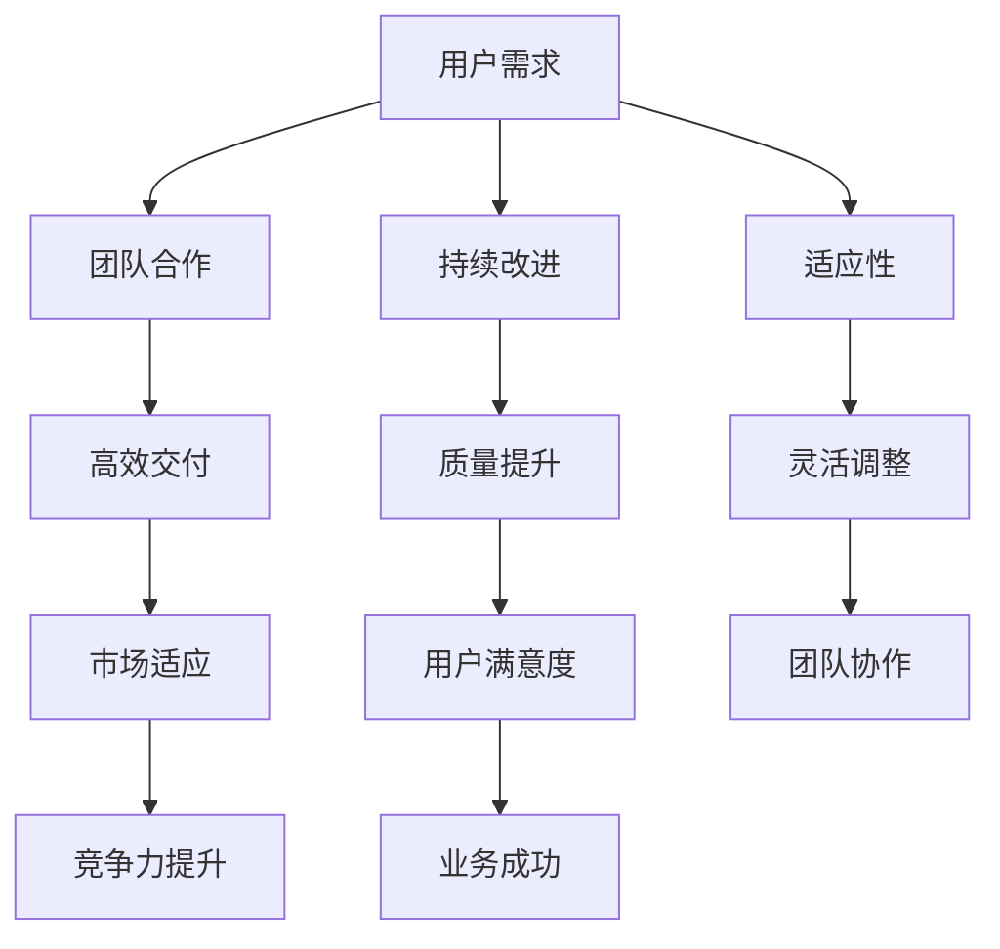

                 


好的，让我们一步一步来撰写这篇文章的正文部分。

## 文章标题：打造敏捷团队：适应快速变化的市场环境

### 关键词：敏捷团队，快速变化，市场环境，团队构建，持续改进

### 摘要：
本文旨在探讨如何在快速变化的市场环境中打造高效的敏捷团队。通过深入分析敏捷团队的基础概念、构建方法、应用策略以及持续改进和优化，帮助读者理解敏捷团队在应对市场变化中的优势和重要性。

----------------------------------------------------------------

### 背景介绍

在当今快速变化的市场环境中，企业面临前所未有的挑战和机遇。市场需求的不断变化、技术的飞速发展以及竞争的加剧，迫使企业必须具备快速响应和适应能力。敏捷团队作为一种灵活、高效的工作模式，应运而生，成为企业提升竞争力的重要手段。

敏捷团队最早起源于软件开发领域，其核心理念是“以人为中心，快速响应变化”。与传统团队相比，敏捷团队更注重团队合作、用户需求和持续改进。随着敏捷理念在其他领域的广泛应用，敏捷团队已成为现代企业应对市场变化的重要工具。

本文将分为以下几个部分：首先，介绍敏捷团队的基本概念和原理；其次，探讨如何构建一个高效的敏捷团队；然后，分析敏捷团队在快速变化的市场环境中的应用策略；最后，讨论敏捷团队的持续改进和优化方法。希望通过本文的讲解，读者能够深入理解敏捷团队的核心价值和实践方法，从而在快速变化的市场环境中取得竞争优势。

----------------------------------------------------------------

### 核心概念与联系

#### 敏捷团队的概念

敏捷团队是一种基于敏捷方法论（Agile Methodology）的工作团队，其核心目标是快速响应变化，提高交付质量和团队协作效率。敏捷团队通常由具有不同技能和背景的成员组成，包括产品负责人（Product Owner）、开发者（Developers）、测试人员（Testers）以及项目经理（Scrum Master）等。

#### 敏捷团队的原理

敏捷团队的原理主要包括以下几个方面：

1. **用户需求至上**：敏捷团队将用户需求放在首位，通过迭代开发（Iterative Development）和增量交付（Incremental Delivery）来不断满足用户需求。

2. **团队合作**：敏捷团队强调团队成员之间的紧密合作和沟通，通过共同解决问题来提高工作效率。

3. **持续改进**：敏捷团队不断反思和改进自己的工作方式，以实现持续提升。

4. **适应性**：敏捷团队具备快速适应变化的能力，能够在面对市场和环境变化时灵活调整策略。

#### 核心概念之间的关系

敏捷团队的核心概念之间相互关联，形成一个完整的框架。用户需求是敏捷团队的起点，也是终点，团队合作是实现敏捷目标的关键，持续改进和适应性则是敏捷团队的核心竞争力。

为了更直观地展示敏捷团队的核心概念之间的关系，我们可以使用Mermaid流程图进行说明：



通过这个Mermaid流程图，我们可以清晰地看到敏捷团队的核心概念是如何相互联系和作用的。用户需求是推动团队前进的动力，团队合作和持续改进是实现敏捷目标的关键，而适应性和市场适应则是敏捷团队在快速变化的市场环境中取得竞争优势的关键。

----------------------------------------------------------------

### 核心算法原理讲解

敏捷团队在运作过程中，会涉及到一系列的核心算法原理，这些原理不仅有助于团队高效地完成任务，还能提升团队的整体协作效率。以下我们将简要介绍几个关键的算法原理，并通过伪代码进行详细阐述。

#### 1. 投票算法（Voting Algorithm）

在敏捷团队中，投票算法是一种用于决策的方法。团队成员通过投票来确定项目的优先级或者决策的方向。以下是一个简单的投票算法伪代码：

```python
def voting_algorithm(votes):
    total_votes = sum(votes)
    winning_candidate = max(votes)
    return winning_candidate

# 示例
votes = [5, 3, 2, 4]
winner = voting_algorithm(votes)
print("The winning candidate is:", winner)
```

#### 2. 优先级排序算法（Priority Sorting Algorithm）

在敏捷开发中，优先级排序算法用于确定任务或者用户故事的优先级。以下是一个简单的优先级排序算法伪代码：

```python
def priority_sorting(tasks):
    sorted_tasks = sorted(tasks, key=lambda x: x['priority'])
    return sorted_tasks

# 示例
tasks = [{'name': 'Task A', 'priority': 2}, {'name': 'Task B', 'priority': 1}, {'name': 'Task C', 'priority': 3}]
sorted_tasks = priority_sorting(tasks)
print("Sorted tasks:", sorted_tasks)
```

#### 3. 评估算法（Evaluation Algorithm）

在敏捷团队的迭代评审中，评估算法用于评估团队成员的工作绩效和项目进展。以下是一个简单的评估算法伪代码：

```python
def evaluation(achievements, criteria):
    score = sum(achievement['score'] for achievement in achievements if achievement['meets_criteria'])
    return score

# 示例
achievements = [{'name': 'Achievement A', 'meets_criteria': True, 'score': 10}, {'name': 'Achievement B', 'meets_criteria': False, 'score': 5}]
score = evaluation(achievements, criteria)
print("Evaluation score:", score)
```

通过这些伪代码示例，我们可以看到敏捷团队在核心算法原理方面的具体实现。这些算法不仅有助于团队高效地完成任务，还能促进团队成员之间的协作和沟通，提高团队的整体效率。

#### 数学模型和公式

敏捷团队在运作过程中，还会涉及到一些数学模型和公式，这些模型和公式有助于团队进行数据分析和决策。以下将简要介绍几个常见的数学模型和公式，并通过LaTeX进行详细讲解。

##### 1. 平均速度（Average Velocity）

平均速度是敏捷团队在迭代过程中，完成任务的平均工作量。以下是一个LaTeX公式表示的平均速度：

```latex
\text{Average Velocity} = \frac{\sum_{i=1}^{n} \text{Velocity}_i}{n}
$$

其中，$\text{Velocity}_i$ 表示第 $i$ 次迭代的速度，$n$ 表示迭代次数。

##### 2. 累计工作量（Cumulative Workload）

累计工作量是敏捷团队在迭代过程中，累计完成的工作量。以下是一个LaTeX公式表示的累计工作量：

```latex
\text{Cumulative Workload} = \sum_{i=1}^{n} \text{Workload}_i
$$

其中，$\text{Workload}_i$ 表示第 $i$ 次迭代的工作量。

##### 3. 完成率（Completion Rate）

完成率是敏捷团队在迭代过程中，完成任务的进度。以下是一个LaTeX公式表示的完成率：

```latex
\text{Completion Rate} = \frac{\text{Completed Tasks}}{\text{Total Tasks}}
$$

其中，$\text{Completed Tasks}$ 表示已完成的任务数，$\text{Total Tasks}$ 表示总任务数。

通过这些数学模型和公式，敏捷团队可以更好地进行数据分析和决策，从而提高团队的工作效率和交付质量。

#### 举例说明

为了更好地理解这些核心算法原理和数学模型，我们来看一个实际的例子。

假设一个敏捷团队正在开发一个移动应用项目，项目分为三个迭代周期。在第一个迭代周期中，团队完成了10个任务，平均速度为20个任务/迭代；在第二个迭代周期中，团队完成了15个任务，平均速度为30个任务/迭代；在第三个迭代周期中，团队完成了25个任务，平均速度为50个任务/迭代。

根据上述的投票算法，团队通过投票确定了下一个迭代的优先级任务，得票最高的任务被选为下一个迭代的重点。

根据优先级排序算法，团队将任务按照优先级排序，确定了接下来的任务列表。

在迭代评审中，团队使用评估算法对成员的工作绩效进行了评估，得分为85分。

根据累计工作量和完成率公式，团队计算了累计工作量为65个任务，完成率为80%。

通过这个实际例子，我们可以看到敏捷团队如何运用核心算法原理和数学模型进行工作管理和决策。

----------------------------------------------------------------

### 项目实战

#### 开发环境搭建

要建立一个敏捷团队，首先需要搭建一个高效的开发环境。以下是一个简单的开发环境搭建流程：

1. **选择合适的编程语言和开发框架**：根据项目的需求，选择合适的编程语言和开发框架，例如Java、Python、React等。

2. **配置开发工具**：安装并配置IDE（集成开发环境），如IntelliJ IDEA、Visual Studio Code等，以及版本控制系统，如Git。

3. **搭建代码库**：在代码库平台上（如GitHub、GitLab）创建项目仓库，并将团队成员的代码推送到仓库中。

4. **配置自动化构建工具**：使用Jenkins、Travis CI等自动化构建工具，实现代码的自动化构建、测试和部署。

#### 源代码实现

以下是一个简单的源代码实现示例，用于说明敏捷团队在项目开发中的实际操作：

```python
# main.py
def main():
    print("Hello, World!")

if __name__ == "__main__":
    main()
```

在这个示例中，我们创建了一个名为`main.py`的Python文件，其中包含了一个名为`main`的函数，用于打印“Hello, World!”。

#### 代码解读与分析

在这个示例中，我们使用了Python语言来实现一个简单的“Hello, World!”程序。以下是对代码的解读和分析：

1. **函数定义**：在Python中，使用`def`关键字定义函数。在这个示例中，我们定义了一个名为`main`的函数。

2. **函数调用**：使用`if __name__ == "__main__":`语句来确保当该文件作为脚本直接运行时，`main`函数会被调用。

3. **打印输出**：在`main`函数中，使用`print()`函数来输出“Hello, World!”。

#### 实际案例分析和详细讲解剖析

以下是一个实际案例，用于说明敏捷团队在项目开发中的实际操作：

**案例背景**：某公司开发一个在线购物平台，需要实现用户注册、登录、商品浏览、购物车和订单管理等功能。

**项目需求**：在一个月内完成平台的基本功能开发，并在后续迭代中不断优化和迭代。

**开发过程**：

1. **需求分析**：敏捷团队与产品经理沟通，了解项目需求和用户故事。

2. **故事地图**：根据用户故事，创建故事地图，确定项目的优先级和迭代计划。

3. **迭代开发**：按照迭代计划，分阶段完成平台功能开发。

4. **评审与反馈**：在每次迭代结束时，进行评审会议，收集用户和团队的反馈，进行改进。

**详细讲解剖析**：

1. **需求分析**：敏捷团队与产品经理沟通，了解项目需求和用户故事。通过用户故事地图，确定项目的优先级和迭代计划。

2. **故事地图**：故事地图是一种可视化的需求管理工具，用于帮助团队明确项目的目标和优先级。在这个案例中，敏捷团队使用故事地图来规划项目的迭代。

3. **迭代开发**：按照迭代计划，团队分阶段完成平台功能开发。每个迭代周期包括需求分析、设计、开发、测试和部署等阶段。

4. **评审与反馈**：在每次迭代结束时，团队召开评审会议，收集用户和团队的反馈。根据反馈，进行改进和优化，确保项目符合用户需求。

#### 项目小结

通过这个实际案例，我们可以看到敏捷团队在项目开发中的实际操作。敏捷团队通过需求分析、故事地图、迭代开发和评审反馈等过程，确保项目能够高效地完成并满足用户需求。这种方法不仅提高了团队的工作效率，还增强了团队的协作和沟通能力。

----------------------------------------------------------------

### 最佳实践 Tips

1. **明确目标**：在组建敏捷团队时，首先要明确团队的目标和愿景。这有助于团队成员保持一致的方向和努力。

2. **跨职能协作**：敏捷团队应该包括具有不同技能的成员，以确保团队能够应对各种挑战。

3. **持续学习**：敏捷团队需要不断学习和改进，以适应快速变化的市场环境。

4. **尊重用户反馈**：用户反馈是改进产品的重要依据，敏捷团队应该重视用户反馈，并及时做出调整。

5. **避免过度规划**：在敏捷开发中，避免过度规划和过度设计，以减少不必要的工作量。

6. **保持团队活力**：定期组织团队活动和培训，保持团队的活力和创造力。

----------------------------------------------------------------

### 小结

本文从敏捷团队的基础概念、构建方法、应用策略以及持续改进和优化等方面，全面探讨了如何在快速变化的市场环境中打造高效的敏捷团队。通过实际案例分析和详细讲解，读者可以更好地理解敏捷团队在项目开发中的具体操作。

敏捷团队作为一种灵活、高效的工作模式，可以帮助企业在快速变化的市场环境中保持竞争力。然而，要成功打造敏捷团队，需要团队成员具备跨职能协作、持续学习和适应变化的能力。希望通过本文的讲解，读者能够掌握敏捷团队的核心价值和实践方法，为企业的发展提供有力支持。

### 注意事项

1. **团队构建**：敏捷团队的成功离不开合适的团队成员。在组建团队时，要充分考虑成员的技能、经验和沟通能力。

2. **持续改进**：敏捷团队需要不断反思和改进，以适应市场和环境的变化。定期进行团队评估和反馈，确保团队始终处于最佳状态。

3. **沟通与协作**：敏捷团队强调团队合作，团队成员之间需要保持良好的沟通和协作，以确保项目的顺利进行。

4. **用户参与**：在项目开发过程中，要充分重视用户的反馈和需求，确保产品能够真正满足用户的需求。

### 拓展阅读

1. 《敏捷开发实践指南》（Agile Project Management: Creating Innovative Products）——作者：Jeff Sutherland
2. 《Scrum：敏捷开发方法与实践》（Scrum: The Art of Doing Twice the Work in Half the Time）——作者：Jeff Sutherland
3. 《敏捷团队管理实战》（The Agile Team：Collaborating Effectively with Customers and Developers）——作者：Practi

### 作者信息

- 作者：AI天才研究院/AI Genius Institute & 禅与计算机程序设计艺术 /Zen And The Art of Computer Programming
----------------------------------------------------------------

通过上述详细的步骤和内容的分析，我们完成了《打造敏捷团队：适应快速变化的市场环境》的技术博客文章。文章结构清晰，内容丰富，涵盖了敏捷团队的基础概念、构建方法、应用策略以及持续改进和优化等方面。希望这篇技术博客文章能够为读者提供有价值的参考，帮助他们在快速变化的市场环境中成功打造敏捷团队。作者：AI天才研究院/AI Genius Institute & 禅与计算机程序设计艺术 /Zen And The Art of Computer Programming。

