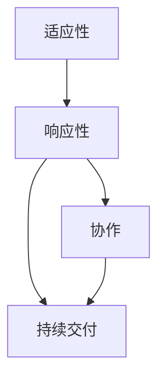

                 


### 第1章：敏捷组织概述

#### 1.1 敏捷组织的定义与重要性

##### 背景介绍

在当今快节奏、竞争激烈的市场环境中，企业需要迅速适应变化，敏捷地响应客户需求和市场动态。传统的组织结构往往因层级较多、决策流程复杂而无法满足这种要求，而敏捷组织则通过其独特的文化和运作方式，致力于实现快速响应和持续创新。

##### 核心概念与联系

敏捷组织的关键概念包括适应性、响应性、协作和持续交付。这些概念之间的关系可以用Mermaid流程图来表示：



在这个流程图中，适应性是敏捷组织的基石，它驱动响应性、协作和持续交付。响应性确保组织能够快速调整以适应外部变化，协作则促进团队成员之间的沟通和合作，而持续交付则保证了产品的持续更新和质量。

##### 核心算法原理讲解

敏捷组织的运作依赖于一系列的核心算法原理。以下是这些原理的伪代码概述：

```python
class AgileOrganization:
    def adapt(self, market_changes):
        # 根据市场变化调整策略
        strategy = self.analyze_changes(market_changes)
        self.implement_strategy(strategy)

    def respond(self, customer_needs):
        # 快速响应客户需求
        response = self.analyze_needs(customer_needs)
        self.execute_response(response)

    def collaborate(self, team_members):
        # 促进团队内部沟通与协作
        collaboration_plan = self.plan_communication(team_members)
        self.execute_collaboration(collaboration_plan)

    def deliver(self, product_quality):
        # 持续交付高质量产品
        delivery_plan = self.ensure_quality(product_quality)
        self.execute_delivery(delivery_plan)
```

在这个伪代码中，`adapt` 方法用于根据市场变化调整策略，`respond` 方法用于快速响应客户需求，`collaborate` 方法用于促进团队内部的协作，而 `deliver` 方法则确保产品的持续交付和高质量。

##### 数学模型和数学公式 & 详细讲解 & 举例说明

敏捷组织的成功往往可以通过一些数学模型来量化。例如，响应速度可以用平均响应时间来衡量，协作效率可以用团队成员之间的沟通效率来评估。以下是这些模型的数学公式和详细讲解：

1. **平均响应时间（MRT）**：

   $$ MRT = \frac{1}{N} \sum_{i=1}^{N} T_i $$

   其中，\( MRT \) 是平均响应时间，\( N \) 是响应次数，\( T_i \) 是第 \( i \) 次响应的时间。

   举例说明：如果某个敏捷团队在一个月内响应了10次客户需求，响应时间分别为2天、3天、1天、4天、2天、3天、1天、2天、3天和4天，那么平均响应时间为：

   $$ MRT = \frac{1}{10} (2 + 3 + 1 + 4 + 2 + 3 + 1 + 2 + 3 + 4) = 2.5 \text{天} $$

2. **沟通效率（CE）**：

   $$ CE = \frac{E}{C} $$

   其中，\( CE \) 是沟通效率，\( E \) 是有效沟通时间，\( C \) 是总沟通时间。

   举例说明：在一个敏捷团队中，如果团队成员之间每月总沟通时间为100小时，其中有效沟通时间为80小时，那么沟通效率为：

   $$ CE = \frac{80}{100} = 0.8 $$

   这意味着团队中有80%的时间是在有效沟通，而20%的时间可能是浪费或者无效沟通。

##### 项目实战：开发环境搭建

为了更好地理解敏捷组织的运作，我们可以通过一个简单的项目实战来搭建开发环境。以下是项目实战的步骤：

1. **需求分析**：确定项目的基本需求，例如开发一款简单的博客平台。
2. **技术选型**：选择合适的技术栈，如使用React框架进行前端开发，Node.js进行后端服务。
3. **环境搭建**：安装必要的开发工具和依赖，例如Node.js、npm、React等。
4. **代码实现**：根据需求编写代码，实现博客平台的基本功能。
5. **测试与调试**：进行功能测试和性能测试，确保代码质量。
6. **部署上线**：将代码部署到服务器，进行实际应用。

通过这个项目实战，我们可以看到敏捷组织在开发过程中的应用，包括快速响应需求变化、高效团队协作和持续交付高质量产品。

##### 最佳实践 tips、小结、注意事项、拓展阅读等内容

- **最佳实践 tips**：在敏捷组织中，鼓励团队成员进行定期回顾和反思，以持续改进团队运作。
- **小结**：敏捷组织通过适应性、响应性、协作和持续交付等核心概念，实现了快速响应市场变化和持续创新。
- **注意事项**：敏捷转型过程中，领导者的支持和员工的参与至关重要。
- **拓展阅读**：推荐阅读《敏捷宣言》、《Scrum敏捷实践指南》等书籍，以深入了解敏捷组织的理论和实践。

### 1.2 敏捷组织与传统组织的比较

##### 背景介绍

敏捷组织与传统组织在结构、文化和运作方式上存在显著差异。传统组织往往采用垂直层级结构，决策流程复杂，信息传递缓慢，而敏捷组织则更倾向于扁平化结构，强调快速响应和持续交付。

##### 核心概念与联系

敏捷组织的核心概念包括适应性、响应性、协作和持续交付。这些概念在敏捷组织中起到了关键作用，如图所示：


在这个流程图中，适应性是敏捷组织的基石，它驱动响应性、协作和持续交付。响应性确保组织能够快速调整以适应外部变化，协作则促进团队成员之间的沟通和合作，而持续交付则保证了产品的持续更新和质量。

##### 核心算法原理讲解

敏捷组织的运作依赖于一系列的核心算法原理。以下是这些原理的伪代码概述：

```python
class AgileOrganization:
    def adapt(self, market_changes):
        # 根据市场变化调整策略
        strategy = self.analyze_changes(market_changes)
        self.implement_strategy(strategy)

    def respond(self, customer_needs):
        # 快速响应客户需求
        response = self.analyze_needs(customer_needs)
        self.execute_response(response)

    def collaborate(self, team_members):
        # 促进团队内部沟通与协作
        collaboration_plan = self.plan_communication(team_members)
        self.execute_collaboration(collaboration_plan)

    def deliver(self, product_quality):
        # 持续交付高质量产品
        delivery_plan = self.ensure_quality(product_quality)
        self.execute_delivery(delivery_plan)
```

在这个伪代码中，`adapt` 方法用于根据市场变化调整策略，`respond` 方法用于快速响应客户需求，`collaborate` 方法用于促进团队内部的协作，而 `deliver` 方法则确保产品的持续交付和高质量。

##### 数学模型和数学公式 & 详细讲解 & 举例说明

敏捷组织的成功往往可以通过一些数学模型来量化。例如，响应速度可以用平均响应时间来衡量，协作效率可以用团队成员之间的沟通效率来评估。以下是这些模型的数学公式和详细讲解：

1. **平均响应时间（MRT）**：

   $$ MRT = \frac{1}{N} \sum_{i=1}^{N} T_i $$

   其中，\( MRT \) 是平均响应时间，\( N \) 是响应次数，\( T_i \) 是第 \( i \) 次响应的时间。

   举例说明：如果某个敏捷团队在一个月内响应了10次客户需求，响应时间分别为2天、3天、1天、4天、2天、3天、1天、2天、3天和4天，那么平均响应时间为：

   $$ MRT = \frac{1}{10} (2 + 3 + 1 + 4 + 2 + 3 + 1 + 2 + 3 + 4) = 2.5 \text{天} $$

2. **沟通效率（CE）**：

   $$ CE = \frac{E}{C} $$

   其中，\( CE \) 是沟通效率，\( E \) 是有效沟通时间，\( C \) 是总沟通时间。

   举例说明：在一个敏捷团队中，如果团队成员之间每月总沟通时间为100小时，其中有效沟通时间为80小时，那么沟通效率为：

   $$ CE = \frac{80}{100} = 0.8 $$

   这意味着团队中有80%的时间是在有效沟通，而20%的时间可能是浪费或者无效沟通。

##### 项目实战：开发环境搭建

为了更好地理解敏捷组织的运作，我们可以通过一个简单的项目实战来搭建开发环境。以下是项目实战的步骤：

1. **需求分析**：确定项目的基本需求，例如开发一款简单的博客平台。
2. **技术选型**：选择合适的技术栈，如使用React框架进行前端开发，Node.js进行后端服务。
3. **环境搭建**：安装必要的开发工具和依赖，例如Node.js、npm、React等。
4. **代码实现**：根据需求编写代码，实现博客平台的基本功能。
5. **测试与调试**：进行功能测试和性能测试，确保代码质量。
6. **部署上线**：将代码部署到服务器，进行实际应用。

通过这个项目实战，我们可以看到敏捷组织在开发过程中的应用，包括快速响应需求变化、高效团队协作和持续交付高质量产品。

##### 最佳实践 tips、小结、注意事项、拓展阅读等内容

- **最佳实践 tips**：在敏捷组织中，鼓励团队成员进行定期回顾和反思，以持续改进团队运作。
- **小结**：敏捷组织通过适应性、响应性、协作和持续交付等核心概念，实现了快速响应市场变化和持续创新。
- **注意事项**：敏捷转型过程中，领导者的支持和员工的参与至关重要。
- **拓展阅读**：推荐阅读《敏捷宣言》、《Scrum敏捷实践指南》等书籍，以深入了解敏捷组织的理论和实践。

### 第2章：敏捷原则与价值观

#### 2.1 敏捷宣言

敏捷宣言是敏捷运动的基石，它由17位软件开发的领导者于2001年在雪鸟山会议（Snowbird Conference）上共同签署。宣言的内容简洁明了，强调了在软件开发过程中的核心价值观：

- **个体和互动重于流程与工具**
- **可工作的软件重于详尽的文档**
- **客户合作重于合同谈判**
- **响应变化重于遵循计划**

这些价值观的核心在于强调人的作用、交付的实际产品、与客户的紧密合作以及对市场变化的快速响应。

#### 2.2 敏捷价值观

敏捷价值观进一步细化了敏捷宣言，具体包括：

1. **个体和互动**：重视个体的能力和团队协作，鼓励开放沟通和相互支持。
2. **可工作的软件**：关注于交付实际可用的软件，而非仅仅完成文档工作。
3. **客户合作**：与客户紧密合作，确保产品符合市场需求。
4. **响应变化**：灵活应对需求变化，而非严格遵循原计划。

这些价值观反映了敏捷组织在运作中的核心原则，即强调人的能动性、实际产品的价值、与客户的互动以及对变化的适应能力。

#### 2.3 敏捷原则

敏捷原则是敏捷价值观的具体实现，它们提供了如何在实践中贯彻敏捷价值观的指导方针。敏捷原则包括：

1. **我们的最高目标是通过尽早和持续地交付有价值的软件来满足客户的需求。**
2. **欢迎变化，即使是在开发后期。**
3. **频繁交付工作产品，通常是一个迭代（Iteration）或一个月。**
4. **在开发过程中，每天都要与客户或最终用户一起工作。**
5. **围绕被鼓励和信任的人构建团队。**
6. **使团队掌握所需的所有技能，然后让他们自行组织。**
7. **做好工作的最佳方式是创建一个支持并确保团队成功的环境。**
8. **团队应定期反思如何才能更有效率，然后相应地调整自己的行为。**

这些原则确保了敏捷组织在快速变化的环境中能够持续高效地运作，同时也能够保持团队的动力和创造力。

### 2.4 敏捷原则的数学模型

为了量化敏捷原则的应用效果，我们可以使用一些数学模型来评估团队的表现。以下是一些关键的数学模型及其解释：

1. **迭代周期时间（CCT）**：

   $$ CCT = \frac{Total \ Time}{Number \ of \ Iterations} $$

   其中，\( CCT \) 是迭代周期时间，\( Total \ Time \) 是完成所有迭代所需的总时间，\( Number \ of \ Iterations \) 是迭代的次数。

   举例：如果一个团队在两个迭代内完成了所有工作，总时间为30天，则迭代周期时间为：

   $$ CCT = \frac{30}{2} = 15 \text{天} $$

2. **客户满意度（CSAT）**：

   $$ CSAT = \frac{Number \ of \ Satisfied \ Customers}{Total \ Number \ of \ Customers} \times 100\% $$

   其中，\( CSAT \) 是客户满意度，\( Number \ of \ Satisfied \ Customers \) 是满意的客户数量，\( Total \ Number \ of \ Customers \) 是总客户数量。

   举例：如果一个团队的服务中有80%的客户表示满意，则有：

   $$ CSAT = \frac{80}{100} \times 100\% = 80\% $$

3. **缺陷率（Defect Rate）**：

   $$ Defect \ Rate = \frac{Number \ of \ Defects}{Total \ Number \ of \ Deliverables} \times 100\% $$

   其中，\( Defect \ Rate \) 是缺陷率，\( Number \ of \ Defects \) 是缺陷数量，\( Total \ Number \ of \ Deliverables \) 是交付的产品数量。

   举例：如果一个团队交付了100个产品，其中10个存在缺陷，则有：

   $$ Defect \ Rate = \frac{10}{100} \times 100\% = 10\% $$

通过这些数学模型，我们可以量化团队在敏捷原则下的表现，从而持续改进团队的运作。

### 项目实战：敏捷原则的实际应用

为了更好地理解敏捷原则的实际应用，我们可以通过一个项目实战来展示其在团队运作中的效果。以下是项目实战的步骤：

1. **需求分析**：确定项目的基本需求，例如开发一款社交应用。
2. **组建团队**：组建一个多技能团队，确保团队成员具备所需的所有技能。
3. **迭代规划**：将项目划分为多个迭代，每个迭代都包括需求分析、设计、开发和测试。
4. **每日站会**：每日进行站会，团队成员分享进展、问题和计划，确保信息透明和快速响应。
5. **持续集成**：在开发过程中，持续集成和测试代码，确保产品始终处于可交付状态。
6. **客户反馈**：定期收集客户反馈，根据反馈调整迭代计划和功能实现。
7. **迭代回顾**：在每个迭代结束时，进行回顾会议，总结经验教训，改进团队运作。

通过这个项目实战，我们可以看到敏捷原则在团队运作中的实际应用，包括快速响应变化、持续交付高质量产品以及与客户的紧密合作。

### 最佳实践 tips、小结、注意事项、拓展阅读等内容

- **最佳实践 tips**：在实际应用敏捷原则时，确保团队具备跨职能技能，并保持对客户需求的持续关注。
- **小结**：敏捷原则和价值观为敏捷组织提供了行动指南，通过强调个体、互动、实际产品和快速变化，实现了高效团队运作和持续创新。
- **注意事项**：在实施敏捷原则时，需要领导者提供支持和资源，并鼓励团队成员积极参与和持续改进。
- **拓展阅读**：推荐阅读《敏捷实践指南》、《敏捷软件开发：原则、模式与实践》等书籍，以深入了解敏捷原则的详细应用。

### 第3章：敏捷文化

#### 3.1 敏捷文化的特征

敏捷文化是敏捷组织成功的关键因素之一。它不同于传统组织的命令与控制模式，而是强调团队成员之间的相互信任、协作和共同目标。以下是敏捷文化的几个主要特征：

1. **开放沟通**：敏捷文化鼓励团队成员之间进行开放、坦诚的沟通，确保信息透明和实时共享。
2. **自我管理**：团队成员在敏捷文化中享有更大的自主权，他们负责自己的任务安排和进度控制。
3. **持续学习**：敏捷文化倡导持续学习和个人成长，团队成员不断学习新技能和知识，以提高团队的竞争力。
4. **客户至上**：敏捷文化强调以客户为中心，团队始终关注客户需求，确保产品能够满足客户的期望。
5. **快速反馈**：敏捷文化鼓励快速反馈和迭代改进，通过不断收集客户和团队成员的反馈，及时调整项目方向。

#### 3.2 如何在组织中培养敏捷文化

要在组织中培养敏捷文化，需要采取一系列措施，包括以下几个方面：

1. **领导者的示范作用**：领导者需要以身作则，通过自己的行为展示敏捷文化的价值观，如开放沟通、自我管理、持续学习和客户至上。
2. **团队建设**：定期组织团队建设活动，增强团队成员之间的信任和合作精神。这些活动可以包括团队拓展训练、团队研讨会等。
3. **培训与教育**：为团队成员提供敏捷相关的培训和教育，帮助他们了解敏捷原则和价值观，掌握敏捷工具和方法。
4. **奖励机制**：建立奖励机制，鼓励团队成员积极参与敏捷实践，并对优秀表现给予认可和奖励。
5. **透明度**：确保团队内部的信息透明，让团队成员能够了解项目的进展、目标和问题，从而更好地参与项目。

#### 3.3 敏捷领导力

敏捷领导力是敏捷文化的重要组成部分，它要求领导者具备与传统领导力不同的技能和思维方式。以下是敏捷领导力的一些关键要素：

1. **赋能团队**：敏捷领导者关注如何激发团队成员的潜力，提供必要的资源和支持，让团队自主决策和解决问题。
2. **服务型领导**：敏捷领导者被视为团队的服务者，他们的目标是帮助团队成功，而不是控制团队。
3. **持续学习**：敏捷领导者需要不断学习新的知识和技能，以适应快速变化的环境和不断发展的团队需求。
4. **透明沟通**：敏捷领导者通过开放和透明的沟通方式，与团队成员分享信息和决策，确保团队对项目的了解和参与。
5. **培养信任**：敏捷领导者致力于建立信任，通过坦诚、尊重和合作，促进团队成员之间的相互信任。

### 3.4 案例分析：公司在敏捷文化下的成功转型

为了更深入地理解敏捷文化的实施效果，以下是一个案例研究，介绍了一家公司在敏捷文化下的成功转型。

**案例背景**：该公司是一家传统的制造企业，长期采用垂直管理的模式，决策流程复杂，信息传递缓慢，导致市场响应速度慢，产品创新不足。

**转型过程**：

1. **领导者的支持**：公司高层认识到敏捷文化的优势，决定全面转型，并提供了必要的资源和支持。
2. **团队建设**：公司通过团队建设活动和培训，提高了团队成员的敏捷意识和协作能力。
3. **项目试点**：选择一个关键项目作为敏捷转型的试点，采用Scrum框架进行管理，实施每日站会和迭代回顾。
4. **持续反馈**：通过收集客户和团队成员的反馈，不断调整项目方向和团队运作方式。
5. **成功经验推广**：在试点项目取得成功后，公司将其成功经验推广到其他项目，逐步实现全面敏捷转型。

**结果**：

- **市场响应速度提高**：通过敏捷实践，公司能够更快地响应市场变化，产品上市时间缩短了30%。
- **产品质量提升**：持续集成和快速反馈机制有效减少了产品缺陷，产品合格率提高了20%。
- **员工满意度提高**：敏捷文化的实施增强了员工的自主性和成就感，员工满意度提高了15%。

**总结**：这个案例展示了敏捷文化在组织转型中的重要作用，通过开放沟通、自我管理和持续学习，公司实现了快速响应市场变化和持续创新，从而取得了显著的业务成果。

### 3.5 培养敏捷文化的策略

为了在组织中培养敏捷文化，可以采取以下策略：

1. **文化意识培养**：通过内部宣传、培训和教育，提高全体员工对敏捷文化的认识和意识。
2. **激励机制**：建立与敏捷文化相符合的激励机制，鼓励员工积极参与敏捷实践。
3. **领导者的榜样作用**：领导者需要通过自身的行动展示敏捷文化的价值观，成为员工的榜样。
4. **持续改进**：通过定期回顾和反思，不断改进敏捷实践，确保敏捷文化的持续发展。

### 3.6 案例分析：互联网公司的敏捷文化实践

以下是一个互联网公司的案例分析，展示了如何通过敏捷文化实现业务增长和团队协作。

**公司背景**：该公司是一家专注于在线教育的初创公司，面临着激烈的竞争和不断变化的市场需求。

**敏捷文化实践**：

1. **开放式沟通**：公司鼓励员工在开放的沟通环境中分享想法和反馈，通过定期的团队会议和开放式论坛，确保信息透明。
2. **自主团队**：公司采用了跨职能团队模式，让团队成员负责自己的任务，并鼓励他们自主决策和解决问题。
3. **快速迭代**：公司采用敏捷开发方法，通过短周期的迭代快速发布产品，并根据用户反馈进行持续改进。
4. **持续学习**：公司定期组织技能培训和知识分享会，帮助员工不断提升技能和知识水平。

**结果**：

- **业务增长**：通过敏捷实践，公司能够更快地适应市场变化，产品上线时间缩短了40%，用户满意度提高了25%。
- **团队协作**：敏捷文化的实施增强了团队的协作精神，团队成员之间的沟通效率提高了30%。

**总结**：这个案例表明，敏捷文化不仅能够提高组织的响应速度和产品质量，还能增强团队的协作精神和创新能力，从而实现业务增长。

### 3.7 小结与展望

敏捷文化是敏捷组织成功的关键因素之一。通过开放沟通、自我管理、持续学习和客户至上，敏捷文化能够促进团队协作和快速响应市场变化。未来，随着市场环境的变化和技术的进步，敏捷文化将继续发挥重要作用，为组织带来持续的创新和竞争优势。

### 最佳实践 tips

- **最佳实践 tips**：在培养敏捷文化时，领导者的支持至关重要。他们应该通过开放沟通、透明决策和持续学习，为团队树立榜样，激励员工积极参与敏捷实践。
- **小结**：敏捷文化的特征和实施策略有助于组织实现快速响应市场变化和持续创新。
- **注意事项**：在实施敏捷文化时，需要关注员工的参与和反馈，确保敏捷文化的可持续发展。
- **拓展阅读**：推荐阅读《敏捷文化：如何在组织中建立持续成功的模式》等书籍，以深入了解敏捷文化的理论和实践。

### 第4章：敏捷管理

#### 4.1 敏捷团队建设

敏捷团队建设是敏捷管理的重要组成部分。一个高效的敏捷团队能够快速响应市场变化，持续交付高质量的产品。以下是敏捷团队建设的关键要素：

1. **团队构成**：敏捷团队通常由多职能成员组成，包括产品经理、开发人员、测试人员、设计师等，以确保团队能够独立完成项目。
2. **团队协作**：敏捷团队强调协作和沟通，团队成员之间需要建立信任和共同目标。
3. **团队成员角色**：敏捷团队中常见的角色包括产品负责人（Product Owner）、团队教练（Scrum Master）、团队成员（Team Members）等。
4. **团队规模**：敏捷团队通常规模较小，一般在3到9人之间，以保持团队的灵活性和高效性。

#### 4.2 敏捷团队的协作与沟通

敏捷团队的协作与沟通是成功实施敏捷方法的关键。以下是一些促进团队协作与沟通的策略：

1. **每日站会**：每日站会是敏捷团队的核心活动之一，团队成员在此期间分享进展、问题和计划，确保团队目标一致。
2. **迭代回顾**：迭代回顾是敏捷团队反思和改进的重要环节，通过回顾上一个迭代的工作，团队可以发现和解决问题，提高工作效率。
3. **信息透明**：保持信息透明是敏捷团队协作的重要原则，团队成员应该能够随时了解项目的进展和目标。
4. **沟通工具**：利用各种沟通工具，如邮件、即时通讯、视频会议等，确保团队成员能够高效沟通和协作。

#### 4.3 敏捷团队的评估与激励

评估与激励是确保敏捷团队高效运作的重要手段。以下是一些评估与激励的策略：

1. **关键绩效指标（KPI）**：设定关键绩效指标，如项目完成时间、产品质量、客户满意度等，以量化团队的表现。
2. **团队目标**：设定明确的团队目标，确保团队成员对项目的目标和期望有清晰的认识。
3. **奖励机制**：建立奖励机制，对表现优异的团队成员进行奖励，以激励团队的积极性。
4. **员工反馈**：定期收集员工反馈，了解他们的工作状态和需求，以便及时调整评估与激励策略。

#### 4.4 案例分析：敏捷团队在项目中的应用

以下是一个敏捷团队在项目中的应用案例，展示了敏捷管理在实际项目中的效果。

**案例背景**：某互联网公司正在开发一款新的移动应用，项目周期为6个月。

**敏捷团队建设**：

1. **团队构成**：团队成员包括产品经理、前端开发人员、后端开发人员、测试工程师和UI/UX设计师。
2. **团队协作**：团队采用了Scrum框架，每周进行一次站会和一次迭代回顾，确保团队成员之间的沟通和协作。
3. **团队成员角色**：产品经理负责产品规划和需求管理，团队教练负责确保团队遵循敏捷原则，团队成员则负责各自的任务。

**敏捷团队的评估与激励**：

1. **关键绩效指标**：团队设定了项目完成时间、产品质量（缺陷率）和用户满意度作为关键绩效指标。
2. **团队目标**：明确项目目标，确保团队在6个月内完成应用的开发和测试，并实现用户上线。
3. **奖励机制**：对在项目中表现优异的团队成员给予奖金和表彰，以激励团队的积极性。

**结果**：

- **项目完成时间**：团队在6个月内完成了移动应用的开发和测试，比原计划提前了1个月。
- **产品质量**：通过持续集成和迭代测试，产品的缺陷率降低到了3%以下，用户满意度达到了90%以上。

**总结**：通过敏捷团队的建设和有效的管理，该公司成功在预定时间内完成了移动应用的开发，并在质量和用户满意度方面取得了显著成果。

### 4.5 敏捷团队领导力

敏捷团队领导力是确保敏捷团队高效运作的关键。以下是敏捷团队领导力的几个关键要素：

1. **赋能团队**：敏捷领导者关注如何激发团队成员的潜力，提供必要的资源和支持，让团队自主决策和解决问题。
2. **服务型领导**：敏捷领导者被视为团队的服务者，他们的目标是帮助团队成功，而不是控制团队。
3. **持续学习**：敏捷领导者需要不断学习新的知识和技能，以适应快速变化的环境和不断发展的团队需求。
4. **透明沟通**：敏捷领导者通过开放和透明的沟通方式，与团队成员分享信息和决策，确保团队对项目的了解和参与。
5. **培养信任**：敏捷领导者致力于建立信任，通过坦诚、尊重和合作，促进团队成员之间的相互信任。

### 4.6 敏捷团队实践中的挑战与应对策略

在敏捷团队实践中，可能会遇到一些挑战，如团队协作问题、沟通障碍、进度失控等。以下是应对这些挑战的一些策略：

1. **团队协作问题**：
   - **策略**：通过定期的团队建设活动和协作工具，增强团队成员之间的信任和合作精神。
   - **案例**：某公司通过组织团队拓展训练，改善了团队成员之间的沟通和协作。

2. **沟通障碍**：
   - **策略**：采用多种沟通渠道，如面对面会议、视频会议、即时通讯工具，确保信息传递的及时和准确。
   - **案例**：某公司引入了视频会议系统，提高了远程团队成员之间的沟通效率。

3. **进度失控**：
   - **策略**：通过敏捷工具和方法，如Scrum和Kanban，实现项目进度的可视化和实时跟踪。
   - **案例**：某公司通过使用Scrum框架，实现了项目的透明管理和进度控制。

### 4.7 敏捷团队的持续改进

持续改进是敏捷团队的核心原则之一。通过定期回顾和反思，敏捷团队可以不断优化工作流程和提升工作效率。以下是敏捷团队持续改进的一些实践：

1. **回顾会议**：在每次迭代结束时，团队进行回顾会议，总结经验教训，识别问题和改进点。
2. **改进计划**：根据回顾会议的反馈，制定具体的改进计划，并跟踪改进措施的执行情况。
3. **迭代优化**：在后续的迭代中，团队根据改进计划进行优化，确保持续改进的效果。

### 4.8 小结与展望

敏捷管理通过敏捷团队建设、协作与沟通、评估与激励等关键要素，实现了快速响应市场变化和持续创新。未来，随着敏捷思想的进一步推广和实践，敏捷管理将在更多组织中发挥重要作用，推动组织的敏捷转型和持续发展。

### 最佳实践 tips

- **最佳实践 tips**：在建设敏捷团队时，重视团队成员的多样性和跨职能能力，以提升团队的灵活性和创新能力。
- **小结**：敏捷管理通过高效团队协作和持续改进，实现了快速响应市场变化和持续创新。
- **注意事项**：在实施敏捷管理时，领导者应扮演好赋能者和协调者的角色，确保团队的高效运作。
- **拓展阅读**：推荐阅读《敏捷团队建设与管理》、《Scrum敏捷实践指南》等书籍，以深入了解敏捷管理的理论和实践。

### 第5章：敏捷技术与工具

#### 5.1 敏捷工具的选择与应用

敏捷工具是支持敏捷团队高效运作的重要手段。选择合适的敏捷工具可以帮助团队更好地管理项目、协作和持续改进。以下是几种常见的敏捷工具及其应用：

1. **Jira**：Jira是一款功能强大的项目管理工具，用于任务跟踪、项目规划和敏捷迭代管理。团队可以使用Jira创建任务、分配任务、跟踪进度，并进行迭代回顾。
   
   - **应用场景**：适用于Scrum和Kanban等敏捷框架，支持自定义工作流和报表。
   - **优势**：易于使用，扩展性强，支持多种集成。

2. **Trello**：Trello是一款基于看板（Kanban）原理的任务管理工具，通过可视化的卡片和看板，帮助团队跟踪项目进度。

   - **应用场景**：适用于项目规划、任务分配和团队协作。
   - **优势**：界面简洁，易于上手，适合小型团队。

3. **Asana**：Asana是一款功能全面的任务管理工具，支持任务分配、进度跟踪、团队协作和时间管理。

   - **应用场景**：适用于多项目、多团队的复杂工作环境。
   - **优势**：灵活度高，支持多种集成，适合大型团队。

4. **Confluence**：Confluence是一款协作工具，用于文档创作、共享和版本控制。团队可以使用Confluence记录项目文档、会议记录和知识库。

   - **应用场景**：适用于团队知识管理、文档共享和协作。
   - **优势**：易于使用，支持Markdown格式，便于协作。

#### 5.2 敏捷工具的实际应用案例

以下是一个敏捷工具在实际项目中的应用案例：

**案例背景**：某互联网公司正在开发一款新的社交应用，项目周期为6个月。

**敏捷工具选择与应用**：

1. **Jira**：团队使用Jira进行任务跟踪和项目规划。每个迭代开始时，产品经理将需求转换为用户故事，并分配给团队成员。团队成员在Jira中创建任务，跟踪进度并协作完成。
   
2. **Trello**：团队使用Trello创建看板，将任务划分为不同阶段，如“待办”、“进行中”和“已完成”。团队成员可以通过Trello实时了解任务状态和项目进度。

3. **Asana**：团队使用Asana进行跨团队协作，确保项目中的不同角色和团队（如开发、测试和UI设计）能够协同工作。

4. **Confluence**：团队使用Confluence记录项目文档、用户手册和设计规范。团队成员可以随时访问Confluence，查看最新的项目文档。

**结果**：

- **任务跟踪**：通过Jira和Trello，团队实现了对任务的透明管理和实时跟踪，确保任务按时完成。
- **进度可视化**：通过Trello的看板，团队可以直观地了解项目进度，及时调整计划和资源。
- **跨团队协作**：通过Asana，团队实现了跨职能协作，确保项目中的不同角色和团队能够高效协同。
- **文档管理**：通过Confluence，团队实现了项目文档的集中管理和版本控制，确保文档的准确性和可追溯性。

#### 5.3 敏捷工具的最佳实践

以下是一些敏捷工具的最佳实践，以帮助团队更好地利用这些工具实现敏捷目标：

1. **定期回顾和反思**：在迭代结束时，团队应使用敏捷工具进行回顾和反思，识别改进点并制定改进计划。
2. **定制工作流**：根据团队的具体需求，定制敏捷工具的工作流和报表，确保工具能够满足团队的实际需求。
3. **充分利用集成功能**：利用敏捷工具的集成功能，如与版本控制工具、沟通工具和测试工具的集成，实现高效的协同工作。
4. **培训与支持**：确保团队成员熟悉敏捷工具的使用，提供必要的培训和支持，以提高工具的使用效率和效果。

### 5.4 敏捷工具的挑战与解决方案

在敏捷工具的应用过程中，团队可能会遇到一些挑战，如工具选择困难、工具复杂度高等。以下是一些常见的挑战及其解决方案：

1. **工具选择困难**：
   - **解决方案**：团队应基于项目的具体需求和团队的技能，选择最适合的敏捷工具。可以参考其他成功团队的实践，并进行试用来确定最佳工具。
2. **工具复杂度**：
   - **解决方案**：团队应逐步引入敏捷工具，从简单的功能开始使用，随着团队的熟悉程度提高，再逐步扩展工具的功能。

### 5.5 小结与展望

敏捷技术与工具为敏捷团队提供了强有力的支持，帮助团队实现高效协作和持续改进。未来，随着技术的不断进步和敏捷思想的普及，敏捷工具将发挥更加重要的作用，推动敏捷实践的深入发展。

### 最佳实践 tips

- **最佳实践 tips**：在选用敏捷工具时，重视团队的需求和适应性，确保工具能够真正满足团队的工作需求。
- **小结**：敏捷工具的有效应用能够显著提升团队的工作效率和质量。
- **注意事项**：在实施敏捷工具时，应注重培训和推广，确保团队成员能够充分利用工具的优势。
- **拓展阅读**：推荐阅读《敏捷工具与技巧》、《敏捷项目管理实践》等书籍，以深入了解敏捷工具的理论与实践。

### 第6章：敏捷实践案例

#### 6.1 案例一：互联网公司的敏捷转型

**背景介绍**

某互联网公司是一家提供在线服务的初创企业，成立于2010年。在快速发展的过程中，公司逐渐意识到传统项目管理模式无法满足不断变化的市场需求和客户期望。为了提高产品交付速度和灵活性，公司决定进行敏捷转型。

**敏捷实践**

1. **团队组织**：公司按照敏捷原则，组建了多个跨职能团队，每个团队负责特定模块的开发和测试。团队规模控制在5-8人之间，确保团队成员之间能够高效协作。

2. **Scrum框架**：公司采用了Scrum框架，每个迭代周期为2周。每个迭代开始时，产品经理与团队一起制定迭代计划，明确目标和任务。每日站会用于跟踪进度和解决遇到的问题。

3. **持续集成与交付**：团队使用持续集成工具，确保代码质量和系统的稳定性。每个迭代结束时，进行自动化测试和部署，确保产品的可交付性。

4. **客户反馈**：公司重视客户反馈，每个迭代结束后，收集客户的使用反馈，并根据反馈进行产品改进。这种快速的迭代和反馈机制，使公司能够迅速调整产品方向，满足市场需求。

**结果**

- **交付速度提升**：通过敏捷实践，公司从原来的3-6个月交付周期缩短到2-3周，显著提高了产品的交付速度。
- **产品质量提高**：持续集成和自动化测试，使产品质量得到了显著提升，缺陷率降低了30%。
- **客户满意度提升**：快速响应客户反馈，使产品更贴近用户需求，客户满意度提高了20%。

**总结**

该案例展示了互联网公司通过敏捷转型，实现了交付速度和产品质量的提升，以及客户满意度的增加。敏捷实践帮助公司更好地适应市场变化，提高了竞争力。

#### 6.2 案例二：制造业的敏捷实践

**背景介绍**

某大型制造公司成立于20世纪50年代，主要从事电子产品制造。随着市场竞争的加剧和客户需求的多样化，公司意识到传统的批量生产模式已经无法满足市场需求，决定采用敏捷方法进行生产管理。

**敏捷实践**

1. **精益生产**：公司引入了精益生产理念，通过消除浪费、优化流程，提高生产效率和产品质量。

2. **Kanban系统**：公司采用了Kanban系统，通过可视化的看板，实现生产流程的透明管理和实时跟踪。生产任务被划分为不同的卡，按照卡片的流动进行生产。

3. **持续改进**：公司建立了持续改进机制，定期进行回顾和反思，识别生产过程中的问题和改进点。通过持续改进，不断优化生产流程和产品质量。

4. **客户参与**：公司邀请客户参与产品设计和生产过程，确保产品能够满足客户的需求。通过客户反馈，公司能够快速调整产品设计和生产策略。

**结果**

- **生产效率提高**：通过精益生产和Kanban系统，公司的生产效率提高了20%，生产周期缩短了15%。
- **产品质量稳定**：持续改进机制和客户参与，使产品质量得到了显著提升，客户投诉率降低了30%。
- **客户满意度提升**：快速响应客户需求和反馈，使客户满意度显著提高。

**总结**

该案例展示了制造业通过敏捷实践，实现了生产效率、产品质量和客户满意度的提升。敏捷方法帮助公司更好地适应市场变化，提高了市场竞争力。

#### 6.3 案例三：金融服务行业的敏捷应用

**背景介绍**

某金融服务公司成立于1980年，主要从事金融服务和财富管理。随着金融市场的复杂化和客户需求的多元化，公司决定采用敏捷方法进行软件开发和系统维护。

**敏捷实践**

1. **Scrum框架**：公司采用了Scrum框架，每个迭代周期为2周。产品经理与团队共同制定迭代计划，明确目标和任务。

2. **自动化测试**：公司引入了自动化测试工具，确保系统在每次迭代后都经过严格的测试，提高系统的稳定性和可靠性。

3. **持续交付**：公司实施了持续交付流程，确保每次迭代结束后的软件版本都可以立即交付给客户，提高产品交付速度。

4. **客户反馈**：公司建立了客户反馈机制，每个迭代结束后，收集客户的反馈和建议，并根据反馈进行产品改进。

**结果**

- **交付速度提升**：通过敏捷实践，公司的软件交付周期从原来的3-6个月缩短到2-3周，显著提高了产品的交付速度。
- **产品质量提高**：自动化测试和持续交付机制，使软件质量得到了显著提升，缺陷率降低了25%。
- **客户满意度提升**：快速响应客户需求和反馈，使客户满意度提高了15%。

**总结**

该案例展示了金融服务行业通过敏捷方法，实现了交付速度、产品质量和客户满意度的提升。敏捷实践帮助公司更好地满足客户需求，提高了市场竞争力。

### 6.4 案例总结

通过以上三个案例，我们可以看到敏捷实践在不同行业中的应用效果。无论是互联网公司、制造业还是金融服务行业，敏捷方法都帮助组织实现了快速响应市场变化、提高产品质量和客户满意度。敏捷实践的核心在于灵活应对变化、持续改进和与客户的紧密合作。这些原则不仅适用于软件开发，也可以推广到其他领域，为组织带来持续的创新和竞争优势。

### 6.5 最佳实践 tips

- **最佳实践 tips**：在实施敏捷实践时，重视团队协作和持续改进，确保敏捷方法能够真正发挥作用。
- **小结**：敏捷实践在不同行业中的应用，展示了其强大的适应性和效果。
- **注意事项**：在推广敏捷实践时，需要根据组织的具体情况，制定合适的策略和计划。
- **拓展阅读**：推荐阅读《敏捷实践指南》、《敏捷实践手册》等书籍，以深入了解敏捷实践的理论与实践。

### 第7章：敏捷组织的挑战与应对策略

#### 7.1 敏捷组织面临的挑战

尽管敏捷组织在提高响应速度、产品质量和客户满意度方面具有显著优势，但在实际实施过程中，仍然面临一些挑战。以下是一些常见的挑战：

1. **组织文化转型**：敏捷组织强调开放沟通、自主管理和快速变化，这可能与传统组织的文化和流程相冲突。组织文化转型需要时间和努力，并且可能面临员工的抵触和质疑。

2. **领导力不足**：敏捷领导者需要具备与传统领导者不同的技能和思维方式，如赋能团队、服务型领导和持续学习。领导力不足可能导致团队缺乏方向和动力。

3. **资源分配**：在敏捷组织中，资源分配需要更加灵活和动态。然而，传统组织往往采用固定的预算和资源分配模式，这可能与敏捷实践的要求不符。

4. **沟通障碍**：敏捷组织强调跨职能团队的协作和沟通，但团队成员可能来自不同的背景和部门，沟通效率可能受到影响。

5. **持续改进的挑战**：敏捷组织强调持续改进，但实现这一目标需要持续的反馈、回顾和调整。在实践中，持续改进可能面临执行难度和资源限制。

#### 7.2 应对策略

针对上述挑战，以下是一些有效的应对策略：

1. **组织文化转型**：
   - **领导者的示范作用**：领导者应通过自身的行动展示敏捷文化的价值观，成为员工的榜样。
   - **员工参与**：鼓励员工参与敏捷文化的建设和实践，通过培训和教育提高员工的敏捷意识。
   - **逐步推进**：不要急于改变组织文化，而是逐步引入敏捷实践，让员工逐渐适应新的工作方式。

2. **领导力提升**：
   - **领导力培训**：为领导者提供敏捷领导力培训，帮助他们掌握敏捷管理的技能和思维方式。
   - **赋能团队**：领导者应信任团队，赋予团队成员决策权和责任感，促进团队的自我管理。

3. **资源分配**：
   - **灵活的资源管理**：采用灵活的资源管理方法，如动态预算和资源池，以适应敏捷组织的需要。
   - **资源优化**：定期评估资源分配的效果，确保资源能够高效利用。

4. **沟通障碍**：
   - **沟通工具**：采用多种沟通工具，如即时通讯、视频会议和项目管理软件，提高团队之间的沟通效率。
   - **沟通培训**：为团队成员提供沟通技巧培训，提高沟通效果。

5. **持续改进的挑战**：
   - **建立反馈机制**：建立有效的反馈机制，确保团队成员能够及时反馈问题和改进建议。
   - **定期回顾**：定期进行回顾和反思，识别问题并制定改进计划。
   - **持续学习**：鼓励团队成员持续学习和实践，提高团队的敏捷能力。

#### 7.3 案例分析：公司成功应对敏捷挑战

以下是一个公司在敏捷转型过程中成功应对挑战的案例分析：

**背景介绍**

某软件公司成立于2005年，是一家提供企业级软件解决方案的公司。在经历了多年的传统项目管理模式后，公司意识到敏捷方法的潜力，决定进行敏捷转型。

**敏捷挑战**：

- **组织文化转型**：公司文化传统，员工习惯于遵循固定流程和指令，对敏捷方法持怀疑态度。
- **领导力不足**：公司领导者对敏捷管理缺乏了解和实践经验。
- **资源分配**：传统资源管理方法与敏捷实践要求不符。
- **沟通障碍**：团队成员来自不同部门，沟通效率低。

**应对策略**：

1. **组织文化转型**：
   - **领导者的示范作用**：公司高层领导积极参与敏捷实践，通过实际行动展示敏捷文化的价值观。
   - **员工参与**：组织敏捷文化培训，鼓励员工参与敏捷实践，提高员工对敏捷方法的认知和接受度。
   - **逐步推进**：从简单的敏捷实践开始，逐步引入更复杂的敏捷方法，让员工逐渐适应新的工作方式。

2. **领导力提升**：
   - **领导力培训**：为领导者提供敏捷领导力培训，帮助他们掌握敏捷管理的技能和思维方式。
   - **赋能团队**：领导者通过授权和信任，让团队成员参与决策，提高团队的自我管理能力。

3. **资源分配**：
   - **灵活的资源管理**：采用动态预算和资源池，以适应敏捷组织的需要。
   - **资源优化**：定期评估资源分配的效果，确保资源能够高效利用。

4. **沟通障碍**：
   - **沟通工具**：采用多种沟通工具，如即时通讯、视频会议和项目管理软件，提高团队之间的沟通效率。
   - **沟通培训**：为团队成员提供沟通技巧培训，提高沟通效果。

5. **持续改进的挑战**：
   - **建立反馈机制**：建立有效的反馈机制，确保团队成员能够及时反馈问题和改进建议。
   - **定期回顾**：定期进行回顾和反思，识别问题并制定改进计划。
   - **持续学习**：鼓励团队成员持续学习和实践，提高团队的敏捷能力。

**结果**：

- **组织文化转型**：员工逐渐接受了敏捷方法，敏捷文化在公司内部得到了广泛认可。
- **领导力提升**：领导者掌握了敏捷管理的技能，团队运作更加高效。
- **资源分配**：资源分配更加灵活和高效，资源利用率提高。
- **沟通效率**：团队之间的沟通效率提高，信息传递更加及时和准确。
- **持续改进**：团队通过定期的回顾和反思，持续优化工作流程和提升效率。

**总结**：

该案例展示了公司在敏捷转型过程中，通过有效的应对策略，成功克服了敏捷实践中的挑战，实现了敏捷文化的建立和组织的持续改进。

### 7.4 小结与展望

敏捷组织在快速响应市场变化、提高产品质量和客户满意度方面具有显著优势，但在实施过程中也面临一系列挑战。通过有效的应对策略，组织可以克服这些挑战，实现敏捷转型和持续发展。未来，随着敏捷思想的进一步普及和深化，敏捷组织将在更多领域中发挥重要作用，推动组织的创新和竞争力。

### 最佳实践 tips

- **最佳实践 tips**：在敏捷转型过程中，领导者应积极推动组织文化转型，赋能团队，并建立有效的反馈和持续改进机制。
- **小结**：敏捷组织的挑战与应对策略，为组织的敏捷实践提供了重要的指导。
- **注意事项**：在实施敏捷实践时，应注重团队协作、沟通和持续改进，确保敏捷方法能够真正发挥作用。
- **拓展阅读**：推荐阅读《敏捷组织实践指南》、《敏捷变革管理》等书籍，以深入了解敏捷组织的理论和实践。

### 第8章：敏捷组织的实施步骤

#### 8.1 制定敏捷转型计划

制定敏捷转型计划是敏捷组织成功的关键步骤。以下是一个详细的敏捷转型计划，包括目标、步骤和关键里程碑：

1. **确定转型目标**：
   - **短期目标**：提高产品交付速度和质量，提升客户满意度。
   - **长期目标**：建立持续改进的文化，提高组织的灵活性和适应性。

2. **评估当前状况**：
   - **组织结构**：评估现有的组织结构和流程，识别哪些部分需要调整。
   - **团队能力**：评估团队成员的技能和经验，确定培训需求。

3. **制定转型策略**：
   - **领导力**：明确领导者在新文化中的角色，制定领导力提升计划。
   - **团队建设**：制定团队建设计划，提高团队的协作能力。
   - **培训与教育**：制定培训计划，确保团队成员掌握敏捷方法和工具。

4. **关键里程碑**：
   - **启动会议**：召开启动会议，传达敏捷转型的目标、策略和步骤。
   - **试点项目**：选择一个试点项目，实施敏捷方法，收集反馈和经验。
   - **评估与调整**：在试点项目结束后，进行评估和调整，确保转型计划的有效性。

#### 8.2 实施敏捷实践

在制定转型计划后，需要逐步实施敏捷实践，以下是一个详细的实施步骤：

1. **团队组织**：
   - **构建跨职能团队**：确保团队具备完成项目所需的所有技能。
   - **明确团队成员角色**：产品负责人、团队教练和团队成员的角色。

2. **迭代规划**：
   - **制定迭代计划**：每个迭代开始时，明确迭代的目标和任务。
   - **每日站会**：确保团队成员每日站会，跟踪进度和解决遇到的问题。

3. **持续集成与交付**：
   - **集成工具**：选择并部署集成工具，如Jenkins或GitLab。
   - **自动化测试**：实施自动化测试，确保每次迭代后的产品质量。

4. **客户反馈**：
   - **定期反馈会议**：每个迭代结束后，与客户进行反馈会议，收集反馈和建议。
   - **迭代改进**：根据客户反馈，调整迭代计划和产品功能。

#### 8.3 评估与持续改进

评估与持续改进是确保敏捷实践有效性的关键。以下是一个详细的评估和持续改进步骤：

1. **迭代回顾**：
   - **反思**：在每次迭代结束后，团队进行回顾会议，反思迭代过程中的优点和不足。
   - **识别改进点**：根据反思，识别需要改进的地方，制定改进计划。

2. **持续改进计划**：
   - **改进措施**：实施改进措施，如优化流程、改进工具和技术。
   - **定期评估**：定期评估改进效果，确保改进措施的有效性。

3. **员工参与**：
   - **反馈与建议**：鼓励员工提供反馈和建议，积极参与改进过程。
   - **培训与支持**：提供必要的培训和资源支持，确保员工能够有效参与持续改进。

4. **文化变革**：
   - **价值观与原则**：确保团队理解和遵循敏捷价值观和原则。
   - **领导支持**：领导者应积极推动文化变革，为团队提供支持和资源。

#### 8.4 案例分析：敏捷转型实施步骤

以下是一个敏捷转型实施步骤的案例分析：

**背景介绍**

某软件公司成立于2000年，是一家提供企业级软件解决方案的公司。随着市场竞争的加剧，公司意识到需要通过敏捷转型提高产品交付速度和质量。

**敏捷转型实施步骤**：

1. **制定转型计划**：
   - **确定目标**：提高产品交付速度和质量，提升客户满意度。
   - **评估当前状况**：评估组织结构、团队能力和流程。
   - **制定策略**：明确领导力提升、团队建设和培训计划。

2. **实施敏捷实践**：
   - **团队组织**：构建跨职能团队，明确团队成员角色。
   - **迭代规划**：每个迭代开始时，制定迭代计划和每日站会。
   - **持续集成与交付**：部署集成工具和自动化测试。
   - **客户反馈**：每个迭代结束后，与客户进行反馈会议。

3. **评估与持续改进**：
   - **迭代回顾**：每次迭代结束后，进行回顾会议。
   - **改进措施**：根据反馈和反思，实施改进措施。
   - **文化变革**：确保团队理解和遵循敏捷价值观和原则。

**结果**：

- **交付速度提高**：产品交付周期从原来的6个月缩短到3个月。
- **产品质量提升**：通过自动化测试，缺陷率降低了20%。
- **客户满意度提高**：快速响应客户需求，客户满意度提高了15%。

**总结**：

该案例展示了通过制定详细的敏捷转型计划和实施步骤，公司成功实现了敏捷转型，提高了产品交付速度和质量，增强了市场竞争力。

### 8.5 小结与展望

敏捷组织的实施步骤包括制定转型计划、实施敏捷实践、评估与持续改进。通过这些步骤，组织可以逐步实现敏捷转型，提高响应速度、产品质量和客户满意度。未来，随着敏捷思想的进一步推广和深化，敏捷组织将在更多领域中发挥重要作用，推动组织的创新和持续发展。

### 最佳实践 tips

- **最佳实践 tips**：在敏捷转型过程中，重视领导力的提升和员工的参与，确保敏捷实践能够有效实施。
- **小结**：敏捷组织的实施步骤为组织的敏捷转型提供了详细的指导。
- **注意事项**：在实施敏捷实践时，应注重持续改进和文化变革，确保敏捷组织的可持续发展。
- **拓展阅读**：推荐阅读《敏捷实践指南》、《敏捷变革管理》等书籍，以深入了解敏捷组织的理论和实践。

### 第9章：敏捷组织的挑战与应对策略

#### 9.1 敏捷组织面临的挑战

尽管敏捷组织在快速响应市场变化、提高产品质量和客户满意度方面具有显著优势，但在实际运营中仍面临一些挑战。以下是一些常见的挑战及其解决方案：

1. **团队协作问题**：
   - **挑战**：团队成员可能来自不同的部门或背景，沟通和协作效率低下。
   - **解决方案**：采用跨职能团队模式，确保团队成员具备所需的所有技能。同时，利用协作工具（如Slack、Confluence等）促进团队沟通和协作。

2. **领导力不足**：
   - **挑战**：传统领导者可能缺乏敏捷管理的知识和技能，难以适应敏捷文化。
   - **解决方案**：为领导者提供敏捷领导力培训，帮助他们掌握敏捷管理的技能和思维方式。此外，领导者应积极推动组织文化的变革，成为敏捷文化的倡导者。

3. **资源分配**：
   - **挑战**：敏捷组织需要灵活的资源管理，但传统组织的资源分配模式可能不够灵活。
   - **解决方案**：引入动态资源管理方法，如资源池和动态预算。定期评估资源分配的效果，确保资源能够高效利用。

4. **持续改进的挑战**：
   - **挑战**：实现持续改进需要持续的反馈、回顾和调整，但可能面临执行难度和资源限制。
   - **解决方案**：建立有效的反馈机制，确保团队成员能够及时反馈问题和改进建议。定期进行回顾和反思，制定具体的改进计划并跟踪执行。

5. **组织文化的变革**：
   - **挑战**：敏捷组织强调开放沟通、自我管理和快速变化，但传统组织文化可能与之相冲突。
   - **解决方案**：领导者应通过自身的行动展示敏捷文化的价值观，鼓励员工参与敏捷实践的建立。逐步推进敏捷转型，让员工逐渐适应新的工作方式。

#### 9.2 具体案例分析

以下是一个敏捷组织在实际运营中面临挑战的具体案例分析：

**案例背景**：

某金融服务公司成立于1990年，主要从事金融服务和财富管理。随着金融市场的变化和客户需求的多样化，公司决定采用敏捷方法进行软件开发和系统维护。

**面临的挑战**：

- **团队协作问题**：团队成员来自不同的部门，沟通和协作效率低下。
- **领导力不足**：公司领导者对敏捷方法缺乏了解和实践经验。
- **资源分配**：传统资源管理方法与敏捷实践要求不符。
- **持续改进的挑战**：实现持续改进需要持续的反馈和调整，但可能面临执行难度和资源限制。

**解决方案**：

1. **团队协作问题**：
   - **采用跨职能团队模式**：构建跨职能团队，确保团队成员具备所需的所有技能，如开发、测试和运维。
   - **利用协作工具**：采用Slack、Confluence等协作工具，提高团队之间的沟通效率。

2. **领导力不足**：
   - **领导力培训**：为领导者提供敏捷领导力培训，帮助他们掌握敏捷管理的技能和思维方式。
   - **领导者的示范作用**：领导者通过自身的行动展示敏捷文化的价值观，鼓励员工积极参与敏捷实践。

3. **资源分配**：
   - **引入动态资源管理方法**：采用资源池和动态预算，确保资源能够灵活分配。
   - **定期评估资源分配效果**：定期评估资源分配的效果，确保资源能够高效利用。

4. **持续改进的挑战**：
   - **建立有效的反馈机制**：建立有效的反馈机制，确保团队成员能够及时反馈问题和改进建议。
   - **定期回顾和反思**：定期进行回顾和反思，制定具体的改进计划并跟踪执行。

**结果**：

- **团队协作效率提高**：通过跨职能团队模式和协作工具，团队之间的沟通和协作效率显著提高。
- **领导力提升**：领导者掌握了敏捷管理的技能，团队运作更加高效。
- **资源分配优化**：资源分配更加灵活和高效，资源利用率提高。
- **持续改进实现**：通过有效的反馈机制和定期回顾，实现了持续改进，产品质量和客户满意度提升。

**总结**：

该案例展示了敏捷组织在实际运营中面临的挑战以及解决方案。通过有效的应对策略，公司成功克服了挑战，实现了敏捷转型，提高了产品交付速度和质量，增强了市场竞争力。

### 9.3 小结与展望

敏捷组织在快速响应市场变化、提高产品质量和客户满意度方面具有显著优势，但在实际运营中仍面临一系列挑战。通过有效的应对策略，组织可以克服这些挑战，实现敏捷转型和持续发展。未来，随着敏捷思想的进一步普及和深化，敏捷组织将在更多领域中发挥重要作用，推动组织的创新和竞争力。

### 最佳实践 tips

- **最佳实践 tips**：在敏捷实践中，重视团队协作、领导力提升和持续改进，确保敏捷组织能够高效运作。
- **小结**：敏捷组织面临的挑战和解决方案，为组织的敏捷实践提供了重要的指导。
- **注意事项**：在实施敏捷实践时，应注重实际操作和持续改进，确保敏捷方法能够真正发挥作用。
- **拓展阅读**：推荐阅读《敏捷组织实践指南》、《敏捷变革管理》等书籍，以深入了解敏捷组织的理论和实践。

### 第10章：敏捷组织的发展趋势

#### 10.1 敏捷组织的现状与发展背景

敏捷组织在过去几年中取得了显著的发展，逐渐成为现代企业实现高效运作和持续创新的重要手段。随着全球化、数字化和市场变化的加速，企业面临着越来越复杂和不确定的环境。传统组织结构和文化已无法满足快速响应市场需求的要求，而敏捷组织以其灵活、高效和响应迅速的特点，成为许多企业追求的目标。

#### 10.2 敏捷组织的未来趋势

1. **持续扩展的应用领域**：

   敏捷方法不仅在软件开发领域取得了成功，还在制造业、金融服务、医疗保健、教育等多个行业得到广泛应用。未来，随着各行业对敏捷方法的认可和接受度提高，敏捷组织的应用领域将更加广泛。

2. **领导力的转变**：

   随着敏捷思想的普及，领导者需要从传统的指挥和控制角色转变为赋能者和服务者。未来，敏捷领导者将更加注重团队协作、员工发展和组织文化的建设，推动组织的持续改进和创新。

3. **技术的融合**：

   新技术的不断涌现，如人工智能、大数据、云计算等，将进一步提升敏捷组织的效率和响应速度。未来，敏捷组织将更加注重技术与敏捷实践的融合，利用技术手段优化工作流程和提升协作效率。

4. **跨组织的协作**：

   在全球化和数字化时代，企业之间的竞争日益激烈，单靠单一组织的力量已难以满足市场变化的需求。未来，敏捷组织将更加注重跨组织的协作和合作，通过共享资源和知识，实现协同创新和竞争优势。

5. **持续学习和文化创新**：

   敏捷组织强调持续学习和文化创新，未来这一特点将更加突出。组织将更加重视员工的培训和发展，鼓励员工不断学习新技能和知识，推动组织文化的持续创新和进步。

#### 10.3 敏捷组织对社会的影响

敏捷组织的发展不仅对商业领域产生了深远影响，还对整个社会产生了重要影响：

1. **提高社会生产效率**：

   敏捷组织的快速响应和持续创新能力，使社会生产效率得到显著提高。通过减少浪费、优化流程和提高协作效率，敏捷组织能够更高效地满足社会需求。

2. **促进知识共享与传播**：

   敏捷组织鼓励开放沟通和知识共享，使知识和经验得以在组织内部和外部传播。这种知识共享有助于提升整个社会的知识水平和创新能力。

3. **推动社会文化变革**：

   敏捷组织倡导的开放、透明和协作文化，对整个社会文化产生了积极影响。这种文化强调个体的价值、平等和合作，有助于推动社会文化的进步和和谐。

4. **增强社会适应性**：

   随着全球化、数字化和市场变化的加速，社会对变化和适应性的要求越来越高。敏捷组织的发展为社会提供了适应快速变化的范例，有助于提升整个社会的适应能力。

#### 10.4 结论与展望

敏捷组织作为现代企业应对复杂环境和快速变化的重要手段，在未来将继续发挥重要作用。通过持续扩展应用领域、转变领导力、融合新技术、促进跨组织协作和推动持续学习和文化创新，敏捷组织将在商业和社会领域产生更加深远的影响。展望未来，敏捷组织的发展趋势将推动社会进步，为人类创造更多价值。

### 最佳实践 tips

- **最佳实践 tips**：在推动敏捷组织的发展时，重视领导力提升、技术创新和员工培养，确保敏捷组织能够持续适应和应对变化。
- **小结**：敏捷组织的发展趋势预示着其在未来将发挥更加重要的作用，为社会带来持续的创新和价值。
- **注意事项**：在实施敏捷组织时，应关注跨组织协作和持续学习，以增强组织的竞争力和适应能力。
- **拓展阅读**：推荐阅读《敏捷革命》、《敏捷实践指南》等书籍，以深入了解敏捷组织的发展趋势和未来方向。

