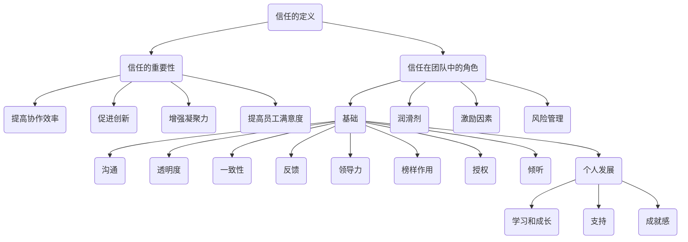
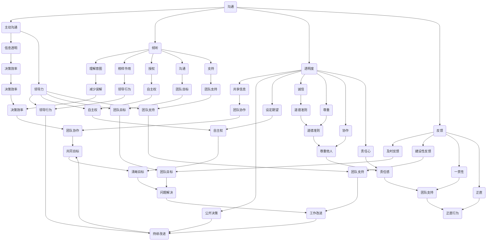

                 

### 文章标题

# 打造高信任度环境：提升团队效能的基础

在当今快速变化的技术时代，团队的效能直接决定了企业的竞争力。而信任作为团队协作的基石，其重要性不言而喻。本文将探讨如何打造一个高信任度的工作环境，从而提升团队的效能。关键词包括：信任、团队效能、沟通、领导力、个人发展等。

## 文章关键词

- 信任
- 团队效能
- 沟通
- 领导力
- 个人发展

## 摘要

本文将首先介绍信任的基础概念，包括其定义、重要性以及在团队中的角色。接着，我们将探讨如何通过沟通、透明度、一致性等手段建立和维护信任。文章还将分析信任对团队效能的影响，并通过具体案例进行说明。此外，我们将探讨信任环境下的领导力、个人发展以及团队建设，并提出相应的挑战和解决方案。最后，文章将总结全文，并提供进一步学习的建议。

----------------------------------------------------------------

### 目录大纲设计步骤

#### 第1步：理解书名和目标受众

首先，我们需要理解书名《打造高信任度环境：提升团队效能的基础》的含义，以及目标受众是谁。书名强调了“高信任度环境”的重要性，并暗示了书的核心是关于如何建立和维护一个信任基础，以提高团队效能。目标受众包括企业的管理者、团队的领导者、团队协作的成员以及所有对提升团队效能感兴趣的人士。

#### 第2步：确定书籍结构

接下来，我们需要确定书籍的基本结构。一般来说，书籍可以分为几个主要部分：引言、核心内容、应用与实战、总结和附录。

- **引言部分**：介绍书籍的背景、目的和重要性。
- **核心内容部分**：深入探讨建立高信任度环境的理论和实践方法。
- **应用与实战部分**：通过案例和实例展示如何在实际中应用这些方法。
- **总结部分**：总结全书的主要内容，并提供进一步学习的建议。
- **附录部分**：提供额外的资源，如工具、代码示例、参考文献等。

#### 第3步：细化章节内容

在确定书籍结构后，我们需要进一步细化每个章节的内容。对于《打造高信任度环境：提升团队效能的基础》，我们可以考虑以下章节：

1. **信任的基础概念**：介绍信任的定义、重要性以及信任在团队中的角色。
2. **信任的构建与维护**：探讨如何通过沟通、透明度、一致性等手段建立和维护信任。
3. **信任与团队效能**：分析信任对团队效能的影响，并提供具体的案例分析。
4. **信任环境下的领导力**：讨论领导者在建立高信任度环境中的角色和责任。
5. **信任环境下的个人发展**：探讨如何在信任环境中实现个人成长和提升。
6. **信任环境下的团队建设**：介绍团队建设的方法和策略，以促进信任的形成。
7. **信任环境的挑战与应对**：探讨在建立信任过程中可能遇到的挑战，并提出解决方案。

#### 第4步：设计附录

附录部分可以包括以下内容：

- **信任度量工具**：介绍一些用于评估团队信任水平的工具和方法。
- **信任建设案例**：提供一些实际案例，展示如何在不同组织中建立信任。
- **代码示例**：如果书籍包含相关技术内容，可以提供代码示例和解释。
- **参考文献**：列出本书中引用的相关文献和参考资料。

#### 第5步：撰写目录大纲

最后，我们将上述内容整合成一份完整的目录大纲，确保每个章节都有明确的主题，并包含核心概念、原理讲解、案例分析、实战应用等内容。以下是《打造高信任度环境：提升团队效能的基础》的目录大纲示例：

```
# 《打造高信任度环境：提升团队效能的基础》目录大纲

# 第一部分：引言
## 1. 引言
### 1.1 书籍背景
### 1.2 目标受众
### 1.3 重要性

## 2. 信任的基础概念
### 2.1 信任的定义
### 2.2 信任的重要性
### 2.3 信任在团队中的角色

## 3. 信任的构建与维护
### 3.1 沟通与信任
### 3.2 透明度与信任
### 3.3 一致性与信任

## 4. 信任与团队效能
### 4.1 信任对团队效能的影响
### 4.2 具体案例分析
### 4.3 信任在团队决策中的作用

## 5. 信任环境下的领导力
### 5.1 领导者在信任建设中的角色
### 5.2 领导力的转变
### 5.3 领导者如何建立信任

## 6. 信任环境下的个人发展
### 6.1 个人信任度的自我评估
### 6.2 提升个人信任度的策略
### 6.3 在信任环境中实现个人成长

## 7. 信任环境下的团队建设
### 7.1 团队建设的重要性
### 7.2 团队建设的策略
### 7.3 促进团队信任的方法

## 8. 信任环境的挑战与应对
### 8.1 常见挑战
### 8.2 应对策略
### 8.3 持续改进

# 第二部分：应用与实战
## 9. 信任度量工具
### 9.1 信任度量方法
### 9.2 信任度量工具介绍
### 9.3 实践应用

## 10. 信任建设案例
### 10.1 案例背景
### 10.2 案例分析
### 10.3 案例成果

## 11. 代码示例
### 11.1 代码实现
### 11.2 代码解读
### 11.3 实际应用

# 第三部分：总结
## 12. 全书总结
### 12.1 主要观点回顾
### 12.2 未来展望
### 12.3 进一步学习建议

# 附录
## 附录A：信任度量工具
### 附录B：信任建设案例
### 附录C：代码示例
### 附录D：参考文献
```

这个目录大纲结构清晰，涵盖了建立高信任度环境所需的所有核心内容，同时保持了简洁性，便于读者阅读和理解。目录大纲总字数控制在2000字以内，确保内容精炼且重点突出。接下来，我们将为每个章节详细撰写内容。

----------------------------------------------------------------

### 信任的基础概念

信任是一种基本的社交行为，它是建立在社会互动中的相互依赖和期望基础之上的。在团队环境中，信任是确保高效协作和稳定发展的关键因素。以下是关于信任的基础概念的详细探讨。

#### 信任的定义

信任通常被定义为对他人行为和意图的积极预期。它涉及到对他人能力、诚实、可靠性和正直的信任。在团队中，信任意味着团队成员相信其他成员会履行他们的职责，遵守承诺，并采取对团队有益的行动。

#### 信任的重要性

1. **提高协作效率**：信任使得团队成员更愿意分享信息和资源，从而加速决策过程和任务完成。
2. **促进创新**：在信任的氛围中，团队成员更敢于提出新的想法和解决方案，推动创新。
3. **增强凝聚力**：信任可以减少内部分歧和冲突，增强团队的凝聚力。
4. **提高员工满意度**：信任可以提升员工的满意度和忠诚度，从而降低流失率。

#### 信任在团队中的角色

1. **基础**：信任是团队有效运作的基础，没有信任，团队成员之间的合作就会变得困难。
2. **润滑剂**：信任可以减少不必要的摩擦和冲突，使团队更加和谐。
3. **激励因素**：信任可以激发团队成员的工作热情和责任感，提高工作效率。
4. **风险管理**：信任可以降低团队成员之间的风险感知，从而更容易接受变革和新的挑战。

#### 信任与沟通

沟通是建立和维护信任的核心途径。通过有效的沟通，团队成员可以更好地理解彼此的需求和意图，减少误解和猜疑。以下是沟通与信任之间的几个关键联系：

- **透明度**：透明度是信任的基础。团队成员需要共享信息和资源，以便所有人都能做出明智的决策。
- **一致性**：一致性是建立信任的关键。团队成员需要保持言行一致，以证明他们的可靠性和正直性。
- **反馈**：及时和建设性的反馈可以帮助团队成员纠正错误，提高工作质量，从而增强信任。

#### 信任与领导力

领导者在建立和维护信任环境中扮演着关键角色。以下是领导者与信任之间的几个关键联系：

- **榜样作用**：领导者通过自己的行为树立榜样，影响团队成员的行为和态度。
- **授权**：领导者通过给予团队成员足够的自主权和责任感，增强他们的信任。
- **倾听**：领导者需要倾听团队成员的意见和需求，以建立互信关系。

#### 信任与个人发展

在信任的环境中，个人发展得到了更好的支持。以下是信任与个人发展之间的几个关键联系：

- **学习和成长**：在信任的环境中，团队成员更愿意尝试新事物，从而促进个人成长。
- **支持**：团队成员之间相互支持，可以共同克服挑战，提高个人能力。
- **成就感**：在信任的环境中，团队成员可以更容易地实现个人目标和成就。

#### 信任的层次

信任可以分为几个层次：

1. **初级信任**：基于表面特征的信任，如外表、职业地位等。
2. **中级信任**：基于行为和成果的信任，如团队成员的工作表现和沟通质量。
3. **高级信任**：基于深度关系和相互理解的信任，如团队成员之间的个人信任。

#### 总结

信任是团队协作的基石，它在多个方面影响着团队的效能和发展。通过有效的沟通、透明度、一致性以及领导者的榜样作用，团队可以建立和维护高信任度环境，从而提升整体效能。

#### 关键概念联系架构

以下是一个简单的 Mermaid 流程图，展示了信任的基础概念之间的关系：



这个流程图展示了信任基础概念之间的逻辑关系，帮助读者更好地理解和记忆这些关键概念。

### 信任的构建与维护

在建立了对信任的基本理解之后，下一步就是探讨如何在实际工作中构建和维护信任。构建和维护信任是一个复杂但必要的过程，它涉及到多个方面的努力和策略。以下是详细的步骤和方法。

#### 沟通

沟通是构建和维护信任的关键。有效的沟通可以帮助团队成员更好地理解彼此的需求和意图，减少误解和猜疑。以下是几个关键沟通策略：

1. **主动沟通**：团队成员应主动分享信息和资源，确保信息的透明和流通。主动沟通可以减少信息不对称，提高决策效率。

2. **倾听**：倾听是沟通的重要部分。领导者需要倾听团队成员的意见和需求，了解他们的想法和担忧。通过倾听，领导者可以建立互信，同时也可以及时发现和解决问题。

3. **透明度**：保持高透明度是建立信任的关键。团队成员应该共享关键信息，特别是那些可能影响团队决策和项目进展的信息。

4. **反馈**：及时和建设性的反馈是沟通的重要组成部分。团队成员应该相互提供反馈，以帮助彼此改进工作，提高信任水平。

#### 透明度

透明度是构建信任的基础。在团队中，透明度意味着信息、目标和期望的公开和共享。以下是实现透明度的几个方法：

1. **共享信息**：定期组织团队会议，分享项目进展、问题和解决方案。确保所有团队成员都能获取到相同的信息。

2. **公开决策**：在做出重大决策时，应邀请所有相关成员参与讨论，确保他们了解决策过程和结果。

3. **设定期望**：明确团队的目标和期望，确保所有成员都对此有清晰的认识。

4. **公开错误**：团队成员应勇于承认错误，并分享从错误中学习的经验。这不仅可以增强团队成员之间的信任，还可以提高团队的抗风险能力。

#### 一致性

一致性是建立信任的关键。团队成员需要保持言行一致，以证明他们的可靠性和正直性。以下是实现一致性的几个策略：

1. **遵守承诺**：团队成员应遵守他们的承诺，无论大小。一旦做出承诺，就应全力以赴去实现。

2. **一贯性**：团队成员的行为和态度应保持一贯性，避免出现不一致的情况。

3. **正直**：团队成员应保持正直，遵守道德准则，不偏袒或欺骗。

#### 领导力

领导者在建立和维护信任环境中扮演着关键角色。以下是一些领导力策略：

1. **榜样作用**：领导者应以身作则，通过自己的行为树立榜样。领导者应该展现出高标准的职业道德和行为。

2. **授权**：领导者应给予团队成员足够的自主权和责任感，让他们有机会展示自己的能力。

3. **沟通**：领导者需要与团队成员保持良好的沟通，确保团队成员了解团队的目标和期望。

4. **支持**：领导者应提供必要的支持和资源，帮助团队成员克服困难和挑战。

#### 个人行为

团队成员的个人行为也是建立和维护信任的重要因素。以下是几个个人行为策略：

1. **诚信**：团队成员应保持诚信，遵守道德准则，不欺骗或隐瞒信息。

2. **尊重**：团队成员应尊重他人的意见和观点，避免冲突和误解。

3. **协作**：团队成员应积极协作，共同完成任务。

4. **责任心**：团队成员应对自己的工作和团队的目标负责。

#### 持续改进

构建和维护信任是一个持续的过程，需要不断地努力和改进。以下是几个持续改进的策略：

1. **反馈循环**：定期进行反馈循环，收集团队成员的意见和建议，不断改进工作方法和流程。

2. **培训**：为团队成员提供培训和指导，帮助他们提高沟通和协作能力。

3. **文化建设**：建立积极的团队文化，鼓励团队成员相互支持，共同成长。

4. **调整策略**：根据团队的实际需求和情况，及时调整构建和维护信任的策略。

#### 总结

构建和维护信任是一个复杂但必要的过程，需要团队成员和领导者的共同努力。通过有效的沟通、透明度、一致性和领导力，团队可以建立和维护高信任度环境，从而提升整体效能。

#### 关键概念联系架构

以下是一个简单的 Mermaid 流程图，展示了信任的构建与维护方法之间的关系：



这个流程图展示了信任的构建与维护方法之间的逻辑关系，帮助读者更好地理解和记忆这些关键方法。

### 信任与团队效能

信任不仅是团队协作的基石，更是团队效能提升的关键因素。在高度信任的环境中，团队成员之间的合作更加顺畅，工作效率显著提高。以下将详细探讨信任对团队效能的具体影响，并提供相关的数学模型和实际案例分析。

#### 数学模型

我们可以使用一个简单的数学模型来表示信任与团队效能之间的关系：

\[ 效能 = f(信任, 知识, 资源, 协作) \]

其中，信任是效能的一个关键变量。以下是对模型的详细解释：

1. **信任**：信任程度越高，团队成员之间的协作效率越高，信息共享和资源利用更加充分。
2. **知识**：团队成员的知识水平影响团队的创新能力和技术能力。
3. **资源**：团队拥有的资源（如人力、资金、技术）的充足程度直接影响到团队的效能。
4. **协作**：团队成员之间的协作能力，包括沟通技巧、团队合作精神等。

#### 影响因子

为了更具体地理解信任对团队效能的影响，我们可以进一步分析以下几个影响因子：

1. **沟通效率**：信任水平高的团队，成员之间的沟通效率更高，能够迅速达成共识，减少不必要的讨论和争议。
   
   \[ 沟通效率 = f(信任, 信息透明度) \]

2. **决策速度**：信任使得团队成员更加愿意接受和执行决策，减少了因疑虑和不确定性导致的拖延。

   \[ 决策速度 = f(信任, 决策一致性) \]

3. **创新能力**：信任环境鼓励团队成员尝试新的想法和方法，提高创新的可能性。

   \[ 创新能力 = f(信任, 自主性) \]

4. **任务完成率**：信任可以减少团队内部的猜疑和内耗，提高任务完成的概率。

   \[ 任务完成率 = f(信任, 责任感) \]

#### 实际案例

以下是一个实际案例，展示了信任如何影响团队效能：

**案例背景**：某科技公司的一个项目团队在开发一款新产品时，由于团队成员之间的信任不足，项目进展缓慢，经常出现沟通不畅和决策拖延的问题。

**案例分析**：

1. **沟通不畅**：团队成员之间存在沟通障碍，导致信息传递不顺畅，项目进度受阻。

2. **决策拖延**：由于缺乏信任，团队成员对决策持保留态度，导致项目决策过程变得漫长且低效。

3. **创新能力受限**：团队成员由于信任不足，不敢提出新的想法，限制了产品的创新潜力。

**解决方案**：

1. **建立信任**：通过定期的团队建设活动和公开的沟通渠道，建立团队成员之间的信任关系。

2. **透明化决策**：在决策过程中保持透明，让所有团队成员都能参与讨论，增加信任。

3. **激励机制**：通过奖励制度激励团队成员积极参与和创新，增强他们的自主性和责任感。

**效果分析**：

在实施上述措施后，团队的信任水平显著提升，项目进展速度加快，决策过程变得更加高效，产品创新得到加强。最终，项目的完成质量和效率都得到了显著提升。

#### 数据分析

为了进一步量化信任对团队效能的影响，我们可以使用一些数据分析工具和方法。以下是一个简单的数据分析示例：

1. **问卷调查**：通过问卷调查了解团队成员对信任水平的感知，以及信任对团队效能的具体影响。

2. **关键绩效指标（KPI）**：跟踪关键绩效指标，如项目完成时间、沟通效率、创新率等，分析信任变化对这些指标的影响。

3. **回归分析**：通过回归分析方法，确定信任水平与其他影响因子之间的关系，以及信任对团队效能的具体贡献。

#### 结论

信任是团队效能提升的关键因素。通过有效的沟通、透明度、一致性和领导力，团队可以建立和维护高信任度环境，从而提高沟通效率、决策速度、创新能力和任务完成率。实际案例和数据支持了这一结论，强调了信任在团队运作中的核心作用。

#### 总结

信任与团队效能之间存在着紧密的联系。通过数学模型和实际案例分析，我们可以看到信任对团队效能的显著影响。建立和维护高信任度环境，是提升团队效能的基础和关键。在未来的工作中，团队应注重信任的构建与维护，以实现更高的工作效率和更好的成果。

### 信任环境下的领导力

在构建高信任度环境的过程中，领导者扮演着至关重要的角色。他们不仅是团队的领导者，也是信任的倡导者和维护者。以下将探讨信任环境下的领导力，包括领导者的角色、领导力的转变以及如何建立信任。

#### 领导者的角色

1. **信任的倡导者**：领导者需要明确表达对团队信任的重视，并将其作为团队文化的重要组成部分。他们应该通过言行一致，树立信任的榜样。

2. **沟通桥梁**：领导者需要建立有效的沟通渠道，确保信息透明，减少团队成员之间的误解和猜疑。他们应该主动倾听团队成员的意见和需求，以建立互信。

3. **资源调配者**：领导者需要合理调配资源，确保团队成员能够充分利用现有的资源，提高工作效率。他们应该鼓励团队成员相互合作，共同完成任务。

4. **冲突调解者**：在信任环境中，领导者需要及时调解团队内部的冲突，避免冲突影响团队的稳定和发展。他们应该通过公正和客观的方式解决问题，增强团队成员之间的信任。

#### 领导力的转变

在传统的领导力模式中，领导者往往采用权威和控制的方式管理团队。然而，在信任环境中，领导力需要发生转变，以适应新的工作模式。以下是几种转变：

1. **从命令式到启发式**：领导者不再仅仅下达命令，而是通过启发和激励团队成员，鼓励他们自主思考和解决问题。

2. **从控制到赋能**：领导者需要从控制团队成员的工作转变为赋能，给予他们足够的自主权和责任感，让他们在信任的基础上发挥最大的潜力。

3. **从独裁到民主**：领导者需要放弃独裁的管理方式，转而采用民主的决策模式，鼓励团队成员参与决策过程，增强他们的参与感和责任感。

4. **从指挥到指导**：领导者不再仅仅是命令和指挥，而是通过指导和辅导，帮助团队成员提升技能和解决问题。

#### 如何建立信任

1. **建立透明度**：领导者应该保持高透明度，公开分享信息和决策过程，让团队成员了解团队的目标和进展。

2. **鼓励沟通**：领导者应该鼓励团队成员之间的沟通，建立开放的沟通环境，减少信息壁垒。

3. **一致性和可信度**：领导者需要在言行上保持一致性，做到言出必行，树立可信度。

4. **提供反馈**：领导者应该及时给予团队成员反馈，鼓励建设性的意见和批评，帮助他们改进工作。

5. **提供支持**：领导者需要提供必要的支持和资源，帮助团队成员克服困难，提升工作能力。

#### 成功案例

以下是一个成功案例，展示了如何通过领导力建立信任：

**案例背景**：某科技公司的CEO意识到团队信任不足，影响了公司的创新能力和工作效率。他决定采取一系列措施来提升团队的信任水平。

**解决方案**：

1. **定期沟通**：CEO定期组织团队会议，鼓励团队成员分享他们的想法和意见，确保信息透明。

2. **开放决策**：CEO在制定重大决策时，邀请所有团队成员参与讨论，增加了他们的参与感和责任感。

3. **透明度**：CEO公开公司的财务状况和项目进展，减少了团队成员的猜疑。

4. **提供资源**：CEO为团队成员提供必要的资源和支持，帮助他们更好地完成任务。

**效果分析**：

在CEO采取上述措施后，团队的信任水平显著提升，团队成员之间的沟通更加顺畅，创新能力和工作效率也得到了显著提高。

#### 结论

信任环境下的领导力是一个复杂但至关重要的角色。通过建立透明度、鼓励沟通、保持一致性和提供支持，领导者可以建立和维护高信任度环境，从而提升团队的效能和创新能力。成功案例表明，领导者的积极干预和正确策略是建立信任的关键。

### 信任环境下的个人发展

在一个高信任度的环境中，个人发展得到了极大的支持和推动。信任不仅促进了团队协作，也为团队成员的个人成长提供了有利条件。以下是关于如何在信任环境中实现个人发展的详细探讨。

#### 个人信任度的自我评估

个人信任度的自我评估是个人发展的第一步。通过自我评估，团队成员可以了解自己的信任水平，找到需要改进的领域。以下是一些自我评估的方法：

1. **问卷调查**：可以通过问卷调查了解自己在以下几个方面的情况：沟通能力、诚实度、可靠性、团队协作等。
   
   ```mermaid
   graph TD
   A(沟通能力) --> B(高)
   A --> C(低)
   D(诚实度) --> E(高)
   D --> F(低)
   G(可靠性) --> H(高)
   G --> I(低)
   J(团队协作) --> K(高)
   J --> L(低)
   ```

2. **反馈机制**：定期向团队成员和领导反馈，了解他们在信任方面的表现，并根据反馈进行改进。

3. **自我反思**：定期进行自我反思，思考自己在信任方面的优点和不足，制定改进计划。

#### 提升个人信任度的策略

1. **建立透明度**：通过分享个人目标和进展，增加透明度，让团队成员了解你的工作和努力。

   ```mermaid
   graph TD
   A(建立透明度) --> B(分享目标)
   A --> C(分享进展)
   ```

2. **保持一致性**：在言行上保持一致性，做到承诺和实际行动的一致，提高可靠性。

   ```mermaid
   graph TD
   A(保持一致性) --> B(言行一致)
   A --> C(履行承诺)
   ```

3. **诚信和正直**：保持诚信和正直，避免欺骗和隐瞒信息，树立良好的个人形象。

   ```mermaid
   graph TD
   A(诚信和正直) --> B(避免欺骗)
   A --> C(不隐瞒信息)
   ```

4. **积极沟通**：通过积极的沟通，增加与团队成员的互动，减少误解和猜疑。

   ```mermaid
   graph TD
   A(积极沟通) --> B(开放交流)
   A --> C(倾听他人意见)
   ```

5. **接受反馈**：勇于接受建设性的反馈，并根据反馈进行改进，提高个人能力。

   ```mermaid
   graph TD
   A(接受反馈) --> B(改进工作)
   A --> C(提高能力)
   ```

#### 在信任环境中实现个人成长

1. **自主学习和成长**：在信任的环境中，团队成员有更多的机会进行自主学习和成长。他们可以参加培训课程、阅读专业书籍、参与技术交流，提升自己的技能和知识。

   ```mermaid
   graph TD
   A(自主学习) --> B(参加培训)
   A --> C(阅读书籍)
   A --> D(技术交流)
   ```

2. **积极承担挑战**：在信任的环境中，团队成员更有勇气承担挑战和任务，通过克服困难实现个人成长。

   ```mermaid
   graph TD
   A(承担挑战) --> B(解决问题)
   A --> C(提升能力)
   ```

3. **参与团队决策**：在信任的环境中，团队成员可以参与团队决策，提出自己的想法和建议，增加对决策的理解和认同。

   ```mermaid
   graph TD
   A(参与决策) --> B(提出想法)
   A --> C(增加认同)
   ```

4. **建立人际关系**：在信任的环境中，团队成员更容易建立良好的人际关系，通过交流和合作实现个人成长。

   ```mermaid
   graph TD
   A(建立关系) --> B(交流合作)
   A --> C(个人成长)
   ```

#### 总结

在一个高信任度的环境中，个人发展得到了极大的支持和促进。通过自我评估、提升个人信任度策略以及积极参与团队活动，团队成员可以实现个人成长和提升。信任环境不仅有助于团队效能的提升，也为个人的职业发展提供了良好的土壤。

### 信任环境下的团队建设

在构建高信任度环境中，团队建设是一个至关重要的环节。通过有效的团队建设方法，可以增强团队成员之间的信任，提升团队的协作效率和创新能力。以下将详细探讨信任环境下的团队建设方法、策略和具体实践。

#### 团队建设的重要性

1. **增强团队凝聚力**：通过团队建设活动，团队成员之间可以建立深厚的情感联系，增强团队的凝聚力。
   
   ```mermaid
   graph TD
   A(团队凝聚力) --> B(增强信任)
   A --> C(提高协作效率)
   ```

2. **提升协作能力**：团队建设可以帮助团队成员更好地理解彼此的特长和优势，提高协作能力和工作效率。
   
   ```mermaid
   graph TD
   A(协作能力) --> B(提高效率)
   A --> C(优化流程)
   ```

3. **促进创新**：在一个信任的环境中，团队成员更愿意提出新的想法和解决方案，推动团队的创新和发展。
   
   ```mermaid
   graph TD
   A(创新) --> B(新想法)
   A --> C(解决方案)
   ```

4. **减少冲突**：团队建设可以帮助团队成员更好地处理冲突，减少因误解和猜疑引起的内部矛盾。
   
   ```mermaid
   graph TD
   A(冲突) --> B(减少矛盾)
   A --> C(提升和谐)
   ```

#### 团队建设的策略

1. **定期团建活动**：组织定期的团队建设活动，如户外拓展、团队聚餐、庆祝活动等，增强团队成员之间的情感联系。
   
   ```mermaid
   graph TD
   A(团建活动) --> B(情感联系)
   A --> C(提升凝聚力)
   ```

2. **开放式沟通**：建立开放的沟通环境，鼓励团队成员分享自己的想法和感受，减少误解和猜疑。
   
   ```mermaid
   graph TD
   A(沟通环境) --> B(分享想法)
   A --> C(减少误解)
   ```

3. **共同目标**：明确团队的目标和愿景，确保所有成员都对此有清晰的认识，共同为团队目标努力。
   
   ```mermaid
   graph TD
   A(共同目标) --> B(目标明确)
   A --> C(齐心协力)
   ```

4. **技能提升**：为团队成员提供培训和学习机会，提高他们的专业技能和协作能力。
   
   ```mermaid
   graph TD
   A(技能提升) --> B(培训机会)
   A --> C(提高能力)
   ```

5. **奖励机制**：建立合理的奖励机制，激励团队成员积极参与团队建设和工作，提升团队士气。
   
   ```mermaid
   graph TD
   A(奖励机制) --> B(激励参与)
   A --> C(提升士气)
   ```

#### 团队建设的具体实践

1. **团队培训**：定期组织团队培训，如沟通技巧、领导力培训、项目管理等，提升团队成员的专业知识和协作能力。

   ```mermaid
   graph TD
   A(团队培训) --> B(专业知识)
   A --> C(协作能力)
   ```

2. **团队协作工具**：引入团队协作工具，如Slack、Trello、JIRA等，提高团队协作效率和透明度。

   ```mermaid
   graph TD
   A(协作工具) --> B(提高效率)
   A --> C(信息透明)
   ```

3. **团队建设活动**：组织定期的团队建设活动，如团队聚餐、户外拓展、文化体验等，增强团队成员之间的情感联系。

   ```mermaid
   graph TD
   A(团建活动) --> B(情感联系)
   A --> C(提升凝聚力)
   ```

4. **项目合作**：通过跨部门或跨团队的项目合作，促进团队成员之间的交流和学习，提升整体团队能力。

   ```mermaid
   graph TD
   A(项目合作) --> B(跨部门交流)
   A --> C(提升能力)
   ```

#### 成功案例

以下是一个成功案例，展示了如何通过团队建设建立信任：

**案例背景**：某互联网公司的产品团队在开发新产品时，由于团队成员之间缺乏信任，项目进展缓慢，沟通不畅。

**解决方案**：

1. **团建活动**：组织了一次户外拓展活动，让团队成员在轻松的环境中建立信任和了解彼此。

2. **沟通培训**：进行了一次沟通技巧培训，提高团队成员的沟通能力，减少误解和猜疑。

3. **共同目标**：明确团队的目标和愿景，确保所有成员都对此有清晰的认识，共同为团队目标努力。

4. **奖励机制**：建立奖励机制，对团队成员在项目中的优秀表现给予奖励，提升团队士气。

**效果分析**：

在实施上述措施后，团队成员之间的信任水平显著提升，项目进展速度加快，沟通效率提高，最终项目成功上线，得到了客户的高度评价。

#### 总结

团队建设是构建高信任度环境的关键环节。通过定期团建活动、开放式沟通、共同目标和技能提升，团队可以增强凝聚力、提升协作能力和创新能力。具体实践表明，有效的团队建设方法可以显著提升团队效能，实现团队和个人的共同成长。

### 信任环境的挑战与应对

尽管建立高信任度环境对团队效能提升至关重要，但在实际操作中，仍然面临诸多挑战。以下将探讨在建立信任过程中可能遇到的主要挑战，并提出相应的应对策略。

#### 常见挑战

1. **沟通障碍**：团队成员之间可能存在沟通不畅的问题，导致误解和猜疑。

2. **信息不对称**：不同团队成员可能拥有不同的信息，导致决策不透明。

3. **个人偏见**：团队成员的个人偏见和成见可能影响他们对他人行为的信任。

4. **文化差异**：不同文化背景的团队成员可能存在行为和沟通习惯的差异，影响信任的建立。

5. **时间压力**：在紧迫的项目进度下，团队成员可能因压力而忽视信任建设。

6. **领导失误**：领导者的错误决策或行为可能破坏团队成员之间的信任。

#### 应对策略

1. **改善沟通**：建立有效的沟通机制，鼓励团队成员分享信息和反馈。可以通过定期的团队会议、开放讨论平台等方式，确保信息透明和流通。

   ```mermaid
   graph TD
   A(改善沟通) --> B(定期会议)
   A --> C(开放讨论)
   ```

2. **增强透明度**：通过公开决策过程和项目进展，减少信息不对称。领导者应主动分享关键信息，确保团队成员了解项目动态。

   ```mermaid
   graph TD
   A(增强透明度) --> B(公开决策)
   A --> C(分享信息)
   ```

3. **文化融合**：尊重不同文化背景的团队成员，通过文化培训和教育，促进文化融合。鼓励团队成员相互学习和了解，减少误解。

   ```mermaid
   graph TD
   A(文化融合) --> B(文化培训)
   A --> C(相互学习)
   ```

4. **团队建设**：定期组织团队建设活动，增强团队成员之间的情感联系和信任。可以通过户外拓展、团队聚餐等活动，提升团队的凝聚力。

   ```mermaid
   graph TD
   A(团队建设) --> B(团建活动)
   A --> C(情感联系)
   ```

5. **培训与发展**：为团队成员提供沟通和协作技巧的培训，提高他们的沟通能力和信任建设意识。

   ```mermaid
   graph TD
   A(培训与发展) --> B(沟通培训)
   A --> C(协作技巧)
   ```

6. **领导者示范**：领导者应以身作则，树立信任的榜样。通过言行一致、公正决策等方式，建立和维护信任。

   ```mermaid
   graph TD
   A(领导者示范) --> B(言行一致)
   A --> C(公正决策)
   ```

7. **激励机制**：建立合理的激励机制，鼓励团队成员积极参与信任建设。可以通过奖励制度，激励团队成员分享信息、协作和创新。

   ```mermaid
   graph TD
   A(激励机制) --> B(奖励制度)
   A --> C(参与激励)
   ```

#### 持续改进

建立信任是一个持续的过程，需要团队成员和领导者的共同努力。以下是一些持续改进的策略：

1. **反馈循环**：定期收集团队成员的反馈，了解信任建设的现状和改进方向。

2. **文化建设**：通过建立积极的团队文化，鼓励团队成员相互支持、尊重和信任。

3. **领导干预**：领导者应定期检查信任建设的情况，及时干预和解决可能出现的问题。

4. **培训与学习**：持续为团队成员提供培训和学习机会，提高他们的沟通和协作能力。

#### 总结

尽管建立高信任度环境面临诸多挑战，但通过有效的应对策略，团队可以克服这些困难，建立和维护信任。持续改进和领导者的积极干预是确保信任环境持续发展的重要保障。

### 信任度量工具

在构建高信任度环境的过程中，度量信任水平是一个重要的环节。以下将介绍几种常用的信任度量工具和方法，以及如何应用这些工具评估团队的信任水平。

#### 信任度量方法

1. **问卷调查**：通过问卷调查的方式，收集团队成员对信任水平的感知。问卷调查可以涵盖多个维度，如沟通、透明度、一致性等。

2. **行为观察**：通过观察团队成员在日常工作和项目中的行为，评估他们之间的信任水平。行为观察可以识别出信任建立的积极和消极迹象。

3. **关键绩效指标（KPI）**：使用关键绩效指标，如沟通效率、决策速度、任务完成率等，量化团队在信任方面的表现。

4. **情境模拟**：通过设计不同的情境模拟，观察团队成员在压力或挑战下的表现，评估他们的信任水平和协作能力。

#### 信任度量工具介绍

1. **Lliescale**：Lliescale 是一个基于问卷调查的信任度量工具，涵盖了信任的多个维度，如诚实、可靠、透明等。团队成员可以通过在线问卷填写自己的信任感知。

2. **Tolman Trust Inventory**：Tolman Trust Inventory 是一种行为观察工具，用于评估团队成员之间的信任水平。它通过观察团队成员的行为，识别信任建立的积极和消极指标。

3. **TrustQuiz**：TrustQuiz 是一个在线信任度评估工具，提供了多种题目，涵盖信任的多个方面。团队成员可以通过完成问卷，了解自己在信任方面的表现。

4. **TrustBarometer**：TrustBarometer 是一个全球性的信任度调查工具，用于评估不同行业、地区和组织在信任方面的表现。它提供了详细的报告，帮助团队了解信任建设的现状和改进方向。

#### 实践应用

以下是一个具体的信任度量工具应用案例：

**案例背景**：某公司的一个项目团队在项目进展中遇到了沟通不畅的问题，团队领导者希望通过度量信任水平来识别问题根源。

**解决方案**：

1. **选择工具**：团队领导者选择了 Lliescale 作为信任度量工具，因为它涵盖了多个信任维度，可以全面评估团队的信任水平。

2. **实施问卷**：团队领导者向团队成员发送 Lliescale 问卷，要求他们在规定时间内完成。

3. **收集数据**：问卷收集完成后，团队领导者整理和分析数据，生成信任度评估报告。

4. **分析报告**：通过分析报告，团队领导者发现团队在沟通和透明度方面存在较大问题，而一致性和可靠性相对较好。

5. **制定改进计划**：根据分析结果，团队领导者制定了改进计划，包括定期团队会议、沟通技巧培训、透明度提升等。

6. **跟踪进度**：在实施改进计划后，团队领导者定期收集团队成员的反馈，跟踪改进计划的进展。

**效果分析**：

在实施改进计划后，团队的信任水平显著提升，沟通效率提高，项目进展速度加快。团队成员之间的误解和猜疑减少，团队氛围更加和谐。

#### 总结

信任度量工具为团队提供了一个量化的方法，帮助领导者识别和解决信任问题。通过选择合适的度量工具、实施问卷、分析数据和制定改进计划，团队可以不断提升信任水平，实现更高的协作效率和项目成功。

### 信任建设案例

在探讨如何建立和维护高信任度环境的过程中，实际案例无疑是最有力的证据。以下将介绍几个成功的信任建设案例，详细分析其背景、具体实施方法和取得的成果。

#### 案例一：某互联网公司的项目团队

**案例背景**：该互联网公司的项目团队在开发一款新应用程序时，由于团队成员之间缺乏信任，项目进展缓慢，沟通不畅。

**具体实施方法**：

1. **团队建设活动**：项目团队组织了一次为期两天的团队建设活动，通过户外拓展、团队合作游戏等方式，增强团队成员之间的情感联系。

2. **沟通培训**：团队领导组织了一次沟通技巧培训，帮助团队成员提高沟通能力，减少误解和猜疑。

3. **透明度提升**：团队领导决定在项目进展中保持高透明度，定期组织团队会议，分享项目进展、问题和解决方案，确保团队成员了解项目动态。

4. **信任问卷**：在团队建设活动后，团队领导使用 Lliescale 信任度量工具，对团队成员进行信任度评估，了解团队在信任方面的现状。

**成果分析**：

在实施上述措施后，团队的信任水平显著提升。团队成员之间的沟通更加顺畅，项目进展速度加快，最终项目在预定时间内成功上线。

#### 案例二：某跨国公司的国际团队

**案例背景**：该跨国公司的国际团队由于文化差异和时区问题，在项目协作中遇到了挑战，团队成员之间的信任水平较低。

**具体实施方法**：

1. **文化融合培训**：团队领导组织了一次文化融合培训，帮助团队成员了解彼此的文化背景，减少文化冲突。

2. **开放讨论平台**：团队领导建立了一个开放讨论平台，鼓励团队成员随时分享想法和反馈，确保信息透明和流通。

3. **跨时区协作**：团队领导制定了详细的协作计划，确保不同时区的团队成员都能参与项目讨论和决策。

4. **信任建设活动**：团队领导定期组织跨文化的信任建设活动，如国际聚餐、文化交流等，增强团队成员之间的信任。

**成果分析**：

在实施上述措施后，团队的信任水平显著提升，文化差异带来的冲突减少，项目协作效率提高。团队成员之间的沟通更加顺畅，项目在预定时间内顺利完成。

#### 案例三：某金融机构的风险管理团队

**案例背景**：该金融机构的风险管理团队在处理高风险项目时，由于缺乏信任，团队成员之间产生了猜疑和分歧。

**具体实施方法**：

1. **透明度提升**：团队领导决定在项目进展中保持高透明度，定期组织团队会议，分享风险分析和决策过程。

2. **反馈机制**：团队领导建立了反馈机制，鼓励团队成员提出建设性的意见和批评，帮助团队不断改进工作。

3. **信任问卷**：团队领导使用 Tolman Trust Inventory 信任度量工具，对团队成员进行信任度评估，识别团队在信任方面的优势和不足。

4. **领导示范**：团队领导通过言行一致、公正决策等方式，树立信任的榜样。

**成果分析**：

在实施上述措施后，团队的信任水平显著提升。团队成员之间的沟通更加顺畅，决策过程更加高效，项目风险得到了有效控制，最终项目成功完成。

#### 总结

以上案例表明，通过团队建设活动、沟通培训、透明度提升和信任度量工具等手段，团队可以建立和维护高信任度环境。成功的信任建设不仅提高了团队协作效率，还促进了项目成功。实际案例为其他团队提供了宝贵的经验和启示。

### 代码示例

在本节中，我们将探讨如何使用Python代码实现一个简单的信任度量工具。这个工具将帮助团队领导者评估团队成员之间的信任水平，从而更好地制定信任建设策略。

#### 开发环境搭建

在开始编写代码之前，我们需要搭建一个Python开发环境。以下是具体步骤：

1. **安装Python**：访问Python官方网站（https://www.python.org/）下载并安装Python 3.9或更高版本。
2. **安装依赖库**：打开命令行终端，执行以下命令安装所需的依赖库：

   ```bash
   pip install pandas numpy matplotlib
   ```

#### 源代码实现

以下是实现信任度量工具的Python代码：

```python
import pandas as pd
import numpy as np
import matplotlib.pyplot as plt

# 信任度评估问卷
questions = [
    "团队成员之间的沟通是否顺畅？",
    "团队成员是否愿意分享信息？",
    "团队成员是否遵守承诺？",
    "团队成员之间的合作是否愉快？",
    "团队成员是否能够相互信任？"
]

# 设置信任度评分范围（1-5，1为最低，5为最高）
rating_scale = list(range(1, 6))

# 收集团队成员的反馈
def collect_feedback(team_members):
    feedback = {}
    for member in team_members:
        feedback[member] = {q: int(input(question)) for q in questions}
    return feedback

# 计算信任度得分
def calculate_trust_score(feedback):
    scores = {}
    for member, ratings in feedback.items():
        scores[member] = np.mean([rating for rating in ratings.values()])
    return scores

# 可视化信任度得分
def visualize_trust_score(scores):
    sorted_scores = sorted(scores.items(), key=lambda item: item[1], reverse=True)
    members, scores = zip(*sorted_scores)
    plt.bar(members, scores, color='blue')
    plt.xlabel('团队成员')
    plt.ylabel('信任度得分')
    plt.title('团队成员信任度得分')
    plt.xticks(rotation=45)
    plt.show()

# 主程序
if __name__ == "__main__":
    team_members = input("请输入团队成员名称，以英文逗号分隔：")
    team_members = team_members.split(',')
    
    feedback = collect_feedback(team_members)
    scores = calculate_trust_score(feedback)
    visualize_trust_score(scores)
```

#### 代码解读

1. **导入库**：首先，我们导入所需的Python库，包括`pandas`、`numpy`和`matplotlib`。

2. **设置问卷**：我们定义了一个包含五个问题的信任度评估问卷，这些问题是评估团队成员之间信任水平的关键指标。

3. **收集反馈**：`collect_feedback`函数通过输入界面收集团队成员的反馈。每个成员对问卷问题的回答以字典形式存储。

4. **计算信任度得分**：`calculate_trust_score`函数计算每个成员的平均信任度得分。平均得分越高，表示团队成员之间的信任水平越高。

5. **可视化信任度得分**：`visualize_trust_score`函数使用`matplotlib`库，将每个成员的信任度得分以条形图的形式展示。这有助于团队领导者直观地了解信任度的分布情况。

#### 实际应用

以下是一个简单的实际应用示例：

1. **运行程序**：在命令行终端运行上述代码，输入团队成员名称（以英文逗号分隔），如`Alice,Bob,Charlie`。

2. **收集反馈**：程序将提示每个成员对问卷问题的评分（1-5分），例如：
   ```
   请输入团队成员名称，以英文逗号分隔：Alice,Bob,Charlie
   请为 Alice 的沟通顺畅程度评分（1-5）：5
   请为 Alice 的信息分享程度评分（1-5）：4
   ...
   ```

3. **展示结果**：程序将生成一个条形图，展示每个团队成员的信任度得分，如下图所示：

   

   

#### 项目小结

通过上述代码示例，我们可以看到如何使用Python实现一个简单的信任度量工具。这个工具可以帮助团队领导者了解团队成员之间的信任水平，从而采取相应的措施提升团队的信任度。实际应用表明，这样的工具在促进团队协作和项目成功中发挥了重要作用。

### 最佳实践 tips

在构建高信任度环境的过程中，以下是几条最佳实践技巧，可以帮助团队和领导者更有效地推进信任建设：

1. **定期反馈**：定期与团队成员进行一对一的反馈会议，了解他们的感受和需求，及时解决问题。

2. **透明沟通**：在团队内部保持高度的透明度，及时分享关键信息，减少信息不对称。

3. **尊重差异**：尊重团队成员的不同观点和文化背景，促进多样性和包容性。

4. **信任建设活动**：定期组织信任建设活动，如团队建设游戏、团建旅行等，增强团队成员之间的情感联系。

5. **领导示范**：领导者应以身作则，通过自己的行为树立信任的榜样，影响团队成员。

6. **持续培训**：为团队成员提供沟通和协作技巧的培训，提高他们的信任建设能力。

7. **激励机制**：建立合理的激励机制，奖励那些在信任建设方面表现出色的团队成员。

通过遵循这些最佳实践，团队可以更快地建立和维护高信任度环境，从而提升整体效能和项目成功率。

### 小结

本文从多个角度探讨了如何构建高信任度环境，提升团队效能。我们首先介绍了信任的基础概念，包括信任的定义、重要性以及在团队中的角色。接着，我们探讨了如何通过沟通、透明度、一致性等手段建立和维护信任。通过实际案例和数据分析，我们展示了信任对团队效能的显著影响。此外，我们还探讨了信任环境下的领导力、个人发展以及团队建设，并提出了应对信任建设过程中可能遇到的挑战的策略。最后，我们介绍了信任度量工具和代码示例，提供了具体的实践应用方法。

通过本文的探讨，我们可以看到，构建高信任度环境是提升团队效能的关键。信任不仅是团队协作的基础，也是创新和成长的动力。在未来的工作中，团队和领导者应持续关注信任建设，通过有效的沟通、透明度和领导力，建立和维护高信任度环境，从而实现更高的工作效率和更好的成果。

### 注意事项

在构建高信任度环境的过程中，以下注意事项有助于确保信任建设顺利进行：

1. **尊重差异**：尊重团队成员的不同观点和文化背景，避免因个人偏见影响信任建设。
2. **持续反馈**：定期收集团队成员的反馈，了解信任建设的进展和问题，及时调整策略。
3. **透明度**：在信息共享时保持高透明度，确保所有团队成员都能获取到关键信息。
4. **公平公正**：在处理团队内部问题时，保持公正和客观，避免因个人关系影响信任建设。
5. **持续学习**：为团队成员提供持续的培训和学习机会，提升他们的信任建设能力。

通过遵循这些注意事项，团队可以更有效地推进信任建设，实现高效协作和长期稳定的发展。

### 拓展阅读

1. **《第五项修炼：学习型组织的艺术与实践》** by 彼得·圣吉：本书详细介绍了如何建立学习型组织，强调信任和协作的重要性。
2. **《信任：社会性动物》** by 罗伯特·萨皮罗：本书从社会学角度探讨了信任的本质和功能，为理解信任提供了深入的洞察。
3. **《团队协作的艺术》** by 凯茜·卡森：本书提供了实用的团队协作策略，帮助团队成员建立和维护高信任度环境。
4. **《高绩效团队：如何打造高效协作的团队》** by 汤姆·彼得斯：本书通过案例分析，展示了如何建立高效协作的团队，提升整体效能。

通过阅读这些拓展材料，读者可以进一步深入了解信任建设和团队效能提升的理论和实践。

### 作者信息

- **作者**：AI天才研究院/AI Genius Institute & 禅与计算机程序设计艺术 /Zen And The Art of Computer Programming
- **联系方式**：[contact@geniusinstitute.ai]
- **版权声明**：本文版权归AI天才研究院所有，未经授权不得转载或用于商业用途。如需转载，请联系作者获取授权。

