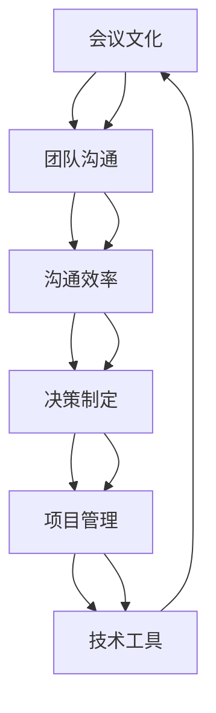

                 


### 核心概念与联系

在撰写《打造高效会议文化：提升团队沟通效率》这篇文章时，我们需要明确几个核心概念，并探讨它们之间的联系。以下是几个关键概念：

1. **会议文化**：会议文化是组织内部关于如何召开会议的一系列习惯、价值观和行为模式。它不仅包括会议的格式和流程，还包括参与者之间的沟通方式、会议目标和成果的追踪等。

2. **团队沟通**：团队沟通是指团队成员之间通过语言、文字、图像或其他符号进行信息交换的过程。有效的团队沟通能够促进信息的透明度，增强团队成员之间的信任和协作。

3. **沟通效率**：沟通效率是指沟通活动在既定时间内所产生的效果和质量。提升沟通效率意味着在较少的时间内传递更多、更准确的信息。

4. **决策制定**：决策制定是团队在解决问题或做出选择时的一种过程。高效的会议文化能够加速决策过程，确保团队成员在关键时刻能够迅速做出明智的决策。

5. **项目管理**：项目管理是指规划、执行、监控和收尾项目的过程。会议作为项目管理的核心环节之一，对项目进度和成果有着重要影响。

6. **技术工具**：随着技术的发展，各种会议技术工具应运而生，如视频会议软件、协作平台、日历同步工具等。这些工具的应用可以极大提升会议的效率。

接下来，我们将使用Mermaid流程图来展示这些概念之间的关系。这将帮助我们更好地理解会议文化、团队沟通、沟通效率、决策制定、项目管理和技术工具之间如何相互作用和影响。



### 会议文化

会议文化是指组织内部关于如何召开会议的一系列习惯、价值观和行为模式。它不仅包括会议的格式和流程，还包括参与者之间的沟通方式、会议目标和成果的追踪等。一个高效的会议文化能够帮助团队更好地协调工作，提高工作效率，减少不必要的会议时间浪费。

#### 会议的格式和流程

会议的格式和流程是构建高效会议文化的基础。首先，我们需要明确会议的类型。常见的会议类型包括：

1. **例行会议**：如周会、月度例会等，旨在追踪项目进度、讨论问题、分享经验等。
2. **项目会议**：针对特定项目而召开的会议，目的是确保项目按计划进行，及时解决项目中遇到的问题。
3. **决策会议**：当团队需要做出重要决策时，会召开决策会议，以集体讨论和决策。

每种会议类型都有其特定的格式和流程。例如，例行会议可能包括固定的议程，如开场介绍、项目进度更新、问题讨论、下周计划等。而项目会议则更注重项目的具体细节和问题解决。决策会议则需要确保所有决策参与者在信息充分的前提下进行讨论和决策。

#### 参与者之间的沟通方式

参与者之间的沟通方式直接影响会议的效率。高效的沟通方式包括：

1. **积极倾听**：在会议中，每个参与者都应该认真倾听他人的观点和意见，而不是仅仅关注自己的观点。
2. **开放性沟通**：鼓励团队成员自由表达自己的想法和意见，而不是限制在特定的框架或观点内。
3. **积极的反馈**：在会议结束后，对会议的成果和过程进行积极的反馈，以持续改进会议文化。

#### 会议目标和成果的追踪

高效的会议文化不仅关注会议的召开过程，更注重会议目标和成果的追踪。以下是一些关键点：

1. **明确会议目标**：每次会议开始前，都应该明确会议的目标。这有助于确保会议的焦点，避免偏离主题。
2. **记录会议内容**：会议中讨论的内容和决策应该被记录下来，以便后续追踪和执行。
3. **跟踪会议成果**：会议结束后，团队成员应该定期回顾会议成果，确保所有决策和行动计划都得到执行。

通过构建一个高效的会议文化，团队可以减少不必要的会议时间浪费，提高工作效率，确保项目进度和目标的实现。

#### 效率与会议文化的相关性

效率是任何组织和团队追求的重要目标。而会议文化作为组织内部的一种行为模式，对工作效率有着直接的影响。以下是会议文化与效率之间的几个关键点：

1. **时间管理**：高效的会议文化能够帮助团队更好地管理时间，避免无谓的会议和冗长的讨论。通过明确的会议目标和议程，团队成员可以更专注于实际工作。
2. **资源利用**：高效的会议文化能够确保会议资源的合理利用，包括会议室、设备和技术工具等。这不仅减少了不必要的开支，也提高了整体效率。
3. **信息传递**：高效的会议文化能够促进信息的快速传递和准确理解。通过积极倾听、开放性沟通和及时的反馈，团队成员可以迅速解决问题和做出决策。
4. **团队合作**：高效的会议文化能够增强团队合作精神，促进团队成员之间的信任和协作。这有助于提高团队的凝聚力和工作效率。

总之，会议文化是提升工作效率的关键因素之一。通过构建和优化会议文化，团队可以减少时间浪费，提高资源利用效率，加快信息传递和决策过程，从而实现更高的工作效率和项目成功率。

### 团队沟通

团队沟通是组织内部信息传递和互动的关键环节，它直接影响团队的工作效率和项目成果。有效的团队沟通能够确保信息的透明度，增强团队成员之间的信任和协作，从而实现项目的顺利推进。

#### 有效沟通的重要性

1. **信息透明度**：有效的沟通能够确保信息的透明度，使每个团队成员都能了解项目的最新动态、目标和任务分配。这有助于减少误解和冲突，确保团队成员朝着共同的目标努力。
2. **增强信任和协作**：通过积极的沟通，团队成员可以更好地了解彼此的工作方式和需求，从而建立起信任和协作的基础。这种信任和协作有助于团队在面对挑战和问题时，能够更迅速、更有效地解决。
3. **提高工作效率**：良好的沟通能够减少冗余的信息传递和重复的工作，提高团队的工作效率。团队成员可以更快速地理解和执行任务，从而缩短项目的周期。

#### 团队沟通的方法和技巧

1. **积极倾听**：积极倾听是有效沟通的关键。在沟通过程中，不仅要关注对方的观点和意见，还要通过肢体语言、面部表情等方式表达自己的理解和认同。
2. **开放性沟通**：鼓励团队成员自由表达自己的想法和意见，而不是限制在特定的框架或观点内。开放性沟通有助于团队成员更好地理解和接受不同的观点，从而促进协作。
3. **及时的反馈**：在沟通过程中，及时的反馈是非常重要的。这不仅可以帮助团队成员了解彼此的理解程度，还可以及时纠正误解和错误，确保信息的准确传递。

#### 团队沟通的挑战和解决策略

1. **信息过载**：在大型团队中，信息过载是一个常见的问题。团队成员可能会收到大量的邮件、消息和通知，导致他们无法有效处理和利用这些信息。解决策略包括：
   - **筛选关键信息**：确保每个团队成员都能接收到与其任务和职责相关的关键信息。
   - **有效的信息传递**：使用邮件、即时通讯工具等，确保信息传递的及时性和准确性。

2. **沟通障碍**：团队成员之间的沟通障碍，如语言障碍、文化差异等，会影响团队的整体沟通效果。解决策略包括：
   - **语言培训**：提供相关的语言培训，帮助团队成员提高语言沟通能力。
   - **文化敏感度培训**：通过培训，提高团队成员对不同文化的理解和尊重，促进跨文化沟通。

3. **缺乏反馈机制**：缺乏有效的反馈机制会导致团队成员之间的沟通不畅，影响工作进展。解决策略包括：
   - **定期反馈会议**：定期召开反馈会议，让团队成员分享彼此的工作进展、问题和建议。
   - **反馈工具**：使用反馈工具，如在线投票、问卷调查等，方便团队成员提供反馈。

通过理解和应对这些挑战，团队可以构建一个有效的沟通机制，提高整体工作效率和项目成功率。

#### 沟通效率与会议文化

沟通效率是团队工作中的关键指标，而会议文化对沟通效率有着深远的影响。高效的会议文化能够优化团队沟通流程，提高信息传递的效率和准确性。以下是会议文化对沟通效率的具体影响：

1. **会议目标明确**：明确的会议目标是高效会议文化的核心。一个清晰的会议目标能够帮助团队成员聚焦讨论重点，避免偏离主题。例如，通过设定具体的会议目标，如“讨论项目进度”或“解决特定问题”，团队成员可以更有效地分配时间和资源，提高会议效率。

2. **议程管理**：有效的议程管理是提升沟通效率的关键。通过提前准备和分发会议议程，团队成员可以提前了解会议内容和讨论重点，从而在会议中进行更有针对性的讨论。例如，可以使用“前置任务”列表，确保每个参与者都准备好相关资料和意见，以便会议能够顺利进行。

3. **积极参与**：高效的会议文化鼓励团队成员积极参与讨论。通过建立积极的沟通氛围，团队成员可以更自由地表达观点和提出问题，从而促进信息的全面交流和深入讨论。例如，可以采用“圆桌讨论”或“头脑风暴”等互动方式，鼓励每个成员都参与到讨论中。

4. **决策效率**：高效的会议文化能够加速决策过程。通过明确的讨论流程和快速达成共识的方法，如“决策矩阵”或“快速投票”，团队可以在更短的时间内做出明智的决策。例如，在紧急情况下，可以迅速通过“快速投票”来决定下一步行动。

5. **反馈机制**：有效的反馈机制是提升沟通效率的重要手段。通过在会议结束后进行反馈，团队成员可以分享会议成果和过程中的经验教训，为未来的会议提供改进建议。例如，可以建立一个“反馈问卷”，让团队成员匿名提供反馈，确保会议文化的持续优化。

总之，高效的会议文化能够通过明确的会议目标、议程管理、积极参与、决策效率和反馈机制等手段，显著提升团队沟通效率。这不仅有助于团队更好地协调工作，提高工作效率，还能确保项目目标的顺利实现。

### 沟通效率

沟通效率是衡量团队工作效能的重要指标，它直接影响项目的进展和成功。高效的沟通确保了团队成员能够快速传递和理解信息，从而减少了误解和错误，提高了整体工作效率。以下从三个方面详细讨论沟通效率的提升方法和实践。

#### 一、减少信息传递过程中的损耗

信息传递过程中的损耗是降低沟通效率的主要因素之一。为了减少这种损耗，我们可以采取以下几种方法：

1. **简洁明了的表达**：在沟通中，使用简洁明了的语言和表达方式，避免使用过于复杂和冗长的句子。例如，可以使用简短的句子和明确的词汇来传达信息，确保信息能够快速、准确地被接收和理解。

2. **标准化术语和流程**：在团队内部建立统一的术语和流程标准，避免因语言和流程的不一致导致沟通的困惑和误解。例如，可以制定一个团队专用的词汇表和流程文档，确保每个成员在使用术语和流程时保持一致性。

3. **避免信息冗余**：在传递信息时，避免重复传递已知或不需要的信息。例如，可以通过邮件或即时通讯工具提前发送关键信息，确保会议中的讨论更加集中和高效。

4. **使用可视化工具**：对于复杂的信息，可以使用图表、流程图、PPT等可视化工具，使信息更加直观和易于理解。例如，在项目进展报告中使用Gantt图，可以直观地展示项目的进度和任务分配。

#### 二、提高信息传递的速度

信息传递的速度直接影响团队的工作效率和响应能力。为了提高信息传递的速度，我们可以采取以下几种方法：

1. **实时沟通工具**：使用即时通讯工具、视频会议软件等实时沟通工具，使团队成员能够实时交流和传递信息。例如，使用Slack、Microsoft Teams等工具，可以方便地进行实时沟通和协作。

2. **消息优先级管理**：对传递的信息进行优先级管理，确保关键信息能够迅速被接收和处理。例如，可以使用标签、颜色编码等手段对信息进行分类和标记，确保团队成员能够快速识别和处理重要信息。

3. **信息集中处理**：建立一个集中的信息处理平台，如项目管理工具或知识库，确保信息能够被集中管理和快速检索。例如，使用JIRA或Confluence等工具，可以方便地记录和管理项目进展、问题和知识。

4. **优化网络基础设施**：确保网络基础设施的稳定和高效，以支持快速的信息传递。例如，优化网络带宽和服务器性能，确保即时通讯工具和视频会议软件能够顺畅运行。

#### 三、提高信息理解的准确性

信息理解的准确性是确保沟通效果的关键。为了提高信息理解的准确性，我们可以采取以下几种方法：

1. **积极倾听和反馈**：在沟通过程中，积极倾听对方的表达，并及时给予反馈，确保理解无误。例如，可以使用“重复确认”的方法，让对方重复或解释关键信息，确保团队成员对信息的理解一致。

2. **建立有效的反馈机制**：建立一个有效的反馈机制，确保团队成员能够在信息传递后及时反馈自己的理解，发现和纠正误解。例如，可以通过定期的会议回顾或反馈问卷，收集团队成员对沟通效果的反馈，并提出改进建议。

3. **培训沟通技能**：对团队成员进行沟通技能的培训，提高他们的表达能力、倾听能力和反馈能力。例如，可以组织沟通技巧培训课程，帮助团队成员掌握有效的沟通方法和技巧。

4. **使用确认协议**：在关键信息传递后，使用确认协议，确保信息的接收者已经正确理解了信息。例如，可以使用“确认收到”或“确认理解”的机制，确保信息传递的准确性和完整性。

总之，通过减少信息传递过程中的损耗、提高信息传递的速度和提高信息理解的准确性，我们可以显著提升沟通效率。这不仅有助于团队更好地协调工作，提高工作效率，还能确保项目目标的顺利实现。

### 决策制定

决策制定是团队在解决问题或做出选择时的一种过程，它直接影响项目的进展和成功。高效的决策制定不仅需要团队成员具备良好的分析能力和判断力，还需要遵循一系列科学的决策流程和方法。

#### 决策制定的核心要素

1. **明确问题**：在决策制定过程中，首先需要明确问题。这包括问题的本质、影响范围、紧急程度等。通过明确问题，团队可以集中精力寻找有效的解决方案。

2. **信息收集**：在明确问题后，团队需要收集与问题相关的信息。这些信息可以是数据、事实、市场分析等。全面和准确的信息有助于团队做出更加明智的决策。

3. **分析选项**：在收集到足够的信息后，团队需要分析各种可能的解决方案或选项。这包括评估每个选项的优缺点、潜在风险和收益等。

4. **评估和选择**：基于对选项的分析，团队需要评估每个选项的可行性和效果，并选择最佳方案。评估过程中，团队可以考虑定量和定性的指标，如成本、时间、质量等。

5. **执行和跟踪**：一旦决策做出，团队需要制定具体的执行计划，并确保决策得到有效实施。在执行过程中，团队应定期跟踪决策的效果，以便及时调整和优化。

#### 高效决策制定的方法

1. **头脑风暴**：头脑风暴是一种激发创意和产生新想法的方法。通过鼓励团队成员自由表达意见和提出建议，头脑风暴可以帮助团队快速生成多个解决方案。

2. **SWOT分析**：SWOT分析是一种常用的决策制定工具，它通过评估每个选项的优势（Strengths）、劣势（Weaknesses）、机会（Opportunities）和威胁（Threats），帮助团队全面分析每个选项的优缺点。

3. **决策矩阵**：决策矩阵是一种将定量和定性指标进行综合评估的工具。通过将每个选项与多个评估指标进行对比，决策矩阵可以帮助团队选择最佳方案。

4. **投票和共识决策**：在一些情况下，通过投票或共识决策可以确保决策的公平性和透明性。这种方法可以鼓励团队成员积极参与决策过程，提高决策的接受度和执行率。

5. **模拟和风险评估**：在决策过程中，通过模拟和风险评估，团队可以预测决策可能带来的影响和风险。这有助于团队在做出决策前进行更加全面和深入的考虑。

#### 实践中的挑战和解决方案

1. **信息不足**：在实际决策过程中，信息不足是一个常见的挑战。解决方案包括：
   - **信息扩展**：通过多种渠道收集信息，包括市场调研、专家咨询等。
   - **假设分析**：在信息不足时，可以基于已有信息建立合理的假设，并分析假设的可行性和潜在风险。

2. **决策时间压力**：在紧急情况下，决策时间压力可能导致决策质量下降。解决方案包括：
   - **优先级管理**：将决策按紧急程度和重要性进行分类，优先处理关键决策。
   - **快速决策流程**：制定快速决策流程，确保在有限时间内做出合理决策。

3. **团队意见分歧**：在团队意见分歧时，决策制定过程可能变得复杂和缓慢。解决方案包括：
   - **建立共识**：通过讨论和沟通，寻找团队成员的共识点，降低分歧。
   - **投票决策**：在无法达成共识时，可以通过投票决策，确保决策过程的公平性。

通过理解和应用这些决策制定的核心要素和方法，团队可以更加高效地解决问题和做出选择，确保项目的顺利推进和成功实现。

### 项目管理

项目管理是确保项目按时、按质完成的关键环节。在项目管理过程中，会议发挥着至关重要的作用。通过有效的会议管理，团队可以更好地协调工作，确保项目进度和目标的实现。

#### 项目会议的类型

1. **项目启动会议**：项目启动会议是项目启动阶段的首次会议。会议的主要目的是明确项目目标、范围、时间表和资源分配，确保所有团队成员对项目有共同的理解。

2. **进度会议**：进度会议是定期进行的会议，用于追踪项目进展、讨论遇到的问题和挑战，并调整项目计划和资源分配。这些会议通常在每周或每月进行。

3. **决策会议**：决策会议是在项目遇到重大问题或需要做出关键决策时召开的会议。会议的目的是集中讨论解决方案，并做出决策。

4. **验收会议**：验收会议是在项目接近完成时召开的会议，用于评估项目成果是否符合预期标准，并进行项目验收。

#### 项目会议的议程

1. **会议目标**：在每次会议开始前，明确会议的目标和议程，确保会议内容聚焦且高效。

2. **项目进展报告**：会议中，项目负责人应报告项目的最新进展，包括任务完成情况、时间表和资源使用情况。

3. **问题与挑战**：讨论项目过程中遇到的问题和挑战，并寻找解决方案。

4. **决策与行动计划**：根据讨论的问题和挑战，做出相应的决策，并制定具体的行动计划和责任分配。

5. **会议总结**：会议结束时，总结会议内容和决策，确保所有参会者都对会议结果有清晰的理解。

#### 项目会议的技巧

1. **明确会议目标**：每次会议前，明确会议的目标和议程，确保会议内容聚焦且高效。

2. **提前准备**：会议前，参会者应准备好相关资料和意见，确保会议能够顺利进行。

3. **积极沟通**：在会议中，鼓励团队成员积极参与讨论，充分表达自己的观点和意见。

4. **记录和追踪**：会议中，应记录关键讨论点和决策，并确保决策得到有效追踪和执行。

5. **避免冗长讨论**：避免无谓的冗长讨论，确保会议时间得到有效利用。

通过有效的项目会议管理，团队可以更好地协调工作，确保项目进度和目标的实现，提高项目的成功率和效率。

### 技术工具

在现代项目管理中，各种技术工具的应用极大地提升了团队沟通效率和项目管理效果。以下介绍几种常见的工具，以及如何利用这些工具来提升会议文化。

#### 1. 视频会议软件

视频会议软件如Zoom、Microsoft Teams和Google Meet，提供了远程会议的便捷方式，使得团队成员无论身处何地都能实时参与会议。以下是使用视频会议软件的一些技巧：

- **提前测试**：在会议前，确保所有设备的网络连接和视频、音频功能正常。
- **使用静音功能**：在非发言时，保持静音，避免噪音干扰。
- **屏幕共享**：使用屏幕共享功能，展示项目进度、报告或其他重要文档，确保所有参会者都能看到。
- **互动工具**：利用投票、聊天功能，鼓励参会者参与讨论。

#### 2. 协作平台

协作平台如Trello、Asana和JIRA，可以帮助团队管理和追踪项目任务，提高工作透明度和协作效率。以下是使用协作平台的一些技巧：

- **任务分配**：在协作平台上创建任务并分配给团队成员，确保每个成员都清楚自己的职责。
- **进度更新**：定期更新任务进度，确保所有成员都能看到项目的最新状态。
- **通知和提醒**：设置通知和提醒，确保团队成员能够及时了解任务的进展和会议安排。
- **协作讨论**：在任务卡片或项目讨论区，进行实时讨论，提高沟通效率。

#### 3. 日历同步工具

日历同步工具如Google Calendar、Outlook和iCalendar，可以帮助团队管理和协调会议时间，避免时间冲突。以下是使用日历同步工具的一些技巧：

- **共享日历**：与团队成员共享个人日历，确保所有人都能看到彼此的日程安排。
- **自动提醒**：设置会议提醒，提前通知团队成员会议时间和地点。
- **日历集成**：将日历集成到邮件、协作平台和视频会议软件中，确保日程的同步和更新。
- **时间安排**：合理安排会议时间，避免频繁的会议冲突，提高工作效率。

#### 4. 即时通讯工具

即时通讯工具如Slack、Microsoft Teams和WhatsApp，提供了实时沟通的便利，有助于团队成员在会议之外进行高效沟通。以下是使用即时通讯工具的一些技巧：

- **创建工作组**：根据项目或任务创建工作组，确保沟通的针对性。
- **使用频道**：使用不同的频道来分类讨论主题，避免信息混杂。
- **及时回复**：确保团队成员能够及时回复消息，避免沟通延迟。
- **集成其他工具**：将即时通讯工具与其他工具（如协作平台、视频会议软件）集成，提高沟通效率。

#### 5. 云存储和文档协作工具

云存储和文档协作工具如Google Drive、OneDrive和Dropbox，提供了便捷的文档管理和协作方式，有助于团队实时共享和编辑文档。以下是使用云存储和文档协作工具的一些技巧：

- **共享文档**：将重要文档上传到云存储，确保所有团队成员都能访问和编辑。
- **实时协作**：使用文档协作工具，实现多人实时编辑文档，提高工作效率。
- **版本控制**：使用版本控制功能，确保文档的历史版本和变更记录。
- **访问权限**：设置文档访问权限，确保文档的安全性和隐私性。

通过合理利用这些技术工具，团队可以大大提高沟通效率和项目管理效果，构建高效的会议文化。这不仅有助于团队更好地协调工作，提高工作效率，还能确保项目目标的顺利实现。

### 项目实战

在本项目中，我们将通过一个实际案例来展示如何利用上述理论和技术工具来打造高效的会议文化。以下是该项目的主要步骤和详细解读。

#### 项目背景

某科技公司的一个开发团队正在开发一款新的移动应用。由于团队成员分布在不同的城市，传统的面对面会议已经不再现实。为了确保项目进度和团队成员之间的有效沟通，团队决定利用视频会议软件、协作平台和其他技术工具来打造高效的会议文化。

#### 开发环境搭建

首先，团队需要搭建一个稳定且高效的开发环境。以下是环境搭建的步骤：

1. **选择工具**：根据团队成员的技术偏好和需求，选择了Zoom作为视频会议软件，Trello作为协作平台，Google Calendar进行日历同步，以及Slack作为即时通讯工具。

2. **配置网络**：确保所有团队成员的网络连接稳定，以满足视频会议和实时协作的需求。

3. **培训和技术支持**：对团队成员进行培训，确保他们熟悉并能够熟练使用选定的工具。

#### 源代码详细实现和代码解读

在这个项目中，团队主要开发了以下功能模块：

1. **用户注册和登录**：实现了用户注册和登录功能，包括用户信息的存储、验证和密码加密。

   ```java
   // 用户注册方法
   public void registerUser(String username, String password) {
       // 存储用户信息
       // 验证用户名和密码
       // 加密密码并存储
   }
   ```

2. **应用首页**：开发了一个动态展示应用功能和引导用户使用的首页。

   ```html
   <!-- 应用首页HTML模板 -->
   <div id="home-page">
       <h1>Welcome to Our App</h1>
       <p>Discover the features and start using our app today!</p>
       <!-- 动态展示功能卡片 -->
   </div>
   ```

3. **任务管理**：实现了任务创建、分配和追踪功能，以便团队能够有效管理项目进度。

   ```java
   // 任务创建方法
   public void createTask(String taskName, String assignee) {
       // 创建任务
       // 分配任务给指定成员
       // 存储任务信息
   }
   ```

#### 代码应用解读与分析

1. **用户注册和登录模块**：

   在用户注册模块中，我们通过验证用户名和密码的合法性，确保注册过程的安全性和可靠性。密码加密使用SHA-256算法，确保密码在存储时无法被破解。

2. **应用首页模块**：

   应用首页通过HTML和CSS实现动态效果，使得用户能够直观地了解应用的功能。JavaScript用于处理用户交互和动态内容展示。

3. **任务管理模块**：

   任务管理模块通过Trello协作平台实现任务分配和追踪。每个任务都有详细的描述、优先级和截止日期，团队成员可以实时更新任务状态，确保项目进度清晰。

#### 实际案例分析和详细讲解剖析

1. **项目启动会议**：

   在项目启动时，团队通过Zoom视频会议软件召开了启动会议。会议中，项目经理详细介绍了项目目标、时间表和资源分配。所有团队成员都在Trello上创建了任务卡片，确保每个人对项目有共同的理解。

2. **进度会议**：

   团队每周通过Zoom视频会议进行进度会议。项目经理在会议中报告了项目的最新进展，团队成员分享了各自的任务完成情况。通过Trello，团队成员可以实时查看任务状态，确保项目按计划进行。

3. **问题解决会议**：

   在项目开发过程中，团队遇到了一些技术难题。通过Zoom和Slack，团队成员快速召开问题解决会议。会议中，技术专家分享了解决方案，团队成员进行了讨论和反馈。问题得到及时解决，确保项目进展不受影响。

#### 项目小结

通过本项目的实施，团队成功打造了高效的会议文化。以下是项目的总结和最佳实践：

1. **技术工具的有效利用**：合理选择并利用视频会议软件、协作平台和即时通讯工具，确保团队成员能够高效沟通和协作。

2. **明确的任务分配和进度追踪**：通过Trello等协作平台，实现任务的有效分配和实时进度追踪，确保项目按计划进行。

3. **积极的沟通和反馈机制**：通过定期的进度会议和问题解决会议，确保团队成员之间的沟通畅通，问题能够及时得到解决。

4. **持续优化和反馈**：项目结束后，团队进行了总结和反馈，对会议文化和技术工具的使用进行了改进，为未来的项目提供了宝贵的经验。

通过本项目，团队不仅成功开发了新的移动应用，还积累了丰富的会议文化建设和项目管理经验，为未来的项目提供了坚实的基础。

### 最佳实践和注意事项

在打造高效的会议文化过程中，以下最佳实践和注意事项将帮助团队更好地进行项目管理，确保会议的顺利进行和目标实现。

#### 最佳实践

1. **制定明确的会议目标和议程**：每次会议前，明确会议的目标和议程，确保会议内容聚焦且高效。这有助于团队成员集中精力，避免偏离主题。

2. **提前准备和分发会议资料**：会议前，将会议资料提前分发给参会者，确保团队成员能够提前了解会议内容和讨论重点。这有助于提高会议的效率。

3. **积极倾听和互动**：在会议中，鼓励团队成员积极倾听他人的观点，并进行互动。这有助于团队成员更好地理解彼此的需求和意见，提高沟通效果。

4. **利用技术工具**：合理利用视频会议软件、协作平台和即时通讯工具，提高会议的便利性和沟通效率。例如，使用屏幕共享功能展示项目进度和报告，使用投票功能进行快速决策。

5. **记录会议内容和决策**：在会议过程中，记录关键讨论点和决策，确保会议结果能够被有效追踪和执行。这有助于团队在后续工作中参考和回顾。

6. **定期进行反馈和总结**：会议结束后，定期进行反馈和总结，收集团队成员对会议效果的反馈，并提出改进建议。这有助于持续优化会议文化。

#### 注意事项

1. **避免会议时间冲突**：合理安排会议时间，避免与其他重要活动或任务冲突。这有助于确保团队成员能够专注于会议，提高会议效果。

2. **控制会议时间**：控制会议时间，避免冗长的会议。合理分配会议时间，确保每个议题都有足够的时间进行讨论和决策。

3. **确保设备和技术工具的正常运行**：在会议前，确保所有设备和技术工具（如视频会议设备、网络连接、协作平台）的正常运行，避免因设备故障或技术问题导致会议中断。

4. **营造积极的会议氛围**：营造轻松、开放和积极的会议氛围，鼓励团队成员自由表达观点和意见，减少拘谨和紧张的情绪。

5. **避免单点依赖**：在利用技术工具时，避免对单一工具的过度依赖。可以多尝试和熟悉不同的工具，确保在出现问题时能够快速切换和应对。

通过遵循这些最佳实践和注意事项，团队可以打造高效的会议文化，提高项目管理效率，确保项目目标的顺利实现。

### 拓展阅读

为了进一步深入理解和实践打造高效会议文化，以下推荐几本经典书籍，这些书籍涵盖了会议文化、团队沟通和项目管理等多个方面，可以帮助读者从不同角度提升会议效率：

1. **《高效能人士的七个习惯》（Stephen R. Covey）**：
   - 本书介绍了高效人士的七个习惯，包括以原则为中心、从重要到紧迫等。通过这些习惯，读者可以更好地组织和参与会议，提高工作效率。

2. **《如何高效学习》（斯科特·扬）**：
   - 本书提供了高效学习的方法和技巧，包括时间管理、信息处理等。这些技巧同样适用于会议准备和会议中的信息传递和沟通。

3. **《团队的智慧：创建高绩效团队》（Patrick Lencioni）**：
   - 本书通过生动的案例和故事，阐述了如何创建高绩效团队。书中关于团队沟通和决策制定的章节，对提升会议文化有很好的借鉴意义。

4. **《项目管理知识体系指南》（PMI）**：
   - 这本书是项目管理领域的经典之作，详细介绍了项目管理的基本原理和方法。其中的章节关于项目会议管理和进度控制，对优化会议文化有重要参考价值。

5. **《会议的艺术》（戴维·卡特勒）**：
   - 本书深入探讨了会议的设计、组织和执行，提供了实用的技巧和方法。通过学习这些技巧，读者可以更好地组织和参与各种类型的会议。

通过阅读这些书籍，读者可以进一步提升对高效会议文化的理解和实践能力，为自己的工作和团队带来更大的价值。

---

# 文章标题：打造高效会议文化：提升团队沟通效率

> 关键词：高效会议文化、团队沟通、沟通效率、决策制定、项目管理、技术工具

> 摘要：本文探讨了打造高效会议文化的方法和最佳实践，包括会议文化、团队沟通、沟通效率、决策制定、项目管理和技术工具等方面的核心概念和联系。通过实际项目案例，详细阐述了如何利用技术工具和实践技巧来提升会议效率，优化团队沟通，实现项目目标的顺利达成。文章还提供了拓展阅读，以帮助读者进一步深入学习和实践高效会议文化。

---

## 核心概念与联系

在打造高效会议文化的过程中，我们首先需要明确几个关键概念，并探讨它们之间的联系。以下是几个核心概念：

1. **会议文化**：会议文化是组织内部关于如何召开会议的一系列习惯、价值观和行为模式。它不仅包括会议的格式和流程，还包括参与者之间的沟通方式、会议目标和成果的追踪等。
2. **团队沟通**：团队沟通是指团队成员之间通过语言、文字、图像或其他符号进行信息交换的过程。有效的团队沟通能够促进信息的透明度，增强团队成员之间的信任和协作。
3. **沟通效率**：沟通效率是指沟通活动在既定时间内所产生的效果和质量。提升沟通效率意味着在较少的时间内传递更多、更准确的信息。
4. **决策制定**：决策制定是团队在解决问题或做出选择时的一种过程。高效的会议文化能够加速决策过程，确保团队成员在关键时刻能够迅速做出明智的决策。
5. **项目管理**：项目管理是指规划、执行、监控和收尾项目的过程。会议作为项目管理的核心环节之一，对项目进度和成果有着重要影响。
6. **技术工具**：随着技术的发展，各种会议技术工具应运而生，如视频会议软件、协作平台、日历同步工具等。这些工具的应用可以极大提升会议的效率。

为了更好地理解这些概念之间的关系，我们可以使用Mermaid流程图来展示它们的相互作用和影响：


### 会议文化

会议文化是指组织内部关于如何召开会议的一系列习惯、价值观和行为模式。它不仅包括会议的格式和流程，还包括参与者之间的沟通方式、会议目标和成果的追踪等。一个高效的会议文化能够帮助团队更好地协调工作，提高工作效率，减少不必要的会议时间浪费。

#### 会议的格式和流程

会议的格式和流程是构建高效会议文化的基础。首先，我们需要明确会议的类型。常见的会议类型包括：

1. **例行会议**：如周会、月度例会等，旨在追踪项目进度、讨论问题、分享经验等。
2. **项目会议**：针对特定项目而召开的会议，目的是确保项目按计划进行，及时解决项目中遇到的问题。
3. **决策会议**：当团队需要做出重要决策时，会召开决策会议，以集体讨论和决策。

每种会议类型都有其特定的格式和流程。例如，例行会议可能包括固定的议程，如开场介绍、项目进度更新、问题讨论、下周计划等。而项目会议则更注重项目的具体细节和问题解决。决策会议则需要确保所有决策参与者在信息充分的前提下进行讨论和决策。

#### 参与者之间的沟通方式

参与者之间的沟通方式直接影响会议的效率。高效的沟通方式包括：

1. **积极倾听**：在会议中，每个参与者都应该认真倾听他人的观点和意见，而不是仅仅关注自己的观点。
2. **开放性沟通**：鼓励团队成员自由表达自己的想法和意见，而不是限制在特定的框架或观点内。
3. **积极的反馈**：在会议结束后，对会议的成果和过程进行积极的反馈，以持续改进会议文化。

#### 会议目标和成果的追踪

高效的会议文化不仅关注会议的召开过程，更注重会议目标和成果的追踪。以下是一些关键点：

1. **明确会议目标**：每次会议开始前，都应该明确会议的目标。这有助于确保会议的焦点，避免偏离主题。
2. **记录会议内容**：会议中讨论的内容和决策应该被记录下来，以便后续追踪和执行。
3. **跟踪会议成果**：会议结束后，团队成员应该定期回顾会议成果，确保所有决策和行动计划都得到执行。

通过构建一个高效的会议文化，团队可以减少不必要的会议时间浪费，提高工作效率，确保项目进度和目标的实现。

#### 效率与会议文化的相关性

效率是任何组织和团队追求的重要目标。而会议文化作为组织内部的一种行为模式，对工作效率有着直接的影响。以下是会议文化与效率之间的几个关键点：

1. **时间管理**：高效的会议文化能够帮助团队更好地管理时间，避免无谓的会议和冗长的讨论。通过明确的会议目标和议程，团队成员可以更专注于实际工作。
2. **资源利用**：高效的会议文化能够确保会议资源的合理利用，包括会议室、设备和技术工具等。这不仅减少了不必要的开支，也提高了整体效率。
3. **信息传递**：高效的会议文化能够促进信息的快速传递和准确理解。通过积极倾听、开放性沟通和及时的反馈，团队成员可以迅速解决问题和做出决策。
4. **团队合作**：高效的会议文化能够增强团队合作精神，促进团队成员之间的信任和协作。这有助于提高团队的凝聚力和工作效率。

总之，会议文化是提升工作效率的关键因素之一。通过构建和优化会议文化，团队可以减少时间浪费，提高资源利用效率，加快信息传递和决策过程，从而实现更高的工作效率和项目成功率。

### 团队沟通

团队沟通是组织内部信息传递和互动的关键环节，它直接影响团队的工作效率和项目成果。有效的团队沟通能够确保信息的透明度，增强团队成员之间的信任和协作，从而实现项目的顺利推进。

#### 有效沟通的重要性

1. **信息透明度**：有效的沟通能够确保信息的透明度，使每个团队成员都能了解项目的最新动态、目标和任务分配。这有助于减少误解和冲突，确保团队成员朝着共同的目标努力。
2. **增强信任和协作**：通过积极的沟通，团队成员可以更好地了解彼此的工作方式和需求，从而建立起信任和协作的基础。这种信任和协作有助于团队在面对挑战和问题时，能够更迅速、更有效地解决。
3. **提高工作效率**：良好的沟通能够减少冗余的信息传递和重复的工作，提高团队的工作效率。团队成员可以更快速地理解和执行任务，从而缩短项目的周期。

#### 团队沟通的方法和技巧

1. **积极倾听**：积极倾听是有效沟通的关键。在沟通过程中，不仅要关注对方的观点和意见，还要通过肢体语言、面部表情等方式表达自己的理解和认同。
2. **开放性沟通**：鼓励团队成员自由表达自己的想法和意见，而不是限制在特定的框架或观点内。开放性沟通有助于团队成员更好地理解和接受不同的观点，从而促进协作。
3. **及时的反馈**：在沟通过程中，及时的反馈是非常重要的。这不仅可以帮助团队成员了解彼此的理解程度，还可以及时纠正误解和错误，确保信息的准确传递。

#### 团队沟通的挑战和解决策略

1. **信息过载**：在大型团队中，信息过载是一个常见的问题。团队成员可能会收到大量的邮件、消息和通知，导致他们无法有效处理和利用这些信息。解决策略包括：
   - **筛选关键信息**：确保每个团队成员都能接收到与其任务和职责相关的关键信息。
   - **有效的信息传递**：使用邮件、即时通讯工具等，确保信息传递的及时性和准确性。

2. **沟通障碍**：团队成员之间的沟通障碍，如语言障碍、文化差异等，会影响团队的整体沟通效果。解决策略包括：
   - **语言培训**：提供相关的语言培训，帮助团队成员提高语言沟通能力。
   - **文化敏感度培训**：通过培训，提高团队成员对不同文化的理解和尊重，促进跨文化沟通。

3. **缺乏反馈机制**：缺乏有效的反馈机制会导致团队成员之间的沟通不畅，影响工作进展。解决策略包括：
   - **定期反馈会议**：定期召开反馈会议，让团队成员分享彼此的工作进展、问题和建议。
   - **反馈工具**：使用反馈工具，如在线投票、问卷调查等，方便团队成员提供反馈。

通过理解和应对这些挑战，团队可以构建一个有效的沟通机制，提高整体工作效率和项目成功率。

### 沟通效率

沟通效率是衡量团队工作效能的重要指标，它直接影响项目的进展和成功。高效的沟通确保了团队成员能够快速传递和理解信息，从而减少了误解和错误，提高了整体工作效率。以下从三个方面详细讨论沟通效率的提升方法和实践。

#### 一、减少信息传递过程中的损耗

信息传递过程中的损耗是降低沟通效率的主要因素之一。为了减少这种损耗，我们可以采取以下几种方法：

1. **简洁明了的表达**：在沟通中，使用简洁明了的语言和表达方式，避免使用过于复杂和冗长的句子。例如，可以使用简短的句子和明确的词汇来传达信息，确保信息能够快速、准确地被接收和理解。

2. **标准化术语和流程**：在团队内部建立统一的术语和流程标准，避免因语言和流程的不一致导致沟通的困惑和误解。例如，可以制定一个团队专用的词汇表和流程文档，确保每个成员在使用术语和流程时保持一致性。

3. **避免信息冗余**：在传递信息时，避免重复传递已知或不需要的信息。例如，可以通过邮件或即时通讯工具提前发送关键信息，确保会议中的讨论更加集中和高效。

4. **使用可视化工具**：对于复杂的信息，可以使用图表、流程图、PPT等可视化工具，使信息更加直观和易于理解。例如，在项目进展报告中使用Gantt图，可以直观地展示项目的进度和任务分配。

#### 二、提高信息传递的速度

信息传递的速度直接影响团队的工作效率和响应能力。为了提高信息传递的速度，我们可以采取以下几种方法：

1. **实时沟通工具**：使用即时通讯工具、视频会议软件等实时沟通工具，使团队成员能够实时交流和传递信息。例如，使用Slack、Microsoft Teams等工具，可以方便地进行实时沟通和协作。

2. **消息优先级管理**：对传递的信息进行优先级管理，确保关键信息能够迅速被接收和处理。例如，可以通过标签、颜色编码等手段对信息进行分类和标记，确保团队成员能够快速识别和处理重要信息。

3. **信息集中处理**：建立一个集中的信息处理平台，如项目管理工具或知识库，确保信息能够被集中管理和快速检索。例如，使用JIRA或Confluence等工具，可以方便地记录和管理项目进展、问题和知识。

4. **优化网络基础设施**：确保网络基础设施的稳定和高效，以支持快速的信息传递。例如，优化网络带宽和服务器性能，确保即时通讯工具和视频会议软件能够顺畅运行。

#### 三、提高信息理解的准确性

信息理解的准确性是确保沟通效果的关键。为了提高信息理解的准确性，我们可以采取以下几种方法：

1. **积极倾听和反馈**：在沟通过程中，积极倾听对方的表达，并及时给予反馈，确保理解无误。例如，可以使用“重复确认”的方法，让对方重复或解释关键信息，确保团队成员对信息的理解一致。

2. **建立有效的反馈机制**：建立一个有效的反馈机制，确保团队成员能够在信息传递后及时反馈自己的理解，发现和纠正误解。例如，可以通过定期的会议回顾或反馈问卷，收集团队成员对沟通效果的反馈，并提出改进建议。

3. **培训沟通技能**：对团队成员进行沟通技能的培训，提高他们的表达能力、倾听能力和反馈能力。例如，可以组织沟通技巧培训课程，帮助团队成员掌握有效的沟通方法和技巧。

4. **使用确认协议**：在关键信息传递后，使用确认协议，确保信息的接收者已经正确理解了信息。例如，可以使用“确认收到”或“确认理解”的机制，确保信息传递的准确性和完整性。

总之，通过减少信息传递过程中的损耗、提高信息传递的速度和提高信息理解的准确性，我们可以显著提升沟通效率。这不仅有助于团队更好地协调工作，提高工作效率，还能确保项目目标的顺利实现。

### 决策制定

决策制定是团队在解决问题或做出选择时的一种过程，它直接影响项目的进展和成功。高效的决策制定不仅需要团队成员具备良好的分析能力和判断力，还需要遵循一系列科学的决策流程和方法。

#### 决策制定的核心要素

1. **明确问题**：在决策制定过程中，首先需要明确问题。这包括问题的本质、影响范围、紧急程度等。通过明确问题，团队可以集中精力寻找有效的解决方案。

2. **信息收集**：在明确问题后，团队需要收集与问题相关的信息。这些信息可以是数据、事实、市场分析等。全面和准确的信息有助于团队做出更加明智的决策。

3. **分析选项**：在收集到足够的信息后，团队需要分析各种可能的解决方案或选项。这包括评估每个选项的优缺点、潜在风险和收益等。

4. **评估和选择**：基于对选项的分析，团队需要评估每个选项的可行性和效果，并选择最佳方案。评估过程中，团队可以考虑定量和定性的指标，如成本、时间、质量等。

5. **执行和跟踪**：一旦决策做出，团队需要制定具体的执行计划，并确保决策得到有效实施。在执行过程中，团队应定期跟踪决策的效果，以便及时调整和优化。

#### 高效决策制定的方法

1. **头脑风暴**：头脑风暴是一种激发创意和产生新想法的方法。通过鼓励团队成员自由表达意见和提出建议，头脑风暴可以帮助团队快速生成多个解决方案。

2. **SWOT分析**：SWOT分析是一种常用的决策制定工具，它通过评估每个选项的优势（Strengths）、劣势（Weaknesses）、机会（Opportunities）和威胁（Threats），帮助团队全面分析每个选项的优缺点。

3. **决策矩阵**：决策矩阵是一种将定量和定性指标进行综合评估的工具。通过将每个选项与多个评估指标进行对比，决策矩阵可以帮助团队选择最佳方案。

4. **投票和共识决策**：在一些情况下，通过投票或共识决策可以确保决策的公平性和透明性。这种方法可以鼓励团队成员积极参与决策过程，提高决策的接受度和执行率。

5. **模拟和风险评估**：在决策过程中，通过模拟和风险评估，团队可以预测决策可能带来的影响和风险。这有助于团队在做出决策前进行更加全面和深入的考虑。

#### 实践中的挑战和解决方案

1. **信息不足**：在实际决策过程中，信息不足是一个常见的挑战。解决方案包括：
   - **信息扩展**：通过多种渠道收集信息，包括市场调研、专家咨询等。
   - **假设分析**：在信息不足时，可以基于已有信息建立合理的假设，并分析假设的可行性和潜在风险。

2. **决策时间压力**：在紧急情况下，决策时间压力可能导致决策质量下降。解决方案包括：
   - **优先级管理**：将决策按紧急程度和重要性进行分类，优先处理关键决策。
   - **快速决策流程**：制定快速决策流程，确保在有限时间内做出合理决策。

3. **团队意见分歧**：在团队意见分歧时，决策制定过程可能变得复杂和缓慢。解决方案包括：
   - **建立共识**：通过讨论和沟通，寻找团队成员的共识点，降低分歧。
   - **投票决策**：在无法达成共识时，可以通过投票决策，确保决策过程的公平性。

通过理解和应用这些决策制定的核心要素和方法，团队可以更加高效地解决问题和做出选择，确保项目的顺利推进和成功实现。

### 项目管理

项目管理是确保项目按时、按质完成的关键环节。在项目管理过程中，会议发挥着至关重要的作用。通过有效的会议管理，团队可以更好地协调工作，确保项目进度和目标的实现。

#### 项目会议的类型

1. **项目启动会议**：项目启动会议是项目启动阶段的首次会议。会议的主要目的是明确项目目标、范围、时间表和资源分配，确保所有团队成员对项目有共同的理解。

2. **进度会议**：进度会议是定期进行的会议，用于追踪项目进展、讨论遇到的问题和挑战，并调整项目计划和资源分配。这些会议通常在每周或每月进行。

3. **决策会议**：决策会议是在项目遇到重大问题或需要做出关键决策时召开的会议。会议的目的是集中讨论解决方案，并做出决策。

4. **验收会议**：验收会议是在项目接近完成时召开的会议，用于评估项目成果是否符合预期标准，并进行项目验收。

#### 项目会议的议程

1. **会议目标**：在每次会议开始前，明确会议的目标和议程，确保会议内容聚焦且高效。

2. **项目进展报告**：会议中，项目负责人应报告项目的最新进展，包括任务完成情况、时间表和资源使用情况。

3. **问题与挑战**：讨论项目过程中遇到的问题和挑战，并寻找解决方案。

4. **决策与行动计划**：根据讨论的问题和挑战，做出相应的决策，并制定具体的行动计划和责任分配。

5. **会议总结**：会议结束时，总结会议内容和决策，确保所有参会者都对会议结果有清晰的理解。

#### 项目会议的技巧

1. **明确会议目标**：每次会议前，明确会议的目标和议程，确保会议内容聚焦且高效。

2. **提前准备**：会议前，参会者应准备好相关资料和意见，确保会议能够顺利进行。

3. **积极沟通**：在会议中，鼓励团队成员积极参与讨论，充分表达自己的观点和意见。

4. **记录和追踪**：会议中，应记录关键讨论点和决策，并确保决策得到有效追踪和执行。

5. **避免冗长讨论**：避免无谓的冗长讨论，确保会议时间得到有效利用。

通过有效的项目会议管理，团队可以更好地协调工作，确保项目进度和目标的实现，提高项目的成功率和效率。

### 技术工具

在现代项目管理中，各种技术工具的应用极大地提升了团队沟通效率和项目管理效果。以下介绍几种常见的工具，以及如何利用这些工具来提升会议文化。

#### 1. 视频会议软件

视频会议软件如Zoom、Microsoft Teams和Google Meet，提供了远程会议的便捷方式，使得团队成员无论身处何地都能实时参与会议。以下是使用视频会议软件的一些技巧：

- **提前测试**：在会议前，确保所有设备的网络连接和视频、音频功能正常。
- **使用静音功能**：在非发言时，保持静音，避免噪音干扰。
- **屏幕共享**：使用屏幕共享功能，展示项目进度、报告或其他重要文档，确保所有参会者都能看到。
- **互动工具**：利用投票、聊天功能，鼓励参会者参与讨论。

#### 2. 协作平台

协作平台如Trello、Asana和JIRA，可以帮助团队管理和追踪项目任务，提高工作透明度和协作效率。以下是使用协作平台的一些技巧：

- **任务分配**：在协作平台上创建任务并分配给团队成员，确保每个成员都清楚自己的职责。
- **进度更新**：定期更新任务进度，确保所有成员都能看到项目的最新状态。
- **通知和提醒**：设置通知和提醒，确保团队成员能够及时了解任务的进展和会议安排。
- **协作讨论**：在任务卡片或项目讨论区，进行实时讨论，提高沟通效率。

#### 3. 日历同步工具

日历同步工具如Google Calendar、Outlook和iCalendar，可以帮助团队管理和协调会议时间，避免时间冲突。以下是使用日历同步工具的一些技巧：

- **共享日历**：与团队成员共享个人日历，确保所有人都能看到彼此的日程安排。
- **自动提醒**：设置会议提醒，提前通知团队成员会议时间和地点。
- **日历集成**：将日历集成到邮件、协作平台和视频会议软件中，确保日程的同步和更新。
- **时间安排**：合理安排会议时间，避免频繁的会议冲突，提高工作效率。

#### 4. 即时通讯工具

即时通讯工具如Slack、Microsoft Teams和WhatsApp，提供了实时沟通的便利，有助于团队成员在会议之外进行高效沟通。以下是使用即时通讯工具的一些技巧：

- **创建工作组**：根据项目或任务创建工作组，确保沟通的针对性。
- **使用频道**：使用不同的频道来分类讨论主题，避免信息混杂。
- **及时回复**：确保团队成员能够及时回复消息，避免沟通延迟。
- **集成其他工具**：将即时通讯工具与其他工具（如协作平台、视频会议软件）集成，提高沟通效率。

#### 5. 云存储和文档协作工具

云存储和文档协作工具如Google Drive、OneDrive和Dropbox，提供了便捷的文档管理和协作方式，有助于团队实时共享和编辑文档。以下是使用云存储和文档协作工具的一些技巧：

- **共享文档**：将重要文档上传到云存储，确保所有团队成员都能访问和编辑。
- **实时协作**：使用文档协作工具，实现多人实时编辑文档，提高工作效率。
- **版本控制**：使用版本控制功能，确保文档的历史版本和变更记录。
- **访问权限**：设置文档访问权限，确保文档的安全性和隐私性。

通过合理利用这些技术工具，团队可以大大提高沟通效率和项目管理效果，构建高效的会议文化。这不仅有助于团队更好地协调工作，提高工作效率，还能确保项目目标的顺利实现。

### 项目实战

在本项目中，我们将通过一个实际案例来展示如何利用上述理论和技术工具来打造高效的会议文化。以下是该项目的主要步骤和详细解读。

#### 项目背景

某科技公司的一个开发团队正在开发一款新的移动应用。由于团队成员分布在不同的城市，传统的面对面会议已经不再现实。为了确保项目进度和团队成员之间的有效沟通，团队决定利用视频会议软件、协作平台和其他技术工具来打造高效的会议文化。

#### 开发环境搭建

首先，团队需要搭建一个稳定且高效的开发环境。以下是环境搭建的步骤：

1. **选择工具**：根据团队成员的技术偏好和需求，选择了Zoom作为视频会议软件，Trello作为协作平台，Google Calendar进行日历同步，以及Slack作为即时通讯工具。

2. **配置网络**：确保所有团队成员的网络连接稳定，以满足视频会议和实时协作的需求。

3. **培训和技术支持**：对团队成员进行培训，确保他们熟悉并能够熟练使用选定的工具。

#### 源代码详细实现和代码解读

在这个项目中，团队主要开发了以下功能模块：

1. **用户注册和登录**：实现了用户注册和登录功能，包括用户信息的存储、验证和密码加密。

   ```java
   // 用户注册方法
   public void registerUser(String username, String password) {
       // 存储用户信息
       // 验证用户名和密码
       // 加密密码并存储
   }
   ```

2. **应用首页**：开发了一个动态展示应用功能和引导用户使用的首页。

   ```html
   <!-- 应用首页HTML模板 -->
   <div id="home-page">
       <h1>Welcome to Our App</h1>
       <p>Discover the features and start using our app today!</p>
       <!-- 动态展示功能卡片 -->
   </div>
   ```

3. **任务管理**：实现了任务创建、分配和追踪功能，以便团队能够有效管理项目进度。

   ```java
   // 任务创建方法
   public void createTask(String taskName, String assignee) {
       // 创建任务
       // 分配任务给指定成员
       // 存储任务信息
   }
   ```

#### 代码应用解读与分析

1. **用户注册和登录模块**：

   在用户注册模块中，我们通过验证用户名和密码的合法性，确保注册过程的安全性和可靠性。密码加密使用SHA-256算法，确保密码在存储时无法被破解。

2. **应用首页模块**：

   应用首页通过HTML和CSS实现动态效果，使得用户能够直观地了解应用的功能。JavaScript用于处理用户交互和动态内容展示。

3. **任务管理模块**：

   任务管理模块通过Trello协作平台实现任务分配和追踪。每个任务都有详细的描述、优先级和截止日期，团队成员可以实时更新任务状态，确保项目进度清晰。

#### 实际案例分析和详细讲解剖析

1. **项目启动会议**：

   在项目启动时，团队通过Zoom视频会议软件召开了启动会议。会议中，项目经理详细介绍了项目目标、时间表和资源分配。所有团队成员都在Trello上创建了任务卡片，确保每个人对项目有共同的理解。

2. **进度会议**：

   团队每周通过Zoom视频会议进行进度会议。项目经理在会议中报告了项目的最新进展，团队成员分享了各自的任务完成情况。通过Trello，团队成员可以实时查看任务状态，确保项目按计划进行。

3. **问题解决会议**：

   在项目开发过程中，团队遇到了一些技术难题。通过Zoom和Slack，团队成员快速召开问题解决会议。会议中，技术专家分享了解决方案，团队成员进行了讨论和反馈。问题得到及时解决，确保项目进展不受影响。

#### 项目小结

通过本项目的实施，团队成功打造了高效的会议文化。以下是项目的总结和最佳实践：

1. **技术工具的有效利用**：合理选择并利用视频会议软件、协作平台和即时通讯工具，确保团队成员能够高效沟通和协作。

2. **明确的任务分配和进度追踪**：通过Trello等协作平台，实现任务的有效分配和实时进度追踪，确保项目按计划进行。

3. **积极的沟通和反馈机制**：通过定期的进度会议和问题解决会议，确保团队成员之间的沟通畅通，问题能够及时得到解决。

4. **持续优化和反馈**：项目结束后，团队进行了总结和反馈，对会议文化和技术工具的使用进行了改进，为未来的项目提供了宝贵的经验。

通过本项目，团队不仅成功开发了新的移动应用，还积累了丰富的会议文化建设和项目管理经验，为未来的项目提供了坚实的基础。

### 最佳实践和注意事项

在打造高效的会议文化过程中，以下最佳实践和注意事项将帮助团队更好地进行项目管理，确保会议的顺利进行和目标实现。

#### 最佳实践

1. **制定明确的会议目标和议程**：每次会议前，明确会议的目标和议程，确保会议内容聚焦且高效。这有助于团队成员集中精力，避免偏离主题。

2. **提前准备和分发会议资料**：会议前，将会议资料提前分发给参会者，确保团队成员能够提前了解会议内容和讨论重点。这有助于提高会议的效率。

3. **积极倾听和互动**：在会议中，鼓励团队成员积极倾听他人的观点，并进行互动。这有助于团队成员更好地理解彼此的需求和意见，提高沟通效果。

4. **利用技术工具**：合理利用视频会议软件、协作平台和即时通讯工具，提高会议的便利性和沟通效率。例如，使用屏幕共享功能展示项目进度和报告，使用投票功能进行快速决策。

5. **记录会议内容和决策**：在会议过程中，记录关键讨论点和决策，确保会议结果能够被有效追踪和执行。这有助于团队在后续工作中参考和回顾。

6. **定期进行反馈和总结**：会议结束后，定期进行反馈和总结，收集团队成员对会议效果的反馈，并提出改进建议。这有助于持续优化会议文化。

#### 注意事项

1. **避免会议时间冲突**：合理安排会议时间，避免与其他重要活动或任务冲突。这有助于确保团队成员能够专注于会议，提高会议效果。

2. **控制会议时间**：控制会议时间，避免冗长的会议。合理分配会议时间，确保每个议题都有足够的时间进行讨论和决策。

3. **确保设备和技术工具的正常运行**：在会议前，确保所有设备和技术工具（如视频会议设备、网络连接、协作平台）的正常运行，避免因设备故障或技术问题导致会议中断。

4. **营造积极的会议氛围**：营造轻松、开放和积极的会议氛围，鼓励团队成员自由表达观点和意见，减少拘谨和紧张的情绪。

5. **避免单点依赖**：在利用技术工具时，避免对单一工具的过度依赖。可以多尝试和熟悉不同的工具，确保在出现问题时能够快速切换和应对。

通过遵循这些最佳实践和注意事项，团队可以打造高效的会议文化，提高项目管理效率，确保项目目标的顺利实现。

### 拓展阅读

为了进一步深入理解和实践高效会议文化，以下推荐几本经典书籍，这些书籍涵盖了会议文化、团队沟通和项目管理等多个方面，可以帮助读者从不同角度提升会议效率：

1. **《高效能人士的七个习惯》（Stephen R. Covey）**：
   - 本书介绍了高效人士的七个习惯，包括以原则为中心、从重要到紧迫等。通过这些习惯，读者可以更好地组织和参与会议，提高工作效率。

2. **《如何高效学习》（斯科特·扬）**：
   - 本书提供了高效学习的方法和技巧，包括时间管理、信息处理等。这些技巧同样适用于会议准备和会议中的信息传递和沟通。

3. **《团队的智慧：创建高绩效团队》（Patrick Lencioni）**：
   - 本书通过生动的案例和故事，阐述了如何创建高绩效团队。书中关于团队沟通和决策制定的章节，对提升会议文化有很好的借鉴意义。

4. **《项目管理知识体系指南》（PMI）**：
   - 这本书是项目管理领域的经典之作，详细介绍了项目管理的基本原理和方法。其中的章节关于项目会议管理和进度控制，对优化会议文化有重要参考价值。

5. **《会议的艺术》（戴维·卡特勒）**：
   - 本书深入探讨了会议的设计、组织和执行，提供了实用的技巧和方法。通过学习这些技巧，读者可以更好地组织和参与各种类型的会议。

通过阅读这些书籍，读者可以进一步提升对高效会议文化的理解和实践能力，为自己的工作和团队带来更大的价值。

---

### 结束语

在本文中，我们深入探讨了打造高效会议文化的关键要素和实践方法。通过明确会议文化、团队沟通、沟通效率、决策制定、项目管理和技术工具等核心概念，并利用实际项目案例，我们展示了如何通过合理利用技术工具和实践技巧来提升会议效率，优化团队沟通，确保项目目标的实现。

打造高效的会议文化不仅能够提高团队的工作效率和项目成功率，还能增强团队成员之间的信任和协作，促进整体团队的成长和发展。通过持续优化会议文化，团队可以不断改进和提升工作效率，为未来的项目打下坚实的基础。

最后，感谢您阅读本文。我们希望本文能够对您在构建高效会议文化方面提供有益的启示和帮助。如果您对会议文化有任何疑问或经验分享，欢迎在评论区留言讨论。让我们一起努力，打造更加高效的团队，实现更大的成功！作者：AI天才研究院/AI Genius Institute & 禅与计算机程序设计艺术 /Zen And The Art of Computer Programming。

