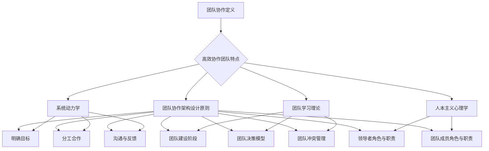

                 

### 文章标题：打造高效协作团队：从理论到实践

> 关键词：高效协作团队、团队协作、协作工具、实践方法、案例分析

> 摘要：本文旨在深入探讨高效协作团队的建设与实现，从理论到实践，结合实际案例，提供一整套系统化的团队协作方法论。文章首先介绍团队协作的核心概念与理论基础，随后详细阐述团队协作的架构设计与技术工具，并结合实践案例进行分析，最后给出团队协作的优化策略和最佳实践。

## 一、引言

在现代企业环境中，团队协作的重要性日益凸显。高效的团队协作不仅能提高工作效率，还能激发团队的创造力和创新能力，从而推动企业的发展。然而，如何打造一个高效协作的团队，仍然是一个复杂而富有挑战性的问题。本文将从理论到实践，系统地探讨高效协作团队的建设方法。

本文的结构如下：首先，在理论篇中，我们将介绍团队协作的核心概念与理论基础，包括团队协作的定义、高效协作团队的特点以及团队协作的理论基础。接着，在实践篇中，我们将详细讨论团队协作的架构设计原则、流程与方法，以及团队协作技术的应用场景。在案例分析篇中，我们将通过具体案例来分析团队协作的实际效果和成功经验。最后，在总结与优化篇中，我们将给出团队协作的优化策略和最佳实践。

## 二、理论篇

### 1.1 核心概念介绍

#### 1.1.1 团队协作的定义

团队协作是指团队成员为了共同的目标和利益，通过分工合作、相互沟通和协作，共同完成任务的行动过程。团队协作的核心在于“协作”二字，即团队成员之间的相互配合和共同努力。

#### 1.1.2 高效协作团队的特点

高效协作团队具有以下几个显著特点：

1. **明确的目标**：团队成员对共同目标有清晰的认识，并为之努力。
2. **良好的沟通**：团队成员之间保持有效沟通，能够及时交流信息、解决问题。
3. **分工合作**：团队成员根据各自的能力和特长进行分工，实现优势互补。
4. **积极互动**：团队成员之间有良好的互动关系，能够互相支持和鼓励。
5. **有效的决策**：团队成员能够共同参与决策过程，做出明智的决策。

### 1.2 团队协作的理论基础

#### 1.2.1 系统动力学

系统动力学是一种研究复杂系统动态行为的方法，它强调系统的整体性、反馈机制和动态演变。在团队协作中，系统动力学可以帮助我们理解团队内部的各种关系和相互作用，从而更好地进行团队管理。

#### 1.2.2 团队学习理论

团队学习理论认为，团队是一个学习和发展的整体，团队成员之间的相互学习和协作是提高团队绩效的关键。团队学习理论强调团队共享知识、共同成长的重要性。

#### 1.2.3 人本主义心理学

人本主义心理学强调人的自我实现和潜能开发。在团队协作中，人本主义心理学可以帮助我们理解团队成员的需求和动机，从而更好地激发他们的积极性和创造力。

### 1.3 核心概念联系

团队协作的核心概念之间存在着密切的联系。明确的目标是团队协作的基础，良好的沟通是团队协作的保障，分工合作和积极互动是团队协作的关键，而有效的决策则是团队协作的最终目标。系统动力学、团队学习理论和人本主义心理学为团队协作提供了理论基础，帮助我们更好地理解和实施团队协作。

### 2.2 团队协作架构设计原则

团队协作的架构设计原则主要包括明确目标、分工合作、沟通与反馈。

#### 2.2.1 明确目标

明确目标是团队协作的基础。团队成员需要明确共同的目标和任务，并了解各自的角色和职责。这有助于团队成员统一行动，提高工作效率。

#### 2.2.2 分工合作

分工合作是实现高效协作的重要手段。团队成员应根据各自的能力和特长进行分工，实现优势互补。分工合作不仅能够提高工作效率，还能激发团队成员的积极性和创造力。

#### 2.2.3 沟通与反馈

沟通与反馈是团队协作的保障。团队成员需要保持良好的沟通，及时交流信息、解决问题。同时，团队成员也需要接受反馈，不断改进自己的工作方法和态度。

### 2.3 团队协作流程与方法

团队协作的流程与方法主要包括团队建设的阶段、团队决策模型和团队冲突管理。

#### 2.3.1 团队建设的阶段

团队建设一般包括以下几个阶段：

1. **组建阶段**：确定团队目标、成员角色和职责。
2. **磨合阶段**：团队成员相互了解，建立信任和合作关系。
3. **稳定阶段**：团队成员之间形成稳定的工作模式，工作效率提高。
4. **优化阶段**：持续优化团队结构和流程，提高团队协作效率。

#### 2.3.2 团队决策模型

团队决策模型主要包括以下几种：

1. **民主决策**：团队成员共同参与决策，充分讨论，达成共识。
2. **集中决策**：由团队成员中的某个核心成员或领导者做出决策。
3. **分散决策**：团队成员根据自己的职责和权限，自主决策。

#### 2.3.3 团队冲突管理

团队冲突是不可避免的，关键在于如何管理和解决冲突。团队冲突管理的方法包括：

1. **沟通解决**：通过沟通，理解冲突的原因，找到解决问题的方法。
2. **协商解决**：团队成员之间进行协商，寻求共同利益。
3. **专家介入**：引入外部专家，帮助团队解决冲突。

## 三、团队协作技术工具

### 3.1 常用协作工具介绍

在团队协作中，技术工具的选择和使用至关重要。以下是几种常用的协作工具：

#### 3.1.1 项目管理工具

项目管理工具可以帮助团队跟踪项目进度、分配任务和资源，常用的项目管理工具有JIRA、Trello、Asana等。

#### 3.1.2 沟通协作工具

沟通协作工具可以帮助团队成员进行实时沟通、分享信息和协作，常用的沟通协作工具有Slack、Microsoft Teams、Zoom等。

#### 3.1.3 文档共享与版本控制工具

文档共享与版本控制工具可以帮助团队成员共享文档、协作编辑文档，并确保文档的一致性和版本控制，常用的文档共享与版本控制工具有Google Docs、Confluence、Git等。

### 3.2 团队协作技术的应用场景

#### 3.2.1 远程协作

在远程协作中，技术工具的选择和使用至关重要。远程协作工具可以帮助团队成员在不同地点进行协作，确保工作的顺利进行。常用的远程协作工具有Zoom、Slack、Trello等。

#### 3.2.2 分布式团队管理

分布式团队管理是指在多个地理位置上工作的团队进行有效管理。技术工具可以帮助团队管理者监控项目进度、分配任务、提供支持和反馈。常用的分布式团队管理工具有JIRA、Trello、Confluence等。

#### 3.2.3 团队敏捷开发

团队敏捷开发是一种快速响应市场变化的方法，技术工具可以帮助团队实现敏捷开发的流程和原则。常用的团队敏捷开发工具有JIRA、Trello、Asana等。

### 4.1 案例一：构建高效敏捷团队

#### 4.1.1 案例背景

某科技公司是一个快速发展的初创公司，团队成员分布在不同的城市。由于团队成员之间的沟通不畅和协作效率低下，公司的项目进度经常延误，导致客户满意度下降。为了解决这一问题，公司决定构建一个高效敏捷团队。

#### 4.1.2 实施过程

1. **确定团队目标**：公司明确了团队的共同目标，即提高项目进度、提高客户满意度。

2. **分工合作**：根据团队成员的特长和能力，将他们分配到不同的角色，如项目经理、开发人员、测试人员等。

3. **使用协作工具**：公司选择了JIRA作为项目管理工具，Slack作为沟通协作工具，Git作为版本控制工具。

4. **定期团队会议**：每周召开团队会议，讨论项目进度、解决问题和提供支持。

5. **敏捷开发流程**：公司采用了敏捷开发方法，每两周进行一次迭代，根据客户需求进行迭代开发。

#### 4.1.3 成果与反思

通过构建高效敏捷团队，公司的项目进度得到了明显提高，客户满意度也显著提升。团队成员之间的沟通更加顺畅，协作效率得到提升。然而，在实施过程中，公司也遇到了一些问题，如团队成员的异地协作存在一定的沟通障碍，部分团队成员对新工具的使用不够熟练。为了解决这些问题，公司采取了以下措施：

1. **加强沟通**：定期召开远程会议，确保团队成员之间的沟通畅通。

2. **培训**：为新团队成员提供工具使用培训，提高团队成员的使用熟练度。

3. **反馈机制**：建立反馈机制，及时收集团队成员的意见和建议，不断改进团队协作流程。

## 5.1 团队协作实践方法

#### 5.1.1 团队协作的启动与规划

团队协作的启动与规划是确保团队顺利运作的关键。以下是一些关键步骤：

1. **确定团队目标**：明确团队的目标和愿景，确保团队成员对目标有清晰的认识。

2. **招募团队成员**：根据团队目标，招募合适的团队成员，确保团队成员具备所需的技能和经验。

3. **明确角色和职责**：为每个团队成员分配明确的角色和职责，确保团队成员知道自己的工作内容和期望。

4. **制定团队章程**：团队章程是团队的规则和准则，应明确团队成员的权利和义务，以及团队的工作流程和决策机制。

#### 5.1.2 团队协作的执行与监控

团队协作的执行与监控是确保团队目标实现的关键。以下是一些关键步骤：

1. **召开团队会议**：定期召开团队会议，讨论项目进展、解决问题和提供支持。

2. **分配任务和资源**：根据项目需求，合理分配任务和资源，确保每个团队成员都有明确的工作任务。

3. **监控项目进度**：使用项目管理工具跟踪项目进度，及时发现并解决问题。

4. **提供反馈和支持**：及时为团队成员提供反馈和支持，帮助他们克服困难，提高工作效率。

#### 5.1.3 团队协作的总结与优化

团队协作的总结与优化是持续改进团队协作效率的关键。以下是一些关键步骤：

1. **总结协作过程**：在项目完成后，对协作过程进行总结，识别成功经验和不足之处。

2. **收集反馈和建议**：收集团队成员的反馈和建议，了解他们的感受和需求。

3. **优化协作流程**：根据总结和反馈，优化团队协作流程，提高协作效率。

4. **持续改进**：团队协作不是一次性的活动，而是一个持续改进的过程。应不断调整和优化协作方法，以适应团队和项目的变化。

### 5.2 团队成员的角色与职责

团队成员的角色与职责是确保团队协作顺利进行的基石。以下是一些关键角色和职责：

#### 5.2.1 领导者

领导者的职责包括：

1. **制定团队目标和计划**：明确团队的目标和愿景，制定详细的计划和时间表。
2. **指导团队成员**：提供指导和资源，确保团队成员了解自己的职责和目标。
3. **协调和解决冲突**：在团队内部协调资源和意见，解决潜在冲突。
4. **评估和反馈**：定期评估团队成员的表现，提供建设性的反馈。

#### 5.2.2 项目经理

项目经理的职责包括：

1. **项目规划**：制定项目计划，确保项目按时完成。
2. **资源分配**：合理分配团队成员的任务和资源，确保项目顺利进行。
3. **沟通协调**：确保团队成员之间的信息畅通，协调内部和外部资源。
4. **风险管理**：识别和应对项目中的风险。

#### 5.2.3 开发人员

开发人员的职责包括：

1. **编码实现**：根据需求进行编码和实现，确保代码的质量和性能。
2. **代码审查**：参与代码审查，确保代码的规范性和安全性。
3. **问题解决**：及时发现和解决编程过程中遇到的问题。
4. **文档编写**：编写和维护相关的技术文档。

#### 5.2.4 测试人员

测试人员的职责包括：

1. **测试计划**：制定测试计划和测试用例。
2. **执行测试**：执行测试用例，发现和报告缺陷。
3. **测试评估**：评估测试结果，为项目交付提供依据。
4. **测试报告**：编写详细的测试报告，包括测试结果和改进建议。

#### 5.2.5 设计师

设计师的职责包括：

1. **界面设计**：设计用户界面和用户体验。
2. **原型制作**：制作原型和交互设计。
3. **用户研究**：进行用户研究和用户测试。
4. **设计评审**：参与设计评审，提供专业建议。

#### 5.2.6 运维人员

运维人员的职责包括：

1. **系统部署**：部署和维护系统环境。
2. **性能监控**：监控系统性能，确保系统稳定运行。
3. **故障处理**：快速响应和处理系统故障。
4. **安全管理**：确保系统的安全性和数据保护。

### 7.1 案例分析一

#### 7.1.1 案例背景

某互联网公司是一家初创企业，团队成员分布在不同的城市。由于团队成员之间的沟通不畅和协作效率低下，公司的项目进度经常延误，导致客户满意度下降。为了改善团队协作状况，公司决定进行一次全面的团队协作优化。

#### 7.1.2 案例分析

1. **问题识别**：通过调查和访谈，公司识别出团队协作中的主要问题，包括沟通不畅、任务分配不合理、缺乏统一的协作工具等。

2. **解决方案**：
   - **沟通工具**：公司引入了Slack作为团队的沟通工具，确保团队成员能够实时交流和分享信息。
   - **项目管理工具**：公司选择了JIRA作为项目管理工具，用于任务分配、进度跟踪和报告生成。
   - **文档共享工具**：公司使用了Google Drive，用于共享和版本控制文档。

3. **实施过程**：
   - **培训**：公司对团队成员进行了工具使用培训，确保他们能够熟练使用新工具。
   - **反馈机制**：公司建立了反馈机制，定期收集团队成员对协作工具和流程的意见和建议。
   - **监督**：公司领导定期检查团队的协作情况，确保新工具和流程的有效实施。

4. **结果**：
   - **沟通效率**：团队成员之间的沟通变得更加高效，信息传递更加及时。
   - **任务分配**：任务分配更加合理，团队成员能够清楚地了解自己的职责。
   - **文档管理**：文档共享和版本控制变得更加便捷，确保了文档的一致性。

#### 7.1.3 启示与反思

1. **工具选择**：选择适合团队的协作工具是关键，工具应易于使用且满足团队需求。
2. **培训**：确保团队成员熟练使用协作工具，提高协作效率。
3. **反馈机制**：建立反馈机制，及时调整和优化协作流程。
4. **监督**：领导者的监督和支持是团队协作成功的关键。

### 7.2 案例分析二

#### 7.2.1 案例背景

某大型科技公司是一家国际化的企业，团队成员分布在不同的国家和地区。由于时差和文化差异，团队成员之间的沟通存在困难，导致项目进度缓慢，质量下降。为了解决这些问题，公司决定实施一系列改进措施。

#### 7.2.2 案例分析

1. **问题识别**：公司识别出团队协作中的主要问题，包括时差沟通、文化差异、任务理解不一致等。

2. **解决方案**：
   - **沟通工具**：公司引入了Zoom作为视频会议工具，确保团队成员能够实时沟通。
   - **项目管理工具**：公司选择了Asana作为项目管理工具，用于任务分配和进度跟踪。
   - **文化培训**：公司开展了文化培训，提高团队成员对跨文化沟通的理解。

3. **实施过程**：
   - **沟通策略**：公司制定了沟通策略，包括设立固定会议时间、使用国际化语言等。
   - **任务明确**：公司确保每个任务都有明确的描述和目标，避免误解。
   - **反馈机制**：公司建立了反馈机制，定期评估团队的协作效果。

4. **结果**：
   - **沟通效率**：团队成员之间的沟通变得更加高效，减少了时差和文化差异的影响。
   - **任务理解**：任务理解变得更加清晰，团队成员能够更好地执行任务。
   - **项目质量**：项目进度加快，质量得到提升。

#### 7.2.3 启示与反思

1. **沟通策略**：制定合适的沟通策略，确保团队成员能够有效沟通。
2. **任务明确**：确保每个任务都有明确的描述和目标，减少误解。
3. **文化培训**：提高团队成员对跨文化沟通的理解，促进团队协作。

### 附录A：团队协作工具与资源推荐

#### 1. 项目管理工具

- **JIRA**：一款功能强大的项目管理工具，适用于敏捷开发和任务跟踪。
- **Trello**：一款直观易用的项目管理工具，适用于任务列表和看板管理。
- **Asana**：一款适用于团队协作和任务管理的工具，支持多种视图和自定义工作流程。

#### 2. 沟通协作工具

- **Slack**：一款流行的团队沟通工具，支持实时消息、频道和文件共享。
- **Microsoft Teams**：一款集成式沟通工具，包括聊天、视频会议和协作功能。
- **Zoom**：一款专业的视频会议工具，适用于远程协作和在线培训。

#### 3. 文档共享与版本控制工具

- **Google Drive**：一款云存储和文档共享工具，支持实时协作和版本控制。
- **Confluence**：一款知识管理和协作工具，适用于文档共享和团队协作。
- **Git**：一款版本控制系统，适用于代码管理和协作开发。

### 附录B：团队协作相关书籍与论文推荐

#### 1. 书籍

- **《敏捷开发实践指南》**：作者：杰夫·萨瑟兰（Jeff Sutherland）
- **《团队协作工具与实践》**：作者：大卫·汉森（David J. Henshaw）
- **《人月神话》**：作者：弗雷德里克·布鲁克斯（Frederick P. Brooks）
- **《团队协作的五大障碍》**：作者：帕特里克·莱西尼（Patrick Lencioni）

#### 2. 论文

- **“The Mythical Man-Month”**：Frederick P. Brooks
- **“Agile Project Management”**：Jeff Sutherland
- **“Teamwork: Its Meaning, Measurement, and Effectiveness”**：David J. Henshaw
- **“Cross-Cultural Communication in Global Teams”**：Helena Haavy

### 作者信息

**作者：AI天才研究院/AI Genius Institute & 禅与计算机程序设计艺术 /Zen And The Art of Computer Programming** 

---

在撰写本文的过程中，我们深入探讨了高效协作团队的建设与实现。从理论篇到实践篇，再到案例分析篇，我们系统地介绍了团队协作的核心概念、理论基础、架构设计、技术工具以及实践方法。通过具体案例的分析，我们展示了如何在实际工作中应用这些理论和方法，从而打造一个高效协作的团队。

团队协作是一个持续改进的过程，需要领导者、团队成员以及组织的共同努力。在打造高效协作团队的过程中，我们需要关注以下几个方面：

1. **明确目标**：确保团队成员对共同目标有清晰的认识，并为之努力。
2. **有效沟通**：保持团队成员之间的有效沟通，确保信息的及时传递和问题的有效解决。
3. **分工合作**：根据团队成员的能力和特长进行合理分工，实现优势互补。
4. **积极互动**：鼓励团队成员之间的积极互动，建立良好的团队氛围。
5. **持续优化**：不断优化团队协作流程和方法，提高团队协作效率。

本文的核心概念和原理可以通过以下Mermaid流程图进行可视化展示：

通过上述流程图，我们可以清晰地看到团队协作的核心概念和原理之间的联系，有助于我们更好地理解和应用这些理论。

在文章的最后，我们推荐了一些团队协作工具和资源，以及相关的书籍和论文，供读者进一步学习和参考。通过本文的探讨，我们希望能够为读者提供一套系统化的团队协作方法论，帮助他们在实际工作中打造高效协作的团队。

**再次感谢读者对本文的关注，希望本文能够对您在团队协作方面有所启发和帮助。作者：AI天才研究院/AI Genius Institute & 禅与计算机程序设计艺术 /Zen And The Art of Computer Programming**。

