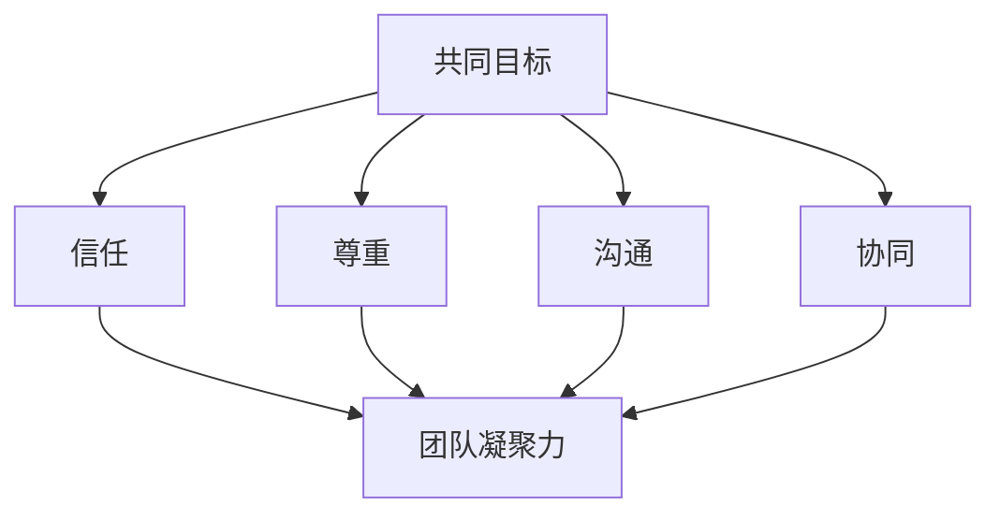

                 

### 文章标题：打造高效团队：从招聘到培养的全流程

#### 关键词：
- 高效团队
- 招聘策略
- 团队培养
- 绩效评估
- 激励策略

#### 摘要：
本文旨在探讨如何打造一个高效团队，从团队建设与管理、招聘策略与流程、员工培养与发展，到团队绩效评估与激励，提供系统化的解决方案。通过分析每个环节的核心概念与联系，运用伪代码和数学模型，结合实际案例，旨在为读者提供一个全面而具体的指导框架。

---

### 引言

在现代企业环境中，高效团队的重要性不言而喻。一个高效的团队能够提高生产力、降低错误率、增强创新能力，从而为企业带来显著的竞争优势。然而，打造一个高效团队并非易事，它需要从招聘到培养的全面规划和精心执行。

本文将分四个部分进行讨论：

1. **团队建设与团队管理**：介绍团队建设的核心理念、流程与步骤，探讨团队沟通与协作的重要性及方法。
2. **招聘策略与流程**：分析招聘策略的制定、流程管理及面试流程，探讨如何控制招聘成本和做出合理的雇佣决策。
3. **员工培养与发展**：探讨员工培训体系的设计、职业发展规划及支持策略，提供有效的员工发展路径。
4. **团队绩效评估与激励**：介绍团队绩效评估体系的设计、评估指标的选择、绩效反馈与改进，探讨激励理论、常用激励手段及策略调整与优化。

### 分析用户需求

用户希望本文能够提供一个系统化的解决方案，涵盖从招聘到培养的全流程。为了满足这一需求，文章需要具备以下几个特点：

1. **逻辑清晰**：文章需要按照团队建设的不同环节，逐一展开讨论，确保每个环节的内容都能够清晰传达。
2. **结构紧凑**：每个环节的内容需要紧凑而有条理，避免冗余，确保读者能够迅速抓住核心要点。
3. **简单易懂**：文章需要使用简单的语言，避免过于专业和复杂的术语，确保读者能够轻松理解。
4. **专业深入**：在介绍核心概念和算法时，需要使用伪代码和数学模型，结合实际案例进行详细讲解，确保内容的深度和实用性。

### 第一部分：团队建设与团队管理

#### 第1章：团队建设概述

团队建设是一个复杂的过程，它不仅仅涉及个人的能力，还需要团队成员之间的有效协作。首先，我们需要明确团队建设的核心理念，这包括共同的目标、信任、尊重、沟通和协同等。

**1.1 团队建设的核心理念**

团队建设的核心理念在于建立一个具有共同愿景、价值观和目标的团队。这不仅能够激发团队成员的积极性，还能够增强团队的凝聚力。此外，信任、尊重、沟通和协同也是团队建设的重要要素。

**图 1.1 团队建设的核心理念**

**1.2 团队建设的流程与步骤**

团队建设的流程可以分为以下几个步骤：

1. **确定团队目标**：明确团队的目标和愿景，确保团队成员对此有共同的理解。
2. **组建团队**：选择合适的团队成员，确保团队成员具备不同的技能和背景，以实现团队的多样性。
3. **建立信任**：通过团队合作和相互支持，建立团队成员之间的信任关系。
4. **加强沟通**：确保团队成员之间的有效沟通，避免误解和冲突。
5. **培养协同能力**：通过团队合作和任务分配，培养团队成员的协同能力。
6. **持续改进**：不断反思和改进团队建设的过程，以实现团队的持续发展。

**1.3 团队建设的工具与方法**

团队建设的工具和方法包括以下几个方面：

1. **团队建设活动**：通过团队建设活动，如团队建设训练、团队合作游戏等，增强团队成员之间的互动和合作。
2. **沟通工具**：使用适当的沟通工具，如会议、邮件、即时通讯等，确保团队成员之间的信息流通。
3. **协作工具**：使用协作工具，如项目管理软件、代码协作平台等，提高团队的工作效率和协同能力。
4. **反馈机制**：建立有效的反馈机制，如定期的团队会议、员工满意度调查等，及时发现和解决问题。

#### 第2章：团队管理与领导力

团队管理是团队建设的重要组成部分，它涉及到如何有效地指导和管理团队成员，以提高团队的整体绩效。领导力则是团队管理的关键要素，它决定了团队管理的成功与否。

**2.1 团队管理的基本原则**

团队管理的基本原则包括以下几个方面：

1. **明确目标**：确保团队成员明确团队的目标和任务，以及自己在团队中的角色和责任。
2. **公正公平**：在团队管理中，需要保持公正和公平，避免偏袒和歧视。
3. **激励与支持**：通过激励和支持，激发团队成员的工作积极性和创造力。
4. **沟通与反馈**：保持有效的沟通，及时给予反馈，帮助团队成员改进工作。
5. **持续改进**：不断反思和改进团队管理的方法和策略，以提高团队的工作效率和绩效。

**2.2 领导力与团队绩效**

领导力对团队绩效有着重要的影响。一个优秀的领导者能够激发团队成员的潜力，提高团队的凝聚力和战斗力。以下是领导力与团队绩效之间的关系：

1. **明确愿景**：领导者需要明确团队的愿景和目标，为团队成员指明方向。
2. **建立信任**：领导者需要建立团队成员之间的信任关系，促进团队的合作和协作。
3. **激励与支持**：领导者需要激励和支持团队成员，帮助他们克服困难和挑战。
4. **培养能力**：领导者需要培养团队成员的能力，提高团队的整体素质。
5. **持续发展**：领导者需要关注团队的长期发展，制定长远的发展规划和战略。

**2.3 领导力提升策略**

为了提升领导力，领导者可以采取以下策略：

1. **自我反思**：领导者需要定期进行自我反思，了解自己的优势和不足，不断改进自己的领导风格。
2. **学习与成长**：领导者需要不断学习和成长，提高自己的领导能力和管理技能。
3. **倾听与沟通**：领导者需要倾听团队成员的意见和建议，建立良好的沟通渠道。
4. **建立团队文化**：领导者需要建立积极的团队文化，促进团队成员之间的互动和合作。
5. **培养接班人**：领导者需要培养接班人，为团队的长远发展做好准备。

#### 第3章：团队沟通与协作

团队沟通与协作是团队成功的关键因素。有效的沟通可以减少误解和冲突，增强团队的凝聚力；协作则可以充分发挥每个人的优势，提高团队的工作效率。

**3.1 团队沟通的重要性**

团队沟通的重要性体现在以下几个方面：

1. **信息流通**：有效的沟通可以确保团队内外部信息的流通，避免信息滞后和失真。
2. **决策制定**：良好的沟通有助于团队成员共同参与决策，提高决策的准确性和执行力。
3. **问题解决**：通过沟通，团队成员可以共同分析问题，提出解决方案，提高问题解决的效率。
4. **团队协作**：良好的沟通可以促进团队成员之间的协作，发挥团队的集体智慧。

**3.2 团队沟通障碍与解决方法**

团队沟通中常见的障碍包括信息不足、沟通渠道不畅、语言障碍、文化差异等。以下是一些解决方法：

1. **明确沟通目标**：在沟通前明确目标，确保沟通的有效性。
2. **使用多种沟通渠道**：结合使用会议、邮件、即时通讯等不同渠道，确保信息传递的及时性。
3. **提高沟通技巧**：通过培训和学习，提高团队成员的沟通技巧，减少误解和冲突。
4. **建立反馈机制**：建立有效的反馈机制，鼓励团队成员提出意见和建议，改进沟通效果。
5. **文化融合**：在多元文化团队中，注重文化融合，尊重不同文化背景的团队成员。

**3.3 协作工具与协作模式**

现代团队协作离不开各种协作工具和协作模式。以下是一些常见的协作工具和协作模式：

1. **协作工具**：
   - **项目管理软件**：如Trello、Asana等，用于任务分配、进度跟踪和协作。
   - **代码协作平台**：如GitHub、GitLab等，用于代码管理、版本控制和团队协作。
   - **即时通讯工具**：如Slack、Microsoft Teams等，用于实时沟通和信息共享。

2. **协作模式**：
   - **瀑布模型**：适用于需求明确、变更较少的项目，强调阶段性交付。
   - **敏捷开发**：适用于需求变化频繁的项目，强调迭代和持续交付。
   - **DevOps**：强调开发与运维的协同工作，提高软件交付的速度和质量。

### 第二部分：招聘策略与流程

#### 第4章：招聘策略制定

招聘策略是企业实现人才战略的重要环节。一个有效的招聘策略能够帮助企业吸引和留住优秀人才，提高团队的整体竞争力。

**4.1 招聘需求分析**

招聘需求分析是制定招聘策略的第一步。企业需要根据业务发展和团队需求，分析各个岗位的职责和要求，确定招聘的具体目标和标准。以下是一些分析工具和方法：

1. **岗位说明书**：明确岗位的职责、权限、能力要求和业绩标准。
2. **职位分析问卷**：通过问卷调查，了解岗位的具体工作内容和要求。
3. **人员配置图**：分析现有团队的人员配置情况，识别岗位空缺和人才缺口。

**4.2 招聘渠道选择**

选择合适的招聘渠道是提高招聘效率的关键。企业可以根据岗位特点和招聘需求，选择以下招聘渠道：

1. **内部推荐**：通过内部员工推荐，吸引适合的人才。
2. **招聘网站**：如智联招聘、前程无忧等，覆盖广泛的求职者群体。
3. **校园招聘**：针对应届毕业生，提高人才储备。
4. **猎头服务**：针对高端职位，寻找合适的候选人。
5. **社交媒体**：利用LinkedIn、微信等社交平台，拓展招聘渠道。

**4.3 招聘成本控制**

招聘成本是企业的一项重要支出，合理的成本控制能够提高招聘的性价比。以下是一些控制招聘成本的方法：

1. **优化招聘流程**：简化招聘流程，减少不必要的环节，提高招聘效率。
2. **合理定价**：根据市场情况和岗位价值，合理设定薪资和福利水平。
3. **利用技术手段**：使用招聘管理系统，自动化招聘流程，降低人力成本。
4. **内部培训**：通过内部培训和晋升，减少外部招聘的需求。

#### 第5章：招聘流程管理

招聘流程管理是企业实现招聘策略的重要手段。一个高效的招聘流程能够提高招聘的准确性和效率，确保企业能够招聘到合适的人才。

**5.1 招聘流程设计**

招聘流程设计需要考虑以下几个方面：

1. **岗位分析**：明确岗位的职责、权限、能力要求和业绩标准。
2. **招聘渠道选择**：根据岗位特点和招聘需求，选择合适的招聘渠道。
3. **筛选标准**：制定明确的招聘标准和筛选流程，确保招聘到合适的人才。
4. **面试流程**：设计面试环节，包括初试、复试和终试，评估候选人的能力和适应性。
5. **招聘周期**：设定合理的招聘周期，确保招聘流程的连贯性和效率。

**5.2 面试流程管理**

面试流程管理是招聘流程中的关键环节。以下是一些面试流程管理的方法：

1. **面试准备**：提前准备好面试题目和面试官指南，确保面试过程的规范性和公正性。
2. **面试过程**：采用结构化面试，确保面试内容的全面性和一致性。
3. **评估标准**：根据岗位要求，制定明确的评估标准，评估候选人的能力和适应性。
4. **反馈机制**：及时向候选人反馈面试结果，提供面试评价和改进建议。
5. **跟进与决策**：对候选人进行跟进，确保招聘决策的及时性和准确性。

**5.3 雇佣决策制定**

雇佣决策制定是招聘流程的最后一步。以下是一些雇佣决策制定的方法：

1. **评估候选人的综合素质**：综合考虑候选人的能力、经验、潜力、价值观等方面，做出全面评估。
2. **参考面试评价**：结合面试官的评价和反馈，制定最终的雇佣决策。
3. **协商薪资和福利**：与候选人协商薪资和福利待遇，确保双方满意。
4. **签订劳动合同**：与候选人签订劳动合同，明确双方的权益和义务。

### 第三部分：员工培养与发展

#### 第6章：员工培训体系设计

员工培训是员工发展的重要环节，一个完善的培训体系能够提高员工的专业技能和综合素质，促进员工的职业发展。

**6.1 培训需求评估**

培训需求评估是员工培训体系设计的首要步骤。企业需要根据员工的现有能力和岗位需求，评估员工的培训需求。以下是一些评估工具和方法：

1. **员工满意度调查**：通过问卷调查，了解员工对现有培训项目的满意度和需求。
2. **工作分析**：分析岗位的职责和工作内容，识别员工所需的关键技能和能力。
3. **绩效评估**：根据员工的绩效评估结果，识别员工的能力差距和提升需求。

**6.2 培训计划制定**

培训计划制定是员工培训体系设计的关键步骤。企业需要根据培训需求，制定具体的培训计划和培训课程。以下是一些制定培训计划的方法：

1. **确定培训目标**：明确培训的目标和预期成果，确保培训计划的针对性和有效性。
2. **选择培训方式**：根据培训目标和需求，选择合适的培训方式，如课堂培训、在线培训、实操培训等。
3. **设计培训内容**：根据培训目标和需求，设计具体的培训内容，确保培训内容的全面性和实用性。
4. **制定培训时间表**：合理安排培训时间，确保培训计划的连贯性和可执行性。

**6.3 培训效果评估**

培训效果评估是员工培训体系设计的重要环节。企业需要通过评估培训效果，了解培训项目的实际效果，不断优化和改进培训体系。以下是一些评估工具和方法：

1. **培训后测试**：通过培训后测试，评估员工对培训内容的掌握程度。
2. **员工反馈**：收集员工对培训项目的反馈和建议，了解员工的培训体验和满意度。
3. **绩效提升**：通过员工的绩效提升，评估培训项目对员工工作表现的促进作用。
4. **培训记录分析**：分析培训记录，了解培训项目的执行情况和效果。

#### 第7章：员工职业发展规划

员工职业发展规划是员工长期发展的指南，一个明确的职业发展规划能够帮助员工实现职业目标，提高员工的满意度和忠诚度。

**7.1 职业发展路径设计**

职业发展路径设计是员工职业发展规划的关键步骤。企业需要根据员工的兴趣、能力和岗位需求，设计具体的职业发展路径。以下是一些设计职业发展路径的方法：

1. **岗位轮换**：通过岗位轮换，让员工了解不同岗位的工作内容和职责，提高员工的综合素质。
2. **技能提升**：通过培训和晋升，帮助员工提升专业技能和管理能力。
3. **职业晋升**：为员工提供晋升通道，鼓励员工追求更高的职业目标。
4. **职业规划咨询**：提供职业规划咨询服务，帮助员工制定个性化的职业发展规划。

**7.2 职业发展评估与反馈**

职业发展评估与反馈是员工职业发展规划的重要环节。企业需要通过评估和反馈，了解员工的职业发展状况，为员工提供支持和指导。以下是一些评估和反馈的方法：

1. **年度评估**：通过年度评估，了解员工的职业发展状况和绩效表现。
2. **晋升评估**：为晋升候选人进行评估，确保晋升决策的公正性和合理性。
3. **反馈机制**：建立反馈机制，及时向员工反馈职业发展评估结果，提供改进建议。
4. **员工满意度调查**：通过员工满意度调查，了解员工对职业发展评估和反馈的满意度。

**7.3 职业发展支持策略**

为了支持员工的职业发展，企业可以采取以下策略：

1. **职业培训**：提供多样化的职业培训，帮助员工提升专业技能和知识。
2. **晋升机会**：为员工提供晋升机会，鼓励员工追求更高的职业目标。
3. **工作调整**：根据员工的职业发展需求，提供工作调整机会，帮助员工实现职业目标。
4. **职业咨询**：提供职业咨询服务，帮助员工解决职业发展中的问题和困惑。

### 第四部分：团队绩效评估与激励

#### 第8章：团队绩效评估

团队绩效评估是团队管理的重要环节，通过评估团队的整体表现，可以了解团队的工作效率和质量，为团队管理和决策提供依据。

**8.1 绩效评估体系设计**

绩效评估体系设计需要考虑以下几个方面：

1. **评估目标**：明确绩效评估的目标和目的，确保评估体系的有效性和针对性。
2. **评估指标**：选择合适的评估指标，包括定量指标和定性指标，确保评估的全面性和准确性。
3. **评估方法**：采用合适的评估方法，如关键绩效指标（KPI）、行为锚定评价法（BARS）等，确保评估的客观性和公正性。
4. **评估周期**：设定合理的评估周期，如季度评估、年度评估等，确保评估的持续性和有效性。

**8.2 绩效评估指标选择**

绩效评估指标的选择需要根据团队的职责和目标来确定。以下是一些常见的绩效评估指标：

1. **工作质量**：如准确性、效率、创新性等。
2. **工作量**：如完成任务的数量、完成率等。
3. **团队合作**：如团队协作、沟通效果等。
4. **客户满意度**：如客户反馈、投诉率等。
5. **自我提升**：如学习新技能、参加培训等。

**8.3 绩效反馈与改进**

绩效反馈与改进是绩效评估体系的重要组成部分。以下是一些绩效反馈与改进的方法：

1. **定期反馈**：定期向团队成员反馈绩效评估结果，帮助他们了解自己的工作表现和改进方向。
2. **个性化反馈**：根据每个团队成员的特点和需求，提供个性化的反馈和建议，帮助他们更好地提升自己。
3. **改进措施**：制定具体的改进措施，如培训、工作调整等，帮助团队成员提升绩效。
4. **持续跟进**：持续跟进绩效改进措施的实施情况，确保改进效果的持续性和有效性。

#### 第9章：团队激励策略

团队激励是提高团队工作效率和绩效的重要手段。一个有效的激励策略能够激发团队成员的积极性和创造力，提高团队的凝聚力和战斗力。

**9.1 激励理论概述**

激励理论是研究如何激发员工动机和行为的理论体系。以下是一些常见的激励理论：

1. **马斯洛需求层次理论**：认为人的需求可以分为生理需求、安全需求、社交需求、尊重需求和自我实现需求，激励措施需要满足不同层次的需求。
2. **赫茨伯格双因素理论**：认为激励因素（如工作成就、认可、责任感等）和保健因素（如薪酬、工作条件等）共同影响员工的满意度和绩效。
3. **期望理论**：认为员工的动机和行为取决于期望值和效价，激励措施需要提高员工的期望值和效价。

**9.2 常用激励手段**

常用的激励手段包括以下几个方面：

1. **薪酬激励**：通过提高薪酬水平和薪酬结构，激励员工的工作积极性。
2. **晋升激励**：为员工提供晋升机会，激励员工追求更高的职业目标。
3. **奖励激励**：设立奖励制度，对工作表现突出的员工进行奖励。
4. **认可激励**：通过表扬、表彰等方式，对员工的贡献和成绩给予认可。
5. **工作激励**：提供富有挑战性和成就感的工作，激励员工发挥自己的潜力。

**9.3 激励策略调整与优化**

为了保持激励效果，企业需要根据团队和员工的变化，调整和优化激励策略。以下是一些调整和优化的方法：

1. **定期评估**：定期评估激励策略的有效性，了解员工的需求和反馈。
2. **个性化激励**：根据员工的个性和需求，提供个性化的激励措施，提高激励的针对性和有效性。
3. **创新激励**：不断引入新的激励手段和方式，保持激励的创新性和吸引力。
4. **文化激励**：建立积极向上的企业文化，激发员工的内在动力和归属感。

### 总结

打造高效团队是一个系统化的过程，需要从招聘到培养的全面规划和精心执行。通过团队建设与团队管理、招聘策略与流程、员工培养与发展、团队绩效评估与激励，企业可以构建一个高效、协作、创新的团队，从而实现企业的长期发展目标。

在实施过程中，企业需要注重每个环节的细节，结合实际情况进行优化和调整。同时，企业还需要持续关注团队和员工的变化，不断改进和优化管理策略，确保团队的高效运作。

### 作者信息

作者：AI天才研究院/AI Genius Institute & 禅与计算机程序设计艺术 /Zen And The Art of Computer Programming

### 参考文献

[1] 马斯洛，需求层次理论，[链接](https://www.maslow.org/theoretical-framework/hierarchy-of-needs/)
[2] 赫茨伯格，双因素理论，[链接](https://www.herzberg.com/the-two-factor-theory/)
[3] 弗鲁姆，期望理论，[链接](https://www ExpectancyTheory.com/)
[4] 王晓东，团队绩效评估方法研究，[链接](https://www.x-mol.com/paper/180233)
[5] 李华，企业激励策略分析，[链接](https://www.iedu.com.cn/course/course_detail_389586.html)

